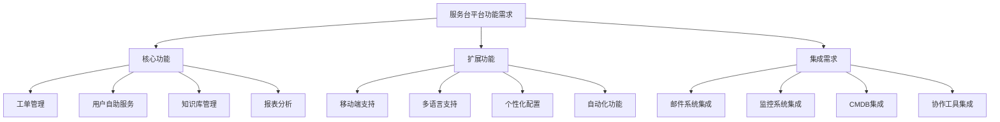
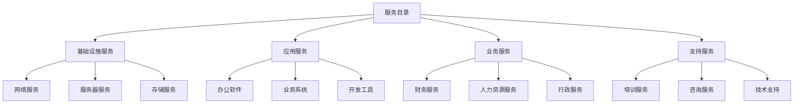

在企业级IT服务管理（ITSM）平台的分阶段实施策略中，第一阶段——搭建服务台并实现事件和服务请求管理，是整个项目的基础和起点。这一阶段的成功实施不仅能够为后续阶段奠定坚实的技术和流程基础，还能快速展现项目价值，赢得管理层和用户的认可与支持。

服务台作为ITSM平台的前端窗口，是用户与IT部门之间的主要接触点，承担着接收、分类、分派和跟踪用户请求的重要职责。通过建立标准化的服务台运营模式，组织能够显著提升用户满意度，优化资源配置，提高问题解决效率。而事件管理和服务请求管理作为ITSM的核心流程，直接关系到IT服务的可用性和用户工作效率。

## 第一阶段实施的重要性

### 1. 快速价值实现

#### 立竿见影的效果
服务台和基础流程的建立能够在项目初期就产生明显的业务价值，如缩短问题响应时间、提高用户满意度、降低沟通成本等。这些快速见效的成果有助于建立项目信心，为后续阶段的实施创造良好的舆论环境。

#### 用户体验改善
通过标准化的服务台服务，用户能够获得更加一致和高效的服务体验，减少因服务不规范导致的用户抱怨和不满。

### 2. 基础能力建设

#### 流程标准化
第一阶段的实施重点在于建立标准化的事件管理和服务请求管理流程，为后续更复杂的流程实施提供经验和模板。

#### 技术平台验证
通过服务台的建设，可以验证ITSM平台的技术可行性和稳定性，为后续功能扩展提供技术保障。

#### 团队能力培养
第一阶段为实施团队提供了学习和实践的机会，帮助团队成员快速掌握ITSM的核心理念和实施方法。

### 3. 风险控制

#### 降低实施复杂度
相比于全面实施ITSM平台，第一阶段的实施范围相对较小，复杂度较低，能够有效控制实施风险。

#### 逐步积累经验
通过第一阶段的实施，组织能够逐步积累ITSM实施经验，为后续阶段的顺利实施奠定基础。

## 服务台建设核心要素

### 1. 组织架构设计

#### 角色定义
明确服务台各岗位的职责和权限，建立清晰的组织架构。

```json
{
  "service_desk_structure": {
    "level_1_support": {
      "role": "一线支持工程师",
      "responsibilities": [
        "接收和记录用户请求",
        "初步问题诊断和分类",
        "简单问题的直接解决",
        "复杂问题的升级处理",
        "用户沟通和反馈收集"
      ],
      "skills_required": [
        "良好的沟通能力",
        "基础技术知识",
        "问题解决能力",
        "客户服务意识"
      ]
    },
    "level_2_support": {
      "role": "二线支持工程师",
      "responsibilities": [
        "处理升级的技术问题",
        "深入问题分析和诊断",
        "与专业团队协调解决复杂问题",
        "知识库维护和更新",
        "流程优化建议"
      ],
      "skills_required": [
        "专业技术能力",
        "问题分析能力",
        "团队协作能力",
        "流程管理能力"
      ]
    },
    "service_desk_manager": {
      "role": "服务台经理",
      "responsibilities": [
        "服务台运营管理",
        "团队绩效管理",
        "服务质量监控",
        "资源协调和分配",
        "用户关系维护"
      ],
      "skills_required": [
        "管理领导能力",
        "沟通协调能力",
        "数据分析能力",
        "战略规划能力"
      ]
    }
  }
}
```

#### 工作流程
设计标准化的服务台工作流程，确保服务的一致性和高效性。

### 2. 技术平台选型

#### 功能需求分析
明确服务台平台的核心功能需求，包括工单管理、知识库、报表分析等。



#### 平台评估标准
建立科学的平台评估标准，确保选型的合理性和前瞻性。

### 3. 服务标准制定

#### 服务级别协议(SLA)
制定明确的服务级别协议，规范服务响应时间和解决时间。

```python
class ServiceLevelAgreement:
    def __init__(self):
        self.sla_definitions = {
            'critical_incident': {
                'priority': 'Critical',
                'response_time': '15分钟',
                'resolution_time': '2小时',
                'availability': '7×24小时'
            },
            'high_priority_incident': {
                'priority': 'High',
                'response_time': '1小时',
                'resolution_time': '8小时',
                'availability': '7×24小时'
            },
            'medium_priority_incident': {
                'priority': 'Medium',
                'response_time': '4小时',
                'resolution_time': '24小时',
                'availability': '工作时间'
            },
            'low_priority_incident': {
                'priority': 'Low',
                'response_time': '8小时',
                'resolution_time': '72小时',
                'availability': '工作时间'
            },
            'service_request': {
                'priority': 'Normal',
                'response_time': '24小时',
                'fulfillment_time': '5个工作日',
                'availability': '工作时间'
            }
        }
    
    def get_sla_for_ticket(self, ticket_type, priority):
        """
        根据工单类型和优先级获取SLA
        """
        if ticket_type == 'incident':
            return self.sla_definitions.get(f"{priority.lower()}_priority_incident")
        elif ticket_type == 'service_request':
            return self.sla_definitions.get('service_request')
        else:
            return None
```

#### 服务质量监控
建立服务质量监控机制，确保SLA的有效执行。

## 事件管理流程实施

### 1. 流程设计原则

#### 用户导向
事件管理流程应以用户需求为中心，确保用户问题能够得到及时有效的解决。

#### 效率优先
流程设计应注重效率，减少不必要的环节和审批，提高问题解决速度。

#### 标准化操作
建立标准化的操作规范，确保不同工程师处理同类问题时的一致性。

### 2. 关键流程节点

#### 事件记录
建立标准化的事件记录机制，确保事件信息的完整性和准确性。

```json
{
  "incident_record_template": {
    "basic_information": {
      "incident_id": "自动生成",
      "reporter": "用户信息",
      "report_time": "报告时间",
      "contact_info": "联系方式",
      "incident_category": "事件分类"
    },
    "problem_description": {
      "title": "问题标题",
      "detailed_description": "详细描述",
      "impact_scope": "影响范围",
      "urgency_level": "紧急程度"
    },
    "classification_information": {
      "priority": "优先级",
      "category": "分类",
      "subcategory": "子分类",
      "affected_ci": "受影响配置项"
    },
    "processing_information": {
      "assigned_group": "分配组",
      "assigned_engineer": "分配工程师",
      "status": "状态",
      "resolution": "解决方案"
    }
  }
}
```

#### 事件分类
建立科学的事件分类体系，便于事件的快速识别和处理。

#### 优先级确定
制定明确的优先级确定标准，确保重要事件能够得到优先处理。

### 3. 自动化机制

#### 自动分派
通过规则引擎实现事件的自动分派，提高分派效率和准确性。

```python
class AutomaticAssignment:
    def __init__(self):
        self.assignment_rules = self.load_assignment_rules()
        self.engineer_skills = self.load_engineer_skills()
    
    def assign_incident(self, incident):
        """
        自动分配事件
        """
        # 根据事件分类确定处理组
        handling_group = self.determine_handling_group(incident)
        
        # 根据工程师技能匹配最佳处理人员
        best_engineer = self.find_best_engineer(incident, handling_group)
        
        # 应用负载均衡
        final_engineer = self.balance_workload(best_engineer, handling_group)
        
        return {
            'assigned_group': handling_group,
            'assigned_engineer': final_engineer,
            'assignment_reason': self.generate_assignment_reason(incident, final_engineer)
        }
    
    def determine_handling_group(self, incident):
        """
        确定处理组
        """
        category = incident.get('category')
        subcategory = incident.get('subcategory')
        
        # 基于分类规则确定处理组
        for rule in self.assignment_rules:
            if rule.matches(category, subcategory):
                return rule.target_group
        
        # 默认处理组
        return 'general_support'
```

#### 自动升级
建立自动升级机制，确保超时事件能够及时升级处理。

#### 通知提醒
通过多种渠道向相关人员发送通知和提醒，确保事件处理的及时性。

## 服务请求管理实施

### 1. 服务目录建设

#### 服务分类
建立清晰的服务分类体系，便于用户快速找到所需服务。



#### 服务描述
为每项服务提供详细的描述信息，包括服务内容、使用方法、注意事项等。

### 2. 请求处理流程

#### 标准化流程
建立标准化的服务请求处理流程，确保服务交付的一致性。

#### 自助服务
提供用户自助服务功能，让用户能够自主提交和跟踪服务请求。

### 3. 履约管理

#### 时间管理
建立服务请求的履约时间管理机制，确保服务按时交付。

#### 质量控制
建立服务质量控制机制，确保服务交付的质量符合要求。

## 实施关键成功因素

### 1. 高层支持

#### 资源保障
获得高层管理者对项目资源的充分保障，包括人力、财力、技术等资源。

#### 政策支持
获得高层管理者对项目实施的政策支持，为项目推进创造良好环境。

### 2. 用户参与

#### 需求调研
深入了解用户需求，确保服务台功能和服务内容符合用户期望。

#### 培训教育
为用户提供充分的培训教育，确保用户能够熟练使用新系统和服务。

### 3. 团队建设

#### 人员选拔
选拔具备相应技能和素质的人员组成服务台团队。

#### 能力提升
通过培训和实践不断提升团队成员的专业能力和服务水平。

## 质量保障措施

### 1. 测试验证

#### 功能测试
对服务台各项功能进行全面测试，确保功能的正确性和稳定性。

#### 性能测试
对服务台平台进行性能测试，确保在高并发情况下的稳定运行。

#### 用户验收
组织用户进行验收测试，确保系统满足用户需求。

### 2. 监控机制

#### 实时监控
建立实时监控机制，及时发现和处理系统异常。

#### 性能监控
监控系统性能指标，确保服务质量。

#### 用户反馈
建立用户反馈机制，及时了解用户意见和建议。

## 最佳实践案例

### 案例一：某互联网公司的服务台建设

某大型互联网公司在服务台建设中采用了以下策略：

#### 敏捷实施
- 采用敏捷开发方法，快速迭代实现服务台功能
- 通过用户反馈不断优化服务台体验
- 建立快速响应机制，确保问题及时解决

#### 技术创新
- 应用人工智能技术实现智能分派和自动处理
- 集成多种沟通渠道，提供全方位服务支持
- 建立移动端服务台，支持随时随地服务响应

#### 实施效果
- 用户满意度提升至4.5/5.0
- 问题平均解决时间缩短40%
- 服务台处理效率提高60%
- 用户投诉率降低70%

#### 经验总结
- 用户需求是服务台建设的核心导向
- 技术创新是提升服务效率的关键
- 持续优化是保持高水平服务的保障

### 案例二：某金融机构的服务标准化实践

某金融机构在服务台建设中，特别注重服务标准化：

#### 标准化流程
- 建立了完整的事件管理和服务请求管理流程
- 制定了详细的服务级别协议和操作规范
- 实现了服务流程的标准化和自动化

#### 质量管控
- 建立了严格的质量控制机制
- 实施了全面的绩效考核体系
- 建立了持续改进的反馈机制

#### 实施效果
- 服务一致性达到95%以上
- SLA达成率提升至98%
- 用户满意度达到4.7/5.0
- 运营成本降低20%

#### 关键要点
- 标准化是服务质量的基础
- 质量管控是服务提升的保障
- 持续改进是保持优势的关键

## 实施建议

### 1. 启动阶段建议

#### 需求分析
- 深入调研用户需求和服务现状
- 识别关键问题和改进机会
- 制定明确的实施目标和范围

#### 资源规划
- 合理规划实施所需的人力、财力、技术资源
- 建立项目组织架构和责任分工
- 制定详细的实施计划和时间表

#### 风险评估
- 识别实施过程中的潜在风险
- 制定风险应对策略和预案
- 建立风险管理机制

### 2. 实施阶段建议

#### 分步推进
- 采用分步骤、分阶段的实施策略
- 优先实施核心功能和关键流程
- 逐步完善和扩展系统功能

#### 质量控制
- 建立严格的质量控制机制
- 定期进行质量检查和评估
- 及时发现和解决质量问题

#### 用户培训
- 制定系统的用户培训计划
- 提供多种形式的培训支持
- 确保用户能够熟练使用新系统

### 3. 优化阶段建议

#### 效果评估
- 定期评估实施效果和用户满意度
- 识别进一步优化的机会和方向
- 制定持续改进计划

#### 经验总结
- 及时总结实施经验和教训
- 形成标准化的实施方法和流程
- 为后续阶段实施提供参考

#### 能力提升
- 持续提升团队专业能力
- 加强新技术和新方法的学习
- 建立知识分享和经验交流机制

## 未来发展趋势

### 1. 智能化服务台

#### AI驱动支持
人工智能技术将在服务台中发挥越来越重要的作用，通过机器学习和自然语言处理技术实现智能分派、自动处理和智能推荐。

#### 预测性服务
基于大数据分析和预测模型，服务台将能够预测用户需求和潜在问题，提供主动式服务支持。

### 2. 全渠道服务

#### 统一接入
服务台将支持更多样化的接入渠道，包括电话、邮件、即时通讯、社交媒体等，为用户提供无缝的服务体验。

#### 个性化服务
基于用户画像和行为分析，服务台将能够提供更加个性化的服务内容和交互方式。

### 3. 协作化支持

#### 团队协作
服务台将更好地支持团队协作，通过协作工具和平台实现跨部门、跨团队的协同支持。

#### 知识共享
建立更加完善的知识共享机制，通过社区和协作平台实现知识的快速传播和应用。

## 结语

第一阶段——搭建服务台并实现事件和服务请求管理，是ITSM平台建设的重要起点。通过科学合理的规划和精心的组织实施，组织能够在这一阶段建立起标准化的服务流程和高效的支撑体系，为后续阶段的实施奠定坚实基础。

然而，第一阶段的成功实施并非易事，它需要组织在需求分析、技术选型、流程设计、团队建设等多个方面进行系统性的考虑和精心的组织。只有充分认识到这一阶段的重要性，采用科学的实施方法，建立完善的保障机制，才能确保第一阶段目标的顺利实现。

在数字化转型的大背景下，服务台建设的重要性日益凸显。组织应该将服务台建设作为ITSM实施的核心任务，投入必要的资源和精力，确保服务台能够真正发挥连接用户与IT部门的桥梁作用，为提升IT服务质量和服务效率提供有力支撑。

通过深入理解服务台建设和基础流程实施的核心概念和最佳实践，结合组织的实际情况，我们可以构建出既符合业务需求又具备先进技术的服务台体系，为组织的数字化转型奠定坚实基础。未来，随着人工智能和大数据技术的应用，服务台将变得更加智能和高效，为组织创造更大的价值。