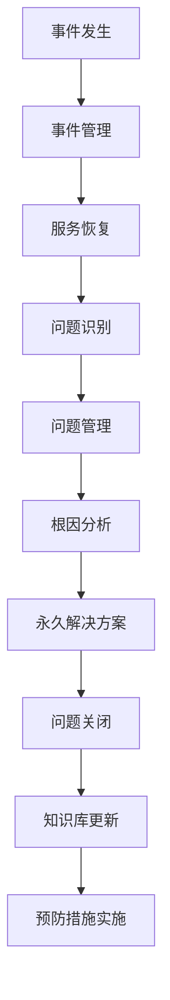
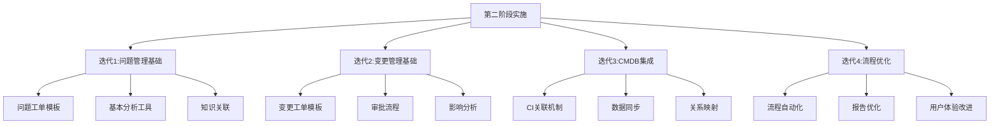

在企业级IT服务管理（ITSM）平台建设的分阶段实施策略中，第二阶段——落地问题管理和变更管理并集成CMDB，是整个项目从基础功能向核心能力演进的关键环节。这一阶段的成功实施不仅能够显著提升IT服务的稳定性和可靠性，还能通过与CMDB的深度集成，实现配置信息与服务管理流程的有机融合，为后续的智能化运维奠定坚实基础。

问题管理和变更管理作为ITIL框架中的两大核心流程，直接关系到IT环境的稳定性和服务质量。而CMDB（配置管理数据库）作为ITSM平台的数据基石，其与核心流程的集成程度决定了整个平台的价值实现水平。第二阶段的实施需要在第一阶段成功经验的基础上，进一步深化流程设计，完善技术实现，强化数据治理。

## 第二阶段实施的战略意义

### 1. 从被动响应到主动预防

#### 根因分析与解决
问题管理流程的核心价值在于通过对事件的深入分析，识别和解决根本原因，从而预防同类事件的再次发生。相比于事件管理关注于快速恢复服务，问题管理更注重长期的系统稳定性改进。



#### 价值创造转变
通过问题管理的实施，IT部门的角色从被动的"救火队员"转变为积极的"系统优化师"，能够主动识别和消除系统中的薄弱环节，从根本上提升服务质量。

### 2. 从无序变更到受控变更

#### 变更风险管控
变更管理流程通过标准化的变更审批、实施和回顾机制，有效控制了变更带来的风险，避免了因随意变更导致的系统不稳定和服务中断。

#### 效率与安全平衡
现代IT环境要求快速响应业务需求，变更管理需要在效率和安全之间找到平衡点，既要支持敏捷的业务创新，又要确保变更的安全可控。

### 3. 数据驱动的管理决策

#### 配置信息价值释放
CMDB中存储的配置信息只有与流程紧密结合时才能发挥真正的价值。通过与问题管理和变更管理的集成，配置信息能够为故障分析、变更影响评估提供数据支撑。

#### 管理决策科学化
基于准确的配置信息和流程数据，管理层能够做出更加科学的决策，如容量规划、系统升级、技术路线选择等。

## 问题管理流程深度实施

### 1. 流程架构设计

#### 问题生命周期管理
问题管理流程需要覆盖从问题识别到问题关闭的完整生命周期，确保每个环节都有明确的操作规范和质量标准。

```json
{
  "problem_lifecycle": {
    "stages": [
      {
        "stage": "问题识别",
        "activities": [
          "重复事件分析",
          "重大事件回顾",
          "用户反馈分析",
          "性能指标异常检测"
        ],
        "responsible_roles": ["服务台经理", "一线支持工程师"],
        "key_metrics": ["问题识别及时性", "问题识别准确率"]
      },
      {
        "stage": "问题记录",
        "activities": [
          "问题工单创建",
          "相关信息关联",
          "初步影响评估",
          "优先级确定"
        ],
        "responsible_roles": ["问题经理", "服务台经理"],
        "key_metrics": ["问题记录完整性", "关联准确性"]
      },
      {
        "stage": "问题调查与诊断",
        "activities": [
          "根因分析",
          "临时解决方案制定",
          "根本解决方案设计",
          "资源需求评估"
        ],
        "responsible_roles": ["问题经理", "技术支持团队", "开发团队"],
        "key_metrics": ["诊断准确性", "解决方案可行性"]
      },
      {
        "stage": "问题解决",
        "activities": [
          "解决方案实施",
          "效果验证",
          "知识库更新",
          "相关方通知"
        ],
        "responsible_roles": ["变更经理", "问题经理", "实施团队"],
        "key_metrics": ["解决成功率", "解决时效性"]
      },
      {
        "stage": "问题关闭",
        "activities": [
          "解决方案回顾",
          "经验教训总结",
          "流程改进建议",
          "问题工单关闭"
        ],
        "responsible_roles": ["问题经理", "流程改进专员"],
        "key_metrics": ["关闭及时性", "改进建议质量"]
      }
    ]
  }
}
```

#### 问题分类体系
建立科学的问题分类体系，有助于问题的快速识别、分派和解决。

### 2. 核心技术实现

#### 问题检测机制
```python
class ProblemDetectionEngine:
    def __init__(self):
        self.detection_rules = self.load_detection_rules()
        self.notification_service = NotificationService()
    
    def detect_problems(self):
        """
        检测潜在问题
        """
        # 重复事件检测
        repeated_incidents = self.detect_repeated_incidents()
        for incident in repeated_incidents:
            self.create_problem_from_incident(incident)
        
        # 性能异常检测
        performance_anomalies = self.detect_performance_anomalies()
        for anomaly in performance_anomalies:
            self.create_problem_from_anomaly(anomaly)
        
        # 用户反馈分析
        user_feedback_issues = self.analyze_user_feedback()
        for issue in user_feedback_issues:
            self.create_problem_from_feedback(issue)
    
    def detect_repeated_incidents(self):
        """
        检测重复事件
        """
        # 查询近期事件数据
        recent_incidents = incident_service.get_incidents_last_n_days(30)
        
        # 按相似性分组
        grouped_incidents = self.group_similar_incidents(recent_incidents)
        
        # 识别重复模式
        repeated_patterns = []
        for group in grouped_incidents:
            if len(group) >= 3:  # 3次以上重复
                repeated_patterns.append(group)
        
        return repeated_patterns
    
    def create_problem_from_incident(self, incident_group):
        """
        基于重复事件创建问题
        """
        problem_data = {
            "title": f"重复事件问题：{incident_group[0].title}",
            "description": self.generate_problem_description(incident_group),
            "priority": self.calculate_problem_priority(incident_group),
            "related_incidents": [inc.id for inc in incident_group],
            "status": "New",
            "detected_by": "Auto-Detection"
        }
        
        # 创建问题工单
        problem_id = problem_service.create_problem(problem_data)
        
        # 发送通知
        self.notification_service.send_problem_notification(problem_id)
        
        return problem_id
```

#### 根因分析工具
建立根因分析工具箱，支持多种分析方法：

```python
class RootCauseAnalysisToolkit:
    def __init__(self):
        self.analysis_methods = {
            "5_whys": self.five_whys_analysis,
            "fishbone": self.fishbone_analysis,
            "pareto": self.pareto_analysis,
            "fault_tree": self.fault_tree_analysis
        }
    
    def five_whys_analysis(self, problem_description):
        """
        5个为什么分析法
        """
        questions = []
        current_question = f"为什么会出现这个问题：{problem_description}？"
        questions.append(current_question)
        
        for i in range(5):
            # 这里应该与用户交互获取答案
            # 为演示目的，使用模拟答案
            answer = self.get_simulated_answer(i)
            questions.append(f"为什么{answer}？")
        
        return questions
    
    def fishbone_analysis(self, problem_description):
        """
        鱼骨图分析法
        """
        categories = ["人员", "机器", "材料", "方法", "环境", "测量"]
        fishbone_diagram = {
            "problem": problem_description,
            "categories": {}
        }
        
        for category in categories:
            fishbone_diagram["categories"][category] = self.get_factors_for_category(category)
        
        return fishbone_diagram
    
    def pareto_analysis(self, incident_data):
        """
        帕累托分析法
        """
        # 按频率排序
        sorted_data = sorted(incident_data.items(), key=lambda x: x[1], reverse=True)
        
        # 计算累计百分比
        total = sum([count for _, count in sorted_data])
        cumulative_percentage = 0
        pareto_data = []
        
        for item, count in sorted_data:
            percentage = (count / total) * 100
            cumulative_percentage += percentage
            pareto_data.append({
                "item": item,
                "count": count,
                "percentage": percentage,
                "cumulative_percentage": cumulative_percentage
            })
        
        return pareto_data
```

### 3. 知识管理集成

#### 问题知识库建设
```python
class ProblemKnowledgeBase:
    def __init__(self):
        self.knowledge_repository = KnowledgeRepository()
        self.problem_service = ProblemService()
    
    def create_problem_knowledge(self, problem_id):
        """
        基于问题创建知识条目
        """
        # 获取问题详细信息
        problem = self.problem_service.get_problem(problem_id)
        
        # 提取关键信息
        knowledge_content = {
            "title": f"问题解决方案：{problem.title}",
            "category": "问题解决",
            "tags": self.extract_tags(problem),
            "content": self.generate_knowledge_content(problem),
            "related_problems": problem.related_problems,
            "related_incidents": problem.related_incidents,
            "solution_steps": problem.solution_steps,
            "prevention_measures": problem.prevention_measures,
            "author": problem.owner,
            "review_status": "待审核",
            "publish_status": "草稿"
        }
        
        # 创建知识条目
        knowledge_id = self.knowledge_repository.create_knowledge(knowledge_content)
        
        # 关联到问题
        self.problem_service.link_knowledge_to_problem(problem_id, knowledge_id)
        
        return knowledge_id
    
    def generate_knowledge_content(self, problem):
        """
        生成知识内容
        """
        content = f"""
# {problem.title}

## 问题描述
{problem.description}

## 根因分析
{problem.root_cause_analysis}

## 解决方案
{problem.solution_description}

## 实施步骤
{self.format_solution_steps(problem.solution_steps)}

## 预防措施
{self.format_prevention_measures(problem.prevention_measures)}

## 相关信息
- 相关事件：{', '.join(problem.related_incidents)}
- 相关问题：{', '.join(problem.related_problems)}
- 实施日期：{problem.resolution_date}
- 负责人：{problem.owner}
"""
        return content
```

## 变更管理流程全面落地

### 1. 变更分类与标准

#### 变更类型定义
建立清晰的变更分类体系，有助于变更的标准化管理和风险控制。

```json
{
  "change_categories": {
    "standard_change": {
      "description": "预授权的低风险变更",
      "characteristics": [
        "风险低",
        "影响范围小",
        "流程标准化",
        "可预授权"
      ],
      "approval_process": "自动批准",
      "implementation_time": "随时实施",
      "documentation": "标准操作程序(SOP)",
      "examples": [
        "密码重置脚本更新",
        "用户权限调整",
        "常规补丁安装"
      ]
    },
    "normal_change": {
      "description": "需要评估和审批的常规变更",
      "characteristics": [
        "中等风险",
        "影响范围中等",
        "需要评估",
        "需要审批"
      ],
      "approval_process": "变更顾问委员会(CAB)审批",
      "implementation_time": "计划窗口实施",
      "documentation": "详细变更计划",
      "examples": [
        "服务器配置调整",
        "应用程序升级",
        "网络配置变更"
      ]
    },
    "emergency_change": {
      "description": "紧急修复变更",
      "characteristics": [
        "高风险",
        "紧急实施",
        "事后审批",
        "影响重大"
      ],
      "approval_process": "紧急变更审批",
      "implementation_time": "立即实施",
      "documentation": "紧急变更记录",
      "examples": [
        "安全漏洞修复",
        "严重故障修复",
        "业务中断恢复"
      ]
    }
  }
}
```

#### 变更风险评估模型
```python
class ChangeRiskAssessment:
    def __init__(self):
        self.risk_factors = self.load_risk_factors()
        self.impact_assessment = ImpactAssessment()
    
    def assess_change_risk(self, change_request):
        """
        评估变更风险
        """
        # 技术风险评估
        technical_risk = self.assess_technical_risk(change_request)
        
        # 业务影响评估
        business_impact = self.assess_business_impact(change_request)
        
        # 实施风险评估
        implementation_risk = self.assess_implementation_risk(change_request)
        
        # 综合风险评分
        overall_risk = self.calculate_overall_risk(
            technical_risk, 
            business_impact, 
            implementation_risk
        )
        
        # 风险等级确定
        risk_level = self.determine_risk_level(overall_risk)
        
        return {
            "overall_risk_score": overall_risk,
            "risk_level": risk_level,
            "risk_details": {
                "technical_risk": technical_risk,
                "business_impact": business_impact,
                "implementation_risk": implementation_risk
            },
            "recommendations": self.generate_risk_recommendations(risk_level)
        }
    
    def assess_technical_risk(self, change_request):
        """
        技术风险评估
        """
        risk_score = 0
        
        # 复杂度评估
        complexity_factor = self.evaluate_complexity(change_request.change_type)
        risk_score += complexity_factor * 0.3
        
        # 技术依赖评估
        dependency_factor = self.evaluate_dependencies(change_request.affected_cis)
        risk_score += dependency_factor * 0.4
        
        # 历史成功率评估
        success_rate_factor = self.evaluate_success_rate(change_request.change_type)
        risk_score += (1 - success_rate_factor) * 0.3
        
        return min(risk_score, 1.0)  # 确保不超过1.0
    
    def assess_business_impact(self, change_request):
        """
        业务影响评估
        """
        # 影响的服务和用户数量
        service_impact = self.impact_assessment.calculate_service_impact(
            change_request.affected_services
        )
        
        # 业务关键性评估
        business_criticality = self.evaluate_business_criticality(
            change_request.affected_services
        )
        
        # 影响时间评估
        time_impact = self.evaluate_time_impact(change_request.implementation_window)
        
        # 综合业务影响评分
        business_impact_score = (
            service_impact * 0.4 + 
            business_criticality * 0.4 + 
            time_impact * 0.2
        )
        
        return min(business_impact_score, 1.0)
```

### 2. 变更实施与回退

#### 变更实施计划
```python
class ChangeImplementationPlan:
    def __init__(self):
        self.implementation_steps = []
        self.rollback_plan = None
        self.testing_plan = None
    
    def generate_implementation_plan(self, change_request):
        """
        生成变更实施计划
        """
        plan = {
            "change_id": change_request.id,
            "title": f"变更实施计划：{change_request.title}",
            "implementation_steps": self.create_implementation_steps(change_request),
            "rollback_plan": self.create_rollback_plan(change_request),
            "testing_plan": self.create_testing_plan(change_request),
            "resource_requirements": self.calculate_resource_requirements(change_request),
            "timeline": self.create_implementation_timeline(change_request),
            "risk_mitigation": self.identify_risk_mitigation_measures(change_request)
        }
        
        return plan
    
    def create_implementation_steps(self, change_request):
        """
        创建实施步骤
        """
        steps = []
        
        # 预实施准备
        steps.append({
            "step": 1,
            "activity": "环境准备",
            "description": "准备实施环境，包括备份、资源配置等",
            "responsible": "实施团队",
            "duration": "2小时",
            "dependencies": []
        })
        
        # 实施执行
        implementation_activities = self.get_change_specific_activities(change_request)
        for i, activity in enumerate(implementation_activities):
            steps.append({
                "step": i + 2,
                "activity": activity["name"],
                "description": activity["description"],
                "responsible": activity["responsible"],
                "duration": activity["duration"],
                "dependencies": activity.get("dependencies", [])
            })
        
        # 验证测试
        steps.append({
            "step": len(steps) + 1,
            "activity": "验证测试",
            "description": "验证变更是否按预期工作",
            "responsible": "测试团队",
            "duration": "1小时",
            "dependencies": [len(steps)]
        })
        
        # 完成确认
        steps.append({
            "step": len(steps) + 1,
            "activity": "完成确认",
            "description": "确认变更成功并关闭工单",
            "responsible": "变更经理",
            "duration": "0.5小时",
            "dependencies": [len(steps)]
        })
        
        return steps
    
    def create_rollback_plan(self, change_request):
        """
        创建回退计划
        """
        rollback_plan = {
            "trigger_conditions": [
                "变更实施失败",
                "严重性能下降",
                "业务功能异常",
                "安全漏洞暴露"
            ],
            "rollback_steps": self.generate_rollback_steps(change_request),
            "rollback_resources": self.identify_rollback_resources(change_request),
            "rollback_timeline": "30分钟内完成",
            "rollback_responsible": "紧急响应团队"
        }
        
        return rollback_plan
```

### 3. 变更效果评估

#### 变更后评审机制
```python
class ChangePostImplementationReview:
    def __init__(self):
        self.metrics_collector = MetricsCollector()
        self.stakeholder_feedback = StakeholderFeedback()
    
    def conduct_post_review(self, change_id):
        """
        进行变更后评审
        """
        change = change_service.get_change(change_id)
        
        # 技术效果评估
        technical_evaluation = self.evaluate_technical_effects(change)
        
        # 业务效果评估
        business_evaluation = self.evaluate_business_effects(change)
        
        # 风险控制评估
        risk_evaluation = self.evaluate_risk_control(change)
        
        # 成本效益分析
        cost_benefit_analysis = self.analyze_cost_benefit(change)
        
        # 综合评估报告
        review_report = {
            "change_id": change_id,
            "title": f"变更后评审报告：{change.title}",
            "technical_evaluation": technical_evaluation,
            "business_evaluation": business_evaluation,
            "risk_evaluation": risk_evaluation,
            "cost_benefit_analysis": cost_benefit_analysis,
            "lessons_learned": self.extract_lessons_learned(change),
            "improvement_recommendations": self.generate_improvement_recommendations(change),
            "overall_success": self.determine_overall_success(
                technical_evaluation, 
                business_evaluation
            )
        }
        
        # 更新变更记录
        change_service.update_change_with_review(change_id, review_report)
        
        # 分享评审结果
        self.share_review_results(review_report)
        
        return review_report
    
    def evaluate_technical_effects(self, change):
        """
        评估技术效果
        """
        # 性能指标对比
        performance_before = self.metrics_collector.get_performance_metrics(
            change.affected_cis, 
            change.scheduled_start_time - timedelta(days=7),
            change.scheduled_start_time
        )
        
        performance_after = self.metrics_collector.get_performance_metrics(
            change.affected_cis,
            change.actual_end_time,
            change.actual_end_time + timedelta(days=7)
        )
        
        # 稳定性评估
        stability_metrics = self.metrics_collector.get_stability_metrics(
            change.affected_cis,
            change.actual_end_time,
            change.actual_end_time + timedelta(days=30)
        )
        
        return {
            "performance_improvement": self.calculate_performance_improvement(
                performance_before, 
                performance_after
            ),
            "system_stability": stability_metrics,
            "technical_debt_impact": self.assess_technical_debt_impact(change),
            "integration_success": self.verify_integration_success(change)
        }
```

## CMDB深度集成策略

### 1. 配置信息与流程关联

#### 事件-配置关联
```python
class IncidentCIIntegration:
    def __init__(self):
        self.cmdb_service = CMDBService()
        self.incident_service = IncidentService()
    
    def link_incident_to_cis(self, incident_id):
        """
        将事件关联到相关配置项
        """
        incident = self.incident_service.get_incident(incident_id)
        
        # 自动识别相关CI
        related_cis = self.identify_related_cis(incident)
        
        # 建立关联关系
        for ci in related_cis:
            self.create_incident_ci_link(incident_id, ci.id)
            
            # 更新CI的事件历史
            self.update_ci_incident_history(ci.id, incident_id)
        
        # 更新事件记录
        self.incident_service.update_incident_cis(incident_id, [ci.id for ci in related_cis])
        
        return related_cis
    
    def identify_related_cis(self, incident):
        """
        识别相关配置项
        """
        related_cis = []
        
        # 基于事件描述中的主机名/IP识别
        host_identifiers = self.extract_host_identifiers(incident.description)
        for identifier in host_identifiers:
            ci = self.cmdb_service.find_ci_by_identifier(identifier)
            if ci:
                related_cis.append(ci)
        
        # 基于服务影响分析
        affected_services = self.analyze_service_impact(incident)
        for service in affected_services:
            service_cis = self.cmdb_service.get_cis_by_service(service.id)
            related_cis.extend(service_cis)
        
        # 基于历史关联模式
        pattern_cis = self.find_pattern_related_cis(incident)
        related_cis.extend(pattern_cis)
        
        # 去重
        unique_cis = list({ci.id: ci for ci in related_cis}.values())
        
        return unique_cis
    
    def analyze_impact_on_cis(self, incident_id):
        """
        分析事件对配置项的影响
        """
        incident = self.incident_service.get_incident(incident_id)
        related_cis = self.cmdb_service.get_related_cis_for_incident(incident_id)
        
        impact_analysis = []
        for ci in related_cis:
            impact = {
                "ci_id": ci.id,
                "ci_name": ci.name,
                "ci_type": ci.type,
                "impact_level": self.calculate_ci_impact_level(ci, incident),
                "affected_attributes": self.identify_affected_attributes(ci, incident),
                "recovery_actions": self.suggest_recovery_actions(ci, incident)
            }
            impact_analysis.append(impact)
        
        return impact_analysis
```

#### 问题-配置深度关联
```python
class ProblemCIIntegration:
    def __init__(self):
        self.cmdb_service = CMDBService()
        self.problem_service = ProblemService()
    
    def link_problem_to_configuration(self, problem_id):
        """
        将问题与配置信息深度关联
        """
        problem = self.problem_service.get_problem(problem_id)
        related_incidents = self.problem_service.get_related_incidents(problem_id)
        
        # 收集所有相关CI
        all_cis = set()
        for incident in related_incidents:
            incident_cis = self.cmdb_service.get_cis_for_incident(incident.id)
            all_cis.update(incident_cis)
        
        # 分析CI在问题中的作用
        ci_analysis = self.analyze_ci_roles_in_problem(all_cis, related_incidents)
        
        # 建立问题-CI关联
        for ci_info in ci_analysis:
            self.create_problem_ci_link(problem_id, ci_info)
            
            # 更新CI的问题历史
            self.update_ci_problem_history(ci_info["ci_id"], problem_id)
        
        # 识别根本原因CI
        root_cause_cis = self.identify_root_cause_cis(ci_analysis)
        self.mark_root_cause_cis(problem_id, root_cause_cis)
        
        return ci_analysis
    
    def analyze_ci_roles_in_problem(self, cis, incidents):
        """
        分析配置项在问题中的角色
        """
        ci_analysis = []
        
        for ci in cis:
            # 计算CI在相关事件中的出现频率
            occurrence_count = 0
            for incident in incidents:
                if self.cmdb_service.is_ci_related_to_incident(ci.id, incident.id):
                    occurrence_count += 1
            
            # 计算CI的重要性得分
            importance_score = self.calculate_ci_importance(ci, occurrence_count, len(incidents))
            
            # 分析CI的属性变化
            attribute_changes = self.analyze_ci_attribute_changes(ci)
            
            ci_info = {
                "ci_id": ci.id,
                "ci_name": ci.name,
                "ci_type": ci.type,
                "occurrence_rate": occurrence_count / len(incidents),
                "importance_score": importance_score,
                "attribute_changes": attribute_changes,
                "related_incidents": [inc.id for inc in incidents if self.cmdb_service.is_ci_related_to_incident(ci.id, inc.id)]
            }
            
            ci_analysis.append(ci_info)
        
        return ci_analysis
```

### 2. 变更-CMDB协同机制

#### 变更影响分析
```python
class ChangeImpactAnalysis:
    def __init__(self):
        self.cmdb_service = CMDBService()
        self.change_service = ChangeService()
    
    def analyze_change_impact(self, change_id):
        """
        分析变更影响
        """
        change = self.change_service.get_change(change_id)
        
        # 识别直接受影响的CI
        directly_affected_cis = self.identify_directly_affected_cis(change)
        
        # 识别间接受影响的CI（通过关系传播）
        indirectly_affected_cis = self.identify_indirectly_affected_cis(directly_affected_cis)
        
        # 分析对服务的影响
        service_impact = self.analyze_service_impact(directly_affected_cis, indirectly_affected_cis)
        
        # 评估业务影响
        business_impact = self.assess_business_impact(service_impact)
        
        # 生成影响分析报告
        impact_report = {
            "change_id": change_id,
            "directly_affected_cis": directly_affected_cis,
            "indirectly_affected_cis": indirectly_affected_cis,
            "service_impact": service_impact,
            "business_impact": business_impact,
            "risk_assessment": self.assess_impact_risk(directly_affected_cis, indirectly_affected_cis),
            "mitigation_recommendations": self.generate_mitigation_recommendations(
                directly_affected_cis, 
                indirectly_affected_cis
            )
        }
        
        # 保存影响分析结果
        self.change_service.save_impact_analysis(change_id, impact_report)
        
        return impact_report
    
    def identify_directly_affected_cis(self, change):
        """
        识别直接受影响的配置项
        """
        affected_cis = []
        
        # 从变更请求中提取明确指定的CI
        specified_cis = change.affected_cis
        for ci_id in specified_cis:
            ci = self.cmdb_service.get_ci(ci_id)
            if ci:
                affected_cis.append({
                    "ci": ci,
                    "impact_reason": "变更请求中明确指定",
                    "impact_confidence": 1.0
                })
        
        # 基于变更描述自动识别CI
        auto_identified_cis = self.auto_identify_cis_from_description(change.description)
        for ci_info in auto_identified_cis:
            # 检查是否已包含
            if not any(item["ci"].id == ci_info["ci"].id for item in affected_cis):
                affected_cis.append(ci_info)
        
        return affected_cis
    
    def identify_indirectly_affected_cis(self, directly_affected_cis):
        """
        识别间接受影响的配置项
        """
        indirectly_affected_cis = []
        processed_cis = set()  # 避免重复处理
        
        # 对每个直接受影响的CI，查找其关联的CI
        for ci_info in directly_affected_cis:
            ci = ci_info["ci"]
            if ci.id in processed_cis:
                continue
                
            processed_cis.add(ci.id)
            
            # 获取相关的CI（通过关系连接）
            related_cis = self.cmdb_service.get_related_cis(ci.id, max_depth=3)
            
            for related_ci in related_cis:
                if related_ci.id in processed_cis:
                    continue
                    
                # 计算影响传播程度
                propagation_strength = self.calculate_propagation_strength(ci, related_ci)
                
                if propagation_strength > 0.1:  # 设定阈值
                    indirectly_affected_cis.append({
                        "ci": related_ci,
                        "impact_reason": f"通过关系从{ci.name}传播",
                        "impact_confidence": propagation_strength,
                        "relationship_path": self.find_relationship_path(ci.id, related_ci.id)
                    })
                
                processed_cis.add(related_ci.id)
        
        return indirectly_affected_cis
```

#### 变更配置同步
```python
class ChangeConfigurationSynchronization:
    def __init__(self):
        self.cmdb_service = CMDBService()
        self.change_service = ChangeService()
    
    def synchronize_configuration_after_change(self, change_id):
        """
        变更后同步配置信息
        """
        change = self.change_service.get_change(change_id)
        
        # 获取变更中涉及的CI
        affected_cis = self.change_service.get_affected_cis(change_id)
        
        synchronization_results = []
        
        for ci_info in affected_cis:
            ci_id = ci_info["ci_id"]
            ci = self.cmdb_service.get_ci(ci_id)
            
            # 验证CI状态
            if not self.verify_ci_status_after_change(ci, change):
                synchronization_results.append({
                    "ci_id": ci_id,
                    "status": "verification_failed",
                    "message": "CI状态验证失败"
                })
                continue
            
            # 更新CI属性
            updated_attributes = self.extract_updated_attributes_from_change(change, ci)
            if updated_attributes:
                update_result = self.cmdb_service.update_ci_attributes(ci_id, updated_attributes)
                synchronization_results.append({
                    "ci_id": ci_id,
                    "status": "updated" if update_result else "update_failed",
                    "updated_attributes": list(updated_attributes.keys()) if update_result else [],
                    "message": "配置信息已更新" if update_result else "配置信息更新失败"
                })
            else:
                synchronization_results.append({
                    "ci_id": ci_id,
                    "status": "no_change",
                    "message": "无配置变更"
                })
        
        # 记录同步日志
        self.log_synchronization_results(change_id, synchronization_results)
        
        return synchronization_results
    
    def extract_updated_attributes_from_change(self, change, ci):
        """
        从变更中提取更新的属性
        """
        updated_attributes = {}
        
        # 解析变更详情
        change_details = change.details
        
        # 根据CI类型提取相关属性
        if ci.type == "Server":
            updated_attributes.update(self.extract_server_attributes(change_details))
        elif ci.type == "Application":
            updated_attributes.update(self.extract_application_attributes(change_details))
        elif ci.type == "Database":
            updated_attributes.update(self.extract_database_attributes(change_details))
        
        # 添加变更相关信息
        updated_attributes["last_change_id"] = change.id
        updated_attributes["last_change_date"] = change.actual_end_time or datetime.now()
        
        return updated_attributes
    
    def verify_ci_status_after_change(self, ci, change):
        """
        验证变更后CI状态
        """
        # 检查CI是否仍可访问
        if not self.check_ci_accessibility(ci):
            return False
        
        # 检查关键服务是否正常运行
        if not self.check_critical_services(ci):
            return False
        
        # 检查性能指标是否正常
        if not self.check_performance_metrics(ci):
            return False
        
        return True
```

## 第二阶段实施方法论

### 1. 敏捷实施策略

#### 迭代式部署
采用敏捷方法论，将第二阶段实施分解为多个迭代周期，每个周期都有明确的目标和交付成果。



#### 持续反馈机制
建立持续反馈机制，确保实施过程中的问题能够及时发现和解决。

### 2. 质量保障措施

#### 自动化测试
```python
class SecondPhaseTesting:
    def __init__(self):
        self.test_suite = TestSuite()
        self.reporting_service = ReportingService()
    
    def execute_phase_tests(self):
        """
        执行第二阶段测试
        """
        test_results = []
        
        # 问题管理测试
        problem_tests = self.execute_problem_management_tests()
        test_results.extend(problem_tests)
        
        # 变更管理测试
        change_tests = self.execute_change_management_tests()
        test_results.extend(change_tests)
        
        # CMDB集成测试
        cmdb_tests = self.execute_cmdb_integration_tests()
        test_results.extend(cmdb_tests)
        
        # 端到端流程测试
        end_to_end_tests = self.execute_end_to_end_tests()
        test_results.extend(end_to_end_tests)
        
        # 生成测试报告
        test_report = self.generate_test_report(test_results)
        self.reporting_service.save_test_report(test_report)
        
        return test_report
    
    def execute_problem_management_tests(self):
        """
        执行问题管理测试
        """
        tests = [
            {
                "name": "问题工单创建测试",
                "description": "验证问题工单能否正确创建",
                "test_function": self.test_problem_creation,
                "expected_result": "问题工单成功创建"
            },
            {
                "name": "重复事件检测测试",
                "description": "验证重复事件能否被正确识别为问题",
                "test_function": self.test_repeated_incident_detection,
                "expected_result": "重复事件被正确识别为问题"
            },
            {
                "name": "根因分析工具测试",
                "description": "验证根因分析工具的功能",
                "test_function": self.test_root_cause_analysis,
                "expected_result": "根因分析工具正常工作"
            }
        ]
        
        results = []
        for test in tests:
            try:
                result = test["test_function"]()
                results.append({
                    "test_name": test["name"],
                    "status": "passed" if result else "failed",
                    "details": result
                })
            except Exception as e:
                results.append({
                    "test_name": test["name"],
                    "status": "error",
                    "error": str(e)
                })
        
        return results
```

#### 用户验收测试
制定详细的用户验收测试计划，确保实施成果符合业务需求。

### 3. 风险管控机制

#### 风险识别与评估
```python
class SecondPhaseRiskManagement:
    def __init__(self):
        self.risk_register = RiskRegister()
        self.mitigation_plans = MitigationPlans()
    
    def identify_phase_risks(self):
        """
        识别第二阶段风险
        """
        risks = [
            {
                "id": "RISK-001",
                "category": "技术风险",
                "description": "CMDB数据质量不佳影响流程集成效果",
                "probability": 0.7,
                "impact": 0.8,
                "risk_score": 0.56,
                "owner": "CMDB经理",
                "mitigation_strategy": "实施数据质量监控和清洗机制"
            },
            {
                "id": "RISK-002",
                "category": "流程风险",
                "description": "问题管理流程与现有工作习惯冲突",
                "probability": 0.6,
                "impact": 0.7,
                "risk_score": 0.42,
                "owner": "流程经理",
                "mitigation_strategy": "加强培训和变革管理"
            },
            {
                "id": "RISK-003",
                "category": "组织风险",
                "description": "变更管理权限设置不当导致审批瓶颈",
                "probability": 0.5,
                "impact": 0.6,
                "risk_score": 0.30,
                "owner": "变更经理",
                "mitigation_strategy": "优化审批流程和权限设置"
            }
        ]
        
        # 记录风险
        for risk in risks:
            self.risk_register.add_risk(risk)
        
        return risks
    
    def monitor_risks(self):
        """
        监控风险状态
        """
        active_risks = self.risk_register.get_active_risks()
        
        risk_status = []
        for risk in active_risks:
            current_status = {
                "risk_id": risk["id"],
                "current_probability": self.assess_current_probability(risk),
                "current_impact": self.assess_current_impact(risk),
                "current_risk_score": self.calculate_risk_score(risk),
                "mitigation_status": self.check_mitigation_progress(risk),
                "actions_required": self.identify_required_actions(risk)
            }
            risk_status.append(current_status)
        
        return risk_status
```

## 成功要素与最佳实践

### 1. 关键成功因素

#### 高层支持与承诺
第二阶段实施涉及核心流程的深度改造，需要获得高层管理者的明确支持和持续关注。

#### 跨部门协作
问题管理和变更管理的实施需要多个部门的协同配合，建立有效的跨部门协作机制至关重要。

#### 数据质量保障
CMDB集成的成功与否很大程度上取决于配置数据的质量，必须建立完善的数据质量管理机制。

### 2. 实施建议

#### 循序渐进的推广策略
建议采用试点先行、逐步推广的策略，先在部分业务领域实施，积累经验后再全面推广。

#### 持续的培训与沟通
加强用户培训和沟通，确保所有相关人员理解新流程的价值和操作方法。

#### 建立激励机制
建立合理的激励机制，鼓励用户积极参与新流程的实施和优化。

## 结语

第二阶段——落地问题管理和变更管理并集成CMDB，是ITSM平台建设从基础功能向核心能力演进的关键环节。通过这一阶段的实施，组织能够显著提升IT服务的稳定性和可靠性，实现从被动响应到主动预防的转变，从无序变更到受控变更的升级。

问题管理流程的实施使组织能够深入分析事件的根本原因，制定永久性解决方案，从根本上提升系统稳定性。变更管理流程的全面落地则确保了所有变更都在受控环境中进行，有效平衡了业务敏捷性与系统安全性的需求。

而CMDB与核心流程的深度集成，则为整个ITSM平台提供了坚实的数据基础，使配置信息能够真正服务于流程管理，实现数据驱动的决策支持。

在实施过程中，组织需要采用科学的方法论，建立完善的质量保障和风险管控机制，确保实施效果符合预期。同时，还需要注重变革管理，通过持续的培训、沟通和激励，确保新流程能够被用户接受和有效使用。

通过第二阶段的成功实施，组织将为后续的智能化运维和持续改进奠定坚实基础，推动IT服务管理向更高水平发展。在数字化转型的大背景下，这样一套完整、高效的ITSM平台将成为企业IT能力的重要支撑，为业务发展提供强有力的保障。