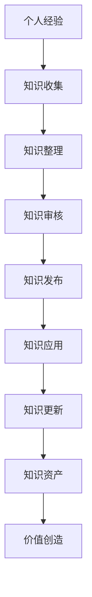
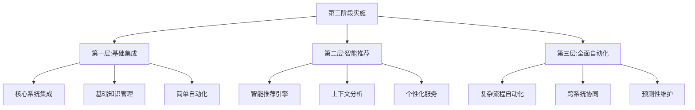

在企业级IT服务管理（ITSM）平台建设的分阶段实施策略中，第三阶段——深化知识管理并实现与外部工具链的全面集成，标志着整个项目从基础能力建设向智能化、自动化服务演进的重要里程碑。这一阶段的成功实施不仅能够显著提升服务效率和质量，还能通过知识资产的积累和复用，为组织创造持续的价值。

知识管理作为ITSM平台的核心能力之一，其价值在于将分散在组织中的专家经验、解决方案和最佳实践进行系统化整理和管理，形成可复用的知识资产。而与外部工具链的全面集成，则能够打破信息孤岛，实现跨系统的数据流转和业务协同，进一步提升IT服务的响应速度和处理效率。

第三阶段的实施需要在前两个阶段成功经验的基础上，进一步深化知识管理体系，完善集成能力，构建更加智能和高效的IT服务管理平台。

## 第三阶段实施的战略价值

### 1. 从经验传承到知识资产

#### 知识资本化
通过系统化的知识管理，组织能够将个人经验和专业技能转化为可传承、可复用的知识资产，避免因人员流动导致的知识流失。



#### 服务效率提升
完善的知识管理体系能够显著缩短问题解决时间，提高一线支持人员的工作效率，减少对高级专家的依赖。

### 2. 从系统孤岛到生态协同

#### 打破信息壁垒
通过与外部工具链的全面集成，能够实现不同系统间的数据共享和业务协同，消除信息孤岛，提升整体运营效率。

#### 自动化能力扩展
集成外部工具链能够扩展ITSM平台的自动化能力，实现更复杂、更智能的业务流程自动化。

### 3. 从被动响应到主动服务

#### 智能化服务推荐
基于知识库和用户行为分析，能够实现智能化的服务推荐，主动识别用户需求并提供相应服务。

#### 预测性问题解决
通过分析历史数据和知识库内容，能够预测潜在问题并提前提供解决方案，实现从被动响应到主动服务的转变。

## 知识管理体系深度建设

### 1. 知识生命周期管理优化

#### 知识创建与采集
建立多元化的知识创建和采集机制，确保知识的及时性和全面性。

```json
{
  "knowledge_creation_strategies": {
    "event_driven_creation": {
      "trigger": "事件解决后",
      "process": [
        "事件回顾",
        "解决方案总结",
        "知识条目创建",
        "专家审核"
      ],
      "responsible": "一线支持工程师",
      "timeline": "事件关闭后24小时内"
    },
    "problem_driven_creation": {
      "trigger": "问题解决后",
      "process": [
        "根因分析总结",
        "永久解决方案文档化",
        "最佳实践提炼",
        "知识条目创建"
      ],
      "responsible": "问题经理",
      "timeline": "问题关闭后48小时内"
    },
    "change_driven_creation": {
      "trigger": "变更实施后",
      "process": [
        "变更影响总结",
        "操作步骤文档化",
        "经验教训提炼",
        "知识条目更新"
      ],
      "responsible": "变更经理",
      "timeline": "变更回顾后72小时内"
    },
    "proactive_creation": {
      "trigger": "定期知识梳理",
      "process": [
        "主题确定",
        "内容收集",
        "专家访谈",
        "知识整理"
      ],
      "responsible": "知识管理员",
      "timeline": "按季度进行"
    }
  }
}
```

#### 知识质量保障机制
```python
class KnowledgeQualityManagement:
    def __init__(self):
        self.quality_standards = self.load_quality_standards()
        self.review_process = ReviewProcess()
    
    def assess_knowledge_quality(self, knowledge_item):
        """
        评估知识质量
        """
        quality_scores = {}
        
        # 内容完整性评估
        completeness_score = self.assess_completeness(knowledge_item)
        quality_scores["completeness"] = completeness_score
        
        # 准确性评估
        accuracy_score = self.assess_accuracy(knowledge_item)
        quality_scores["accuracy"] = accuracy_score
        
        # 实用性评估
        usability_score = self.assess_usability(knowledge_item)
        quality_scores["usability"] = usability_score
        
        # 可读性评估
        readability_score = self.assess_readability(knowledge_item)
        quality_scores["readability"] = readability_score
        
        # 综合质量评分
        overall_score = self.calculate_overall_quality(quality_scores)
        quality_scores["overall"] = overall_score
        
        # 质量等级确定
        quality_level = self.determine_quality_level(overall_score)
        quality_scores["level"] = quality_level
        
        return quality_scores
    
    def assess_completeness(self, knowledge_item):
        """
        评估内容完整性
        """
        required_sections = [
            "标题", "摘要", "问题描述", "解决方案", "操作步骤",
            "注意事项", "相关链接", "作者信息", "创建时间", "更新时间"
        ]
        
        present_sections = self.identify_present_sections(knowledge_item)
        completeness_ratio = len(present_sections) / len(required_sections)
        
        return min(completeness_ratio, 1.0)
    
    def assess_accuracy(self, knowledge_item):
        """
        评估内容准确性
        """
        # 基于历史反馈评估
        feedback_accuracy = self.analyze_feedback_accuracy(knowledge_item)
        
        # 基于专家评审评估
        expert_accuracy = self.get_expert_review_score(knowledge_item)
        
        # 基于使用效果评估
        usage_accuracy = self.analyze_usage_effectiveness(knowledge_item)
        
        # 综合准确性评分
        accuracy_score = (
            feedback_accuracy * 0.4 + 
            expert_accuracy * 0.4 + 
            usage_accuracy * 0.2
        )
        
        return accuracy_score
```

### 2. 智能化知识推荐

#### 上下文感知推荐
```python
class ContextAwareKnowledgeRecommendation:
    def __init__(self):
        self.recommendation_engine = RecommendationEngine()
        self.context_analyzer = ContextAnalyzer()
    
    def recommend_knowledge(self, user_context, incident_context=None):
        """
        基于上下文推荐知识
        """
        # 分析用户上下文
        user_profile = self.context_analyzer.analyze_user_context(user_context)
        
        # 分析事件上下文（如果存在）
        incident_profile = None
        if incident_context:
            incident_profile = self.context_analyzer.analyze_incident_context(incident_context)
        
        # 生成推荐候选集
        candidate_knowledge = self.generate_recommendation_candidates(
            user_profile, 
            incident_profile
        )
        
        # 计算推荐分数
        scored_knowledge = self.score_recommendations(
            candidate_knowledge, 
            user_profile, 
            incident_profile
        )
        
        # 排序并返回推荐结果
        recommended_knowledge = self.rank_recommendations(scored_knowledge)
        
        return recommended_knowledge[:10]  # 返回前10个推荐
    
    def generate_recommendation_candidates(self, user_profile, incident_profile=None):
        """
        生成推荐候选集
        """
        candidates = set()
        
        # 基于用户角色推荐
        role_based_knowledge = self.get_knowledge_by_role(user_profile["role"])
        candidates.update(role_based_knowledge)
        
        # 基于用户技能推荐
        skill_based_knowledge = self.get_knowledge_by_skills(user_profile["skills"])
        candidates.update(skill_based_knowledge)
        
        # 基于历史行为推荐
        behavior_based_knowledge = self.get_knowledge_by_behavior(user_profile["history"])
        candidates.update(behavior_based_knowledge)
        
        # 如果有事件上下文，基于事件推荐
        if incident_profile:
            incident_based_knowledge = self.get_knowledge_by_incident(incident_profile)
            candidates.update(incident_based_knowledge)
        
        return list(candidates)
    
    def score_recommendations(self, candidates, user_profile, incident_profile=None):
        """
        为推荐候选打分
        """
        scored_candidates = []
        
        for knowledge_item in candidates:
            # 相关性分数
            relevance_score = self.calculate_relevance_score(
                knowledge_item, 
                user_profile, 
                incident_profile
            )
            
            # 质量分数
            quality_score = self.calculate_quality_score(knowledge_item)
            
            # 时效性分数
            recency_score = self.calculate_recency_score(knowledge_item)
            
            # 使用频率分数
            popularity_score = self.calculate_popularity_score(knowledge_item)
            
            # 综合分数
            overall_score = (
                relevance_score * 0.4 + 
                quality_score * 0.3 + 
                recency_score * 0.2 + 
                popularity_score * 0.1
            )
            
            scored_candidates.append({
                "knowledge_item": knowledge_item,
                "scores": {
                    "relevance": relevance_score,
                    "quality": quality_score,
                    "recency": recency_score,
                    "popularity": popularity_score,
                    "overall": overall_score
                }
            })
        
        return scored_candidates
```

### 3. 知识贡献激励机制

#### 多维度激励体系
```python
class KnowledgeContributionIncentive:
    def __init__(self):
        self.contribution_tracker = ContributionTracker()
        self.reward_system = RewardSystem()
    
    def calculate_contribution_score(self, contributor_id):
        """
        计算知识贡献分数
        """
        # 获取贡献记录
        contributions = self.contribution_tracker.get_contributions(contributor_id)
        
        contribution_scores = []
        total_score = 0
        
        for contribution in contributions:
            # 基础分数
            base_score = self.calculate_base_score(contribution)
            
            # 质量加成
            quality_bonus = self.calculate_quality_bonus(contribution)
            
            # 使用加成
            usage_bonus = self.calculate_usage_bonus(contribution)
            
            # 影响力加成
            impact_bonus = self.calculate_impact_bonus(contribution)
            
            # 综合分数
            total_contribution_score = base_score + quality_bonus + usage_bonus + impact_bonus
            
            contribution_scores.append({
                "contribution_id": contribution.id,
                "base_score": base_score,
                "quality_bonus": quality_bonus,
                "usage_bonus": usage_bonus,
                "impact_bonus": impact_bonus,
                "total_score": total_contribution_score
            })
            
            total_score += total_contribution_score
        
        return {
            "contributor_id": contributor_id,
            "total_score": total_score,
            "contribution_details": contribution_scores
        }
    
    def calculate_base_score(self, contribution):
        """
        计算基础分数
        """
        # 根据贡献类型确定基础分数
        contribution_type_scores = {
            "new_knowledge": 100,
            "knowledge_update": 50,
            "knowledge_review": 30,
            "knowledge_translation": 80
        }
        
        base_score = contribution_type_scores.get(contribution.type, 50)
        
        # 根据内容长度调整
        if contribution.type == "new_knowledge" or contribution.type == "knowledge_update":
            content_length = len(contribution.content)
            length_bonus = min(content_length // 100, 50)  # 每100字符加1分，最多50分
            base_score += length_bonus
        
        return base_score
    
    def calculate_quality_bonus(self, contribution):
        """
        计算质量加成
        """
        # 获取知识质量评分
        quality_score = self.get_knowledge_quality_score(contribution.knowledge_id)
        
        # 质量加成 = 质量评分 * 20
        quality_bonus = quality_score * 20
        
        return quality_bonus
    
    def calculate_usage_bonus(self, contribution):
        """
        计算使用加成
        """
        # 获取知识使用次数
        usage_count = self.get_knowledge_usage_count(contribution.knowledge_id)
        
        # 使用加成 = 使用次数 * 2，最多100分
        usage_bonus = min(usage_count * 2, 100)
        
        return usage_bonus
    
    def calculate_impact_bonus(self, contribution):
        """
        计算影响力加成
        """
        # 获取知识对问题解决的影响
        problem_resolution_impact = self.analyze_problem_resolution_impact(contribution.knowledge_id)
        
        # 影响力加成 = 解决问题数 * 10，最多200分
        impact_bonus = min(problem_resolution_impact * 10, 200)
        
        return impact_bonus
```

## 外部工具链全面集成

### 1. 集成架构设计

#### 微服务集成模式
采用微服务架构实现与外部工具链的灵活集成，确保系统的可扩展性和可维护性。

```json
{
  "integration_architecture": {
    "api_gateway": {
      "role": "统一入口",
      "functions": [
        "请求路由",
        "身份认证",
        "流量控制",
        "日志记录"
      ]
    },
    "integration_adapters": {
      "description": "针对不同系统的适配器",
      "adapters": [
        {
          "name": "monitoring_adapter",
          "target_systems": ["Zabbix", "Prometheus", "Nagios"],
          "functions": ["告警接收", "指标获取", "状态同步"]
        },
        {
          "name": "automation_adapter",
          "target_systems": ["Ansible", "Chef", "Puppet"],
          "functions": ["任务执行", "状态查询", "结果反馈"]
        },
        {
          "name": "collaboration_adapter",
          "target_systems": ["Slack", "Microsoft Teams", "钉钉"],
          "functions": ["消息推送", "通知发送", "状态更新"]
        },
        {
          "name": "development_adapter",
          "target_systems": ["Jira", "GitLab", "Jenkins"],
          "functions": ["工单同步", "状态更新", "事件关联"]
        }
      ]
    },
    "event_bus": {
      "role": "事件中枢",
      "functions": [
        "事件发布",
        "事件订阅",
        "事件路由",
        "事件存储"
      ]
    },
    "data_sync_layer": {
      "role": "数据同步层",
      "functions": [
        "数据转换",
        "数据映射",
        "数据验证",
        "数据同步"
      ]
    }
  }
}
```

#### 集成安全机制
```python
class IntegrationSecurityManager:
    def __init__(self):
        self.authentication_service = AuthenticationService()
        self.authorization_service = AuthorizationService()
        self.encryption_service = EncryptionService()
    
    def secure_api_call(self, api_request):
        """
        安全API调用
        """
        # 身份认证
        if not self.authenticate_request(api_request):
            raise AuthenticationError("身份认证失败")
        
        # 权限验证
        if not self.authorize_request(api_request):
            raise AuthorizationError("权限不足")
        
        # 数据加密
        encrypted_request = self.encrypt_sensitive_data(api_request)
        
        # 执行API调用
        response = self.execute_api_call(encrypted_request)
        
        # 响应解密
        decrypted_response = self.decrypt_response(response)
        
        # 日志记录
        self.log_api_call(api_request, response)
        
        return decrypted_response
    
    def authenticate_request(self, api_request):
        """
        身份认证
        """
        # 获取认证信息
        auth_info = api_request.get_auth_info()
        
        # 验证认证信息
        is_valid = self.authentication_service.validate_credentials(auth_info)
        
        return is_valid
    
    def authorize_request(self, api_request):
        """
        权限验证
        """
        # 获取用户身份
        user_identity = api_request.get_user_identity()
        
        # 获取请求操作
        requested_action = api_request.get_action()
        
        # 验证权限
        is_authorized = self.authorization_service.check_permission(
            user_identity, 
            requested_action
        )
        
        return is_authorized
    
    def encrypt_sensitive_data(self, api_request):
        """
        加密敏感数据
        """
        # 识别敏感字段
        sensitive_fields = self.identify_sensitive_fields(api_request)
        
        # 加密敏感数据
        for field in sensitive_fields:
            if field in api_request.data:
                api_request.data[field] = self.encryption_service.encrypt(
                    api_request.data[field]
                )
        
        return api_request
```

### 2. 监控系统深度集成

#### 实时告警处理
```python
class MonitoringIntegration:
    def __init__(self):
        self.monitoring_adapters = {
            "zabbix": ZabbixAdapter(),
            "prometheus": PrometheusAdapter(),
            "nagios": NagiosAdapter()
        }
        self.incident_service = IncidentService()
        self.notification_service = NotificationService()
    
    def handle_monitoring_alert(self, alert_data):
        """
        处理监控告警
        """
        # 解析告警数据
        parsed_alert = self.parse_alert_data(alert_data)
        
        # 验证告警有效性
        if not self.validate_alert(parsed_alert):
            return False
        
        # 去重处理
        if self.is_duplicate_alert(parsed_alert):
            self.update_alert_count(parsed_alert)
            return True
        
        # 创建事件工单
        incident_id = self.create_incident_from_alert(parsed_alert)
        
        # 关联配置项
        self.link_incident_to_cis(incident_id, parsed_alert)
        
        # 智能分配
        self.assign_incident_intelligently(incident_id, parsed_alert)
        
        # 发送通知
        self.send_incident_notification(incident_id)
        
        # 记录处理日志
        self.log_alert_processing(parsed_alert, incident_id)
        
        return True
    
    def parse_alert_data(self, alert_data):
        """
        解析告警数据
        """
        # 标准化告警格式
        standardized_alert = {
            "alert_id": alert_data.get("id") or alert_data.get("alertId"),
            "source_system": alert_data.get("source"),
            "timestamp": alert_data.get("timestamp"),
            "severity": alert_data.get("severity") or alert_data.get("priority"),
            "host": alert_data.get("host") or alert_data.get("hostname"),
            "metric": alert_data.get("metric") or alert_data.get("check"),
            "message": alert_data.get("message") or alert_data.get("description"),
            "additional_info": alert_data.get("additional_info", {})
        }
        
        return standardized_alert
    
    def create_incident_from_alert(self, alert):
        """
        基于告警创建事件
        """
        incident_data = {
            "title": f"监控告警：{alert['message']}",
            "description": self.generate_incident_description(alert),
            "priority": self.map_severity_to_priority(alert["severity"]),
            "category": "Monitoring",
            "source": f"监控系统-{alert['source_system']}",
            "status": "New",
            "reported_by": "Monitoring System",
            "related_alert_id": alert["alert_id"]
        }
        
        # 创建事件工单
        incident_id = self.incident_service.create_incident(incident_data)
        
        return incident_id
    
    def link_incident_to_cis(self, incident_id, alert):
        """
        将事件关联到配置项
        """
        # 根据主机名查找配置项
        ci_ids = self.find_cis_by_hostname(alert["host"])
        
        # 建立关联关系
        for ci_id in ci_ids:
            self.incident_service.link_ci_to_incident(incident_id, ci_id)
```

### 3. 自动化平台集成

#### 作业自动化执行
```python
class AutomationIntegration:
    def __init__(self):
        self.automation_adapters = {
            "ansible": AnsibleAdapter(),
            "chef": ChefAdapter(),
            "puppet": PuppetAdapter()
        }
        self.job_service = JobService()
        self.notification_service = NotificationService()
    
    def execute_automated_job(self, job_request):
        """
        执行自动化作业
        """
        # 验证作业请求
        if not self.validate_job_request(job_request):
            raise ValidationError("作业请求验证失败")
        
        # 创建作业记录
        job_id = self.create_job_record(job_request)
        
        # 选择合适的自动化工具
        automation_tool = self.select_automation_tool(job_request)
        
        # 准备作业参数
        job_parameters = self.prepare_job_parameters(job_request)
        
        # 执行作业
        execution_result = self.execute_job_with_tool(
            automation_tool, 
            job_parameters
        )
        
        # 更新作业状态
        self.update_job_status(job_id, execution_result)
        
        # 处理执行结果
        self.process_job_result(job_id, execution_result)
        
        # 发送通知
        self.send_job_notification(job_id, execution_result)
        
        return job_id
    
    def select_automation_tool(self, job_request):
        """
        选择自动化工具
        """
        # 根据作业类型选择工具
        job_type = job_request.get("type")
        
        tool_mapping = {
            "server_provisioning": "ansible",
            "configuration_management": "chef",
            "application_deployment": "puppet",
            "patch_management": "ansible",
            "backup_restore": "ansible"
        }
        
        selected_tool = tool_mapping.get(job_type, "ansible")
        
        return selected_tool
    
    def execute_job_with_tool(self, tool_name, parameters):
        """
        使用指定工具执行作业
        """
        # 获取对应的适配器
        adapter = self.automation_adapters.get(tool_name)
        if not adapter:
            raise ToolNotAvailableError(f"自动化工具 {tool_name} 不可用")
        
        # 执行作业
        try:
            execution_result = adapter.execute_job(parameters)
            return execution_result
        except Exception as e:
            return {
                "status": "failed",
                "error": str(e),
                "timestamp": datetime.now()
            }
    
    def process_job_result(self, job_id, execution_result):
        """
        处理作业执行结果
        """
        if execution_result["status"] == "success":
            # 成功处理
            self.handle_successful_job(job_id, execution_result)
        else:
            # 失败处理
            self.handle_failed_job(job_id, execution_result)
    
    def handle_successful_job(self, job_id, execution_result):
        """
        处理成功作业
        """
        # 更新相关工单状态
        related_tickets = self.job_service.get_related_tickets(job_id)
        for ticket in related_tickets:
            self.update_ticket_status(ticket.id, "resolved")
        
        # 记录成功日志
        self.log_job_success(job_id, execution_result)
        
        # 触发后续动作
        self.trigger_post_actions(job_id, execution_result)
    
    def handle_failed_job(self, job_id, execution_result):
        """
        处理失败作业
        """
        # 创建事件工单
        incident_data = {
            "title": f"自动化作业失败：{job_id}",
            "description": f"作业执行失败，错误信息：{execution_result.get('error')}",
            "priority": "High",
            "category": "Automation",
            "status": "New"
        }
        
        incident_id = self.incident_service.create_incident(incident_data)
        
        # 关联到原作业
        self.job_service.link_incident_to_job(job_id, incident_id)
        
        # 记录失败日志
        self.log_job_failure(job_id, execution_result)
```

## 第三阶段实施方法论

### 1. 渐进式实施策略

#### 分层实施方法
采用分层实施方法，逐步深化知识管理和集成能力：



#### 迭代优化机制
建立迭代优化机制，持续改进知识管理和集成效果：

### 2. 质量保障体系

#### 知识质量监控
```python
class KnowledgeQualityMonitoring:
    def __init__(self):
        self.quality_metrics = QualityMetrics()
        self.alerting_system = AlertingSystem()
    
    def monitor_knowledge_quality(self):
        """
        监控知识质量
        """
        # 获取知识库统计信息
        knowledge_stats = self.get_knowledge_statistics()
        
        # 计算质量指标
        quality_metrics = self.calculate_quality_metrics(knowledge_stats)
        
        # 生成质量报告
        quality_report = self.generate_quality_report(quality_metrics)
        
        # 发送质量警报
        self.send_quality_alerts(quality_metrics)
        
        # 记录监控结果
        self.log_quality_monitoring(quality_report)
        
        return quality_report
    
    def calculate_quality_metrics(self, knowledge_stats):
        """
        计算质量指标
        """
        metrics = {}
        
        # 知识完整性指标
        metrics["completeness"] = self.calculate_completeness_metric(knowledge_stats)
        
        # 知识准确性指标
        metrics["accuracy"] = self.calculate_accuracy_metric(knowledge_stats)
        
        # 知识时效性指标
        metrics["timeliness"] = self.calculate_timeliness_metric(knowledge_stats)
        
        # 知识使用率指标
        metrics["usage_rate"] = self.calculate_usage_rate_metric(knowledge_stats)
        
        # 用户满意度指标
        metrics["satisfaction"] = self.calculate_satisfaction_metric(knowledge_stats)
        
        return metrics
    
    def send_quality_alerts(self, quality_metrics):
        """
        发送质量警报
        """
        for metric_name, metric_value in quality_metrics.items():
            # 获取指标阈值
            thresholds = self.get_metric_thresholds(metric_name)
            
            # 检查是否超出阈值
            if metric_value < thresholds["warning"]:
                self.alerting_system.send_warning_alert(
                    f"知识{metric_name}指标低于警告阈值: {metric_value}"
                )
            
            if metric_value < thresholds["critical"]:
                self.alerting_system.send_critical_alert(
                    f"知识{metric_name}指标低于临界阈值: {metric_value}"
                )
```

#### 集成稳定性保障
```python
class IntegrationStabilityManagement:
    def __init__(self):
        self.health_check_service = HealthCheckService()
        self.circuit_breaker = CircuitBreaker()
        self.retry_mechanism = RetryMechanism()
    
    def ensure_integration_stability(self):
        """
        确保集成稳定性
        """
        # 执行健康检查
        health_status = self.perform_health_checks()
        
        # 处理不健康的集成
        self.handle_unhealthy_integrations(health_status)
        
        # 更新集成状态
        self.update_integration_status(health_status)
        
        # 生成稳定性报告
        stability_report = self.generate_stability_report(health_status)
        
        return stability_report
    
    def perform_health_checks(self):
        """
        执行健康检查
        """
        integrations = self.get_all_integrations()
        health_status = {}
        
        for integration in integrations:
            try:
                # 执行健康检查
                is_healthy = self.health_check_service.check_integration_health(integration)
                
                # 记录检查结果
                health_status[integration.id] = {
                    "healthy": is_healthy,
                    "last_check": datetime.now(),
                    "details": self.health_check_service.get_last_check_details(integration)
                }
                
            except Exception as e:
                health_status[integration.id] = {
                    "healthy": False,
                    "last_check": datetime.now(),
                    "error": str(e)
                }
        
        return health_status
    
    def handle_unhealthy_integrations(self, health_status):
        """
        处理不健康的集成
        """
        for integration_id, status in health_status.items():
            if not status["healthy"]:
                # 触发熔断器
                self.circuit_breaker.trip(integration_id)
                
                # 发送告警
                self.send_integration_alert(integration_id, status)
                
                # 尝试恢复
                self.attempt_integration_recovery(integration_id)
```

### 3. 用户体验优化

#### 个性化知识门户
```python
class PersonalizedKnowledgePortal:
    def __init__(self):
        self.user_profile_service = UserProfileService()
        self.recommendation_engine = RecommendationEngine()
        self.content_delivery = ContentDelivery()
    
    def render_personalized_portal(self, user_id):
        """
        渲染个性化知识门户
        """
        # 获取用户画像
        user_profile = self.user_profile_service.get_user_profile(user_id)
        
        # 生成个性化内容
        personalized_content = self.generate_personalized_content(user_profile)
        
        # 构建门户页面
        portal_page = self.build_portal_page(personalized_content)
        
        # 记录用户行为
        self.log_user_interaction(user_id, portal_page)
        
        return portal_page
    
    def generate_personalized_content(self, user_profile):
        """
        生成个性化内容
        """
        content = {}
        
        # 个性化推荐
        content["recommendations"] = self.recommendation_engine.get_recommendations(
            user_profile
        )
        
        # 角色相关内容
        content["role_content"] = self.get_content_by_role(user_profile["role"])
        
        # 技能相关知识
        content["skill_content"] = self.get_content_by_skills(user_profile["skills"])
        
        # 最新知识
        content["recent_content"] = self.get_recent_knowledge()
        
        # 热门知识
        content["popular_content"] = self.get_popular_knowledge()
        
        return content
    
    def build_portal_page(self, personalized_content):
        """
        构建门户页面
        """
        page_structure = {
            "header": self.build_header(),
            "navigation": self.build_navigation(),
            "main_content": {
                "recommendations": self.build_recommendations_section(
                    personalized_content["recommendations"]
                ),
                "role_content": self.build_role_content_section(
                    personalized_content["role_content"]
                ),
                "skill_content": self.build_skill_content_section(
                    personalized_content["skill_content"]
                ),
                "recent_content": self.build_recent_content_section(
                    personalized_content["recent_content"]
                ),
                "popular_content": self.build_popular_content_section(
                    personalized_content["popular_content"]
                )
            },
            "sidebar": self.build_sidebar(),
            "footer": self.build_footer()
        }
        
        return page_structure
```

## 成功要素与最佳实践

### 1. 关键成功因素

#### 高层支持与资源投入
第三阶段的实施需要持续的资源投入和高层管理者的坚定支持，特别是在知识管理和集成能力建设方面。

#### 跨部门协作机制
建立有效的跨部门协作机制，确保知识管理涉及的各个部门能够协同工作，共同推进知识资产的建设和管理。

#### 技术能力保障
确保团队具备实施复杂集成和智能化知识管理所需的技术能力，必要时引入外部专家支持。

### 2. 实施建议

#### 循序渐进的推广策略
建议采用试点先行、逐步推广的策略，先在部分业务领域实施，积累经验后再全面推广。

#### 持续的培训与沟通
加强用户培训和沟通，确保所有相关人员理解新功能的价值和使用方法。

#### 建立反馈改进机制
建立用户反馈机制，持续收集用户意见和建议，不断优化知识管理和集成功能。

## 结语

第三阶段——深化知识管理并实现与外部工具链的全面集成，标志着ITSM平台建设进入智能化、自动化的新阶段。通过这一阶段的实施，组织能够将分散的知识资源整合为统一的知识资产，实现知识的系统化管理和智能化应用。

同时，与外部工具链的全面集成打破了系统间的信息壁垒，实现了跨系统的数据流转和业务协同，显著提升了IT服务的响应速度和处理效率。这种集成不仅扩展了ITSM平台的功能边界，还为其智能化发展奠定了坚实基础。

在实施过程中，组织需要重点关注知识质量保障、集成稳定性管理、用户体验优化等关键环节，确保实施效果符合预期。通过建立完善的质量监控体系、稳定性保障机制和用户反馈机制，能够持续提升知识管理和集成能力的水平。

第三阶段的成功实施将为组织带来显著的业务价值：提高服务效率、降低运营成本、提升用户满意度、增强知识资产价值。更重要的是，它为后续的智能化运维和数字化转型奠定了坚实基础。

随着人工智能、机器学习等技术的不断发展，知识管理和系统集成将变得更加智能和高效。未来的ITSM平台将能够实现更加精准的知识推荐、更加智能的故障预测、更加自动化的业务流程，真正实现从"人找知识"到"知识找人"的转变。

通过第三阶段的成功实施，组织将构建起一个智能化、自动化的IT服务管理平台，为业务发展提供强有力的支撑。在数字化转型的大背景下，这样的平台将成为企业核心竞争力的重要组成部分，推动组织向更高水平的数字化运营迈进。