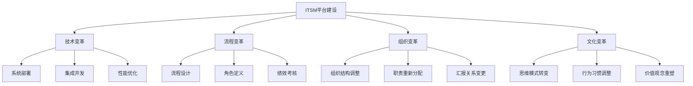

在企业级IT服务管理（ITSM）平台建设的分阶段实施策略中，变革管理是贯穿始终的关键成功因素，尤其在第十一章的最后一部分——变革管理（Change Management）中得到了集中体现。ITSM平台的建设不仅仅是技术系统的部署，更是一场深刻的企业变革，涉及组织结构、工作流程、人员技能和企业文化等多个维度。

变革管理的成功与否直接决定了ITSM平台实施的最终效果。即使拥有最先进的技术平台和最完善的流程设计，如果不能有效管理变革过程中的人员因素，项目仍然可能面临失败的风险。因此，建立科学的变革管理机制，通过有效的沟通、系统的培训和针对性的阻力克服策略，是确保ITSM平台成功实施和持续运营的关键。

## 变革管理的核心价值

### 1. 从技术实施到组织转型

#### 人的因素决定成败
ITSM平台建设项目的复杂性不仅体现在技术层面，更体现在对人员行为和组织文化的深刻影响。研究表明，70%以上的IT项目失败原因与人员因素相关，而非技术因素。因此，变革管理的核心在于关注人的需求和反应，确保组织成员能够适应和支持新的工作方式。



#### 变革阻力的根源分析
理解变革阻力的根源是有效管理变革的前提。常见的变革阻力来源包括：

- **习惯性阻力**：员工对现有工作方式的依赖和舒适感
- **不确定性阻力**：对未知变化的恐惧和焦虑
- **利益相关阻力**：担心变革会影响个人利益或权力地位
- **认知局限阻力**：对变革必要性和价值的不理解

### 2. 沟通在变革中的核心作用

#### 建立信任桥梁
有效的沟通是建立管理层与员工之间信任关系的重要桥梁。通过透明、及时、双向的沟通，能够减少信息不对称，消除误解和猜疑，增强员工对变革的理解和支持。

#### 期望管理
通过沟通明确变革的目标、范围、时间表和预期效果，帮助员工建立合理的期望，避免因期望过高或过低而导致的失望或抵触情绪。

## 系统性沟通策略

### 1. 多层次沟通架构

#### 高层领导沟通
高层领导的积极参与和支持是变革成功的关键。通过高层领导的公开表态、参与重要会议、走访一线部门等方式，能够有效传达变革的决心和重要性。

```json
{
  "executive_communication_strategy": {
    "communication_channels": [
      {
        "channel": "全员大会",
        "frequency": "每季度一次",
        "participants": "全体员工",
        "purpose": "传达战略方向和变革愿景",
        "responsible": "CEO/CTO"
      },
      {
        "channel": "管理层会议",
        "frequency": "每月一次",
        "participants": "中层管理人员",
        "purpose": "部署具体实施计划和解决关键问题",
        "responsible": "项目总监"
      },
      {
        "channel": "部门走访",
        "frequency": "按需进行",
        "participants": "一线员工",
        "purpose": "了解基层关切和收集反馈意见",
        "responsible": "高级管理层"
      }
    ],
    "key_messages": [
      "变革的必要性和紧迫性",
      "变革对组织和个人的价值",
      "管理层的支持和承诺",
      "员工在变革中的角色和机会"
    ]
  }
}
```

#### 中层管理沟通
中层管理者是连接高层领导和一线员工的关键纽带。他们既需要准确理解高层的战略意图，又需要将这些意图转化为具体的行动指南传达给一线员工。

#### 一线员工沟通
一线员工是变革的直接执行者和最终受益者，他们的理解和配合程度直接影响变革的实施效果。因此，需要通过多种渠道与一线员工进行直接沟通。

### 2. 多渠道沟通机制

#### 正式沟通渠道
建立正式的沟通渠道，确保重要信息能够准确、及时地传达给相关人员。

```python
class FormalCommunicationSystem:
    def __init__(self):
        self.channels = {
            "newsletter": NewsletterChannel(),
            "intranet": IntranetChannel(),
            "meetings": MeetingChannel(),
            "reports": ReportChannel()
        }
        self.content_manager = ContentManager()
    
    def distribute_communication(self, message, target_audience):
        """
        分发正式沟通信息
        """
        # 根据受众选择合适的渠道
        suitable_channels = self.select_channels_for_audience(target_audience)
        
        # 准备沟通内容
        prepared_content = self.content_manager.prepare_content(
            message, 
            target_audience
        )
        
        # 通过各渠道分发
        distribution_results = {}
        for channel_name in suitable_channels:
            channel = self.channels[channel_name]
            result = channel.distribute(prepared_content, target_audience)
            distribution_results[channel_name] = result
        
        # 记录分发结果
        self.log_distribution(distribution_results)
        
        return distribution_results
    
    def select_channels_for_audience(self, audience):
        """
        为受众选择合适的沟通渠道
        """
        channel_mapping = {
            "executives": ["newsletter", "meetings"],
            "managers": ["intranet", "meetings", "reports"],
            "staff": ["newsletter", "intranet"],
            "technical_team": ["intranet", "reports"],
            "all": ["newsletter", "intranet", "meetings"]
        }
        
        return channel_mapping.get(audience, ["newsletter", "intranet"])
    
    def track_communication_effectiveness(self):
        """
        跟踪沟通效果
        """
        # 收集反馈数据
        feedback_data = self.collect_feedback()
        
        # 分析沟通效果
        effectiveness_metrics = self.analyze_effectiveness(feedback_data)
        
        # 生成效果报告
        effectiveness_report = self.generate_effectiveness_report(effectiveness_metrics)
        
        # 优化沟通策略
        self.optimize_communication_strategy(effectiveness_report)
        
        return effectiveness_report
```

#### 非正式沟通渠道
充分利用非正式沟通渠道，如茶水间交流、午餐会、团队建设活动等，创造轻松的沟通环境，收集真实反馈。

### 3. 双向沟通机制

#### 反馈收集系统
建立有效的反馈收集系统，确保员工的声音能够被听到和重视。

```python
class FeedbackCollectionSystem:
    def __init__(self):
        self.feedback_channels = {
            "suggestion_box": SuggestionBox(),
            "surveys": SurveySystem(),
            "focus_groups": FocusGroup(),
            "one_on_one": OneOnOneMeeting()
        }
        self.feedback_processor = FeedbackProcessor()
    
    def collect_feedback(self):
        """
        收集反馈意见
        """
        all_feedback = []
        
        # 从各渠道收集反馈
        for channel_name, channel in self.feedback_channels.items():
            feedback = channel.collect()
            all_feedback.extend(feedback)
        
        # 处理和分类反馈
        processed_feedback = self.feedback_processor.process(all_feedback)
        
        # 记录反馈收集情况
        self.log_feedback_collection(processed_feedback)
        
        return processed_feedback
    
    def analyze_feedback_trends(self):
        """
        分析反馈趋势
        """
        # 获取历史反馈数据
        historical_feedback = self.get_historical_feedback()
        
        # 识别趋势和模式
        trends = self.identify_trends(historical_feedback)
        
        # 生成趋势分析报告
        trend_report = self.generate_trend_report(trends)
        
        return trend_report
    
    def respond_to_feedback(self, feedback_items):
        """
        回应反馈意见
        """
        responses = []
        
        for feedback_item in feedback_items:
            # 分析反馈重要性
            priority = self.assess_feedback_priority(feedback_item)
            
            # 制定回应策略
            response_strategy = self.develop_response_strategy(feedback_item, priority)
            
            # 执行回应
            response = self.execute_response(response_strategy, feedback_item)
            responses.append(response)
        
        # 记录回应情况
        self.log_feedback_responses(responses)
        
        return responses
```

#### 对话式沟通
鼓励管理者与员工进行对话式沟通，而不是单向的信息发布，通过问答、讨论等方式增进理解和信任。

## 系统性培训体系

### 1. 分层培训策略

#### 高层管理者培训
针对高层管理者，培训重点应放在变革的战略意义、领导力要求、资源投入等方面。

```json
{
  "executive_training_program": {
    "training_objectives": [
      "理解ITSM变革的战略价值",
      "掌握变革领导力核心技能",
      "学会有效资源配置和支持变革",
      "建立持续改进的管理思维"
    ],
    "training_content": [
      {
        "module": "ITSM战略价值",
        "duration": "4小时",
        "format": "研讨会",
        "key_topics": [
          "数字化转型趋势",
          "ITSM对业务的价值",
          "行业最佳实践案例"
        ]
      },
      {
        "module": "变革领导力",
        "duration": "6小时",
        "format": "工作坊",
        "key_topics": [
          "变革阻力识别与应对",
          "沟通技巧与影响力",
          "团队激励与赋能"
        ]
      },
      {
        "module": "资源配置与支持",
        "duration": "3小时",
        "format": "案例分析",
        "key_topics": [
          "预算规划与审批",
          "人力资源配置",
          "跨部门协调机制"
        ]
      }
    ],
    "training_methods": [
      "专家讲座",
      "案例研讨",
      "情景模拟",
      "同行交流"
    ]
  }
}
```

#### 中层管理者培训
中层管理者需要掌握具体的变革管理方法和工具，以及如何在日常管理中推动变革落地。

#### 一线员工培训
一线员工的培训应注重实用性和操作性，帮助他们快速掌握新系统和新流程的使用方法。

### 2. 多样化培训方式

#### 线上培训平台
建立线上培训平台，提供灵活的学习方式和丰富的学习资源。

```python
class OnlineTrainingPlatform:
    def __init__(self):
        self.course_catalog = CourseCatalog()
        self.learning_paths = LearningPaths()
        self.progress_tracker = ProgressTracker()
    
    def create_personalized_learning_path(self, user_profile):
        """
        创建个性化学习路径
        """
        # 分析用户需求
        learning_needs = self.analyze_learning_needs(user_profile)
        
        # 选择合适课程
        recommended_courses = self.select_courses(learning_needs)
        
        # 构建学习路径
        learning_path = self.build_learning_path(recommended_courses, user_profile)
        
        # 保存学习路径
        self.save_learning_path(user_profile.user_id, learning_path)
        
        return learning_path
    
    def track_learning_progress(self, user_id):
        """
        跟踪学习进度
        """
        # 获取用户学习数据
        learning_data = self.progress_tracker.get_user_progress(user_id)
        
        # 分析学习效果
        progress_analysis = self.analyze_progress(learning_data)
        
        # 生成进度报告
        progress_report = self.generate_progress_report(progress_analysis)
        
        # 提供改进建议
        improvement_suggestions = self.suggest_improvements(progress_analysis)
        
        return {
            "progress_report": progress_report,
            "improvement_suggestions": improvement_suggestions
        }
    
    def deliver_adaptive_training(self, user_id):
        """
        提供自适应培训
        """
        # 获取用户当前水平
        current_level = self.assess_current_level(user_id)
        
        # 选择合适难度的内容
        adaptive_content = self.select_adaptive_content(current_level)
        
        # 交付培训内容
        delivery_result = self.deliver_content(user_id, adaptive_content)
        
        # 收集反馈
        user_feedback = self.collect_feedback(user_id, adaptive_content)
        
        # 调整后续内容
        self.adjust_future_content(user_id, user_feedback)
        
        return delivery_result
```

#### 现场实操培训
通过现场实操培训，让员工在真实环境中学习和练习新技能。

#### 导师制培训
建立导师制培训体系，通过经验丰富的员工指导新员工，实现知识和技能的有效传承。

### 3. 培训效果评估

#### 多维度评估体系
建立包括知识掌握、技能应用、行为改变、业务影响等多个维度的培训效果评估体系。

```python
class TrainingEffectivenessAssessment:
    def __init__(self):
        self.assessment_methods = {
            "knowledge_test": KnowledgeTest(),
            "skill_evaluation": SkillEvaluation(),
            "behavior_observation": BehaviorObservation(),
            "business_impact": BusinessImpactAnalysis()
        }
    
    def assess_training_effectiveness(self, training_program, participants):
        """
        评估培训效果
        """
        assessment_results = {}
        
        # 知识掌握评估
        knowledge_results = self.assess_knowledge_mastery(participants)
        assessment_results["knowledge"] = knowledge_results
        
        # 技能应用评估
        skill_results = self.assess_skill_application(participants)
        assessment_results["skills"] = skill_results
        
        # 行为改变评估
        behavior_results = self.assess_behavior_change(participants)
        assessment_results["behavior"] = behavior_results
        
        # 业务影响评估
        impact_results = self.assess_business_impact(training_program)
        assessment_results["impact"] = impact_results
        
        # 综合评估报告
        overall_assessment = self.generate_overall_assessment(assessment_results)
        
        return overall_assessment
    
    def assess_knowledge_mastery(self, participants):
        """
        评估知识掌握情况
        """
        test_results = []
        
        for participant in participants:
            # 进行知识测试
            test_score = self.assessment_methods["knowledge_test"].conduct_test(participant)
            
            # 分析测试结果
            mastery_level = self.analyze_mastery_level(test_score)
            
            test_results.append({
                "participant_id": participant.id,
                "test_score": test_score,
                "mastery_level": mastery_level
            })
        
        return test_results
    
    def assess_skill_application(self, participants):
        """
        评估技能应用情况
        """
        evaluation_results = []
        
        for participant in participants:
            # 进行技能评估
            skill_score = self.assessment_methods["skill_evaluation"].evaluate(participant)
            
            # 分析应用能力
            application_level = self.analyze_application_level(skill_score)
            
            evaluation_results.append({
                "participant_id": participant.id,
                "skill_score": skill_score,
                "application_level": application_level
            })
        
        return evaluation_results
```

## 阻力识别与克服策略

### 1. 阻力识别机制

#### 阻力地图绘制
通过系统性的调研和分析，绘制组织变革阻力地图，明确阻力的来源、强度和影响范围。

```python
class ResistanceMapping:
    def __init__(self):
        self.resistance_categories = [
            "habit_resistance",
            "uncertainty_resistance",
            "interest_resistance",
            "cognitive_resistance"
        ]
        self.mapping_tools = {
            "surveys": SurveyTool(),
            "interviews": InterviewTool(),
            "observation": ObservationTool(),
            "data_analysis": DataAnalysisTool()
        }
    
    def create_resistance_map(self, organization):
        """
        创建阻力地图
        """
        # 收集阻力数据
        resistance_data = self.collect_resistance_data(organization)
        
        # 分析阻力类型
        resistance_analysis = self.analyze_resistance_types(resistance_data)
        
        # 评估阻力强度
        resistance_intensity = self.assess_resistance_intensity(resistance_data)
        
        # 确定影响范围
        impact_scope = self.determine_impact_scope(resistance_data)
        
        # 构建阻力地图
        resistance_map = self.build_resistance_map(
            resistance_analysis,
            resistance_intensity,
            impact_scope
        )
        
        # 制定应对策略
        response_strategies = self.develop_response_strategies(resistance_map)
        
        return {
            "resistance_map": resistance_map,
            "response_strategies": response_strategies
        }
    
    def collect_resistance_data(self, organization):
        """
        收集阻力数据
        """
        data_collection_results = {}
        
        # 通过调查问卷收集
        survey_data = self.mapping_tools["surveys"].collect_data(organization)
        data_collection_results["surveys"] = survey_data
        
        # 通过访谈收集
        interview_data = self.mapping_tools["interviews"].collect_data(organization)
        data_collection_results["interviews"] = interview_data
        
        # 通过观察收集
        observation_data = self.mapping_tools["observation"].collect_data(organization)
        data_collection_results["observation"] = observation_data
        
        # 通过数据分析收集
        analytics_data = self.mapping_tools["data_analysis"].collect_data(organization)
        data_collection_results["analytics"] = analytics_data
        
        return data_collection_results
```

#### 阻力预警系统
建立阻力预警系统，及时发现和识别潜在的变革阻力，防患于未然。

### 2. 分类克服策略

#### 习惯性阻力克服
针对习惯性阻力，采用渐进式变革和持续强化的方法，帮助员工逐步适应新的工作方式。

```json
{
  "habit_resistance_strategies": {
    "gradual_transition": {
      "approach": "渐进式过渡",
      "methods": [
        "并行运行新旧系统",
        "分阶段切换流程",
        "设置过渡期缓冲"
      ],
      "implementation": {
        "phase_1": "意识培养阶段",
        "phase_2": "试点实施阶段",
        "phase_3": "全面推广阶段",
        "phase_4": "巩固强化阶段"
      }
    },
    "reinforcement_mechanisms": {
      "positive_reinforcement": [
        "及时表扬和认可",
        "绩效奖励机制",
        "成功案例分享"
      ],
      "environmental_reinforcement": [
        "物理环境调整",
        "工具和系统支持",
        "流程和制度保障"
      ]
    }
  }
}
```

#### 不确定性阻力克服
针对不确定性阻力，通过透明沟通、参与式决策和能力建设等方法，减少员工的焦虑和恐惧。

#### 利益相关阻力克服
针对利益相关阻力，通过利益平衡、参与机制和激励机制等方法，确保各方利益得到合理考虑。

#### 认知局限阻力克服
针对认知局限阻力，通过教育培训、案例分享和体验式学习等方法，提升员工对变革必要性和价值的认识。

### 3. 持续改进机制

#### 阻力动态监控
建立阻力动态监控机制，持续跟踪阻力变化情况，及时调整应对策略。

```python
class ResistanceMonitoring:
    def __init__(self):
        self.monitoring_indicators = {
            "employee_satisfaction": EmployeeSatisfactionIndicator(),
            "adoption_rate": AdoptionRateIndicator(),
            "productivity_metrics": ProductivityMetricsIndicator(),
            "feedback_volume": FeedbackVolumeIndicator()
        }
        self.alert_system = AlertSystem()
    
    def monitor_resistance_dynamics(self):
        """
        监控阻力动态
        """
        # 收集监控指标数据
        indicator_data = self.collect_indicator_data()
        
        # 分析阻力变化趋势
        trend_analysis = self.analyze_trends(indicator_data)
        
        # 识别异常情况
        anomalies = self.identify_anomalies(trend_analysis)
        
        # 发送预警信息
        if anomalies:
            self.alert_system.send_alerts(anomalies)
        
        # 生成监控报告
        monitoring_report = self.generate_monitoring_report(trend_analysis)
        
        return monitoring_report
    
    def collect_indicator_data(self):
        """
        收集指标数据
        """
        data = {}
        
        for indicator_name, indicator in self.monitoring_indicators.items():
            data[indicator_name] = indicator.get_current_value()
        
        return data
    
    def analyze_trends(self, indicator_data):
        """
        分析趋势
        """
        trends = {}
        
        for indicator_name, values in indicator_data.items():
            # 计算趋势
            trend = self.calculate_trend(values)
            trends[indicator_name] = trend
        
        return trends
    
    def identify_anomalies(self, trend_analysis):
        """
        识别异常
        """
        anomalies = []
        
        for indicator_name, trend in trend_analysis.items():
            # 检查是否超出正常范围
            if self.is_anomalous(trend):
                anomaly = {
                    "indicator": indicator_name,
                    "trend": trend,
                    "severity": self.assess_severity(trend),
                    "recommended_action": self.recommend_action(trend)
                }
                anomalies.append(anomaly)
        
        return anomalies
```

#### 策略优化调整
根据阻力监控结果和实施效果，持续优化和调整阻力克服策略，确保策略的有效性。

## 变革管理实施框架

### 1. ADKAR模型应用

#### 意识（Awareness）
帮助员工认识到变革的必要性，理解不变革可能带来的风险和后果。

#### 愿景（Desire）
激发员工参与变革的内在动机，让他们看到变革对个人和组织的价值。

#### 知识（Knowledge）
提供员工实施变革所需的知识和技能，确保他们具备执行新工作方式的能力。

#### 能力（Ability）
通过实践和指导，帮助员工将知识转化为实际的工作能力。

#### 强化（Reinforcement）
通过持续的强化机制，确保变革成果得以巩固和持续。

### 2. Kotter变革八步法

#### 步骤一：营造紧迫感
通过数据分析和案例分享，让员工认识到变革的紧迫性和必要性。

#### 步骤二：组建指导联盟
建立由高层领导、中层管理者和关键员工组成的变革指导联盟，形成强大的推动力。

#### 步骤三：构建愿景
制定清晰、简洁、有感召力的变革愿景，为变革指明方向。

#### 步骤四：沟通愿景
通过多种渠道和方式，确保变革愿景能够传达到组织的每一个角落。

#### 步骤五：授权行动
消除变革障碍，为员工参与变革提供必要的资源和支持。

#### 步骤六：创造短期胜利
通过实现一些容易达成的短期目标，增强员工对变革的信心和动力。

#### 步骤七：坚持不懈
在取得初步成功后，继续保持变革势头，持续推进更深层次的变革。

#### 步骤八：巩固成果
将变革成果制度化，确保变革效果能够长期保持。

## 成功要素与最佳实践

### 1. 关键成功因素

#### 高层领导的坚定支持
高层领导的坚定支持和积极参与是变革成功的最重要因素。他们需要在资源投入、决策支持、文化塑造等方面发挥关键作用。

#### 全员参与的广泛基础
变革的成功需要全体员工的理解、支持和参与。通过有效的沟通和培训，确保每个员工都能在变革中找到自己的位置和价值。

#### 科学系统的管理方法
采用科学系统的变革管理方法，确保变革过程的有序进行和有效控制。

### 2. 实施建议

#### 制定详细的变革计划
制定涵盖沟通、培训、阻力克服等各方面的详细变革计划，明确时间表、责任人和里程碑。

#### 建立变革管理团队
建立专门的变革管理团队，负责变革管理的具体实施和协调工作。

#### 持续监控和评估
建立变革效果监控和评估机制，及时发现问题并进行调整优化。

## 结语

变革管理作为ITSM平台建设的重要组成部分，其重要性不容忽视。通过系统性的沟通策略、全面的培训体系和有效的阻力克服机制，组织能够顺利推进ITSM平台的实施和运营，实现预期的业务价值。

在沟通方面，建立多层次、多渠道、双向的沟通机制，确保信息的准确传递和反馈的有效收集，是建立信任、消除误解、增强支持的关键。通过高层领导的积极参与、中层管理者的有效传导和一线员工的直接沟通，形成全方位的沟通网络。

在培训方面，采用分层培训策略和多样化培训方式，确保不同层级、不同需求的员工都能获得相应的知识和技能。通过线上平台、现场实操、导师制等多种方式，提高培训的针对性和有效性。同时，建立科学的培训效果评估体系，持续改进培训质量。

在阻力克服方面，通过系统性的阻力识别和分类应对策略，有针对性地解决不同类型的变革阻力。建立阻力动态监控机制，及时发现和处理潜在问题，确保变革的顺利推进。

变革管理是一个持续的过程，需要组织在ITSM平台建设的各个阶段都给予足够的重视和投入。只有将变革管理贯穿始终，才能确保ITSM平台真正发挥其应有的价值，为组织的数字化转型和业务发展提供强有力的支撑。

通过有效的变革管理，组织不仅能够成功实施ITSM平台，还能够培养员工的变革适应能力，为未来的持续改进和创新发展奠定坚实基础。在快速变化的数字化时代，这种变革管理能力将成为组织核心竞争力的重要组成部分，推动组织在激烈的市场竞争中保持领先地位。

最终，成功的变革管理将实现技术、流程、人员和文化的有机融合，构建起一个高效、智能、可持续的IT服务管理体系，为组织的长期发展创造持续价值。