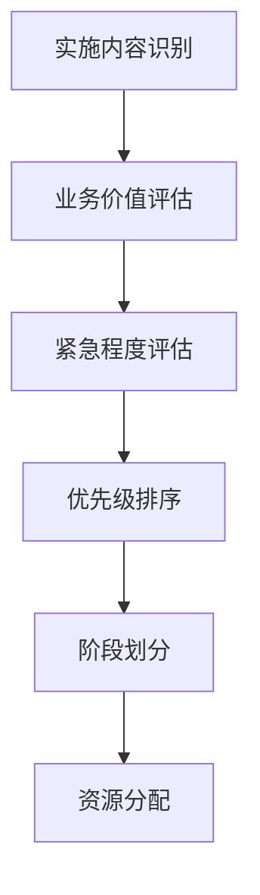

在企业级IT服务管理（ITSM）平台的建设过程中，分阶段实施与推广策略是确保项目成功的关键因素。ITSM平台建设涉及组织架构调整、流程重构、技术升级、人员培训等多个方面，其复杂性和影响范围远超一般的IT项目。采用科学合理的分阶段实施策略，不仅能够有效控制项目风险，还能确保各阶段目标的逐步实现，最终构建起一个完整、高效、可持续的IT服务管理体系。

分阶段实施策略的核心在于将复杂的ITSM平台建设项目分解为若干个相对独立、循序渐进的阶段，每个阶段都有明确的目标、可交付成果和评估标准。这种策略能够帮助组织在有限的资源和时间内，集中力量解决最关键的问题，逐步积累经验和能力，为后续阶段的实施奠定坚实基础。

## 分阶段实施的必要性

### 1. 风险控制

#### 降低实施风险
ITSM平台建设涉及多个业务领域和系统集成，一次性全面实施面临巨大的技术和管理风险。通过分阶段实施，可以将大风险分解为小风险，降低整体实施风险。

#### 早期价值实现
分阶段实施能够在早期阶段就实现部分价值，为项目赢得管理层和用户的持续支持，避免因长期看不到成果而导致的项目失败。

#### 问题及时发现
每个阶段的实施都是一次验证机会，能够及时发现和解决实施过程中的问题，避免问题积累到后期难以解决。

### 2. 资源优化

#### 人力资源分配
分阶段实施允许组织根据各阶段的需求合理分配人力资源，避免人力资源的过度集中或浪费。

#### 财务投入控制
通过分阶段投入资金，组织可以更好地控制项目成本，避免一次性大额投入带来的财务压力。

#### 技术能力培养
分阶段实施为团队提供了逐步学习和掌握新技术的机会，避免因技术复杂性过高而导致的实施困难。

### 3. 组织适应

#### 文化变革管理
ITSM实施往往伴随着组织文化的变革，分阶段实施能够给员工提供逐步适应的时间，减少变革阻力。

#### 流程调整优化
通过分阶段实施，组织可以逐步调整和优化业务流程，避免因流程变化过大而导致的运营混乱。

#### 能力逐步提升
分阶段实施允许组织逐步提升相关人员的技能和能力，确保团队能够胜任新的工作要求。

## 实施阶段划分原则

### 1. 业务价值导向

#### 优先级排序
根据业务价值和紧急程度对实施内容进行优先级排序，优先实施能够快速产生业务价值的部分。

#### 快速见效
选择能够在短期内产生明显效果的实施内容，为项目建立良好的开端和持续动力。

### 2. 技术依赖关系

#### 基础设施先行
优先实施基础设施和核心平台建设，为后续功能模块的实施提供技术支撑。

#### 依赖关系分析
分析各实施内容间的技术依赖关系，确保实施顺序的合理性。

### 3. 组织准备程度

#### 能力匹配
根据组织当前的能力水平确定实施内容和节奏，避免因能力不足导致的实施失败。

#### 变革承受力
考虑组织对变革的承受能力，合理安排变革的节奏和幅度。

## 推广策略设计

### 1. 用户接受度管理

#### 渐进式推广
采用渐进式推广策略，从核心用户群体开始，逐步扩展到全体用户。

#### 培训教育
制定系统的培训教育计划，确保用户能够熟练使用新系统和流程。

### 2. 沟通协调机制

#### 多层次沟通
建立多层次的沟通协调机制，确保信息在各层级间的有效传递。

#### 反馈收集
建立有效的用户反馈收集机制，及时了解用户需求和问题。

### 3. 激励约束机制

#### 正面激励
通过正面激励措施鼓励用户积极参与和支持ITSM实施。

#### 制度约束
通过制度化手段确保ITSM流程的规范执行。

## 本章内容概览

在本章中，我们将深入探讨ITSM平台的分阶段实施与推广策略，为读者提供系统性的实施指导：

### 11.1 第一阶段：搭建服务台，实现事件和服务请求管理
详细介绍第一阶段的实施目标、关键任务、技术要求和预期成果，重点讲解服务台建设和基础流程实现。

### 11.2 第二阶段：落地问题管理和变更管理，集成CMDB
深入分析第二阶段的实施重点，包括问题管理、变更管理流程的落地实施，以及与CMDB的集成策略。

### 11.3 第三阶段：深化知识管理，实现与外部工具链全面集成
探讨第三阶段的实施内容，重点讲解知识管理体系的深化建设，以及与外部工具链的全面集成方案。

### 11.4 变革管理（Change Management）：沟通、培训、克服阻力
详细分析变革管理的关键要素，包括沟通策略、培训体系和阻力克服方法。

## 实施方法论

### 1. 敏捷实施方法

#### 迭代开发
采用敏捷开发方法，通过短周期的迭代实现功能的逐步完善。

#### 持续反馈
建立持续的用户反馈机制，确保实施方向与用户需求保持一致。

#### 快速调整
根据反馈结果快速调整实施策略和方案，提高实施效率。

### 2. 项目管理方法

#### 里程碑管理
设置清晰的里程碑节点，确保各阶段目标的按时达成。

#### 风险管控
建立完善的风险识别和管控机制，及时应对实施过程中的各种风险。

#### 质量保证
制定严格的质量保证措施，确保实施成果符合预期标准。

## 成功要素分析

### 1. 领导支持

#### 高层承诺
获得高层管理者的明确承诺和支持，为项目提供必要的资源保障。

#### 持续关注
高层管理者需要持续关注项目进展，及时解决重大问题。

### 2. 团队能力

#### 专业技能
组建具备专业技能的实施团队，确保技术实施的质量。

#### 协作能力
加强团队协作，确保各专业领域间的有效配合。

### 3. 用户参与

#### 积极参与
鼓励用户积极参与实施过程，提供有价值的反馈和建议。

#### 能力提升
帮助用户提升相关技能，确保新系统和流程的有效使用。

## 未来发展趋势

### 1. 云原生实施

#### 微服务架构
采用微服务架构实现ITSM平台的云原生部署，提高系统的灵活性和可扩展性。

#### 容器化部署
通过容器化技术实现快速部署和弹性伸缩，降低运维复杂度。

### 2. 智能化推广

#### AI辅助实施
利用人工智能技术辅助实施过程，提高实施效率和质量。

#### 自动化推广
通过自动化工具实现系统的快速推广和配置。

### 3. 生态化发展

#### 开放集成
构建开放的集成平台，支持与第三方系统的无缝集成。

#### 合作伙伴生态
建立合作伙伴生态系统，共同推进ITSM能力的发展。

## 实施建议

### 1. 前期准备建议

#### 需求调研
深入调研业务需求，明确实施目标和范围。

#### 现状评估
全面评估当前IT服务管理水平，识别改进机会。

#### 资源规划
合理规划实施所需的各类资源，包括人力、财力、技术等。

### 2. 实施过程建议

#### 分步推进
严格按照分阶段实施计划推进各项工作，确保各阶段目标的达成。

#### 持续监控
建立持续监控机制，及时发现和解决实施过程中的问题。

#### 灵活调整
根据实际情况灵活调整实施策略和方案，确保实施效果。

### 3. 后期优化建议

#### 效果评估
定期评估实施效果，识别进一步优化的机会。

#### 持续改进
建立持续改进机制，不断提升IT服务管理水平。

#### 经验总结
及时总结实施经验，为后续项目提供参考。

## 结语

分阶段实施与推广策略是ITSM平台建设项目成功的重要保障。通过科学合理的阶段划分和推广策略，组织能够有效控制实施风险，优化资源配置，确保项目目标的逐步实现。然而，分阶段实施并非简单的任务分解，它需要组织在战略规划、项目管理、变革管理等多个方面进行系统性的考虑和精心的组织。

在数字化转型的大背景下，ITSM平台建设的重要性日益凸显。组织应该将分阶段实施与推广作为ITSM建设的核心策略，投入必要的资源和精力，确保ITSM平台能够顺利建成并发挥预期作用。通过深入理解分阶段实施的核心理念和最佳实践，结合组织的实际情况，我们可以制定出既符合业务需求又具备可操作性的实施策略，为组织的数字化转型奠定坚实基础。

在接下来的章节中，我们将详细探讨各个实施阶段的具体内容和实施方法，为读者提供更加具体和实用的指导。通过系统性的学习和实践，相信读者能够掌握分阶段实施的核心技能，为成功建设ITSM平台提供有力支撑。