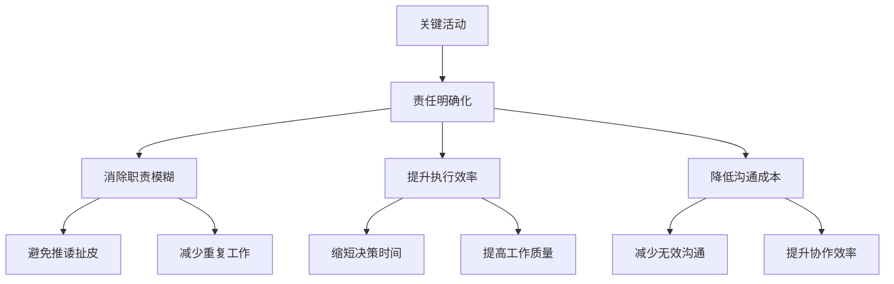

在企业级IT服务管理（ITSM）平台的运营体系中，清晰的角色定义和明确的职责分工是确保平台高效运行的基础。通过建立科学的角色与职责体系，能够避免工作重叠、责任不清、推诿扯皮等问题，提升团队协作效率和服务质量。

RACI责任分配矩阵作为一种经典的职责管理工具，通过明确每个角色在关键活动中的责任（Responsible执行者、Accountable责任人、Consulted咨询者、Informed知会者），为组织构建高效的运营体系提供了有力支撑。

在ITSM平台运营中，服务台经理、流程经理和技术支持团队构成了核心的运营管理三角，他们各自承担着不同的职责，又需要密切协作，共同确保平台的稳定运行和持续优化。

## RACI责任分配的核心价值

### 1. 责任明确化

#### 消除职责模糊
通过RACI矩阵，每个关键活动都有明确的责任人，避免了因职责不清导致的工作延误和质量问题。



#### 建立问责机制
明确的责任分配为绩效考核和问责机制提供了依据，有助于提升团队成员的责任意识和工作积极性。

### 2. 协作高效化

#### 优化资源配置
通过明确各角色的咨询和知会关系，能够优化信息流转路径，确保相关人员能够及时获得所需信息。

#### 提升决策效率
清晰的决策责任体系能够加快决策速度，减少因决策层级不清导致的延误。

### 3. 流程标准化

#### 建立标准操作模式
RACI矩阵为各项运营活动建立了标准的操作模式，有助于提升工作的规范性和一致性。

#### 促进知识传承
标准化的职责体系有助于新员工快速了解岗位职责，促进知识和经验的有效传承。

## 核心角色职责详解

### 1. 服务台经理（Service Desk Manager）

#### 角色定位
服务台经理是ITSM平台运营的一线管理者，负责服务台的日常运营管理、团队绩效管理和服务质量监控。他们是用户与IT部门之间的主要接触点管理者，承担着确保用户满意度和提升服务效率的重要职责。

```json
{
  "service_desk_manager_role": {
    "primary_responsibilities": {
      "operational_management": {
        "description": "服务台日常运营管理",
        "activities": [
          "服务台工作调度",
          "工单分配与监控",
          "服务质量实时监控",
          "突发事件应急处理"
        ]
      },
      "team_management": {
        "description": "团队管理与绩效提升",
        "activities": [
          "团队人员管理",
          "绩效考核与反馈",
          "技能培训与发展",
          "团队文化建设"
        ]
      },
      "customer_relationship": {
        "description": "客户关系维护",
        "activities": [
          "用户满意度管理",
          "客户投诉处理",
          "定期客户回访",
          "服务改进建议收集"
        ]
      },
      "process_optimization": {
        "description": "流程优化与改进",
        "activities": [
          "服务流程梳理",
          "效率瓶颈识别",
          "改进方案制定",
          "优化效果评估"
        ]
      }
    },
    "key_performance_indicators": [
      {
        "kpi": "服务台响应时间",
        "target": "< 30秒",
        "measurement_frequency": "每日"
      },
      {
        "kpi": "首次解决率",
        "target": "> 80%",
        "measurement_frequency": "每周"
      },
      {
        "kpi": "用户满意度",
        "target": "> 90%",
        "measurement_frequency": "每月"
      },
      {
        "kpi": "团队人员流失率",
        "target": "< 10%",
        "measurement_frequency": "每季度"
      }
    ]
  }
}
```

#### 核心职责领域

##### 用户服务管理
服务台经理需要确保用户能够获得及时、准确、友好的服务体验。这包括：
- 建立和完善服务标准，确保服务质量的一致性
- 监控服务台工作负载，合理调配人力资源
- 处理复杂用户问题和投诉，维护良好的客户关系
- 收集用户反馈，持续改进服务质量

##### 团队建设与发展
作为团队领导者，服务台经理需要关注团队成员的成长和发展：
- 制定团队培训计划，提升成员专业技能
- 建立有效的绩效管理体系，激励团队成员
- 营造积极的团队氛围，提升团队凝聚力
- 识别和培养潜在管理者，为团队发展储备人才

##### 运营数据分析
服务台经理需要基于数据分析进行决策和改进：
- 监控关键运营指标，识别异常情况
- 分析服务趋势，预测未来需求
- 评估流程效率，发现改进机会
- 生成运营报告，为管理层提供决策支持

### 2. 流程经理（Process Manager）

#### 角色定位
流程经理是ITSM平台流程体系的设计师和守护者，负责各项IT服务管理流程的设计、实施、监控和持续优化。他们需要深入理解ITIL框架和业务需求，确保流程能够有效支撑业务运营并持续创造价值。

```python
class ProcessManager:
    def __init__(self):
        self.processes = [
            "事件管理",
            "问题管理",
            "变更管理",
            "配置管理",
            "知识管理",
            "服务级别管理"
        ]
        self.process_framework = ProcessFramework()
        self.kpi_system = KPISystem()
    
    def design_process(self, process_name, business_requirements):
        """
        设计流程
        """
        # 分析业务需求
        requirement_analysis = self.analyze_requirements(business_requirements)
        
        # 设计流程框架
        process_framework = self.process_framework.create_framework(
            process_name, 
            requirement_analysis
        )
        
        # 定义关键活动
        key_activities = self.define_key_activities(process_framework)
        
        # 设置绩效指标
        kpis = self.kpi_system.define_process_kpis(process_name)
        
        # 创建流程文档
        process_document = self.create_process_document(
            process_name,
            process_framework,
            key_activities,
            kpis
        )
        
        return process_document
    
    def implement_process(self, process_document):
        """
        实施流程
        """
        # 配置ITSM工具
        self.configure_itsm_tool(process_document)
        
        # 培训相关人员
        self.train_process_stakeholders(process_document)
        
        # 试运行流程
        pilot_results = self.pilot_process(process_document)
        
        # 正式上线
        self.launch_process(process_document)
        
        return True
    
    def monitor_process_performance(self, process_name):
        """
        监控流程绩效
        """
        # 收集流程数据
        process_data = self.collect_process_data(process_name)
        
        # 计算绩效指标
        kpi_results = self.kpi_system.calculate_kpis(process_name, process_data)
        
        # 分析绩效趋势
        performance_trends = self.analyze_performance_trends(kpi_results)
        
        # 识别改进机会
        improvement_opportunities = self.identify_improvement_opportunities(
            performance_trends
        )
        
        return {
            "kpi_results": kpi_results,
            "performance_trends": performance_trends,
            "improvement_opportunities": improvement_opportunities
        }
```

#### 核心职责领域

##### 流程设计与优化
流程经理的核心职责是确保各项IT服务管理流程的科学性和有效性：
- 基于业务需求和ITIL最佳实践设计流程框架
- 定义流程中的关键活动、角色和责任
- 建立流程绩效指标体系，量化流程效果
- 持续监控流程运行情况，识别优化机会

##### 流程实施与推广
流程设计完成后，流程经理需要确保流程能够有效实施：
- 配置ITSM工具以支持流程运行
- 培训流程相关人员，确保理解和掌握
- 组织流程试运行，收集反馈意见
- 正式推广流程，监督执行情况

##### 流程合规性管理
流程经理需要确保流程执行符合相关标准和规范：
- 建立流程合规性检查机制
- 定期审计流程执行情况
- 识别和纠正流程偏差
- 更新流程以适应法规变化

### 3. 技术支持团队（Technical Support Team）

#### 角色定位
技术支持团队是ITSM平台的技术保障力量，负责平台的技术维护、故障处理、系统优化和技术支持。他们需要具备扎实的技术功底和快速的问题解决能力，确保ITSM平台的稳定运行和高效性能。

```json
{
  "technical_support_team_role": {
    "team_structure": {
      "level_1_support": {
        "responsibilities": [
          "基础技术问题处理",
          "系统监控与告警响应",
          "用户技术咨询",
          "简单故障排除"
        ],
        "required_skills": [
          "基础IT知识",
          "问题分析能力",
          "沟通技巧",
          "工具使用能力"
        ]
      },
      "level_2_support": {
        "responsibilities": [
          "复杂技术问题解决",
          "系统配置与调优",
          "故障根因分析",
          "技术方案设计"
        ],
        "required_skills": [
          "专业技能",
          "系统架构知识",
          "问题解决能力",
          "创新能力"
        ]
      },
      "level_3_support": {
        "responsibilities": [
          "核心技术问题攻关",
          "系统架构设计",
          "技术标准制定",
          "新技术研究"
        ],
        "required_skills": [
          "专家级技术能力",
          "架构设计能力",
          "技术创新能力",
          "团队领导能力"
        ]
      }
    },
    "key_activities": [
      {
        "activity": "系统监控",
        "description": "7×24小时监控系统运行状态",
        "tools": ["监控平台", "告警系统", "日志分析工具"]
      },
      {
        "activity": "故障处理",
        "description": "快速响应和解决系统故障",
        "tools": ["故障管理系统", "远程诊断工具", "协作平台"]
      },
      {
        "activity": "性能优化",
        "description": "持续优化系统性能",
        "tools": ["性能分析工具", "调优工具", "测试工具"]
      },
      {
        "activity": "安全维护",
        "description": "确保系统安全稳定运行",
        "tools": ["安全扫描工具", "漏洞管理工具", "访问控制工具"]
      }
    ]
  }
}
```

#### 核心职责领域

##### 系统维护与监控
技术支持团队需要确保ITSM平台的稳定运行：
- 建立7×24小时系统监控体系，及时发现异常情况
- 配置告警机制，确保关键问题能够及时响应
- 定期进行系统健康检查，预防潜在问题
- 维护系统文档，记录系统配置和变更历史

##### 故障响应与解决
当系统出现故障时，技术支持团队需要快速响应和解决：
- 建立故障响应流程，确保快速定位问题
- 配置故障诊断工具，提升问题分析效率
- 建立故障知识库，积累问题解决经验
- 进行故障复盘，预防类似问题再次发生

##### 技术支持与优化
技术支持团队需要为其他团队提供技术支撑：
- 为服务台提供技术支持，解决复杂技术问题
- 为流程经理提供技术建议，优化流程实现
- 参与系统升级和扩展项目，提供技术方案
- 研究新技术应用，提升平台技术水平

## RACI责任分配矩阵设计

### 1. 矩阵构建原则

#### 责任唯一性原则
每个关键活动必须有且仅有一个责任人（Accountable），确保决策的明确性和权威性。

#### 执行有效性原则
每个关键活动应有明确的执行者（Responsible），确保工作能够有效推进和完成。

#### 协作必要性原则
根据活动的复杂性和影响范围，确定需要咨询（Consulted）和知会（Informed）的相关角色。

### 2. 核心活动责任分配

#### 服务台运营管理
```python
class ServiceDeskOperationsRACI:
    def __init__(self):
        self.roles = [
            "服务台经理",
            "流程经理",
            "技术支持主管",
            "数据分析师",
            "变更经理"
        ]
    
    def create_raci_matrix(self):
        """
        创建服务台运营管理RACI矩阵
        """
        raci_matrix = {
            "服务台日常运营": {
                "服务台经理": "A",      # 负责
                "流程经理": "C",        # 咨询
                "技术支持主管": "I",     # 知会
                "数据分析师": "I",       # 知会
                "变更经理": "C"         # 咨询
            },
            "服务质量监控": {
                "服务台经理": "A",      # 负责
                "流程经理": "C",        # 咨询
                "技术支持主管": "I",     # 知会
                "数据分析师": "R",       # 执行
                "变更经理": "I"         # 知会
            },
            "用户满意度管理": {
                "服务台经理": "A",      # 负责
                "流程经理": "C",        # 咨询
                "技术支持主管": "I",     # 知会
                "数据分析师": "R",       # 执行
                "变更经理": "I"         # 知会
            },
            "团队绩效管理": {
                "服务台经理": "A",      # 负责
                "流程经理": "I",        # 知会
                "技术支持主管": "C",     # 咨询
                "数据分析师": "I",       # 知会
                "变更经理": "I"         # 知会
            }
        }
        
        return raci_matrix
    
    def validate_matrix(self, matrix):
        """
        验证RACI矩阵的有效性
        """
        validation_results = []
        
        for activity, role_assignments in matrix.items():
            # 检查每个活动有且仅有一个A（Accountable）
            accountable_count = sum(1 for assignment in role_assignments.values() if assignment == "A")
            if accountable_count != 1:
                validation_results.append({
                    "activity": activity,
                    "issue": f"Accountable角色数量不正确: {accountable_count}",
                    "severity": "high"
                })
            
            # 检查至少有一个R（Responsible）
            responsible_count = sum(1 for assignment in role_assignments.values() if assignment == "R")
            if responsible_count == 0:
                validation_results.append({
                    "activity": activity,
                    "issue": "缺少Responsible角色",
                    "severity": "medium"
                })
        
        return validation_results
```

#### 流程管理活动
```json
{
  "process_management_raci": {
    "流程设计与优化": {
      "服务台经理": "C",
      "流程经理": "A",
      "技术支持主管": "R",
      "数据分析师": "C",
      "变更经理": "C"
    },
    "流程实施与推广": {
      "服务台经理": "R",
      "流程经理": "A",
      "技术支持主管": "R",
      "数据分析师": "C",
      "变更经理": "R"
    },
    "流程绩效监控": {
      "服务台经理": "C",
      "流程经理": "A",
      "技术支持主管": "I",
      "数据分析师": "R",
      "变更经理": "C"
    },
    "流程合规性审计": {
      "服务台经理": "C",
      "流程经理": "A",
      "技术支持主管": "C",
      "数据分析师": "R",
      "变更经理": "C"
    }
  }
}
```

#### 技术支持活动
```json
{
  "technical_support_raci": {
    "系统监控与维护": {
      "服务台经理": "I",
      "流程经理": "I",
      "技术支持主管": "A",
      "数据分析师": "I",
      "变更经理": "C"
    },
    "故障响应与处理": {
      "服务台经理": "C",
      "流程经理": "I",
      "技术支持主管": "A",
      "数据分析师": "I",
      "变更经理": "R"
    },
    "性能优化与调优": {
      "服务台经理": "I",
      "流程经理": "C",
      "技术支持主管": "A",
      "数据分析师": "R",
      "变更经理": "C"
    },
    "安全维护与加固": {
      "服务台经理": "I",
      "流程经理": "C",
      "技术支持主管": "A",
      "数据分析师": "I",
      "变更经理": "C"
    }
  }
}
```

## 角色协作机制

### 1. 沟通协调机制

#### 定期会议制度
建立定期的沟通协调机制，确保各角色之间的信息畅通和协作顺畅。

```python
class CommunicationCoordination:
    def __init__(self):
        self.meeting_schedule = {
            "daily_standup": {
                "frequency": "每日",
                "participants": ["服务台经理", "技术支持主管"],
                "duration": "15分钟",
                "agenda": ["昨日工作总结", "今日工作计划", "问题协调"]
            },
            "weekly_review": {
                "frequency": "每周",
                "participants": ["服务台经理", "流程经理", "技术支持主管", "数据分析师"],
                "duration": "1小时",
                "agenda": ["运营指标回顾", "流程执行情况", "技术支持需求", "改进计划讨论"]
            },
            "monthly_planning": {
                "frequency": "每月",
                "participants": ["服务台经理", "流程经理", "技术支持主管", "变更经理"],
                "duration": "2小时",
                "agenda": ["月度工作总结", "下月工作计划", "资源需求协调", "重大事项讨论"]
            }
        }
    
    def schedule_meetings(self):
        """
        安排会议
        """
        scheduled_meetings = []
        
        for meeting_type, details in self.meeting_schedule.items():
            meeting = self.create_meeting(
                meeting_type,
                details["frequency"],
                details["participants"],
                details["duration"],
                details["agenda"]
            )
            scheduled_meetings.append(meeting)
        
        return scheduled_meetings
    
    def facilitate_meeting(self, meeting):
        """
        主持会议
        """
        # 准备会议材料
        meeting_materials = self.prepare_meeting_materials(meeting)
        
        # 主持会议进程
        meeting_outcomes = self.conduct_meeting(meeting, meeting_materials)
        
        # 跟踪会议决议
        self.follow_up_on_resolutions(meeting_outcomes)
        
        return meeting_outcomes
```

#### 协作平台建设
建立统一的协作平台，支持信息共享、任务协调和知识管理。

### 2. 冲突解决机制

#### 问题升级流程
建立清晰的问题升级流程，确保冲突能够得到及时有效的解决。

#### 协调决策机制
对于跨角色的重要决策，建立协调决策机制，确保决策的科学性和可执行性。

## 能力发展与绩效管理

### 1. 能力模型设计

#### 角色能力要求
为不同角色设计清晰的能力要求和发展路径。

```json
{
  "role_competency_model": {
    "service_desk_manager": {
      "competency_areas": [
        {
          "area": "领导力",
          "levels": {
            "基础": ["团队管理基础", "沟通协调能力"],
            "中级": ["绩效管理", "变革管理"],
            "高级": ["战略规划", "组织发展"]
          }
        },
        {
          "area": "服务管理",
          "levels": {
            "基础": ["服务台运营", "客户关系管理"],
            "中级": ["服务质量管理", "服务创新"],
            "高级": ["服务战略制定", "服务价值创造"]
          }
        },
        {
          "area": "数据分析",
          "levels": {
            "基础": ["基础统计分析", "报表制作"],
            "中级": ["数据挖掘", "趋势分析"],
            "高级": ["预测建模", "决策支持"]
          }
        }
      ]
    }
  }
}
```

#### 培训发展计划
基于能力模型制定个性化的培训发展计划。

### 2. 绩效管理体系

#### 关键绩效指标
为各角色设定明确的关键绩效指标。

#### 评估反馈机制
建立定期的绩效评估和反馈机制。

## 成功要素与最佳实践

### 1. 关键成功因素

#### 高层管理支持
清晰的角色定义和职责分工需要获得高层管理者的支持和认可。

#### 系统化设计
角色与职责体系需要系统化设计，确保各角色之间的协调配合。

#### 持续优化
角色与职责体系需要根据实际运行情况进行持续优化和调整。

### 2. 实施建议

#### 循序渐进推进
建议采用循序渐进的方式推进角色与职责体系建设。

#### 充分沟通协调
在实施过程中需要充分沟通协调，确保各角色的理解和认同。

#### 定期评估改进
建立定期评估机制，持续改进角色与职责体系。

## 结语

角色与职责定义（RACI）是ITSM平台运营体系建设的重要基础。通过科学的角色定义、明确的职责分工和有效的协作机制，能够显著提升团队的工作效率和服务质量。

服务台经理、流程经理和技术支持团队作为ITSM平台运营的核心角色，各自承担着不同的职责，又需要密切协作。服务台经理专注于用户服务和团队管理，流程经理致力于流程设计和优化，技术支持团队保障系统稳定和技术支持。通过RACI责任分配矩阵，明确了各角色在关键活动中的责任，避免了职责不清和推诿扯皮的问题。

在实施过程中，需要建立完善的沟通协调机制，确保各角色之间的信息畅通和协作顺畅。定期的会议制度、统一的协作平台、清晰的问题升级流程，都是保障角色协作的重要机制。

同时，还需要关注角色能力发展和绩效管理，通过能力模型设计、培训发展计划、绩效管理体系等手段，不断提升团队成员的专业能力和工作积极性。

角色与职责体系建设是一个持续优化的过程，需要根据实际运行情况进行调整和完善。只有建立起科学、合理、高效的角色与职责体系，ITSM平台才能真正发挥其应有的价值，为组织的业务发展提供强有力的支撑。

通过有效的角色与职责管理，组织不仅能够提升IT服务管理的效率和质量，还能够培养一支专业化的运营团队，为企业的长远发展储备人才资源。在数字化时代，这种能力将成为组织核心竞争力的重要组成部分，推动组织在激烈的市场竞争中保持领先地位。

最终，成功的角色与职责体系建设将实现人员、流程、技术的有机融合，构建起一个高效、协同、可持续的IT服务管理体系，为组织的长期发展创造持续价值。