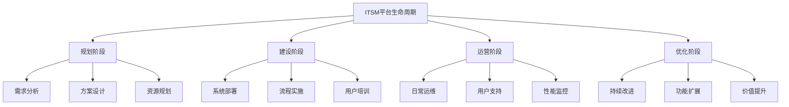

在企业级IT服务管理（ITSM）平台建设的全生命周期中，平台运营与团队建设是确保系统持续发挥价值、不断优化改进的关键环节。如果说前期的规划和实施是构建ITSM平台的"骨架"，那么平台运营与团队建设就是为其注入"血液"和"灵魂"的过程。

ITSM平台的成功不仅仅依赖于先进的技术和完善的流程设计，更需要一支专业、高效、协作的运营团队来持续维护、优化和创新。平台运营与团队建设相辅相成，共同构成了ITSM平台可持续发展的核心支撑体系。

随着ITSM平台从建设阶段转向运营阶段，组织的关注点也从项目交付转向价值创造。这一转变要求建立专业化的运营团队，制定标准化的运营流程，构建持续改进的机制，确保ITSM平台能够适应业务发展需求，持续为组织创造价值。

## 平台运营与团队建设的战略意义

### 1. 从项目交付到价值运营

#### 持续价值创造
ITSM平台建设项目的结束并不意味着工作的终结，而是价值运营的开始。平台运营的目标是确保系统能够持续、稳定、高效地运行，为业务提供优质的IT服务，实现投资回报最大化。



#### 运营成熟度提升
通过专业化的平台运营，组织能够不断提升IT服务管理的成熟度，从被动响应向主动预防转变，从经验驱动向数据驱动转变，从局部优化向全局优化转变。

### 2. 团队能力与组织效能

#### 专业化能力构建
ITSM平台运营需要具备专业知识和技能的团队成员，包括流程管理、系统维护、数据分析、用户支持等多个方面的能力。通过团队建设，能够系统性地提升团队的专业化水平。

#### 协作效率优化
高效的团队协作是平台运营成功的关键。通过明确的角色定义、清晰的职责分工、有效的沟通机制，能够显著提升团队的协作效率和工作质量。

### 3. 组织竞争力增强

#### 服务能力提升
专业化的平台运营团队能够提供更高质量的IT服务，提升用户满意度，增强组织的服务竞争力。

#### 创新驱动发展
通过建立学习型团队和创新机制，能够不断探索新的技术应用和服务模式，推动组织的创新发展。

## 角色与职责体系构建

### 1. 核心角色定义

#### 服务台经理
服务台经理是ITSM平台运营的一线管理者，负责服务台的日常运营管理、团队绩效管理和服务质量监控。

```json
{
  "service_desk_manager": {
    "primary_responsibilities": [
      "服务台运营管理",
      "团队绩效管理",
      "服务质量监控",
      "用户关系维护",
      "资源协调分配"
    ],
    "key_skills": [
      "团队管理能力",
      "沟通协调能力",
      "数据分析能力",
      "问题解决能力",
      "客户服务意识"
    ],
    "performance_metrics": [
      "服务台响应时间",
      "用户满意度",
      "问题解决率",
      "团队效率指标",
      "成本控制效果"
    ],
    "career_development": [
      "流程经理",
      "服务经理",
      "运营总监",
      "IT总监"
    ]
  }
}
```

#### 流程经理
流程经理负责ITSM平台中各项流程的设计、实施、监控和优化，确保流程能够有效支撑业务需求。

#### 技术支持团队
技术支持团队负责ITSM平台的技术维护、系统优化、故障处理和技术支持，确保平台的稳定运行。

### 2. RACI责任矩阵

#### 责任分配原则
通过RACI（Responsible, Accountable, Consulted, Informed）责任矩阵，明确各角色在关键活动中的责任分工，避免职责不清和推诿现象。

```python
class RACIMatrix:
    def __init__(self):
        self.roles = [
            "服务台经理",
            "流程经理",
            "技术支持主管",
            "数据分析师",
            "变更经理",
            "问题经理"
        ]
        self.activities = [
            "服务台运营管理",
            "流程设计与优化",
            "系统维护与升级",
            "数据分析与报告",
            "变更审批与实施",
            "问题调查与解决"
        ]
    
    def create_raci_matrix(self):
        """
        创建RACI矩阵
        """
        matrix = {}
        
        # 服务台运营管理
        matrix["服务台运营管理"] = {
            "服务台经理": "A",  # Accountable 负责
            "流程经理": "C",    # Consulted 咨询
            "技术支持主管": "I", # Informed 知会
            "数据分析师": "I",   # Informed 知会
            "变更经理": "C",    # Consulted 咨询
            "问题经理": "I"     # Informed 知会
        }
        
        # 流程设计与优化
        matrix["流程设计与优化"] = {
            "服务台经理": "C",  # Consulted 咨询
            "流程经理": "A",    # Accountable 负责
            "技术支持主管": "R", # Responsible 执行
            "数据分析师": "C",   # Consulted 咨询
            "变更经理": "C",    # Consulted 咨询
            "问题经理": "C"     # Consulted 咨询
        }
        
        # 系统维护与升级
        matrix["系统维护与升级"] = {
            "服务台经理": "I",  # Informed 知会
            "流程经理": "C",    # Consulted 咨询
            "技术支持主管": "A", # Accountable 负责
            "数据分析师": "I",   # Informed 知会
            "变更经理": "C",    # Consulted 咨询
            "问题经理": "R"     # Responsible 执行
        }
        
        # 数据分析与报告
        matrix["数据分析与报告"] = {
            "服务台经理": "C",  # Consulted 咨询
            "流程经理": "C",    # Consulted 咨询
            "技术支持主管": "I", # Informed 知会
            "数据分析师": "A",   # Accountable 负责
            "变更经理": "C",    # Consulted 咨询
            "问题经理": "C"     # Consulted 咨询
        }
        
        # 变更审批与实施
        matrix["变更审批与实施"] = {
            "服务台经理": "I",  # Informed 知会
            "流程经理": "C",    # Consulted 咨询
            "技术支持主管": "R", # Responsible 执行
            "数据分析师": "I",   # Informed 知会
            "变更经理": "A",    # Accountable 负责
            "问题经理": "C"     # Consulted 咨询
        }
        
        # 问题调查与解决
        matrix["问题调查与解决"] = {
            "服务台经理": "C",  # Consulted 咨询
            "流程经理": "C",    # Consulted 咨询
            "技术支持主管": "R", # Responsible 执行
            "数据分析师": "C",   # Consulted 咨询
            "变更经理": "C",    # Consulted 咨询
            "问题经理": "A"     # Accountable 负责
        }
        
        return matrix
    
    def validate_raci_matrix(self, matrix):
        """
        验证RACI矩阵的有效性
        """
        validation_results = []
        
        for activity in self.activities:
            activity_roles = matrix[activity]
            
            # 检查每个活动有且仅有一个A（Accountable）
            accountable_count = sum(1 for role in activity_roles.values() if role == "A")
            if accountable_count != 1:
                validation_results.append({
                    "activity": activity,
                    "issue": f"Accountable角色数量不正确: {accountable_count}",
                    "severity": "high"
                })
            
            # 检查至少有一个R（Responsible）
            responsible_count = sum(1 for role in activity_roles.values() if role == "R")
            if responsible_count == 0:
                validation_results.append({
                    "activity": activity,
                    "issue": "缺少Responsible角色",
                    "severity": "high"
                })
        
        return validation_results
```

### 3. 角色能力模型

#### 能力发展路径
为不同角色设计清晰的能力发展路径，帮助团队成员明确发展方向和提升目标。

```json
{
  "role_competency_model": {
    "service_desk_manager": {
      "levels": [
        {
          "level": "初级",
          "competencies": [
            "基础服务台运营管理",
            "团队日常管理",
            "基础数据分析",
            "用户沟通技巧"
          ],
          "experience_required": "1-2年相关经验"
        },
        {
          "level": "中级",
          "competencies": [
            "服务台绩效管理",
            "流程优化能力",
            "跨部门协调",
            "成本控制管理"
          ],
          "experience_required": "3-5年相关经验"
        },
        {
          "level": "高级",
          "competencies": [
            "战略规划能力",
            "组织变革管理",
            "创新服务设计",
            "领导力发展"
          ],
          "experience_required": "5年以上相关经验"
        }
      ]
    }
  }
}
```

## 标准化运营流程建设

### 1. 用户支持流程

#### 服务请求处理
建立标准化的服务请求处理流程，确保用户能够快速获得所需服务。

```python
class UserSupportProcess:
    def __init__(self):
        self.support_channels = ["电话", "邮件", "在线门户", "即时通讯"]
        self.priority_levels = ["紧急", "高", "中", "低"]
        self.sla_definitions = self.load_sla_definitions()
    
    def handle_service_request(self, request):
        """
        处理服务请求
        """
        # 请求分类
        request_category = self.categorize_request(request)
        
        # 优先级确定
        priority = self.determine_priority(request)
        
        # 分派处理
        assigned_team = self.assign_request(request_category, priority)
        
        # 创建工单
        ticket_id = self.create_ticket(request, request_category, priority, assigned_team)
        
        # 通知用户
        self.notify_user(ticket_id, request.requester)
        
        # 跟踪处理
        self.track_request_progress(ticket_id)
        
        return ticket_id
    
    def categorize_request(self, request):
        """
        请求分类
        """
        categories = {
            "硬件请求": ["设备申请", "设备维修", "设备更换"],
            "软件请求": ["软件安装", "软件升级", "许可证申请"],
            "账户请求": ["账户创建", "权限调整", "密码重置"],
            "网络请求": ["网络接入", "网络配置", "网络故障"],
            "其他请求": ["咨询", "培训", "文档"]
        }
        
        for category, keywords in categories.items():
            if any(keyword in request.description for keyword in keywords):
                return category
        
        return "其他请求"
    
    def determine_priority(self, request):
        """
        确定优先级
        """
        # 基于影响范围确定优先级
        impact_mapping = {
            "个人": "低",
            "团队": "中",
            "部门": "高",
            "全公司": "紧急"
        }
        
        impact = request.impact
        priority = impact_mapping.get(impact, "中")
        
        # 考虑紧急程度
        if request.is_urgent:
            if priority == "低":
                priority = "中"
            elif priority == "中":
                priority = "高"
            elif priority == "高":
                priority = "紧急"
        
        return priority
```

#### 故障处理流程
建立标准化的故障处理流程，确保故障能够得到及时有效的解决。

### 2. 流程配置管理

#### 配置变更控制
建立配置变更控制流程，确保平台配置的规范性和一致性。

```json
{
  "configuration_management_process": {
    "change_request_process": {
      "steps": [
        {
          "step": "1. 变更申请",
          "description": "提交变更申请，说明变更原因和内容",
          "responsible": "变更申请人",
          "required_documents": ["变更申请表", "变更影响分析"]
        },
        {
          "step": "2. 变更评估",
          "description": "评估变更的影响和风险",
          "responsible": "变更经理",
          "required_documents": ["风险评估报告", "回退计划"]
        },
        {
          "step": "3. 变更审批",
          "description": "变更顾问委员会审批",
          "responsible": "CAB委员会",
          "required_documents": ["变更评估报告", "审批记录"]
        },
        {
          "step": "4. 变更实施",
          "description": "按照计划实施变更",
          "responsible": "实施团队",
          "required_documents": ["实施计划", "测试计划"]
        },
        {
          "step": "5. 变更验证",
          "description": "验证变更效果",
          "responsible": "测试团队",
          "required_documents": ["测试报告", "验证记录"]
        },
        {
          "step": "6. 变更关闭",
          "description": "关闭变更记录",
          "responsible": "变更经理",
          "required_documents": ["变更总结报告", "关闭记录"]
        }
      ]
    }
  }
}
```

#### 配置审核机制
建立定期的配置审核机制，确保配置信息的准确性和完整性。

### 3. 权限管理体系

#### 角色权限设计
基于角色的权限设计，确保用户只能访问其工作所需的资源和功能。

```python
class PermissionManagement:
    def __init__(self):
        self.roles = self.load_roles()
        self.permissions = self.load_permissions()
        self.role_permissions = self.load_role_permissions()
    
    def assign_role_permissions(self, user, role):
        """
        分配角色权限
        """
        # 获取角色对应的权限
        role_perms = self.role_permissions.get(role, [])
        
        # 为用户分配权限
        for perm in role_perms:
            self.grant_permission(user, perm)
        
        # 记录权限分配
        self.log_permission_assignment(user, role, role_perms)
        
        return True
    
    def check_permission(self, user, permission):
        """
        检查用户权限
        """
        # 获取用户所有权限
        user_permissions = self.get_user_permissions(user)
        
        # 检查权限
        return permission in user_permissions
    
    def create_custom_role(self, role_name, permissions):
        """
        创建自定义角色
        """
        # 验证权限有效性
        valid_permissions = self.validate_permissions(permissions)
        
        # 创建角色
        new_role = self.create_role(role_name, valid_permissions)
        
        # 保存角色权限映射
        self.role_permissions[role_name] = valid_permissions
        
        # 记录角色创建
        self.log_role_creation(role_name, valid_permissions)
        
        return new_role
```

#### 权限审计机制
建立权限审计机制，定期检查和清理不必要的权限分配。

## 内部专家培养与社区建设

### 1. 专家培养体系

#### 技能发展计划
为团队成员制定个性化的技能发展计划，帮助其提升专业能力。

```python
class ExpertDevelopmentProgram:
    def __init__(self):
        self.skill_domains = [
            "流程管理",
            "系统技术",
            "数据分析",
            "用户服务",
            "项目管理"
        ]
        self.training_resources = self.load_training_resources()
        self.mentors = self.load_mentors()
    
    def create_development_plan(self, employee):
        """
        为员工创建发展计划
        """
        # 评估当前技能水平
        current_skills = self.assess_current_skills(employee)
        
        # 确定发展目标
        development_goals = self.define_development_goals(employee, current_skills)
        
        # 制定学习路径
        learning_path = self.create_learning_path(development_goals)
        
        # 安排导师指导
        mentor = self.assign_mentor(employee, development_goals)
        
        # 设置里程碑
        milestones = self.set_milestones(learning_path)
        
        # 创建发展计划
        development_plan = {
            "employee_id": employee.id,
            "current_skills": current_skills,
            "development_goals": development_goals,
            "learning_path": learning_path,
            "mentor": mentor,
            "milestones": milestones,
            "timeline": "12个月"
        }
        
        # 保存发展计划
        self.save_development_plan(development_plan)
        
        return development_plan
    
    def assess_current_skills(self, employee):
        """
        评估当前技能水平
        """
        # 自我评估
        self_assessment = self.conduct_self_assessment(employee)
        
        # 上级评估
        manager_assessment = self.conduct_manager_assessment(employee)
        
        # 同事评估
        peer_assessment = self.conduct_peer_assessment(employee)
        
        # 综合评估结果
       综合评估 = self.integrate_assessments(
            self_assessment,
            manager_assessment,
            peer_assessment
        )
        
        return 综合评估
    
    def create_learning_path(self, development_goals):
        """
        创建学习路径
        """
        learning_path = []
        
        for goal in development_goals:
            # 选择学习资源
            resources = self.select_learning_resources(goal)
            
            # 安排学习时间
            schedule = self.schedule_learning_activities(resources)
            
            # 设置考核标准
            evaluation_criteria = self.set_evaluation_criteria(goal)
            
            learning_path.append({
                "goal": goal,
                "resources": resources,
                "schedule": schedule,
                "evaluation_criteria": evaluation_criteria
            })
        
        return learning_path
```

#### 认证与考核机制
建立认证与考核机制，确保专家能力的客观评价和持续提升。

### 2. 知识分享社区

#### 内部技术社区
建立内部技术社区，促进知识分享和经验交流。

```json
{
  "internal_community_structure": {
    "community_platform": {
      "features": [
        "技术问答",
        "经验分享",
        "最佳实践",
        "问题讨论",
        "资源共享"
      ],
      "moderation": {
        "content_moderators": ["资深专家", "流程经理"],
        "quality_standards": ["原创性", "实用性", "准确性"],
        "review_process": ["提交", "审核", "发布"]
      }
    },
    "community_activities": [
      {
        "activity": "技术分享会",
        "frequency": "每月一次",
        "format": "线上/线下结合",
        "participants": "全体技术人员"
      },
      {
        "activity": "案例复盘",
        "frequency": "每季度一次",
        "format": "专题讨论",
        "participants": "相关项目成员"
      },
      {
        "activity": "新员工培训",
        "frequency": "按需进行",
        "format": "导师制",
        "participants": "新入职员工"
      }
    ]
  }
}
```

#### 最佳实践库
建立最佳实践库，收集和整理团队在实际工作中形成的有效方法和经验。

### 3. 创新激励机制

#### 创新提案系统
建立创新提案系统，鼓励团队成员提出改进建议和创新想法。

```python
class InnovationIncentiveSystem:
    def __init__(self):
        self.proposal_system = ProposalSystem()
        self.evaluation_committee = EvaluationCommittee()
        self.reward_system = RewardSystem()
    
    def submit_innovation_proposal(self, proposal):
        """
        提交创新提案
        """
        # 验证提案完整性
        if not self.validate_proposal(proposal):
            return False
        
        # 记录提案
        proposal_id = self.proposal_system.record_proposal(proposal)
        
        # 分配评审
        self.evaluation_committee.assign_reviewers(proposal_id)
        
        # 通知提交者
        self.notify_submitter(proposal_id)
        
        return proposal_id
    
    def evaluate_proposal(self, proposal_id):
        """
        评估提案
        """
        # 获取提案详情
        proposal = self.proposal_system.get_proposal(proposal_id)
        
        # 组织评审
        evaluation_result = self.evaluation_committee.conduct_evaluation(proposal)
        
        # 记录评估结果
        self.proposal_system.record_evaluation(proposal_id, evaluation_result)
        
        # 通知相关人员
        self.notify_evaluation_result(proposal_id, evaluation_result)
        
        # 如果通过，安排实施
        if evaluation_result["approved"]:
            self.arrange_implementation(proposal_id, evaluation_result)
        
        return evaluation_result
    
    def implement_approved_proposal(self, proposal_id):
        """
        实施已批准的提案
        """
        # 获取提案详情
        proposal = self.proposal_system.get_proposal(proposal_id)
        
        # 制定实施计划
        implementation_plan = self.create_implementation_plan(proposal)
        
        # 分配资源
        self.allocate_resources(implementation_plan)
        
        # 执行实施
        implementation_result = self.execute_implementation(implementation_plan)
        
        # 评估效果
        effect_evaluation = self.evaluate_implementation_effect(implementation_result)
        
        # 给予奖励
        if effect_evaluation["successful"]:
            self.reward_system.give_reward(proposal.submitter, effect_evaluation["impact_score"])
        
        # 记录实施结果
        self.proposal_system.record_implementation(proposal_id, implementation_result, effect_evaluation)
        
        return implementation_result
```

#### 成果认可与奖励
建立成果认可与奖励机制，激发团队成员的积极性和创造性。

## 运营效果监控与优化

### 1. 关键绩效指标体系

#### 运营指标设计
设计全面的运营指标体系，从多个维度衡量平台运营效果。

```python
class OperationsMetricsSystem:
    def __init__(self):
        self.metrics_categories = {
            "service_delivery": ["响应时间", "解决时间", "用户满意度"],
            "system_performance": ["系统可用性", "性能指标", "故障率"],
            "team_efficiency": ["工单处理量", "工作效率", "技能提升"],
            "business_impact": ["成本节约", "业务支持", "价值创造"]
        }
        self.data_collector = DataCollector()
        self.report_generator = ReportGenerator()
    
    def collect_metrics_data(self):
        """
        收集指标数据
        """
        metrics_data = {}
        
        for category, metrics in self.metrics_categories.items():
            category_data = {}
            for metric in metrics:
                # 收集具体指标数据
                data = self.data_collector.collect_metric_data(metric)
                category_data[metric] = data
            metrics_data[category] = category_data
        
        return metrics_data
    
    def generate_performance_report(self):
        """
        生成绩效报告
        """
        # 收集数据
        metrics_data = self.collect_metrics_data()
        
        # 分析数据
        analysis_results = self.analyze_metrics(metrics_data)
        
        # 生成报告
        report = self.report_generator.create_report(analysis_results)
        
        # 发送报告
        self.distribute_report(report)
        
        return report
    
    def analyze_metrics(self, metrics_data):
        """
        分析指标数据
        """
        analysis_results = {}
        
        for category, category_data in metrics_data.items():
            category_analysis = {}
            for metric, data in category_data.items():
                # 计算统计指标
                statistics = self.calculate_statistics(data)
                
                # 趋势分析
                trend = self.analyze_trend(data)
                
                # 对比分析
                comparison = self.compare_with_benchmark(metric, statistics)
                
                category_analysis[metric] = {
                    "statistics": statistics,
                    "trend": trend,
                    "comparison": comparison
                }
            
            analysis_results[category] = category_analysis
        
        return analysis_results
```

#### 持续改进机制
建立基于数据的持续改进机制，不断优化运营效果。

### 2. 用户满意度管理

#### 满意度调查体系
建立定期的用户满意度调查体系，了解用户需求和改进方向。

#### 反馈处理流程
建立用户反馈的处理流程，确保用户意见能够得到及时响应和处理。

### 3. 风险识别与管控

#### 运营风险识别
识别平台运营过程中的潜在风险，制定相应的管控措施。

#### 应急响应机制
建立应急响应机制，确保在突发情况下能够快速有效地应对。

## 成功要素与最佳实践

### 1. 关键成功因素

#### 高层管理支持
平台运营与团队建设需要获得高层管理者的持续支持和资源投入。

#### 专业化团队建设
建立专业化的运营团队，确保团队成员具备相应的知识和技能。

#### 标准化流程执行
严格执行标准化的运营流程，确保服务质量的一致性和可预测性。

### 2. 实施建议

#### 循序渐进的推进策略
采用循序渐进的推进策略，先建立基础的运营体系，再逐步完善和优化。

#### 持续的培训与发展
持续开展培训和发展活动，不断提升团队的专业能力和综合素质。

#### 有效的激励机制
建立有效的激励机制，激发团队成员的积极性和创造性。

## 结语

平台运营与团队建设是ITSM平台成功运营的关键保障。通过建立清晰的角色与职责体系、标准化的运营流程、专业化的团队培养机制，组织能够确保ITSM平台持续发挥价值，为业务发展提供强有力的支撑。

在角色与职责体系构建方面，通过明确的核心角色定义、科学的RACI责任矩阵和系统的能力发展路径，能够确保团队成员各司其职、协同合作，形成高效的工作机制。这不仅有助于提升工作效率，还为团队成员的职业发展提供了清晰的指引。

在标准化运营流程建设方面，通过建立完善的服务支持流程、配置管理流程和权限管理体系，能够确保平台运营的规范性和一致性。标准化的流程不仅提高了服务质量，还降低了运营风险，为平台的稳定运行提供了保障。

在内部专家培养与社区建设方面，通过系统性的专家培养体系、活跃的知识分享社区和创新激励机制，能够不断提升团队的专业能力，促进知识的积累和传承。这不仅有助于解决当前的运营问题，还为未来的创新发展奠定了基础。

平台运营与团队建设是一个持续的过程，需要组织在实践中不断探索和完善。随着业务的发展和技术的进步，运营模式和团队结构也需要相应地调整和优化。只有建立起适应性强、可持续发展的运营体系，ITSM平台才能真正成为组织数字化转型的重要支撑。

通过有效的平台运营与团队建设，组织不仅能够提升IT服务的质量和效率，还能够培养一支专业化的技术团队，为企业的长远发展储备人才资源。在数字化时代，这种能力将成为组织核心竞争力的重要组成部分，推动组织在激烈的市场竞争中保持领先地位。

最终，成功的平台运营与团队建设将实现技术、流程、人员的有机融合，构建起一个高效、智能、可持续的IT服务管理体系，为组织的长期发展创造持续价值。这不仅是ITSM平台建设的目标，更是组织数字化转型成功的重要标志。