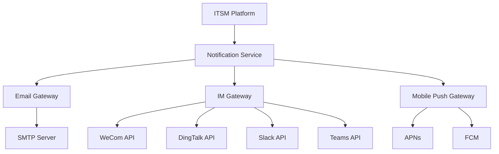

在现代企业环境中，信息的及时传递和有效沟通是确保IT服务高效运行的关键因素。随着远程办公和分布式团队的普及，传统的邮件通知方式已无法满足用户对实时性和便捷性的需求。通过与即时通讯（IM）工具和邮件系统的深度集成，ITSM平台能够为用户提供多渠道、个性化的实时通知与更新服务，显著提升用户体验和工作效率。

## 通知集成的核心价值

### 1. 用户体验提升

#### 多渠道触达
现代企业员工使用多种沟通工具进行日常工作，包括企业微信、钉钉、Slack、Microsoft Teams等即时通讯工具，以及传统的邮件系统。通过与这些工具的集成，ITSM平台可以将工单状态更新、处理进度、重要提醒等信息通过用户偏好的渠道及时送达，避免信息遗漏。

#### 实时性保障
相比传统的邮件通知，即时通讯工具具有更强的实时性。当工单状态发生变化时，用户可以立即收到通知，无需等待邮件的发送和接收过程，大大缩短了信息传递的延迟。

#### 交互性增强
即时通讯工具支持双向交互，用户可以直接在消息中进行回复、确认或提供反馈，而无需切换到ITSM平台界面。这种无缝的交互体验显著提升了用户满意度和工作效率。

### 2. 运维效率优化

#### 快速响应机制
通过即时通讯工具的通知，运维人员可以更快地响应工单处理需求，缩短响应时间。特别是在紧急事件处理中，实时通知能够确保相关人员第一时间获知问题，快速启动处理流程。

#### 协作效率提升
集成的协作工具支持团队成员之间的实时沟通和协作。当处理复杂工单时，相关人员可以在专用的聊天群组中进行讨论、共享信息、协调资源，提高团队协作效率。

#### 上下文保持
通过在协作工具中嵌入工单相关信息，用户可以在不离开当前工作环境的情况下获取必要的上下文信息，减少了上下文切换的成本和错误。

### 3. 管理决策支持

#### 状态透明化
通过实时通知，管理层可以及时了解关键工单的处理进度和状态，提高管理透明度。这对于SLA监控、资源调配和风险预警具有重要意义。

#### 数据驱动决策
集成系统可以收集和分析通知交互数据，为管理决策提供数据支持。例如，通过分析通知响应时间和处理效率，可以识别流程瓶颈和优化机会。

## 集成架构设计

### 1. 技术架构

#### 多渠道通知架构


#### 事件驱动通知机制
```python
class NotificationService:
    def __init__(self):
        self.event_bus = EventBus()
        self.channel_managers = {
            'email': EmailChannelManager(),
            'wechat': WeChatChannelManager(),
            'dingtalk': DingTalkChannelManager(),
            'slack': SlackChannelManager(),
            'teams': TeamsChannelManager()
        }
    
    def handle_notification_event(self, event):
        """
        处理通知事件
        """
        try:
            # 解析事件数据
            notification_data = self.parse_event_data(event)
            
            # 确定通知渠道
            channels = self.determine_notification_channels(notification_data)
            
            # 发送通知
            results = []
            for channel in channels:
                result = self.send_notification(channel, notification_data)
                results.append(result)
            
            # 记录通知日志
            self.log_notification_results(notification_data, results)
            
            return results
        except Exception as e:
            logger.error(f"Notification handling failed: {str(e)}")
            return []
```

#### 通知模板管理系统
```json
{
  "template_id": "ticket_assigned",
  "name": "工单分配通知",
  "description": "当工单被分配给处理人员时发送的通知",
  "channels": ["email", "wechat", "dingtalk"],
  "templates": {
    "email": {
      "subject": "[ITSM] 新工单分配 - {{ticket.title}}",
      "body": "您好 {{assignee.name}}，\n\n您有一个新的工单需要处理：\n标题：{{ticket.title}}\n编号：{{ticket.id}}\n优先级：{{ticket.priority}}\n描述：{{ticket.description}}\n\n请登录ITSM平台查看详情并及时处理。\n\n{{system.url}}/tickets/{{ticket.id}}"
    },
    "wechat": {
      "title": "新工单分配",
      "description": "{{assignee.name}}，您有一个新的工单需要处理",
      "url": "{{system.url}}/tickets/{{ticket.id}}",
      "template_data": {
        "first": "您有一个新的工单需要处理",
        "keyword1": "{{ticket.id}}",
        "keyword2": "{{ticket.title}}",
        "keyword3": "{{ticket.priority}}",
        "remark": "请及时处理"
      }
    },
    "dingtalk": {
      "msgtype": "link",
      "link": {
        "title": "新工单分配 - {{ticket.title}}",
        "text": "工单编号：{{ticket.id}}\n优先级：{{ticket.priority}}\n描述：{{ticket.description}}",
        "messageUrl": "{{system.url}}/tickets/{{ticket.id}}"
      }
    }
  }
}
```

### 2. 数据模型设计

#### 用户偏好配置
```json
{
  "user_id": "user-001",
  "username": "john.doe",
  "notification_preferences": {
    "channels": ["email", "wechat"],
    "email": {
      "address": "john.doe@company.com",
      "frequency": "immediate",
      "categories": ["assigned", "updated", "resolved"]
    },
    "wechat": {
      "openid": "wechat-openid-12345",
      "frequency": "immediate",
      "categories": ["assigned", "escalated"]
    },
    "dingtalk": {
      "userid": "dingtalk-user-67890",
      "frequency": "batch",
      "batch_time": "09:00,14:00,17:00",
      "categories": ["all"]
    },
    "slack": {
      "userid": "slack-user-abcde",
      "frequency": "immediate",
      "categories": ["assigned", "escalated", "resolved"]
    }
  },
  "timezone": "Asia/Shanghai",
  "language": "zh-CN"
}
```

#### 通知事件模型
```json
{
  "event_id": "notif-20230906-001",
  "event_type": "ticket_assigned",
  "timestamp": "2023-09-06T10:30:00Z",
  "source": "ITSM Platform",
  "target_users": ["user-001", "user-002"],
  "content": {
    "ticket_id": "INC-001234",
    "ticket_title": "Web服务器CPU使用率过高",
    "assignee": "user-001",
    "priority": "High",
    "description": "监控系统检测到web-server-01 CPU使用率超过90%"
  },
  "context": {
    "related_cis": ["web-server-01"],
    "impacted_services": ["Web Portal"],
    "sla_deadline": "2023-09-06T12:00:00Z"
  },
  "delivery_status": {
    "email": {"status": "sent", "timestamp": "2023-09-06T10:30:01Z"},
    "wechat": {"status": "delivered", "timestamp": "2023-09-06T10:30:02Z"},
    "dingtalk": {"status": "pending", "reason": "batch_scheduled"}
  }
}
```

## 核心功能实现

### 1. 多渠道通知发送

#### 通知路由机制
```python
class NotificationRouter:
    def __init__(self):
        self.channel_dispatchers = {
            'email': EmailDispatcher(),
            'wechat': WeChatDispatcher(),
            'dingtalk': DingTalkDispatcher(),
            'slack': SlackDispatcher(),
            'teams': TeamsDispatcher(),
            'sms': SMSDispatcher()
        }
    
    def route_notification(self, notification_request):
        """
        路由通知请求到相应渠道
        """
        # 获取用户偏好设置
        user_preferences = user_service.get_notification_preferences(
            notification_request.target_user
        )
        
        # 根据偏好确定发送渠道
        channels_to_use = self.determine_channels(
            notification_request.event_type,
            user_preferences
        )
        
        # 并行发送通知
        results = {}
        with ThreadPoolExecutor(max_workers=5) as executor:
            future_to_channel = {
                executor.submit(
                    self.send_via_channel,
                    channel,
                    notification_request,
                    user_preferences
                ): channel for channel in channels_to_use
            }
            
            for future in as_completed(future_to_channel):
                channel = future_to_channel[future]
                try:
                    result = future.result()
                    results[channel] = result
                except Exception as e:
                    results[channel] = {"status": "failed", "error": str(e)}
        
        return results
    
    def send_via_channel(self, channel, request, preferences):
        """
        通过指定渠道发送通知
        """
        dispatcher = self.channel_dispatchers.get(channel)
        if not dispatcher:
            return {"status": "failed", "error": f"Unsupported channel: {channel}"}
        
        return dispatcher.send(request, preferences.get(channel, {}))
```

#### 模板渲染引擎
```python
class TemplateRenderer:
    def __init__(self):
        self.template_engine = Jinja2Environment()
    
    def render_notification_template(self, template_id, context):
        """
        渲染通知模板
        """
        # 获取模板
        template_config = template_service.get_template(template_id)
        
        # 渲染各渠道模板
        rendered_templates = {}
        for channel, template in template_config.templates.items():
            rendered_templates[channel] = self.render_template(template, context)
        
        return rendered_templates
    
    def render_template(self, template, context):
        """
        渲染单个模板
        """
        # 处理模板变量
        processed_context = self.process_context(context)
        
        # 渲染模板
        rendered = self.template_engine.from_string(template).render(processed_context)
        
        return rendered
    
    def process_context(self, context):
        """
        处理模板上下文
        """
        # 添加系统变量
        processed_context = context.copy()
        processed_context['system'] = {
            'name': 'ITSM Platform',
            'url': 'https://itsm.company.com',
            'support_email': 'support@company.com',
            'current_time': datetime.now().isoformat()
        }
        
        # 格式化数据
        processed_context = self.format_context_data(processed_context)
        
        return processed_context
```

### 2. 智能通知策略

#### 优先级通知机制
```python
class PriorityNotificationManager:
    def __init__(self):
        self.priority_rules = self.load_priority_rules()
    
    def determine_notification_priority(self, event):
        """
        确定通知优先级
        """
        # 基于事件类型确定基础优先级
        base_priority = self.get_base_priority(event.type)
        
        # 考虑影响范围
        impact_factor = self.calculate_impact_factor(event)
        priority = base_priority * impact_factor
        
        # 考虑时间敏感性
        time_factor = self.calculate_time_sensitivity(event)
        priority = priority * time_factor
        
        # 考虑用户角色
        role_factor = self.calculate_role_factor(event.target_users)
        priority = priority * role_factor
        
        return priority
    
    def apply_notification_strategy(self, event, priority):
        """
        应用通知策略
        """
        strategy = self.select_strategy(priority)
        
        if strategy == 'immediate':
            return self.send_immediate_notification(event)
        elif strategy == 'escalation':
            return self.send_escalation_notification(event)
        elif strategy == 'batch':
            return self.schedule_batch_notification(event)
        else:
            return self.send_standard_notification(event)
```

#### 个性化通知配置
```python
class PersonalizationManager:
    def __init__(self):
        self.user_profiles = UserProfileService()
        self.behavior_analyzer = UserBehaviorAnalyzer()
    
    def personalize_notification(self, notification, user_id):
        """
        个性化通知内容
        """
        # 获取用户档案
        user_profile = self.user_profiles.get_profile(user_id)
        
        # 分析用户行为偏好
        behavior_preferences = self.behavior_analyzer.analyze_preferences(user_id)
        
        # 个性化内容
        personalized_content = self.customize_content(
            notification.content,
            user_profile,
            behavior_preferences
        )
        
        # 选择最佳发送时间
        optimal_time = self.calculate_optimal_send_time(
            user_id,
            notification.type
        )
        
        return {
            'content': personalized_content,
            'send_time': optimal_time,
            'channels': self.determine_preferred_channels(user_id, notification.type)
        }
```

### 3. 交互式通知处理

#### 通知操作按钮
```python
class InteractiveNotification:
    def __init__(self):
        self.action_handlers = {
            'acknowledge': self.handle_acknowledge,
            'resolve': self.handle_resolve,
            'escalate': self.handle_escalate,
            'comment': self.handle_comment
        }
    
    def create_interactive_notification(self, ticket, user):
        """
        创建交互式通知
        """
        notification = {
            'type': 'interactive_ticket_update',
            'ticket_id': ticket.id,
            'title': ticket.title,
            'status': ticket.status,
            'actions': self.generate_available_actions(ticket, user),
            'context': {
                'ticket_url': f"https://itsm.company.com/tickets/{ticket.id}",
                'related_info': self.get_related_information(ticket)
            }
        }
        
        return notification
    
    def generate_available_actions(self, ticket, user):
        """
        生成可用操作按钮
        """
        actions = []
        
        # 根据用户角色和工单状态生成操作
        if user.can_acknowledge(ticket) and ticket.status == 'new':
            actions.append({
                'action': 'acknowledge',
                'label': '确认接收',
                'style': 'primary'
            })
        
        if user.can_resolve(ticket) and ticket.status in ['in_progress', 'assigned']:
            actions.append({
                'action': 'resolve',
                'label': '标记解决',
                'style': 'success'
            })
        
        if ticket.status != 'closed':
            actions.append({
                'action': 'comment',
                'label': '添加评论',
                'style': 'default'
            })
        
        return actions
```

#### 回复处理机制
```python
class ReplyHandler:
    def __init__(self):
        self.command_processors = {
            'ack': self.process_acknowledge,
            'resolve': self.process_resolve,
            'comment': self.process_comment,
            'status': self.process_status_query
        }
    
    def handle_incoming_reply(self, reply_data):
        """
        处理收到的回复消息
        """
        try:
            # 解析回复内容
            command, parameters = self.parse_reply(reply_data.content)
            
            # 验证用户权限
            if not self.validate_user_permission(reply_data.user, command):
                return self.send_permission_denied(reply_data)
            
            # 执行相应操作
            processor = self.command_processors.get(command)
            if processor:
                result = processor(reply_data, parameters)
                return self.send_confirmation(reply_data, result)
            else:
                return self.send_unknown_command(reply_data)
        except Exception as e:
            logger.error(f"Error handling reply: {str(e)}")
            return self.send_error_response(reply_data, str(e))
    
    def process_acknowledge(self, reply_data, parameters):
        """
        处理确认接收命令
        """
        ticket_id = self.extract_ticket_id(reply_data)
        user = reply_data.user
        
        # 更新工单状态
        ticket = ticket_service.get_ticket(ticket_id)
        ticket.acknowledge(user)
        ticket_service.update_ticket(ticket)
        
        # 记录操作日志
        audit_service.log_action(user, 'acknowledge', ticket_id)
        
        return {
            'status': 'success',
            'message': f'工单 {ticket_id} 已确认接收',
            'ticket_status': ticket.status
        }
```

## 高级集成特性

### 1. 智能通知优化

#### 通知聚合机制
```python
class NotificationAggregator:
    def __init__(self):
        self.pending_notifications = defaultdict(list)
        self.aggregation_rules = self.load_aggregation_rules()
    
    def aggregate_notifications(self, notification):
        """
        聚合通知以减少打扰
        """
        # 检查是否需要聚合
        if not self.should_aggregate(notification):
            return self.send_immediately(notification)
        
        # 添加到待聚合队列
        aggregation_key = self.generate_aggregation_key(notification)
        self.pending_notifications[aggregation_key].append(notification)
        
        # 检查是否达到发送条件
        if self.should_send_aggregated(aggregation_key):
            return self.send_aggregated_notification(aggregation_key)
        
        return {"status": "queued", "aggregation_key": aggregation_key}
    
    def should_aggregate(self, notification):
        """
        判断是否需要聚合通知
        """
        # 基于用户偏好
        user_prefs = user_service.get_notification_preferences(notification.target_user)
        if not user_prefs.get('enable_aggregation', True):
            return False
        
        # 基于通知类型
        if notification.type in ['ticket_comment', 'status_update']:
            return True
        
        # 基于时间窗口
        recent_notifications = self.get_recent_notifications(notification.target_user)
        if len(recent_notifications) > 5:  # 短时间内大量通知
            return True
        
        return False
```

#### 智能静默机制
```python
class SmartSilenceManager:
    def __init__(self):
        self.user_activity_tracker = UserActivityTracker()
        self.working_hours_manager = WorkingHoursManager()
    
    def should_silence_notification(self, notification, user_id):
        """
        智能判断是否应该静默通知
        """
        # 检查用户当前状态
        user_status = self.user_activity_tracker.get_user_status(user_id)
        
        # 用户正在专注工作时静默非紧急通知
        if user_status == 'focused' and not self.is_urgent_notification(notification):
            return True
        
        # 用户在会议中时静默通知
        if user_status == 'in_meeting':
            return True
        
        # 非工作时间静默非紧急通知
        if not self.working_hours_manager.is_working_hour(user_id) and \
           not self.is_urgent_notification(notification):
            return True
        
        # 用户已设置免打扰模式
        if self.is_do_not_disturb_enabled(user_id):
            return True
        
        return False
    
    def is_urgent_notification(self, notification):
        """
        判断是否为紧急通知
        """
        # 基于工单优先级
        if hasattr(notification, 'ticket') and notification.ticket.priority in ['Critical', 'High']:
            return True
        
        # 基于通知类型
        urgent_types = ['system_failure', 'security_alert', 'sla_breaching']
        if notification.type in urgent_types:
            return True
        
        return False
```

### 2. 数据分析与洞察

#### 通知效果分析
```python
class NotificationAnalytics:
    def __init__(self):
        self.metrics_collector = MetricsCollector()
    
    def analyze_notification_effectiveness(self):
        """
        分析通知效果
        """
        metrics = {
            'delivery_rate': self.calculate_delivery_rate(),
            'open_rate': self.calculate_open_rate(),
            'response_time': self.calculate_average_response_time(),
            'user_satisfaction': self.calculate_user_satisfaction(),
            'channel_performance': self.analyze_channel_performance()
        }
        
        # 生成分析报告
        report = self.generate_analytics_report(metrics)
        
        # 提供优化建议
        recommendations = self.generate_optimization_recommendations(metrics)
        
        return {
            'metrics': metrics,
            'report': report,
            'recommendations': recommendations
        }
    
    def calculate_response_time(self):
        """
        计算平均响应时间
        """
        # 获取通知发送时间和用户响应时间
        notification_times = self.metrics_collector.get_notification_times()
        response_times = self.metrics_collector.get_response_times()
        
        # 计算响应时间差
        response_differences = []
        for notif_time, resp_time in zip(notification_times, response_times):
            difference = (resp_time - notif_time).total_seconds()
            response_differences.append(difference)
        
        # 计算平均值
        if response_differences:
            average_response_time = sum(response_differences) / len(response_differences)
            return average_response_time
        else:
            return 0
```

## 集成实施策略

### 1. 分阶段实施方法

#### 第一阶段：基础通知集成
- 实现邮件通知功能
- 集成1-2个主流IM工具
- 建立基础的通知模板系统

#### 第二阶段：多渠道扩展
- 集成更多IM工具和移动推送
- 实现通知个性化配置
- 建立通知效果监控机制

#### 第三阶段：智能优化
- 实现智能通知聚合和静默
- 建立交互式通知处理
- 实现基于AI的通知优化

### 2. 用户体验优化

#### 渐进式引导
```python
class UserOnboarding:
    def __init__(self):
        self.onboarding_steps = [
            self.setup_basic_notifications,
            self.configure_preferred_channels,
            self.customize_notification_rules,
            self.enable_advanced_features
        ]
    
    def start_onboarding(self, user_id):
        """
        开始用户引导流程
        """
        user_preferences = user_service.get_notification_preferences(user_id)
        
        # 检查已完成的步骤
        completed_steps = user_preferences.get('onboarding_completed', [])
        
        # 执行未完成的步骤
        for i, step in enumerate(self.onboarding_steps):
            step_name = f"step_{i+1}"
            if step_name not in completed_steps:
                step(user_id)
                completed_steps.append(step_name)
                user_service.update_onboarding_status(user_id, completed_steps)
```

#### 反馈收集机制
```python
class FeedbackCollector:
    def __init__(self):
        self.feedback_storage = FeedbackStorage()
    
    def collect_notification_feedback(self, user_id, notification_id):
        """
        收集通知反馈
        """
        feedback_request = {
            'user_id': user_id,
            'notification_id': notification_id,
            'timestamp': datetime.now(),
            'channels': ['email', 'wechat', 'in_app'],
            'questions': [
                {
                    'id': 'usefulness',
                    'text': '这条通知对您有用吗？',
                    'type': 'rating',
                    'scale': 5
                },
                {
                    'id': 'timing',
                    'text': '通知的发送时间是否合适？',
                    'type': 'rating',
                    'scale': 5
                },
                {
                    'id': 'channel',
                    'text': '您更喜欢通过哪种渠道接收此类通知？',
                    'type': 'single_choice',
                    'options': ['邮件', '微信', '钉钉', '应用内']
                }
            ]
        }
        
        # 发送反馈请求
        self.send_feedback_request(feedback_request)
        
        # 存储反馈数据
        self.feedback_storage.store_feedback_request(feedback_request)
```

## 最佳实践案例

### 案例一：某互联网公司的全渠道通知实践

某大型互联网公司在实施通知集成时，采用了全面的策略：

#### 技术实现
- 集成了企业微信、钉钉、Slack、Teams等多种IM工具
- 实现了邮件、移动推送、应用内通知的统一管理
- 开发了智能的通知路由和聚合机制

#### 业务效果
- 用户通知打开率提升了45%
- 工单平均响应时间缩短了30%
- 用户满意度提升了25个百分点
- 运维团队工作效率提升了35%

#### 经验总结
- 用户体验是通知集成的核心
- 多渠道覆盖是提升触达率的关键
- 智能优化是保持效果的重要手段
- 持续改进是确保长期成功的基础

### 案例二：某金融机构的安全通知实践

某金融机构在实施通知集成时，特别注重安全性和合规性：

#### 安全措施
- 实现了端到端加密的通知传输
- 建立了严格的身份验证机制
- 实施了详细的审计日志记录
- 建立了完善的数据保护措施

#### 合规保障
- 符合金融行业数据保护法规
- 通过了内部安全审计
- 建立了通知内容审核机制
- 实现了用户隐私保护

#### 实施效果
- 通知安全事件为零
- 合规审计全部通过
- 用户信任度显著提升
- 运营风险有效控制

#### 关键要点
- 安全优先于便利
- 合规是基本要求
- 透明度建立信任
- 持续监控确保安全

## 监控与优化

### 1. 性能监控指标

#### 通知系统监控
```python
class NotificationMonitoring:
    def __init__(self):
        self.metrics_collector = MetricsCollector()
        self.alert_manager = AlertManager()
    
    def monitor_notification_performance(self):
        """
        监控通知性能
        """
        metrics = {
            'delivery_latency': self.measure_delivery_latency(),
            'success_rate': self.calculate_delivery_success_rate(),
            'channel_availability': self.check_channel_availability(),
            'user_engagement': self.measure_user_engagement(),
            'system_health': self.check_system_health()
        }
        
        # 记录指标
        self.metrics_collector.record('notification_performance', metrics)
        
        # 异常检测
        if self.detect_anomalies(metrics):
            self.alert_manager.send_alert('Notification performance degradation detected')
        
        return metrics
    
    def measure_delivery_latency(self):
        """
        测量通知送达延迟
        """
        # 获取通知发送和接收时间
        send_times = self.metrics_collector.get_send_times()
        receive_times = self.metrics_collector.get_receive_times()
        
        # 计算延迟
        latencies = []
        for send_time, receive_time in zip(send_times, receive_times):
            latency = (receive_time - send_time).total_seconds()
            latencies.append(latency)
        
        # 计算平均延迟
        if latencies:
            average_latency = sum(latencies) / len(latencies)
            return average_latency
        else:
            return 0
```

### 2. 持续优化机制

#### A/B测试框架
```python
class NotificationOptimizer:
    def __init__(self):
        self.ab_test_manager = ABTestManager()
        self.analytics_engine = AnalyticsEngine()
    
    def optimize_notification_strategy(self):
        """
        优化通知策略
        """
        # 设计A/B测试
        test_design = {
            'name': 'notification_timing_optimization',
            'variants': [
                {'name': 'immediate', 'strategy': 'send_immediately'},
                {'name': 'delayed', 'strategy': 'delay_15_minutes'},
                {'name': 'smart', 'strategy': 'smart_timing'}
            ],
            'target_users': self.select_test_users(),
            'duration': '7 days',
            'metrics': ['open_rate', 'response_time', 'user_satisfaction']
        }
        
        # 执行测试
        test_results = self.ab_test_manager.run_test(test_design)
        
        # 分析结果
        analysis = self.analytics_engine.analyze_ab_test_results(test_results)
        
        # 应用最佳策略
        if analysis.winner:
            self.apply_optimization(analysis.winner.strategy)
        
        return analysis
```

## 实施建议

### 1. 技术实施建议

#### 架构设计
- 采用微服务架构，确保系统的可扩展性和可维护性
- 实现松耦合设计，降低系统间的依赖关系
- 建立完善的错误处理和恢复机制

#### 安全保障
- 实现多层次的安全控制机制
- 建立完善的权限管理和访问控制
- 实施审计日志和监控告警体系

#### 性能优化
- 实现高效的通知路由和分发机制
- 建立智能的缓存和预加载机制
- 实现异步处理和批量发送优化

### 2. 业务实施建议

#### 用户体验
- 提供直观易用的配置界面
- 支持个性化和自定义设置
- 建立及时准确的反馈机制

#### 流程整合
- 明确通知触发的业务流程和规则
- 建立标准化的通知内容和格式
- 制定完善的异常处理和应急流程

#### 持续改进
- 建立定期评估和改进机制
- 收集用户反馈，持续优化系统功能
- 跟踪行业发展趋势，及时升级技术方案

## 结语

与协作工具（IM）和邮件系统的集成是现代ITSM平台不可或缺的能力，它不仅能够显著提升用户体验和工作效率，还能够为运维团队提供更加及时和准确的信息支持。通过多渠道、个性化的实时通知与更新服务，企业可以构建更加高效和用户友好的IT服务管理体系。

成功的通知集成需要从技术架构、数据模型、核心功能、高级特性等多个维度进行精心设计和实现。在实施过程中，需要采用分阶段的策略，从基础通知开始，逐步扩展到智能优化。同时，用户体验和安全性是通知集成的重中之重，必须建立完善的安全控制机制和用户友好的交互设计。

通过持续的监控和优化，通知集成效果可以不断提升，为企业的IT服务管理提供更加有力的支持。未来，随着人工智能和机器学习技术的发展，通知集成将变得更加智能和个性化，能够实现更加精准的时机判断和内容优化。

在实施通知集成时，企业应该充分认识到其重要性和复杂性，制定科学的实施计划，投入必要的资源，确保集成项目的成功。只有这样，才能真正发挥通知集成在IT服务管理中的重要作用，提升IT服务的质量和效率，为企业创造更大的价值。