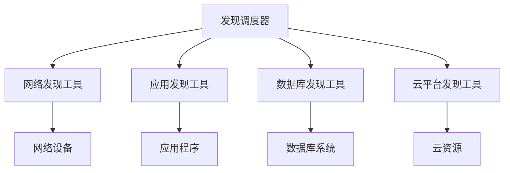

在配置管理数据库（CMDB）的建设和运营过程中，数据的新鲜度和准确性是决定其价值的关键因素。随着企业IT环境的日益复杂化和动态化，手工维护配置信息的方式已经无法满足现代IT管理的需求。自动发现与数据保鲜技术成为确保CMDB数据质量的核心手段，通过与各种自动化工具、云平台和监控系统的深度集成，实现配置信息的实时更新和同步。

自动发现技术不仅能够大幅减少人工录入的工作量，还能提高数据的准确性和完整性。然而，自动发现并非万能，它需要与人工维护相结合，形成完整的数据管理机制。同时，随着云计算技术的普及，传统的自动发现方法面临着新的挑战和机遇。

## 自动发现技术的核心价值

### 1. 提高数据准确性

#### 减少人为错误
手工录入配置信息是CMDB数据不准确的主要原因之一。人工操作容易出现拼写错误、信息遗漏、格式不一致等问题。自动发现技术通过直接从目标系统获取配置信息，大大减少了人为错误的发生。

#### 实时数据获取
自动发现技术能够实时或定期从目标系统获取最新的配置信息，确保CMDB中的数据与实际环境保持一致。这种实时性对于快速变化的IT环境尤为重要。

#### 标准化数据格式
自动发现工具通常会将获取的数据转换为标准化的格式，确保数据的一致性和可处理性。

### 2. 降低维护成本

#### 减少人力投入
自动发现技术可以大幅减少CMDB维护所需的人力投入，将人力资源从重复性的手工录入工作中解放出来，投入到更有价值的分析和优化工作中。

#### 提高工作效率
自动化工具可以24小时不间断地工作，不受人工工作时间的限制，显著提高了数据维护的效率。

#### 降低运营成本
通过减少人力投入和提高工作效率，自动发现技术能够显著降低CMDB的运营成本。

### 3. 增强管理能力

#### 扩大覆盖范围
自动发现技术能够覆盖更大范围的IT环境，包括分布在不同地理位置的系统和设备，确保配置信息的完整性。

#### 提升分析能力
准确、完整的配置信息为各种分析工作提供了坚实的基础，包括影响分析、根因分析、容量规划等。

#### 支持决策制定
基于准确的配置信息，管理层可以做出更加科学和准确的决策。

## 自动发现技术架构设计

### 1. 分层架构模型

#### 发现层
发现层是自动发现架构的核心，负责执行具体的发现任务。这一层包括各种发现工具和代理程序，能够连接到不同类型的系统和设备。



#### 数据处理层
数据处理层负责对发现的原始数据进行处理和转换，包括数据清洗、格式转换、关联匹配等。

```python
class DataProcessor:
    def __init__(self):
        self.data_transformers = {
            'network': NetworkDataTransformer(),
            'application': ApplicationDataTransformer(),
            'database': DatabaseDataTransformer(),
            'cloud': CloudDataTransformer()
        }
    
    def process_discovered_data(self, raw_data, source_type):
        """
        处理发现的原始数据
        """
        # 数据清洗
        cleaned_data = self.clean_data(raw_data)
        
        # 格式转换
        transformer = self.data_transformers.get(source_type)
        if transformer:
            transformed_data = transformer.transform(cleaned_data)
        else:
            transformed_data = cleaned_data
        
        # 关联匹配
        matched_data = self.match_existing_cis(transformed_data)
        
        return matched_data
    
    def clean_data(self, raw_data):
        """
        清洗原始数据
        """
        # 去除空值和无效数据
        cleaned_data = [item for item in raw_data if self.is_valid_item(item)]
        
        # 标准化数据格式
        standardized_data = self.standardize_format(cleaned_data)
        
        return standardized_data
```

#### 集成层
集成层负责与CMDB系统进行数据交换，包括数据写入、更新、删除等操作。

```python
class CMDBIntegrator:
    def __init__(self):
        self.cmdb_client = CMDBClient()
    
    def sync_to_cmdb(self, processed_data):
        """
        同步数据到CMDB
        """
        for item in processed_data:
            # 检查CI是否已存在
            existing_ci = self.cmdb_client.get_ci_by_identifier(item.identifier)
            
            if existing_ci:
                # 更新现有CI
                self.update_existing_ci(existing_ci, item)
            else:
                # 创建新CI
                self.create_new_ci(item)
    
    def update_existing_ci(self, existing_ci, new_data):
        """
        更新现有CI
        """
        # 比较数据差异
        differences = self.compare_data(existing_ci, new_data)
        
        if differences:
            # 应用更新
            updated_ci = self.apply_updates(existing_ci, differences)
            
            # 更新CMDB
            self.cmdb_client.update_ci(updated_ci)
            
            # 记录变更日志
            self.log_change(existing_ci, updated_ci, differences)
    
    def create_new_ci(self, ci_data):
        """
        创建新CI
        """
        # 验证数据完整性
        if not self.validate_ci_data(ci_data):
            raise DataValidationException("Invalid CI data")
        
        # 创建CI
        new_ci = self.cmdb_client.create_ci(ci_data)
        
        # 记录创建日志
        self.log_creation(new_ci)
        
        return new_ci
```

### 2. 发现策略设计

#### 基于优先级的发现策略
不同的配置项对业务的重要性不同，因此需要采用基于优先级的发现策略，优先发现和更新核心配置项。

```python
class DiscoveryPriorityManager:
    def __init__(self):
        self.priority_rules = self.load_priority_rules()
    
    def determine_discovery_priority(self, ci_type, business_criticality):
        """
        确定发现优先级
        """
        # 基于CI类型确定基础优先级
        base_priority = self.get_base_priority(ci_type)
        
        # 考虑业务重要性
        criticality_factor = self.get_criticality_factor(business_criticality)
        
        # 计算最终优先级
        final_priority = base_priority * criticality_factor
        
        return final_priority
    
    def schedule_discovery_tasks(self, cis):
        """
        调度发现任务
        """
        # 按优先级排序
        sorted_cis = sorted(cis, key=lambda ci: self.determine_discovery_priority(ci.type, ci.criticality), reverse=True)
        
        # 分批执行
        batch_size = self.get_optimal_batch_size()
        for i in range(0, len(sorted_cis), batch_size):
            batch = sorted_cis[i:i+batch_size]
            self.execute_discovery_batch(batch)
```

#### 基于变化的发现策略
通过监控系统变化事件，触发针对性的发现任务，提高发现效率。

```python
class ChangeBasedDiscovery:
    def __init__(self):
        self.event_listeners = {
            'network_change': NetworkChangeListener(),
            'application_deployment': ApplicationDeploymentListener(),
            'cloud_provisioning': CloudProvisioningListener()
        }
    
    def handle_change_event(self, event):
        """
        处理变化事件
        """
        # 识别事件类型
        event_type = self.identify_event_type(event)
        
        # 获取对应的监听器
        listener = self.event_listeners.get(event_type)
        if listener:
            # 触发针对性发现
            discovery_tasks = listener.generate_discovery_tasks(event)
            self.execute_discovery_tasks(discovery_tasks)
```

## 与自动化工具的集成

### 1. 网络发现工具集成

#### SNMP集成
SNMP（Simple Network Management Protocol）是网络设备管理的标准协议，通过SNMP可以获取网络设备的详细配置信息。

```python
class SNMPDiscovery:
    def __init__(self):
        self.snmp_client = SNMPClient()
    
    def discover_network_devices(self, network_range):
        """
        发现网络设备
        """
        devices = []
        
        # 扫描网络范围
        for ip in self.scan_network_range(network_range):
            # 尝试SNMP连接
            if self.snmp_client.can_connect(ip):
                # 获取设备信息
                device_info = self.get_device_info(ip)
                devices.append(device_info)
        
        return devices
    
    def get_device_info(self, ip):
        """
        获取设备详细信息
        """
        # 获取基本信息
        basic_info = {
            'ip_address': ip,
            'sys_name': self.snmp_client.get(ip, 'sysName'),
            'sys_descr': self.snmp_client.get(ip, 'sysDescr'),
            'sys_uptime': self.snmp_client.get(ip, 'sysUpTime')
        }
        
        # 获取接口信息
        interfaces = self.get_interface_info(ip)
        basic_info['interfaces'] = interfaces
        
        # 获取路由表
        routing_table = self.get_routing_table(ip)
        basic_info['routing_table'] = routing_table
        
        return basic_info
```

#### 网络扫描工具集成
通过集成网络扫描工具，可以发现网络中的各种设备和服务。

```python
class NetworkScanner:
    def __init__(self):
        self.scanner = NmapScanner()
    
    def scan_network(self, target):
        """
        扫描网络
        """
        # 执行扫描
        scan_results = self.scanner.scan(target)
        
        # 解析结果
        devices = []
        for host in scan_results.hosts:
            device = {
                'ip_address': host.address,
                'hostname': host.hostname,
                'os': self.identify_os(host),
                'open_ports': self.get_open_ports(host),
                'services': self.identify_services(host)
            }
            devices.append(device)
        
        return devices
    
    def identify_os(self, host):
        """
        识别操作系统
        """
        # 基于指纹识别
        os_fingerprint = host.os_fingerprint
        return self.os_classifier.classify(os_fingerprint)
```

### 2. 应用发现工具集成

#### 代理式发现
通过在目标系统上部署代理程序，可以深度发现应用程序的配置信息。

```python
class AgentBasedDiscovery:
    def __init__(self):
        self.agent_manager = AgentManager()
    
    def deploy_agent(self, target_host):
        """
        部署代理程序
        """
        # 检查代理是否已部署
        if not self.agent_manager.is_agent_deployed(target_host):
            # 部署代理
            self.agent_manager.deploy_agent(target_host)
        
        # 启动代理
        self.agent_manager.start_agent(target_host)
    
    def discover_application_config(self, target_host):
        """
        发现应用程序配置
        """
        # 连接代理
        agent = self.agent_manager.get_agent(target_host)
        
        # 获取应用程序信息
        app_info = {
            'processes': agent.get_running_processes(),
            'services': agent.get_running_services(),
            'config_files': agent.get_config_files(),
            'dependencies': agent.get_dependencies(),
            'performance_metrics': agent.get_performance_metrics()
        }
        
        return app_info
```

#### 无代理式发现
通过分析网络流量和系统日志，可以实现无代理式的应用发现。

```python
class AgentlessDiscovery:
    def __init__(self):
        self.network_analyzer = NetworkAnalyzer()
        self.log_analyzer = LogAnalyzer()
    
    def discover_applications(self, network_segment):
        """
        发现应用程序
        """
        # 分析网络流量
        traffic_analysis = self.network_analyzer.analyze_traffic(network_segment)
        
        # 分析系统日志
        log_analysis = self.log_analyzer.analyze_logs(network_segment)
        
        # 综合分析结果
        applications = self.correlate_findings(traffic_analysis, log_analysis)
        
        return applications
    
    def correlate_findings(self, traffic_data, log_data):
        """
        关联分析发现结果
        """
        applications = []
        
        # 基于端口和服务识别应用
        for service in traffic_data.services:
            app = self.identify_application_by_service(service)
            if app:
                applications.append(app)
        
        # 基于日志模式识别应用
        for pattern in log_data.patterns:
            app = self.identify_application_by_log_pattern(pattern)
            if app:
                applications.append(app)
        
        # 去重和合并
        unique_applications = self.deduplicate_applications(applications)
        
        return unique_applications
```

## 与云平台的集成

### 1. 多云环境发现

#### AWS集成
通过AWS API可以获取AWS环境中各种资源的配置信息。

```python
class AWSDiscovery:
    def __init__(self):
        self.aws_client = AWSClient()
    
    def discover_aws_resources(self, account_id, region):
        """
        发现AWS资源
        """
        resources = []
        
        # 发现EC2实例
        ec2_instances = self.discover_ec2_instances(region)
        resources.extend(ec2_instances)
        
        # 发现RDS实例
        rds_instances = self.discover_rds_instances(region)
        resources.extend(rds_instances)
        
        # 发现S3存储桶
        s3_buckets = self.discover_s3_buckets()
        resources.extend(s3_buckets)
        
        # 发现Lambda函数
        lambda_functions = self.discover_lambda_functions(region)
        resources.extend(lambda_functions)
        
        return resources
    
    def discover_ec2_instances(self, region):
        """
        发现EC2实例
        """
        instances = []
        
        # 获取EC2实例列表
        ec2_client = self.aws_client.get_ec2_client(region)
        response = ec2_client.describe_instances()
        
        for reservation in response['Reservations']:
            for instance in reservation['Instances']:
                instance_info = {
                    'instance_id': instance['InstanceId'],
                    'instance_type': instance['InstanceType'],
                    'state': instance['State']['Name'],
                    'public_ip': instance.get('PublicIpAddress'),
                    'private_ip': instance.get('PrivateIpAddress'),
                    'tags': instance.get('Tags', []),
                    'launch_time': instance['LaunchTime'],
                    'vpc_id': instance.get('VpcId'),
                    'subnet_id': instance.get('SubnetId')
                }
                instances.append(instance_info)
        
        return instances
```

#### Azure集成
通过Azure API可以获取Azure环境中各种资源的配置信息。

```python
class AzureDiscovery:
    def __init__(self):
        self.azure_client = AzureClient()
    
    def discover_azure_resources(self, subscription_id):
        """
        发现Azure资源
        """
        resources = []
        
        # 发现虚拟机
        vms = self.discover_virtual_machines(subscription_id)
        resources.extend(vms)
        
        # 发现存储账户
        storage_accounts = self.discover_storage_accounts(subscription_id)
        resources.extend(storage_accounts)
        
        # 发现数据库
        databases = self.discover_databases(subscription_id)
        resources.extend(databases)
        
        return resources
    
    def discover_virtual_machines(self, subscription_id):
        """
        发现虚拟机
        """
        vms = []
        
        # 获取虚拟机列表
        compute_client = self.azure_client.get_compute_client()
        vm_list = compute_client.virtual_machines.list_all()
        
        for vm in vm_list:
            vm_info = {
                'name': vm.name,
                'location': vm.location,
                'vm_size': vm.hardware_profile.vm_size,
                'os_type': vm.storage_profile.os_disk.os_type,
                'provisioning_state': vm.provisioning_state,
                'tags': vm.tags
            }
            vms.append(vm_info)
        
        return vms
```

### 2. 容器化环境发现

#### Kubernetes集成
通过Kubernetes API可以获取集群中各种资源的配置信息。

```python
class KubernetesDiscovery:
    def __init__(self):
        self.k8s_client = KubernetesClient()
    
    def discover_k8s_resources(self, cluster_config):
        """
        发现Kubernetes资源
        """
        resources = []
        
        # 发现节点
        nodes = self.discover_nodes()
        resources.extend(nodes)
        
        # 发现Pods
        pods = self.discover_pods()
        resources.extend(pods)
        
        # 发现服务
        services = self.discover_services()
        resources.extend(services)
        
        # 发现部署
        deployments = self.discover_deployments()
        resources.extend(deployments)
        
        return resources
    
    def discover_pods(self):
        """
        发现Pods
        """
        pods = []
        
        # 获取Pod列表
        v1 = self.k8s_client.get_core_v1_api()
        pod_list = v1.list_pod_for_all_namespaces(watch=False)
        
        for pod in pod_list.items:
            pod_info = {
                'name': pod.metadata.name,
                'namespace': pod.metadata.namespace,
                'phase': pod.status.phase,
                'node_name': pod.spec.node_name,
                'containers': [container.name for container in pod.spec.containers],
                'labels': pod.metadata.labels,
                'annotations': pod.metadata.annotations,
                'creation_timestamp': pod.metadata.creation_timestamp
            }
            pods.append(pod_info)
        
        return pods
```

## 与监控系统的集成

### 1. 实时数据同步

#### 监控事件驱动更新
通过监听监控系统的事件，实时更新CMDB中的配置信息。

```python
class MonitoringEventProcessor:
    def __init__(self):
        self.event_queue = EventQueue()
        self.cmdb_updater = CMDBUpdater()
    
    def process_monitoring_events(self):
        """
        处理监控事件
        """
        while True:
            # 获取事件
            event = self.event_queue.get_event()
            
            # 处理事件
            self.handle_monitoring_event(event)
    
    def handle_monitoring_event(self, event):
        """
        处理监控事件
        """
        # 识别事件类型
        event_type = event.get('type')
        
        if event_type == 'host_up':
            self.handle_host_up_event(event)
        elif event_type == 'host_down':
            self.handle_host_down_event(event)
        elif event_type == 'service_state_change':
            self.handle_service_state_change(event)
        elif event_type == 'performance_threshold_breach':
            self.handle_performance_event(event)
    
    def handle_host_up_event(self, event):
        """
        处理主机上线事件
        """
        host_info = event.get('host_info')
        
        # 检查CI是否存在
        ci = self.cmdb_updater.get_ci_by_ip(host_info['ip_address'])
        
        if ci:
            # 更新CI状态
            ci.status = 'Operational'
            ci.last_seen = datetime.now()
            self.cmdb_updater.update_ci(ci)
        else:
            # 创建新CI
            self.create_new_host_ci(host_info)
```

#### 性能数据集成
将监控系统中的性能数据集成到CMDB中，丰富配置项的信息。

```python
class PerformanceDataIntegrator:
    def __init__(self):
        self.monitoring_client = MonitoringClient()
        self.cmdb_client = CMDBClient()
    
    def integrate_performance_data(self):
        """
        集成性能数据
        """
        # 获取性能数据
        performance_data = self.monitoring_client.get_latest_performance_data()
        
        # 更新CMDB
        for data_point in performance_data:
            self.update_ci_performance_data(data_point)
    
    def update_ci_performance_data(self, data_point):
        """
        更新CI性能数据
        """
        # 获取对应的CI
        ci = self.cmdb_client.get_ci_by_identifier(data_point.identifier)
        
        if ci:
            # 更新性能属性
            performance_attrs = {
                'cpu_usage': data_point.cpu_usage,
                'memory_usage': data_point.memory_usage,
                'disk_usage': data_point.disk_usage,
                'network_throughput': data_point.network_throughput,
                'last_performance_update': datetime.now()
            }
            
            # 更新CI
            self.cmdb_client.update_ci_attributes(ci.id, performance_attrs)
```

### 2. 告警驱动发现

#### 告警关联分析
通过分析监控告警，发现潜在的配置问题和变更。

```python
class AlertCorrelationAnalyzer:
    def __init__(self):
        self.alert_processor = AlertProcessor()
        self.discovery_scheduler = DiscoveryScheduler()
    
    def analyze_alerts_for_discovery(self):
        """
        分析告警以触发发现任务
        """
        # 获取未处理的告警
        alerts = self.alert_processor.get_unprocessed_alerts()
        
        # 分析告警模式
        patterns = self.identify_alert_patterns(alerts)
        
        # 根据模式触发发现任务
        for pattern in patterns:
            if self.should_trigger_discovery(pattern):
                self.schedule_targeted_discovery(pattern)
    
    def identify_alert_patterns(self, alerts):
        """
        识别告警模式
        """
        patterns = []
        
        # 按主机分组
        host_alerts = self.group_alerts_by_host(alerts)
        
        for host, host_alerts in host_alerts.items():
            # 分析主机告警模式
            pattern = self.analyze_host_alert_pattern(host, host_alerts)
            if pattern:
                patterns.append(pattern)
        
        # 按服务分组
        service_alerts = self.group_alerts_by_service(alerts)
        
        for service, service_alerts in service_alerts.items():
            # 分析服务告警模式
            pattern = self.analyze_service_alert_pattern(service, service_alerts)
            if pattern:
                patterns.append(pattern)
        
        return patterns
```

## 数据保鲜机制

### 1. 增量更新策略

#### 变化检测机制
通过检测配置变化，只更新发生变化的部分，提高更新效率。

```python
class IncrementalUpdater:
    def __init__(self):
        self.change_detector = ChangeDetector()
        self.cmdb_client = CMDBClient()
    
    def perform_incremental_update(self, discovered_data):
        """
        执行增量更新
        """
        updates = []
        
        for item in discovered_data:
            # 检查是否有变化
            changes = self.change_detector.detect_changes(item)
            
            if changes:
                # 准备更新数据
                update_data = {
                    'ci_id': item.ci_id,
                    'changes': changes,
                    'timestamp': datetime.now()
                }
                updates.append(update_data)
        
        # 批量更新CMDB
        if updates:
            self.cmdb_client.batch_update_cis(updates)
        
        return len(updates)
    
    def detect_changes(self, new_data):
        """
        检测数据变化
        """
        # 获取现有数据
        existing_data = self.cmdb_client.get_ci_by_identifier(new_data.identifier)
        
        if not existing_data:
            # 新CI，标记为创建
            return {'type': 'create', 'data': new_data}
        
        # 比较数据差异
        differences = self.compare_data(existing_data, new_data)
        
        if differences:
            # 有变化，标记为更新
            return {'type': 'update', 'differences': differences}
        
        # 无变化
        return None
```

#### 时间戳机制
通过时间戳机制，确保数据的新鲜度。

```python
class TimestampManager:
    def __init__(self):
        self.timestamp_store = TimestampStore()
    
    def update_timestamp(self, ci_id, timestamp_type='last_discovered'):
        """
        更新时间戳
        """
        timestamp_record = {
            'ci_id': ci_id,
            'timestamp_type': timestamp_type,
            'timestamp': datetime.now(),
            'source': 'auto_discovery'
        }
        
        self.timestamp_store.update_timestamp(timestamp_record)
    
    def check_data_freshness(self, ci_id, max_age_hours=24):
        """
        检查数据新鲜度
        """
        last_update = self.timestamp_store.get_last_update(ci_id)
        
        if not last_update:
            return False  # 从未更新
        
        age = datetime.now() - last_update
        return age.total_seconds() < (max_age_hours * 3600)
```

### 2. 数据质量保障

#### 数据验证机制
建立数据验证机制，确保发现的数据符合质量要求。

```python
class DataValidator:
    def __init__(self):
        self.validation_rules = self.load_validation_rules()
    
    def validate_discovered_data(self, data):
        """
        验证发现的数据
        """
        validation_results = []
        
        for item in data:
            # 执行验证
            result = self.validate_item(item)
            validation_results.append(result)
        
        return validation_results
    
    def validate_item(self, item):
        """
        验证单个数据项
        """
        errors = []
        
        # 必填字段检查
        for field in self.validation_rules.required_fields:
            if not getattr(item, field, None):
                errors.append(f"Required field {field} is missing")
        
        # 数据格式检查
        for field, format_rule in self.validation_rules.format_rules.items():
            value = getattr(item, field, None)
            if value and not self.validate_format(value, format_rule):
                errors.append(f"Invalid format for field {field}")
        
        # 业务规则检查
        business_errors = self.check_business_rules(item)
        errors.extend(business_errors)
        
        return {
            'item_id': item.id,
            'valid': len(errors) == 0,
            'errors': errors
        }
```

#### 数据清洗机制
对发现的原始数据进行清洗，去除无效和错误数据。

```python
class DataCleaner:
    def __init__(self):
        self.cleaning_rules = self.load_cleaning_rules()
    
    def clean_discovered_data(self, raw_data):
        """
        清洗发现的原始数据
        """
        cleaned_data = []
        
        for item in raw_data:
            # 应用清洗规则
            cleaned_item = self.apply_cleaning_rules(item)
            
            if cleaned_item:
                cleaned_data.append(cleaned_item)
        
        return cleaned_data
    
    def apply_cleaning_rules(self, item):
        """
        应用清洗规则
        """
        # 去除空值
        if self.is_empty_item(item):
            return None
        
        # 标准化数据格式
        standardized_item = self.standardize_format(item)
        
        # 去除重复数据
        if self.is_duplicate_item(standardized_item):
            return None
        
        # 修正错误数据
        corrected_item = self.correct_errors(standardized_item)
        
        return corrected_item
```

## 最佳实践案例

### 案例一：某互联网公司的多云环境发现实践

某大型互联网公司在全球范围内使用多个云平台，包括AWS、Azure和Google Cloud。为了有效管理这些云资源，他们实施了全面的自动发现和数据保鲜机制。

#### 技术实现
- 建立了统一的多云发现平台，集成各云平台的API
- 实现了基于标签的资源分类和管理
- 建立了实时的资源变更监控机制
- 实现了跨云平台的统一视图

#### 业务效果
- 实现了10万+云资源的统一管理
- 资源发现准确率达到99.5%
- 平均数据更新延迟小于5分钟
- 云资源利用率提升了20%

#### 经验总结
- 多云环境需要统一的管理平台
- 实时监控是数据保鲜的关键
- 标准化是多平台集成的基础
- 自动化是提高效率的保证

### 案例二：某金融机构的合规性发现实践

某金融机构在实施自动发现时，特别注重合规性要求，建立了严格的数据管理和审计机制。

#### 合规措施
- 所有发现操作都有完整的审计日志
- 敏感数据采用加密传输和存储
- 建立了严格的访问控制机制
- 实现了数据变更的审批流程

#### 实施效果
- 通过了所有合规性审计
- 实现了零数据安全事故
- 获得了监管机构的高度评价
- 用户满意度达到98%以上

#### 关键要点
- 合规性要求应该在设计阶段就充分考虑
- 安全性是金融行业自动发现的基本要求
- 审计跟踪是合规性管理的重要手段
- 用户培训是确保合规性的关键环节

## 实施建议

### 1. 技术实施建议

#### 架构设计
- 采用微服务架构，确保系统的可扩展性和可维护性
- 实现松耦合设计，降低系统间的依赖关系
- 建立完善的错误处理和恢复机制

#### 性能优化
- 实现增量发现和更新，提高效率
- 建立合理的缓存机制，减少重复发现
- 优化数据处理流程，提高处理速度

#### 安全保障
- 实现多层次的安全控制机制
- 建立完善的权限管理和访问控制
- 实施审计日志和监控告警体系

### 2. 业务实施建议

#### 策略制定
- 制定明确的发现策略和优先级
- 建立完善的变更管理流程
- 制定数据质量管理规范

#### 组织保障
- 建立专门的发现团队
- 明确各相关方的职责和分工
- 建立有效的沟通协调机制

#### 持续改进
- 建立定期评估和改进机制
- 收集用户反馈，持续优化系统功能
- 跟踪技术发展趋势，及时升级技术方案

## 结语

自动发现与数据保鲜技术是现代CMDB建设的核心能力，通过与各种自动化工具、云平台和监控系统的深度集成，能够确保配置信息的准确性、完整性和时效性。这不仅大幅降低了CMDB的维护成本，还显著提升了IT服务管理的效率和质量。

然而，自动发现并非一蹴而就的技术，它需要精心的设计和持续的优化。在实施过程中，我们需要充分考虑技术复杂性、业务需求、安全合规等多个方面，制定科学的实施策略和保障措施。

随着云计算、容器化等新技术的不断发展，自动发现技术也面临着新的挑战和机遇。我们需要保持技术敏感性，及时跟进新技术发展，不断优化和完善自动发现机制，确保CMDB能够适应未来IT环境的发展变化。

通过深入理解自动发现与数据保鲜的核心概念和最佳实践，结合企业的实际情况，我们可以构建出既符合技术标准又满足业务需求的自动发现体系，为IT服务管理奠定坚实的数据基础。未来，随着人工智能和机器学习技术的应用，自动发现将变得更加智能和高效，为企业的数字化转型提供强有力的支持。