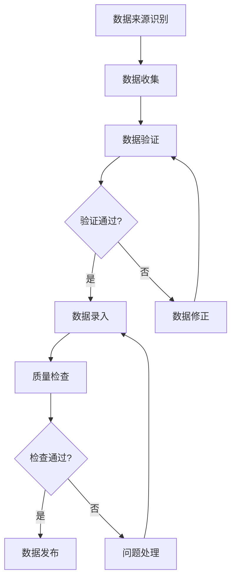
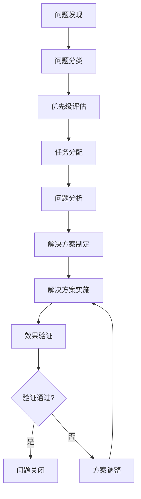

配置管理数据库（CMDB）作为IT服务管理的核心基础设施，其价值完全取决于其中存储数据的准确性和可信度。无论技术多么先进，模型设计多么完善，如果数据质量不佳，CMDB就无法发挥应有的作用。因此，建立完善的CMDB运营治理机制，确保数据的准确性与可信度，是CMDB成功实施的关键所在。

CMDB运营治理是一个系统性工程，涉及组织架构、流程制度、技术工具、人员能力等多个方面。它不仅要求建立严格的数据管理规范，还需要构建有效的监督和改进机制，确保CMDB在长期运营中始终保持高质量的数据状态。

## CMDB数据质量的重要性

### 1. 数据质量对ITSM的影响

#### 决策支持失效
CMDB的核心价值在于为IT管理决策提供准确的数据支持。如果数据不准确，基于这些数据做出的决策很可能导致错误的方向和不良的后果。例如，在变更管理中，如果依赖关系数据不准确，可能导致变更影响评估错误，进而引发服务中断。

#### 流程执行困难
ITSM的各个流程都依赖于CMDB提供的配置信息。数据不准确会导致流程执行困难，增加处理时间和错误率。在事件管理中，如果配置项信息不准确，故障定位和根因分析将变得极其困难。

#### 自动化失败
现代IT运维越来越依赖自动化技术，而自动化决策需要准确的配置数据作为基础。数据质量问题会导致自动化失败，甚至产生更严重的后果。

### 2. 数据质量的衡量标准

#### 准确性（Accuracy）
准确性是指CMDB中的数据与实际IT环境状态的一致程度。准确的数据应该真实反映配置项的当前状态、属性和关系。

#### 完整性（Completeness）
完整性是指CMDB中应该包含的配置项和相关信息是否都已录入。不完整的数据会导致信息缺失，影响管理效果。

#### 时效性（Timeliness）
时效性是指CMDB中的数据是否及时更新，反映了IT环境的最新状态。过时的数据会误导决策和操作。

#### 一致性（Consistency）
一致性是指同一配置项在不同系统和不同时间点的数据是否保持一致。不一致的数据会造成混淆和错误。

## CMDB运营治理框架

### 1. 组织架构设计

#### 治理委员会
建立CMDB治理委员会，负责制定治理策略、监督执行情况、处理重大问题。委员会应包括业务代表、IT管理层、技术专家等关键利益相关者。

```json
{
  "governance_committee": {
    "name": "CMDB治理委员会",
    "members": [
      {
        "name": "CTO",
        "role": "委员会主席",
        "responsibilities": ["制定治理策略", "审批重大变更"]
      },
      {
        "name": "IT服务经理",
        "role": "日常管理",
        "responsibilities": ["监督执行", "协调资源"]
      },
      {
        "name": "业务代表",
        "role": "业务需求",
        "responsibilities": ["提出业务需求", "评估业务影响"]
      },
      {
        "name": "技术专家",
        "role": "技术支持",
        "responsibilities": ["提供技术建议", "解决技术问题"]
      }
    ],
    "meeting_frequency": "每月一次",
    "decision_making": "共识决策"
  }
}
```

#### 运营团队
建立专门的CMDB运营团队，负责日常的运营管理、数据维护、质量监控等工作。团队成员应具备相应的技术能力和业务理解。

#### 责任分工
明确各相关部门和人员在CMDB运营中的职责，建立责任矩阵（RACI），确保各项工作有人负责、有人执行、有人监督。

### 2. 流程制度建设

#### 数据录入流程
建立标准化的数据录入流程，包括数据来源确认、录入审批、质量检查等环节，确保录入数据的准确性和完整性。



#### 变更管理流程
建立配置项变更管理流程，确保所有配置项的变更都经过适当的审批和记录，保持数据的准确性和可追溯性。

#### 质量监控流程
建立定期的数据质量监控流程，包括质量指标定义、监控执行、问题处理、改进措施等环节。

### 3. 技术工具支撑

#### 数据质量管理工具
部署专门的数据质量管理工具，实现自动化的数据质量检查、问题识别、报告生成等功能。

#### 审计跟踪工具
建立完善的审计跟踪机制，记录所有数据操作的历史，确保数据变更的可追溯性。

#### 监控告警工具
部署监控告警工具，实时监控CMDB的运行状态和数据质量，及时发现和处理问题。

## 数据质量管理机制

### 1. 质量指标体系

#### 核心质量指标
建立一套完整的数据质量指标体系，用于衡量和监控CMDB数据质量。

```json
{
  "data_quality_metrics": {
    "accuracy_rate": {
      "description": "数据准确率",
      "calculation": "准确记录数 / 总记录数 × 100%",
      "target": "≥ 95%"
    },
    "completeness_rate": {
      "description": "数据完整率",
      "calculation": "完整记录数 / 应有记录数 × 100%",
      "target": "≥ 90%"
    },
    "timeliness_rate": {
      "description": "数据及时率",
      "calculation": "及时更新记录数 / 应更新记录数 × 100%",
      "target": "≥ 98%"
    },
    "consistency_rate": {
      "description": "数据一致率",
      "calculation": "一致记录数 / 总记录数 × 100%",
      "target": "≥ 95%"
    },
    "duplicate_rate": {
      "description": "数据重复率",
      "calculation": "重复记录数 / 总记录数 × 100%",
      "target": "≤ 1%"
    }
  }
}
```

#### 业务相关指标
除了技术性指标外，还应建立与业务相关的质量指标，如服务影响度、业务价值贡献等。

### 2. 质量检查机制

#### 自动化检查
利用自动化工具定期检查数据质量，包括格式验证、逻辑检查、关联验证等。

```python
class DataQualityChecker:
    def __init__(self):
        self.check_rules = self.load_check_rules()
    
    def perform_quality_check(self):
        """
        执行数据质量检查
        """
        results = {}
        
        # 格式检查
        format_results = self.check_data_format()
        results['format'] = format_results
        
        # 逻辑检查
        logic_results = self.check_data_logic()
        results['logic'] = logic_results
        
        # 关联检查
        relationship_results = self.check_data_relationships()
        results['relationships'] = relationship_results
        
        # 重复检查
        duplicate_results = self.check_data_duplicates()
        results['duplicates'] = duplicate_results
        
        return results
    
    def check_data_format(self):
        """
        检查数据格式
        """
        format_issues = []
        
        # 检查必填字段
        missing_fields = self.find_missing_required_fields()
        format_issues.extend(missing_fields)
        
        # 检查数据类型
        type_mismatches = self.find_type_mismatches()
        format_issues.extend(type_mismatches)
        
        # 检查数据格式
        format_violations = self.find_format_violations()
        format_issues.extend(format_violations)
        
        return format_issues
    
    def check_data_logic(self):
        """
        检查数据逻辑
        """
        logic_issues = []
        
        # 检查状态一致性
        state_inconsistencies = self.find_state_inconsistencies()
        logic_issues.extend(state_inconsistencies)
        
        # 检查时间逻辑
        time_violations = self.find_time_logic_violations()
        logic_issues.extend(time_violations)
        
        return logic_issues
```

#### 人工审核
对于复杂的业务逻辑和关键配置项，需要进行人工审核，确保数据的业务准确性和合理性。

#### 第三方验证
定期邀请第三方进行数据质量审计，获得客观的评估结果和改进建议。

### 3. 问题处理机制

#### 问题分类
建立问题分类体系，将数据质量问题按严重程度、影响范围、处理优先级等进行分类。

```json
{
  "issue_categories": {
    "critical": {
      "description": "严重问题",
      "criteria": "影响核心业务服务或导致重大风险",
      "response_time": "2小时内",
      "resolution_time": "24小时内"
    },
    "high": {
      "description": "高优先级问题",
      "criteria": "影响重要业务功能或较多用户",
      "response_time": "4小时内",
      "resolution_time": "72小时内"
    },
    "medium": {
      "description": "中等优先级问题",
      "criteria": "影响一般业务功能或少量用户",
      "response_time": "24小时内",
      "resolution_time": "7天内"
    },
    "low": {
      "description": "低优先级问题",
      "criteria": "影响较小或可通过其他方式解决",
      "response_time": "72小时内",
      "resolution_time": "30天内"
    }
  }
}
```

#### 处理流程
建立标准化的问题处理流程，确保问题能够得到及时有效的解决。



#### 根因分析
对重复出现或严重的问题进行根因分析，找出问题产生的根本原因，制定预防措施。

## 持续改进机制

### 1. 定期评估

#### 月度评估
每月进行一次全面的数据质量评估，分析质量指标变化趋势，识别改进机会。

#### 季度评审
每季度召开评审会议，评估治理效果，调整治理策略，制定改进计划。

#### 年度审计
每年进行一次全面的治理审计，评估整体治理效果，识别系统性问题。

### 2. 反馈机制

#### 用户反馈
建立用户反馈渠道，收集用户对CMDB数据质量的意见和建议。

#### 系统反馈
通过系统日志和监控数据，识别系统运行中的问题和改进点。

#### 业务反馈
定期与业务部门沟通，了解业务需求变化，调整数据管理策略。

### 3. 改进措施

#### 流程优化
根据评估结果和反馈意见，持续优化管理流程和操作规范。

#### 技术升级
跟进技术发展趋势，及时升级工具和平台，提高管理效率。

#### 培训提升
定期组织培训，提升团队成员的技能和能力。

## 合规与安全

### 1. 合规性管理

#### 法规遵循
确保CMDB运营符合相关法律法规和行业标准要求。

#### 审计准备
建立完善的审计准备机制，确保能够顺利通过各种审计检查。

#### 报告生成
定期生成合规性报告，向管理层和监管部门汇报合规状况。

### 2. 安全保障

#### 访问控制
建立严格的访问控制机制，确保只有授权人员才能访问和修改CMDB数据。

#### 数据加密
对敏感数据进行加密存储和传输，防止数据泄露。

#### 审计日志
记录所有数据操作的详细日志，确保操作的可追溯性。

## 最佳实践案例

### 案例一：某大型制造企业的CMDB治理实践

某大型制造企业在实施CMDB治理时，采用了以下策略：

#### 组织保障
- 成立了由CTO领导的CMDB治理委员会
- 建立了专门的CMDB运营团队
- 明确了各部门的职责分工

#### 制度建设
- 制定了详细的CMDB管理规范
- 建立了标准化的操作流程
- 实施了严格的变更管理

#### 技术支撑
- 部署了专业的数据质量管理工具
- 建立了完善的审计跟踪机制
- 实现了自动化的质量监控

#### 实施效果
- 数据准确率提升至98%
- 数据完整率达到95%
- 用户满意度提升30%
- 运营成本降低20%

#### 经验总结
- 高层支持是成功的关键
- 制度建设是基础
- 技术工具是保障
- 持续改进是动力

### 案例二：某金融机构的合规性治理实践

某金融机构在CMDB治理中，特别注重合规性要求：

#### 合规措施
- 建立了完整的合规性管理体系
- 实施了严格的数据安全控制
- 建立了定期的合规性评估机制

#### 安全保障
- 实现了多层次的访问控制
- 采用了先进的数据加密技术
- 建立了完善的审计日志系统

#### 实施效果
- 通过了所有合规性审计
- 实现了零数据安全事件
- 获得了监管部门的高度评价

#### 关键要点
- 合规性要求应贯穿始终
- 安全性是基本要求
- 审计跟踪是重要保障
- 持续监控是必要手段

## 实施建议

### 1. 启动阶段建议

#### 高层支持
- 获得高层管理者的明确支持和承诺
- 确保足够的资源投入
- 建立有效的沟通机制

#### 现状评估
- 全面评估现有CMDB状况
- 识别主要问题和改进机会
- 制定切实可行的实施计划

#### 试点实施
- 选择关键业务领域进行试点
- 验证治理方案的有效性
- 积累实施经验

### 2. 实施阶段建议

#### 分步推进
- 采用分阶段实施策略
- 优先解决关键问题
- 逐步完善治理体系

#### 持续监控
- 建立实时监控机制
- 定期评估实施效果
- 及时调整实施策略

#### 能力提升
- 加强团队能力建设
- 完善培训体系
- 建立激励机制

### 3. 持续优化建议

#### 定期评估
- 建立定期评估机制
- 持续监控质量指标
- 及时发现改进机会

#### 反馈收集
- 建立多渠道反馈机制
- 积极收集用户意见
- 重视业务部门需求

#### 技术跟进
- 关注技术发展趋势
- 及时升级工具平台
- 探索新的管理方法

## 结语

CMDB运营治理是确保配置管理数据库发挥应有价值的关键环节。通过建立完善的治理框架、实施严格的质量管理、构建持续的改进机制，我们可以确保CMDB数据的准确性与可信度，为IT服务管理提供坚实的数据基础。

然而，CMDB运营治理不是一蹴而就的工作，而是一个需要长期坚持和持续优化的过程。它需要组织的高度重视、制度的严格执行、技术的有效支撑和人员的积极参与。只有将治理理念深入到每一个操作细节中，才能真正实现CMDB的价值最大化。

在数字化转型的大背景下，CMDB的重要性将进一步凸显。企业应该将CMDB运营治理作为IT管理的核心任务，投入必要的资源和精力，建立完善的治理体系，确保CMDB能够持续为业务发展提供强有力的支持。

通过深入理解CMDB运营治理的核心概念和最佳实践，结合企业的实际情况，我们可以构建出既符合管理要求又满足业务需求的治理体系，为企业的数字化转型奠定坚实的基础。未来，随着技术的发展和管理理念的演进，CMDB运营治理也将不断创新发展，为企业创造更大的价值。