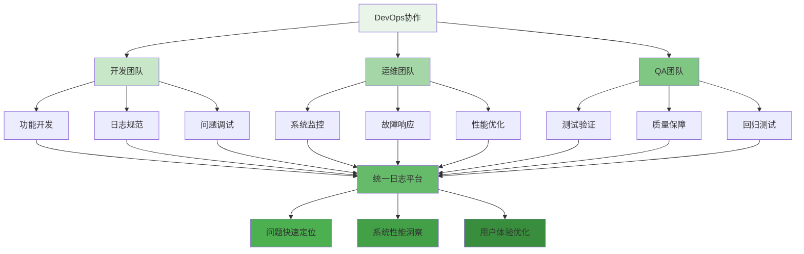

在现代软件开发和运维实践中，日志平台与DevOps和SRE（Site Reliability Engineering）的深度融合已成为提升系统可靠性、加速问题定位和优化用户体验的关键因素。日志作为可观测性的三大支柱之一（日志、指标、链路追踪），不仅为开发团队提供系统行为的详细洞察，更为运维团队构建了主动监控和智能告警的基础。本文将深入探讨日志平台如何与DevOps和SRE实践紧密结合，构建高效的可观测性体系。

## 日志平台在DevOps中的核心价值

DevOps文化强调开发和运维团队之间的协作与沟通，而日志平台作为信息共享的重要载体，在这一过程中发挥着不可替代的作用。

### 促进团队协作



### CI/CD流水线集成

日志平台与CI/CD流水线的集成能够显著提升软件交付的质量和效率：

```yaml
# CI/CD集成配置示例
ci_cd_log_integration:
  pre_deployment:
    log_validation:
      description: "部署前日志模式验证"
      script: "validate-log-patterns.sh"
      failure_policy: "block_deployment"
      checks:
        - required_fields: "检查必需字段是否存在"
        - format_consistency: "检查日志格式一致性"
        - pii_compliance: "检查PII合规性"
    
    log_volume_analysis:
      description: "分析预期日志量变化"
      script: "analyze-log-volume.py"
      threshold: "200%"
      actions:
        - alert_on_spike: "日志量激增告警"
        - capacity_planning: "容量规划建议"
  
  during_deployment:
    real_time_monitoring:
      description: "部署过程实时监控"
      metrics:
        - error_rate: "错误率监控"
        - latency: "延迟监控"
        - throughput: "吞吐量监控"
      alerts:
        - error_threshold: "错误率阈值告警"
        - performance_degradation: "性能下降告警"
  
  post_deployment:
    verification_monitoring:
      description: "部署后验证监控"
      duration: "30m"
      key_metrics:
        - log_anomaly_detection: "日志异常检测"
        - error_rate_comparison: "错误率对比分析"
        - user_experience_metrics: "用户体验指标"
      alerting:
        - anomaly_detection: "异常检测告警"
        - regression_detection: "回归检测告警"
```

### 自动化测试集成

```java
// 日志驱动的自动化测试框架
public class LogDrivenTestFramework {
    private final LogPlatformClient logClient;
    private final TestExecutionService testService;
    private final AlertingService alertingService;
    
    /**
     * 执行日志验证测试
     */
    public TestResult executeLogValidationTest(TestCase testCase) {
        try {
            // 1. 执行测试用例
            TestExecutionResult executionResult = testService.execute(testCase);
            
            // 2. 收集相关日志
            LogQuery logQuery = LogQuery.builder()
                .service(testCase.getService())
                .traceId(executionResult.getTraceId())
                .timeRange(executionResult.getStartTime(), executionResult.getEndTime())
                .build();
            
            List<LogEntry> logs = logClient.queryLogs(logQuery);
            
            // 3. 验证日志质量
            LogValidationResult validationResult = validateLogs(logs, testCase);
            
            // 4. 生成测试报告
            TestResult testResult = TestResult.builder()
                .testCaseId(testCase.getId())
                .executionResult(executionResult)
                .validationResult(validationResult)
                .timestamp(Instant.now())
                .build();
            
            // 5. 发送告警（如有必要）
            if (!validationResult.isSuccess()) {
                alertingService.sendTestFailureAlert(testResult);
            }
            
            return testResult;
            
        } catch (Exception e) {
            log.error("Failed to execute log validation test: " + testCase.getId(), e);
            return TestResult.builder()
                .testCaseId(testCase.getId())
                .status(TestStatus.FAILED)
                .errorMessage(e.getMessage())
                .timestamp(Instant.now())
                .build();
        }
    }
    
    /**
     * 验证日志质量
     */
    private LogValidationResult validateLogs(List<LogEntry> logs, TestCase testCase) {
        LogValidationResult result = new LogValidationResult();
        
        // 1. 检查必需字段
        List<String> missingFields = checkRequiredFields(logs, testCase.getRequiredFields());
        if (!missingFields.isEmpty()) {
            result.addValidationError("Missing required fields: " + missingFields);
        }
        
        // 2. 检查日志级别
        List<LogEntry> errorLogs = logs.stream()
            .filter(log -> log.getLevel() == LogLevel.ERROR || log.getLevel() == LogLevel.FATAL)
            .collect(Collectors.toList());
        
        if (!errorLogs.isEmpty()) {
            result.addValidationError("Found error logs during test execution");
        }
        
        // 3. 检查日志格式
        List<LogEntry> malformedLogs = checkLogFormat(logs);
        if (!malformedLogs.isEmpty()) {
            result.addValidationError("Found malformed logs: " + malformedLogs.size());
        }
        
        // 4. 检查PII合规性
        List<LogEntry> piiLogs = checkPIICompliance(logs);
        if (!piiLogs.isEmpty()) {
            result.addValidationError("Found PII compliance violations: " + piiLogs.size());
        }
        
        result.setSuccess(result.getValidationErrors().isEmpty());
        return result;
    }
    
    /**
     * 检查必需字段
     */
    private List<String> checkRequiredFields(List<LogEntry> logs, List<String> requiredFields) {
        List<String> missingFields = new ArrayList<>();
        
        for (String field : requiredFields) {
            boolean fieldPresent = logs.stream()
                .allMatch(log -> log.hasField(field));
            
            if (!fieldPresent) {
                missingFields.add(field);
            }
        }
        
        return missingFields;
    }
}
```

## 日志平台在SRE中的应用

SRE强调通过软件工程的方法解决运维问题，日志平台为SRE实践提供了数据基础和分析工具。

### SLI/SLO/SLA监控

```python
# SRE指标监控服务
class SREMetricsMonitor:
    def __init__(self, log_client, metric_client):
        self.log_client = log_client
        self.metric_client = metric_client
        self.sli_definitions = self._load_sli_definitions()
    
    def calculate_service_level_indicators(self, service_name, time_window):
        """计算服务等级指标"""
        sli_results = {}
        
        for sli_name, sli_def in self.sli_definitions.items():
            if sli_def['service'] == service_name:
                # 根据SLI类型计算指标
                if sli_def['type'] == 'log_based':
                    sli_value = self._calculate_log_based_sli(sli_def, time_window)
                elif sli_def['type'] == 'metric_based':
                    sli_value = self._calculate_metric_based_sli(sli_def, time_window)
                else:
                    continue
                
                sli_results[sli_name] = {
                    'value': sli_value,
                    'target': sli_def['target'],
                    'error_budget': sli_def['target'] - sli_value if sli_value < sli_def['target'] else 0
                }
        
        return sli_results
    
    def _calculate_log_based_sli(self, sli_def, time_window):
        """基于日志计算SLI"""
        # 构建日志查询
        query = LogQuery(
            service=sli_def['service'],
            time_range=time_window,
            filters=sli_def.get('filters', [])
        )
        
        # 查询日志
        logs = self.log_client.query_logs(query)
        
        # 根据SLI定义计算指标
        if sli_def['name'] == 'error_rate':
            total_logs = len(logs)
            error_logs = len([log for log in logs if log.level in ['ERROR', 'FATAL']])
            return (total_logs - error_logs) / total_logs if total_logs > 0 else 1.0
        
        elif sli_def['name'] == 'latency':
            latencies = [log.get_field('latency') for log in logs if log.has_field('latency')]
            if latencies:
                p95_latency = self._calculate_percentile(latencies, 95)
                target_latency = sli_def['target_latency']
                return min(1.0, target_latency / p95_latency) if p95_latency > 0 else 1.0
            else:
                return 1.0
        
        return 1.0
    
    def _calculate_metric_based_sli(self, sli_def, time_window):
        """基于指标计算SLI"""
        # 查询指标数据
        metric_data = self.metric_client.query(
            sli_def['metric_name'],
            time_window,
            sli_def.get('filters', {})
        )
        
        # 根据SLI定义计算指标
        if sli_def['aggregation'] == 'availability':
            uptime = sum(1 for point in metric_data if point.value > 0)
            total = len(metric_data)
            return uptime / total if total > 0 else 1.0
        
        return 1.0
    
    def _calculate_percentile(self, values, percentile):
        """计算百分位数"""
        if not values:
            return 0
        
        sorted_values = sorted(values)
        index = int(len(sorted_values) * percentile / 100)
        return sorted_values[min(index, len(sorted_values) - 1)]

# SLI定义示例
sli_definitions = {
    'api_error_rate': {
        'name': 'error_rate',
        'service': 'user-service',
        'type': 'log_based',
        'target': 0.999,
        'description': 'API错误率SLI',
        'filters': [
            {'field': 'component', 'value': 'api'},
            {'field': 'version', 'operator': '!=', 'value': 'test'}
        ]
    },
    'api_latency': {
        'name': 'latency',
        'service': 'user-service',
        'type': 'log_based',
        'target': 0.95,
        'target_latency': 200,  # 200ms
        'description': 'API延迟SLI',
        'filters': [
            {'field': 'component', 'value': 'api'}
        ]
    },
    'system_availability': {
        'name': 'availability',
        'service': 'user-service',
        'type': 'metric_based',
        'metric_name': 'system_up',
        'target': 0.995,
        'description': '系统可用性SLI',
        'aggregation': 'availability'
    }
}
```

### 故障响应与根因分析

```java
// SRE故障响应系统
public class SREFailureResponseSystem {
    private final LogPlatformClient logClient;
    private final IncidentManagementService incidentService;
    private final RootCauseAnalyzer rootCauseAnalyzer;
    private final CommunicationService communicationService;
    
    /**
     * 处理服务故障
     */
    public IncidentResponse handleServiceFailure(FailureEvent failureEvent) {
        try {
            // 1. 创建故障事件
            Incident incident = incidentService.createIncident(failureEvent);
            
            // 2. 收集相关日志
            LogQuery logQuery = buildFailureLogQuery(failureEvent);
            List<LogEntry> relevantLogs = logClient.queryLogs(logQuery);
            
            // 3. 执行根因分析
            RootCauseAnalysis rca = rootCauseAnalyzer.analyze(incident, relevantLogs);
            
            // 4. 生成响应计划
            ResponsePlan responsePlan = generateResponsePlan(incident, rca);
            
            // 5. 执行响应动作
            executeResponseActions(responsePlan);
            
            // 6. 更新故障状态
            incidentService.updateIncident(incident.getId(), IncidentStatus.IN_PROGRESS);
            
            // 7. 通知相关人员
            communicationService.notifyStakeholders(incident, responsePlan);
            
            return IncidentResponse.builder()
                .incident(incident)
                .rootCauseAnalysis(rca)
                .responsePlan(responsePlan)
                .status(ResponseStatus.SUCCESS)
                .build();
                
        } catch (Exception e) {
            log.error("Failed to handle service failure: " + failureEvent.getService(), e);
            return IncidentResponse.builder()
                .failureEvent(failureEvent)
                .status(ResponseStatus.FAILED)
                .errorMessage(e.getMessage())
                .build();
        }
    }
    
    /**
     * 构建故障日志查询
     */
    private LogQuery buildFailureLogQuery(FailureEvent failureEvent) {
        return LogQuery.builder()
            .service(failureEvent.getService())
            .startTime(failureEvent.getStartTime().minus(Duration.ofMinutes(30)))
            .endTime(failureEvent.getEndTime().plus(Duration.ofMinutes(10)))
            .filters(Arrays.asList(
                Filter.builder()
                    .field("level")
                    .operator(FilterOperator.IN)
                    .values(Arrays.asList("ERROR", "FATAL", "WARN"))
                    .build(),
                Filter.builder()
                    .field("timestamp")
                    .operator(FilterOperator.GTE)
                    .value(failureEvent.getStartTime().toString())
                    .build()
            ))
            .build();
    }
    
    /**
     * 生成响应计划
     */
    private ResponsePlan generateResponsePlan(Incident incident, RootCauseAnalysis rca) {
        ResponsePlan plan = new ResponsePlan();
        plan.setIncidentId(incident.getId());
        plan.setRootCause(rca.getRootCause());
        plan.setConfidence(rca.getConfidence());
        
        // 根据根因生成具体响应动作
        List<ResponseAction> actions = new ArrayList<>();
        
        if (rca.getRootCause().getType() == RootCauseType.CONFIGURATION) {
            actions.add(ResponseAction.builder()
                .type(ActionType.ROLLBACK_CONFIG)
                .target(rca.getRootCause().getComponent())
                .priority(ActionPriority.HIGH)
                .build());
        } else if (rca.getRootCause().getType() == RootCauseType.DEPENDENCY) {
            actions.add(ResponseAction.builder()
                .type(ActionType.ISOLATE_DEPENDENCY)
                .target(rca.getRootCause().getComponent())
                .priority(ActionPriority.HIGH)
                .build());
        } else if (rca.getRootCause().getType() == RootCauseType.RESOURCE) {
            actions.add(ResponseAction.builder()
                .type(ActionType.SCALE_UP)
                .target(rca.getRootCause().getComponent())
                .priority(ActionPriority.MEDIUM)
                .build());
        }
        
        // 添加通用响应动作
        actions.add(ResponseAction.builder()
            .type(ActionType.NOTIFY_TEAM)
            .target("oncall-team")
            .priority(ActionPriority.HIGH)
            .build());
        
        plan.setActions(actions);
        return plan;
    }
    
    /**
     * 执行响应动作
     */
    private void executeResponseActions(ResponsePlan responsePlan) {
        for (ResponseAction action : responsePlan.getActions()) {
            try {
                switch (action.getType()) {
                    case ROLLBACK_CONFIG:
                        configService.rollback(action.getTarget());
                        break;
                    case ISOLATE_DEPENDENCY:
                        serviceMeshService.isolateService(action.getTarget());
                        break;
                    case SCALE_UP:
                        autoScalingService.scaleUp(action.getTarget());
                        break;
                    case NOTIFY_TEAM:
                        communicationService.notifyTeam(action.getTarget(), responsePlan);
                        break;
                }
                
                // 记录动作执行日志
                auditService.logActionExecution(action, ActionStatus.SUCCESS);
                
            } catch (Exception e) {
                log.error("Failed to execute response action: " + action.getType(), e);
                auditService.logActionExecution(action, ActionStatus.FAILED, e.getMessage());
            }
        }
    }
}
```

## 可观测性体系构建

现代可观测性体系强调日志、指标和链路追踪的融合，日志平台在其中扮演着关键角色。

### 三要素融合架构

```yaml
# 可观测性三要素融合架构
observability_fusion_architecture:
  log_platform:
    description: "日志平台"
    capabilities:
      - structured_logging: "结构化日志"
      - log_correlation: "日志关联"
      - real_time_search: "实时搜索"
      - log_analytics: "日志分析"
  
  metric_platform:
    description: "指标平台"
    capabilities:
      - metric_collection: "指标收集"
      - time_series_storage: "时序数据存储"
      - aggregation_engine: "聚合引擎"
      - alerting_system: "告警系统"
  
  tracing_platform:
    description: "链路追踪平台"
    capabilities:
      - distributed_tracing: "分布式追踪"
      - span_collection: "跨度收集"
      - trace_analysis: "链路分析"
      - performance_insights: "性能洞察"
  
  correlation_engine:
    description: "关联引擎"
    capabilities:
      - log_metric_correlation: "日志指标关联"
      - trace_log_correlation: "链路日志关联"
      - root_cause_analysis: "根因分析"
      - anomaly_detection: "异常检测"
```

### 统一上下文标识

```java
// 统一上下文标识服务
public class UnifiedContextIdentifier {
    private static final String TRACE_ID_HEADER = "X-Trace-Id";
    private static final String SPAN_ID_HEADER = "X-Span-Id";
    private static final String REQUEST_ID_HEADER = "X-Request-Id";
    private static final String USER_ID_HEADER = "X-User-Id";
    private static final String SESSION_ID_HEADER = "X-Session-Id";
    
    /**
     * 生成统一上下文标识
     */
    public ContextIdentifiers generateContextIdentifiers(HttpServletRequest request) {
        // 1. 尝试从请求头获取现有标识
        String traceId = request.getHeader(TRACE_ID_HEADER);
        String spanId = request.getHeader(SPAN_ID_HEADER);
        String requestId = request.getHeader(REQUEST_ID_HEADER);
        String userId = request.getHeader(USER_ID_HEADER);
        String sessionId = request.getHeader(SESSION_ID_HEADER);
        
        // 2. 生成缺失的标识
        if (traceId == null || traceId.isEmpty()) {
            traceId = UUID.randomUUID().toString();
        }
        
        if (spanId == null || spanId.isEmpty()) {
            spanId = UUID.randomUUID().toString();
        }
        
        if (requestId == null || requestId.isEmpty()) {
            requestId = UUID.randomUUID().toString();
        }
        
        // 3. 构建上下文标识对象
        return ContextIdentifiers.builder()
            .traceId(traceId)
            .spanId(spanId)
            .requestId(requestId)
            .userId(userId)
            .sessionId(sessionId)
            .timestamp(Instant.now())
            .build();
    }
    
    /**
     * 在日志中注入上下文标识
     */
    public void injectContextIntoLog(LogEntry logEntry, ContextIdentifiers context) {
        logEntry.addField("trace_id", context.getTraceId());
        logEntry.addField("span_id", context.getSpanId());
        logEntry.addField("request_id", context.getRequestId());
        logEntry.addField("user_id", context.getUserId());
        logEntry.addField("session_id", context.getSessionId());
        logEntry.addField("timestamp", context.getTimestamp().toString());
    }
    
    /**
     * 创建MDC映射
     */
    public Map<String, String> createMDCMap(ContextIdentifiers context) {
        Map<String, String> mdcMap = new HashMap<>();
        mdcMap.put("traceId", context.getTraceId());
        mdcMap.put("spanId", context.getSpanId());
        mdcMap.put("requestId", context.getRequestId());
        mdcMap.put("userId", context.getUserId());
        mdcMap.put("sessionId", context.getSessionId());
        return mdcMap;
    }
}

// 上下文标识实体
public class ContextIdentifiers {
    private String traceId;
    private String spanId;
    private String requestId;
    private String userId;
    private String sessionId;
    private Instant timestamp;
    
    // builders, getters and setters
}
```

## 最佳实践与实施建议

### 1. DevOps集成最佳实践

```yaml
# DevOps集成最佳实践
devops_integration_best_practices:
  ci_cd_integration:
    - integrate_log_validation: "集成日志验证到CI/CD流程"
    - automated_log_testing: "自动化日志测试"
    - deployment_verification: "部署验证监控"
    - rollback_triggers: "基于日志的回滚触发"
  
  collaboration_enhancement:
    - shared_dashboards: "共享仪表板"
    - cross_team_communication: "跨团队沟通"
    - knowledge_sharing: "知识共享机制"
    - blameless_postmortems: "无指责事后分析"
```

### 2. SRE实践最佳实践

```yaml
# SRE实践最佳实践
sre_practices_best_practices:
  sli_slo_management:
    - define_meaningful_slis: "定义有意义的SLI"
    - set_realistic_slos: "设定现实的SLO"
    - error_budget_tracking: "错误预算跟踪"
    - slo_based_alerting: "基于SLO的告警"
  
  incident_response:
    - automated_incident_creation: "自动化故障创建"
    - runbook_automation: "运行手册自动化"
    - escalation_policies: "升级策略"
    - post_incident_analysis: "故障后分析"
```

### 3. 可观测性最佳实践

```yaml
# 可观测性最佳实践
observability_best_practices:
  log_structuring:
    - use_structured_logging: "使用结构化日志"
    - consistent_field_naming: "一致的字段命名"
    - context_enrichment: "上下文丰富"
    - log_level_standards: "日志级别标准"
  
  correlation_enhancement:
    - unified_context_identifiers: "统一上下文标识"
    - cross_platform_correlation: "跨平台关联"
    - event_correlation: "事件关联分析"
    - business_context_mapping: "业务上下文映射"
```

## 技术架构实现

### 1. 微服务架构

```yaml
# 可观测性微服务架构
observability_microservices:
  log_collector:
    description: "日志收集服务"
    technologies: ["Fluentd", "Filebeat", "Vector"]
    scaling: "per-node"
  
  log_processor:
    description: "日志处理服务"
    technologies: ["Flink", "Spark Streaming"]
    scaling: "cluster"
  
  log_storage:
    description: "日志存储服务"
    technologies: ["Elasticsearch", "OpenSearch"]
    scaling: "cluster"
  
  log_analytics:
    description: "日志分析服务"
    technologies: ["Kibana", "Grafana"]
    scaling: "cluster"
  
  correlation_engine:
    description: "关联引擎服务"
    technologies: ["Custom Engine"]
    scaling: "cluster"
  
  incident_manager:
    description: "故障管理服务"
    technologies: ["PagerDuty Integration", "Custom"]
    scaling: "cluster"
```

### 2. 数据模型设计

```sql
-- 可观测性数据模型
-- 统一日志表
CREATE TABLE unified_logs (
    id VARCHAR(36) PRIMARY KEY,
    timestamp TIMESTAMP NOT NULL,
    service VARCHAR(100) NOT NULL,
    level VARCHAR(20) NOT NULL,
    message TEXT NOT NULL,
    trace_id VARCHAR(36),
    span_id VARCHAR(36),
    request_id VARCHAR(36),
    user_id VARCHAR(36),
    session_id VARCHAR(36),
    component VARCHAR(100),
    version VARCHAR(50),
    host VARCHAR(100),
    metadata JSONB,
    created_at TIMESTAMP NOT NULL,
    
    INDEX idx_timestamp (timestamp),
    INDEX idx_service (service),
    INDEX idx_trace_id (trace_id),
    INDEX idx_request_id (request_id),
    INDEX idx_user_id (user_id)
);

-- SLI指标表
CREATE TABLE sli_metrics (
    id VARCHAR(36) PRIMARY KEY,
    service VARCHAR(100) NOT NULL,
    sli_name VARCHAR(100) NOT NULL,
    value DECIMAL(10,4) NOT NULL,
    target DECIMAL(10,4) NOT NULL,
    timestamp TIMESTAMP NOT NULL,
    window_duration INTERVAL NOT NULL,
    created_at TIMESTAMP NOT NULL,
    
    INDEX idx_service_timestamp (service, timestamp),
    INDEX idx_sli_name (sli_name)
);

-- 故障事件表
CREATE TABLE incident_events (
    id VARCHAR(36) PRIMARY KEY,
    service VARCHAR(100) NOT NULL,
    title VARCHAR(255) NOT NULL,
    description TEXT,
    severity VARCHAR(20) NOT NULL,
    status VARCHAR(20) NOT NULL,
    start_time TIMESTAMP NOT NULL,
    end_time TIMESTAMP,
    root_cause TEXT,
    resolution TEXT,
    created_at TIMESTAMP NOT NULL,
    updated_at TIMESTAMP NOT NULL,
    
    INDEX idx_service_time (service, start_time),
    INDEX idx_status (status),
    INDEX idx_severity (severity)
);
```

## 总结

日志平台与DevOps和SRE的深度融合是构建现代可观测性体系的关键。通过在CI/CD流程中集成日志验证、在SRE实践中应用日志驱动的监控和故障响应，以及构建统一的可观测性架构，企业能够显著提升系统的可靠性、可维护性和用户体验。

关键要点包括：

1. **DevOps集成**：通过日志验证、自动化测试和部署监控提升软件交付质量
2. **SRE实践**：利用日志数据实现SLI/SLO监控、故障响应和根因分析
3. **可观测性融合**：构建日志、指标、链路追踪三位一体的可观测性体系
4. **最佳实践**：遵循DevOps、SRE和可观测性方面的最佳实践

通过实施这些策略和技术方案，企业可以构建一个高效、可靠的可观测性平台，为数字化转型提供坚实的技术支撑。