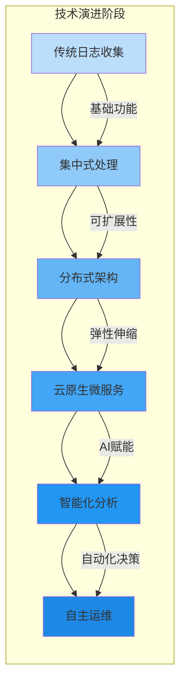

随着云计算、边缘计算、人工智能等技术的快速发展，日志平台正迎来前所未有的变革机遇。从传统的集中式架构到云原生微服务，从被动监控到智能预测，日志平台的技术演进正在重塑整个可观测性领域。本文将深入探讨日志平台的未来发展趋势，包括Serverless架构、边缘计算集成、与安全运营中心的深度融合等前沿技术方向。

## 日志平台的技术演进路径

日志平台的技术发展经历了从简单日志收集到智能化分析的演进过程，未来将继续向更加自动化、智能化、分布式的方向发展。

### 技术演进阶段



#### 演进特征

1. **架构演进**：从单体架构向微服务、Serverless架构转变
2. **处理能力**：从批处理向实时流处理、边缘处理发展
3. **智能化水平**：从规则匹配向机器学习、深度学习提升
4. **集成深度**：从独立系统向与安全、运维、业务系统深度融合
5. **部署模式**：从本地部署向混合云、多云部署扩展

## Serverless日志平台

Serverless架构为日志平台带来了新的可能性，能够实现更高效的资源利用、更灵活的扩展能力和更低的运维成本。

### Serverless架构优势

Serverless架构在日志平台中的应用具有以下优势：

```yaml
# Serverless日志平台优势
serverless_advantages:
  cost_efficiency:
    description: "按需付费，降低资源成本"
    benefits:
      - "只为实际使用的计算资源付费"
      - "无需预置和维护服务器"
      - "自动扩缩容，避免资源浪费"
  
  scalability:
    description: "自动弹性扩缩容"
    benefits:
      - "根据负载自动调整资源"
      - "支持突发流量处理"
      - "无需手动干预扩缩容"
  
  operational_simplicity:
    description: "简化运维管理"
    benefits:
      - "无需管理底层基础设施"
      - "自动处理故障恢复"
      - "专注业务逻辑开发"
  
  event_driven:
    description: "事件驱动的处理模式"
    benefits:
      - "按事件触发处理逻辑"
      - "支持多种事件源集成"
      - "实现精准的资源调度"
```

### 技术实现方案

```python
# Serverless日志处理函数
import json
import boto3
from typing import Dict, Any, List
import logging

logger = logging.getLogger()
logger.setLevel(logging.INFO)

class ServerlessLogProcessor:
    def __init__(self):
        self.s3_client = boto3.client('s3')
        self.dynamodb = boto3.resource('dynamodb')
        self.sns_client = boto3.client('sns')
        self.comprehend_client = boto3.client('comprehend')
        
        # 初始化配置
        self.config = self._load_configuration()
        self.metrics_table = self.dynamodb.Table(self.config['metrics_table'])
        self.alerts_topic = self.config['alerts_topic']
    
    def lambda_handler(self, event: Dict[str, Any], context: Any) -> Dict[str, Any]:
        """AWS Lambda处理函数"""
        try:
            # 1. 解析事件数据
            log_events = self._parse_log_events(event)
            
            # 2. 批量处理日志
            processing_results = self._process_log_batch(log_events)
            
            # 3. 存储处理结果
            self._store_processing_results(processing_results)
            
            # 4. 发送告警（如有）
            self._send_alerts_if_needed(processing_results)
            
            return {
                'statusCode': 200,
                'body': json.dumps({
                    'message': 'Logs processed successfully',
                    'processed_count': len(log_events),
                    'results': processing_results
                })
            }
            
        except Exception as e:
            logger.error(f"Error processing logs: {str(e)}")
            return {
                'statusCode': 500,
                'body': json.dumps({
                    'error': str(e)
                })
            }
    
    def _parse_log_events(self, event: Dict[str, Any]) -> List[Dict[str, Any]]:
        """解析日志事件"""
        log_events = []
        
        # 处理不同的事件源
        if 'Records' in event:
            for record in event['Records']:
                if 'S3' in record:
                    # S3事件
                    log_events.extend(self._parse_s3_event(record))
                elif 'Sns' in record:
                    # SNS事件
                    log_events.extend(self._parse_sns_event(record))
                elif 'kinesis' in record:
                    # Kinesis事件
                    log_events.extend(self._parse_kinesis_event(record))
        
        return log_events
    
    def _process_log_batch(self, log_events: List[Dict[str, Any]]) -> List[Dict[str, Any]]:
        """批量处理日志"""
        results = []
        
        for log_event in log_events:
            try:
                # 1. 数据验证
                if not self._validate_log_event(log_event):
                    continue
                
                # 2. 特征提取
                features = self._extract_features(log_event)
                
                # 3. 异常检测
                anomaly_result = self._detect_anomalies(features)
                
                # 4. 指标计算
                metrics = self._calculate_metrics(log_event)
                
                # 5. 合规检查
                compliance_result = self._check_compliance(log_event)
                
                # 6. 构建处理结果
                result = {
                    'log_id': log_event.get('id'),
                    'timestamp': log_event.get('timestamp'),
                    'anomaly_detection': anomaly_result,
                    'metrics': metrics,
                    'compliance': compliance_result,
                    'processed_at': datetime.utcnow().isoformat()
                }
                
                results.append(result)
                
            except Exception as e:
                logger.error(f"Error processing log event {log_event.get('id')}: {str(e)}")
                # 记录处理失败的事件
                results.append({
                    'log_id': log_event.get('id'),
                    'error': str(e),
                    'processed_at': datetime.utcnow().isoformat()
                })
        
        return results
    
    def _detect_anomalies(self, features: Dict[str, Any]) -> Dict[str, Any]:
        """异常检测"""
        # 使用Amazon Comprehend进行文本分析
        try:
            # 情感分析
            sentiment_response = self.comprehend_client.detect_sentiment(
                Text=features.get('message', ''),
                LanguageCode='en'
            )
            
            # 实体识别
            entities_response = self.comprehend_client.detect_entities(
                Text=features.get('message', ''),
                LanguageCode='en'
            )
            
            return {
                'sentiment': sentiment_response['Sentiment'],
                'sentiment_score': sentiment_response['SentimentScore'],
                'entities': entities_response['Entities'],
                'is_anomaly': self._is_anomalous(features)
            }
        except Exception as e:
            logger.error(f"Error in anomaly detection: {str(e)}")
            return {'error': str(e)}
    
    def _is_anomalous(self, features: Dict[str, Any]) -> bool:
        """判断是否异常"""
        # 简单的异常判断逻辑
        # 实际应用中可以集成更复杂的机器学习模型
        
        # 检查错误级别
        if features.get('level') in ['ERROR', 'FATAL']:
            return True
        
        # 检查响应时间
        response_time = features.get('response_time', 0)
        if response_time > self.config.get('response_time_threshold', 5000):
            return True
        
        # 检查错误率
        error_rate = features.get('error_rate', 0)
        if error_rate > self.config.get('error_rate_threshold', 0.05):
            return True
        
        return False
    
    def _calculate_metrics(self, log_event: Dict[str, Any]) -> Dict[str, Any]:
        """计算指标"""
        metrics = {
            'log_count': 1,
            'error_count': 1 if log_event.get('level') in ['ERROR', 'FATAL'] else 0,
            'warning_count': 1 if log_event.get('level') == 'WARN' else 0,
            'info_count': 1 if log_event.get('level') == 'INFO' else 0
        }
        
        # 存储到DynamoDB
        try:
            self.metrics_table.put_item(Item={
                'log_id': log_event.get('id'),
                'timestamp': log_event.get('timestamp'),
                'metrics': metrics
            })
        except Exception as e:
            logger.error(f"Error storing metrics: {str(e)}")
        
        return metrics
    
    def _check_compliance(self, log_event: Dict[str, Any]) -> Dict[str, Any]:
        """合规检查"""
        compliance_result = {
            'is_compliant': True,
            'violations': []
        }
        
        # 检查PII数据
        if self._contains_pii(log_event):
            if not self._has_valid_consent(log_event):
                compliance_result['is_compliant'] = False
                compliance_result['violations'].append('PII without consent')
        
        # 检查数据保留策略
        if self._violates_retention_policy(log_event):
            compliance_result['is_compliant'] = False
            compliance_result['violations'].append('Retention policy violation')
        
        return compliance_result
    
    def _send_alerts_if_needed(self, results: List[Dict[str, Any]]) -> None:
        """发送告警"""
        for result in results:
            if result.get('anomaly_detection', {}).get('is_anomaly', False) or \
               not result.get('compliance', {}).get('is_compliant', True):
                
                alert_message = {
                    'log_id': result.get('log_id'),
                    'anomaly': result.get('anomaly_detection'),
                    'compliance': result.get('compliance'),
                    'timestamp': result.get('processed_at')
                }
                
                try:
                    self.sns_client.publish(
                        TopicArn=self.alerts_topic,
                        Message=json.dumps(alert_message),
                        Subject='Log Processing Alert'
                    )
                except Exception as e:
                    logger.error(f"Error sending alert: {str(e)}")
```

### Serverless架构设计模式

```yaml
# Serverless日志平台架构模式
serverless_architecture_patterns:
  function_per_capability:
    description: "为每个功能创建独立的函数"
    components:
      - log_parser_function: "日志解析函数"
      - anomaly_detector_function: "异常检测函数"
      - metrics_calculator_function: "指标计算函数"
      - compliance_checker_function: "合规检查函数"
      - alert_sender_function: "告警发送函数"
    benefits:
      - "职责分离，易于维护"
      - "独立扩展，资源优化"
      - "故障隔离，提高可靠性"
  
  event_sourcing:
    description: "基于事件溯源的处理模式"
    components:
      - log_events_stream: "日志事件流"
      - processing_pipeline: "处理管道"
      - state_store: "状态存储"
      - audit_trail: "审计轨迹"
    benefits:
      - "完整的处理历史记录"
      - "支持回放和重处理"
      - "便于调试和问题排查"
  
  microservices_orchestration:
    description: "微服务编排模式"
    components:
      - workflow_orchestrator: "工作流编排器"
      - service_mesh: "服务网格"
      - api_gateway: "API网关"
      - event_bus: "事件总线"
    benefits:
      - "灵活的服务组合"
      - "统一的通信机制"
      - "标准化的接口定义"
```

## 边缘计算与分布式日志采集

随着物联网和5G技术的发展，边缘计算成为日志平台的重要发展方向，能够在靠近数据源的地方进行日志采集和初步处理。

### 边缘计算架构

```java
// 边缘日志采集器
public class EdgeLogCollector {
    private final LocalStorageService localStorageService;
    private final EdgeProcessingService edgeProcessingService;
    private final CloudSyncService cloudSyncService;
    private final ConfigurationService configService;
    private final ResourceManager resourceManager;
    
    public void collectLogs(LogSource source) {
        try {
            // 1. 本地采集
            List<LogEvent> logs = source.collectLogs();
            
            // 2. 边缘预处理
            List<ProcessedLog> processedLogs = edgeProcessingService.preprocessLogs(logs);
            
            // 3. 本地存储
            localStorageService.storeLogs(processedLogs);
            
            // 4. 资源管理
            resourceManager.updateResourceUsage(processedLogs);
            
            // 5. 条件同步到云端
            if (shouldSyncToCloud()) {
                syncToCloud(processedLogs);
            }
            
        } catch (Exception e) {
            logger.error("Error collecting logs from source: " + source.getId(), e);
            handleCollectionError(source, e);
        }
    }
    
    private boolean shouldSyncToCloud() {
        // 综合考虑多个因素决定是否同步
        NetworkStatus networkStatus = getNetworkStatus();
        StorageStatus storageStatus = localStorageService.getStorageStatus();
        ProcessingLoad processingLoad = resourceManager.getProcessingLoad();
        Config config = configService.getCurrentConfig();
        
        // 网络良好且本地存储压力大时同步
        boolean networkGood = networkStatus.isGood() && 
                            networkStatus.getBandwidthUsage() < config.getMaxBandwidthUsage();
        
        boolean storagePressure = storageStatus.isHighPressure() || 
                                storageStatus.getUsagePercentage() > config.getStorageThreshold();
        
        boolean processingCapacity = processingLoad.getUsagePercentage() < config.getProcessingThreshold();
        
        return networkGood && (storagePressure || processingCapacity);
    }
    
    private void syncToCloud(List<ProcessedLog> logs) {
        try {
            // 批量同步到云端
            SyncResult syncResult = cloudSyncService.syncLogs(logs);
            
            if (syncResult.isSuccessful()) {
                // 同步成功后清理本地存储
                localStorageService.cleanupSyncedLogs(logs);
                
                // 更新同步状态
                updateSyncStatus(syncResult);
                
                logger.info("Successfully synced {} logs to cloud", logs.size());
            } else {
                // 同步失败，记录错误并重试
                logger.error("Failed to sync logs to cloud: " + syncResult.getErrorMessage());
                scheduleRetrySync(logs);
            }
            
        } catch (SyncException e) {
            logger.error("Sync exception occurred", e);
            scheduleRetrySync(logs);
        }
    }
    
    // 边缘处理服务
    public class EdgeProcessingService {
        private final PatternRecognitionService patternService;
        private final AnomalyDetectionService anomalyService;
        private final DataCompressionService compressionService;
        
        public List<ProcessedLog> preprocessLogs(List<LogEvent> logs) {
            List<ProcessedLog> processedLogs = new ArrayList<>();
            
            for (LogEvent log : logs) {
                try {
                    // 1. 数据清洗
                    LogEvent cleanedLog = cleanLogData(log);
                    
                    // 2. 模式识别
                    LogPattern pattern = patternService.recognizePattern(cleanedLog);
                    
                    // 3. 异常检测
                    AnomalyResult anomalyResult = anomalyService.detectAnomaly(cleanedLog);
                    
                    // 4. 数据压缩
                    byte[] compressedData = compressionService.compress(cleanedLog);
                    
                    // 5. 构建处理后的日志
                    ProcessedLog processedLog = ProcessedLog.builder()
                        .originalLog(cleanedLog)
                        .pattern(pattern)
                        .anomalyResult(anomalyResult)
                        .compressedData(compressedData)
                        .processingTimestamp(System.currentTimeMillis())
                        .build();
                    
                    processedLogs.add(processedLog);
                    
                } catch (Exception e) {
                    logger.error("Error preprocessing log: " + log.getId(), e);
                    // 记录处理失败的日志
                    ProcessedLog failedLog = ProcessedLog.builder()
                        .originalLog(log)
                        .processingError(e.getMessage())
                        .processingTimestamp(System.currentTimeMillis())
                        .build();
                    processedLogs.add(failedLog);
                }
            }
            
            return processedLogs;
        }
    }
}
```

### 边缘计算部署策略

```yaml
# 边缘计算部署策略
edge_deployment_strategies:
  tiered_processing:
    description: "分层处理策略"
    tiers:
      edge_tier:
        location: "边缘节点"
        capabilities:
          - "实时日志采集"
          - "基础数据清洗"
          - "简单异常检测"
          - "本地数据缓存"
        technologies:
          - "轻量级容器"
          - "嵌入式数据库"
          - "流处理引擎"
      
      regional_tier:
        location: "区域数据中心"
        capabilities:
          - "复杂模式识别"
          - "机器学习分析"
          - "数据聚合处理"
          - "合规性检查"
        technologies:
          - "Kubernetes"
          - "Spark/Flink"
          - "ML服务"
      
      central_tier:
        location: "中心云"
        capabilities:
          - "深度学习分析"
          - "长期数据存储"
          - "全局关联分析"
          - "报告生成"
        technologies:
          - "大数据平台"
          - "AI/ML平台"
          - "数据仓库"
  
  data_locality:
    description: "数据本地化策略"
    principles:
      - "敏感数据本地处理"
      - "实时数据边缘分析"
      - "历史数据云端存储"
      - "合规数据就近处理"
    implementation:
      - "基于数据分类的路由"
      - "动态数据分发策略"
      - "跨区域同步机制"
      - "数据主权管理"
```

## 与安全运营中心(SOC)的深度融合

日志平台与SOC的深度融合是构建主动安全防护体系的关键，能够实现威胁检测、事件响应和安全态势感知的一体化。

### SOC集成架构

```python
# SOC集成服务
class SOCMIntegrationService:
    def __init__(self, config: Dict[str, Any]):
        self.config = config
        self.siem_client = SIEMClient(config['siem_config'])
        self.threat_intel_service = ThreatIntelligenceService(config['threat_intel_config'])
        self.incident_response_service = IncidentResponseService(config['incident_response_config'])
        self.case_management_service = CaseManagementService(config['case_management_config'])
        self.notification_service = NotificationService(config['notification_config'])
        
    def integrate_with_soc(self, log_events: List[Dict[str, Any]]) -> List[Dict[str, Any]]:
        """与SOC集成处理日志事件"""
        try:
            # 1. 威胁情报 enrich
            enriched_logs = self._enrich_with_threat_intel(log_events)
            
            # 2. 安全事件检测
            security_events = self._detect_security_events(enriched_logs)
            
            # 3. 事件关联分析
            correlated_events = self._correlate_events(security_events)
            
            # 4. 案例创建和管理
            cases = self._create_security_cases(correlated_events)
            
            # 5. 响应动作执行
            self._execute_response_actions(cases)
            
            # 6. 状态更新和通知
            self._update_integration_status(cases)
            
            return cases
            
        except Exception as e:
            logger.error(f"Error in SOC integration: {str(e)}")
            self._handle_integration_error(e)
            raise
    
    def _enrich_with_threat_intel(self, log_events: List[Dict[str, Any]]) -> List[Dict[str, Any]]:
        """使用威胁情报丰富日志"""
        enriched_events = []
        
        for log_event in log_events:
            try:
                # 提取威胁指标
                indicators = self._extract_indicators(log_event)
                
                # 查询威胁情报
                threat_intel = self.threat_intel_service.query_intel(indicators)
                
                # 丰富日志事件
                enriched_event = log_event.copy()
                enriched_event['threat_intel'] = threat_intel
                enriched_event['enriched_at'] = datetime.now().isoformat()
                
                enriched_events.append(enriched_event)
                
            except Exception as e:
                logger.error(f"Error enriching log {log_event.get('id')}: {str(e)}")
                # 即使丰富失败也保留原始日志
                enriched_events.append(log_event)
        
        return enriched_events
    
    def _detect_security_events(self, enriched_logs: List[Dict[str, Any]]) -> List[Dict[str, Any]]:
        """检测安全事件"""
        security_events = []
        
        for log in enriched_logs:
            try:
                # 应用安全检测规则
                if self._matches_security_rule(log):
                    security_event = self._create_security_event(log)
                    security_events.append(security_event)
                    
                    # 实时告警
                    self._send_real_time_alert(security_event)
                    
            except Exception as e:
                logger.error(f"Error detecting security event: {str(e)}")
        
        return security_events
    
    def _correlate_events(self, security_events: List[Dict[str, Any]]) -> List[Dict[str, Any]]:
        """关联分析安全事件"""
        correlated_events = []
        
        # 按时间窗口分组事件
        time_windows = self._group_events_by_time_window(security_events)
        
        for window_events in time_windows:
            # 执行关联分析
            correlations = self._perform_correlation_analysis(window_events)
            correlated_events.extend(correlations)
        
        # 跨时间窗口的高级关联
        advanced_correlations = self._perform_advanced_correlation(correlated_events)
        correlated_events.extend(advanced_correlations)
        
        return correlated_events
    
    def _create_security_cases(self, correlated_events: List[Dict[str, Any]]) -> List[Dict[str, Any]]:
        """创建安全案例"""
        cases = []
        
        # 按相似性分组事件
        event_groups = self._group_similar_events(correlated_events)
        
        for group in event_groups:
            try:
                # 创建案例
                case = self.case_management_service.create_case(
                    title=self._generate_case_title(group),
                    description=self._generate_case_description(group),
                    severity=self._calculate_case_severity(group),
                    related_events=group,
                    tags=self._extract_case_tags(group)
                )
                
                cases.append(case)
                
                # 分配案例
                self._assign_case(case)
                
            except Exception as e:
                logger.error(f"Error creating security case: {str(e)}")
        
        return cases
    
    def _execute_response_actions(self, cases: List[Dict[str, Any]]) -> None:
        """执行响应动作"""
        for case in cases:
            try:
                # 根据案例严重程度执行相应响应
                if case['severity'] == 'CRITICAL':
                    self.incident_response_service.initiate_incident_response(case)
                elif case['severity'] == 'HIGH':
                    self.incident_response_service.send_high_priority_alert(case)
                elif case['severity'] == 'MEDIUM':
                    self.incident_response_service.send_medium_priority_alert(case)
                
                # 执行自动化响应动作
                automated_actions = self._get_automated_actions(case)
                for action in automated_actions:
                    self._execute_automated_action(action, case)
                    
            except Exception as e:
                logger.error(f"Error executing response actions for case {case.get('id')}: {str(e)}")
```

### 安全智能分析

```java
// 安全智能分析引擎
public class SecurityIntelligenceEngine {
    private final MachineLearningService mlService;
    private final BehavioralAnalysisService behavioralService;
    private final ThreatHuntingService threatHuntingService;
    private final RiskAssessmentService riskService;
    
    public SecurityAnalysisResult analyzeSecurityLogs(List<LogEvent> logs) {
        SecurityAnalysisResult result = new SecurityAnalysisResult();
        
        try {
            // 1. 机器学习分析
            MLAnalysisResult mlResult = mlService.analyzeLogs(logs);
            result.setMlAnalysis(mlResult);
            
            // 2. 行为分析
            BehavioralAnalysisResult behavioralResult = behavioralService.analyzeBehaviors(logs);
            result.setBehavioralAnalysis(behavioralResult);
            
            // 3. 威胁狩猎
            ThreatHuntingResult huntingResult = threatHuntingService.huntThreats(logs);
            result.setThreatHunting(huntingResult);
            
            // 4. 风险评估
            RiskAssessmentResult riskResult = riskService.assessRisk(logs);
            result.setRiskAssessment(riskResult);
            
            // 5. 综合评分
            double overallScore = calculateOverallSecurityScore(result);
            result.setOverallScore(overallScore);
            
            // 6. 生成建议
            List<SecurityRecommendation> recommendations = generateRecommendations(result);
            result.setRecommendations(recommendations);
            
        } catch (Exception e) {
            logger.error("Error in security intelligence analysis", e);
            result.setError(e.getMessage());
        }
        
        return result;
    }
    
    // 机器学习分析服务
    public class MachineLearningService {
        private final AnomalyDetectionModel anomalyModel;
        private final ClassificationModel classificationModel;
        private final ClusteringModel clusteringModel;
        
        public MLAnalysisResult analyzeLogs(List<LogEvent> logs) {
            MLAnalysisResult result = new MLAnalysisResult();
            
            // 异常检测
            List<AnomalyResult> anomalies = anomalyModel.detectAnomalies(logs);
            result.setAnomalies(anomalies);
            
            // 日志分类
            List<ClassificationResult> classifications = classificationModel.classifyLogs(logs);
            result.setClassifications(classifications);
            
            // 聚类分析
            ClusteringResult clusters = clusteringModel.clusterLogs(logs);
            result.setClusters(clusters);
            
            return result;
        }
    }
    
    // 行为分析服务
    public class BehavioralAnalysisService {
        private final UserProfileService userProfileService;
        private final BaselineService baselineService;
        private final DeviationDetector deviationDetector;
        
        public BehavioralAnalysisResult analyzeBehaviors(List<LogEvent> logs) {
            BehavioralAnalysisResult result = new BehavioralAnalysisResult();
            
            // 用户行为分析
            Map<String, UserBehaviorProfile> userProfiles = userProfileService.buildProfiles(logs);
            result.setUserProfiles(userProfiles);
            
            // 基线建立
            Map<String, BehavioralBaseline> baselines = baselineService.createBaselines(logs);
            result.setBaselines(baselines);
            
            // 偏差检测
            List<BehavioralDeviation> deviations = deviationDetector.detectDeviations(logs, baselines);
            result.setDeviations(deviations);
            
            return result;
        }
    }
}
```

## 未来技术趋势

日志平台的未来发展将围绕技术创新、架构演进和应用场景扩展等多个维度展开。

### 人工智能与深度学习

```yaml
# AI/ML在日志平台中的应用趋势
ai_ml_trends:
  advanced_anomaly_detection:
    description: "基于深度学习的高级异常检测"
    technologies:
      - "Transformer模型用于日志序列分析"
      - "图神经网络用于关联分析"
      - "自监督学习用于无标签数据训练"
    benefits:
      - "更高的检测准确率"
      - "更少的误报率"
      - "自适应的学习能力"
  
  predictive_maintenance:
    description: "预测性维护和故障预防"
    technologies:
      - "时间序列预测模型"
      - "生存分析用于故障时间预测"
      - "强化学习用于优化策略"
    benefits:
      - "提前预警潜在问题"
      - "减少计划外停机时间"
      - "优化维护资源分配"
  
  natural_language_processing:
    description: "自然语言处理用于日志分析"
    technologies:
      - "BERT模型用于日志理解"
      - "文本摘要生成"
      - "多语言日志处理"
    benefits:
      - "自动化日志摘要生成"
      - "跨语言日志分析"
      - "智能日志搜索和查询"
```

### 新兴技术集成

```yaml
# 新兴技术集成趋势
emerging_technologies:
  quantum_computing:
    description: "量子计算在日志分析中的应用"
    potential:
      - "大规模优化问题求解"
      - "复杂模式识别加速"
      - "密码学和安全增强"
    timeline: "长期（5-10年）"
  
  blockchain:
    description: "区块链技术用于日志完整性保障"
    applications:
      - "日志防篡改存储"
      - "审计轨迹不可变记录"
      - "跨组织日志共享"
    benefits:
      - "增强数据可信度"
      - "简化合规审计"
      - "支持多方协作"
  
  digital_twin:
    description: "数字孪生技术用于系统建模"
    use_cases:
      - "系统行为模拟和预测"
      - "故障场景重现"
      - "运维决策支持"
    advantages:
      - "降低试错成本"
      - "提升决策质量"
      - "支持培训和演练"
```

## 最佳实践总结

### 1. 架构设计最佳实践

```yaml
# 架构设计最佳实践
architecture_best_practices:
  - adopt_cloud_native: "采用云原生架构和微服务设计"
  - implement_event_driven: "实现事件驱动的处理模式"
  - ensure_resilience: "构建高可用和容错的系统"
  - optimize_resource_usage: "优化资源使用和成本控制"
  - plan_for_scalability: "为大规模扩展做好架构规划"
```

### 2. 技术选型最佳实践

```yaml
# 技术选型最佳实践
technology_selection_best_practices:
  - evaluate_serverless_benefits: "评估Serverless架构的适用场景"
  - consider_edge_computing: "考虑边缘计算的部署需求"
  - integrate_ai_ml_capabilities: "集成AI/ML能力提升智能化水平"
  - ensure_security_compliance: "确保技术选型满足安全合规要求"
  - plan_for_future_evolution: "为技术演进预留扩展空间"
```

### 3. 运营管理最佳实践

```yaml
# 运营管理最佳实践
operations_management_best_practices:
  - implement_observability: "构建全面的可观测性体系"
  - automate_deployment: "实现持续集成和部署自动化"
  - monitor_performance: "持续监控系统性能和用户体验"
  - conduct_regular_audits: "定期进行安全和合规审计"
  - foster_innovation: "鼓励技术创新和实验"
```

## 总结

日志平台的未来发展将是一个多元化、智能化、集成化的过程。Serverless架构将带来更高的资源效率和更低的运维成本，边缘计算将实现更实时的数据处理和更低的延迟，与SOC的深度融合将构建起更强大的安全防护体系。

关键要点包括：

1. **架构演进**：从传统架构向Serverless、微服务架构的转变
2. **边缘智能**：边缘计算与日志处理的结合实现分布式智能
3. **安全融合**：与SOC的深度集成构建主动安全防护能力
4. **AI赋能**：人工智能技术在日志分析中的深度应用
5. **技术前瞻**：量子计算、区块链等新兴技术的潜在应用

在实际应用中，企业需要根据自身的技术基础、业务需求和发展规划，选择合适的演进路径和技术方案。同时，也需要关注技术发展的新趋势，保持对前沿技术的敏感性和适应能力，确保日志平台能够持续满足不断变化的业务和安全需求。

未来的日志平台将不仅仅是数据收集和分析工具，而是成为企业数字化转型和智能化运营的核心基础设施，为业务创新和价值创造提供强有力的技术支撑。