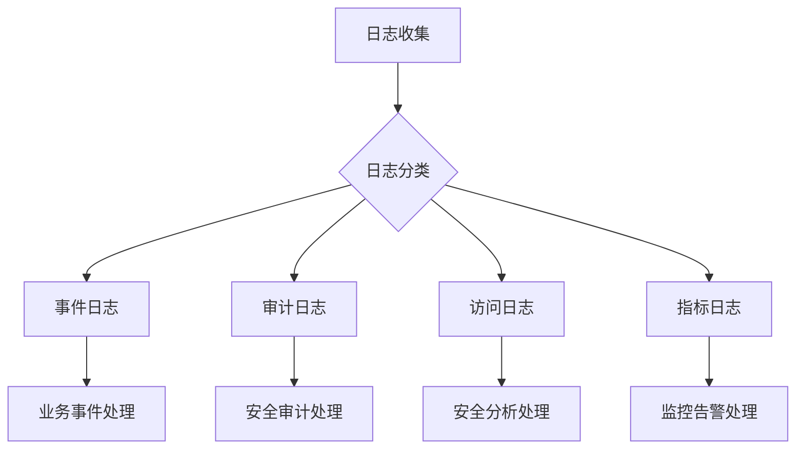

在企业级系统中，日志根据其业务功能和应用场景可以分为多种类型，每种类型都有其独特的价值和处理需求。理解这些不同类型的日志及其特点，对于构建高效的日志平台和实现精准的系统监控至关重要。本文将深入探讨四种核心日志类型：事件日志、审计日志、访问日志和指标日志。

## 事件日志（Event Logs）

事件日志记录系统中发生的特定业务或技术事件，是理解系统行为和用户活动的重要信息源。

### 特点与价值

1. **业务导向**：直接反映业务流程和用户行为
2. **时间序列性**：按时间顺序记录事件发生过程
3. **上下文丰富**：包含事件相关的详细上下文信息
4. **问题追溯**：支持事件链的完整追溯和分析

### 典型应用场景

- 用户行为追踪：登录、注册、购买等用户操作
- 业务流程监控：订单创建、支付处理、库存变更等
- 系统事件记录：服务启动、配置变更、任务执行等

### 事件日志示例

```json
{
  "timestamp": "2025-09-06T10:00:00.123Z",
  "event_type": "user_login",
  "user_id": "user-12345",
  "session_id": "sess-a1b2c3d4",
  "ip_address": "192.168.1.100",
  "user_agent": "Mozilla/5.0 (Windows NT 10.0; Win64; x64)",
  "location": "Beijing",
  "authentication_method": "password",
  "success": true,
  "duration_ms": 45
}
```

```json
{
  "timestamp": "2025-09-06T10:05:00.456Z",
  "event_type": "order_created",
  "order_id": "ORD-67890",
  "user_id": "user-12345",
  "product_id": "PROD-ABCDE",
  "quantity": 2,
  "unit_price": 99.99,
  "total_amount": 199.98,
  "currency": "CNY",
  "payment_method": "credit_card"
}
```

### 处理与分析

事件日志的处理重点在于事件链的构建和业务流程的可视化：

```sql
-- 分析用户行为路径
WITH user_events AS (
  SELECT 
    user_id,
    event_type,
    timestamp,
    LEAD(timestamp) OVER (PARTITION BY user_id ORDER BY timestamp) as next_event_time
  FROM event_logs 
  WHERE timestamp >= NOW() - INTERVAL '1 day'
)
SELECT 
  user_id,
  event_type,
  EXTRACT(EPOCH FROM (next_event_time - timestamp)) as time_to_next_event
FROM user_events 
WHERE next_event_time IS NOT NULL;
```

## 审计日志（Audit Logs）

审计日志记录系统中重要的操作和变更，主要用于安全审计、合规检查和责任追溯。

### 特点与价值

1. **安全敏感**：记录敏感操作和权限变更
2. **不可篡改**：通常需要防篡改和完整性保护
3. **合规要求**：满足法律法规和行业标准要求
4. **责任追溯**：明确操作责任人和操作详情

### 典型应用场景

- 权限管理：用户权限的授予、撤销和变更
- 数据访问：敏感数据的访问和修改记录
- 系统配置：关键系统配置的变更记录
- 安全事件：安全相关的操作和事件记录

### 审计日志示例

```json
{
  "timestamp": "2025-09-06T10:10:00.789Z",
  "log_type": "audit",
  "event_type": "permission_granted",
  "actor": {
    "user_id": "admin-001",
    "username": "system_admin",
    "ip_address": "192.168.1.50"
  },
  "target": {
    "user_id": "user-12345",
    "username": "john_doe"
  },
  "resource": {
    "type": "role",
    "id": "admin_role",
    "name": "Administrator"
  },
  "action": "GRANT",
  "previous_value": null,
  "new_value": "admin_role",
  "reason": "Promotion to admin role",
  "session_id": "sess-admin-999"
}
```

```json
{
  "timestamp": "2025-09-06T10:15:00.123Z",
  "log_type": "audit",
  "event_type": "data_access",
  "actor": {
    "user_id": "user-12345",
    "username": "john_doe",
    "ip_address": "192.168.1.100"
  },
  "resource": {
    "type": "customer_data",
    "id": "cust-98765",
    "sensitive_fields": ["phone_number", "address"]
  },
  "action": "READ",
  "access_level": "authorized",
  "justification": "Customer service inquiry",
  "session_id": "sess-a1b2c3d4"
}
```

### 安全与合规要求

审计日志需要满足特殊的安全和合规要求：

```python
# 审计日志的完整性保护
import hashlib
import hmac

def create_audit_log_entry(log_data, secret_key):
    # 创建日志条目
    log_entry = {
        "timestamp": get_current_timestamp(),
        "data": log_data,
        "signature": ""
    }
    
    # 计算HMAC签名以确保完整性
    log_string = json.dumps(log_data, sort_keys=True)
    signature = hmac.new(
        secret_key.encode(), 
        log_string.encode(), 
        hashlib.sha256
    ).hexdigest()
    
    log_entry["signature"] = signature
    return log_entry
```

## 访问日志（Access Logs）

访问日志记录系统或服务的访问情况，是网络安全分析和流量监控的重要数据源。

### 特点与价值

1. **高频率**：通常以高频率产生大量日志
2. **网络相关**：包含丰富的网络层面信息
3. **安全分析**：支持入侵检测和异常行为分析
4. **性能监控**：用于分析系统性能和用户访问模式

### 典型应用场景

- Web服务器访问日志：记录HTTP请求详情
- API网关日志：记录API调用情况
- 网络设备日志：记录网络流量和连接信息
- 应用程序访问日志：记录应用层面的访问情况

### 访问日志示例

```apache
# Apache/Nginx访问日志
192.168.1.100 - - [06/Sep/2025:10:20:00 +0000] "GET /api/users/12345 HTTP/1.1" 200 1234 "https://example.com/dashboard" "Mozilla/5.0 (Windows NT 10.0; Win64; x64) AppleWebKit/537.36"
```

```json
// API网关访问日志
{
  "timestamp": "2025-09-06T10:20:00.123Z",
  "request": {
    "method": "GET",
    "path": "/api/users/12345",
    "headers": {
      "user-agent": "Mozilla/5.0 (Windows NT 10.0; Win64; x64) AppleWebKit/537.36",
      "authorization": "Bearer ***",
      "x-forwarded-for": "192.168.1.100"
    },
    "query_params": {
      "include": "profile,preferences"
    }
  },
  "response": {
    "status_code": 200,
    "response_time_ms": 45,
    "response_size_bytes": 1234
  },
  "client": {
    "ip": "192.168.1.100",
    "user_id": "user-12345",
    "api_key": "key-abc123"
  },
  "server": {
    "host": "api-server-01",
    "region": "cn-north-1"
  }
}
```

### 安全分析应用

访问日志在安全分析中的应用：

```python
# 检测异常访问模式
def detect_suspicious_activity(access_logs):
    # 统计每个IP的访问频率
    ip_counts = {}
    for log in access_logs:
        ip = log['client']['ip']
        ip_counts[ip] = ip_counts.get(ip, 0) + 1
    
    # 识别访问频率异常的IP
    threshold = np.mean(list(ip_counts.values())) + 2 * np.std(list(ip_counts.values()))
    suspicious_ips = [ip for ip, count in ip_counts.items() if count > threshold]
    
    return suspicious_ips
```

## 指标日志（Metric Logs）

指标日志记录系统性能和业务指标，是监控和分析系统健康状况的重要数据。

### 特点与价值

1. **数值化**：以数值形式记录度量信息
2. **时间序列**：适合时间序列分析和趋势预测
3. **监控导向**：直接支持监控告警和性能分析
4. **聚合友好**：便于进行统计和聚合计算

### 典型应用场景

- 系统性能指标：CPU、内存、磁盘使用率等
- 业务指标：订单量、用户活跃度、转化率等
- 服务指标：响应时间、错误率、吞吐量等
- 应用指标：自定义业务指标和KPI

### 指标日志示例

```json
{
  "timestamp": "2025-09-06T10:25:00.000Z",
  "metric_type": "system_performance",
  "host": "web-server-01",
  "metrics": {
    "cpu_usage_percent": 75.5,
    "memory_usage_percent": 68.2,
    "disk_usage_percent": 45.8,
    "network_in_bytes": 1024000,
    "network_out_bytes": 2048000
  }
}
```

```json
{
  "timestamp": "2025-09-06T10:25:00.000Z",
  "metric_type": "business_kpi",
  "service": "order-service",
  "metrics": {
    "orders_created": 125,
    "orders_completed": 118,
    "conversion_rate_percent": 3.2,
    "average_order_value": 156.75,
    "error_rate_percent": 0.8
  }
}
```

```json
{
  "timestamp": "2025-09-06T10:25:00.000Z",
  "metric_type": "api_performance",
  "endpoint": "/api/users",
  "method": "GET",
  "metrics": {
    "request_count": 245,
    "average_response_time_ms": 45.2,
    "p95_response_time_ms": 85.0,
    "p99_response_time_ms": 120.5,
    "error_count": 3,
    "success_rate_percent": 98.8
  }
}
```

### 监控与告警

指标日志在监控告警中的应用：

```python
# 基于指标日志的告警规则
def check_system_health(metric_logs):
    alerts = []
    
    for log in metric_logs:
        if log['metric_type'] == 'system_performance':
            cpu_usage = log['metrics']['cpu_usage_percent']
            memory_usage = log['metrics']['memory_usage_percent']
            
            if cpu_usage > 90:
                alerts.append({
                    "type": "HIGH_CPU_USAGE",
                    "host": log['host'],
                    "value": cpu_usage,
                    "threshold": 90
                })
            
            if memory_usage > 85:
                alerts.append({
                    "type": "HIGH_MEMORY_USAGE",
                    "host": log['host'],
                    "value": memory_usage,
                    "threshold": 85
                })
    
    return alerts
```

## 不同日志类型的处理策略

### 存储策略

| 日志类型 | 存储介质 | 保留期限 | 查询频率 |
|----------|----------|----------|----------|
| 事件日志 | 高性能数据库 | 30-90天 | 中等 |
| 审计日志 | 安全存储 | 1-7年 | 低 |
| 访问日志 | 分布式存储 | 90-365天 | 高 |
| 指标日志 | 时序数据库 | 365-1095天 | 高 |

### 处理流程



### 查询优化

不同类型日志的查询优化策略：

```sql
-- 事件日志查询优化：基于业务维度的索引
CREATE INDEX idx_event_logs_user_time ON event_logs(user_id, timestamp);
CREATE INDEX idx_event_logs_type_time ON event_logs(event_type, timestamp);

-- 审计日志查询优化：基于操作类型和时间的索引
CREATE INDEX idx_audit_logs_action_time ON audit_logs(action, timestamp);
CREATE INDEX idx_audit_logs_actor_time ON audit_logs(actor_user_id, timestamp);

-- 访问日志查询优化：基于IP和时间的索引
CREATE INDEX idx_access_logs_ip_time ON access_logs(client_ip, timestamp);
CREATE INDEX idx_access_logs_status_time ON access_logs(status_code, timestamp);

-- 指标日志查询优化：基于指标类型和时间的索引
CREATE INDEX idx_metric_logs_type_time ON metric_logs(metric_type, timestamp);
CREATE INDEX idx_metric_logs_host_time ON metric_logs(host, timestamp);
```

## 综合应用案例

在实际应用中，这四种日志类型往往是相互关联的：

```python
# 综合分析示例：用户行为与系统性能关联分析
def correlate_user_activity_with_system_performance(event_logs, metric_logs):
    # 获取用户登录事件
    login_events = [log for log in event_logs if log['event_type'] == 'user_login']
    
    # 获取系统性能指标
    performance_metrics = [log for log in metric_logs if log['metric_type'] == 'system_performance']
    
    # 关联分析：登录高峰期间的系统性能
    correlation_results = []
    for event in login_events:
        event_time = event['timestamp']
        # 查找事件时间附近的性能指标
        nearby_metrics = [
            metric for metric in performance_metrics 
            if abs((metric['timestamp'] - event_time).total_seconds()) < 300  # 5分钟内
        ]
        
        if nearby_metrics:
            avg_cpu = np.mean([m['metrics']['cpu_usage_percent'] for m in nearby_metrics])
            correlation_results.append({
                "event": event,
                "avg_cpu_usage": avg_cpu
            })
    
    return correlation_results
```

## 总结

事件日志、审计日志、访问日志和指标日志构成了企业日志系统的核心组成部分，每种类型都有其独特的价值和应用场景。通过合理分类和针对性处理这些日志类型，我们可以构建出更加完善和高效的日志平台：

1. **事件日志**帮助我们理解业务流程和用户行为
2. **审计日志**确保系统的安全性和合规性
3. **访问日志**支持网络安全分析和流量监控
4. **指标日志**提供系统性能和业务健康状况的实时洞察

在实际的日志平台建设中，我们需要根据业务需求和资源约束，为每种日志类型制定合适的收集、存储、处理和分析策略，以最大化日志数据的价值。