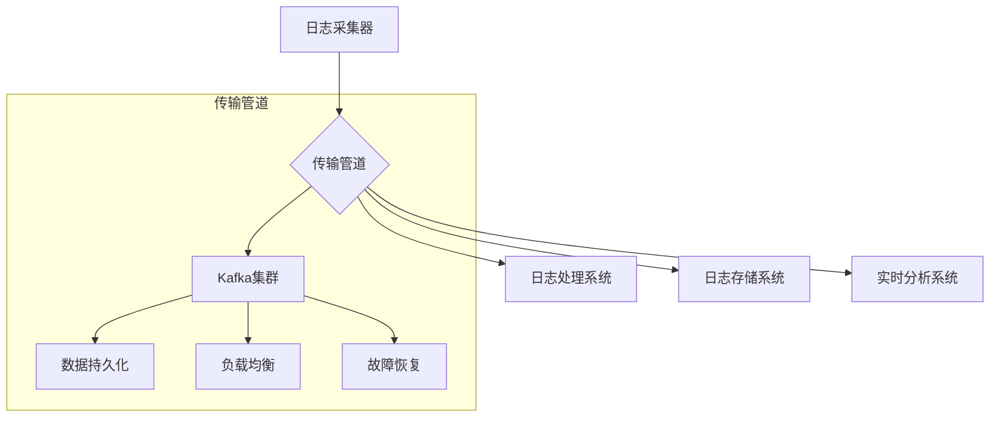

在企业级日志平台建设中，日志传输管道是连接日志采集和日志处理的关键环节。一个高效、可靠的日志传输管道不仅能够确保日志数据的完整性和实时性，还能为大规模分布式系统的日志处理提供坚实的基础。本文将深入探讨日志传输管道的核心技术，包括Kafka、Pulsar等消息队列的使用，数据可靠性保障机制，以及压缩与加密传输等关键技术。

## 日志传输管道的核心概念

日志传输管道是将采集到的日志数据从源头传输到目的地的中间通道，它需要具备高吞吐量、高可靠性、低延迟和可扩展性等特点。

### 核心组件

1. **生产者（Producer）**：负责将日志数据发送到传输管道
2. **传输管道（Pipeline）**：负责存储和转发日志数据
3. **消费者（Consumer）**：负责从传输管道接收日志数据
4. **监控系统**：负责监控传输管道的健康状态

### 设计原则



## Kafka作为日志传输管道

Kafka是目前最流行的消息队列系统之一，广泛用于日志传输场景。

### Kafka核心特性

1. **高吞吐量**：支持每秒百万级别的消息传输
2. **持久化存储**：提供数据持久化保证
3. **水平扩展**：支持集群水平扩展
4. **生态系统**：拥有丰富的生态系统支持

### Kafka架构设计

```java
// Kafka日志传输管道架构
// Producer → Kafka Cluster → Consumer
//           ↑
//      Zookeeper (元数据管理)
```

### Kafka生产者配置优化

```java
// Kafka生产者配置优化
public class OptimizedKafkaProducer {
    private final KafkaProducer<String, byte[]> producer;
    
    public OptimizedKafkaProducer() {
        Properties props = new Properties();
        
        // 基础配置
        props.put(ProducerConfig.BOOTSTRAP_SERVERS_CONFIG, 
                 "kafka1:9092,kafka2:9092,kafka3:9092");
        props.put(ProducerConfig.KEY_SERIALIZER_CLASS_CONFIG, 
                 StringSerializer.class);
        props.put(ProducerConfig.VALUE_SERIALIZER_CLASS_CONFIG, 
                 ByteArraySerializer.class);
        
        // 性能优化配置
        props.put(ProducerConfig.BATCH_SIZE_CONFIG, 16384);  // 16KB批次大小
        props.put(ProducerConfig.LINGER_MS_CONFIG, 5);       // 5ms延迟
        props.put(ProducerConfig.COMPRESSION_TYPE_CONFIG, "snappy");  // 压缩
        props.put(ProducerConfig.ACKS_CONFIG, "1");          // 至少一次确认
        props.put(ProducerConfig.RETRIES_CONFIG, Integer.MAX_VALUE);  // 无限重试
        props.put(ProducerConfig.MAX_IN_FLIGHT_REQUESTS_PER_CONNECTION, 5);
        props.put(ProducerConfig.ENABLE_IDEMPOTENCE_CONFIG, true);  // 幂等性
        
        // 缓冲区配置
        props.put(ProducerConfig.BUFFER_MEMORY_CONFIG, 33554432);  // 32MB缓冲区
        props.put(ProducerConfig.MAX_BLOCK_MS_CONFIG, 60000);      // 60秒阻塞超时
        
        this.producer = new KafkaProducer<>(props);
    }
    
    public void sendLog(String topic, LogEvent event) {
        byte[] eventData = serializeLogEvent(event);
        ProducerRecord<String, byte[]> record = 
            new ProducerRecord<>(topic, event.getKey(), eventData);
        
        producer.send(record, new Callback() {
            @Override
            public void onCompletion(RecordMetadata metadata, Exception exception) {
                if (exception != null) {
                    logger.error("Failed to send log to Kafka", exception);
                    // 实现重试逻辑
                    handleSendFailure(event, exception);
                } else {
                    logger.debug("Successfully sent log to Kafka: topic={}, partition={}, offset={}",
                               metadata.topic(), metadata.partition(), metadata.offset());
                }
            }
        });
    }
    
    private void handleSendFailure(LogEvent event, Exception exception) {
        // 记录失败日志
        failureLogger.error("Log send failed: {}", event, exception);
        
        // 实现重试机制
        retryExecutor.schedule(() -> {
            sendLog("logs-failed", event);
        }, 1, TimeUnit.SECONDS);
    }
}
```

### Kafka消费者配置优化

```java
// Kafka消费者配置优化
public class OptimizedKafkaConsumer {
    private final KafkaConsumer<String, byte[]> consumer;
    private final ExecutorService processorExecutor;
    
    public OptimizedKafkaConsumer() {
        Properties props = new Properties();
        
        // 基础配置
        props.put(ConsumerConfig.BOOTSTRAP_SERVERS_CONFIG, 
                 "kafka1:9092,kafka2:9092,kafka3:9092");
        props.put(ConsumerConfig.GROUP_ID_CONFIG, "log-processor-group");
        props.put(ConsumerConfig.KEY_DESERIALIZER_CLASS_CONFIG, 
                 StringDeserializer.class);
        props.put(ConsumerConfig.VALUE_DESERIALIZER_CLASS_CONFIG, 
                 ByteArrayDeserializer.class);
        
        // 性能优化配置
        props.put(ConsumerConfig.FETCH_MIN_BYTES_CONFIG, 1024);      // 最小获取大小
        props.put(ConsumerConfig.FETCH_MAX_WAIT_MS_CONFIG, 500);     // 最大等待时间
        props.put(ConsumerConfig.MAX_PARTITION_FETCH_BYTES_CONFIG, 1048576);  // 1MB
        props.put(ConsumerConfig.FETCH_MAX_BYTES_CONFIG, 52428800);  // 50MB
        
        // 提交配置
        props.put(ConsumerConfig.ENABLE_AUTO_COMMIT_CONFIG, false);  // 手动提交
        props.put(ConsumerConfig.AUTO_OFFSET_RESET_CONFIG, "earliest");
        
        // 心跳配置
        props.put(ConsumerConfig.SESSION_TIMEOUT_MS_CONFIG, 30000);
        props.put(ConsumerConfig.HEARTBEAT_INTERVAL_MS_CONFIG, 3000);
        
        this.consumer = new KafkaConsumer<>(props);
        this.processorExecutor = Executors.newFixedThreadPool(10);
    }
    
    public void startConsuming() {
        consumer.subscribe(Arrays.asList("logs-app", "logs-nginx", "logs-system"));
        
        while (!Thread.currentThread().isInterrupted()) {
            ConsumerRecords<String, byte[]> records = consumer.poll(Duration.ofMillis(1000));
            
            if (!records.isEmpty()) {
                // 批量处理
                processRecords(records);
                
                // 手动提交偏移量
                consumer.commitSync();
            }
        }
    }
    
    private void processRecords(ConsumerRecords<String, byte[]> records) {
        List<CompletableFuture<Void>> futures = new ArrayList<>();
        
        for (ConsumerRecord<String, byte[]> record : records) {
            CompletableFuture<Void> future = CompletableFuture.runAsync(() -> {
                try {
                    LogEvent event = deserializeLogEvent(record.value());
                    processLogEvent(event);
                } catch (Exception e) {
                    logger.error("Failed to process log event", e);
                }
            }, processorExecutor);
            
            futures.add(future);
        }
        
        // 等待所有任务完成
        CompletableFuture.allOf(futures.toArray(new CompletableFuture[0])).join();
    }
}
```

### Kafka主题设计

```bash
# Kafka主题设计最佳实践

# 按服务分类
logs-user-service
logs-order-service
logs-payment-service

# 按日志类型分类
logs-access
logs-error
logs-audit

# 按环境分类
logs-prod-user-service
logs-staging-user-service
logs-dev-user-service

# 主题配置示例
kafka-topics.sh --create \
  --topic logs-app \
  --partitions 12 \
  --replication-factor 3 \
  --config retention.ms=604800000 \  # 7天保留
  --config segment.bytes=1073741824 \  # 1GB段大小
  --config compression.type=snappy \
  --bootstrap-server localhost:9092
```

## Pulsar作为日志传输管道

Pulsar是新一代云原生消息队列，具有多租户、无服务器函数等先进特性。

### Pulsar核心特性

1. **多租户支持**：原生支持多租户隔离
2. **无服务器函数**：支持无服务器流处理
3. **地理位置复制**：支持跨地域数据复制
4. **灵活订阅**：支持多种订阅模式

### Pulsar架构设计

```java
// Pulsar日志传输管道架构
// Producer → Pulsar Cluster → Consumer
//           ↑
//      BookKeeper (存储层)
```

### Pulsar生产者实现

```java
// Pulsar生产者实现
public class PulsarLogProducer {
    private final PulsarClient client;
    private final Producer<byte[]> producer;
    
    public PulsarLogProducer() throws PulsarClientException {
        this.client = PulsarClient.builder()
            .serviceUrl("pulsar://localhost:6650")
            .ioThreads(8)
            .listenerThreads(4)
            .build();
        
        this.producer = client.newProducer()
            .topic("persistent://public/default/logs")
            .compressionType(CompressionType.SNAPPY)
            .batchingMaxPublishDelay(10, TimeUnit.MILLISECONDS)
            .batchingMaxMessages(1000)
            .blockIfQueueFull(true)
            .maxPendingMessages(10000)
            .create();
    }
    
    public CompletableFuture<MessageId> sendLog(LogEvent event) {
        byte[] eventData = serializeLogEvent(event);
        
        return producer.newMessage()
            .key(event.getKey())
            .value(eventData)
            .property("service", event.getService())
            .property("level", event.getLevel().toString())
            .property("timestamp", String.valueOf(event.getTimestamp()))
            .sendAsync();
    }
}
```

### Pulsar消费者实现

```java
// Pulsar消费者实现
public class PulsarLogConsumer {
    private final PulsarClient client;
    private final Consumer<byte[]> consumer;
    
    public PulsarLogConsumer() throws PulsarClientException {
        this.client = PulsarClient.builder()
            .serviceUrl("pulsar://localhost:6650")
            .build();
        
        this.consumer = client.newConsumer()
            .topic("persistent://public/default/logs")
            .subscriptionName("log-processor-subscription")
            .subscriptionType(SubscriptionType.Shared)
            .receiverQueueSize(1000)
            .ackTimeout(30, TimeUnit.SECONDS)
            .subscribe();
    }
    
    public void startConsuming() {
        while (!Thread.currentThread().isInterrupted()) {
            try {
                Message<byte[]> message = consumer.receive(1, TimeUnit.SECONDS);
                if (message != null) {
                    processMessage(message);
                    consumer.acknowledge(message);
                }
            } catch (Exception e) {
                logger.error("Failed to consume message", e);
            }
        }
    }
    
    private void processMessage(Message<byte[]> message) {
        try {
            LogEvent event = deserializeLogEvent(message.getData());
            processLogEvent(event);
        } catch (Exception e) {
            logger.error("Failed to process log event", e);
            // 处理失败的消息
            handleFailedMessage(message, e);
        }
    }
}
```

## 数据可靠性与丢失恢复机制

### 可靠性保障策略

```java
// 数据可靠性保障实现
public class ReliableLogTransporter {
    private final KafkaProducer<String, byte[]> primaryProducer;
    private final KafkaProducer<String, byte[]> backupProducer;
    private final DiskBuffer diskBuffer;
    private final ScheduledExecutorService retryScheduler;
    
    public ReliableLogTransporter() {
        this.primaryProducer = new OptimizedKafkaProducer();
        this.backupProducer = new OptimizedKafkaProducer();  // 备用生产者
        this.diskBuffer = new DiskBuffer("/var/log/transport-buffer");
        this.retryScheduler = Executors.newScheduledThreadPool(2);
        
        // 启动重试机制
        startRetryMechanism();
    }
    
    public boolean sendLog(LogEvent event) {
        try {
            // 首先尝试主通道发送
            Future<RecordMetadata> future = primaryProducer.send(
                new ProducerRecord<>("logs-primary", event.getKey(), serializeLogEvent(event))
            );
            
            // 等待发送结果
            future.get(5, TimeUnit.SECONDS);
            return true;
        } catch (Exception e) {
            logger.warn("Primary transport failed, trying backup", e);
            
            try {
                // 备用通道发送
                Future<RecordMetadata> future = backupProducer.send(
                    new ProducerRecord<>("logs-backup", event.getKey(), serializeLogEvent(event))
                );
                future.get(5, TimeUnit.SECONDS);
                return true;
            } catch (Exception backupException) {
                logger.error("Backup transport also failed, buffering to disk", backupException);
                
                // 写入磁盘缓冲区
                try {
                    diskBuffer.add(serializeLogEvent(event));
                    return true;  // 缓冲成功也算成功
                } catch (IOException bufferException) {
                    logger.error("Failed to buffer log to disk", bufferException);
                    return false;
                }
            }
        }
    }
    
    private void startRetryMechanism() {
        retryScheduler.scheduleWithFixedDelay(() -> {
            try {
                // 从磁盘缓冲区读取并重试发送
                List<byte[]> bufferedEvents = diskBuffer.drainTo(100);
                for (byte[] eventData : bufferedEvents) {
                    LogEvent event = deserializeLogEvent(eventData);
                    if (sendLog(event)) {
                        diskBuffer.remove();  // 发送成功后移除
                    }
                }
            } catch (Exception e) {
                logger.error("Failed to retry log sending", e);
            }
        }, 10, 30, TimeUnit.SECONDS);
    }
}
```

### 数据一致性保障

```java
// 数据一致性保障实现
public class ConsistentLogTransporter {
    private final KafkaProducer<String, byte[]> producer;
    
    public ConsistentLogTransporter() {
        Properties props = new Properties();
        props.put(ProducerConfig.BOOTSTRAP_SERVERS_CONFIG, "localhost:9092");
        props.put(ProducerConfig.KEY_SERIALIZER_CLASS_CONFIG, StringSerializer.class);
        props.put(ProducerConfig.VALUE_SERIALIZER_CLASS_CONFIG, ByteArraySerializer.class);
        
        // 启用幂等性
        props.put(ProducerConfig.ENABLE_IDEMPOTENCE_CONFIG, true);
        props.put(ProducerConfig.ACKS_CONFIG, "all");  // 等待所有副本确认
        props.put(ProducerConfig.RETRIES_CONFIG, Integer.MAX_VALUE);
        props.put(ProducerConfig.MAX_IN_FLIGHT_REQUESTS_PER_CONNECTION, 5);
        
        this.producer = new KafkaProducer<>(props);
    }
    
    public void sendLogWithConsistency(LogEvent event) {
        String key = event.getKey();
        byte[] value = serializeLogEvent(event);
        
        // 使用事务确保一致性
        producer.initTransactions();
        try {
            producer.beginTransaction();
            
            // 发送日志消息
            producer.send(new ProducerRecord<>("logs-app", key, value));
            
            // 可以发送其他相关消息
            producer.send(new ProducerRecord<>("logs-audit", key, createAuditRecord(event)));
            
            // 提交事务
            producer.commitTransaction();
        } catch (Exception e) {
            logger.error("Transaction failed, aborting", e);
            producer.abortTransaction();
            throw new RuntimeException("Failed to send logs consistently", e);
        }
    }
}
```

## 压缩与加密传输

### 数据压缩

```java
// 数据压缩实现
public class CompressedLogTransporter {
    private final KafkaProducer<String, byte[]> producer;
    
    public CompressedLogTransporter() {
        Properties props = new Properties();
        props.put(ProducerConfig.BOOTSTRAP_SERVERS_CONFIG, "localhost:9092");
        props.put(ProducerConfig.KEY_SERIALIZER_CLASS_CONFIG, StringSerializer.class);
        props.put(ProducerConfig.VALUE_SERIALIZER_CLASS_CONFIG, ByteArraySerializer.class);
        
        // 启用压缩
        props.put(ProducerConfig.COMPRESSION_TYPE_CONFIG, "snappy");  // 或 "gzip", "lz4"
        
        // 批次大小优化
        props.put(ProducerConfig.BATCH_SIZE_CONFIG, 32768);  // 32KB批次
        props.put(ProducerConfig.LINGER_MS_CONFIG, 10);      // 10ms延迟
        
        this.producer = new KafkaProducer<>(props);
    }
    
    public void sendCompressedLog(LogEvent event) {
        try {
            // 序列化日志事件
            byte[] eventData = serializeLogEvent(event);
            
            // 可以选择在应用层进一步压缩
            byte[] compressedData = compressData(eventData);
            
            producer.send(new ProducerRecord<>("logs-compressed", event.getKey(), compressedData));
        } catch (Exception e) {
            logger.error("Failed to send compressed log", e);
        }
    }
    
    private byte[] compressData(byte[] data) throws IOException {
        ByteArrayOutputStream baos = new ByteArrayOutputStream();
        try (GZIPOutputStream gzip = new GZIPOutputStream(baos)) {
            gzip.write(data);
        }
        return baos.toByteArray();
    }
}
```

### 数据加密

```java
// 数据加密传输实现
public class EncryptedLogTransporter {
    private final KafkaProducer<String, byte[]> producer;
    private final Cipher encryptCipher;
    private final Cipher decryptCipher;
    
    public EncryptedLogTransporter() throws Exception {
        Properties props = new Properties();
        props.put(ProducerConfig.BOOTSTRAP_SERVERS_CONFIG, "localhost:9092");
        props.put(ProducerConfig.KEY_SERIALIZER_CLASS_CONFIG, StringSerializer.class);
        props.put(ProducerConfig.VALUE_SERIALIZER_CLASS_CONFIG, ByteArraySerializer.class);
        
        this.producer = new KafkaProducer<>(props);
        this.encryptCipher = createCipher(Cipher.ENCRYPT_MODE);
        this.decryptCipher = createCipher(Cipher.DECRYPT_MODE);
    }
    
    public void sendEncryptedLog(LogEvent event) {
        try {
            // 序列化日志事件
            byte[] eventData = serializeLogEvent(event);
            
            // 加密数据
            byte[] encryptedData = encryptCipher.doFinal(eventData);
            
            // 发送加密数据
            producer.send(new ProducerRecord<>("logs-encrypted", event.getKey(), encryptedData));
        } catch (Exception e) {
            logger.error("Failed to send encrypted log", e);
        }
    }
    
    private Cipher createCipher(int mode) throws Exception {
        String encryptionKey = System.getenv("LOG_ENCRYPTION_KEY");
        if (encryptionKey == null) {
            throw new IllegalStateException("Encryption key not found");
        }
        
        SecretKeySpec keySpec = new SecretKeySpec(
            encryptionKey.getBytes(StandardCharsets.UTF_8), "AES");
        Cipher cipher = Cipher.getInstance("AES");
        cipher.init(mode, keySpec);
        return cipher;
    }
    
    public LogEvent receiveAndDecryptLog(byte[] encryptedData) throws Exception {
        // 解密数据
        byte[] decryptedData = decryptCipher.doFinal(encryptedData);
        
        // 反序列化日志事件
        return deserializeLogEvent(decryptedData);
    }
}
```

### SSL/TLS传输加密

```java
// SSL/TLS配置示例
public class SecureKafkaProducer {
    public static KafkaProducer<String, byte[]> createSecureProducer() {
        Properties props = new Properties();
        props.put(ProducerConfig.BOOTSTRAP_SERVERS_CONFIG, "localhost:9093");  // SSL端口
        
        // SSL配置
        props.put("security.protocol", "SSL");
        props.put("ssl.truststore.location", "/path/to/kafka.client.truststore.jks");
        props.put("ssl.truststore.password", "truststore-password");
        props.put("ssl.keystore.location", "/path/to/kafka.client.keystore.jks");
        props.put("ssl.keystore.password", "keystore-password");
        props.put("ssl.key.password", "key-password");
        
        return new KafkaProducer<>(props);
    }
}
```

## 监控与告警

### 传输管道监控

```java
// 传输管道监控实现
public class TransportPipelineMonitor {
    private static final MeterRegistry registry = Metrics.globalRegistry;
    
    // 生产者指标
    private static final Counter producedLogs = Counter.builder("logs.produced")
                                                     .description("Number of logs produced")
                                                     .register(registry);
    
    private static final Timer produceLatency = Timer.builder("logs.produce.latency")
                                                   .description("Log produce latency")
                                                   .register(registry);
    
    private static final Counter produceFailures = Counter.builder("logs.produce.failures")
                                                        .description("Log produce failures")
                                                        .register(registry);
    
    // 消费者指标
    private static final Counter consumedLogs = Counter.builder("logs.consumed")
                                                     .description("Number of logs consumed")
                                                     .register(registry);
    
    private static final Timer consumeLatency = Timer.builder("logs.consume.latency")
                                                   .description("Log consume latency")
                                                   .register(registry);
    
    // 缓冲区指标
    private static final Gauge bufferSize = Gauge.builder("logs.buffer.size")
                                               .description("Log buffer size")
                                               .register(registry, DiskBuffer::getCurrentSize);
    
    public static void recordProduceSuccess(long startTime) {
        producedLogs.increment();
        produceLatency.record(System.nanoTime() - startTime, TimeUnit.NANOSECONDS);
    }
    
    public static void recordProduceFailure() {
        produceFailures.increment();
    }
    
    public static void recordConsumeSuccess(long startTime) {
        consumedLogs.increment();
        consumeLatency.record(System.nanoTime() - startTime, TimeUnit.NANOSECONDS);
    }
}
```

### 告警规则配置

```yaml
# Prometheus告警规则
groups:
- name: log-transport-alerts
  rules:
  - alert: HighLogProduceFailureRate
    expr: rate(logs_produce_failures_total[5m]) > 0.01
    for: 2m
    labels:
      severity: warning
    annotations:
      summary: "High log produce failure rate"
      description: "Log produce failure rate is above 1% for more than 2 minutes"
      
  - alert: LogBufferOverflow
    expr: logs_buffer_size > 100000
    for: 1m
    labels:
      severity: critical
    annotations:
      summary: "Log buffer overflow"
      description: "Log buffer size exceeded 100,000 messages"
      
  - alert: HighLogTransportLatency
    expr: histogram_quantile(0.95, rate(logs_produce_latency_seconds_bucket[5m])) > 1
    for: 2m
    labels:
      severity: warning
    annotations:
      summary: "High log transport latency"
      description: "95th percentile log transport latency exceeded 1 second"
```

## 最佳实践总结

### 1. 管道设计原则

```bash
# 管道设计最佳实践
# 1. 按业务域划分主题
# 2. 合理设置分区数量
# 3. 配置适当的数据保留策略
# 4. 启用数据压缩减少网络传输
# 5. 实现端到端的监控和告警
```

### 2. 性能优化建议

```java
// 性能优化配置示例
Properties props = new Properties();

// 批量处理优化
props.put(ProducerConfig.BATCH_SIZE_CONFIG, 32768);      // 32KB批次
props.put(ProducerConfig.LINGER_MS_CONFIG, 10);          // 10ms延迟

// 压缩优化
props.put(ProducerConfig.COMPRESSION_TYPE_CONFIG, "snappy");

// 内存优化
props.put(ProducerConfig.BUFFER_MEMORY_CONFIG, 67108864);  // 64MB缓冲区

// 网络优化
props.put(ProducerConfig.MAX_REQUEST_SIZE_CONFIG, 1048576);  // 1MB最大请求
```

### 3. 可靠性保障措施

```java
// 可靠性保障配置
Properties props = new Properties();

// 幂等性保障
props.put(ProducerConfig.ENABLE_IDEMPOTENCE_CONFIG, true);

// 重试机制
props.put(ProducerConfig.RETRIES_CONFIG, Integer.MAX_VALUE);
props.put(ProducerConfig.RETRY_BACKOFF_MS_CONFIG, 1000);

// 确认机制
props.put(ProducerConfig.ACKS_CONFIG, "all");
```

## 总结

日志传输管道是构建企业级日志平台的关键基础设施，它直接影响整个系统的性能、可靠性和可扩展性。通过合理选择和配置Kafka、Pulsar等消息队列系统，并实施完善的数据可靠性保障、压缩加密传输和监控告警机制，我们可以构建一个高效、可靠的日志传输管道。

关键要点包括：

1. **技术选型**：根据业务需求选择合适的传输管道技术
2. **可靠性保障**：实现多通道备份、数据持久化和重试机制
3. **性能优化**：通过批量处理、压缩传输等技术提升性能
4. **安全传输**：实施数据加密和SSL/TLS传输加密
5. **监控告警**：建立完善的监控体系及时发现和处理问题

在实际应用中，需要根据具体的业务场景和技术架构，选择合适的实现方式和优化策略，确保日志传输管道能够满足系统的性能和可靠性要求。