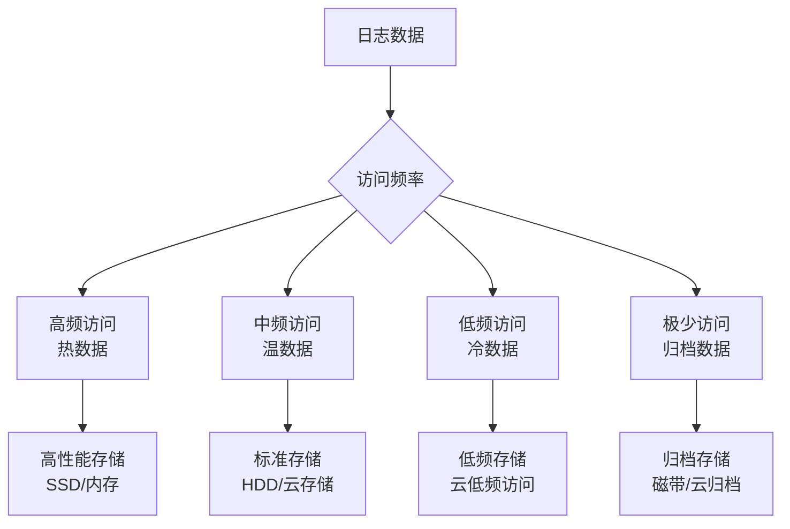

在企业级日志平台建设中，存储架构设计是确保系统高性能、高可用性和成本效益的核心环节。一个优秀的存储架构不仅能够满足实时查询和分析的需求，还能通过合理的分层策略有效控制存储成本。本文将深入探讨日志存储架构的设计原则、技术选型和最佳实践。

## 存储架构设计原则

### 1. 分层存储策略

分层存储是日志存储架构的核心设计原则，根据数据访问频率和重要性将日志数据存储在不同性能和成本的存储介质中。



### 2. 数据一致性保障

在分布式存储环境中，确保数据一致性是存储架构设计的重要考虑因素：

```java
// 数据一致性保障实现
public class ConsistentLogStorage {
    private final List<StorageBackend> backends;
    
    public ConsistentLogStorage(List<StorageBackend> backends) {
        this.backends = backends;
    }
    
    public void storeLog(LogEvent event) throws StorageException {
        List<CompletableFuture<Boolean>> futures = new ArrayList<>();
        
        // 并行写入多个存储后端
        for (StorageBackend backend : backends) {
            CompletableFuture<Boolean> future = CompletableFuture.supplyAsync(() -> {
                try {
                    backend.store(event);
                    return true;
                } catch (Exception e) {
                    logger.error("Failed to store log in " + backend.getName(), e);
                    return false;
                }
            });
            futures.add(future);
        }
        
        // 等待所有写入完成
        CompletableFuture<Void> allFutures = CompletableFuture.allOf(
            futures.toArray(new CompletableFuture[0])
        );
        
        try {
            allFutures.get(10, TimeUnit.SECONDS);
            
            // 检查写入结果
            long successCount = futures.stream()
                .map(CompletableFuture::join)
                .filter(Boolean::booleanValue)
                .count();
            
            // 确保大多数存储后端写入成功
            if (successCount < (backends.size() / 2 + 1)) {
                throw new StorageException("Failed to achieve quorum write");
            }
        } catch (Exception e) {
            throw new StorageException("Failed to store log consistently", e);
        }
    }
}
```

### 3. 可扩展性设计

存储架构需要具备良好的可扩展性，以应对不断增长的数据量和访问需求：

```yaml
# 可扩展性设计示例
storage_cluster:
  # 热数据集群
  hot_cluster:
    nodes:
      - host: es-hot-1
        port: 9200
        roles: [master, data_hot]
      - host: es-hot-2
        port: 9200
        roles: [data_hot]
      - host: es-hot-3
        port: 9200
        roles: [data_hot]
    
    scaling_policy:
      min_nodes: 3
      max_nodes: 10
      scale_up_threshold: 80%  # CPU/内存使用率超过80%时扩容
      scale_down_threshold: 30%  # 使用率低于30%时缩容
  
  # 温数据集群
  warm_cluster:
    nodes:
      - host: es-warm-1
        port: 9200
        roles: [data_warm]
      - host: es-warm-2
        port: 9200
        roles: [data_warm]
    
    scaling_policy:
      min_nodes: 2
      max_nodes: 5
      scale_up_threshold: 70%
      scale_down_threshold: 20%
```

## 热数据存储设计

热数据是指当前或近期频繁访问的日志数据，通常需要提供毫秒级的查询响应能力。

### Elasticsearch存储设计

Elasticsearch是热数据存储的首选方案，以下是其优化设计：

```json
// Elasticsearch热数据索引模板
{
  "index_patterns": ["logs-hot-*"],
  "settings": {
    "number_of_shards": 5,
    "number_of_replicas": 1,
    "refresh_interval": "30s",
    "translog": {
      "durability": "async",
      "sync_interval": "30s"
    },
    "merge": {
      "policy": {
        "max_merge_at_once": 10,
        "segments_per_tier": 10
      }
    },
    "blocks": {
      "read_only_allow_delete": "false"
    }
  },
  "mappings": {
    "properties": {
      "@timestamp": { 
        "type": "date",
        "format": "date_time"
      },
      "level": { 
        "type": "keyword"
      },
      "service": { 
        "type": "keyword" 
      },
      "host": { 
        "type": "keyword" 
      },
      "trace_id": { 
        "type": "keyword" 
      },
      "span_id": { 
        "type": "keyword" 
      },
      "user_id": { 
        "type": "keyword" 
      },
      "message": { 
        "type": "text",
        "analyzer": "standard"
      },
      "response_time": { 
        "type": "integer" 
      },
      "status_code": { 
        "type": "integer" 
      }
    }
  }
}
```

### 集群架构设计

```yaml
# Elasticsearch热数据集群架构
hot_cluster:
  # 主节点
  master_nodes:
    - name: es-master-1
      host: 10.0.1.10
      heap_size: 4g
      roles: [master]
    
    - name: es-master-2
      host: 10.0.1.11
      heap_size: 4g
      roles: [master]
    
    - name: es-master-3
      host: 10.0.1.12
      heap_size: 4g
      roles: [master]
  
  # 数据节点
  data_hot_nodes:
    - name: es-hot-1
      host: 10.0.2.10
      heap_size: 31g
      roles: [data_hot]
      storage: 2TB SSD
    
    - name: es-hot-2
      host: 10.0.2.11
      heap_size: 31g
      roles: [data_hot]
      storage: 2TB SSD
    
    - name: es-hot-3
      host: 10.0.2.12
      heap_size: 31g
      roles: [data_hot]
      storage: 2TB SSD
  
  # 协调节点
  coordinating_nodes:
    - name: es-coord-1
      host: 10.0.3.10
      heap_size: 8g
      roles: [ingest]
    
    - name: es-coord-2
      host: 10.0.3.11
      heap_size: 8g
      roles: [ingest]
```

### 性能优化配置

```json
// Elasticsearch性能优化配置
{
  "persistent": {
    "cluster": {
      "routing": {
        "allocation": {
          "node_concurrent_recoveries": 6,
          "cluster_concurrent_rebalance": 6
        }
      }
    },
    "indices": {
      "recovery": {
        "max_bytes_per_sec": "200mb"
      }
    },
    "thread_pool": {
      "write": {
        "size": 20,
        "queue_size": 1000
      },
      "search": {
        "size": 20,
        "queue_size": 1000
      }
    }
  }
}
```

## 温数据存储设计

温数据是指访问频率较低但仍需保留的日志数据，通常可以接受秒级到分钟级的查询响应时间。

### HDFS存储设计

HDFS适用于大规模数据存储和批处理分析：

```xml
<!-- HDFS配置优化 -->
<configuration>
  <!-- 数据块大小优化 -->
  <property>
    <name>dfs.blocksize</name>
    <value>134217728</value>  <!-- 128MB块大小 -->
  </property>
  
  <!-- 副本因子 -->
  <property>
    <name>dfs.replication</name>
    <value>2</value>
  </property>
  
  <!-- 数据节点心跳间隔 -->
  <property>
    <name>dfs.heartbeat.interval</name>
    <value>3</value>
  </property>
  
  <!-- 数据节点存储目录 -->
  <property>
    <name>dfs.datanode.data.dir</name>
    <value>/data/hdfs/data1,/data/hdfs/data2</value>
  </property>
</configuration>
```

### 对象存储设计

对象存储（如S3、OSS、COS）适用于云环境下的低成本存储：

```python
# 对象存储配置优化
class ObjectStorageConfig:
    def __init__(self):
        self.config = {
            'region': 'cn-north-1',
            'storage_class': 'STANDARD',  # 标准存储
            'multipart_threshold': 64 * 1024 * 1024,  # 64MB分片阈值
            'multipart_chunk_size': 16 * 1024 * 1024,  # 16MB分片大小
            'max_concurrency': 10,
            'use_threads': True
        }
    
    def get_s3_client(self):
        return boto3.client(
            's3',
            region_name=self.config['region'],
            config=Config(
                multipart_threshold=self.config['multipart_threshold'],
                multipart_chunk_size=self.config['multipart_chunk_size'],
                max_concurrency=self.config['max_concurrency'],
                use_threads=self.config['use_threads']
            )
        )

# 温数据存储实现
class WarmLogStorage:
    def __init__(self):
        self.s3_client = ObjectStorageConfig().get_s3_client()
        self.bucket_name = 'log-storage-warm'
    
    def store_logs(self, logs, date):
        """存储温日志数据"""
        # 将日志数据序列化为Parquet格式
        parquet_data = self.serialize_to_parquet(logs)
        
        # 上传到对象存储
        key = f"logs/warm/{date.strftime('%Y/%m/%d')}/logs.parquet"
        self.s3_client.put_object(
            Bucket=self.bucket_name,
            Key=key,
            Body=parquet_data,
            StorageClass='STANDARD_IA'  # 低频访问存储
        )
```

## 冷数据存储设计

冷数据是指很少被访问但因业务需求必须保留的日志数据。

### 低频访问存储设计

```python
# 冷数据存储实现
class ColdLogStorage:
    def __init__(self):
        self.s3_client = boto3.client('s3')
        self.bucket_name = 'log-storage-cold'
    
    def archive_logs(self, logs, date):
        """归档冷日志数据"""
        # 压缩日志数据
        compressed_data = self.compress_logs(logs)
        
        # 上传到低频访问存储
        key = f"logs/cold/{date.strftime('%Y/%m/%d')}/logs.gz"
        self.s3_client.put_object(
            Bucket=self.bucket_name,
            Key=key,
            Body=compressed_data,
            StorageClass='STANDARD_IA'
        )
    
    def compress_logs(self, logs):
        """压缩日志数据"""
        json_data = json.dumps(logs)
        compressed_data = gzip.compress(json_data.encode('utf-8'))
        return compressed_data
```

## 归档数据存储设计

归档数据是指很少被访问但因合规或法律要求必须长期保存的日志数据。

### 归档存储设计

```python
# 归档数据存储实现
class ArchiveLogStorage:
    def __init__(self):
        self.s3_client = boto3.client('s3')
        self.bucket_name = 'log-storage-archive'
    
    def store_archive_logs(self, logs, date):
        """存储归档日志数据"""
        # 创建归档文件
        archive_data = self.create_archive(logs)
        
        # 上传到归档存储
        key = f"logs/archive/{date.strftime('%Y/%m')}/logs.tar.gz"
        self.s3_client.put_object(
            Bucket=self.bucket_name,
            Key=key,
            Body=archive_data,
            StorageClass='GLACIER'
        )
    
    def create_archive(self, logs):
        """创建归档文件"""
        # 将日志数据写入临时文件
        with tempfile.NamedTemporaryFile(mode='w', suffix='.json', delete=False) as temp_file:
            json.dump(logs, temp_file)
            temp_file_path = temp_file.name
        
        # 创建tar.gz归档文件
        archive_path = temp_file_path + '.tar.gz'
        with tarfile.open(archive_path, 'w:gz') as tar:
            tar.add(temp_file_path, arcname='logs.json')
        
        # 读取归档文件内容
        with open(archive_path, 'rb') as f:
            archive_data = f.read()
        
        # 清理临时文件
        os.remove(temp_file_path)
        os.remove(archive_path)
        
        return archive_data
    
    def restore_archive_logs(self, key):
        """恢复归档日志数据"""
        # 发起恢复请求
        self.s3_client.restore_object(
            Bucket=self.bucket_name,
            Key=key,
            RestoreRequest={
                'Days': 7,
                'GlacierJobParameters': {
                    'Tier': 'Standard'
                }
            }
        )
```

## 存储架构监控与优化

### 性能监控

```python
# 存储性能监控
class StoragePerformanceMonitor:
    def __init__(self):
        self.metrics = {
            'hot_cluster_cpu': 0,
            'hot_cluster_memory': 0,
            'hot_cluster_disk_io': 0,
            'warm_storage_usage': 0,
            'cold_storage_usage': 0
        }
    
    def collect_elasticsearch_metrics(self, es_client):
        """收集Elasticsearch集群指标"""
        try:
            # 获取集群健康状态
            health = es_client.cluster.health()
            
            # 获取节点统计信息
            stats = es_client.nodes.stats()
            
            # 提取关键指标
            self.metrics['hot_cluster_cpu'] = self.extract_cpu_usage(stats)
            self.metrics['hot_cluster_memory'] = self.extract_memory_usage(stats)
            self.metrics['hot_cluster_disk_io'] = self.extract_disk_io(stats)
            
        except Exception as e:
            logger.error("Failed to collect Elasticsearch metrics", e)
    
    def collect_object_storage_metrics(self, s3_client, bucket_name):
        """收集对象存储指标"""
        try:
            # 获取存储桶大小
            total_size = 0
            paginator = s3_client.get_paginator('list_objects_v2')
            for page in paginator.paginate(Bucket=bucket_name):
                if 'Contents' in page:
                    for obj in page['Contents']:
                        total_size += obj['Size']
            
            self.metrics['warm_storage_usage'] = total_size
            
        except Exception as e:
            logger.error("Failed to collect object storage metrics", e)
```

### 自动化运维

```python
# 存储自动化运维
class StorageAutomation:
    def __init__(self):
        self.es_client = Elasticsearch(['localhost:9200'])
        self.s3_client = boto3.client('s3')
    
    def auto_scale_cluster(self):
        """自动扩缩容集群"""
        # 检查集群负载
        cpu_usage = self.get_cluster_cpu_usage()
        memory_usage = self.get_cluster_memory_usage()
        
        if cpu_usage > 80 or memory_usage > 80:
            # 扩容
            self.scale_up_cluster()
        elif cpu_usage < 30 and memory_usage < 30:
            # 缩容
            self.scale_down_cluster()
    
    def optimize_indices(self):
        """优化索引"""
        # 获取需要优化的索引
        indices = self.get_indices_for_optimization()
        
        for index in indices:
            try:
                # 强制合并段
                self.es_client.indices.forcemerge(
                    index=index,
                    max_num_segments=1
                )
                
                # 刷新索引
                self.es_client.indices.refresh(index=index)
                
            except Exception as e:
                logger.error(f"Failed to optimize index {index}", e)
```

## 最佳实践总结

### 1. 存储架构设计原则

```yaml
# 存储架构设计原则
storage_design_principles:
  # 分层存储
  tiered_storage:
    hot_data:
      retention: 7d
      storage: elasticsearch_ssd
      replicas: 2
    
    warm_data:
      retention: 30d
      storage: s3_standard
      replicas: 1
    
    cold_data:
      retention: 365d
      storage: s3_standard_ia
      replicas: 1
    
    archive_data:
      retention: 7y
      storage: s3_glacier
      replicas: 1
  
  # 性能优化
  performance_optimization:
    indexing:
      refresh_interval: 30s
      translog_sync: async
    
    querying:
      cache_enabled: true
      field_data_cache: 20%
      query_cache: 10%
    
    networking:
      http_compression: true
      tcp_no_delay: true
```

### 2. 成本优化策略

```bash
# 成本优化措施
# 1. 合理设置数据保留期限
# 2. 使用压缩技术减少存储空间
# 3. 实施分层存储策略
# 4. 定期清理无用数据
# 5. 监控存储成本并优化
```

### 3. 可靠性保障措施

```java
// 可靠性保障实现
public class StorageReliability {
    private final List<StorageBackend> backends;
    private final ScheduledExecutorService healthChecker;
    
    public StorageReliability(List<StorageBackend> backends) {
        this.backends = backends;
        this.healthChecker = Executors.newScheduledThreadPool(2);
        
        // 启动健康检查
        startHealthChecks();
    }
    
    private void startHealthChecks() {
        healthChecker.scheduleWithFixedDelay(() -> {
            for (StorageBackend backend : backends) {
                try {
                    if (!backend.isHealthy()) {
                        handleUnhealthyBackend(backend);
                    }
                } catch (Exception e) {
                    logger.error("Health check failed for " + backend.getName(), e);
                }
            }
        }, 0, 30, TimeUnit.SECONDS);
    }
    
    private void handleUnhealthyBackend(StorageBackend backend) {
        logger.warn("Backend {} is unhealthy, initiating failover", backend.getName());
        
        // 实施故障转移
        failoverToHealthyBackend(backend);
        
        // 发送告警
        alertManager.sendAlert("Storage backend unhealthy: " + backend.getName());
    }
}
```

## 总结

日志存储架构设计是构建高性能、可扩展日志平台的关键环节。通过合理应用分层存储策略、优化存储技术选型、实施自动化运维和监控告警机制，我们可以构建一个既满足业务需求又具有良好成本效益的存储架构。

关键要点包括：

1. **分层存储设计**：根据数据访问频率设计热、温、冷、归档四层存储
2. **技术选型优化**：针对不同存储层选择合适的存储技术
3. **性能调优**：通过合理的配置和优化提升存储性能
4. **可靠性保障**：实施数据复制、备份和故障转移机制
5. **自动化运维**：通过自动化工具提升运维效率

在实际应用中，需要根据具体的业务场景、数据特征和技术栈来设计和优化存储架构，确保其能够满足系统的性能、可靠性和成本要求。