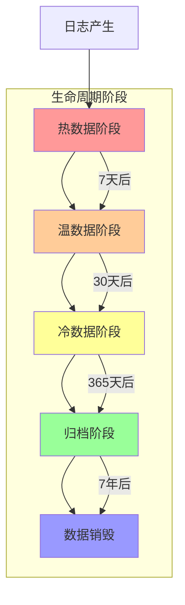

在企业级日志平台建设中，日志归档与生命周期管理是确保数据长期可用、成本优化和合规满足的关键环节。随着日志数据量的快速增长，如何自动化管理数据的存储、迁移和清理，成为日志平台运维的重要挑战。本文将深入探讨日志归档与生命周期管理的核心概念、技术实现和最佳实践。

## 日志生命周期管理概述

日志生命周期管理是指根据业务需求、访问频率和合规要求，对日志数据从产生到销毁的全过程进行自动化管理。通过科学的生命周期策略，我们可以在满足业务需求的同时，最大化存储资源的利用效率并控制成本。

### 生命周期阶段划分



### 各阶段特征分析

#### 热数据阶段（Hot Data Phase）

- **时间范围**：最近7天
- **访问频率**：高频率实时访问
- **存储要求**：毫秒级查询响应
- **存储介质**：高性能SSD存储
- **典型应用**：实时监控、告警、问题排查

#### 温数据阶段（Warm Data Phase）

- **时间范围**：8天-30天
- **访问频率**：中等频率访问
- **存储要求**：秒级到分钟级查询响应
- **存储介质**：标准HDD或云存储
- **典型应用**：历史数据分析、业务报表

#### 冷数据阶段（Cold Data Phase）

- **时间范围**：31天-365天
- **访问频率**：低频率访问
- **存储要求**：分钟级到小时级查询响应
- **存储介质**：低频访问存储
- **典型应用**：合规审计、长期趋势分析

#### 归档阶段（Archive Phase）

- **时间范围**：1-7年或更长
- **访问频率**：极少访问
- **存储要求**：小时级到天级查询响应
- **存储介质**：归档存储或磁带库
- **典型应用**：法律诉讼、长期合规要求

## TTL与自动清理机制

TTL（Time To Live）是日志生命周期管理的核心机制，通过设置数据的生存时间来实现自动清理。

### Elasticsearch TTL实现

```json
// Elasticsearch索引生命周期策略
{
  "policy": {
    "phases": {
      "hot": {
        "min_age": "0ms",
        "actions": {
          "rollover": {
            "max_age": "1d",
            "max_size": "50gb",
            "max_docs": 10000000
          },
          "set_priority": {
            "priority": 100
          }
        }
      },
      "warm": {
        "min_age": "7d",
        "actions": {
          "forcemerge": {
            "max_num_segments": 1
          },
          "allocate": {
            "number_of_replicas": 1,
            "include": {
              "box_type": "warm"
            }
          }
        }
      },
      "cold": {
        "min_age": "30d",
        "actions": {
          "freeze": {}
        }
      },
      "delete": {
        "min_age": "365d",
        "actions": {
          "delete": {}
        }
      }
    }
  }
}
```

### 自动清理实现

```java
// 基于时间的自动清理机制
public class TimeBasedLogCleaner {
    private final StorageBackend storageBackend;
    private final ScheduledExecutorService scheduler;
    
    public TimeBasedLogCleaner(StorageBackend storageBackend) {
        this.storageBackend = storageBackend;
        this.scheduler = Executors.newScheduledThreadPool(2);
        
        // 启动定期清理任务
        startCleanupScheduler();
    }
    
    private void startCleanupScheduler() {
        scheduler.scheduleWithFixedDelay(() -> {
            try {
                cleanupExpiredLogs();
            } catch (Exception e) {
                logger.error("Failed to cleanup expired logs", e);
            }
        }, 0, 1, TimeUnit.HOURS);  // 每小时执行一次
    }
    
    private void cleanupExpiredLogs() {
        // 计算过期时间点
        LocalDateTime expireTime = LocalDateTime.now().minusDays(365);
        
        // 查询过期的日志索引
        List<String> expiredIndices = storageBackend.findIndicesOlderThan(expireTime);
        
        // 删除过期索引
        for (String index : expiredIndices) {
            try {
                storageBackend.deleteIndex(index);
                logger.info("Deleted expired index: {}", index);
            } catch (Exception e) {
                logger.error("Failed to delete index: {}", index, e);
            }
        }
    }
}
```

### 对象存储TTL管理

```python
# 对象存储生命周期管理
class ObjectStorageLifecycleManager:
    def __init__(self, bucket_name):
        self.s3_client = boto3.client('s3')
        self.bucket_name = bucket_name
    
    def configure_lifecycle_policy(self):
        """配置对象存储生命周期策略"""
        lifecycle_config = {
            'Rules': [
                {
                    'ID': 'MoveToStandardIA',
                    'Status': 'Enabled',
                    'Filter': {
                        'Prefix': 'logs/warm/'
                    },
                    'Transitions': [
                        {
                            'Days': 30,
                            'StorageClass': 'STANDARD_IA'
                        }
                    ]
                },
                {
                    'ID': 'MoveToGlacier',
                    'Status': 'Enabled',
                    'Filter': {
                        'Prefix': 'logs/cold/'
                    },
                    'Transitions': [
                        {
                            'Days': 365,
                            'StorageClass': 'GLACIER'
                        }
                    ]
                },
                {
                    'ID': 'DeleteOldLogs',
                    'Status': 'Enabled',
                    'Filter': {
                        'Prefix': 'logs/archive/'
                    },
                    'Expiration': {
                        'Days': 2555  # 7年
                    }
                }
            ]
        }
        
        self.s3_client.put_bucket_lifecycle_configuration(
            Bucket=self.bucket_name,
            LifecycleConfiguration=lifecycle_config
        )
```

## 归档策略设计

归档策略是日志生命周期管理的重要组成部分，它决定了数据如何从活跃存储迁移到长期存储。

### 冷热分离策略

```yaml
# 冷热分离策略配置
archiving_strategy:
  hot_to_warm:
    trigger: 
      age: 7d
      size: 50gb
    action:
      move_to: s3_standard
      compress: true
      encrypt: true
  
  warm_to_cold:
    trigger:
      age: 30d
    action:
      move_to: s3_standard_ia
      compress: true
  
  cold_to_archive:
    trigger:
      age: 365d
    action:
      move_to: s3_glacier
      compress: true
      create_inventory: true
```

### 近线存储策略

```python
# 近线存储实现
class NearlineStorageManager:
    def __init__(self):
        self.es_client = Elasticsearch(['localhost:9200'])
        self.s3_client = boto3.client('s3')
        self.nearline_bucket = 'log-storage-nearline'
    
    def move_to_nearline(self, index_name):
        """将索引迁移到近线存储"""
        try:
            # 1. 导出索引数据
            data = self.export_index_data(index_name)
            
            # 2. 压缩数据
            compressed_data = self.compress_data(data)
            
            # 3. 上传到近线存储
            key = f"nearline/{index_name}.gz"
            self.s3_client.put_object(
                Bucket=self.nearline_bucket,
                Key=key,
                Body=compressed_data
            )
            
            # 4. 在Elasticsearch中删除索引
            self.es_client.indices.delete(index=index_name)
            
            # 5. 记录迁移日志
            self.log_migration(index_name, key)
            
        except Exception as e:
            logger.error(f"Failed to move index {index_name} to nearline storage", e)
            raise
    
    def restore_from_nearline(self, index_name):
        """从近线存储恢复索引"""
        try:
            # 1. 构造对象键
            key = f"nearline/{index_name}.gz"
            
            # 2. 从近线存储下载数据
            response = self.s3_client.get_object(
                Bucket=self.nearline_bucket,
                Key=key
            )
            compressed_data = response['Body'].read()
            
            # 3. 解压缩数据
            data = self.decompress_data(compressed_data)
            
            # 4. 导入到Elasticsearch
            self.import_index_data(index_name, data)
            
            # 5. 删除近线存储中的对象
            self.s3_client.delete_object(
                Bucket=self.nearline_bucket,
                Key=key
            )
            
        except Exception as e:
            logger.error(f"Failed to restore index {index_name} from nearline storage", e)
            raise
```

### 离线存储策略

```python
# 离线存储实现
class OfflineStorageManager:
    def __init__(self):
        self.s3_client = boto3.client('s3')
        self.glacier_vault = 'log-archive-vault'
    
    def archive_to_offline(self, log_data, archive_date):
        """归档到离线存储"""
        try:
            # 1. 创建归档文件
            archive_file = self.create_archive_file(log_data, archive_date)
            
            # 2. 上传到Glacier
            archive_response = self.s3_client.upload_archive(
                vaultName=self.glacier_vault,
                body=archive_file
            )
            
            # 3. 保存归档ID
            archive_id = archive_response['archiveId']
            self.save_archive_metadata(archive_date, archive_id)
            
            return archive_id
            
        except Exception as e:
            logger.error("Failed to archive to offline storage", e)
            raise
    
    def retrieve_from_offline(self, archive_id):
        """从离线存储检索"""
        try:
            # 1. 发起检索请求
            job_response = self.s3_client.initiate_job(
                vaultName=self.glacier_vault,
                jobParameters={
                    'JobType': 'archive-retrieval',
                    'ArchiveId': archive_id,
                    'Tier': 'Standard'
                }
            )
            
            # 2. 等待作业完成
            job_id = job_response['jobId']
            self.wait_for_job_completion(job_id)
            
            # 3. 获取检索结果
            output_response = self.s3_client.get_job_output(
                vaultName=self.glacier_vault,
                jobId=job_id
            )
            
            return output_response['body'].read()
            
        except Exception as e:
            logger.error("Failed to retrieve from offline storage", e)
            raise
```

## 合规与审计需求下的存档

在金融、医疗、政府等行业，日志数据的存档需要满足严格的合规要求和审计需求。

### GDPR合规存档

```java
// GDPR合规日志存档实现
public class GDPRCompliantArchiver {
    private final StorageBackend storageBackend;
    private final EncryptionService encryptionService;
    private final AuditLogger auditLogger;
    
    public GDPRCompliantArchiver(StorageBackend storageBackend, 
                                EncryptionService encryptionService) {
        this.storageBackend = storageBackend;
        this.encryptionService = encryptionService;
        this.auditLogger = new AuditLogger();
    }
    
    public void archiveGDPRLogs(List<LogEvent> logs, LocalDateTime archiveDate) 
            throws ArchiveException {
        try {
            // 1. 数据脱敏处理
            List<LogEvent> desensitizedLogs = desensitizeLogs(logs);
            
            // 2. 数据加密
            byte[] encryptedData = encryptionService.encrypt(
                serializeLogs(desensitizedLogs)
            );
            
            // 3. 创建完整性哈希
            String integrityHash = createIntegrityHash(encryptedData);
            
            // 4. 存储到合规存储
            String archiveId = storageBackend.storeCompliantArchive(
                encryptedData, 
                archiveDate, 
                integrityHash
            );
            
            // 5. 记录审计日志
            auditLogger.logArchiveOperation(
                "GDPR_COMPLIANT_ARCHIVE",
                archiveId,
                archiveDate,
                logs.size()
            );
            
        } catch (Exception e) {
            auditLogger.logArchiveFailure(
                "GDPR_COMPLIANT_ARCHIVE",
                archiveDate,
                e.getMessage()
            );
            throw new ArchiveException("Failed to archive GDPR compliant logs", e);
        }
    }
    
    private List<LogEvent> desensitizeLogs(List<LogEvent> logs) {
        return logs.stream()
            .map(this::desensitizeLog)
            .collect(Collectors.toList());
    }
    
    private LogEvent desensitizeLog(LogEvent log) {
        // 移除或脱敏个人身份信息
        LogEvent desensitized = log.clone();
        desensitized.removeField("personal_data");
        desensitized.maskField("user_id", "***");
        return desensitized;
    }
}
```

### SOX合规存档

```python
# SOX合规日志存档实现
class SOXCompliantArchiver:
    def __init__(self):
        self.s3_client = boto3.client('s3')
        self.archive_bucket = 'sox-compliant-logs'
        self.audit_trail = AuditTrail()
    
    def archive_sox_logs(self, logs, period):
        """SOX合规日志归档"""
        try:
            # 1. 数据完整性保护
            integrity_protected_logs = self.protect_integrity(logs)
            
            # 2. 创建数字签名
            digital_signature = self.create_digital_signature(integrity_protected_logs)
            
            # 3. 打包归档数据
            archive_package = self.create_archive_package(
                integrity_protected_logs, 
                digital_signature
            )
            
            # 4. 上传到合规存储
            archive_key = f"sox/{period.strftime('%Y/%m')}/logs.zip"
            self.s3_client.put_object(
                Bucket=self.archive_bucket,
                Key=archive_key,
                Body=archive_package,
                Metadata={
                    'compliance-level': 'SOX',
                    'integrity-hash': digital_signature,
                    'archive-period': period.strftime('%Y-%m')
                }
            )
            
            # 5. 记录审计轨迹
            self.audit_trail.log_archive_operation(
                archive_key=archive_key,
                period=period,
                log_count=len(logs),
                signature=digital_signature
            )
            
        except Exception as e:
            self.audit_trail.log_archive_failure(
                period=period,
                error=str(e)
            )
            raise
    
    def protect_integrity(self, logs):
        """保护数据完整性"""
        # 添加时间戳和序列号
        for i, log in enumerate(logs):
            log['sequence_number'] = i
            log['archive_timestamp'] = datetime.utcnow().isoformat()
        return logs
    
    def create_digital_signature(self, logs):
        """创建数字签名"""
        logs_json = json.dumps(logs, sort_keys=True)
        signature = hmac.new(
            key=os.environ['ARCHIVE_SIGNING_KEY'].encode(),
            msg=logs_json.encode(),
            digestmod=hashlib.sha256
        ).hexdigest()
        return signature
```

## 自动化生命周期管理

### 生命周期管理器实现

```java
// 生命周期管理器
public class LogLifecycleManager {
    private final Map<String, StorageTier> storageTiers;
    private final ScheduledExecutorService scheduler;
    
    public LogLifecycleManager() {
        this.storageTiers = initializeStorageTiers();
        this.scheduler = Executors.newScheduledThreadPool(4);
        
        // 启动生命周期管理任务
        startLifecycleManagement();
    }
    
    private Map<String, StorageTier> initializeStorageTiers() {
        Map<String, StorageTier> tiers = new HashMap<>();
        tiers.put("hot", new HotStorageTier());
        tiers.put("warm", new WarmStorageTier());
        tiers.put("cold", new ColdStorageTier());
        tiers.put("archive", new ArchiveStorageTier());
        return tiers;
    }
    
    private void startLifecycleManagement() {
        // 每天检查一次生命周期
        scheduler.scheduleWithFixedDelay(
            this::manageLifecycle,
            0, 24, TimeUnit.HOURS
        );
    }
    
    private void manageLifecycle() {
        try {
            // 1. 检查热数据迁移
            migrateHotToWarm();
            
            // 2. 检查温数据迁移
            migrateWarmToCold();
            
            // 3. 检查冷数据归档
            archiveColdData();
            
            // 4. 清理过期数据
            cleanupExpiredData();
            
        } catch (Exception e) {
            logger.error("Failed to manage log lifecycle", e);
        }
    }
    
    private void migrateHotToWarm() {
        StorageTier hotTier = storageTiers.get("hot");
        StorageTier warmTier = storageTiers.get("warm");
        
        List<DataSegment> eligibleSegments = hotTier.findSegmentsOlderThan(
            Duration.ofDays(7)
        );
        
        for (DataSegment segment : eligibleSegments) {
            try {
                // 迁移数据
                warmTier.store(segment);
                hotTier.delete(segment.getId());
                
                logger.info("Migrated segment {} from hot to warm storage", segment.getId());
            } catch (Exception e) {
                logger.error("Failed to migrate segment {}", segment.getId(), e);
            }
        }
    }
}
```

### 智能生命周期策略

```python
# 智能生命周期策略
class IntelligentLifecycleManager:
    def __init__(self):
        self.ml_model = self.load_prediction_model()
        self.storage_tiers = self.initialize_storage_tiers()
    
    def predict_access_pattern(self, log_type, time_period):
        """预测日志访问模式"""
        features = self.extract_features(log_type, time_period)
        return self.ml_model.predict(features)
    
    def optimize_lifecycle_policy(self):
        """优化生命周期策略"""
        for log_type in self.get_log_types():
            # 预测未来访问模式
            access_pattern = self.predict_access_pattern(log_type, 'next_30_days')
            
            # 根据预测结果调整生命周期策略
            if access_pattern['access_frequency'] < 0.1:
                # 低访问频率，提前迁移到冷存储
                self.adjust_migration_threshold(log_type, days=15)
            elif access_pattern['access_frequency'] > 0.8:
                // 高访问频率，延长热存储时间
                self.adjust_migration_threshold(log_type, days=14)
```

## 监控与告警

### 生命周期监控

```python
# 生命周期监控实现
class LifecycleMonitor:
    def __init__(self):
        self.metrics = MetricsClient()
        self.alert_manager = AlertManager()
    
    def monitor_lifecycle_operations(self):
        """监控生命周期操作"""
        # 监控迁移操作
        migration_metrics = self.metrics.get_migration_metrics()
        if migration_metrics['failure_rate'] > 0.05:
            self.alert_manager.send_alert(
                "High migration failure rate detected",
                severity="WARNING"
            )
        
        # 监控存储使用情况
        storage_metrics = self.metrics.get_storage_usage()
        for tier, usage in storage_metrics.items():
            if usage > 0.9:
                self.alert_manager.send_alert(
                    f"Storage usage for {tier} tier exceeded 90%",
                    severity="CRITICAL"
                )
    
    def generate_lifecycle_report(self):
        """生成生命周期报告"""
        report = {
            'report_time': datetime.now().isoformat(),
            'storage_tier_usage': self.metrics.get_storage_usage(),
            'migration_statistics': self.metrics.get_migration_stats(),
            'archive_status': self.metrics.get_archive_status(),
            'cleanup_summary': self.metrics.get_cleanup_summary()
        }
        
        return report
```

### 合规审计监控

```java
// 合规审计监控
public class ComplianceAuditMonitor {
    private final AuditTrail auditTrail;
    private final ComplianceChecker complianceChecker;
    
    public ComplianceAuditMonitor(AuditTrail auditTrail) {
        this.auditTrail = auditTrail;
        this.complianceChecker = new ComplianceChecker();
    }
    
    public void performComplianceAudit() {
        try {
            // 1. 检查数据完整性
            List<AuditRecord> records = auditTrail.getRecentRecords(Duration.ofDays(1));
            for (AuditRecord record : records) {
                if (!complianceChecker.verifyIntegrity(record)) {
                    alertComplianceViolation(record);
                }
            }
            
            // 2. 检查数据保留策略
            List<ArchivedData> archivedData = getArchivedData();
            for (ArchivedData data : archivedData) {
                if (!complianceChecker.verifyRetentionPeriod(data)) {
                    alertRetentionViolation(data);
                }
            }
            
        } catch (Exception e) {
            logger.error("Failed to perform compliance audit", e);
        }
    }
    
    private void alertComplianceViolation(AuditRecord record) {
        Alert alert = Alert.builder()
            .type("COMPLIANCE_VIOLATION")
            .severity(Alert.Severity.CRITICAL)
            .message("Data integrity violation detected")
            .details(Map.of(
                "record_id", record.getId(),
                "timestamp", record.getTimestamp().toString()
            ))
            .build();
        
        alertManager.sendAlert(alert);
    }
}
```

## 最佳实践总结

### 1. 生命周期策略配置

```yaml
# 生命周期策略最佳实践
lifecycle_policy_best_practices:
  hot_data:
    retention_period: 7d
    storage_tier: ssd
    access_pattern: frequent
    backup_frequency: hourly
  
  warm_data:
    retention_period: 30d
    storage_tier: hdd
    access_pattern: occasional
    backup_frequency: daily
  
  cold_data:
    retention_period: 365d
    storage_tier: low_cost
    access_pattern: rare
    backup_frequency: weekly
  
  archive_data:
    retention_period: 2555d  # 7年
    storage_tier: archival
    access_pattern: very_rare
    backup_frequency: monthly
```

### 2. 自动化管理建议

```bash
# 自动化管理最佳实践
# 1. 定期执行生命周期检查
# 2. 实施智能预测和优化
# 3. 建立完善的监控告警机制
# 4. 定期生成合规审计报告
# 5. 实施故障恢复和数据修复机制
```

### 3. 合规性保障措施

```java
// 合规性保障实现
public class ComplianceGuarantee {
    public void ensureCompliance() {
        // 1. 数据加密存储
        // 2. 完整性保护
        // 3. 访问控制
        // 4. 审计日志记录
        // 5. 定期合规检查
    }
}
```

## 总结

日志归档与生命周期管理是构建企业级日志平台的重要组成部分。通过科学的生命周期策略、自动化的管理机制和严格的合规保障，我们可以实现日志数据的高效管理、成本控制和合规满足。

关键要点包括：

1. **分层管理**：根据访问频率将数据分为热、温、冷、归档四个层次
2. **自动化策略**：实施基于时间、大小和访问模式的自动迁移策略
3. **合规保障**：满足GDPR、SOX等法规要求的数据保护和审计需求
4. **智能优化**：利用机器学习预测访问模式，优化生命周期策略
5. **监控告警**：建立完善的监控体系，及时发现和处理问题

在实际应用中，需要根据具体的业务需求、合规要求和技术架构来设计和实施生命周期管理策略，确保其能够满足系统的性能、成本和合规要求。