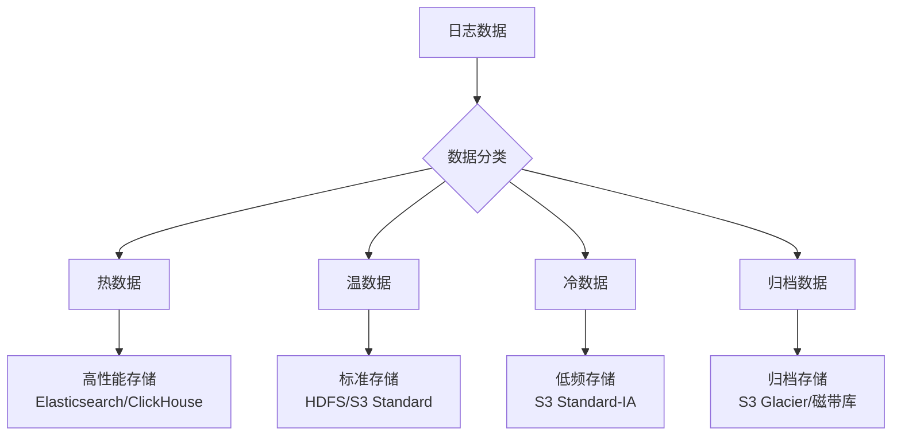

在企业级日志平台建设中，日志存储与归档是确保日志数据长期可用、高效查询和成本优化的关键环节。随着系统规模的不断扩大和日志数据量的快速增长，如何设计一个既能满足实时查询需求又能控制存储成本的分层存储架构，成为日志平台建设中的核心挑战。本文将全面介绍日志存储与归档的核心概念、技术架构和最佳实践。

## 日志存储与归档的重要性

日志存储与归档系统是日志平台的数据持久化层，负责安全、高效地保存日志数据，并提供不同时间跨度的数据访问能力。一个设计良好的存储与归档系统不仅能够确保日志数据的完整性和可用性，还能显著降低存储成本并提升查询性能。

### 核心价值

1. **数据持久化保障**：确保日志数据长期安全存储
2. **查询性能优化**：提供高效的日志查询和分析能力
3. **成本控制优化**：通过分层存储降低存储成本
4. **合规性满足**：满足法规要求的数据保留期限
5. **可扩展性支持**：支持大规模日志数据的存储需求

### 技术挑战

日志存储与归档面临的主要技术挑战包括：

- **海量数据存储**：应对PB级日志数据的存储需求
- **查询性能平衡**：在存储成本和查询性能之间找到平衡点
- **数据一致性**：确保分布式存储环境下的数据一致性
- **故障恢复**：在系统故障时能够快速恢复数据
- **生命周期管理**：实现自动化数据生命周期管理

## 日志存储架构设计

现代日志存储系统通常采用分层架构设计，根据数据访问频率和重要性将日志数据存储在不同性能和成本的存储介质中。

### 分层存储架构



### 热数据存储

热数据是指当前或近期频繁访问的日志数据，通常需要提供毫秒级的查询响应能力。

#### Elasticsearch存储

Elasticsearch是热数据存储的首选方案，具有以下特点：

- **全文搜索**：支持复杂的全文搜索和过滤
- **实时分析**：提供实时的数据分析能力
- **水平扩展**：支持集群水平扩展
- **生态丰富**：与Kibana等工具无缝集成

```json
// Elasticsearch索引配置示例
{
  "settings": {
    "number_of_shards": 5,
    "number_of_replicas": 1,
    "refresh_interval": "30s",
    "translog.durability": "async",
    "translog.sync_interval": "30s"
  },
  "mappings": {
    "properties": {
      "@timestamp": { "type": "date" },
      "level": { "type": "keyword" },
      "service": { "type": "keyword" },
      "host": { "type": "keyword" },
      "message": { "type": "text" },
      "trace_id": { "type": "keyword" }
    }
  }
}
```

#### ClickHouse存储

ClickHouse适用于大规模数据分析场景，具有以下特点：

- **列式存储**：优化分析查询性能
- **高压缩比**：显著降低存储空间占用
- **向量化执行**：提供极高的查询性能
- **分布式架构**：支持大规模集群部署

```sql
-- ClickHouse表结构示例
CREATE TABLE logs_hot (
    timestamp DateTime64(3),
    level String,
    service String,
    host String,
    message String,
    trace_id String,
    user_id String,
    response_time UInt32
) ENGINE = MergeTree()
PARTITION BY toYYYYMMDD(timestamp)
ORDER BY (timestamp, service, level)
SETTINGS index_granularity = 8192;
```

### 温数据存储

温数据是指访问频率较低但仍需保留的日志数据，通常可以接受秒级到分钟级的查询响应时间。

#### HDFS存储

HDFS适用于大规模数据存储和批处理分析：

```bash
# HDFS存储命令示例
hdfs dfs -mkdir /logs/warm/
hdfs dfs -put warm-logs-2025-09-01.json /logs/warm/
```

#### 对象存储

对象存储（如S3、OSS、COS）适用于云环境下的低成本存储：

```python
import boto3

# 将温日志上传到S3标准存储
s3_client = boto3.client('s3')
s3_client.upload_file(
    'warm-logs-2025-09-01.json', 
    'log-storage-bucket', 
    'warm/warm-logs-2025-09-01.json',
    ExtraArgs={
        'StorageClass': 'STANDARD'  # 标准存储
    }
)
```

### 冷数据存储

冷数据是指很少被访问但因业务需求必须保留的日志数据。

#### 低频访问存储

```python
# 将冷日志上传到S3低频访问存储
s3_client.upload_file(
    'cold-logs-2025-09-01.json', 
    'log-storage-bucket', 
    'cold/cold-logs-2025-09-01.json',
    ExtraArgs={
        'StorageClass': 'STANDARD_IA'  # 低频访问存储
    }
)
```

### 归档数据存储

归档数据是指很少被访问但因合规或法律要求必须长期保存的日志数据。

#### 归档存储

```python
# 将归档日志上传到Amazon Glacier
s3_client.upload_file(
    'archive-logs-2025-01-01.tar.gz',
    'log-storage-bucket',
    'archive/archive-logs-2025-01-01.tar.gz',
    ExtraArgs={
        'StorageClass': 'GLACIER'  # 归档存储
    }
)
```

## 存储策略与生命周期管理

### 生命周期管理策略

```yaml
# Elasticsearch索引生命周期管理策略
{
  "policy": {
    "phases": {
      "hot": {
        "actions": {
          "rollover": {
            "max_age": "1d",
            "max_size": "50gb",
            "max_docs": 10000000
          },
          "set_priority": {
            "priority": 100
          }
        }
      },
      "warm": {
        "min_age": "7d",
        "actions": {
          "forcemerge": {
            "max_num_segments": 1
          },
          "allocate": {
            "number_of_replicas": 1,
            "include": {
              "box_type": "warm"
            }
          }
        }
      },
      "cold": {
        "min_age": "30d",
        "actions": {
          "freeze": {}
        }
      },
      "delete": {
        "min_age": "365d",
        "actions": {
          "delete": {}
        }
      }
    }
  }
}
```

### 自动化迁移流程

```python
# 日志生命周期自动化管理
class LogLifecycleManager:
    def __init__(self):
        self.phases = ['hot', 'warm', 'cold', 'delete']
        self.phase_durations = {
            'hot': timedelta(days=7),
            'warm': timedelta(days=30),
            'cold': timedelta(days=365),
            'delete': timedelta(days=1095)
        }
    
    def manage_lifecycle(self):
        """管理日志的完整生命周期"""
        now = datetime.now()
        
        # 处理热日志迁移
        hot_logs = self.get_logs_in_phase('hot')
        for log in hot_logs:
            if now - log.created_time > self.phase_durations['hot']:
                self.migrate_to_phase(log, 'warm')
        
        # 处理温日志迁移
        warm_logs = self.get_logs_in_phase('warm')
        for log in warm_logs:
            if now - log.created_time > self.phase_durations['warm']:
                self.migrate_to_phase(log, 'cold')
        
        # 处理冷日志归档
        cold_logs = self.get_logs_in_phase('cold')
        for log in cold_logs:
            if now - log.created_time > self.phase_durations['cold']:
                self.archive_log(log)
        
        # 处理过期日志删除
        archived_logs = self.get_archived_logs()
        for log in archived_logs:
            if now - log.created_time > self.phase_durations['delete']:
                self.delete_log(log)
```

## 数据一致性与可靠性保障

### 数据复制策略

```json
// Elasticsearch副本配置
{
  "settings": {
    "number_of_shards": 5,
    "number_of_replicas": 2,  // 2个副本
    "refresh_interval": "30s"
  }
}
```

### 数据备份与恢复

```bash
# Elasticsearch快照备份
PUT /_snapshot/log_backup/snapshot_20250906
{
  "indices": "logs-*",
  "ignore_unavailable": true,
  "include_global_state": false
}

# 数据恢复
POST /_snapshot/log_backup/snapshot_20250906/_restore
{
  "indices": "logs-*",
  "ignore_unavailable": true,
  "include_global_state": false,
  "rename_pattern": "logs-(.+)",
  "rename_replacement": "restored-logs-$1"
}
```

## 查询优化与性能调优

### 索引优化

```json
// Elasticsearch索引优化配置
{
  "settings": {
    "index": {
      "refresh_interval": "30s",
      "translog": {
        "durability": "async",
        "sync_interval": "30s"
      },
      "merge": {
        "policy": {
          "max_merge_at_once": 10,
          "segments_per_tier": 10
        }
      }
    }
  },
  "mappings": {
    "properties": {
      "@timestamp": { 
        "type": "date",
        "format": "date_time"
      },
      "level": { 
        "type": "keyword"  // 使用keyword而非text
      },
      "service": { 
        "type": "keyword" 
      },
      "message": { 
        "type": "text",
        "analyzer": "standard"
      }
    }
  }
}
```

### 查询优化

```sql
-- ClickHouse查询优化示例
SELECT 
    service,
    level,
    count(*) as log_count,
    avg(response_time) as avg_response_time
FROM logs_hot
WHERE timestamp >= now() - INTERVAL 1 DAY
    AND service IN ('user-service', 'order-service')
    AND level IN ('ERROR', 'WARN')
GROUP BY service, level
ORDER BY log_count DESC
LIMIT 100
SETTINGS max_threads = 8, max_memory_usage = 1073741824;
```

## 监控与告警

### 存储监控

```python
# 存储监控指标
class StorageMonitor:
    def __init__(self):
        self.metrics = {
            'hot_storage_usage': 0,
            'warm_storage_usage': 0,
            'cold_storage_usage': 0,
            'archive_storage_usage': 0,
            'storage_cost': 0
        }
    
    def collect_metrics(self):
        """收集存储指标"""
        self.metrics['hot_storage_usage'] = self.get_hot_storage_usage()
        self.metrics['warm_storage_usage'] = self.get_warm_storage_usage()
        self.metrics['cold_storage_usage'] = self.get_cold_storage_usage()
        self.metrics['archive_storage_usage'] = self.get_archive_storage_usage()
        self.metrics['storage_cost'] = self.calculate_storage_cost()
        
        return self.metrics
    
    def check_storage_alerts(self):
        """检查存储告警"""
        if self.metrics['hot_storage_usage'] > 0.8:
            self.send_alert("Hot storage usage exceeded 80%")
        
        if self.metrics['storage_cost'] > self.budget:
            self.send_alert("Storage cost exceeded budget")
```

## 最佳实践总结

### 1. 分层存储策略

```yaml
# 分层存储策略配置
storage_strategy:
  hot_data:
    duration: 7d
    storage: elasticsearch
    replication: 2
    backup: daily
    
  warm_data:
    duration: 30d
    storage: s3_standard
    replication: 1
    backup: weekly
    
  cold_data:
    duration: 365d
    storage: s3_standard_ia
    replication: 1
    backup: monthly
    
  archive_data:
    duration: 1095d
    storage: s3_glacier
    replication: 1
    backup: yearly
```

### 2. 成本优化建议

```bash
# 成本优化措施
# 1. 合理设置数据保留期限
# 2. 使用压缩技术减少存储空间
# 3. 实施分层存储策略
# 4. 定期清理无用数据
# 5. 监控存储成本并优化
```

### 3. 性能优化建议

```sql
-- 性能优化措施
-- 1. 合理设计索引结构
-- 2. 使用合适的分片策略
-- 3. 优化查询语句
-- 4. 配置合适的缓存策略
-- 5. 定期维护和优化存储系统
```

## 总结

日志存储与归档是构建企业级日志平台的关键环节，它直接影响整个系统的性能、成本和可靠性。通过合理设计分层存储架构、实施生命周期管理策略、保障数据一致性和可靠性，并进行持续的性能优化，我们可以构建一个高效、经济、可靠的日志存储与归档系统。

关键要点包括：

1. **分层存储架构**：根据数据访问频率设计热、温、冷、归档四层存储
2. **生命周期管理**：实现自动化数据迁移和清理策略
3. **可靠性保障**：通过复制、备份等机制保障数据安全
4. **性能优化**：通过索引优化、查询优化等技术提升性能
5. **成本控制**：通过分层存储和压缩技术控制存储成本

在后续章节中，我们将深入探讨日志解析与处理、日志检索与展示等关键技术，帮助您构建完整的日志平台解决方案。