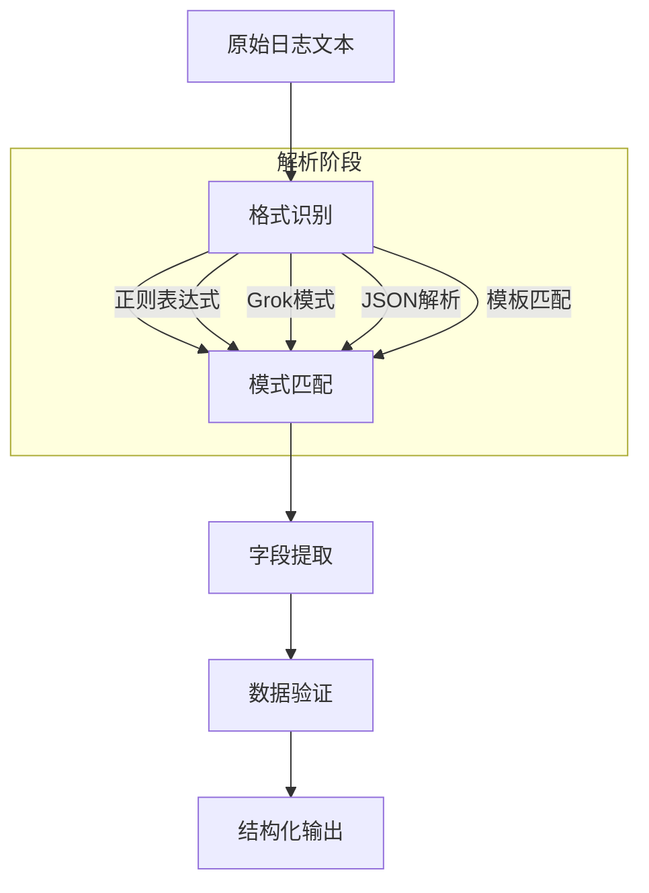

在企业级日志平台建设中，日志解析是将原始的非结构化日志文本转换为结构化、可分析数据的关键步骤。不同系统产生的日志格式千差万别，如何准确、高效地解析这些日志数据，是构建高质量日志平台的核心技术挑战。本文将深入探讨日志解析的核心技术，包括正则表达式、Grok模式、结构化解析以及机器学习解析等方法。

## 日志解析的核心概念

日志解析是指从原始日志文本中提取结构化信息的过程。通过解析，我们可以将无序的文本数据转换为具有明确定义字段的结构化数据，为后续的存储、查询和分析提供便利。

### 解析的基本流程



### 解析质量评估指标

1. **准确率（Accuracy）**：正确解析的日志占总日志数的比例
2. **召回率（Recall）**：能够解析的日志占所有可解析日志的比例
3. **性能（Performance）**：单位时间内处理的日志数量
4. **容错性（Fault Tolerance）**：对异常日志的处理能力

## 正则表达式解析

正则表达式是最基础也是最灵活的日志解析方法，适用于格式相对固定的日志数据。

### 基础正则解析实现

```java
// 基于正则表达式的日志解析器
public class RegexLogParser {
    private final Map<String, LogPattern> patterns;
    
    public RegexLogParser() {
        this.patterns = new HashMap<>();
        initializePatterns();
    }
    
    private void initializePatterns() {
        // Nginx访问日志模式
        patterns.put("nginx_access", new LogPattern(
            "nginx_access",
            "^(\\S+) \\S+ \\S+ \\[(.*?)\\] \"(\\S+) (\\S+) (\\S+)\" (\\d+) (\\d+) \"(.*?)\" \"(.*?)\"$",
            Arrays.asList("client_ip", "timestamp", "method", "path", "protocol", 
                         "status_code", "response_size", "referrer", "user_agent")
        ));
        
        // 应用日志模式
        patterns.put("app_log", new LogPattern(
            "app_log",
            "^(\\d{4}-\\d{2}-\\d{2} \\d{2}:\\d{2}:\\d{2}\\.\\d{3}) \\[(\\w+)\\] \\[(.*?)\\] (.*?)$",
            Arrays.asList("timestamp", "level", "service", "message")
        ));
        
        // 错误日志模式
        patterns.put("error_log", new LogPattern(
            "error_log",
            "^(\\d{4}-\\d{2}-\\d{2} \\d{2}:\\d{2}:\\d{2}\\.\\d{3}) \\[(\\w+)\\] \\[(.*?)\\] (.*?) caused by (.*?): (.*)$",
            Arrays.asList("timestamp", "level", "service", "message", "exception_type", "exception_message")
        ));
    }
    
    public ParsedLog parse(String logLine) {
        // 尝试匹配所有已知模式
        for (LogPattern pattern : patterns.values()) {
            ParsedLog parsedLog = tryParseWithPattern(logLine, pattern);
            if (parsedLog != null) {
                return parsedLog;
            }
        }
        
        // 如果没有匹配的模式，返回未解析的日志
        return createUnparsedLog(logLine);
    }
    
    private ParsedLog tryParseWithPattern(String logLine, LogPattern pattern) {
        Pattern regex = Pattern.compile(pattern.getRegex());
        Matcher matcher = regex.matcher(logLine);
        
        if (matcher.matches()) {
            Map<String, String> fields = new HashMap<>();
            List<String> fieldNames = pattern.getFieldNames();
            
            // 提取字段值
            for (int i = 0; i < fieldNames.size(); i++) {
                String fieldName = fieldNames.get(i);
                String fieldValue = matcher.group(i + 1);
                fields.put(fieldName, fieldValue);
            }
            
            return new ParsedLog(pattern.getName(), logLine, fields);
        }
        
        return null;
    }
    
    private ParsedLog createUnparsedLog(String logLine) {
        Map<String, String> fields = new HashMap<>();
        fields.put("raw_message", logLine);
        return new ParsedLog("unparsed", logLine, fields);
    }
}

// 日志模式定义
class LogPattern {
    private final String name;
    private final String regex;
    private final List<String> fieldNames;
    
    public LogPattern(String name, String regex, List<String> fieldNames) {
        this.name = name;
        this.regex = regex;
        this.fieldNames = fieldNames;
    }
    
    // getters...
}

// 解析结果
class ParsedLog {
    private final String patternType;
    private final String rawMessage;
    private final Map<String, String> fields;
    private final long parseTime;
    
    public ParsedLog(String patternType, String rawMessage, Map<String, String> fields) {
        this.patternType = patternType;
        this.rawMessage = rawMessage;
        this.fields = fields;
        this.parseTime = System.currentTimeMillis();
    }
    
    // getters and setters...
}
```

### 高性能正则解析

```java
// 高性能正则解析器
public class HighPerformanceRegexParser {
    // 使用预编译的Pattern避免重复编译
    private final Map<String, Pattern> compiledPatterns;
    // 使用ThreadLocal避免StringBuilder分配
    private final ThreadLocal<StringBuilder> stringBuilderHolder = 
        ThreadLocal.withInitial(() -> new StringBuilder(256));
    
    public HighPerformanceRegexParser() {
        this.compiledPatterns = new ConcurrentHashMap<>();
        initializeCompiledPatterns();
    }
    
    private void initializeCompiledPatterns() {
        // 预编译常用模式
        compiledPatterns.put("nginx_access", Pattern.compile(
            "^(\\S+) \\S+ \\S+ \\[(.*?)\\] \"(\\S+) (\\S+) (\\S+)\" (\\d+) (\\d+) \"(.*?)\" \"(.*?)\"$"
        ));
        
        compiledPatterns.put("app_log", Pattern.compile(
            "^(\\d{4}-\\d{2}-\\d{2} \\d{2}:\\d{2}:\\d{2}\\.\\d{3}) \\[(\\w+)\\] \\[(.*?)\\] (.*?)$"
        ));
    }
    
    public ParsedLog parseOptimized(String logLine) {
        for (Map.Entry<String, Pattern> entry : compiledPatterns.entrySet()) {
            String patternName = entry.getKey();
            Pattern pattern = entry.getValue();
            
            Matcher matcher = pattern.matcher(logLine);
            if (matcher.matches()) {
                return extractFieldsOptimized(matcher, patternName);
            }
        }
        
        return null;
    }
    
    private ParsedLog extractFieldsOptimized(Matcher matcher, String patternName) {
        Map<String, String> fields = new HashMap<>(matcher.groupCount());
        
        // 根据模式名称提取特定字段
        switch (patternName) {
            case "nginx_access":
                fields.put("client_ip", matcher.group(1));
                fields.put("timestamp", matcher.group(2));
                fields.put("method", matcher.group(3));
                fields.put("path", matcher.group(4));
                fields.put("protocol", matcher.group(5));
                fields.put("status_code", matcher.group(6));
                fields.put("response_size", matcher.group(7));
                fields.put("referrer", matcher.group(8));
                fields.put("user_agent", matcher.group(9));
                break;
                
            case "app_log":
                fields.put("timestamp", matcher.group(1));
                fields.put("level", matcher.group(2));
                fields.put("service", matcher.group(3));
                fields.put("message", matcher.group(4));
                break;
        }
        
        return new ParsedLog(patternName, matcher.group(0), fields);
    }
}
```

## Grok模式解析

Grok是Logstash提供的强大解析工具，通过预定义的模式组合来解析复杂的日志格式。

### Grok模式基础

```java
// Grok模式解析器实现
public class GrokLogParser {
    private final Grok grok;
    private final Map<String, String> customPatterns;
    
    public GrokLogParser() {
        this.grok = new Grok();
        this.customPatterns = new HashMap<>();
        initializeCustomPatterns();
        registerPatterns();
    }
    
    private void initializeCustomPatterns() {
        // 自定义模式定义
        customPatterns.put("NGINX_ACCESS", 
            "%{IPORHOST:clientip} %{USER:ident} %{USER:auth} \\[%{HTTPDATE:timestamp}\\] " +
            "\"%{WORD:verb} %{DATA:request} HTTP/%{NUMBER:httpversion}\" " +
            "%{NUMBER:response} (?:%{NUMBER:bytes}|-) %{QS:referrer} %{QS:agent}"
        );
        
        customPatterns.put("APP_LOG",
            "%{TIMESTAMP_ISO8601:timestamp} \\[%{LOGLEVEL:level}\\] \\[%{DATA:service}\\] %{GREEDYDATA:message}"
        );
        
        customPatterns.put("ERROR_LOG",
            "%{TIMESTAMP_ISO8601:timestamp} \\[%{LOGLEVEL:level}\\] \\[%{DATA:service}\\] " +
            "%{GREEDYDATA:message} caused by %{DATA:exception_type}: %{GREEDYDATA:exception_message}"
        );
    }
    
    private void registerPatterns() {
        try {
            for (Map.Entry<String, String> entry : customPatterns.entrySet()) {
                grok.addPattern(entry.getKey(), entry.getValue());
            }
            grok.compilePatterns();
        } catch (Exception e) {
            throw new RuntimeException("Failed to initialize Grok patterns", e);
        }
    }
    
    public ParsedLog parseWithGrok(String logLine) {
        try {
            Match match = grok.match(logLine);
            Map<String, Object> captures = match.capture();
            
            if (!captures.isEmpty()) {
                // 确定匹配的模式类型
                String patternType = determinePatternType(captures);
                
                // 转换为标准字段格式
                Map<String, String> fields = convertCapturesToStringMap(captures);
                
                return new ParsedLog(patternType, logLine, fields);
            }
        } catch (Exception e) {
            logger.warn("Failed to parse log with Grok: " + logLine, e);
        }
        
        return null;
    }
    
    private String determinePatternType(Map<String, Object> captures) {
        if (captures.containsKey("clientip") && captures.containsKey("verb")) {
            return "nginx_access";
        } else if (captures.containsKey("level") && captures.containsKey("service")) {
            return "app_log";
        } else if (captures.containsKey("exception_type")) {
            return "error_log";
        }
        return "unknown";
    }
    
    private Map<String, String> convertCapturesToStringMap(Map<String, Object> captures) {
        Map<String, String> stringMap = new HashMap<>();
        for (Map.Entry<String, Object> entry : captures.entrySet()) {
            stringMap.put(entry.getKey(), String.valueOf(entry.getValue()));
        }
        return stringMap;
    }
}
```

### Grok性能优化

```java
// 高性能Grok解析器
public class HighPerformanceGrokParser {
    private final Map<String, Grok> compiledGrokPatterns;
    private final LruCache<String, ParsedLog> parseCache;
    
    public HighPerformanceGrokParser() {
        this.compiledGrokPatterns = new ConcurrentHashMap<>();
        this.parseCache = new LruCache<>(10000);  // 10000条缓存
        initializeCompiledPatterns();
    }
    
    private void initializeCompiledPatterns() {
        // 预编译常用Grok模式
        try {
            Grok nginxGrok = new Grok();
            nginxGrok.addPattern("NGINX_ACCESS", 
                "%{IPORHOST:clientip} %{USER:ident} %{USER:auth} \\[%{HTTPDATE:timestamp}\\] " +
                "\"%{WORD:verb} %{DATA:request} HTTP/%{NUMBER:httpversion}\" " +
                "%{NUMBER:response} (?:%{NUMBER:bytes}|-) %{QS:referrer} %{QS:agent}"
            );
            nginxGrok.compile("%{NGINX_ACCESS}");
            compiledGrokPatterns.put("nginx_access", nginxGrok);
            
            Grok appGrok = new Grok();
            appGrok.addPattern("APP_LOG",
                "%{TIMESTAMP_ISO8601:timestamp} \\[%{LOGLEVEL:level}\\] \\[%{DATA:service}\\] %{GREEDYDATA:message}"
            );
            appGrok.compile("%{APP_LOG}");
            compiledGrokPatterns.put("app_log", appGrok);
            
        } catch (Exception e) {
            throw new RuntimeException("Failed to initialize compiled Grok patterns", e);
        }
    }
    
    public ParsedLog parseWithCaching(String logLine) {
        // 检查缓存
        ParsedLog cachedResult = parseCache.get(logLine);
        if (cachedResult != null) {
            return cachedResult;
        }
        
        // 执行解析
        ParsedLog result = parseWithoutCaching(logLine);
        
        // 缓存结果
        if (result != null) {
            parseCache.put(logLine, result);
        }
        
        return result;
    }
    
    private ParsedLog parseWithoutCaching(String logLine) {
        for (Map.Entry<String, Grok> entry : compiledGrokPatterns.entrySet()) {
            try {
                Grok grok = entry.getValue();
                Match match = grok.match(logLine);
                
                if (match.isNull()) {
                    continue;
                }
                
                Map<String, Object> captures = match.capture();
                if (!captures.isEmpty()) {
                    Map<String, String> fields = convertCapturesToStringMap(captures);
                    return new ParsedLog(entry.getKey(), logLine, fields);
                }
            } catch (Exception e) {
                logger.debug("Failed to parse with Grok pattern: " + entry.getKey(), e);
            }
        }
        
        return null;
    }
}
```

## 结构化解析

对于已经是JSON、XML等结构化格式的日志，可以直接进行解析。

### JSON日志解析

```java
// JSON日志解析器
public class JsonLogParser {
    private final ObjectMapper objectMapper;
    private final Set<String> requiredFields;
    
    public JsonLogParser() {
        this.objectMapper = new ObjectMapper();
        this.requiredFields = Set.of("timestamp", "level", "service");
    }
    
    public ParsedLog parseJsonLog(String jsonLog) {
        try {
            // 解析JSON
            JsonNode jsonNode = objectMapper.readTree(jsonLog);
            
            // 验证必需字段
            if (!validateRequiredFields(jsonNode)) {
                return createInvalidLog(jsonLog, "Missing required fields");
            }
            
            // 提取字段
            Map<String, String> fields = extractFieldsFromJson(jsonNode);
            
            return new ParsedLog("json_log", jsonLog, fields);
            
        } catch (JsonProcessingException e) {
            return createInvalidLog(jsonLog, "Invalid JSON format: " + e.getMessage());
        } catch (Exception e) {
            return createInvalidLog(jsonLog, "Unexpected error: " + e.getMessage());
        }
    }
    
    private boolean validateRequiredFields(JsonNode jsonNode) {
        for (String field : requiredFields) {
            if (!jsonNode.has(field) || jsonNode.get(field).isNull()) {
                return false;
            }
        }
        return true;
    }
    
    private Map<String, String> extractFieldsFromJson(JsonNode jsonNode) {
        Map<String, String> fields = new HashMap<>();
        
        Iterator<Map.Entry<String, JsonNode>> fieldsIterator = jsonNode.fields();
        while (fieldsIterator.hasNext()) {
            Map.Entry<String, JsonNode> field = fieldsIterator.next();
            String fieldName = field.getKey();
            JsonNode fieldValue = field.getValue();
            
            // 处理不同类型的值
            if (fieldValue.isTextual()) {
                fields.put(fieldName, fieldValue.asText());
            } else if (fieldValue.isNumber()) {
                fields.put(fieldName, String.valueOf(fieldValue.numberValue()));
            } else if (fieldValue.isBoolean()) {
                fields.put(fieldName, String.valueOf(fieldValue.booleanValue()));
            } else {
                fields.put(fieldName, fieldValue.toString());
            }
        }
        
        return fields;
    }
    
    private ParsedLog createInvalidLog(String rawLog, String errorMessage) {
        Map<String, String> fields = new HashMap<>();
        fields.put("raw_message", rawLog);
        fields.put("parse_error", errorMessage);
        return new ParsedLog("invalid_json", rawLog, fields);
    }
}
```

### XML日志解析

```java
// XML日志解析器
public class XmlLogParser {
    private final DocumentBuilderFactory documentBuilderFactory;
    
    public XmlLogParser() {
        this.documentBuilderFactory = DocumentBuilderFactory.newInstance();
        // 防止XXE攻击
        try {
            documentBuilderFactory.setFeature("http://apache.org/xml/features/disallow-doctype-decl", true);
        } catch (ParserConfigurationException e) {
            throw new RuntimeException("Failed to configure XML parser", e);
        }
    }
    
    public ParsedLog parseXmlLog(String xmlLog) {
        try {
            DocumentBuilder documentBuilder = documentBuilderFactory.newDocumentBuilder();
            Document document = documentBuilder.parse(new InputSource(new StringReader(xmlLog)));
            
            // 提取根元素
            Element rootElement = document.getDocumentElement();
            
            // 递归提取字段
            Map<String, String> fields = new HashMap<>();
            extractFieldsFromElement(rootElement, "", fields);
            
            return new ParsedLog("xml_log", xmlLog, fields);
            
        } catch (Exception e) {
            Map<String, String> errorFields = new HashMap<>();
            errorFields.put("raw_message", xmlLog);
            errorFields.put("parse_error", e.getMessage());
            return new ParsedLog("invalid_xml", xmlLog, errorFields);
        }
    }
    
    private void extractFieldsFromElement(Element element, String prefix, Map<String, String> fields) {
        String elementName = element.getNodeName();
        String fieldPrefix = prefix.isEmpty() ? elementName : prefix + "." + elementName;
        
        // 处理元素属性
        NamedNodeMap attributes = element.getAttributes();
        for (int i = 0; i < attributes.getLength(); i++) {
            Node attribute = attributes.item(i);
            fields.put(fieldPrefix + ".@" + attribute.getNodeName(), attribute.getNodeValue());
        }
        
        // 处理子节点
        NodeList childNodes = element.getChildNodes();
        boolean hasChildElements = false;
        
        for (int i = 0; i < childNodes.getLength(); i++) {
            Node childNode = childNodes.item(i);
            
            if (childNode.getNodeType() == Node.ELEMENT_NODE) {
                hasChildElements = true;
                extractFieldsFromElement((Element) childNode, fieldPrefix, fields);
            } else if (childNode.getNodeType() == Node.TEXT_NODE) {
                String textContent = childNode.getTextContent().trim();
                if (!textContent.isEmpty()) {
                    fields.put(fieldPrefix, textContent);
                }
            }
        }
        
        // 如果没有子元素且没有文本内容，设置为空字符串
        if (!hasChildElements && !fields.containsKey(fieldPrefix)) {
            fields.put(fieldPrefix, "");
        }
    }
}
```

## 机器学习解析

对于格式不固定或未知的日志，可以使用机器学习方法进行自动解析。

### 基于聚类的解析

```python
# 基于聚类的日志解析器
class MLLogParser:
    def __init__(self):
        self.vectorizer = TfidfVectorizer(
            token_pattern=r'\b\w+\b',
            max_features=10000,
            stop_words=None
        )
        self.clustering_model = DBSCAN(eps=0.5, min_samples=5)
        self.template_library = {}
        self.is_fitted = False
    
    def preprocess_log(self, log_line):
        """预处理日志行"""
        # 移除时间戳（假设时间戳在行首）
        log_without_timestamp = re.sub(r'^\d{4}-\d{2}-\d{2} \d{2}:\d{2}:\d{2}(\.\d{3})?', '', log_line)
        
        # 标准化数字和IP地址
        log_standardized = re.sub(r'\b\d+\.\d+\.\d+\.\d+\b', '<IP_ADDRESS>', log_without_timestamp)
        log_standardized = re.sub(r'\b\d+\b', '<NUMBER>', log_standardized)
        
        return log_standardized.strip()
    
    def extract_features(self, log_lines):
        """提取日志特征"""
        preprocessed_logs = [self.preprocess_log(log) for log in log_lines]
        return self.vectorizer.fit_transform(preprocessed_logs)
    
    def fit(self, log_lines):
        """训练解析模型"""
        # 提取特征
        features = self.extract_features(log_lines)
        
        # 聚类分析
        cluster_labels = self.clustering_model.fit_predict(features)
        
        # 为每个聚类生成模板
        for cluster_id in set(cluster_labels):
            if cluster_id == -1:  # 噪声点
                continue
                
            # 获取聚类中的日志
            cluster_logs = [log_lines[i] for i, label in enumerate(cluster_labels) if label == cluster_id]
            
            # 生成模板
            template = self.generate_template(cluster_logs)
            self.template_library[cluster_id] = template
        
        self.is_fitted = True
    
    def generate_template(self, log_lines):
        """为日志组生成模板"""
        if not log_lines:
            return None
        
        # 使用Drain算法生成模板
        return self.drain_template_generation(log_lines)
    
    def drain_template_generation(self, log_lines):
        """使用简化版Drain算法生成模板"""
        # 这里实现一个简化的模板生成算法
        # 实际应用中可以使用完整的Drain实现
        
        # 提取日志的公共部分
        common_parts = self.find_common_parts(log_lines)
        
        # 识别变量部分
        variable_patterns = self.identify_variables(log_lines, common_parts)
        
        return {
            'template': common_parts,
            'variables': variable_patterns,
            'count': len(log_lines)
        }
    
    def parse_log(self, log_line):
        """解析单条日志"""
        if not self.is_fitted:
            raise ValueError("Model not fitted. Call fit() first.")
        
        # 预处理日志
        preprocessed_log = self.preprocess_log(log_line)
        
        # 提取特征
        feature_vector = self.vectorizer.transform([preprocessed_log])
        
        # 预测聚类
        cluster_label = self.clustering_model.fit_predict(feature_vector)[0]
        
        # 应用模板
        if cluster_label in self.template_library:
            template = self.template_library[cluster_label]
            parsed_data = self.apply_template(log_line, template)
            return parsed_data
        
        return None
    
    def apply_template(self, log_line, template):
        """应用模板解析日志"""
        # 这里实现模板应用逻辑
        # 简化实现，实际应用中需要更复杂的匹配算法
        
        parsed_data = {
            'raw_log': log_line,
            'template_id': hash(template['template']),
            'fields': {}
        }
        
        # 提取变量值
        for var_name, var_pattern in template['variables'].items():
            match = re.search(var_pattern, log_line)
            if match:
                parsed_data['fields'][var_name] = match.group(1)
        
        return parsed_data
```

### 基于深度学习的解析

```python
# 基于深度学习的日志解析器
class DeepLogParser:
    def __init__(self):
        self.tokenizer = None
        self.model = None
        self.max_sequence_length = 100
    
    def build_model(self, vocab_size, embedding_dim=128, lstm_units=64):
        """构建深度学习模型"""
        model = tf.keras.Sequential([
            tf.keras.layers.Embedding(vocab_size, embedding_dim, 
                                    input_length=self.max_sequence_length),
            tf.keras.layers.LSTM(lstm_units, return_sequences=True),
            tf.keras.layers.LSTM(lstm_units),
            tf.keras.layers.Dense(vocab_size, activation='softmax')
        ])
        
        model.compile(
            optimizer='adam',
            loss='categorical_crossentropy',
            metrics=['accuracy']
        )
        
        self.model = model
        return model
    
    def tokenize_logs(self, log_lines):
        """对日志进行分词"""
        # 创建词汇表
        all_tokens = []
        for log in log_lines:
            tokens = re.findall(r'\b\w+\b|[^\w\s]', log)
            all_tokens.extend(tokens)
        
        # 创建词汇表
        vocab = list(set(all_tokens))
        self.tokenizer = {token: idx + 1 for idx, token in enumerate(vocab)}
        self.tokenizer['<UNK>'] = 0  # 未知词汇
        
        # 转换日志为序列
        sequences = []
        for log in log_lines:
            tokens = re.findall(r'\b\w+\b|[^\w\s]', log)
            sequence = [self.tokenizer.get(token, 0) for token in tokens]
            # 填充或截断序列
            if len(sequence) < self.max_sequence_length:
                sequence.extend([0] * (self.max_sequence_length - len(sequence)))
            else:
                sequence = sequence[:self.max_sequence_length]
            sequences.append(sequence)
        
        return np.array(sequences)
    
    def train(self, log_lines, epochs=10):
        """训练模型"""
        # 分词
        sequences = self.tokenize_logs(log_lines)
        
        # 准备训练数据
        X, y = self.prepare_training_data(sequences)
        
        # 构建模型
        vocab_size = len(self.tokenizer)
        self.build_model(vocab_size)
        
        # 训练模型
        self.model.fit(X, y, epochs=epochs, batch_size=32, validation_split=0.2)
    
    def prepare_training_data(self, sequences):
        """准备训练数据"""
        X, y = [], []
        
        for sequence in sequences:
            for i in range(1, len(sequence)):
                X.append(sequence[:i])
                y.append(sequence[i])
        
        # 填充序列
        X = tf.keras.preprocessing.sequence.pad_sequences(X, maxlen=self.max_sequence_length)
        y = tf.keras.utils.to_categorical(y, num_classes=len(self.tokenizer))
        
        return np.array(X), np.array(y)
    
    def parse_log(self, log_line):
        """使用训练好的模型解析日志"""
        if self.model is None:
            raise ValueError("Model not trained. Call train() first.")
        
        # 分词
        tokens = re.findall(r'\b\w+\b|[^\w\s]', log_line)
        sequence = [self.tokenizer.get(token, 0) for token in tokens]
        
        # 填充序列
        if len(sequence) < self.max_sequence_length:
            sequence.extend([0] * (self.max_sequence_length - len(sequence)))
        else:
            sequence = sequence[:self.max_sequence_length]
        
        # 预测下一个词汇
        sequence = np.array([sequence])
        predictions = self.model.predict(sequence)
        
        # 解析结果
        parsed_data = {
            'raw_log': log_line,
            'predicted_tokens': self.decode_predictions(predictions[0])
        }
        
        return parsed_data
    
    def decode_predictions(self, predictions):
        """解码预测结果"""
        # 找到概率最高的词汇
        top_indices = np.argsort(predictions)[-5:][::-1]  # 前5个最可能的词汇
        
        decoded_tokens = []
        reverse_tokenizer = {v: k for k, v in self.tokenizer.items()}
        
        for idx in top_indices:
            if idx in reverse_tokenizer:
                decoded_tokens.append(reverse_tokenizer[idx])
        
        return decoded_tokens
```

## 解析性能优化

### 批量解析处理

```java
// 批量日志解析器
public class BatchLogParser {
    private final List<LogParser> parsers;
    private final ExecutorService executorService;
    
    public BatchLogParser() {
        this.parsers = Arrays.asList(
            new RegexLogParser(),
            new GrokLogParser(),
            new JsonLogParser()
        );
        this.executorService = Executors.newFixedThreadPool(4);
    }
    
    public List<ParsedLog> parseBatch(List<String> logLines) {
        // 分批处理
        List<CompletableFuture<List<ParsedLog>>> futures = new ArrayList<>();
        
        int batchSize = 1000;
        for (int i = 0; i < logLines.size(); i += batchSize) {
            int endIndex = Math.min(i + batchSize, logLines.size());
            List<String> batch = logLines.subList(i, endIndex);
            
            CompletableFuture<List<ParsedLog>> future = CompletableFuture
                .supplyAsync(() -> parseBatchInternal(batch), executorService);
            futures.add(future);
        }
        
        // 等待所有批次完成
        CompletableFuture<Void> allFutures = CompletableFuture.allOf(
            futures.toArray(new CompletableFuture[0])
        );
        
        try {
            allFutures.get(30, TimeUnit.SECONDS);
            
            // 合并结果
            List<ParsedLog> results = new ArrayList<>();
            for (CompletableFuture<List<ParsedLog>> future : futures) {
                results.addAll(future.join());
            }
            
            return results;
            
        } catch (Exception e) {
            throw new RuntimeException("Failed to parse log batch", e);
        }
    }
    
    private List<ParsedLog> parseBatchInternal(List<String> logLines) {
        List<ParsedLog> parsedLogs = new ArrayList<>();
        
        for (String logLine : logLines) {
            ParsedLog parsedLog = parseSingleLog(logLine);
            if (parsedLog != null) {
                parsedLogs.add(parsedLog);
            }
        }
        
        return parsedLogs;
    }
    
    private ParsedLog parseSingleLog(String logLine) {
        // 尝试不同的解析器
        for (LogParser parser : parsers) {
            try {
                ParsedLog parsedLog = parser.parse(logLine);
                if (parsedLog != null && !"unparsed".equals(parsedLog.getPatternType())) {
                    return parsedLog;
                }
            } catch (Exception e) {
                logger.debug("Parser {} failed for log: {}", parser.getClass().getSimpleName(), logLine, e);
            }
        }
        
        return null;
    }
}
```

### 解析缓存机制

```java
// 带缓存的日志解析器
public class CachedLogParser {
    private final LogParser underlyingParser;
    private final LruCache<String, ParsedLog> parseCache;
    private final ScheduledExecutorService cacheCleaner;
    
    public CachedLogParser(LogParser underlyingParser) {
        this.underlyingParser = underlyingParser;
        this.parseCache = new LruCache<>(50000);  // 50000条缓存
        this.cacheCleaner = Executors.newScheduledThreadPool(1);
        
        // 定期清理过期缓存
        startCacheCleaning();
    }
    
    public ParsedLog parse(String logLine) {
        // 检查缓存
        ParsedLog cachedResult = parseCache.get(logLine);
        if (cachedResult != null) {
            return cachedResult;
        }
        
        // 执行实际解析
        ParsedLog result = underlyingParser.parse(logLine);
        
        // 缓存结果（如果解析成功）
        if (result != null && !"unparsed".equals(result.getPatternType())) {
            parseCache.put(logLine, result);
        }
        
        return result;
    }
    
    private void startCacheCleaning() {
        cacheCleaner.scheduleWithFixedDelay(() -> {
            // 清理超过1小时的缓存项
            parseCache.cleanExpired(3600000);  // 1小时
        }, 30, 30, TimeUnit.MINUTES);
    }
}

// LRU缓存实现
class LruCache<K, V> {
    private final int maxSize;
    private final Map<K, CacheEntry<V>> cache;
    private final LinkedList<K> accessOrder;
    
    public LruCache(int maxSize) {
        this.maxSize = maxSize;
        this.cache = new ConcurrentHashMap<>();
        this.accessOrder = new LinkedList<>();
    }
    
    public V get(K key) {
        CacheEntry<V> entry = cache.get(key);
        if (entry != null) {
            // 更新访问时间
            entry.setLastAccess(System.currentTimeMillis());
            
            // 移动到访问顺序的末尾
            accessOrder.remove(key);
            accessOrder.addLast(key);
            
            return entry.getValue();
        }
        return null;
    }
    
    public void put(K key, V value) {
        if (cache.size() >= maxSize) {
            // 移除最久未访问的项
            K oldestKey = accessOrder.removeFirst();
            cache.remove(oldestKey);
        }
        
        CacheEntry<V> entry = new CacheEntry<>(value, System.currentTimeMillis());
        cache.put(key, entry);
        accessOrder.addLast(key);
    }
    
    public void cleanExpired(long maxAgeMillis) {
        long currentTime = System.currentTimeMillis();
        Iterator<Map.Entry<K, CacheEntry<V>>> iterator = cache.entrySet().iterator();
        
        while (iterator.hasNext()) {
            Map.Entry<K, CacheEntry<V>> entry = iterator.next();
            if (currentTime - entry.getValue().getLastAccess() > maxAgeMillis) {
                iterator.remove();
                accessOrder.remove(entry.getKey());
            }
        }
    }
}

class CacheEntry<V> {
    private final V value;
    private long lastAccess;
    
    public CacheEntry(V value, long lastAccess) {
        this.value = value;
        this.lastAccess = lastAccess;
    }
    
    // getters and setters...
}
```

## 最佳实践总结

### 1. 解析器选择策略

```yaml
# 解析器选择最佳实践
parser_selection_strategy:
  structured_first:
    order:
      - json_parser
      - xml_parser
      - regex_parser
      - grok_parser
      - ml_parser
  
  performance_tier:
    high_performance: 
      - json_parser
      - regex_parser
    
    medium_performance:
      - grok_parser
    
    low_performance:
      - ml_parser

  accuracy_tier:
    high_accuracy:
      - json_parser
      - grok_parser
    
    medium_accuracy:
      - regex_parser
    
    adaptive_accuracy:
      - ml_parser
```

### 2. 错误处理与监控

```java
// 解析错误处理与监控
public class ParserErrorHandling {
    private final MeterRegistry meterRegistry;
    private final Counter parseSuccessCounter;
    private final Counter parseFailureCounter;
    private final Timer parseTimer;
    
    public ParserErrorHandling(MeterRegistry meterRegistry) {
        this.meterRegistry = meterRegistry;
        this.parseSuccessCounter = Counter.builder("log.parse.success")
            .description("Successful log parses")
            .register(meterRegistry);
        this.parseFailureCounter = Counter.builder("log.parse.failure")
            .description("Failed log parses")
            .register(meterRegistry);
        this.parseTimer = Timer.builder("log.parse.duration")
            .description("Log parsing duration")
            .register(meterRegistry);
    }
    
    public ParsedLog parseWithMonitoring(LogParser parser, String logLine) {
        long startTime = System.nanoTime();
        
        try {
            ParsedLog result = parser.parse(logLine);
            
            if (result != null && !"unparsed".equals(result.getPatternType())) {
                parseSuccessCounter.increment();
            } else {
                parseFailureCounter.increment();
            }
            
            return result;
            
        } catch (Exception e) {
            parseFailureCounter.increment();
            logger.error("Failed to parse log: " + logLine, e);
            return null;
            
        } finally {
            long duration = System.nanoTime() - startTime;
            parseTimer.record(duration, TimeUnit.NANOSECONDS);
        }
    }
}
```

## 总结

日志解析是日志平台建设中的核心技术环节，通过合理选择和组合不同的解析方法，我们可以有效处理各种格式的日志数据。正则表达式适用于格式固定的日志，Grok模式提供了更高级的模板匹配能力，结构化解析直接处理JSON/XML等格式，而机器学习解析则能够应对格式不固定或未知的日志。

关键要点包括：

1. **技术选型**：根据日志特点选择合适的解析技术
2. **性能优化**：通过预编译、缓存、批量处理等手段提升解析性能
3. **错误处理**：建立完善的错误处理和监控机制
4. **质量保障**：实施解析质量评估和持续优化

在实际应用中，建议采用混合解析策略，结合多种解析技术的优势，构建一个既高效又准确的日志解析系统。