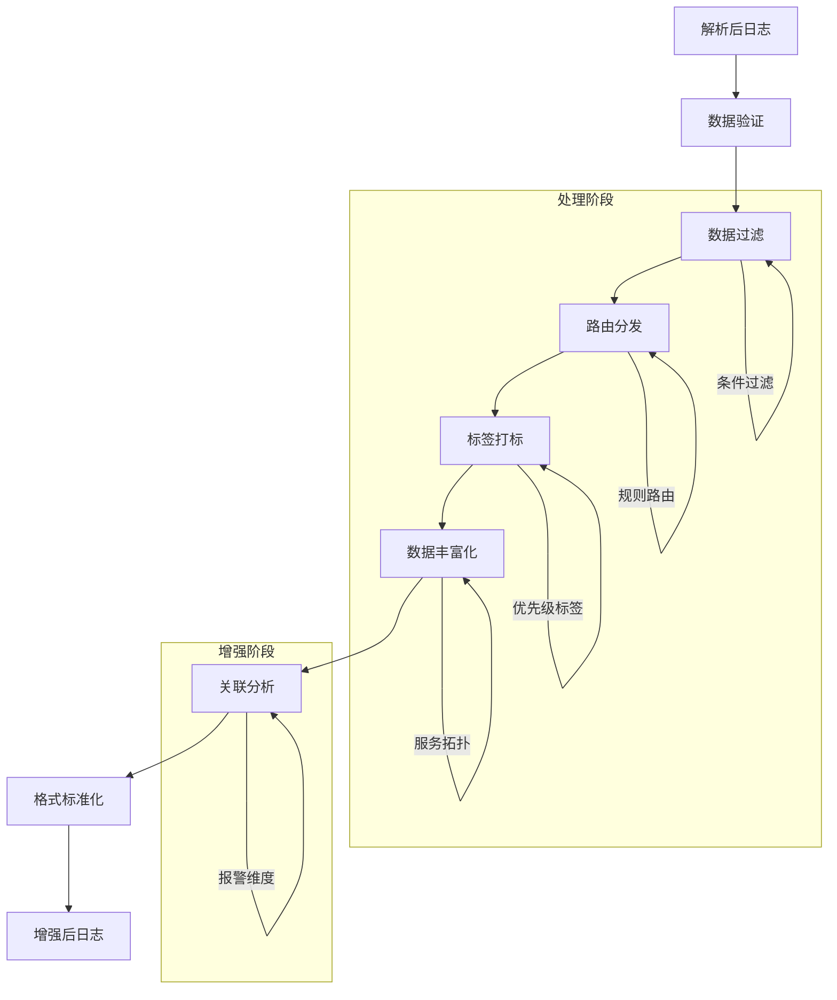

在企业级日志平台建设中，日志处理与增强是将解析后的结构化日志数据进一步加工、丰富和优化的关键环节。通过有效的日志处理与增强，我们可以显著提升日志数据的价值，为后续的存储、查询、分析和可视化提供更高质量的数据基础。本文将深入探讨日志处理与增强的核心技术，包括数据过滤、路由、打标签、关联分析以及实时流处理等方法。

## 日志处理与增强的核心概念

日志处理与增强是指在日志解析的基础上，对结构化日志数据进行进一步的加工和丰富，以提升数据质量和分析价值的过程。这一过程不仅包括数据的清洗和转换，还涉及数据的丰富化和智能化处理。

### 处理与增强的基本流程



### 处理与增强的价值

1. **数据质量提升**：通过验证和清洗提升数据准确性
2. **业务价值增强**：通过丰富化增加数据的业务含义
3. **分析效率提升**：通过标签和关联提升分析效率
4. **智能化水平**：通过自动化处理提升系统智能化水平

## 数据过滤与路由

数据过滤与路由是日志处理的第一步，通过合理的过滤和路由策略，我们可以优化系统资源使用并确保日志数据的精准分发。

### 数据过滤实现

```java
// 数据过滤器实现
public class LogFilter {
    private final List<FilterRule> filterRules;
    private final MeterRegistry meterRegistry;
    private final Counter filteredLogsCounter;
    
    public LogFilter(List<FilterRule> filterRules, MeterRegistry meterRegistry) {
        this.filterRules = filterRules;
        this.meterRegistry = meterRegistry;
        this.filteredLogsCounter = Counter.builder("log.filtered")
            .description("Number of filtered logs")
            .register(meterRegistry);
    }
    
    public boolean shouldProcess(ParsedLog log) {
        for (FilterRule rule : filterRules) {
            if (rule.matches(log)) {
                if (rule.shouldFilter()) {
                    filteredLogsCounter.increment();
                    return false;  // 过滤掉该日志
                }
            }
        }
        return true;  // 保留该日志
    }
}

// 过滤规则定义
public class FilterRule {
    private final String name;
    private final FilterCondition condition;
    private final boolean shouldFilter;
    
    public FilterRule(String name, FilterCondition condition, boolean shouldFilter) {
        this.name = name;
        this.condition = condition;
        this.shouldFilter = shouldFilter;
    }
    
    public boolean matches(ParsedLog log) {
        return condition.evaluate(log);
    }
    
    public boolean shouldFilter() {
        return shouldFilter;
    }
}

// 过滤条件接口
public interface FilterCondition {
    boolean evaluate(ParsedLog log);
}

// 具体过滤条件实现
public class LevelFilterCondition implements FilterCondition {
    private final Set<String> levels;
    
    public LevelFilterCondition(Set<String> levels) {
        this.levels = levels;
    }
    
    @Override
    public boolean evaluate(ParsedLog log) {
        String level = log.getField("level");
        return level != null && levels.contains(level.toUpperCase());
    }
}

public class ServiceFilterCondition implements FilterCondition {
    private final Set<String> services;
    
    public ServiceFilterCondition(Set<String> services) {
        this.services = services;
    }
    
    @Override
    public boolean evaluate(ParsedLog log) {
        String service = log.getField("service");
        return service != null && services.contains(service);
    }
}

public class RegexFilterCondition implements FilterCondition {
    private final Pattern pattern;
    
    public RegexFilterCondition(String regex) {
        this.pattern = Pattern.compile(regex);
    }
    
    @Override
    public boolean evaluate(ParsedLog log) {
        return pattern.matcher(log.getRawMessage()).find();
    }
}
```

### 智能路由实现

```java
// 智能路由器实现
public class IntelligentLogRouter {
    private final List<RoutingRule> routingRules;
    private final Map<String, LogDestination> destinations;
    
    public IntelligentLogRouter(List<RoutingRule> routingRules, 
                               Map<String, LogDestination> destinations) {
        this.routingRules = routingRules;
        this.destinations = destinations;
    }
    
    public List<LogDestination> routeLog(ParsedLog log) {
        List<LogDestination> targetDestinations = new ArrayList<>();
        
        // 根据路由规则确定目标
        for (RoutingRule rule : routingRules) {
            if (rule.matches(log)) {
                List<String> destinationNames = rule.getDestinations();
                for (String destName : destinationNames) {
                    LogDestination destination = destinations.get(destName);
                    if (destination != null) {
                        targetDestinations.add(destination);
                    }
                }
            }
        }
        
        // 如果没有匹配的规则，使用默认路由
        if (targetDestinations.isEmpty()) {
            LogDestination defaultDest = destinations.get("default");
            if (defaultDest != null) {
                targetDestinations.add(defaultDest);
            }
        }
        
        return targetDestinations;
    }
}

// 路由规则定义
public class RoutingRule {
    private final String name;
    private final RoutingCondition condition;
    private final List<String> destinations;
    
    public RoutingRule(String name, RoutingCondition condition, List<String> destinations) {
        this.name = name;
        this.condition = condition;
        this.destinations = destinations;
    }
    
    public boolean matches(ParsedLog log) {
        return condition.evaluate(log);
    }
    
    public List<String> getDestinations() {
        return destinations;
    }
}

// 路由条件接口
public interface RoutingCondition {
    boolean evaluate(ParsedLog log);
}

// 具体路由条件实现
public class SeverityRoutingCondition implements RoutingCondition {
    private final int minSeverity;
    
    public SeverityRoutingCondition(int minSeverity) {
        this.minSeverity = minSeverity;
    }
    
    @Override
    public boolean evaluate(ParsedLog log) {
        String level = log.getField("level");
        if (level == null) return false;
        
        int severity = getSeverityLevel(level);
        return severity >= minSeverity;
    }
    
    private int getSeverityLevel(String level) {
        switch (level.toUpperCase()) {
            case "FATAL": return 5;
            case "ERROR": return 4;
            case "WARN": return 3;
            case "INFO": return 2;
            case "DEBUG": return 1;
            case "TRACE": return 0;
            default: return 2;
        }
    }
}
```

## 标签打标与分类

通过为日志数据打上各种标签，我们可以更好地组织和管理日志数据，提升查询和分析效率。

### 动态标签打标

```java
// 动态标签打标器
public class DynamicTagger {
    private final List<TaggingRule> taggingRules;
    
    public DynamicTagger(List<TaggingRule> taggingRules) {
        this.taggingRules = taggingRules;
    }
    
    public EnrichedLog addTags(ParsedLog parsedLog) {
        EnrichedLog enrichedLog = new EnrichedLog(parsedLog);
        Set<String> tags = new HashSet<>();
        
        // 应用标签规则
        for (TaggingRule rule : taggingRules) {
            if (rule.matches(parsedLog)) {
                tags.addAll(rule.getTags());
            }
        }
        
        enrichedLog.setTags(tags);
        return enrichedLog;
    }
}

// 标签规则定义
public class TaggingRule {
    private final String name;
    private final TaggingCondition condition;
    private final Set<String> tags;
    
    public TaggingRule(String name, TaggingCondition condition, Set<String> tags) {
        this.name = name;
        this.condition = condition;
        this.tags = tags;
    }
    
    public boolean matches(ParsedLog log) {
        return condition.evaluate(log);
    }
    
    public Set<String> getTags() {
        return tags;
    }
}

// 标签条件接口
public interface TaggingCondition {
    boolean evaluate(ParsedLog log);
}

// 具体标签条件实现
public class StatusCodeTaggingCondition implements TaggingCondition {
    private final Set<Integer> statusCodes;
    private final String tagName;
    
    public StatusCodeTaggingCondition(Set<Integer> statusCodes, String tagName) {
        this.statusCodes = statusCodes;
        this.tagName = tagName;
    }
    
    @Override
    public boolean evaluate(ParsedLog log) {
        String statusCodeStr = log.getField("status_code");
        if (statusCodeStr == null) return false;
        
        try {
            int statusCode = Integer.parseInt(statusCodeStr);
            return statusCodes.contains(statusCode);
        } catch (NumberFormatException e) {
            return false;
        }
    }
}

public class ResponseTimeTaggingCondition implements TaggingCondition {
    private final long thresholdMs;
    private final String tagName;
    
    public ResponseTimeTaggingCondition(long thresholdMs, String tagName) {
        this.thresholdMs = thresholdMs;
        this.tagName = tagName;
    }
    
    @Override
    public boolean evaluate(ParsedLog log) {
        String responseTimeStr = log.getField("response_time");
        if (responseTimeStr == null) return false;
        
        try {
            long responseTime = Long.parseLong(responseTimeStr);
            return responseTime > thresholdMs;
        } catch (NumberFormatException e) {
            return false;
        }
    }
}
```

### 业务标签体系

```java
// 业务标签体系管理
public class BusinessTagManager {
    private final Map<String, BusinessTag> businessTags;
    
    public BusinessTagManager() {
        this.businessTags = new HashMap<>();
        initializeBusinessTags();
    }
    
    private void initializeBusinessTags() {
        // 业务领域标签
        businessTags.put("payment", new BusinessTag("payment", "支付相关", 
            Arrays.asList("pay", "payment", "alipay", "wechat_pay")));
        
        businessTags.put("user", new BusinessTag("user", "用户相关",
            Arrays.asList("user", "login", "register", "profile")));
        
        businessTags.put("order", new BusinessTag("order", "订单相关",
            Arrays.asList("order", "cart", "checkout", "refund")));
        
        // 优先级标签
        businessTags.put("critical", new BusinessTag("critical", "关键业务",
            Arrays.asList("error", "fatal", "exception")));
        
        businessTags.put("monitor", new BusinessTag("monitor", "监控相关",
            Arrays.asList("health", "metrics", "performance")));
    }
    
    public Set<String> getBusinessTags(ParsedLog log) {
        Set<String> tags = new HashSet<>();
        
        String message = log.getField("message");
        if (message != null) {
            String lowerMessage = message.toLowerCase();
            
            for (BusinessTag tag : businessTags.values()) {
                for (String keyword : tag.getKeywords()) {
                    if (lowerMessage.contains(keyword)) {
                        tags.add(tag.getName());
                    }
                }
            }
        }
        
        return tags;
    }
}

// 业务标签定义
class BusinessTag {
    private final String name;
    private final String description;
    private final List<String> keywords;
    
    public BusinessTag(String name, String description, List<String> keywords) {
        this.name = name;
        this.description = description;
        this.keywords = keywords;
    }
    
    // getters...
}
```

## 数据丰富化处理

数据丰富化是通过添加额外的上下文信息来增强日志数据价值的重要手段。

### 地理位置丰富化

```java
// 地理位置服务
public class GeoIPService {
    private final DatabaseReader databaseReader;
    
    public GeoIPService() throws IOException {
        // 加载GeoIP数据库
        File database = new File("/path/to/GeoLite2-City.mmdb");
        this.databaseReader = new DatabaseReader.Builder(database).build();
    }
    
    public GeoInfo lookup(String ipAddress) {
        try {
            InetAddress inetAddress = InetAddress.getByName(ipAddress);
            CityResponse response = databaseReader.city(inetAddress);
            
            GeoInfo geoInfo = new GeoInfo();
            geoInfo.setIpAddress(ipAddress);
            geoInfo.setCountry(response.getCountry().getName());
            geoInfo.setCity(response.getCity().getName());
            geoInfo.setLatitude(response.getLocation().getLatitude());
            geoInfo.setLongitude(response.getLocation().getLongitude());
            
            return geoInfo;
            
        } catch (Exception e) {
            logger.warn("Failed to lookup GeoIP for IP: " + ipAddress, e);
            return null;
        }
    }
}

// 地理信息实体
class GeoInfo {
    private String ipAddress;
    private String country;
    private String city;
    private Double latitude;
    private Double longitude;
    
    // getters and setters...
}

// 地理位置丰富化处理器
public class GeoEnrichmentProcessor {
    private final GeoIPService geoIPService;
    
    public GeoEnrichmentProcessor(GeoIPService geoIPService) {
        this.geoIPService = geoIPService;
    }
    
    public EnrichedLog enrichWithGeoInfo(ParsedLog parsedLog) {
        EnrichedLog enrichedLog = new EnrichedLog(parsedLog);
        
        String clientIp = parsedLog.getField("client_ip");
        if (clientIp != null) {
            GeoInfo geoInfo = geoIPService.lookup(clientIp);
            if (geoInfo != null) {
                enrichedLog.setGeoInfo(geoInfo);
            }
        }
        
        return enrichedLog;
    }
}
```

### 用户信息丰富化

```java
// 用户信息服务
public class UserService {
    private final UserCache userCache;
    private final UserServiceClient userServiceClient;
    
    public UserService() {
        this.userCache = new UserCache(10000);  // 10000条缓存
        this.userServiceClient = new UserServiceClient();
    }
    
    public UserInfo getUserInfo(String userId) {
        // 先查缓存
        UserInfo cachedUser = userCache.get(userId);
        if (cachedUser != null) {
            return cachedUser;
        }
        
        // 缓存未命中，调用用户服务
        try {
            UserInfo userInfo = userServiceClient.getUserById(userId);
            if (userInfo != null) {
                userCache.put(userId, userInfo);
            }
            return userInfo;
            
        } catch (Exception e) {
            logger.warn("Failed to get user info for user ID: " + userId, e);
            return null;
        }
    }
}

// 用户缓存实现
class UserCache {
    private final int maxSize;
    private final Map<String, CacheEntry<UserInfo>> cache;
    
    public UserCache(int maxSize) {
        this.maxSize = maxSize;
        this.cache = new ConcurrentHashMap<>();
    }
    
    public UserInfo get(String userId) {
        CacheEntry<UserInfo> entry = cache.get(userId);
        if (entry != null && !entry.isExpired()) {
            return entry.getValue();
        }
        return null;
    }
    
    public void put(String userId, UserInfo userInfo) {
        if (cache.size() >= maxSize) {
            // 简单的LRU实现：清除最旧的条目
            Iterator<Map.Entry<String, CacheEntry<UserInfo>>> iterator = cache.entrySet().iterator();
            if (iterator.hasNext()) {
                iterator.next();
                iterator.remove();
            }
        }
        
        cache.put(userId, new CacheEntry<>(userInfo, System.currentTimeMillis() + 300000));  // 5分钟缓存
    }
}

// 缓存条目
class CacheEntry<T> {
    private final T value;
    private final long expireTime;
    
    public CacheEntry(T value, long expireTime) {
        this.value = value;
        this.expireTime = expireTime;
    }
    
    public T getValue() {
        return value;
    }
    
    public boolean isExpired() {
        return System.currentTimeMillis() > expireTime;
    }
}

// 用户信息丰富化处理器
public class UserEnrichmentProcessor {
    private final UserService userService;
    
    public UserEnrichmentProcessor(UserService userService) {
        this.userService = userService;
    }
    
    public EnrichedLog enrichWithUserInfo(ParsedLog parsedLog) {
        EnrichedLog enrichedLog = new EnrichedLog(parsedLog);
        
        String userId = parsedLog.getField("user_id");
        if (userId != null) {
            UserInfo userInfo = userService.getUserInfo(userId);
            if (userInfo != null) {
                enrichedLog.setUserInfo(userInfo);
            }
        }
        
        return enrichedLog;
    }
}
```

### 服务拓扑丰富化

```java
// 服务拓扑服务
public class ServiceTopologyService {
    private final TopologyCache topologyCache;
    private final ConfigService configService;
    
    public ServiceTopologyService() {
        this.topologyCache = new TopologyCache(1000);  // 1000条缓存
        this.configService = new ConfigService();
    }
    
    public ServiceInfo getServiceInfo(String serviceName) {
        // 先查缓存
        ServiceInfo cachedService = topologyCache.get(serviceName);
        if (cachedService != null) {
            return cachedService;
        }
        
        // 缓存未命中，获取服务信息
        try {
            ServiceInfo serviceInfo = configService.getServiceConfig(serviceName);
            if (serviceInfo != null) {
                topologyCache.put(serviceName, serviceInfo);
            }
            return serviceInfo;
            
        } catch (Exception e) {
            logger.warn("Failed to get service info for service: " + serviceName, e);
            return null;
        }
    }
}

// 服务信息实体
class ServiceInfo {
    private String serviceName;
    private String serviceType;
    private String environment;
    private String version;
    private String ownerTeam;
    private List<String> dependencies;
    
    // getters and setters...
}

// 服务拓扑丰富化处理器
public class TopologyEnrichmentProcessor {
    private final ServiceTopologyService topologyService;
    
    public TopologyEnrichmentProcessor(ServiceTopologyService topologyService) {
        this.topologyService = topologyService;
    }
    
    public EnrichedLog enrichWithServiceInfo(ParsedLog parsedLog) {
        EnrichedLog enrichedLog = new EnrichedLog(parsedLog);
        
        String service = parsedLog.getField("service");
        if (service != null) {
            ServiceInfo serviceInfo = topologyService.getServiceInfo(service);
            if (serviceInfo != null) {
                enrichedLog.setServiceInfo(serviceInfo);
            }
        }
        
        return enrichedLog;
    }
}
```

## 关联分析处理

通过关联分析，我们可以将日志数据与其他系统数据进行关联，提升数据的分析价值。

### Trace关联处理

```java
// Trace关联处理器
public class TraceCorrelationProcessor {
    private final TraceCache traceCache;
    
    public TraceCorrelationProcessor() {
        this.traceCache = new TraceCache(50000);  // 50000条缓存
    }
    
    public EnrichedLog correlateWithTrace(ParsedLog parsedLog) {
        EnrichedLog enrichedLog = new EnrichedLog(parsedLog);
        
        String traceId = parsedLog.getField("trace_id");
        if (traceId != null) {
            // 获取Trace上下文信息
            TraceContext traceContext = traceCache.get(traceId);
            if (traceContext != null) {
                enrichedLog.setTraceContext(traceContext);
            }
            
            // 更新Trace缓存
            updateTraceContext(traceId, parsedLog);
        }
        
        return enrichedLog;
    }
    
    private void updateTraceContext(String traceId, ParsedLog log) {
        TraceContext context = traceCache.get(traceId);
        if (context == null) {
            context = new TraceContext(traceId);
        }
        
        // 更新Trace上下文
        String spanId = log.getField("span_id");
        String parentId = log.getField("parent_id");
        String service = log.getField("service");
        
        if (spanId != null) {
            SpanInfo spanInfo = new SpanInfo(spanId, parentId, service);
            context.addSpan(spanInfo);
        }
        
        traceCache.put(traceId, context);
    }
}

// Trace上下文
class TraceContext {
    private final String traceId;
    private final List<SpanInfo> spans;
    private final long startTime;
    private long endTime;
    
    public TraceContext(String traceId) {
        this.traceId = traceId;
        this.spans = new ArrayList<>();
        this.startTime = System.currentTimeMillis();
    }
    
    public void addSpan(SpanInfo spanInfo) {
        spans.add(spanInfo);
        this.endTime = System.currentTimeMillis();
    }
    
    // getters...
}

// Span信息
class SpanInfo {
    private final String spanId;
    private final String parentId;
    private final String service;
    private final long timestamp;
    
    public SpanInfo(String spanId, String parentId, String service) {
        this.spanId = spanId;
        this.parentId = parentId;
        this.service = service;
        this.timestamp = System.currentTimeMillis();
    }
    
    // getters...
}

// Trace缓存
class TraceCache {
    private final int maxSize;
    private final Map<String, CacheEntry<TraceContext>> cache;
    
    public TraceCache(int maxSize) {
        this.maxSize = maxSize;
        this.cache = new ConcurrentHashMap<>();
    }
    
    public TraceContext get(String traceId) {
        CacheEntry<TraceContext> entry = cache.get(traceId);
        if (entry != null && !entry.isExpired()) {
            return entry.getValue();
        }
        return null;
    }
    
    public void put(String traceId, TraceContext context) {
        if (cache.size() >= maxSize) {
            // 清除过期条目
            cleanupExpiredEntries();
        }
        
        cache.put(traceId, new CacheEntry<>(context, System.currentTimeMillis() + 300000));  // 5分钟缓存
    }
    
    private void cleanupExpiredEntries() {
        long currentTime = System.currentTimeMillis();
        cache.entrySet().removeIf(entry -> entry.getValue().isExpired(currentTime));
    }
}
```

### 指标关联处理

```java
// 指标关联处理器
public class MetricCorrelationProcessor {
    private final MetricCache metricCache;
    
    public MetricCorrelationProcessor() {
        this.metricCache = new MetricCache(100000);  // 100000条缓存
    }
    
    public EnrichedLog correlateWithMetrics(ParsedLog parsedLog) {
        EnrichedLog enrichedLog = new EnrichedLog(parsedLog);
        
        // 关联业务指标
        correlateBusinessMetrics(enrichedLog);
        
        // 关联性能指标
        correlatePerformanceMetrics(enrichedLog);
        
        return enrichedLog;
    }
    
    private void correlateBusinessMetrics(EnrichedLog enrichedLog) {
        String service = enrichedLog.getField("service");
        String operation = enrichedLog.getField("operation");
        
        if (service != null && operation != null) {
            String metricKey = String.format("business.%s.%s", service, operation);
            BusinessMetrics metrics = metricCache.getBusinessMetrics(metricKey);
            if (metrics != null) {
                enrichedLog.setBusinessMetrics(metrics);
            }
        }
    }
    
    private void correlatePerformanceMetrics(EnrichedLog enrichedLog) {
        String service = enrichedLog.getField("service");
        String endpoint = enrichedLog.getField("endpoint");
        
        if (service != null && endpoint != null) {
            String metricKey = String.format("performance.%s.%s", service, endpoint);
            PerformanceMetrics metrics = metricCache.getPerformanceMetrics(metricKey);
            if (metrics != null) {
                enrichedLog.setPerformanceMetrics(metrics);
            }
        }
    }
}

// 业务指标
class BusinessMetrics {
    private double successRate;
    private double avgResponseTime;
    private long requestCount;
    private long errorCount;
    
    // getters and setters...
}

// 性能指标
class PerformanceMetrics {
    private double p50Latency;
    private double p95Latency;
    private double p99Latency;
    private double throughput;
    private double errorRate;
    
    // getters and setters...
}

// 指标缓存
class MetricCache {
    private final Map<String, CacheEntry<BusinessMetrics>> businessMetricsCache;
    private final Map<String, CacheEntry<PerformanceMetrics>> performanceMetricsCache;
    
    public MetricCache(int maxSize) {
        this.businessMetricsCache = new ConcurrentHashMap<>();
        this.performanceMetricsCache = new ConcurrentHashMap<>();
    }
    
    public BusinessMetrics getBusinessMetrics(String key) {
        CacheEntry<BusinessMetrics> entry = businessMetricsCache.get(key);
        if (entry != null && !entry.isExpired()) {
            return entry.getValue();
        }
        return null;
    }
    
    public PerformanceMetrics getPerformanceMetrics(String key) {
        CacheEntry<PerformanceMetrics> entry = performanceMetricsCache.get(key);
        if (entry != null && !entry.isExpired()) {
            return entry.getValue();
        }
        return null;
    }
    
    // setters...
}
```

## 实时流处理实现

### Flink流处理实现

```java
// 基于Flink的日志增强处理
public class FlinkLogEnhancementProcessor {
    public static void main(String[] args) throws Exception {
        StreamExecutionEnvironment env = StreamExecutionEnvironment.getExecutionEnvironment();
        
        // 1. 定义数据源
        DataStream<ParsedLog> logStream = env
            .addSource(new KafkaSource<>("parsed-logs-topic"))
            .map(new ParsedLogDeserializer());
        
        // 2. 数据过滤
        DataStream<ParsedLog> filteredStream = logStream
            .filter(new LogFilterFunction());
        
        // 3. 标签打标
        DataStream<EnrichedLog> taggedStream = filteredStream
            .map(new TaggingFunction());
        
        // 4. 数据丰富化
        DataStream<EnrichedLog> enrichedStream = taggedStream
            .map(new EnrichmentFunction())
            .uid("enrichment-function");
        
        // 5. 关联分析
        DataStream<EnrichedLog> correlatedStream = enrichedStream
            .keyBy(log -> log.getField("trace_id"))
            .process(new TraceCorrelationProcessFunction())
            .uid("trace-correlation");
        
        // 6. 输出结果
        correlatedStream
            .addSink(new ElasticsearchSink<>("enriched-logs"))
            .uid("elasticsearch-sink");
        
        correlatedStream
            .filter(log -> log.hasAlertTags())
            .addSink(new KafkaSink<>("alert-logs-topic"))
            .uid("alert-sink");
        
        env.execute("Log Enhancement Pipeline");
    }
}

// 日志过滤函数
class LogFilterFunction implements FilterFunction<ParsedLog> {
    private final LogFilter logFilter;
    
    public LogFilterFunction() {
        this.logFilter = new LogFilter(loadFilterRules(), Metrics.globalRegistry);
    }
    
    @Override
    public boolean filter(ParsedLog log) throws Exception {
        return logFilter.shouldProcess(log);
    }
    
    private List<FilterRule> loadFilterRules() {
        // 加载过滤规则
        return Arrays.asList(
            new FilterRule("debug_filter", 
                new LevelFilterCondition(Set.of("DEBUG", "TRACE")), 
                true)
        );
    }
}

// 标签打标函数
class TaggingFunction implements MapFunction<ParsedLog, EnrichedLog> {
    private final DynamicTagger tagger;
    
    public TaggingFunction() {
        this.tagger = new DynamicTagger(loadTaggingRules());
    }
    
    @Override
    public EnrichedLog map(ParsedLog log) throws Exception {
        return tagger.addTags(log);
    }
    
    private List<TaggingRule> loadTaggingRules() {
        // 加载标签规则
        return Arrays.asList(
            new TaggingRule("error_tag",
                new LevelFilterCondition(Set.of("ERROR", "FATAL")),
                Set.of("error", "critical"))
        );
    }
}
```

### Spark Streaming实现

```scala
// 基于Spark Streaming的日志增强处理
class SparkLogEnhancementProcessor {
  def processLogs(): Unit = {
    val conf = new SparkConf().setAppName("LogEnhancementProcessor")
    val ssc = new StreamingContext(conf, Seconds(10))
    
    // 1. 定义数据流
    val logStream = KafkaUtils.createDirectStream[String, String](
      ssc,
      LocationStrategies.PreferConsistent,
      ConsumerStrategies.Subscribe[String, String](Set("parsed-logs-topic"), kafkaParams)
    )
    
    // 2. 解析日志
    val parsedStream = logStream
      .map(record => parseLog(record.value()))
      .filter(_.isDefined)
      .map(_.get)
    
    // 3. 数据过滤
    val filteredStream = parsedStream
      .filter(log => shouldProcessLog(log))
    
    // 4. 标签打标
    val taggedStream = filteredStream
      .map(log => addTags(log))
    
    // 5. 数据丰富化
    val enrichedStream = taggedStream
      .map(log => enrichLog(log))
    
    // 6. 关联分析
    val correlatedStream = enrichedStream
      .transform(rdd => correlateLogs(rdd))
    
    // 7. 输出结果
    correlatedStream.foreachRDD(rdd => {
      saveToElasticsearch(rdd)
      sendToAlertSystem(rdd.filter(_.hasAlertTags()))
    })
    
    ssc.start()
    ssc.awaitTermination()
  }
  
  def enrichLog(log: ParsedLog): EnrichedLog = {
    val enrichedLog = new EnrichedLog(log)
    
    // 地理位置丰富化
    if (log.getField("client_ip") != null) {
      val geoInfo = geoIPService.lookup(log.getField("client_ip"))
      enrichedLog.setGeoInfo(geoInfo)
    }
    
    // 用户信息丰富化
    if (log.getField("user_id") != null) {
      val userInfo = userService.getUserInfo(log.getField("user_id"))
      enrichedLog.setUserInfo(userInfo)
    }
    
    enrichedLog
  }
}
```

## 监控与告警

### 处理质量监控

```java
// 处理质量监控器
public class ProcessingQualityMonitor {
    private final MeterRegistry meterRegistry;
    private final Counter processedLogsCounter;
    private final Counter filteredLogsCounter;
    private final Counter enrichedLogsCounter;
    private final Timer processingTimer;
    private final Gauge cacheHitRate;
    
    public ProcessingQualityMonitor(MeterRegistry meterRegistry) {
        this.meterRegistry = meterRegistry;
        this.processedLogsCounter = Counter.builder("log.processed")
            .description("Number of processed logs")
            .register(meterRegistry);
        this.filteredLogsCounter = Counter.builder("log.filtered")
            .description("Number of filtered logs")
            .register(meterRegistry);
        this.enrichedLogsCounter = Counter.builder("log.enriched")
            .description("Number of enriched logs")
            .register(meterRegistry);
        this.processingTimer = Timer.builder("log.processing.duration")
            .description("Log processing duration")
            .register(meterRegistry);
    }
    
    public EnrichedLog monitorProcessing(Supplier<EnrichedLog> processingOperation) {
        long startTime = System.nanoTime();
        try {
            EnrichedLog result = processingOperation.get();
            processedLogsCounter.increment();
            
            if (result.getTags() != null && !result.getTags().isEmpty()) {
                enrichedLogsCounter.increment();
            }
            
            return result;
        } finally {
            long duration = System.nanoTime() - startTime;
            processingTimer.record(duration, TimeUnit.NANOSECONDS);
        }
    }
}
```

### 性能优化建议

```java
// 性能优化的日志处理器
public class OptimizedLogProcessor {
    private final ThreadLocal<StringBuilder> stringBuilderHolder = 
        ThreadLocal.withInitial(() -> new StringBuilder(256));
    
    private final LruCache<String, EnrichedLog> processingCache = 
        new LruCache<>(10000);
    
    public EnrichedLog processLogOptimized(ParsedLog parsedLog) {
        // 检查缓存
        String cacheKey = generateCacheKey(parsedLog);
        EnrichedLog cachedResult = processingCache.get(cacheKey);
        if (cachedResult != null) {
            return cachedResult;
        }
        
        // 执行处理
        EnrichedLog result = performProcessing(parsedLog);
        
        // 缓存结果
        processingCache.put(cacheKey, result);
        
        return result;
    }
    
    private String generateCacheKey(ParsedLog log) {
        StringBuilder sb = stringBuilderHolder.get();
        sb.setLength(0);
        
        sb.append(log.getPatternType());
        sb.append("|");
        sb.append(log.getField("trace_id"));
        sb.append("|");
        sb.append(log.getField("service"));
        
        return sb.toString();
    }
    
    private EnrichedLog performProcessing(ParsedLog parsedLog) {
        EnrichedLog enrichedLog = new EnrichedLog(parsedLog);
        
        // 批量处理多个增强操作
        enrichWithGeoInfo(enrichedLog);
        enrichWithUserInfo(enrichedLog);
        enrichWithServiceInfo(enrichedLog);
        addBusinessTags(enrichedLog);
        
        return enrichedLog;
    }
}
```

## 最佳实践总结

### 1. 处理策略配置

```yaml
# 日志处理策略配置
log_processing_strategy:
  filtering:
    enabled: true
    rules:
      - name: "debug_filter"
        condition: "level in ['DEBUG', 'TRACE']"
        action: "filter"
      
      - name: "health_check_filter"
        condition: "message contains 'health check'"
        action: "filter"
  
  routing:
    enabled: true
    rules:
      - name: "error_routing"
        condition: "level in ['ERROR', 'FATAL']"
        destinations: ["elasticsearch", "alert_system"]
      
      - name: "audit_routing"
        condition: "service == 'audit-service'"
        destinations: ["elasticsearch", "compliance_system"]
  
  enrichment:
    geo_ip: true
    user_info: true
    service_topology: true
    business_metrics: true
```

### 2. 缓存策略优化

```java
// 缓存策略优化
public class CacheOptimizationStrategy {
    // 不同类型数据使用不同的缓存策略
    private final LruCache<String, GeoInfo> geoCache = new LruCache<>(50000);    // 地理位置缓存
    private final LruCache<String, UserInfo> userCache = new LruCache<>(10000);   // 用户信息缓存
    private final LruCache<String, ServiceInfo> serviceCache = new LruCache<>(1000); // 服务信息缓存
    
    // 使用不同的过期时间
    private static final long GEO_CACHE_TTL = 3600000;      // 1小时
    private static final long USER_CACHE_TTL = 300000;      // 5分钟
    private static final long SERVICE_CACHE_TTL = 600000;   // 10分钟
}
```

### 3. 错误处理机制

```java
// 完善的错误处理机制
public class RobustErrorHandling {
    private final DeadLetterQueue deadLetterQueue;
    private final AlertManager alertManager;
    
    public void handleProcessingError(ParsedLog log, Exception error) {
        ErrorRecord errorRecord = new ErrorRecord(log, error);
        
        // 1. 记录到死信队列
        deadLetterQueue.enqueue(errorRecord);
        
        // 2. 发送告警（严重错误）
        if (isCriticalError(error)) {
            alertManager.sendAlert(
                "Critical log processing error", 
                error.getMessage(),
                Map.of("log_id", log.getId())
            );
        }
        
        // 3. 记录监控指标
        processingErrorCounter.increment();
    }
}
```

## 总结

日志处理与增强是提升日志数据价值的关键环节，通过合理的数据过滤、路由、标签打标、丰富化处理和关联分析，我们可以显著提升日志数据的质量和分析价值。

关键要点包括：

1. **策略化处理**：通过配置化的规则实现灵活的数据处理
2. **智能化增强**：通过地理位置、用户信息、服务拓扑等丰富化处理提升数据价值
3. **关联化分析**：通过Trace关联、指标关联等手段实现数据的深度关联
4. **实时化处理**：通过Flink、Spark Streaming等流处理技术实现实时处理
5. **监控化保障**：通过完善的监控和告警机制保障处理质量

在实际应用中，需要根据具体的业务需求和技术架构来设计和实施日志处理与增强策略，确保其能够满足系统的性能、质量和价值要求。