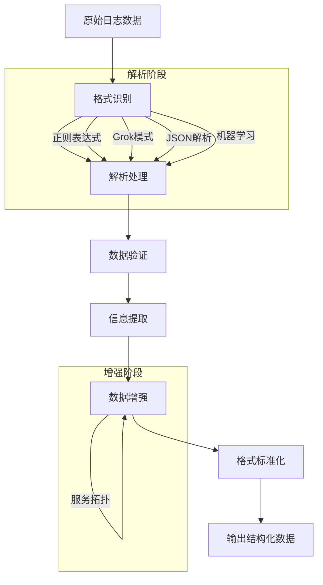

在企业级日志平台建设中，日志解析与处理是将原始日志数据转化为结构化、可分析信息的关键环节。随着系统复杂性的增加和日志数据量的爆炸式增长，如何高效、准确地解析和处理日志数据，成为日志平台发挥价值的核心能力。本文将全面介绍日志解析与处理的核心概念、技术架构和最佳实践。

## 日志解析与处理的重要性

日志解析与处理是日志平台的数据转换层，负责将各种格式的原始日志数据转换为结构化、标准化的格式，为后续的存储、查询和分析提供高质量的数据基础。一个优秀的解析与处理系统不仅能够提升数据质量，还能显著增强日志平台的智能化水平。

### 核心价值

1. **数据标准化**：将异构日志数据转换为统一格式
2. **信息提取**：从非结构化日志中提取关键信息
3. **数据增强**：丰富日志数据的上下文信息
4. **质量控制**：确保日志数据的准确性和完整性
5. **智能处理**：实现自动化的日志分析和异常检测

### 技术挑战

日志解析与处理面临的主要技术挑战包括：

- **格式多样性**：不同系统产生的日志格式差异巨大
- **解析准确性**：确保解析结果的准确性和一致性
- **处理性能**：应对大规模日志数据的实时处理需求
- **错误处理**：妥善处理解析失败和异常情况
- **扩展性要求**：支持不断增长的数据处理需求

## 日志解析技术架构

现代日志解析系统通常采用管道式架构设计，通过多个处理阶段逐步完成日志数据的解析和转换。

### 解析管道架构



### 解析技术分类

#### 基于规则的解析

基于预定义规则的解析是最常见的日志解析方式，适用于格式相对固定的日志数据。

```java
// 基于正则表达式的日志解析器
public class RegexLogParser {
    private final Map<String, Pattern> patterns;
    
    public RegexLogParser() {
        this.patterns = new HashMap<>();
        initializePatterns();
    }
    
    private void initializePatterns() {
        // Nginx访问日志模式
        patterns.put("nginx_access", Pattern.compile(
            "^(\\S+) \\S+ \\S+ \\[(.*?)\\] \"(\\S+) (\\S+) (\\S+)\" (\\d+) (\\d+) \"(.*?)\" \"(.*?)\"$"
        ));
        
        // 应用日志模式
        patterns.put("app_log", Pattern.compile(
            "^(\\d{4}-\\d{2}-\\d{2} \\d{2}:\\d{2}:\\d{2}\\.\\d{3}) \\[(\\w+)\\] \\[(.*?)\\] (.*?)$"
        ));
    }
    
    public ParsedLog parse(String logLine, String logType) {
        Pattern pattern = patterns.get(logType);
        if (pattern == null) {
            throw new IllegalArgumentException("Unsupported log type: " + logType);
        }
        
        Matcher matcher = pattern.matcher(logLine);
        if (matcher.matches()) {
            return extractFields(matcher, logType);
        }
        
        return null;
    }
    
    private ParsedLog extractFields(Matcher matcher, String logType) {
        ParsedLog parsedLog = new ParsedLog();
        parsedLog.setRawMessage(matcher.group(0));
        parsedLog.setTimestamp(extractTimestamp(matcher, logType));
        parsedLog.setLevel(extractLevel(matcher, logType));
        
        // 根据日志类型提取特定字段
        switch (logType) {
            case "nginx_access":
                parsedLog.setClientIp(matcher.group(1));
                parsedLog.setTimestamp(matcher.group(2));
                parsedLog.setMethod(matcher.group(3));
                parsedLog.setPath(matcher.group(4));
                parsedLog.setStatusCode(Integer.parseInt(matcher.group(6)));
                parsedLog.setResponseSize(Long.parseLong(matcher.group(7)));
                break;
                
            case "app_log":
                parsedLog.setTimestamp(matcher.group(1));
                parsedLog.setLevel(matcher.group(2));
                parsedLog.setService(matcher.group(3));
                parsedLog.setMessage(matcher.group(4));
                break;
        }
        
        return parsedLog;
    }
}
```

#### 基于模板的解析

基于模板的解析通过预定义的日志模板来匹配和解析日志数据。

```xml
<!-- Grok模板示例 -->
<grok>
  <pattern name="NGINX_ACCESS">
    %{IPORHOST:clientip} %{USER:ident} %{USER:auth} \[%{HTTPDATE:timestamp}\] "%{WORD:verb} %{DATA:request} HTTP/%{NUMBER:httpversion}" %{NUMBER:response} (?:%{NUMBER:bytes}|-) %{QS:referrer} %{QS:agent}
  </pattern>
  
  <pattern name="APP_LOG">
    %{TIMESTAMP_ISO8601:timestamp} \[%{LOGLEVEL:level}\] \[%{DATA:service}\] %{GREEDYDATA:message}
  </pattern>
</grok>
```

#### 基于机器学习的解析

基于机器学习的解析能够自动识别和解析未知格式的日志数据。

```python
# 基于机器学习的日志解析器
class MLLogParser:
    def __init__(self):
        self.model = self.load_parsing_model()
        self.template_library = self.load_template_library()
    
    def parse_log(self, log_line):
        """使用机器学习解析日志"""
        # 1. 特征提取
        features = self.extract_features(log_line)
        
        # 2. 模式识别
        pattern_type = self.model.predict(features)
        
        # 3. 模板匹配
        if pattern_type in self.template_library:
            template = self.template_library[pattern_type]
            parsed_data = self.apply_template(log_line, template)
            return parsed_data
        
        # 4. 自动模板生成
        new_template = self.generate_template(log_line)
        self.template_library[pattern_type] = new_template
        parsed_data = self.apply_template(log_line, new_template)
        
        return parsed_data
    
    def extract_features(self, log_line):
        """提取日志特征"""
        features = {
            'length': len(log_line),
            'word_count': len(log_line.split()),
            'digit_ratio': sum(c.isdigit() for c in log_line) / len(log_line),
            'special_char_ratio': sum(c in '!@#$%^&*()' for c in log_line) / len(log_line),
            'timestamp_pattern': self.detect_timestamp_pattern(log_line),
            'ip_pattern': self.detect_ip_pattern(log_line)
        }
        return features
```

## 日志处理技术实现

日志处理是在解析基础上进行的进一步数据转换和增强操作。

### 数据过滤与路由

```java
// 日志过滤与路由处理器
public class LogFilterRouter {
    private final List<FilterRule> filterRules;
    private final Map<String, LogDestination> destinations;
    
    public LogFilterRouter() {
        this.filterRules = loadFilterRules();
        this.destinations = initializeDestinations();
    }
    
    public void processLog(ParsedLog log) {
        // 1. 应用过滤规则
        if (shouldFilter(log)) {
            return;  // 过滤掉该日志
        }
        
        // 2. 确定路由目标
        List<String> targetDestinations = determineDestinations(log);
        
        // 3. 路由到目标系统
        for (String destination : targetDestinations) {
            routeLog(log, destination);
        }
    }
    
    private boolean shouldFilter(ParsedLog log) {
        for (FilterRule rule : filterRules) {
            if (rule.matches(log)) {
                return rule.shouldFilter();
            }
        }
        return false;
    }
    
    private List<String> determineDestinations(ParsedLog log) {
        List<String> targets = new ArrayList<>();
        
        for (Map.Entry<String, LogDestination> entry : destinations.entrySet()) {
            if (entry.getValue().shouldAccept(log)) {
                targets.add(entry.getKey());
            }
        }
        
        return targets;
    }
    
    private void routeLog(ParsedLog log, String destination) {
        LogDestination dest = destinations.get(destination);
        if (dest != null) {
            dest.send(log);
        }
    }
}
```

### 数据增强处理

```java
// 日志数据增强处理器
public class LogEnrichmentProcessor {
    private final GeoIPService geoIPService;
    private final UserService userService;
    private final ServiceTopologyService topologyService;
    
    public LogEnrichmentProcessor() {
        this.geoIPService = new GeoIPService();
        this.userService = new UserService();
        this.topologyService = new ServiceTopologyService();
    }
    
    public EnrichedLog enrichLog(ParsedLog parsedLog) {
        EnrichedLog enrichedLog = new EnrichedLog(parsedLog);
        
        // 1. 地理位置增强
        if (parsedLog.getClientIp() != null) {
            GeoInfo geoInfo = geoIPService.lookup(parsedLog.getClientIp());
            enrichedLog.setGeoInfo(geoInfo);
        }
        
        // 2. 用户信息增强
        if (parsedLog.getUserId() != null) {
            UserInfo userInfo = userService.getUserInfo(parsedLog.getUserId());
            enrichedLog.setUserInfo(userInfo);
        }
        
        // 3. 服务拓扑增强
        if (parsedLog.getService() != null) {
            ServiceInfo serviceInfo = topologyService.getServiceInfo(parsedLog.getService());
            enrichedLog.setServiceInfo(serviceInfo);
        }
        
        // 4. 时间维度增强
        if (parsedLog.getTimestamp() != null) {
            enrichedLog.setHourOfDay(parsedLog.getTimestamp().getHour());
            enrichedLog.setDayOfWeek(parsedLog.getTimestamp().getDayOfWeek().getValue());
        }
        
        return enrichedLog;
    }
}
```

## 智能日志处理

### 异常检测

```python
# 基于统计的异常检测
class StatisticalAnomalyDetector:
    def __init__(self):
        self.baseline_stats = {}
        self.alert_threshold = 3.0  # 3倍标准差
    
    def detect_anomalies(self, log_batch):
        """检测日志异常"""
        anomalies = []
        
        for log in log_batch:
            # 计算关键指标
            metrics = self.extract_metrics(log)
            
            # 检查每个指标是否异常
            for metric_name, metric_value in metrics.items():
                if self.is_anomalous(metric_name, metric_value):
                    anomaly = AnomalyLog(log, metric_name, metric_value)
                    anomalies.append(anomaly)
        
        return anomalies
    
    def is_anomalous(self, metric_name, metric_value):
        """判断指标是否异常"""
        if metric_name not in self.baseline_stats:
            return False
        
        baseline = self.baseline_stats[metric_name]
        z_score = abs(metric_value - baseline.mean) / baseline.std
        
        return z_score > self.alert_threshold
```

### 模式识别

```java
// 日志模式识别器
public class LogPatternRecognizer {
    private final ClusteringAlgorithm clusteringAlgorithm;
    private final PatternLibrary patternLibrary;
    
    public LogPatternRecognizer() {
        this.clusteringAlgorithm = new ClusteringAlgorithm();
        this.patternLibrary = new PatternLibrary();
    }
    
    public List<LogPattern> recognizePatterns(List<ParsedLog> logs) {
        // 1. 特征提取
        List<LogFeature> features = extractFeatures(logs);
        
        // 2. 聚类分析
        List<Cluster> clusters = clusteringAlgorithm.cluster(features);
        
        // 3. 模式识别
        List<LogPattern> patterns = new ArrayList<>();
        for (Cluster cluster : clusters) {
            LogPattern pattern = identifyPattern(cluster);
            patterns.add(pattern);
        }
        
        return patterns;
    }
    
    private LogPattern identifyPattern(Cluster cluster) {
        // 识别聚类中的共同特征
        LogPattern pattern = new LogPattern();
        pattern.setTemplate(cluster.getTemplate());
        pattern.setFrequency(cluster.getSize());
        pattern.setExamples(cluster.getSampleLogs());
        
        return pattern;
    }
}
```

## 实时流处理

### Flink流处理实现

```java
// 基于Flink的日志流处理
public class FlinkLogProcessor {
    public static void main(String[] args) throws Exception {
        StreamExecutionEnvironment env = StreamExecutionEnvironment.getExecutionEnvironment();
        
        // 1. 定义数据源
        DataStream<String> logStream = env.addSource(new KafkaSource<>("logs-topic"));
        
        // 2. 解析日志
        DataStream<ParsedLog> parsedStream = logStream
            .map(new LogParserFunction())
            .filter(Objects::nonNull);
        
        // 3. 数据增强
        DataStream<EnrichedLog> enrichedStream = parsedStream
            .map(new LogEnrichmentFunction());
        
        // 4. 异常检测
        DataStream<Alert> alertStream = enrichedStream
            .filter(log -> isAnomalous(log))
            .map(log -> createAlert(log));
        
        // 5. 输出结果
        enrichedStream.addSink(new ElasticsearchSink<>("logs-enriched"));
        alertStream.addSink(new KafkaSink<>("alerts-topic"));
        
        env.execute("Log Processing Pipeline");
    }
}
```

### Spark Streaming实现

```scala
// 基于Spark Streaming的日志处理
class SparkLogProcessor {
  def processLogs(): Unit = {
    val conf = new SparkConf().setAppName("LogProcessor")
    val ssc = new StreamingContext(conf, Seconds(10))
    
    // 1. 定义数据流
    val logStream = KafkaUtils.createDirectStream[String, String](
      ssc, 
      LocationStrategies.PreferConsistent,
      ConsumerStrategies.Subscribe[String, String](Set("logs-topic"), kafkaParams)
    )
    
    // 2. 解析和处理
    val processedStream = logStream
      .map(record => parseLog(record.value()))
      .filter(_.isDefined)
      .map(_.get)
      .transform(rdd => enrichLogs(rdd))
    
    // 3. 统计分析
    val statsStream = processedStream
      .map(log => (log.service, 1))
      .reduceByKey(_ + _)
    
    // 4. 输出结果
    statsStream.print()
    processedStream.foreachRDD(rdd => saveToElasticsearch(rdd))
    
    ssc.start()
    ssc.awaitTermination()
  }
}
```

## 质量控制与监控

### 数据质量监控

```java
// 数据质量监控器
public class DataQualityMonitor {
    private final MeterRegistry meterRegistry;
    private final Counter parseSuccessCounter;
    private final Counter parseFailureCounter;
    private final Timer parseTimer;
    private final Gauge errorRateGauge;
    
    public DataQualityMonitor(MeterRegistry meterRegistry) {
        this.meterRegistry = meterRegistry;
        this.parseSuccessCounter = Counter.builder("log.parse.success")
            .description("Number of successful log parses")
            .register(meterRegistry);
        this.parseFailureCounter = Counter.builder("log.parse.failure")
            .description("Number of failed log parses")
            .register(meterRegistry);
        this.parseTimer = Timer.builder("log.parse.duration")
            .description("Log parsing duration")
            .register(meterRegistry);
    }
    
    public ParsedLog monitorParse(Supplier<ParsedLog> parseOperation) {
        long startTime = System.nanoTime();
        try {
            ParsedLog result = parseOperation.get();
            parseSuccessCounter.increment();
            return result;
        } catch (Exception e) {
            parseFailureCounter.increment();
            throw e;
        } finally {
            long duration = System.nanoTime() - startTime;
            parseTimer.record(duration, TimeUnit.NANOSECONDS);
        }
    }
}
```

### 错误处理机制

```java
// 错误处理机制
public class ErrorHandler {
    private final DeadLetterQueue deadLetterQueue;
    private final RetryManager retryManager;
    
    public void handleParseError(String rawLog, Exception error) {
        ErrorRecord errorRecord = new ErrorRecord(rawLog, error);
        
        // 1. 记录到死信队列
        deadLetterQueue.enqueue(errorRecord);
        
        // 2. 尝试重试
        if (retryManager.shouldRetry(error)) {
            retryManager.scheduleRetry(() -> reprocessLog(rawLog));
        }
        
        // 3. 发送告警
        if (isCriticalError(error)) {
            alertManager.sendAlert("Critical parse error", error.getMessage());
        }
    }
}
```

## 最佳实践总结

### 1. 解析策略选择

```yaml
# 解析策略最佳实践
parsing_strategies:
  structured_logs:
    format: json
    parser: json_parser
    validation: strict
  
  semi_structured_logs:
    format: key_value
    parser: kv_parser
    validation: loose
  
  unstructured_logs:
    format: text
    parser: grok_parser
    validation: pattern_based
```

### 2. 性能优化建议

```bash
# 性能优化措施
# 1. 使用预编译的正则表达式
# 2. 实施批量处理
# 3. 启用并行处理
# 4. 使用缓存减少重复计算
# 5. 优化内存使用
```

### 3. 可靠性保障措施

```java
// 可靠性保障实现
public class ReliableLogProcessor {
    public void processLogReliably(String logLine) {
        try {
            // 1. 解析日志
            ParsedLog parsedLog = parseLog(logLine);
            
            // 2. 增强数据
            EnrichedLog enrichedLog = enrichLog(parsedLog);
            
            // 3. 存储数据
            storeLog(enrichedLog);
            
        } catch (Exception e) {
            // 4. 错误处理
            handleError(logLine, e);
        }
    }
}
```

## 总结

日志解析与处理是构建智能化日志平台的核心环节，它直接影响整个系统的数据质量和分析能力。通过合理选择解析技术、实施高效的数据处理流程、建立完善的质量控制机制，并持续优化性能和可靠性，我们可以构建一个强大而智能的日志解析与处理系统。

关键要点包括：

1. **技术选型**：根据日志特点选择合适的解析技术
2. **架构设计**：采用管道式架构实现模块化处理
3. **智能处理**：集成机器学习和统计分析能力
4. **质量保障**：建立完善的数据质量监控体系
5. **性能优化**：通过各种优化手段提升处理性能

在后续章节中，我们将深入探讨日志检索与展示、日志报警与指标化等关键技术，帮助您构建完整的日志平台解决方案。