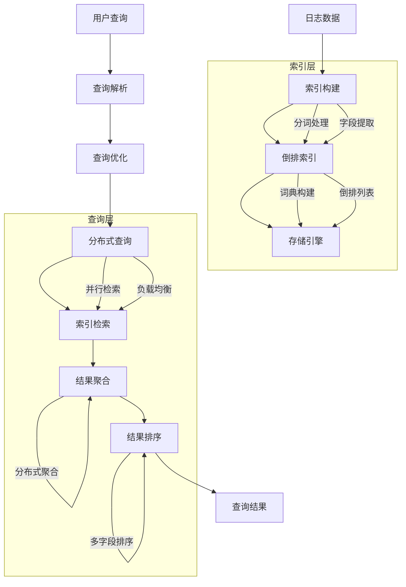

在企业级日志平台建设中，日志搜索引擎是提供高效日志检索和分析能力的核心组件。随着日志数据量的爆炸式增长和查询复杂度的不断提升，如何选择合适的搜索引擎技术并进行性能优化，成为日志平台建设中的关键技术挑战。本文将深入探讨主流日志搜索引擎的技术特点、选型策略和优化实践。

## 日志搜索引擎核心技术

日志搜索引擎是专门针对日志数据特点设计的搜索系统，需要具备高吞吐量、低延迟、强扩展性等特点。

### 搜索引擎架构



### 核心技术组件

#### 倒排索引

倒排索引是搜索引擎的核心数据结构，通过建立词汇到文档的映射关系来加速查询。

```java
// 倒排索引实现示例
public class InvertedIndex {
    // 词汇到文档列表的映射
    private final Map<String, List<Posting>> invertedIndex;
    
    // 文档到词汇列表的映射
    private final Map<String, List<String>> forwardIndex;
    
    public void addDocument(String docId, String content) {
        // 分词处理
        List<String> terms = tokenize(content);
        
        // 构建倒排索引
        for (String term : terms) {
            invertedIndex.computeIfAbsent(term, k -> new ArrayList<>())
                        .add(new Posting(docId, calculateTermFrequency(term, content)));
        }
        
        // 构建正向索引
        forwardIndex.put(docId, terms);
    }
    
    public List<String> search(String query) {
        List<String> queryTerms = tokenize(query);
        List<Set<String>> docSets = new ArrayList<>();
        
        // 获取每个查询词对应的文档集合
        for (String term : queryTerms) {
            List<Posting> postings = invertedIndex.get(term);
            if (postings != null) {
                Set<String> docIds = postings.stream()
                    .map(Posting::getDocId)
                    .collect(Collectors.toSet());
                docSets.add(docIds);
            } else {
                // 如果某个词不存在，返回空结果
                return new ArrayList<>();
            }
        }
        
        // 计算交集
        return computeIntersection(docSets);
    }
    
    private List<String> computeIntersection(List<Set<String>> docSets) {
        if (docSets.isEmpty()) {
            return new ArrayList<>();
        }
        
        Set<String> result = new HashSet<>(docSets.get(0));
        for (int i = 1; i < docSets.size(); i++) {
            result.retainAll(docSets.get(i));
        }
        
        return new ArrayList<>(result);
    }
}

// 倒排索引项
class Posting {
    private final String docId;
    private final int termFrequency;
    private final List<Integer> positions;
    
    public Posting(String docId, int termFrequency) {
        this.docId = docId;
        this.termFrequency = termFrequency;
        this.positions = new ArrayList<>();
    }
    
    // getters...
}
```

#### 分布式架构

现代日志搜索引擎通常采用分布式架构来处理大规模数据和高并发查询。

```yaml
# Elasticsearch分布式架构示例
elasticsearch_cluster:
  # 主节点
  master_nodes:
    - name: es-master-1
      host: 10.0.1.10
      roles: [master]
    
    - name: es-master-2
      host: 10.0.1.11
      roles: [master]
    
    - name: es-master-3
      host: 10.0.1.12
      roles: [master]
  
  # 数据节点
  data_nodes:
    - name: es-data-1
      host: 10.0.2.10
      roles: [data]
      storage: 2TB SSD
    
    - name: es-data-2
      host: 10.0.2.11
      roles: [data]
      storage: 2TB SSD
    
    - name: es-data-3
      host: 10.0.2.12
      roles: [data]
      storage: 2TB SSD
  
  # 协调节点
  coordinating_nodes:
    - name: es-coord-1
      host: 10.0.3.10
      roles: [ingest]
    
    - name: es-coord-2
      host: 10.0.3.11
      roles: [ingest]
```

## 主流搜索引擎对比分析

### Elasticsearch

Elasticsearch是目前最流行的开源搜索引擎，广泛应用于日志分析场景。

#### 核心特性

1. **全文搜索**：支持复杂的全文搜索和过滤
2. **实时分析**：提供实时的数据分析能力
3. **水平扩展**：支持集群水平扩展
4. **生态丰富**：与Kibana等工具无缝集成

#### 配置优化

```json
// Elasticsearch性能优化配置
{
  "settings": {
    "index": {
      "number_of_shards": 5,
      "number_of_replicas": 1,
      "refresh_interval": "30s",
      "translog": {
        "durability": "async",
        "sync_interval": "30s"
      },
      "merge": {
        "policy": {
          "max_merge_at_once": 10,
          "segments_per_tier": 10
        }
      },
      "blocks": {
        "read_only_allow_delete": "false"
      }
    }
  },
  "mappings": {
    "properties": {
      "@timestamp": { 
        "type": "date",
        "format": "date_time"
      },
      "level": { 
        "type": "keyword"
      },
      "service": { 
        "type": "keyword" 
      },
      "host": { 
        "type": "keyword" 
      },
      "trace_id": { 
        "type": "keyword" 
      },
      "message": { 
        "type": "text",
        "analyzer": "standard"
      },
      "response_time": { 
        "type": "integer" 
      }
    }
  }
}
```

#### 查询优化

```java
// Elasticsearch查询优化示例
public class ElasticsearchQueryOptimizer {
    public SearchRequest optimizeSearchRequest(SearchRequest request) {
        SearchRequest optimized = new SearchRequest();
        
        // 1. 使用filter上下文优化布尔查询
        BoolQueryBuilder boolQuery = QueryBuilders.boolQuery();
        
        // 将精确匹配条件放入filter上下文
        request.getExactMatches().forEach((field, value) -> {
            boolQuery.filter(QueryBuilders.termQuery(field, value));
        });
        
        // 将范围查询放入filter上下文
        request.getRangeQueries().forEach(range -> {
            boolQuery.filter(QueryBuilders.rangeQuery(range.getField())
                .gte(range.getGte())
                .lte(range.getLte()));
        });
        
        // 只将需要评分的查询放入must上下文
        request.getMustQueries().forEach(query -> {
            boolQuery.must(query);
        });
        
        optimized.query(boolQuery);
        
        // 2. 优化排序
        if (request.getSorts() != null) {
            request.getSorts().forEach(sort -> {
                optimized.addSort(sort.getField(), sort.getOrder());
            });
        }
        
        // 3. 优化分页
        optimized.from(request.getFrom());
        optimized.size(Math.min(request.getSize(), 10000));  // 限制最大返回数量
        
        // 4. 优化聚合
        if (request.getAggregations() != null) {
            request.getAggregations().forEach(agg -> {
                optimized.addAggregation(agg);
            });
        }
        
        return optimized;
    }
}
```

### OpenSearch

OpenSearch是Elasticsearch的开源分支，解决了许可证问题。

#### 核心特性

1. **开源自由**：完全开源，无许可证限制
2. **兼容性好**：与Elasticsearch API高度兼容
3. **社区活跃**：拥有活跃的开源社区支持
4. **功能丰富**：提供丰富的搜索和分析功能

#### 配置示例

```yaml
# OpenSearch配置优化
opensearch.yml:
  cluster.name: log-cluster
  node.name: ${HOSTNAME}
  network.host: 0.0.0.0
  discovery.seed_hosts: ["host1", "host2", "host3"]
  cluster.initial_master_nodes: ["host1", "host2", "host3"]
  
  # 性能优化配置
  thread_pool.search.size: 20
  thread_pool.search.queue_size: 1000
  indices.query.bool.max_clause_count: 4096
  
  # 内存优化
  indices.memory.index_buffer_size: 10%
  indices.memory.min_index_buffer_size: 48mb
  indices.memory.max_index_buffer_size: 2gb
```

### ClickHouse

ClickHouse是专为在线分析处理（OLAP）设计的列式数据库。

#### 核心特性

1. **查询性能**：提供极高的查询性能
2. **列式存储**：优化分析查询性能
3. **高压缩比**：显著降低存储空间占用
4. **向量化执行**：提供极高的查询性能

#### 表结构设计

```sql
-- ClickHouse日志表设计
CREATE TABLE logs (
    timestamp DateTime64(3),
    level String,
    service String,
    host String,
    trace_id String,
    span_id String,
    message String,
    response_time UInt32,
    status_code UInt16,
    user_id String
) ENGINE = MergeTree()
PARTITION BY toYYYYMMDD(timestamp)
ORDER BY (timestamp, service, level)
SETTINGS index_granularity = 8192;

-- 创建物化视图优化聚合查询
CREATE MATERIALIZED VIEW logs_summary
ENGINE = AggregatingMergeTree()
PARTITION BY toYYYYMM(timestamp)
ORDER BY (service, level, toDate(timestamp))
AS SELECT
    service,
    level,
    toDate(timestamp) as date,
    count(*) as log_count,
    avg(response_time) as avg_response_time,
    countIf(level = 'ERROR') as error_count
FROM logs
GROUP BY service, level, toDate(timestamp);
```

#### 查询优化

```sql
-- ClickHouse查询优化示例
-- 1. 使用预聚合视图
SELECT 
    service,
    level,
    sum(log_count) as total_logs,
    avg(avg_response_time) as avg_response_time,
    sum(error_count) as error_count
FROM logs_summary
WHERE date >= today() - 7
GROUP BY service, level
ORDER BY error_count DESC
LIMIT 10;

-- 2. 使用索引优化
SELECT 
    timestamp,
    service,
    message
FROM logs
WHERE timestamp >= now() - INTERVAL 1 HOUR
    AND service = 'user-service'
    AND level = 'ERROR'
ORDER BY timestamp DESC
LIMIT 100;

-- 3. 使用投影优化
SELECT 
    service,
    count(*) as log_count
FROM logs
WHERE timestamp >= now() - INTERVAL 1 DAY
GROUP BY service
ORDER BY log_count DESC
LIMIT 20
SETTINGS optimize_aggregation_in_order = 1;
```

## 搜索引擎选型策略

### 选型评估维度

```yaml
# 搜索引擎选型评估矩阵
search_engine_evaluation:
  elasticsearch:
    全文搜索能力: 优秀
    实时分析能力: 优秀
    查询性能: 良好
    存储效率: 一般
    扩展性: 优秀
    生态系统: 优秀
    许可证: SSPL限制
    适用场景: 全文搜索、实时分析
  
  opensearch:
    全文搜索能力: 优秀
    实时分析能力: 优秀
    查询性能: 良好
    存储效率: 一般
    扩展性: 优秀
    生态系统: 良好
    许可证: Apache 2.0
    适用场景: 全文搜索、实时分析
  
  clickhouse:
    全文搜索能力: 一般
    实时分析能力: 优秀
    查询性能: 优秀
    存储效率: 优秀
    扩展性: 良好
    生态系统: 一般
    许可证: Apache 2.0
    适用场景: OLAP分析、大规模聚合
```

### 场景化选型建议

```java
// 搜索引擎选型决策器
public class SearchEngineSelector {
    public SearchEngine selectEngine(SearchScenario scenario) {
        switch (scenario.getType()) {
            case FULL_TEXT_SEARCH:
                return selectForFullTextSearch(scenario);
                
            case REAL_TIME_ANALYSIS:
                return selectForRealTimeAnalysis(scenario);
                
            case OLAP_ANALYSIS:
                return selectForOLAPAnalysis(scenario);
                
            case HYBRID_SCENARIO:
                return selectForHybridScenario(scenario);
                
            default:
                return SearchEngine.ELASTICSEARCH;
        }
    }
    
    private SearchEngine selectForFullTextSearch(SearchScenario scenario) {
        if (scenario.isOpenSourceRequired()) {
            return SearchEngine.OPENSEARCH;
        }
        return SearchEngine.ELASTICSEARCH;
    }
    
    private SearchEngine selectForRealTimeAnalysis(SearchScenario scenario) {
        if (scenario.hasHighPerformanceRequirement()) {
            return SearchEngine.CLICKHOUSE;
        }
        return SearchEngine.ELASTICSEARCH;
    }
    
    private SearchEngine selectForOLAPAnalysis(SearchScenario scenario) {
        if (scenario.hasMassiveDataVolume()) {
            return SearchEngine.CLICKHOUSE;
        }
        return SearchEngine.ELASTICSEARCH;
    }
    
    private SearchEngine selectForHybridScenario(SearchScenario scenario) {
        // 混合场景可以考虑多引擎架构
        return SearchEngine.HYBRID;
    }
}
```

## 性能优化实践

### 索引优化

```java
// 索引优化器
public class IndexOptimizer {
    public void optimizeIndex(String indexName, ElasticsearchClient client) {
        try {
            // 1. 强制合并段
            ForceMergeRequest forceMergeRequest = ForceMergeRequest.of(f -> f
                .index(indexName)
                .maxNumSegments(1)
            );
            client.indices().forceMerge(forceMergeRequest);
            
            // 2. 刷新索引
            RefreshRequest refreshRequest = RefreshRequest.of(r -> r
                .index(indexName)
            );
            client.indices().refresh(refreshRequest);
            
            // 3. 优化设置
            UpdateSettingsRequest settingsRequest = UpdateSettingsRequest.of(u -> u
                .index(indexName)
                .settings(s -> s
                    .refreshInterval("30s")
                    .translog(t -> t
                        .durability(TranslogDurability.REQUEST)
                    )
                )
            );
            client.indices().putSettings(settingsRequest);
            
        } catch (IOException e) {
            logger.error("Failed to optimize index: " + indexName, e);
        }
    }
}
```

### 查询缓存优化

```java
// 查询缓存实现
public class QueryCache {
    private final Cache<String, SearchResult> queryCache;
    private final ScheduledExecutorService cacheCleaner;
    
    public QueryCache() {
        this.queryCache = Caffeine.newBuilder()
            .maximumSize(10000)
            .expireAfterWrite(5, TimeUnit.MINUTES)
            .build();
        this.cacheCleaner = Executors.newScheduledThreadPool(1);
        
        // 定期清理过期缓存
        startCacheCleaning();
    }
    
    public SearchResult getCachedResult(String queryKey) {
        return queryCache.getIfPresent(queryKey);
    }
    
    public void cacheResult(String queryKey, SearchResult result) {
        queryCache.put(queryKey, result);
    }
    
    private void startCacheCleaning() {
        cacheCleaner.scheduleWithFixedDelay(() -> {
            queryCache.cleanUp();
        }, 1, 1, TimeUnit.MINUTES);
    }
}

// 智能缓存策略
public class IntelligentQueryCache {
    private final QueryCache queryCache;
    private final QueryAnalyzer queryAnalyzer;
    
    public SearchResult executeQueryWithCache(SearchRequest request) {
        // 生成查询键
        String queryKey = generateQueryKey(request);
        
        // 检查缓存
        SearchResult cachedResult = queryCache.getCachedResult(queryKey);
        if (cachedResult != null) {
            logger.debug("Cache hit for query: " + queryKey);
            return cachedResult;
        }
        
        // 分析查询特征
        QueryCharacteristics characteristics = queryAnalyzer.analyze(request);
        
        // 判断是否适合缓存
        if (shouldCacheQuery(characteristics)) {
            SearchResult result = executeQuery(request);
            queryCache.cacheResult(queryKey, result);
            return result;
        } else {
            return executeQuery(request);
        }
    }
    
    private boolean shouldCacheQuery(QueryCharacteristics characteristics) {
        // 高频查询且结果稳定才缓存
        return characteristics.getFrequency() > 10 && 
               characteristics.getVolatility() < 0.1;
    }
}
```

### 分片策略优化

```java
// 分片策略优化器
public class ShardStrategyOptimizer {
    public void optimizeShardStrategy(String indexName, long dataSize, ElasticsearchClient client) {
        try {
            // 计算最优分片数
            int optimalShardCount = calculateOptimalShardCount(dataSize);
            
            // 获取当前分片数
            GetIndicesSettingsRequest settingsRequest = GetIndicesSettingsRequest.of(g -> g
                .index(indexName)
            );
            GetIndicesSettingsResponse settingsResponse = client.indices().getSettings(settingsRequest);
            
            Integer currentShardCount = settingsResponse.result().get(indexName)
                .settings().index().numberOfShards();
            
            // 如果需要调整分片数
            if (currentShardCount != null && currentShardCount != optimalShardCount) {
                logger.info("Optimizing shard count for index {}: {} -> {}", 
                           indexName, currentShardCount, optimalShardCount);
                
                // 重建索引到新的分片配置
                reindexWithOptimalShards(indexName, optimalShardCount, client);
            }
            
        } catch (IOException e) {
            logger.error("Failed to optimize shard strategy for index: " + indexName, e);
        }
    }
    
    private int calculateOptimalShardCount(long dataSize) {
        // 基于数据大小计算分片数（每个分片建议20-40GB）
        long shardSizeGB = dataSize / (1024 * 1024 * 1024);
        int shardCount = (int) Math.max(1, shardSizeGB / 30);  // 每个分片30GB
        
        // 确保分片数不超过节点数的20倍
        int maxShards = getNodeCount() * 20;
        return Math.min(shardCount, maxShards);
    }
}
```

## 监控与调优

### 性能监控

```java
// 搜索引擎性能监控器
public class SearchEngineMonitor {
    private final MeterRegistry meterRegistry;
    private final Timer queryTimer;
    private final Counter queryCounter;
    private final Counter errorCounter;
    private final Gauge clusterHealth;
    
    public SearchEngineMonitor(MeterRegistry meterRegistry) {
        this.meterRegistry = meterRegistry;
        this.queryTimer = Timer.builder("search.query.duration")
            .description("Search query duration")
            .register(meterRegistry);
        this.queryCounter = Counter.builder("search.query.count")
            .description("Number of search queries")
            .register(meterRegistry);
        this.errorCounter = Counter.builder("search.error.count")
            .description("Number of search errors")
            .register(meterRegistry);
        this.clusterHealth = Gauge.builder("search.cluster.health")
            .description("Search cluster health status")
            .register(meterRegistry, this::getClusterHealth);
    }
    
    public SearchResult monitorQuery(Supplier<SearchResult> queryOperation) {
        long startTime = System.nanoTime();
        try {
            SearchResult result = queryOperation.get();
            queryCounter.increment();
            return result;
        } catch (Exception e) {
            errorCounter.increment();
            throw e;
        } finally {
            long duration = System.nanoTime() - startTime;
            queryTimer.record(duration, TimeUnit.NANOSECONDS);
        }
    }
}
```

### 告警规则配置

```yaml
# Prometheus告警规则
groups:
- name: search-engine-alerts
  rules:
  - alert: HighQueryLatency
    expr: histogram_quantile(0.95, rate(search_query_duration_seconds_bucket[5m])) > 1
    for: 2m
    labels:
      severity: warning
    annotations:
      summary: "High search query latency"
      description: "95th percentile search query latency exceeded 1 second"
      
  - alert: HighErrorRate
    expr: rate(search_error_count[5m]) / rate(search_query_count[5m]) > 0.05
    for: 1m
    labels:
      severity: critical
    annotations:
      summary: "High search error rate"
      description: "Search error rate exceeded 5%"
      
  - alert: ClusterUnhealthy
    expr: search_cluster_health < 1
    for: 1m
    labels:
      severity: critical
    annotations:
      summary: "Search cluster unhealthy"
      description: "Search cluster health status is not green"
```

## 最佳实践总结

### 1. 部署架构建议

```yaml
# 生产环境部署建议
production_deployment:
  elasticsearch:
    节点配置:
      master_nodes: 3台 (专用)
      data_nodes: 根据数据量确定
      coordinating_nodes: 2-3台
    资源配置:
      heap_size: 物理内存的50%，不超过32GB
      storage: SSD存储，预留50%空间
      network: 千兆网络，低延迟
  
  opensearch:
    节点配置:
      master_nodes: 3台 (专用)
      data_nodes: 根据数据量确定
      coordinating_nodes: 2-3台
    资源配置:
      heap_size: 物理内存的50%
      storage: SSD存储
      network: 高速网络
  
  clickhouse:
    节点配置:
      shard_nodes: 根据数据量确定
      replica_nodes: 每个分片2个副本
    资源配置:
      memory: 充足的内存用于缓存
      storage: 大容量SSD存储
      cpu: 多核心CPU优化向量化执行
```

### 2. 性能调优建议

```bash
# 性能调优措施
# 1. 合理设置分片数和副本数
# 2. 优化索引映射和字段类型
# 3. 配置合适的刷新间隔
# 4. 启用查询缓存和分片缓存
# 5. 优化JVM堆内存设置
# 6. 使用SSD存储提升I/O性能
# 7. 配置合适的线程池大小
# 8. 定期执行索引优化操作
```

### 3. 运维管理建议

```java
// 运维管理最佳实践
public class SearchEngineOperations {
    public void performRoutineMaintenance() {
        // 1. 监控集群健康状态
        checkClusterHealth();
        
        // 2. 清理过期索引
        cleanupExpiredIndices();
        
        // 3. 优化索引性能
        optimizeIndices();
        
        // 4. 监控资源使用情况
        monitorResourceUsage();
        
        // 5. 备份重要数据
        backupCriticalIndices();
    }
    
    private void checkClusterHealth() {
        ClusterHealthRequest healthRequest = ClusterHealthRequest.of(c -> c
            .waitForStatus WaitForStatus.GREEN)
        );
        // 执行健康检查
    }
    
    private void cleanupExpiredIndices() {
        // 删除超过保留期限的索引
    }
    
    private void optimizeIndices() {
        // 执行索引优化操作
    }
}
```

## 总结

日志搜索引擎是日志平台的核心组件，通过合理选择和优化搜索引擎技术，我们可以构建高性能、高可用的日志检索系统。Elasticsearch适合全文搜索和实时分析场景，OpenSearch提供了开源替代方案，而ClickHouse在OLAP分析场景下表现出色。

关键要点包括：

1. **技术选型**：根据业务需求选择合适的搜索引擎技术
2. **性能优化**：通过索引优化、查询优化、缓存优化等手段提升性能
3. **架构设计**：采用合理的分布式架构和分片策略
4. **监控告警**：建立完善的监控体系及时发现和处理问题
5. **运维管理**：实施规范的运维管理流程保障系统稳定运行

在实际应用中，需要根据具体的业务场景、数据特征和技术要求来选择和优化搜索引擎，确保其能够满足系统的性能、可靠性和扩展性要求。