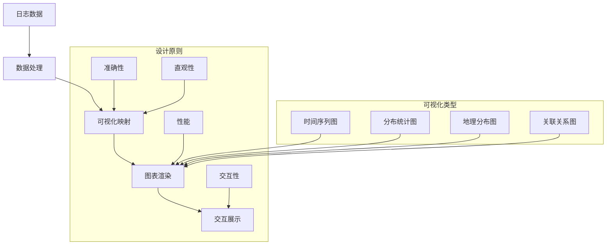

在企业级日志平台建设中，日志可视化是将复杂的日志数据转化为直观、易懂的图表和仪表板的关键环节。通过有效的可视化展示，运维人员和业务分析师可以快速理解系统状态、识别异常模式、发现业务趋势，从而提升问题排查效率和业务洞察能力。本文将深入探讨日志可视化的核心技术、主流工具和最佳实践。

## 日志可视化的核心概念

日志可视化是将结构化的日志数据通过图形化的方式展示给用户的过程，旨在帮助用户更直观地理解和分析日志信息。

### 可视化设计原则



### 可视化价值

1. **模式识别**：通过图表快速识别数据模式和异常
2. **趋势分析**：直观展示数据变化趋势
3. **异常检测**：及时发现系统异常和问题
4. **决策支持**：为业务决策提供数据支持
5. **沟通协作**：促进团队间的数据沟通和协作

## 主流可视化工具对比

### Kibana

Kibana是Elastic Stack的可视化工具，与Elasticsearch深度集成。

#### 核心特性

1. **集成度高**：与Elasticsearch无缝集成
2. **功能丰富**：提供多种可视化图表类型
3. **交互性强**：支持丰富的用户交互操作
4. **扩展性好**：支持插件扩展

#### 仪表板配置

```json
// Kibana仪表板配置示例
{
  "title": "应用监控仪表板",
  "description": "应用性能和错误监控",
  "panels": [
    {
      "id": "error-trend",
      "type": "visualization",
      "gridData": {
        "x": 0,
        "y": 0,
        "w": 24,
        "h": 12
      },
      "panelIndex": "1",
      "embeddableConfig": {
        "vis": {
          "type": "line",
          "params": {
            "type": "line",
            "grid": {
              "categoryLines": false
            },
            "categoryAxes": [
              {
                "id": "CategoryAxis-1",
                "type": "category",
                "position": "bottom",
                "show": true
              }
            ],
            "valueAxes": [
              {
                "id": "ValueAxis-1",
                "name": "LeftAxis-1",
                "type": "value",
                "position": "left",
                "show": true
              }
            ]
          }
        }
      }
    },
    {
      "id": "service-distribution",
      "type": "visualization",
      "gridData": {
        "x": 0,
        "y": 12,
        "w": 12,
        "h": 12
      },
      "panelIndex": "2",
      "embeddableConfig": {
        "vis": {
          "type": "pie",
          "params": {
            "type": "pie",
            "addTooltip": true,
            "addLegend": true,
            "legendPosition": "right",
            "isDonut": false
          }
        }
      }
    }
  ]
}
```

#### 可视化类型

```javascript
// Kibana可视化配置示例
// 1. 时间序列图
{
  "title": "错误日志趋势",
  "type": "line",
  "data": {
    "index": "logs-*",
    "metrics": [
      {
        "id": "1",
        "type": "count",
        "field": "level"
      }
    ],
    "bucket": {
      "id": "2",
      "type": "date_histogram",
      "field": "@timestamp",
      "interval": "1h"
    },
    "filters": [
      {
        "input": {
          "query": {
            "query_string": {
              "query": "level:ERROR"
            }
          }
        }
      }
    ]
  }
}

// 2. 柱状图
{
  "title": "服务错误分布",
  "type": "histogram",
  "data": {
    "index": "logs-*",
    "metrics": [
      {
        "id": "1",
        "type": "count"
      }
    ],
    "bucket": {
      "id": "2",
      "type": "terms",
      "field": "service.keyword",
      "size": 10
    },
    "filters": [
      {
        "input": {
          "query": {
            "query_string": {
              "query": "level:ERROR"
            }
          }
        }
      }
    ]
  }
}
```

### Grafana

Grafana是流行的开源可视化平台，支持多种数据源。

#### 核心特性

1. **多数据源支持**：支持多种数据源集成
2. **插件生态**：拥有丰富的插件生态系统
3. **告警功能**：内置强大的告警功能
4. **模板化**：支持仪表板模板化管理

#### 仪表板配置

```yaml
# Grafana仪表板配置示例
dashboard:
  title: "日志监控仪表板"
  description: "系统日志监控和分析"
  tags: ["logs", "monitoring", "elk"]
  timezone: "browser"
  panels:
    - title: "错误日志趋势"
      type: "graph"
      datasource: "Elasticsearch"
      gridPos:
        x: 0
        y: 0
        w: 12
        h: 8
      targets:
        - query: "level:ERROR"
          bucketAggs:
            - type: "date_histogram"
              field: "@timestamp"
              id: "2"
              settings:
                interval: "1h"
                min_doc_count: 0
          metrics:
            - type: "count"
              id: "1"
      options:
        tooltip:
          mode: "single"
        legend:
          displayMode: "list"
          placement: "bottom"
    
    - title: "服务错误分布"
      type: "piechart"
      datasource: "Elasticsearch"
      gridPos:
        x: 12
        y: 0
        w: 12
        h: 8
      targets:
        - query: "level:ERROR"
          bucketAggs:
            - type: "terms"
              field: "service.keyword"
              id: "2"
              settings:
                size: "10"
          metrics:
            - type: "count"
              id: "1"
```

#### 告警配置

```yaml
# Grafana告警规则配置
alerting:
  - name: "高错误率告警"
    condition: "A > 100"
    datasource: "Elasticsearch"
    query:
      - refId: "A"
        query: "level:ERROR"
        bucketAggs:
          - type: "date_histogram"
            field: "@timestamp"
            id: "2"
            settings:
              interval: "1m"
        metrics:
          - type: "count"
            id: "1"
    notifications:
      - uid: "slack-notification"
        settings:
          channel: "#alerts"
          username: "Grafana"
```

### 自定义可视化

#### 基于D3.js的可视化

```html
<!-- 自定义日志可视化示例 -->
<!DOCTYPE html>
<html>
<head>
    <title>日志可视化</title>
    <script src="https://d3js.org/d3.v7.min.js"></script>
    <style>
        .chart-container {
            width: 100%;
            height: 400px;
        }
        .bar {
            fill: steelblue;
        }
        .bar:hover {
            fill: orange;
        }
        .axis {
            font: 10px sans-serif;
        }
        .axis path,
        .axis line {
            fill: none;
            stroke: #000;
            shape-rendering: crispEdges;
        }
    </style>
</head>
<body>
    <div id="log-chart" class="chart-container"></div>
    
    <script>
        class LogVisualizer {
            constructor(containerId) {
                this.container = d3.select(`#${containerId}`);
                this.margin = {top: 20, right: 30, bottom: 40, left: 50};
                this.width = 800 - this.margin.left - this.margin.right;
                this.height = 400 - this.margin.top - this.margin.bottom;
                
                this.initChart();
            }
            
            initChart() {
                // 创建SVG容器
                this.svg = this.container.append("svg")
                    .attr("width", this.width + this.margin.left + this.margin.right)
                    .attr("height", this.height + this.margin.top + this.margin.bottom);
                
                // 创建图表组
                this.chart = this.svg.append("g")
                    .attr("transform", `translate(${this.margin.left},${this.margin.top})`);
                
                // 创建比例尺
                this.xScale = d3.scaleBand()
                    .range([0, this.width])
                    .padding(0.1);
                
                this.yScale = d3.scaleLinear()
                    .range([this.height, 0]);
                
                // 创建坐标轴
                this.xAxis = this.chart.append("g")
                    .attr("class", "x axis")
                    .attr("transform", `translate(0,${this.height})`);
                
                this.yAxis = this.chart.append("g")
                    .attr("class", "y axis");
            }
            
            render(data) {
                // 更新比例尺
                this.xScale.domain(data.map(d => d.service));
                this.yScale.domain([0, d3.max(data, d => d.errorCount)]);
                
                // 更新坐标轴
                this.xAxis.call(d3.axisBottom(this.xScale));
                this.yAxis.call(d3.axisLeft(this.yScale));
                
                // 绑定数据
                const bars = this.chart.selectAll(".bar")
                    .data(data, d => d.service);
                
                // 更新现有元素
                bars.transition()
                    .duration(750)
                    .attr("x", d => this.xScale(d.service))
                    .attr("width", this.xScale.bandwidth())
                    .attr("y", d => this.yScale(d.errorCount))
                    .attr("height", d => this.height - this.yScale(d.errorCount));
                
                // 添加新元素
                bars.enter().append("rect")
                    .attr("class", "bar")
                    .attr("x", d => this.xScale(d.service))
                    .attr("width", this.xScale.bandwidth())
                    .attr("y", d => this.yScale(d.errorCount))
                    .attr("height", d => this.height - this.yScale(d.errorCount))
                    .on("mouseover", (event, d) => {
                        this.showTooltip(event, d);
                    })
                    .on("mouseout", () => {
                        this.hideTooltip();
                    });
                
                // 移除多余元素
                bars.exit().remove();
            }
            
            showTooltip(event, data) {
                // 显示工具提示
                console.log(`Service: ${data.service}, Errors: ${data.errorCount}`);
            }
            
            hideTooltip() {
                // 隐藏工具提示
            }
        }
        
        // 使用示例
        const visualizer = new LogVisualizer("log-chart");
        
        // 模拟数据
        const logData = [
            {service: "user-service", errorCount: 120},
            {service: "order-service", errorCount: 85},
            {service: "payment-service", errorCount: 45},
            {service: "inventory-service", errorCount: 32},
            {service: "notification-service", errorCount: 18}
        ];
        
        // 渲染图表
        visualizer.render(logData);
    </script>
</body>
</html>
```

#### 基于ECharts的可视化

```javascript
// 基于ECharts的日志可视化
class EChartsLogVisualizer {
    constructor(containerId) {
        this.container = document.getElementById(containerId);
        this.chart = echarts.init(this.container);
        this.initChart();
    }
    
    initChart() {
        const option = {
            title: {
                text: '服务错误统计'
            },
            tooltip: {
                trigger: 'axis',
                axisPointer: {
                    type: 'shadow'
                }
            },
            legend: {
                data: ['错误数量']
            },
            grid: {
                left: '3%',
                right: '4%',
                bottom: '3%',
                containLabel: true
            },
            xAxis: [
                {
                    type: 'category',
                    data: [],
                    axisTick: {
                        alignWithLabel: true
                    }
                }
            ],
            yAxis: [
                {
                    type: 'value'
                }
            ],
            series: [
                {
                    name: '错误数量',
                    type: 'bar',
                    barWidth: '60%',
                    data: []
                }
            ]
        };
        
        this.chart.setOption(option);
    }
    
    updateData(data) {
        const services = data.map(item => item.service);
        const errorCounts = data.map(item => item.errorCount);
        
        this.chart.setOption({
            xAxis: {
                data: services
            },
            series: [{
                data: errorCounts
            }]
        });
    }
    
    // 时间序列图
    createTimeSeriesChart() {
        const option = {
            title: {
                text: '错误日志趋势'
            },
            tooltip: {
                trigger: 'axis'
            },
            xAxis: {
                type: 'time',
                boundaryGap: false
            },
            yAxis: {
                type: 'value'
            },
            series: [{
                name: '错误数量',
                type: 'line',
                smooth: true,
                data: []
            }]
        };
        
        this.chart.setOption(option);
    }
    
    updateTimeSeriesData(data) {
        const seriesData = data.map(item => [
            item.timestamp,
            item.errorCount
        ]);
        
        this.chart.setOption({
            series: [{
                data: seriesData
            }]
        });
    }
}
```

## 可视化类型与应用场景

### 时间序列可视化

时间序列可视化是日志分析中最常用的可视化类型，用于展示数据随时间的变化趋势。

```javascript
// 时间序列可视化实现
class TimeSeriesVisualizer {
    constructor(chartContainer) {
        this.chart = echarts.init(chartContainer);
        this.initTimeSeriesChart();
    }
    
    initTimeSeriesChart() {
        const option = {
            title: {
                text: '系统性能监控'
            },
            tooltip: {
                trigger: 'axis'
            },
            legend: {
                data: ['CPU使用率', '内存使用率', '错误率']
            },
            grid: {
                left: '3%',
                right: '4%',
                bottom: '3%',
                containLabel: true
            },
            xAxis: {
                type: 'time',
                boundaryGap: false
            },
            yAxis: {
                type: 'value'
            },
            series: [
                {
                    name: 'CPU使用率',
                    type: 'line',
                    smooth: true,
                    data: []
                },
                {
                    name: '内存使用率',
                    type: 'line',
                    smooth: true,
                    data: []
                },
                {
                    name: '错误率',
                    type: 'line',
                    smooth: true,
                    data: []
                }
            ]
        };
        
        this.chart.setOption(option);
    }
    
    updateRealTimeData(cpuData, memoryData, errorData) {
        const now = new Date();
        
        this.chart.setOption({
            series: [
                {
                    data: [...this.chart.getOption().series[0].data, [now, cpuData]]
                },
                {
                    data: [...this.chart.getOption().series[1].data, [now, memoryData]]
                },
                {
                    data: [...this.chart.getOption().series[2].data, [now, errorData]]
                }
            ]
        });
        
        // 保持最近100个数据点
        this.limitDataPoints(100);
    }
    
    limitDataPoints(maxPoints) {
        const option = this.chart.getOption();
        option.series.forEach(series => {
            if (series.data.length > maxPoints) {
                series.data = series.data.slice(-maxPoints);
            }
        });
        this.chart.setOption(option);
    }
}
```

### 分布统计可视化

分布统计可视化用于展示数据的分布情况，帮助识别异常模式。

```javascript
// 分布统计可视化实现
class DistributionVisualizer {
    constructor(chartContainer) {
        this.chart = echarts.init(chartContainer);
        this.initDistributionChart();
    }
    
    initDistributionChart() {
        const option = {
            title: {
                text: '日志级别分布'
            },
            tooltip: {
                trigger: 'item'
            },
            legend: {
                orient: 'vertical',
                left: 'left'
            },
            series: [
                {
                    name: '日志级别',
                    type: 'pie',
                    radius: '50%',
                    data: [],
                    emphasis: {
                        itemStyle: {
                            shadowBlur: 10,
                            shadowOffsetX: 0,
                            shadowColor: 'rgba(0, 0, 0, 0.5)'
                        }
                    }
                }
            ]
        };
        
        this.chart.setOption(option);
    }
    
    updateDistributionData(data) {
        const pieData = Object.entries(data).map(([level, count]) => ({
            name: level,
            value: count
        }));
        
        this.chart.setOption({
            series: [{
                data: pieData
            }]
        });
    }
    
    // 环形图
    initDonutChart() {
        const option = {
            title: {
                text: '服务错误分布'
            },
            tooltip: {
                trigger: 'item'
            },
            series: [
                {
                    name: '服务错误',
                    type: 'pie',
                    radius: ['40%', '70%'],
                    avoidLabelOverlap: false,
                    data: []
                }
            ]
        };
        
        this.chart.setOption(option);
    }
}
```

### 地理分布可视化

地理分布可视化用于展示日志数据的地理位置分布。

```javascript
// 地理分布可视化实现
class GeoDistributionVisualizer {
    constructor(chartContainer) {
        this.chart = echarts.init(chartContainer);
        this.initGeoChart();
    }
    
    initGeoChart() {
        const option = {
            title: {
                text: '访问日志地理分布'
            },
            tooltip: {
                trigger: 'item'
            },
            geo: {
                map: 'world',
                roam: true,
                emphasis: {
                    label: {
                        show: false
                    }
                }
            },
            series: [
                {
                    name: '访问量',
                    type: 'scatter',
                    coordinateSystem: 'geo',
                    data: [],
                    symbolSize: function (val) {
                        return val[2] / 10;
                    },
                    emphasis: {
                        label: {
                            show: true
                        }
                    }
                }
            ]
        };
        
        this.chart.setOption(option);
    }
    
    updateGeoData(data) {
        // data格式: [{name: '北京', value: [116.46, 39.92, 100]}]
        this.chart.setOption({
            series: [{
                data: data
            }]
        });
    }
}
```

## 交互式仪表板设计

### 仪表板架构

```javascript
// 交互式仪表板实现
class InteractiveDashboard {
    constructor(containerId) {
        this.container = document.getElementById(containerId);
        this.charts = new Map();
        this.filters = new Map();
        this.dataService = new LogDataService();
        this.initDashboard();
    }
    
    initDashboard() {
        // 创建仪表板布局
        this.createLayout();
        
        // 初始化图表
        this.initCharts();
        
        // 绑定事件
        this.bindEvents();
        
        // 加载初始数据
        this.loadData();
    }
    
    createLayout() {
        this.container.innerHTML = `
            <div class="dashboard-header">
                <h1>日志监控仪表板</h1>
                <div class="dashboard-controls">
                    <select id="time-range">
                        <option value="1h">最近1小时</option>
                        <option value="6h">最近6小时</option>
                        <option value="1d" selected>最近1天</option>
                        <option value="7d">最近7天</option>
                    </select>
                    <button id="refresh-btn">刷新</button>
                </div>
            </div>
            <div class="dashboard-filters">
                <div class="filter-group">
                    <label>服务:</label>
                    <select id="service-filter" multiple>
                        <option value="user-service">用户服务</option>
                        <option value="order-service">订单服务</option>
                        <option value="payment-service">支付服务</option>
                    </select>
                </div>
                <div class="filter-group">
                    <label>级别:</label>
                    <select id="level-filter" multiple>
                        <option value="ERROR">错误</option>
                        <option value="WARN">警告</option>
                        <option value="INFO">信息</option>
                    </select>
                </div>
            </div>
            <div class="dashboard-content">
                <div class="chart-row">
                    <div id="time-series-chart" class="chart-container"></div>
                    <div id="distribution-chart" class="chart-container"></div>
                </div>
                <div class="chart-row">
                    <div id="geo-chart" class="chart-container"></div>
                    <div id="table-chart" class="chart-container"></div>
                </div>
            </div>
        `;
    }
    
    initCharts() {
        // 初始化时间序列图
        this.charts.set('timeSeries', new TimeSeriesVisualizer(
            document.getElementById('time-series-chart')
        ));
        
        // 初始化分布图
        this.charts.set('distribution', new DistributionVisualizer(
            document.getElementById('distribution-chart')
        ));
        
        // 初始化地理图
        this.charts.set('geo', new GeoDistributionVisualizer(
            document.getElementById('geo-chart')
        ));
        
        // 初始化表格
        this.charts.set('table', new LogTableVisualizer(
            document.getElementById('table-chart')
        ));
    }
    
    bindEvents() {
        // 时间范围选择事件
        document.getElementById('time-range').addEventListener('change', (e) => {
            this.filters.set('timeRange', e.target.value);
            this.loadData();
        });
        
        // 服务过滤事件
        document.getElementById('service-filter').addEventListener('change', (e) => {
            const selectedServices = Array.from(e.target.selectedOptions).map(option => option.value);
            this.filters.set('services', selectedServices);
            this.loadData();
        });
        
        // 级别过滤事件
        document.getElementById('level-filter').addEventListener('change', (e) => {
            const selectedLevels = Array.from(e.target.selectedOptions).map(option => option.value);
            this.filters.set('levels', selectedLevels);
            this.loadData();
        });
        
        // 刷新按钮事件
        document.getElementById('refresh-btn').addEventListener('click', () => {
            this.loadData();
        });
    }
    
    async loadData() {
        try {
            // 显示加载状态
            this.showLoading();
            
            // 获取过滤条件
            const filters = Object.fromEntries(this.filters);
            
            // 加载数据
            const data = await this.dataService.getDashboardData(filters);
            
            // 更新图表
            this.updateCharts(data);
            
        } catch (error) {
            console.error('加载数据失败:', error);
            this.showError('数据加载失败，请稍后重试');
        } finally {
            this.hideLoading();
        }
    }
    
    updateCharts(data) {
        // 更新时间序列图
        this.charts.get('timeSeries').updateRealTimeData(
            data.cpuUsage,
            data.memoryUsage,
            data.errorRate
        );
        
        // 更新分布图
        this.charts.get('distribution').updateDistributionData(data.levelDistribution);
        
        // 更新地理图
        this.charts.get('geo').updateGeoData(data.geoDistribution);
        
        // 更新表格
        this.charts.get('table').updateTableData(data.recentLogs);
    }
    
    showLoading() {
        // 显示加载状态
        this.container.classList.add('loading');
    }
    
    hideLoading() {
        // 隐藏加载状态
        this.container.classList.remove('loading');
    }
    
    showError(message) {
        // 显示错误信息
        alert(message);
    }
}
```

### 响应式设计

```css
/* 响应式仪表板样式 */
.dashboard-container {
    width: 100%;
    height: 100vh;
    display: flex;
    flex-direction: column;
}

.dashboard-header {
    display: flex;
    justify-content: space-between;
    align-items: center;
    padding: 1rem;
    background-color: #f5f5f5;
    border-bottom: 1px solid #ddd;
}

.dashboard-controls {
    display: flex;
    gap: 1rem;
}

.dashboard-filters {
    display: flex;
    gap: 2rem;
    padding: 1rem;
    background-color: #fafafa;
    border-bottom: 1px solid #eee;
}

.filter-group {
    display: flex;
    align-items: center;
    gap: 0.5rem;
}

.dashboard-content {
    flex: 1;
    overflow: auto;
    padding: 1rem;
}

.chart-row {
    display: flex;
    gap: 1rem;
    margin-bottom: 1rem;
}

.chart-container {
    flex: 1;
    min-width: 300px;
    min-height: 300px;
    background-color: white;
    border: 1px solid #ddd;
    border-radius: 4px;
    padding: 1rem;
}

/* 移动端适配 */
@media (max-width: 768px) {
    .dashboard-header {
        flex-direction: column;
        gap: 1rem;
    }
    
    .dashboard-filters {
        flex-direction: column;
        gap: 1rem;
    }
    
    .chart-row {
        flex-direction: column;
    }
    
    .chart-container {
        min-width: unset;
    }
}

/* 加载状态 */
.dashboard-container.loading::after {
    content: "加载中...";
    position: fixed;
    top: 50%;
    left: 50%;
    transform: translate(-50%, -50%);
    background-color: rgba(0, 0, 0, 0.8);
    color: white;
    padding: 1rem 2rem;
    border-radius: 4px;
    z-index: 1000;
}
```

## 性能优化与最佳实践

### 图表性能优化

```javascript
// 图表性能优化实现
class OptimizedChartVisualizer {
    constructor(containerId) {
        this.container = document.getElementById(containerId);
        this.chart = echarts.init(this.container);
        this.dataBuffer = [];
        this.maxDataPoints = 1000;
        this.throttleTimer = null;
        this.initOptimizedChart();
    }
    
    initOptimizedChart() {
        const option = {
            title: {
                text: '优化后的日志监控'
            },
            tooltip: {
                trigger: 'axis'
            },
            xAxis: {
                type: 'time',
                boundaryGap: false
            },
            yAxis: {
                type: 'value'
            },
            series: [{
                name: '日志数量',
                type: 'line',
                smooth: true,
                showSymbol: false,  // 隐藏数据点提高性能
                data: []
            }],
            // 启用数据区域缩放
            dataZoom: [{
                type: 'inside',
                start: 0,
                end: 100
            }, {
                start: 0,
                end: 100
            }]
        };
        
        this.chart.setOption(option);
    }
    
    // 节流更新数据
    updateDataThrottled(data) {
        this.dataBuffer.push(...data);
        
        if (this.throttleTimer) {
            clearTimeout(this.throttleTimer);
        }
        
        this.throttleTimer = setTimeout(() => {
            this.updateChartData();
            this.dataBuffer = [];
        }, 100);  // 100ms节流
    }
    
    updateChartData() {
        if (this.dataBuffer.length === 0) return;
        
        const currentData = this.chart.getOption().series[0].data;
        const newData = [...currentData, ...this.dataBuffer];
        
        // 限制数据点数量
        const limitedData = newData.slice(-this.maxDataPoints);
        
        this.chart.setOption({
            series: [{
                data: limitedData
            }]
        });
    }
    
    // 懒加载实现
    enableLazyLoading() {
        let observer = new IntersectionObserver((entries) => {
            entries.forEach(entry => {
                if (entry.isIntersecting) {
                    this.loadVisibleData();
                    observer.unobserve(entry.target);
                }
            });
        });
        
        observer.observe(this.container);
    }
    
    loadVisibleData() {
        // 加载可见区域的数据
        console.log('加载可见区域数据');
    }
}
```

### 数据采样优化

```javascript
// 数据采样优化
class DataSamplingOptimizer {
    static sampleData(data, maxPoints) {
        if (data.length <= maxPoints) {
            return data;
        }
        
        // 等距采样
        const step = Math.ceil(data.length / maxPoints);
        const sampledData = [];
        
        for (let i = 0; i < data.length; i += step) {
            sampledData.push(data[i]);
        }
        
        return sampledData;
    }
    
    // 重要性采样
    static importanceSampling(data, maxPoints, importanceFunction) {
        if (data.length <= maxPoints) {
            return data;
        }
        
        // 计算每个数据点的重要性
        const importanceScores = data.map((point, index) => ({
            index,
            score: importanceFunction(point),
            point
        }));
        
        // 按重要性排序
        importanceScores.sort((a, b) => b.score - a.score);
        
        // 选择最重要的点
        const selectedPoints = importanceScores
            .slice(0, maxPoints)
            .map(item => item.point);
        
        return selectedPoints;
    }
    
    // 时间窗口采样
    static timeWindowSampling(data, timeWindowMs) {
        if (data.length === 0) return [];
        
        const sampledData = [];
        let lastTimestamp = data[0].timestamp;
        
        for (let i = 0; i < data.length; i++) {
            const currentTimestamp = data[i].timestamp;
            
            if (currentTimestamp - lastTimestamp >= timeWindowMs) {
                sampledData.push(data[i]);
                lastTimestamp = currentTimestamp;
            }
        }
        
        return sampledData;
    }
}
```

## 监控与告警集成

### 可视化监控

```javascript
// 可视化监控实现
class VisualizationMonitor {
    constructor() {
        this.metrics = {
            renderTime: 0,
            dataPoints: 0,
            memoryUsage: 0,
            errorCount: 0
        };
        this.initMonitoring();
    }
    
    initMonitoring() {
        // 监控渲染性能
        this.monitorRenderPerformance();
        
        // 监控内存使用
        this.monitorMemoryUsage();
        
        // 监控错误
        this.monitorErrors();
    }
    
    monitorRenderPerformance() {
        const observer = new PerformanceObserver((list) => {
            for (const entry of list.getEntries()) {
                if (entry.name === 'render-chart') {
                    this.metrics.renderTime = entry.duration;
                    
                    // 性能告警
                    if (entry.duration > 1000) {
                        this.sendAlert('图表渲染时间过长', {
                            duration: entry.duration,
                            timestamp: new Date().toISOString()
                        });
                    }
                }
            }
        });
        
        observer.observe({entryTypes: ['measure']});
    }
    
    monitorMemoryUsage() {
        setInterval(() => {
            if (performance.memory) {
                this.metrics.memoryUsage = performance.memory.usedJSHeapSize;
                
                // 内存告警
                if (performance.memory.usedJSHeapSize > 0.8 * performance.memory.jsHeapSizeLimit) {
                    this.sendAlert('内存使用率过高', {
                        used: performance.memory.usedJSHeapSize,
                        limit: performance.memory.jsHeapSizeLimit
                    });
                }
            }
        }, 5000);
    }
    
    monitorErrors() {
        window.addEventListener('error', (event) => {
            this.metrics.errorCount++;
            this.sendAlert('可视化组件错误', {
                message: event.message,
                filename: event.filename,
                lineno: event.lineno,
                colno: event.colno
            });
        });
    }
    
    sendAlert(title, details) {
        // 发送告警到监控系统
        console.warn(`告警: ${title}`, details);
    }
}
```

## 最佳实践总结

### 1. 可视化设计原则

```yaml
# 可视化设计最佳实践
visualization_best_practices:
  设计原则:
    准确性: 确保数据准确无误
    直观性: 选择合适的图表类型
    一致性: 保持视觉风格统一
    简洁性: 避免信息过载
  
  图表选择:
    时间序列: 折线图、面积图
    分布统计: 柱状图、饼图
    地理分布: 地图、热力图
    关联关系: 散点图、网络图
  
  交互设计:
    工具提示: 提供详细信息
    缩放功能: 支持数据缩放
    过滤控制: 提供数据过滤
    导出功能: 支持数据导出
```

### 2. 性能优化建议

```javascript
// 性能优化最佳实践
class PerformanceOptimizationGuide {
    static optimizationTips = [
        // 渲染优化
        "使用虚拟滚动处理大量数据",
        "启用图表的性能模式",
        "合理设置数据采样率",
        "使用Web Workers处理复杂计算",
        
        // 内存优化
        "及时销毁不需要的图表实例",
        "限制缓存数据的大小",
        "使用对象池减少GC压力",
        "避免频繁的DOM操作",
        
        // 网络优化
        "实施数据压缩传输",
        "使用CDN加速静态资源",
        "启用HTTP缓存策略",
        "批量请求减少网络开销"
    ];
    
    static applyOptimizations(chart) {
        // 应用性能优化
        chart.setOption({
            // 启用性能优化选项
            animation: false,
            progressive: 1000,
            progressiveThreshold: 3000,
            progressiveChunkMode: 'mod'
        });
    }
}
```

### 3. 用户体验优化

```javascript
// 用户体验优化实现
class UserExperienceOptimizer {
    static enhanceDashboard(dashboard) {
        // 1. 加载状态优化
        dashboard.showLoadingSkeleton();
        
        // 2. 错误处理优化
        dashboard.setupErrorBoundary();
        
        // 3. 响应式优化
        dashboard.enableResponsiveDesign();
        
        // 4. 无障碍优化
        dashboard.improveAccessibility();
        
        // 5. 国际化支持
        dashboard.enableLocalization();
    }
    
    static showLoadingSkeleton() {
        // 显示骨架屏加载效果
        console.log('显示骨架屏加载效果');
    }
    
    static setupErrorBoundary() {
        // 设置错误边界处理
        window.addEventListener('error', (event) => {
            console.error('可视化错误:', event.error);
            // 显示友好的错误提示
        });
    }
}
```

## 总结

日志可视化是日志平台的重要组成部分，通过合理选择和配置可视化工具，设计直观高效的图表和仪表板，我们可以显著提升日志数据的可理解性和分析价值。

关键要点包括：

1. **工具选型**：根据需求选择合适的可视化工具（Kibana、Grafana等）
2. **图表设计**：选择合适的图表类型展示不同类型的数据
3. **交互优化**：提供丰富的交互功能提升用户体验
4. **性能优化**：通过采样、节流等技术优化渲染性能
5. **监控告警**：集成监控告警功能及时发现问题

在实际应用中，需要根据具体的业务场景、用户需求和技术架构来设计和实现日志可视化系统，确保其能够满足系统的性能、可用性和用户体验要求。