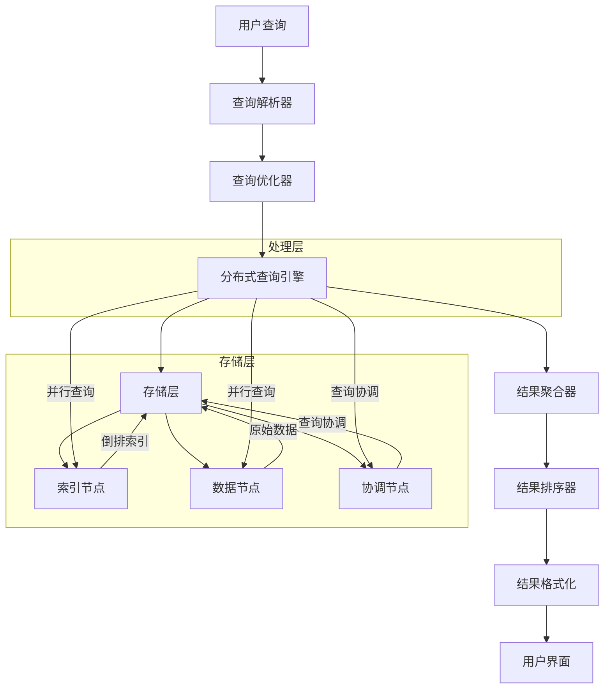
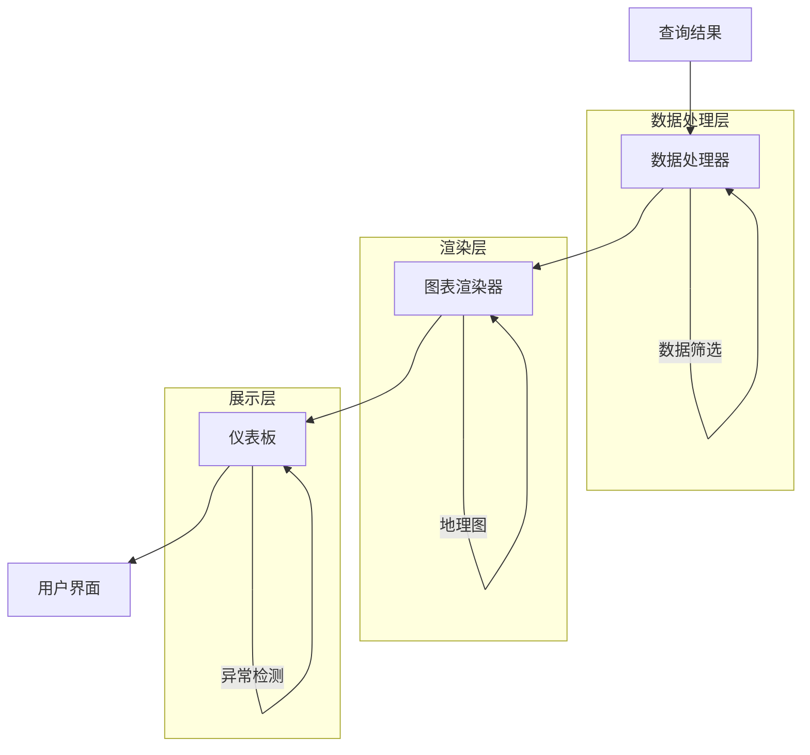

在企业级日志平台建设中，日志检索与展示是用户与日志数据交互的核心界面，直接决定了日志平台的实用价值和用户体验。一个优秀的日志检索与展示系统不仅需要提供强大的查询能力，还要具备直观的可视化界面和高效的性能表现。本文将全面介绍日志检索与展示的核心概念、技术架构和最佳实践。

## 日志检索与展示的重要性

日志检索与展示是日志平台的用户交互层，负责为用户提供高效、直观的日志查询和分析能力。通过完善的检索与展示系统，用户可以快速定位问题、分析系统行为、监控业务状态，从而提升运维效率和业务洞察力。

### 核心价值

1. **快速问题定位**：通过强大的搜索能力快速定位系统问题
2. **直观数据分析**：通过可视化展示直观呈现数据趋势和模式
3. **高效运维支持**：为运维人员提供便捷的操作界面
4. **业务洞察提升**：通过数据分析支持业务决策
5. **用户体验优化**：提供友好、高效的用户交互体验

### 技术挑战

日志检索与展示面临的主要技术挑战包括：

- **查询性能**：应对大规模日志数据的快速查询需求
- **用户体验**：提供直观、易用的交互界面
- **可视化效果**：实现丰富、准确的数据可视化
- **系统集成**：与各种日志存储和处理系统无缝集成
- **权限控制**：实现细粒度的访问控制和数据隔离

## 日志搜索引擎架构

现代日志搜索引擎通常采用分布式架构设计，通过多个组件协同工作来提供高效的日志检索能力。

### 搜索引擎架构



### 主流搜索引擎对比

#### Elasticsearch

Elasticsearch是目前最流行的日志搜索引擎，具有以下特点：

- **全文搜索**：支持复杂的全文搜索和过滤
- **实时分析**：提供实时的数据分析能力
- **水平扩展**：支持集群水平扩展
- **生态丰富**：与Kibana等工具无缝集成

```json
// Elasticsearch查询示例
{
  "query": {
    "bool": {
      "must": [
        {
          "range": {
            "@timestamp": {
              "gte": "now-1h",
              "lte": "now"
            }
          }
        },
        {
          "term": {
            "level": "ERROR"
          }
        }
      ]
    }
  },
  "aggs": {
    "error_count_by_service": {
      "terms": {
        "field": "service.keyword",
        "size": 10
      }
    }
  },
  "sort": [
    {
      "@timestamp": {
        "order": "desc"
      }
    }
  ],
  "size": 100
}
```

#### OpenSearch

OpenSearch是Elasticsearch的开源分支，具有以下特点：

- **开源自由**：完全开源，无许可证限制
- **兼容性好**：与Elasticsearch API高度兼容
- **社区活跃**：拥有活跃的开源社区支持
- **功能丰富**：提供丰富的搜索和分析功能

#### ClickHouse

ClickHouse是专为在线分析处理（OLAP）设计的列式数据库，具有以下特点：

- **查询性能**：提供极高的查询性能
- **列式存储**：优化分析查询性能
- **高压缩比**：显著降低存储空间占用
- **向量化执行**：提供极高的查询性能

```sql
-- ClickHouse查询示例
SELECT 
    service,
    level,
    count(*) as error_count,
    avg(response_time) as avg_response_time
FROM logs
WHERE timestamp >= now() - INTERVAL 1 HOUR
    AND level = 'ERROR'
GROUP BY service, level
ORDER BY error_count DESC
LIMIT 10
```

## 日志可视化展示

日志可视化展示是将查询结果以图表、仪表板等形式直观呈现给用户的重要环节。

### 可视化组件架构



### 主流可视化工具

#### Kibana

Kibana是Elastic Stack的可视化工具，具有以下特点：

- **集成度高**：与Elasticsearch无缝集成
- **功能丰富**：提供多种可视化图表类型
- **交互性强**：支持丰富的用户交互操作
- **扩展性好**：支持插件扩展

```json
// Kibana仪表板配置示例
{
  "title": "应用监控仪表板",
  "panels": [
    {
      "id": "error-trend",
      "type": "visualization",
      "gridData": {
        "x": 0,
        "y": 0,
        "w": 24,
        "h": 12
      },
      "panelIndex": "1",
      "embeddableConfig": {}
    },
    {
      "id": "service-distribution",
      "type": "visualization",
      "gridData": {
        "x": 0,
        "y": 12,
        "w": 12,
        "h": 12
      },
      "panelIndex": "2",
      "embeddableConfig": {}
    }
  ]
}
```

#### Grafana

Grafana是流行的开源可视化平台，具有以下特点：

- **多数据源支持**：支持多种数据源集成
- **插件生态**：拥有丰富的插件生态系统
- **告警功能**：内置强大的告警功能
- **模板化**：支持仪表板模板化管理

```yaml
# Grafana仪表板配置示例
dashboard:
  title: "日志监控仪表板"
  panels:
    - title: "错误日志趋势"
      type: "graph"
      datasource: "Elasticsearch"
      targets:
        - query: "level:ERROR"
          bucketAggs:
            - type: "date_histogram"
              field: "@timestamp"
              id: "2"
          metrics:
            - type: "count"
              id: "1"
    
    - title: "服务错误分布"
      type: "piechart"
      datasource: "Elasticsearch"
      targets:
        - query: "level:ERROR"
          bucketAggs:
            - type: "terms"
              field: "service.keyword"
              id: "2"
          metrics:
            - type: "count"
              id: "1"
```

## 查询优化技术

高效的查询优化是日志检索系统性能的关键保障。

### 索引优化

```json
// Elasticsearch索引优化配置
{
  "settings": {
    "index": {
      "number_of_shards": 5,
      "number_of_replicas": 1,
      "refresh_interval": "30s",
      "translog": {
        "durability": "async",
        "sync_interval": "30s"
      },
      "merge": {
        "policy": {
          "max_merge_at_once": 10,
          "segments_per_tier": 10
        }
      }
    }
  },
  "mappings": {
    "properties": {
      "@timestamp": { 
        "type": "date",
        "format": "date_time"
      },
      "level": { 
        "type": "keyword"  // 使用keyword而非text
      },
      "service": { 
        "type": "keyword" 
      },
      "host": { 
        "type": "keyword" 
      },
      "trace_id": { 
        "type": "keyword" 
      },
      "message": { 
        "type": "text",
        "analyzer": "standard"
      }
    }
  }
}
```

### 查询语句优化

```java
// 查询优化器实现
public class QueryOptimizer {
    public OptimizedQuery optimize(Query query) {
        OptimizedQuery optimized = new OptimizedQuery();
        
        // 1. 查询重写
        optimized.setRewrittenQuery(rewriteQuery(query));
        
        // 2. 过滤器优化
        optimized.setOptimizedFilters(optimizeFilters(query.getFilters()));
        
        // 3. 排序优化
        optimized.setOptimizedSorts(optimizeSorts(query.getSorts()));
        
        // 4. 聚合优化
        optimized.setOptimizedAggregations(optimizeAggregations(query.getAggregations()));
        
        return optimized;
    }
    
    private Query rewriteQuery(Query query) {
        // 布尔查询优化
        if (query instanceof BoolQuery) {
            return optimizeBoolQuery((BoolQuery) query);
        }
        
        // 范围查询优化
        if (query instanceof RangeQuery) {
            return optimizeRangeQuery((RangeQuery) query);
        }
        
        return query;
    }
    
    private BoolQuery optimizeBoolQuery(BoolQuery boolQuery) {
        // 将filter查询提升到顶层
        List<Query> mustQueries = boolQuery.getMustQueries();
        List<Query> filterQueries = boolQuery.getFilterQueries();
        
        // 合并相似的查询条件
        filterQueries = mergeSimilarFilters(filterQueries);
        
        return new BoolQuery()
            .must(mustQueries)
            .filter(filterQueries);
    }
}
```

## 权限控制与多租户管理

在企业环境中，日志系统的权限控制和多租户管理是保障数据安全的重要环节。

### 基于角色的访问控制

```java
// RBAC权限控制系统
public class LogAccessControl {
    private final RoleBasedAccessManager accessManager;
    private final TenantManager tenantManager;
    
    public boolean canAccessLog(User user, LogEntry log) {
        // 1. 租户隔离检查
        if (!tenantManager.isSameTenant(user, log)) {
            return false;
        }
        
        // 2. 角色权限检查
        if (!accessManager.hasPermission(user, "log:read")) {
            return false;
        }
        
        // 3. 数据敏感性检查
        if (log.isSensitive() && !accessManager.hasPermission(user, "log:read:sensitive")) {
            return false;
        }
        
        return true;
    }
    
    public List<LogEntry> queryLogs(User user, Query query) {
        // 1. 应用租户过滤
        Query tenantFilteredQuery = tenantManager.applyTenantFilter(user, query);
        
        // 2. 应用权限过滤
        Query permissionFilteredQuery = accessManager.applyPermissionFilter(user, tenantFilteredQuery);
        
        // 3. 执行查询
        return executeQuery(permissionFilteredQuery);
    }
}

// 角色权限管理器
class RoleBasedAccessManager {
    private final Map<String, Set<String>> rolePermissions;
    
    public RoleBasedAccessManager() {
        this.rolePermissions = new HashMap<>();
        initializeRolePermissions();
    }
    
    private void initializeRolePermissions() {
        // 管理员角色
        rolePermissions.put("admin", Set.of(
            "log:*",
            "dashboard:*",
            "alert:*"
        ));
        
        // 开发者角色
        rolePermissions.put("developer", Set.of(
            "log:read",
            "log:search",
            "dashboard:read"
        ));
        
        // 运维角色
        rolePermissions.put("ops", Set.of(
            "log:read",
            "log:search",
            "log:alert",
            "dashboard:read",
            "dashboard:write"
        ));
    }
    
    public boolean hasPermission(User user, String permission) {
        Set<String> userPermissions = getUserPermissions(user);
        return userPermissions.contains(permission) || 
               userPermissions.stream().anyMatch(p -> permission.startsWith(p + ":*"));
    }
    
    private Set<String> getUserPermissions(User user) {
        Set<String> permissions = new HashSet<>();
        for (String role : user.getRoles()) {
            Set<String> rolePerms = rolePermissions.get(role);
            if (rolePerms != null) {
                permissions.addAll(rolePerms);
            }
        }
        return permissions;
    }
}
```

### 多租户数据隔离

```java
// 多租户管理器
public class TenantManager {
    public Query applyTenantFilter(User user, Query query) {
        String tenantId = user.getTenantId();
        if (tenantId == null) {
            return query;
        }
        
        // 添加租户过滤条件
        TermQuery tenantFilter = new TermQuery("tenant_id", tenantId);
        
        if (query instanceof BoolQuery) {
            BoolQuery boolQuery = (BoolQuery) query;
            return boolQuery.filter(tenantFilter);
        } else {
            return new BoolQuery()
                .must(query)
                .filter(tenantFilter);
        }
    }
    
    public boolean isSameTenant(User user, LogEntry log) {
        String userTenantId = user.getTenantId();
        String logTenantId = log.getTenantId();
        
        if (userTenantId == null) {
            return true;  // 系统管理员可以访问所有数据
        }
        
        return userTenantId.equals(logTenantId);
    }
}
```

## 用户体验优化

优秀的用户体验是日志检索与展示系统成功的关键因素。

### 智能搜索建议

```java
// 智能搜索建议器
public class IntelligentSearchSuggester {
    private final SuggestionEngine suggestionEngine;
    private final UserBehaviorAnalyzer behaviorAnalyzer;
    
    public List<SearchSuggestion> getSuggestions(String query, User user) {
        List<SearchSuggestion> suggestions = new ArrayList<>();
        
        // 1. 基于历史查询的建议
        suggestions.addAll(getHistoryBasedSuggestions(query, user));
        
        // 2. 基于热门查询的建议
        suggestions.addAll(getPopularSuggestions(query));
        
        // 3. 基于上下文的建议
        suggestions.addAll(getContextBasedSuggestions(query, user));
        
        // 4. 基于语法的建议
        suggestions.addAll(getSyntaxBasedSuggestions(query));
        
        return suggestions.stream()
            .distinct()
            .limit(10)
            .collect(Collectors.toList());
    }
    
    private List<SearchSuggestion> getHistoryBasedSuggestions(String query, User user) {
        List<String> historyQueries = behaviorAnalyzer.getUserQueryHistory(user);
        return historyQueries.stream()
            .filter(q -> q.toLowerCase().contains(query.toLowerCase()))
            .map(q -> new SearchSuggestion(q, "history"))
            .collect(Collectors.toList());
    }
    
    private List<SearchSuggestion> getPopularSuggestions(String query) {
        List<String> popularQueries = behaviorAnalyzer.getPopularQueries();
        return popularQueries.stream()
            .filter(q -> q.toLowerCase().contains(query.toLowerCase()))
            .map(q -> new SearchSuggestion(q, "popular"))
            .collect(Collectors.toList());
    }
}

// 搜索建议实体
class SearchSuggestion {
    private final String text;
    private final String type;
    private final int score;
    
    public SearchSuggestion(String text, String type) {
        this.text = text;
        this.type = type;
        this.score = calculateScore();
    }
    
    private int calculateScore() {
        // 基于多种因素计算建议得分
        return text.length() + (type.equals("popular") ? 10 : 0);
    }
    
    // getters...
}
```

### 个性化仪表板

```java
// 个性化仪表板管理器
public class PersonalizedDashboardManager {
    private final DashboardTemplateManager templateManager;
    private final UserPreferenceManager preferenceManager;
    
    public Dashboard getPersonalizedDashboard(User user) {
        // 1. 获取用户偏好设置
        UserPreferences preferences = preferenceManager.getPreferences(user);
        
        // 2. 获取默认模板
        DashboardTemplate template = templateManager.getTemplate(preferences.getPreferredTemplate());
        
        // 3. 应用用户自定义配置
        Dashboard personalizedDashboard = applyUserCustomizations(template, preferences);
        
        // 4. 应用智能推荐
        personalizedDashboard = applyIntelligentRecommendations(personalizedDashboard, user);
        
        return personalizedDashboard;
    }
    
    private Dashboard applyUserCustomizations(DashboardTemplate template, UserPreferences preferences) {
        Dashboard dashboard = template.toDashboard();
        
        // 应用用户自定义的面板布局
        if (preferences.getCustomLayout() != null) {
            dashboard.applyLayout(preferences.getCustomLayout());
        }
        
        // 应用用户自定义的时间范围
        if (preferences.getDefaultTimeRange() != null) {
            dashboard.setDefaultTimeRange(preferences.getDefaultTimeRange());
        }
        
        return dashboard;
    }
}
```

## 监控与告警

完善的监控与告警机制是保障日志检索与展示系统稳定运行的重要手段。

### 系统性能监控

```java
// 检索系统监控器
public class SearchSystemMonitor {
    private final MeterRegistry meterRegistry;
    private final Timer queryTimer;
    private final Counter queryCounter;
    private final Counter errorCounter;
    private final Gauge activeConnections;
    
    public SearchSystemMonitor(MeterRegistry meterRegistry) {
        this.meterRegistry = meterRegistry;
        this.queryTimer = Timer.builder("search.query.duration")
            .description("Search query duration")
            .register(meterRegistry);
        this.queryCounter = Counter.builder("search.query.count")
            .description("Number of search queries")
            .register(meterRegistry);
        this.errorCounter = Counter.builder("search.error.count")
            .description("Number of search errors")
            .register(meterRegistry);
        this.activeConnections = Gauge.builder("search.active.connections")
            .description("Number of active search connections")
            .register(meterRegistry, this::getActiveConnectionCount);
    }
    
    public SearchResult monitorQuery(Supplier<SearchResult> queryOperation) {
        long startTime = System.nanoTime();
        try {
            SearchResult result = queryOperation.get();
            queryCounter.increment();
            return result;
        } catch (Exception e) {
            errorCounter.increment();
            throw e;
        } finally {
            long duration = System.nanoTime() - startTime;
            queryTimer.record(duration, TimeUnit.NANOSECONDS);
        }
    }
}
```

### 用户行为监控

```java
// 用户行为监控器
public class UserBehaviorMonitor {
    private final EventLogger eventLogger;
    
    public void logSearchQuery(User user, String query, long durationMs, int resultCount) {
        Map<String, Object> eventData = new HashMap<>();
        eventData.put("user_id", user.getId());
        eventData.put("query", query);
        eventData.put("duration_ms", durationMs);
        eventData.put("result_count", resultCount);
        eventData.put("timestamp", System.currentTimeMillis());
        
        eventLogger.logEvent("search_query", eventData);
    }
    
    public void logDashboardView(User user, String dashboardId) {
        Map<String, Object> eventData = new HashMap<>();
        eventData.put("user_id", user.getId());
        eventData.put("dashboard_id", dashboardId);
        eventData.put("timestamp", System.currentTimeMillis());
        
        eventLogger.logEvent("dashboard_view", eventData);
    }
}
```

## 最佳实践总结

### 1. 搜索引擎选型建议

```yaml
# 搜索引擎选型指南
search_engine_selection:
  elasticsearch:
   适用场景:
      - 全文搜索需求强烈
      - 实时分析要求高
      - 与Kibana集成
    优势:
      - 生态系统完善
      - 社区支持活跃
      - 功能丰富
    劣势:
      - 资源消耗较大
      - 许可证限制
  
  opensearch:
    适用场景:
      - 开源要求严格
      - 与ES兼容性要求
      - 社区驱动项目
    优势:
      - 完全开源
      - API兼容ES
      - 社区活跃
    劣势:
      - 生态相对较小
      - 功能更新可能滞后
  
  clickhouse:
    适用场景:
      - 大规模数据分析
      - OLAP查询需求
      - 性能要求极高
    优势:
      - 查询性能卓越
      - 存储压缩率高
      - 列式存储优化
    劣势:
      - 实时搜索能力弱
      - 生态系统相对简单
```

### 2. 性能优化策略

```bash
# 性能优化措施
# 1. 合理设计索引结构
# 2. 优化查询语句
# 3. 实施缓存策略
# 4. 配置合适的分片和副本
# 5. 定期维护和优化索引
# 6. 监控系统性能指标
```

### 3. 用户体验优化

```java
// 用户体验优化实现
public class UserExperienceOptimizer {
    public void optimizeSearchExperience(SearchRequest request, User user) {
        // 1. 智能查询建议
        provideIntelligentSuggestions(request, user);
        
        // 2. 查询结果预览
        provideResultPreview(request);
        
        // 3. 个性化排序
        applyPersonalizedSorting(request, user);
        
        // 4. 响应式设计
        optimizeForDeviceType(request);
    }
}
```

## 总结

日志检索与展示是日志平台与用户交互的核心环节，通过合理选择搜索引擎技术、优化查询性能、实施权限控制、提升用户体验和完善监控告警，我们可以构建一个高效、安全、易用的日志检索与展示系统。

关键要点包括：

1. **技术选型**：根据业务需求选择合适的搜索引擎技术
2. **性能优化**：通过索引优化、查询优化等手段提升检索性能
3. **权限控制**：实施完善的RBAC和多租户数据隔离机制
4. **用户体验**：提供智能搜索建议和个性化展示功能
5. **监控告警**：建立完善的系统监控和用户行为监控体系

在后续章节中，我们将深入探讨日志报警与指标化、日志平台化能力等关键技术，帮助您构建完整的日志平台解决方案。