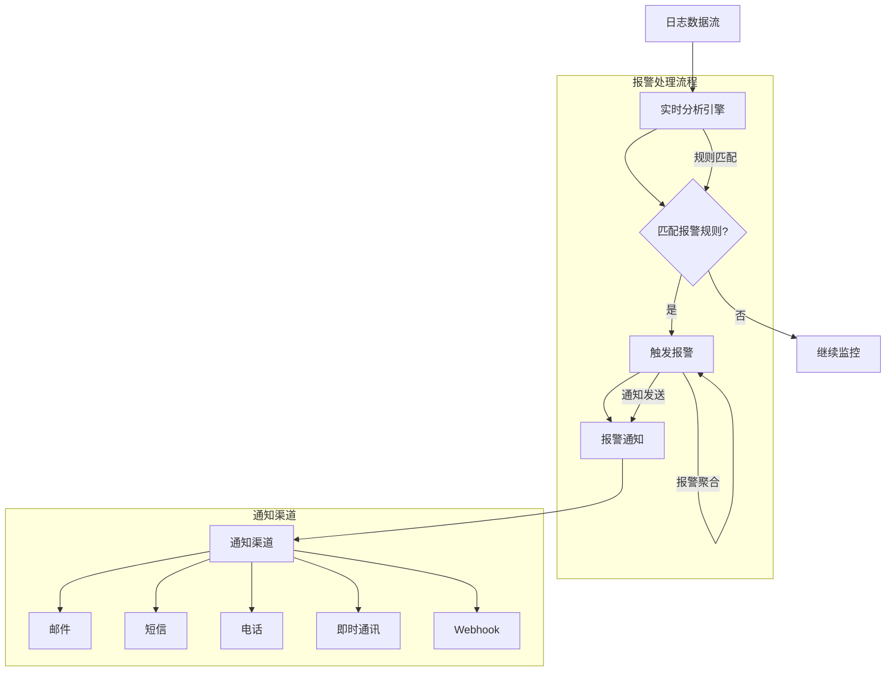

日志驱动的报警是现代运维体系中的核心组件，它通过分析日志数据来自动检测系统异常并及时发出预警。从最初简单的关键字匹配到如今基于机器学习的智能预警，日志驱动的报警技术经历了快速的发展和演进。本文将深入探讨日志驱动报警的核心技术、实现方法和最佳实践。

## 日志驱动报警的核心概念

日志驱动的报警是一种基于日志数据分析的自动化预警机制，它能够实时监控系统状态，识别异常模式，并在问题发生或即将发生时及时通知相关人员。

### 报警的基本原理

日志驱动报警的核心原理是通过对日志数据进行实时分析，识别出符合预定义规则或异常模式的日志事件，并触发相应的报警通知。



### 报警的关键要素

一个完整的日志驱动报警系统包含以下几个关键要素：

1. **数据源**：提供日志数据的来源
2. **规则引擎**：定义和执行报警规则
3. **匹配算法**：识别符合规则的日志事件
4. **通知机制**：发送报警通知给相关人员
5. **抑制机制**：避免报警风暴和重复通知
6. **反馈循环**：收集报警效果反馈并优化规则

## 报警类型与实现方式

根据实现方式和技术特点，日志驱动的报警可以分为多种类型，每种类型都有其适用场景和实现方法。

### 基于关键字/模式的报警

基于关键字或模式的报警是最基础也是最常用的报警类型，它通过匹配日志中的特定文本或模式来触发报警。

#### 实现原理

```java
// 关键字报警实现
public class KeywordAlertRule implements AlertRule {
    private final String name;
    private final String keyword;
    private final String service;
    private final int threshold;
    private final Duration window;
    
    public boolean matches(LogEvent logEvent) {
        // 检查服务匹配
        if (service != null && !service.equals(logEvent.getService())) {
            return false;
        }
        
        // 检查关键字匹配
        if (logEvent.getMessage().contains(keyword)) {
            return true;
        }
        
        return false;
    }
    
    public boolean shouldTrigger(List<LogEvent> recentEvents) {
        // 在时间窗口内统计匹配事件数量
        long count = recentEvents.stream()
            .filter(this::matches)
            .count();
        
        return count >= threshold;
    }
}

// 正则表达式报警实现
public class RegexAlertRule implements AlertRule {
    private final String name;
    private final Pattern pattern;
    private final String service;
    private final int threshold;
    private final Duration window;
    
    public boolean matches(LogEvent logEvent) {
        // 检查服务匹配
        if (service != null && !service.equals(logEvent.getService())) {
            return false;
        }
        
        // 检查正则表达式匹配
        Matcher matcher = pattern.matcher(logEvent.getMessage());
        return matcher.find();
    }
}
```

#### 应用场景

```yaml
# 关键字报警应用场景
keyword_alert_scenarios:
  - name: "数据库连接失败"
    pattern: "Failed to connect to database"
    service: "user-service"
    threshold: 5
    window: "1m"
    severity: "critical"
  
  - name: "认证失败"
    pattern: "Authentication failed for user"
    service: "auth-service"
    threshold: 10
    window: "5m"
    severity: "warning"
  
  - name: "内存溢出"
    pattern: "OutOfMemoryError"
    threshold: 1
    window: "1m"
    severity: "emergency"
```

### 基于统计/阈值的报警

基于统计和阈值的报警通过监控日志中的统计指标，当指标超过预设阈值时触发报警。

#### 实现原理

```java
// 统计报警实现
public class StatisticalAlertRule implements AlertRule {
    private final String name;
    private final String metric;
    private final ComparisonOperator operator;
    private final double threshold;
    private final Duration window;
    
    public boolean shouldTrigger(List<LogEvent> recentEvents) {
        // 计算统计指标
        double currentValue = calculateMetric(recentEvents, metric);
        
        // 比较阈值
        return operator.compare(currentValue, threshold);
    }
    
    private double calculateMetric(List<LogEvent> events, String metricName) {
        switch (metricName) {
            case "error_rate":
                return calculateErrorRate(events);
            case "response_time_avg":
                return calculateAverageResponseTime(events);
            case "request_count":
                return events.size();
            default:
                throw new IllegalArgumentException("Unsupported metric: " + metricName);
        }
    }
    
    private double calculateErrorRate(List<LogEvent> events) {
        long errorCount = events.stream()
            .filter(event -> isErrorLevel(event.getLevel()))
            .count();
        
        return (double) errorCount / events.size();
    }
    
    private double calculateAverageResponseTime(List<LogEvent> events) {
        return events.stream()
            .mapToLong(event -> parseResponseTime(event.getMessage()))
            .average()
            .orElse(0.0);
    }
}

// 比较操作符枚举
public enum ComparisonOperator {
    GREATER_THAN(">") {
        public boolean compare(double value, double threshold) {
            return value > threshold;
        }
    },
    LESS_THAN("<") {
        public boolean compare(double value, double threshold) {
            return value < threshold;
        }
    },
    EQUAL("=") {
        public boolean compare(double value, double threshold) {
            return Math.abs(value - threshold) < 0.001;
        }
    };
    
    private final String symbol;
    
    ComparisonOperator(String symbol) {
        this.symbol = symbol;
    }
    
    public abstract boolean compare(double value, double threshold);
}
```

#### 应用场景

```yaml
# 统计报警应用场景
statistical_alert_scenarios:
  - name: "错误率过高"
    metric: "error_rate"
    operator: ">"
    threshold: 0.05
    window: "5m"
    severity: "critical"
  
  - name: "平均响应时间过长"
    metric: "response_time_avg"
    operator: ">"
    threshold: 1000
    window: "1m"
    severity: "warning"
  
  - name: "请求数量骤降"
    metric: "request_count"
    operator: "<"
    threshold: 10
    window: "1m"
    baseline_window: "1h"
    severity: "warning"
```

### 基于异常检测的智能报警

基于异常检测的智能报警利用机器学习和统计学方法，自动识别日志数据中的异常模式，实现更加智能化的预警。

#### 实现原理

```python
# 基于孤立森林的异常检测
from sklearn.ensemble import IsolationForest
import numpy as np

class IntelligentAlertDetector:
    def __init__(self, contamination=0.1):
        self.model = IsolationForest(
            contamination=contamination,
            random_state=42
        )
        self.is_trained = False
        self.feature_extractor = LogFeatureExtractor()
    
    def train(self, training_logs):
        """训练异常检测模型"""
        # 提取特征
        features = self.feature_extractor.extract_features(training_logs)
        
        # 训练模型
        self.model.fit(features)
        self.is_trained = True
    
    def detect_anomaly(self, log_event):
        """检测单个日志事件是否异常"""
        if not self.is_trained:
            return False
        
        # 提取特征
        features = self.feature_extractor.extract_features([log_event])
        
        # 预测异常
        prediction = self.model.predict(features)
        anomaly_score = self.model.decision_function(features)
        
        return {
            'is_anomaly': prediction[0] == -1,
            'anomaly_score': anomaly_score[0]
        }
    
    def detect_anomalies_in_batch(self, log_events):
        """批量检测日志事件异常"""
        if not self.is_trained:
            return []
        
        # 提取特征
        features = self.feature_extractor.extract_features(log_events)
        
        # 预测异常
        predictions = self.model.predict(features)
        anomaly_scores = self.model.decision_function(features)
        
        results = []
        for i, log_event in enumerate(log_events):
            results.append({
                'log_event': log_event,
                'is_anomaly': predictions[i] == -1,
                'anomaly_score': anomaly_scores[i]
            })
        
        return results

# 日志特征提取器
class LogFeatureExtractor:
    def extract_features(self, log_events):
        """从日志事件中提取特征向量"""
        features = []
        
        for event in log_events:
            feature_vector = [
                self._extract_timestamp_feature(event),
                self._extract_level_feature(event),
                self._extract_service_feature(event),
                self._extract_message_length_feature(event),
                self._extract_keyword_density_feature(event),
                self._extract_numeric_values_feature(event)
            ]
            features.append(feature_vector)
        
        return np.array(features)
    
    def _extract_timestamp_feature(self, event):
        """提取时间特征"""
        # 例如：小时、星期几等
        timestamp = event.get_timestamp()
        return timestamp.hour + timestamp.weekday() * 24
    
    def _extract_level_feature(self, event):
        """提取日志级别特征"""
        level_map = {'DEBUG': 0, 'INFO': 1, 'WARN': 2, 'ERROR': 3, 'FATAL': 4}
        return level_map.get(event.get_level(), 0)
    
    def _extract_service_feature(self, event):
        """提取服务特征"""
        # 可以使用哈希或编码方式
        service = event.get_service()
        return hash(service) % 1000
    
    def _extract_message_length_feature(self, event):
        """提取消息长度特征"""
        return len(event.get_message())
    
    def _extract_keyword_density_feature(self, event):
        """提取关键字密度特征"""
        message = event.get_message().lower()
        keywords = ['error', 'exception', 'failed', 'timeout']
        keyword_count = sum(1 for keyword in keywords if keyword in message)
        return keyword_count / len(message) if message else 0
    
    def _extract_numeric_values_feature(self, event):
        """提取数值特征"""
        import re
        message = event.get_message()
        numbers = re.findall(r'\d+', message)
        return len(numbers)
```

#### 应用场景

```yaml
# 智能报警应用场景
intelligent_alert_scenarios:
  - name: "异常行为检测"
    type: "behavioral_anomaly"
    description: "检测用户或系统的异常行为模式"
    sensitivity: "medium"
    notification_channels: ["security_team", "slack_security"]
  
  - name: "性能异常检测"
    type: "performance_anomaly"
    description: "检测系统性能指标的异常波动"
    sensitivity: "high"
    notification_channels: ["ops_team", "pagerduty"]
  
  - name: "安全威胁检测"
    type: "security_anomaly"
    description: "检测潜在的安全威胁和入侵行为"
    sensitivity: "high"
    notification_channels: ["security_team", "soc"]
```

## 报警规则引擎设计

一个高效的报警规则引擎是日志驱动报警系统的核心组件，它需要支持复杂的规则定义、高效的匹配算法和灵活的通知机制。

### 规则定义与管理

```java
// 报警规则定义
public class AlertRule {
    private final String id;
    private final String name;
    private final String description;
    private final AlertType type;
    private final AlertCondition condition;
    private final AlertAction action;
    private final Severity severity;
    private final List<String> tags;
    private final boolean enabled;
    
    // 构造函数、getter方法等...
}

// 报警条件接口
public interface AlertCondition {
    boolean evaluate(LogEvent event, AlertContext context);
}

// 复合条件实现
public class CompositeCondition implements AlertCondition {
    private final List<AlertCondition> conditions;
    private final LogicalOperator operator;
    
    @Override
    public boolean evaluate(LogEvent event, AlertContext context) {
        switch (operator) {
            case AND:
                return conditions.stream()
                    .allMatch(condition -> condition.evaluate(event, context));
            case OR:
                return conditions.stream()
                    .anyMatch(condition -> condition.evaluate(event, context));
            default:
                throw new IllegalArgumentException("Unsupported operator: " + operator);
        }
    }
}

// 时间窗口条件
public class TimeWindowCondition implements AlertCondition {
    private final Duration window;
    private final int threshold;
    private final AlertCondition baseCondition;
    
    @Override
    public boolean evaluate(LogEvent event, AlertContext context) {
        if (!baseCondition.evaluate(event, context)) {
            return false;
        }
        
        // 获取时间窗口内的事件
        List<LogEvent> windowEvents = context.getEventsInWindow(window);
        
        // 统计满足基础条件的事件数量
        long count = windowEvents.stream()
            .filter(e -> baseCondition.evaluate(e, context))
            .count();
        
        return count >= threshold;
    }
}
```

### 规则匹配优化

```java
// 规则匹配优化
public class OptimizedRuleMatcher {
    private final Map<String, List<AlertRule>> serviceRules;
    private final Map<String, List<AlertRule>> levelRules;
    private final List<AlertRule> globalRules;
    
    public OptimizedRuleMatcher(List<AlertRule> rules) {
        // 按服务分类规则
        this.serviceRules = rules.stream()
            .filter(rule -> rule.getCondition() instanceof ServiceCondition)
            .collect(Collectors.groupingBy(
                rule -> ((ServiceCondition) rule.getCondition()).getServiceName()));
        
        // 按日志级别分类规则
        this.levelRules = rules.stream()
            .filter(rule -> rule.getCondition() instanceof LevelCondition)
            .collect(Collectors.groupingBy(
                rule -> ((LevelCondition) rule.getCondition()).getLevel().name()));
        
        // 全局规则
        this.globalRules = rules.stream()
            .filter(rule -> !(rule.getCondition() instanceof ServiceCondition) && 
                           !(rule.getCondition() instanceof LevelCondition))
            .collect(Collectors.toList());
    }
    
    public List<AlertRule> matchRules(LogEvent event) {
        List<AlertRule> matchedRules = new ArrayList<>();
        
        // 匹配服务相关规则
        List<AlertRule> serviceMatched = serviceRules.get(event.getService());
        if (serviceMatched != null) {
            matchedRules.addAll(serviceMatched);
        }
        
        // 匹配级别相关规则
        List<AlertRule> levelMatched = levelRules.get(event.getLevel().name());
        if (levelMatched != null) {
            matchedRules.addAll(levelMatched);
        }
        
        // 添加全局规则
        matchedRules.addAll(globalRules);
        
        // 精确匹配
        return matchedRules.stream()
            .filter(rule -> rule.getCondition().evaluate(event, new AlertContext()))
            .collect(Collectors.toList());
    }
}
```

## 报警通知与处理

报警通知是报警系统的重要组成部分，它负责将报警信息及时准确地传达给相关人员。

### 通知渠道实现

```java
// 通知渠道接口
public interface NotificationChannel {
    void send(Notification notification);
    boolean isEnabled();
    String getName();
}

// 邮件通知实现
public class EmailNotificationChannel implements NotificationChannel {
    private final EmailService emailService;
    private final boolean enabled;
    
    @Override
    public void send(Notification notification) {
        if (!enabled) {
            return;
        }
        
        EmailMessage email = new EmailMessage();
        email.setTo(notification.getRecipients());
        email.setSubject(notification.getSubject());
        email.setBody(notification.getContent());
        email.setPriority(mapSeverityToPriority(notification.getSeverity()));
        
        emailService.send(email);
    }
    
    private EmailPriority mapSeverityToPriority(Severity severity) {
        switch (severity) {
            case EMERGENCY: return EmailPriority.HIGH;
            case CRITICAL: return EmailPriority.HIGH;
            case WARNING: return EmailPriority.NORMAL;
            case INFO: return EmailPriority.LOW;
            default: return EmailPriority.NORMAL;
        }
    }
}

// 短信通知实现
public class SmsNotificationChannel implements NotificationChannel {
    private final SmsService smsService;
    private final boolean enabled;
    
    @Override
    public void send(Notification notification) {
        if (!enabled) {
            return;
        }
        
        // 只对高优先级报警发送短信
        if (notification.getSeverity().getPriority() < Severity.WARNING.getPriority()) {
            return;
        }
        
        for (String recipient : notification.getRecipients()) {
            SmsMessage sms = new SmsMessage();
            sms.setTo(recipient);
            sms.setContent(truncateMessage(notification.getContent(), 140));
            sms.setPriority(mapSeverityToSmsPriority(notification.getSeverity()));
            
            smsService.send(sms);
        }
    }
    
    private String truncateMessage(String message, int maxLength) {
        return message.length() > maxLength ? 
            message.substring(0, maxLength - 3) + "..." : message;
    }
    
    private SmsPriority mapSeverityToSmsPriority(Severity severity) {
        switch (severity) {
            case EMERGENCY: return SmsPriority.IMMEDIATE;
            case CRITICAL: return SmsPriority.HIGH;
            case WARNING: return SmsPriority.NORMAL;
            default: return SmsPriority.NORMAL;
        }
    }
}
```

### 报警抑制与去重

```java
// 报警抑制器
public class AlertSuppressor {
    private final Cache<String, AlertSuppression> suppressionCache;
    private final Duration suppressionDuration;
    
    public AlertSuppressor(Duration suppressionDuration) {
        this.suppressionDuration = suppressionDuration;
        this.suppressionCache = CacheBuilder.newBuilder()
            .expireAfterWrite(suppressionDuration)
            .build();
    }
    
    public boolean shouldSuppress(Alert alert) {
        String suppressionKey = generateSuppressionKey(alert);
        
        try {
            AlertSuppression suppression = suppressionCache.get(
                suppressionKey, 
                () -> new AlertSuppression(alert.getRule().getId(), System.currentTimeMillis())
            );
            
            // 检查是否在抑制时间内
            long timeSinceLastAlert = System.currentTimeMillis() - suppression.getLastAlertTime();
            if (timeSinceLastAlert < suppressionDuration.toMillis()) {
                // 更新最后报警时间
                suppression.setLastAlertTime(System.currentTimeMillis());
                return true;
            }
            
            // 更新最后报警时间
            suppression.setLastAlertTime(System.currentTimeMillis());
            return false;
            
        } catch (ExecutionException e) {
            // 缓存获取失败，不抑制报警
            return false;
        }
    }
    
    private String generateSuppressionKey(Alert alert) {
        // 根据报警规则和服务生成抑制键
        return alert.getRule().getId() + ":" + alert.getTriggerEvent().getService();
    }
}

// 报警抑制信息
class AlertSuppression {
    private final String ruleId;
    private long lastAlertTime;
    
    public AlertSuppression(String ruleId, long lastAlertTime) {
        this.ruleId = ruleId;
        this.lastAlertTime = lastAlertTime;
    }
    
    // getters and setters...
}
```

## 监控与度量

完善的监控和度量体系是保障报警系统稳定运行的基础。

### 报警系统指标

```java
// 报警系统指标收集器
public class AlertSystemMetrics {
    private final MeterRegistry meterRegistry;
    
    // 报警相关指标
    private final Counter totalAlertsTriggered;
    private final Counter falsePositiveAlerts;
    private final Timer alertProcessingTime;
    private final Gauge activeAlertRules;
    
    // 通知相关指标
    private final Counter totalNotificationsSent;
    private final Counter failedNotifications;
    private final Timer notificationDeliveryTime;
    
    public AlertSystemMetrics(MeterRegistry meterRegistry) {
        this.meterRegistry = meterRegistry;
        
        this.totalAlertsTriggered = Counter.builder("alerts.triggered")
            .description("Total number of alerts triggered")
            .register(meterRegistry);
        
        this.falsePositiveAlerts = Counter.builder("alerts.false_positive")
            .description("Number of false positive alerts")
            .register(meterRegistry);
        
        this.alertProcessingTime = Timer.builder("alerts.processing.time")
            .description("Time taken to process alerts")
            .register(meterRegistry);
        
        this.activeAlertRules = Gauge.builder("alerts.rules.active")
            .description("Number of active alert rules")
            .register(meterRegistry, this, AlertSystemMetrics::getActiveRuleCount);
        
        this.totalNotificationsSent = Counter.builder("notifications.sent")
            .description("Total number of notifications sent")
            .register(meterRegistry);
        
        this.failedNotifications = Counter.builder("notifications.failed")
            .description("Number of failed notifications")
            .register(meterRegistry);
        
        this.notificationDeliveryTime = Timer.builder("notifications.delivery.time")
            .description("Time taken to deliver notifications")
            .register(meterRegistry);
    }
    
    public void recordAlertTriggered(Alert alert) {
        totalAlertsTriggered.increment();
        
        // 按严重程度和规则类型标记
        totalAlertsTriggered.increment(
            Tag.of("severity", alert.getSeverity().name()),
            Tag.of("rule_type", alert.getRule().getType().name())
        );
    }
    
    public void recordFalsePositive(Alert alert) {
        falsePositiveAlerts.increment();
    }
    
    public void recordAlertProcessingTime(long durationMs) {
        alertProcessingTime.record(durationMs, TimeUnit.MILLISECONDS);
    }
    
    public void recordNotificationSent(Notification notification) {
        totalNotificationsSent.increment();
    }
    
    public void recordFailedNotification(Notification notification, Exception error) {
        failedNotifications.increment();
    }
    
    private double getActiveRuleCount() {
        // 获取活跃规则数量的实现
        return 0.0;
    }
}
```

### 报警效果评估

```python
# 报警效果评估器
class AlertEffectivenessEvaluator:
    def __init__(self, alert_history_service):
        self.alert_history_service = alert_history_service
        self.incident_service = IncidentService()
    
    def evaluate_rule_effectiveness(self, rule_id, time_range):
        """评估特定报警规则的效果"""
        # 获取报警历史
        alerts = self.alert_history_service.get_alerts_by_rule(
            rule_id, time_range
        )
        
        # 获取关联的事件
        incidents = self.incident_service.get_incidents_by_time_range(
            time_range
        )
        
        # 计算评估指标
        metrics = self._calculate_metrics(alerts, incidents)
        
        return metrics
    
    def _calculate_metrics(self, alerts, incidents):
        """计算报警效果指标"""
        # 真正例：报警且确实有事件发生
        true_positives = self._count_true_positives(alerts, incidents)
        
        # 假正例：报警但没有事件发生
        false_positives = self._count_false_positives(alerts, incidents)
        
        # 假负例：没有报警但有事件发生
        false_negatives = self._count_false_negatives(alerts, incidents)
        
        # 计算准确率、召回率等指标
        precision = true_positives / (true_positives + false_positives) if (true_positives + false_positives) > 0 else 0
        recall = true_positives / (true_positives + false_negatives) if (true_positives + false_negatives) > 0 else 0
        f1_score = 2 * (precision * recall) / (precision + recall) if (precision + recall) > 0 else 0
        
        return {
            'true_positives': true_positives,
            'false_positives': false_positives,
            'false_negatives': false_negatives,
            'precision': precision,
            'recall': recall,
            'f1_score': f1_score
        }
    
    def _count_true_positives(self, alerts, incidents):
        """计算真正例数量"""
        count = 0
        for alert in alerts:
            # 检查报警时间附近是否有相关事件
            if self._has_related_incident(alert, incidents):
                count += 1
        return count
    
    def _count_false_positives(self, alerts, incidents):
        """计算假正例数量"""
        count = 0
        for alert in alerts:
            # 检查报警时间附近是否没有相关事件
            if not self._has_related_incident(alert, incidents):
                count += 1
        return count
    
    def _count_false_negatives(self, alerts, incidents):
        """计算假负例数量"""
        count = 0
        for incident in incidents:
            # 检查事件发生时是否没有相关报警
            if not self._has_related_alert(incident, alerts):
                count += 1
        return count
```

## 最佳实践总结

### 1. 报警规则设计最佳实践

```yaml
# 报警规则设计最佳实践
alert_rule_best_practices:
  - start_simple: "从简单规则开始，逐步增加复杂性"
  - focus_on_business_impact: "关注对业务的影响，而非技术细节"
  - avoid_alert_storm: "避免短时间内产生大量报警"
  - implement_alert_suppression: "实现合理的报警抑制机制"
  - regularly_review_rules: "定期审查和优化报警规则"
  - use_baselines: "使用历史数据建立基线进行比较"
```

### 2. 报警通知最佳实践

```yaml
# 报警通知最佳实践
notification_best_practices:
  - provide_actionable_info: "提供可操作的信息，而不仅仅是通知"
  - use_multiple_channels: "使用多种通知渠道确保信息传达"
  - implement_escalation: "实现报警升级机制"
  - customize_by_severity: "根据严重程度定制通知方式"
  - include_context_info: "在通知中包含足够的上下文信息"
```

### 3. 系统可靠性最佳实践

```yaml
# 系统可靠性最佳实践
reliability_best_practices:
  - implement_circuit_breaker: "实现熔断机制防止级联故障"
  - use_retry_mechanisms: "使用重试机制提升系统韧性"
  - monitor_system_health: "监控报警系统自身的健康状态"
  - implement_graceful_degradation: "在系统过载时实现优雅降级"
  - conduct_regular_testing: "定期进行报警系统测试和演练"
```

## 总结

日志驱动的报警作为现代运维体系的核心组件，经历了从简单关键字匹配到复杂智能预警的技术演进。通过合理设计报警规则、优化匹配算法、完善通知机制和建立监控体系，我们可以构建出高效、准确、可靠的日志驱动报警系统。

关键要点包括：

1. **多层次报警体系**：结合关键字、统计和智能学习构建多层次报警体系
2. **规则引擎优化**：通过分类匹配和缓存机制提升规则匹配效率
3. **通知机制完善**：实现多渠道、分级别的报警通知机制
4. **智能预警发展**：运用机器学习技术提升报警准确性和智能化水平
5. **效果评估反馈**：建立完善的报警效果评估和持续优化机制

在实际应用中，需要根据具体的业务场景和技术架构，选择合适的报警类型和实现方式，并持续优化报警策略，确保报警系统能够为系统的稳定运行提供有力保障。