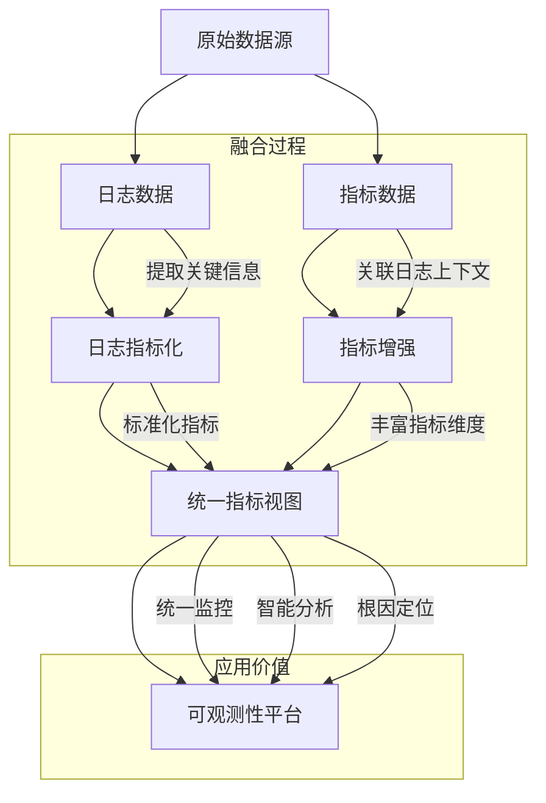

在现代分布式系统中，可观测性已成为保障系统稳定性和提升用户体验的关键能力。日志与指标作为可观测性的两大核心数据源，各自具有独特的优势和局限性。日志提供了丰富的上下文信息和详细的事件记录，而指标则具备高效的聚合能力和直观的趋势展示。日志与指标融合技术通过将两者有机结合，构建出更加全面、高效的可观测性体系。本文将深入探讨日志与指标融合的核心技术、实现方法和最佳实践。

## 日志与指标融合的核心概念

日志与指标融合是指将日志数据中蕴含的业务信息和系统状态转化为标准化指标的过程，同时利用指标的聚合分析能力来增强日志的价值，实现两种数据源的互补和协同。

### 融合的价值与意义

日志与指标融合的核心价值在于实现数据源的互补和协同，充分发挥各自优势：



#### 核心价值

1. **数据互补**：日志提供详细上下文，指标提供聚合视图
2. **维度丰富**：通过融合增加数据的分析维度
3. **效率提升**：指标化处理提升查询和分析效率
4. **成本优化**：减少重复存储和计算
5. **统一视图**：提供一致的监控和分析体验

### 融合的技术挑战

日志与指标融合面临的主要技术挑战包括：

- **数据结构差异**：日志为非结构化文本，指标为结构化数值
- **处理时效性**：需要在保证实时性的同时完成复杂的数据转换
- **准确性保障**：确保转换过程中的数据准确性和一致性
- **可扩展性**：支持大规模数据量和高并发处理需求
- **标准化统一**：建立统一的指标命名和标签体系

## 日志指标化技术

日志指标化是将日志数据转化为标准化指标的核心过程，它涉及数据提取、计算和标准化等多个环节。

### 指标提取与计算

```java
// 日志指标化处理器
public class LogMetricProcessor {
    private final MetricRegistry metricRegistry;
    private final List<MetricExtractionRule> extractionRules;
    
    public void processLog(LogEvent logEvent) {
        // 应用提取规则
        for (MetricExtractionRule rule : extractionRules) {
            if (rule.matches(logEvent)) {
                extractAndRecordMetrics(logEvent, rule);
            }
        }
    }
    
    private void extractAndRecordMetrics(LogEvent logEvent, MetricExtractionRule rule) {
        // 提取指标值
        Object metricValue = rule.extractValue(logEvent);
        
        // 获取或创建指标
        Meter meter = Meter.builder(rule.getMetricName())
            .description(rule.getDescription())
            .tags(rule.getTags(logEvent))
            .register(metricRegistry);
        
        // 记录指标
        if (metricValue instanceof Number) {
            if (rule.getMetricType() == MetricType.COUNTER) {
                meter.increment(((Number) metricValue).doubleValue());
            } else if (rule.getMetricType() == MetricType.GAUGE) {
                meter.set(((Number) metricValue).doubleValue());
            }
        } else if (metricValue instanceof Duration) {
            Timer timer = Timer.builder(rule.getMetricName())
                .description(rule.getDescription())
                .tags(rule.getTags(logEvent))
                .register(metricRegistry);
            timer.record((Duration) metricValue);
        }
    }
}

// 指标提取规则定义
public class MetricExtractionRule {
    private final String name;
    private final String metricName;
    private final String description;
    private final MetricType metricType;
    private final LogCondition condition;
    private final ValueExtractor valueExtractor;
    private final TagExtractor tagExtractor;
    
    public boolean matches(LogEvent logEvent) {
        return condition.evaluate(logEvent);
    }
    
    public Object extractValue(LogEvent logEvent) {
        return valueExtractor.extract(logEvent);
    }
    
    public Tags getTags(LogEvent logEvent) {
        return tagExtractor.extract(logEvent);
    }
}

// 值提取器接口
public interface ValueExtractor {
    Object extract(LogEvent logEvent);
}

// 计数型值提取器
public class CountValueExtractor implements ValueExtractor {
    @Override
    public Object extract(LogEvent logEvent) {
        return 1L; // 每条日志计数1
    }
}

// 数值型值提取器
public class NumericValueExtractor implements ValueExtractor {
    private final String fieldName;
    
    @Override
    public Object extract(LogEvent logEvent) {
        String valueStr = logEvent.getField(fieldName);
        if (valueStr != null) {
            try {
                return Double.parseDouble(valueStr);
            } catch (NumberFormatException e) {
                // 解析失败返回默认值
                return 0.0;
            }
        }
        return 0.0;
    }
}

// 时间型值提取器
public class DurationValueExtractor implements ValueExtractor {
    private final String startTimeField;
    private final String endTimeField;
    
    @Override
    public Object extract(LogEvent logEvent) {
        String startTimeStr = logEvent.getField(startTimeField);
        String endTimeStr = logEvent.getField(endTimeField);
        
        if (startTimeStr != null && endTimeStr != null) {
            try {
                long startTime = Long.parseLong(startTimeStr);
                long endTime = Long.parseLong(endTimeStr);
                return Duration.ofMillis(endTime - startTime);
            } catch (NumberFormatException e) {
                return Duration.ZERO;
            }
        }
        
        return Duration.ZERO;
    }
}
```

### 指标类型定义

```java
// 指标类型枚举
public enum MetricType {
    COUNTER("counter"),      // 计数器
    GAUGE("gauge"),          // 仪表盘
    HISTOGRAM("histogram"),  // 直方图
    SUMMARY("summary");      // 摘要
    
    private final String typeName;
    
    MetricType(String typeName) {
        this.typeName = typeName;
    }
    
    public String getTypeName() {
        return typeName;
    }
}

// 常用日志指标定义
public class CommonLogMetrics {
    // 请求相关指标
    public static final String REQUEST_COUNT = "log.request.count";
    public static final String REQUEST_DURATION = "log.request.duration";
    public static final String REQUEST_ERROR_COUNT = "log.request.error.count";
    
    // 业务相关指标
    public static final String BUSINESS_TRANSACTION_COUNT = "log.business.transaction.count";
    public static final String BUSINESS_ERROR_COUNT = "log.business.error.count";
    public static final String BUSINESS_AMOUNT = "log.business.amount";
    
    // 系统相关指标
    public static final String SYSTEM_ERROR_COUNT = "log.system.error.count";
    public static final String SYSTEM_WARNING_COUNT = "log.system.warning.count";
    public static final String SYSTEM_EXCEPTION_COUNT = "log.system.exception.count";
}
```

### 指标规则配置

```yaml
# 日志指标化规则配置
log_metric_rules:
  - name: "http_request_count"
    description: "HTTP请求计数"
    metric_name: "log.http.request.count"
    metric_type: "counter"
    condition:
      field: "type"
      operator: "equals"
      value: "http_request"
    value_extractor:
      type: "count"
    tags:
      - field: "method"
        tag_name: "http_method"
      - field: "status_code"
        tag_name: "status_code"
      - field: "service"
        tag_name: "service"
  
  - name: "http_response_time"
    description: "HTTP响应时间"
    metric_name: "log.http.response.time"
    metric_type: "histogram"
    condition:
      field: "type"
      operator: "equals"
      value: "http_response"
    value_extractor:
      type: "duration"
      start_field: "start_time"
      end_field: "end_time"
    tags:
      - field: "method"
        tag_name: "http_method"
      - field: "status_code"
        tag_name: "status_code"
      - field: "service"
        tag_name: "service"
  
  - name: "business_transaction_amount"
    description: "业务交易金额"
    metric_name: "log.business.transaction.amount"
    metric_type: "counter"
    condition:
      field: "type"
      operator: "equals"
      value: "business_transaction"
    value_extractor:
      type: "numeric"
      field: "amount"
    tags:
      - field: "transaction_type"
        tag_name: "transaction_type"
      - field: "service"
        tag_name: "service"
```

## 指标增强日志

指标增强日志是指利用已有的指标数据来丰富日志信息，提升日志的分析价值。

### 指标关联实现

```java
// 指标增强器
public class MetricEnricher {
    private final MetricQueryService metricQueryService;
    private final Cache<String, MetricData> metricCache;
    
    public EnrichedLog enrichLog(LogEvent logEvent) {
        EnrichedLog enrichedLog = new EnrichedLog(logEvent);
        
        // 关联相关指标
        enrichWithRequestMetrics(enrichedLog);
        enrichWithBusinessMetrics(enrichedLog);
        enrichWithSystemMetrics(enrichedLog);
        
        return enrichedLog;
    }
    
    private void enrichWithRequestMetrics(EnrichedLog log) {
        String service = log.getField("service");
        String endpoint = log.getField("endpoint");
        
        if (service != null && endpoint != null) {
            // 查询请求相关指标
            String metricKey = String.format("request.%s.%s", service, endpoint);
            
            // 查询成功率
            Double successRate = metricQueryService.getMetricValue(
                "request.success.rate", 
                Tags.of("service", service, "endpoint", endpoint)
            );
            log.setMetric("success_rate", successRate);
            
            // 查询平均响应时间
            Double avgResponseTime = metricQueryService.getMetricValue(
                "request.duration.avg", 
                Tags.of("service", service, "endpoint", endpoint)
            );
            log.setMetric("avg_response_time", avgResponseTime);
        }
    }
    
    private void enrichWithBusinessMetrics(EnrichedLog log) {
        String businessType = log.getField("business_type");
        String userId = log.getField("user_id");
        
        if (businessType != null) {
            // 查询业务相关指标
            Double businessVolume = metricQueryService.getMetricValue(
                "business.volume", 
                Tags.of("type", businessType)
            );
            log.setMetric("business_volume", businessVolume);
        }
    }
    
    private void enrichWithSystemMetrics(EnrichedLog log) {
        String service = log.getField("service");
        String host = log.getField("host");
        
        if (service != null) {
            // 查询系统相关指标
            Double cpuUsage = metricQueryService.getMetricValue(
                "system.cpu.usage", 
                Tags.of("service", service, "host", host)
            );
            log.setMetric("cpu_usage", cpuUsage);
            
            Double memoryUsage = metricQueryService.getMetricValue(
                "system.memory.usage", 
                Tags.of("service", service, "host", host)
            );
            log.setMetric("memory_usage", memoryUsage);
        }
    }
}

// 指标查询服务
public class MetricQueryService {
    private final PrometheusQueryClient prometheusClient;
    
    public Double getMetricValue(String metricName, Tags tags) {
        try {
            String query = buildPrometheusQuery(metricName, tags);
            QueryResult result = prometheusClient.query(query);
            
            if (result != null && !result.getData().getResult().isEmpty()) {
                return Double.valueOf(result.getData().getResult().get(0).getValue().get(1));
            }
        } catch (Exception e) {
            // 查询失败返回null
        }
        
        return null;
    }
    
    private String buildPrometheusQuery(String metricName, Tags tags) {
        StringBuilder query = new StringBuilder(metricName);
        
        if (!tags.isEmpty()) {
            query.append("{");
            boolean first = true;
            for (Tag tag : tags) {
                if (!first) {
                    query.append(",");
                }
                query.append(tag.getKey()).append("=\"").append(tag.getValue()).append("\"");
                first = false;
            }
            query.append("}");
        }
        
        return query.toString();
    }
}
```

### 实时增强处理

```java
// 实时指标增强处理器
public class RealtimeMetricEnricher {
    private final MetricStreamService metricStreamService;
    private final Map<String, Map<Tags, MetricValue>> metricCache;
    
    public RealtimeMetricEnricher() {
        this.metricCache = new ConcurrentHashMap<>();
        this.metricStreamService = new MetricStreamService();
        
        // 订阅指标流
        metricStreamService.subscribe(this::handleMetricUpdate);
    }
    
    public EnrichedLog enrichLogRealtime(LogEvent logEvent) {
        EnrichedLog enrichedLog = new EnrichedLog(logEvent);
        
        // 实时关联指标
        enrichWithCachedMetrics(enrichedLog);
        
        return enrichedLog;
    }
    
    private void handleMetricUpdate(MetricUpdateEvent event) {
        // 更新指标缓存
        String metricName = event.getMetricName();
        Tags tags = event.getTags();
        MetricValue value = event.getValue();
        
        metricCache.computeIfAbsent(metricName, k -> new ConcurrentHashMap<>())
                  .put(tags, value);
    }
    
    private void enrichWithCachedMetrics(EnrichedLog log) {
        String service = log.getField("service");
        if (service == null) return;
        
        // 从缓存中获取相关指标
        Tags serviceTags = Tags.of("service", service);
        
        Map<Tags, MetricValue> requestMetrics = metricCache.get("request.rate");
        if (requestMetrics != null) {
            MetricValue requestRate = requestMetrics.get(serviceTags);
            if (requestRate != null) {
                log.setMetric("current_request_rate", requestRate.getValue());
            }
        }
        
        Map<Tags, MetricValue> errorMetrics = metricCache.get("error.rate");
        if (errorMetrics != null) {
            MetricValue errorRate = errorMetrics.get(serviceTags);
            if (errorRate != null) {
                log.setMetric("current_error_rate", errorRate.getValue());
            }
        }
    }
}
```

## 统一监控视角

通过日志与指标的融合，可以构建出统一的监控视角，为运维和业务人员提供一致的可观测性体验。

### 统一指标视图

```java
// 统一指标视图构建器
public class UnifiedMetricViewBuilder {
    private final List<MetricSource> metricSources;
    
    public UnifiedMetricView buildView(MetricQueryRequest request) {
        UnifiedMetricView view = new UnifiedMetricView();
        
        // 从不同数据源获取指标
        for (MetricSource source : metricSources) {
            List<MetricData> metrics = source.queryMetrics(request);
            view.addMetrics(metrics);
        }
        
        // 关联和聚合指标
        view.aggregateMetrics();
        
        return view;
    }
}

// 指标数据源接口
public interface MetricSource {
    List<MetricData> queryMetrics(MetricQueryRequest request);
}

// 日志指标源实现
public class LogMetricSource implements MetricSource {
    private final LogMetricProcessor logMetricProcessor;
    
    @Override
    public List<MetricData> queryMetrics(MetricQueryRequest request) {
        // 从日志中提取和计算指标
        return logMetricProcessor.queryMetrics(request);
    }
}

// 系统指标源实现
public class SystemMetricSource implements MetricSource {
    private final PrometheusClient prometheusClient;
    
    @Override
    public List<MetricData> queryMetrics(MetricQueryRequest request) {
        // 从Prometheus查询系统指标
        return prometheusClient.queryMetrics(request);
    }
}
```

### 可视化展示

```java
// 统一监控面板
public class UnifiedMonitoringDashboard {
    private final UnifiedMetricViewBuilder viewBuilder;
    private final VisualizationEngine visualizationEngine;
    
    public DashboardView renderDashboard(DashboardConfig config) {
        // 构建统一指标视图
        UnifiedMetricView view = viewBuilder.buildView(config.getQueryRequest());
        
        // 创建仪表板视图
        DashboardView dashboard = new DashboardView();
        
        // 添加关键指标面板
        dashboard.addWidget(createKeyMetricsWidget(view));
        
        // 添加趋势分析面板
        dashboard.addWidget(createTrendAnalysisWidget(view));
        
        // 添加异常检测面板
        dashboard.addWidget(createAnomalyDetectionWidget(view));
        
        // 添加根因分析面板
        dashboard.addWidget(createRootCauseAnalysisWidget(view));
        
        return dashboard;
    }
    
    private Widget createKeyMetricsWidget(UnifiedMetricView view) {
        KeyMetricsWidget widget = new KeyMetricsWidget();
        
        // 添加请求速率指标
        MetricData requestRate = view.getMetric("request.rate");
        if (requestRate != null) {
            widget.addMetric("请求速率", requestRate.getValue(), requestRate.getUnit());
        }
        
        // 添加错误率指标
        MetricData errorRate = view.getMetric("error.rate");
        if (errorRate != null) {
            widget.addMetric("错误率", errorRate.getValue(), errorRate.getUnit());
        }
        
        // 添加响应时间指标
        MetricData responseTime = view.getMetric("response.time.avg");
        if (responseTime != null) {
            widget.addMetric("平均响应时间", responseTime.getValue(), responseTime.getUnit());
        }
        
        return widget;
    }
    
    private Widget createTrendAnalysisWidget(UnifiedMetricView view) {
        TrendAnalysisWidget widget = new TrendAnalysisWidget();
        
        // 添加时间序列数据
        List<TimeSeriesData> series = view.getTimeSeries();
        for (TimeSeriesData data : series) {
            widget.addSeries(data);
        }
        
        return widget;
    }
}
```

## 与Prometheus/OpenTelemetry的关系

现代可观测性体系中，Prometheus和OpenTelemetry是两个重要的技术标准，日志与指标融合需要与这些标准良好集成。

### Prometheus集成

```java
// Prometheus指标导出器
public class PrometheusMetricExporter {
    private final CollectorRegistry registry;
    private final Map<String, Collector> collectors;
    
    public void exportLogMetrics(List<LogMetric> logMetrics) {
        for (LogMetric logMetric : logMetrics) {
            String metricName = logMetric.getName();
            Collector collector = collectors.get(metricName);
            
            if (collector == null) {
                // 创建新的Collector
                collector = createCollector(logMetric);
                collectors.put(metricName, collector);
                registry.register(collector);
            }
            
            // 更新指标值
            updateCollector(collector, logMetric);
        }
    }
    
    private Collector createCollector(LogMetric metric) {
        switch (metric.getType()) {
            case COUNTER:
                return Counter.build()
                    .name(metric.getName())
                    .help(metric.getDescription())
                    .labelNames(metric.getLabelNames().toArray(new String[0]))
                    .create();
            case GAUGE:
                return Gauge.build()
                    .name(metric.getName())
                    .help(metric.getDescription())
                    .labelNames(metric.getLabelNames().toArray(new String[0]))
                    .create();
            case HISTOGRAM:
                return Histogram.build()
                    .name(metric.getName())
                    .help(metric.getDescription())
                    .labelNames(metric.getLabelNames().toArray(new String[0]))
                    .create();
            default:
                throw new IllegalArgumentException("Unsupported metric type: " + metric.getType());
        }
    }
    
    private void updateCollector(Collector collector, LogMetric metric) {
        if (collector instanceof Counter) {
            Counter counter = (Counter) collector;
            counter.labels(metric.getLabelValues().toArray(new String[0]))
                   .inc(metric.getValue());
        } else if (collector instanceof Gauge) {
            Gauge gauge = (Gauge) collector;
            gauge.labels(metric.getLabelValues().toArray(new String[0]))
                 .set(metric.getValue());
        } else if (collector instanceof Histogram) {
            Histogram histogram = (Histogram) collector;
            histogram.labels(metric.getLabelValues().toArray(new String[0]))
                    .observe(metric.getValue());
        }
    }
}
```

### OpenTelemetry集成

```java
// OpenTelemetry指标导出器
public class OpenTelemetryMetricExporter {
    private final MeterProvider meterProvider;
    private final Map<String, Meter> meters;
    
    public void exportLogMetrics(List<LogMetric> logMetrics) {
        for (LogMetric logMetric : logMetrics) {
            String serviceName = logMetric.getServiceName();
            Meter meter = meters.computeIfAbsent(serviceName, 
                name -> meterProvider.get(name));
            
            // 创建或获取指标
            ObservableDoubleCounter counter = meter.counterBuilder(logMetric.getName())
                .setDescription(logMetric.getDescription())
                .setUnit(logMetric.getUnit())
                .build();
            
            // 记录指标值
            counter.add(logMetric.getValue(), 
                Attributes.builder()
                    .putAll(logMetric.getAttributes())
                    .build());
        }
    }
    
    // OpenTelemetry日志增强
    public void enrichLogsWithTelemetry(LogEvent logEvent) {
        // 获取当前的Trace和Span上下文
        Context context = Context.current();
        Span currentSpan = Span.fromContext(context);
        
        if (currentSpan.getSpanContext().isValid()) {
            // 添加Trace ID
            logEvent.addField("trace_id", currentSpan.getSpanContext().getTraceId());
            
            // 添加Span ID
            logEvent.addField("span_id", currentSpan.getSpanContext().getSpanId());
            
            // 添加Trace状态
            logEvent.addField("trace_flags", currentSpan.getSpanContext().getTraceFlags().asHex());
        }
    }
}
```

## 实时处理架构

日志与指标融合需要高效的实时处理架构来支撑大规模数据的处理需求。

### 流处理实现

```java
// 基于Flink的日志指标化处理
public class FlinkLogMetricProcessor {
    public static void main(String[] args) throws Exception {
        StreamExecutionEnvironment env = StreamExecutionEnvironment.getExecutionEnvironment();
        
        // 1. 定义日志数据源
        DataStream<LogEvent> logStream = env
            .addSource(new KafkaSource<>("raw-logs-topic"))
            .map(new LogEventDeserializer());
        
        // 2. 日志指标化处理
        DataStream<MetricEvent> metricStream = logStream
            .flatMap(new LogMetricExtractor())
            .name("log-metric-extraction")
            .uid("log-metric-extraction");
        
        // 3. 指标聚合处理
        DataStream<AggregatedMetric> aggregatedStream = metricStream
            .keyBy(metric -> metric.getKey())
            .window(TumblingProcessingTimeWindows.of(Time.minutes(1)))
            .aggregate(new MetricAggregator())
            .name("metric-aggregation")
            .uid("metric-aggregation");
        
        // 4. 指标输出
        aggregatedStream
            .addSink(new PrometheusSink<>())
            .name("prometheus-export")
            .uid("prometheus-export");
        
        // 5. 增强日志输出
        DataStream<EnrichedLog> enrichedLogStream = logStream
            .connect(aggregatedStream.broadcast())
            .process(new LogEnrichmentProcessFunction())
            .name("log-enrichment")
            .uid("log-enrichment");
        
        enrichedLogStream
            .addSink(new ElasticsearchSink<>("enriched-logs"))
            .name("elasticsearch-sink")
            .uid("elasticsearch-sink");
        
        env.execute("Log-Metric Fusion Pipeline");
    }
}

// 日志指标提取函数
class LogMetricExtractor implements FlatMapFunction<LogEvent, MetricEvent> {
    private final List<MetricExtractionRule> rules;
    
    @Override
    public void flatMap(LogEvent logEvent, Collector<MetricEvent> collector) throws Exception {
        for (MetricExtractionRule rule : rules) {
            if (rule.matches(logEvent)) {
                Object value = rule.extractValue(logEvent);
                Tags tags = rule.getTags(logEvent);
                
                MetricEvent metricEvent = new MetricEvent(
                    rule.getMetricName(),
                    value,
                    tags,
                    logEvent.getTimestamp()
                );
                
                collector.collect(metricEvent);
            }
        }
    }
}

// 指标聚合器
class MetricAggregator implements AggregateFunction<MetricEvent, MetricAggregatorState, AggregatedMetric> {
    @Override
    public MetricAggregatorState createAccumulator() {
        return new MetricAggregatorState();
    }
    
    @Override
    public MetricAggregatorState add(MetricEvent event, MetricAggregatorState state) {
        state.addMetric(event);
        return state;
    }
    
    @Override
    public AggregatedMetric getResult(MetricAggregatorState state) {
        return state.toAggregatedMetric();
    }
    
    @Override
    public MetricAggregatorState merge(MetricAggregatorState a, MetricAggregatorState b) {
        return a.merge(b);
    }
}
```

### 批处理实现

```java
// 基于Spark的日志指标化处理
class SparkLogMetricProcessor {
    public void processLogs(JavaSparkContext sc, String inputPath, String outputPath) {
        // 1. 读取日志数据
        JavaRDD<String> logLines = sc.textFile(inputPath);
        
        // 2. 解析日志
        JavaRDD<LogEvent> logEvents = logLines
            .map(line -> LogEventParser.parse(line))
            .filter(Objects::nonNull);
        
        // 3. 提取指标
        JavaRDD<MetricRecord> metrics = logEvents
            .flatMap(logEvent -> extractMetrics(logEvent).iterator());
        
        // 4. 聚合指标
        JavaPairRDD<String, Double> aggregatedMetrics = metrics
            .mapToPair(record -> new Tuple2<>(record.getKey(), record.getValue()))
            .reduceByKey((v1, v2) -> v1 + v2);
        
        // 5. 保存结果
        aggregatedMetrics.saveAsTextFile(outputPath);
    }
    
    private List<MetricRecord> extractMetrics(LogEvent logEvent) {
        List<MetricRecord> metrics = new ArrayList<>();
        
        // 错误计数指标
        if (isErrorLog(logEvent)) {
            metrics.add(new MetricRecord("error_count", 1.0, logEvent.getTimestamp()));
        }
        
        // 请求计数指标
        if (isRequestLog(logEvent)) {
            metrics.add(new MetricRecord("request_count", 1.0, logEvent.getTimestamp()));
        }
        
        // 响应时间指标
        Double responseTime = extractResponseTime(logEvent);
        if (responseTime != null) {
            metrics.add(new MetricRecord("response_time", responseTime, logEvent.getTimestamp()));
        }
        
        return metrics;
    }
}
```

## 监控与度量

完善的监控和度量体系是保障日志与指标融合系统稳定运行的基础。

### 融合系统监控

```java
// 融合系统指标收集器
public class FusionSystemMetrics {
    private final MeterRegistry meterRegistry;
    
    // 处理相关指标
    private final Counter totalLogsProcessed;
    private final Counter totalMetricsGenerated;
    private final Timer processingLatency;
    private final Gauge processingRate;
    
    // 质量相关指标
    private final Counter failedExtractions;
    private final Counter invalidMetrics;
    private final Gauge cacheHitRate;
    
    public FusionSystemMetrics(MeterRegistry meterRegistry) {
        this.meterRegistry = meterRegistry;
        
        this.totalLogsProcessed = Counter.builder("fusion.logs.processed")
            .description("Total number of logs processed")
            .register(meterRegistry);
        
        this.totalMetricsGenerated = Counter.builder("fusion.metrics.generated")
            .description("Total number of metrics generated")
            .register(meterRegistry);
        
        this.processingLatency = Timer.builder("fusion.processing.latency")
            .description("Log processing latency")
            .register(meterRegistry);
        
        this.processingRate = Gauge.builder("fusion.processing.rate")
            .description("Log processing rate (logs/second)")
            .register(meterRegistry, this, FusionSystemMetrics::calculateProcessingRate);
        
        this.failedExtractions = Counter.builder("fusion.extractions.failed")
            .description("Number of failed metric extractions")
            .register(meterRegistry);
        
        this.invalidMetrics = Counter.builder("fusion.metrics.invalid")
            .description("Number of invalid metrics generated")
            .register(meterRegistry);
        
        this.cacheHitRate = Gauge.builder("fusion.cache.hit_rate")
            .description("Metric cache hit rate")
            .register(meterRegistry, this, FusionSystemMetrics::getCacheHitRate);
    }
    
    public void recordLogProcessed(LogEvent logEvent, long processingTimeMs) {
        totalLogsProcessed.increment();
        processingLatency.record(processingTimeMs, TimeUnit.MILLISECONDS);
    }
    
    public void recordMetricGenerated(MetricEvent metricEvent) {
        totalMetricsGenerated.increment(
            Tag.of("metric_name", metricEvent.getName()),
            Tag.of("service", metricEvent.getService())
        );
    }
    
    public void recordFailedExtraction(LogEvent logEvent, Exception error) {
        failedExtractions.increment(
            Tag.of("error_type", error.getClass().getSimpleName())
        );
    }
    
    private double calculateProcessingRate() {
        // 计算处理速率的实现
        return 0.0;
    }
    
    private double getCacheHitRate() {
        // 获取缓存命中率的实现
        return 0.0;
    }
}
```

### 数据质量监控

```python
# 数据质量监控器
class DataQualityMonitor:
    def __init__(self, metric_registry):
        self.metric_registry = metric_registry
        self.quality_metrics = {}
        
    def monitor_metric_quality(self, metric_name, metric_value, tags):
        """监控指标数据质量"""
        quality_score = self._calculate_quality_score(metric_value, tags)
        
        # 记录质量指标
        self.metric_registry.gauge(
            f"metric.quality.{metric_name}",
            quality_score,
            tags
        )
        
        # 检查质量问题
        if quality_score < 0.8:
            self._handle_quality_issue(metric_name, quality_score, tags)
    
    def _calculate_quality_score(self, metric_value, tags):
        """计算数据质量分数"""
        score = 1.0
        
        # 检查缺失值
        if metric_value is None or (isinstance(metric_value, float) and math.isnan(metric_value)):
            score -= 0.3
        
        # 检查异常值
        if self._is_outlier(metric_value, tags):
            score -= 0.2
        
        # 检查标签完整性
        if not self._has_required_tags(tags):
            score -= 0.1
            
        return max(0.0, score)
    
    def _is_outlier(self, value, tags):
        """检查是否为异常值"""
        # 实现异常值检测逻辑
        return False
    
    def _has_required_tags(self, tags):
        """检查是否包含必需的标签"""
        required_tags = ['service', 'instance']
        return all(tag in tags for tag in required_tags)
    
    def _handle_quality_issue(self, metric_name, quality_score, tags):
        """处理数据质量问题"""
        # 发送告警
        alert_message = f"Metric {metric_name} quality score is low: {quality_score}"
        self._send_alert(alert_message, tags)
        
        # 记录日志
        logger.warning(f"Data quality issue detected: {metric_name}, score: {quality_score}")
```

## 最佳实践总结

### 1. 指标设计最佳实践

```yaml
# 指标设计最佳实践
metric_design_best_practices:
  - use_clear_naming: "使用清晰、一致的命名规范"
  - include_sufficient_tags: "包含足够的标签用于维度分析"
  - define_metric_semantics: "明确定义每个指标的业务含义"
  - standardize_units: "统一指标单位，便于比较和分析"
  - consider_cardinality: "考虑标签基数，避免高基数问题"
```

### 2. 融合处理最佳实践

```yaml
# 融合处理最佳实践
fusion_processing_best_practices:
  - process_in_real_time: "实时处理确保数据时效性"
  - implement_caching: "实现缓存机制提升处理效率"
  - handle_failures_gracefully: "优雅处理处理失败情况"
  - monitor_processing_metrics: "监控处理过程的关键指标"
  - optimize_resource_usage: "优化资源使用，控制处理成本"
```

### 3. 系统集成最佳实践

```yaml
# 系统集成最佳实践
system_integration_best_practices:
  - follow_standards: "遵循Prometheus、OpenTelemetry等行业标准"
  - ensure_compatibility: "确保与现有监控系统的兼容性"
  - implement_back_pressure: "实现背压机制防止系统过载"
  - provide_health_checks: "提供健康检查接口"
  - document_apis: "完善API文档便于集成"
```

## 总结

日志与指标融合是构建现代可观测性体系的关键技术，它通过将日志数据转化为标准化指标，并利用指标数据增强日志信息，实现了两种数据源的互补和协同。通过合理的架构设计、高效的处理算法和完善的监控体系，我们可以构建出高性能、高可靠性的日志与指标融合系统。

关键要点包括：

1. **指标化处理**：将日志中的关键信息提取并转化为标准化指标
2. **指标增强**：利用已有指标数据丰富日志的上下文信息
3. **统一视图**：构建统一的监控视角，提供一致的可观测性体验
4. **标准集成**：与Prometheus、OpenTelemetry等标准良好集成
5. **实时处理**：采用流处理技术实现实时的数据融合处理
6. **质量保障**：建立完善的数据质量监控和系统监控体系

在实际应用中，需要根据具体的业务场景和技术架构，选择合适的融合策略和实现方式，并持续优化处理流程，确保日志与指标融合系统能够为企业的可观测性建设提供有力支撑。