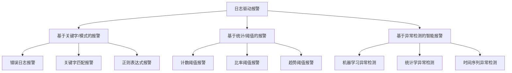
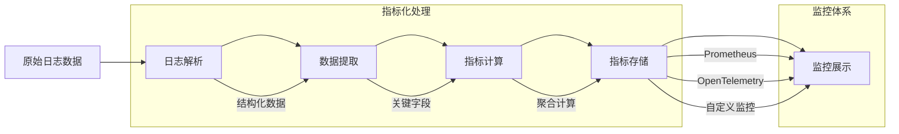
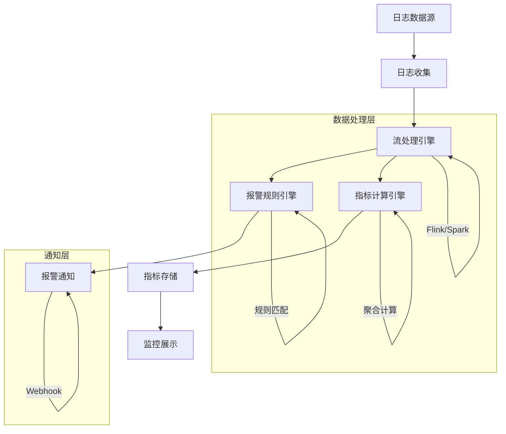

在现代分布式系统中，日志不仅是问题排查的重要依据，更是构建智能运维体系的核心数据源。日志报警与指标化作为日志平台的高级应用，能够将原始的日志数据转化为有价值的业务洞察和预警信息，实现从被动响应到主动预防的运维模式转变。本文将全面介绍日志报警与指标化的核心概念、技术架构和实践方法。

## 日志报警与指标化的重要性

日志报警与指标化是现代运维体系中的关键环节，它将分散、无序的日志数据转化为结构化的预警信息和业务指标，为系统的稳定运行提供有力保障。

### 核心价值

1. **主动预警**：通过智能分析日志数据，提前发现潜在问题
2. **业务洞察**：将日志数据转化为可量化的业务指标
3. **故障预防**：在问题发生前进行预警和干预
4. **决策支持**：为业务决策提供数据支撑
5. **效率提升**：减少人工监控成本，提升运维效率

### 技术挑战

日志报警与指标化面临的主要技术挑战包括：

- **数据量大**：海量日志数据的实时处理和分析
- **模式多样**：不同业务场景下的报警规则设计
- **误报控制**：降低误报率，提升报警准确性
- **实时性要求**：满足秒级甚至毫秒级的报警需求
- **可扩展性**：支持大规模分布式系统的报警需求

## 日志驱动的报警体系

日志驱动的报警体系是基于日志数据分析实现的自动化预警机制，它能够根据预定义的规则或机器学习模型自动检测异常并触发报警。

### 报警类型分类



### 报警规则设计

报警规则的设计需要平衡敏感性和准确性，既要及时发现真实问题，又要避免过多误报干扰。

```yaml
# 报警规则配置示例
alert_rules:
  - name: "high_error_rate"
    description: "错误率过高报警"
    type: "statistical"
    condition:
      metric: "error_rate"
      operator: ">"
      threshold: 0.05
      window: "5m"
    severity: "critical"
    notification:
      channels: ["email", "slack", "sms"]
      template: "error_rate_template"
  
  - name: "service_down"
    description: "服务不可用报警"
    type: "pattern"
    condition:
      pattern: "Service Unavailable"
      service: "user-service"
      count: 10
      window: "1m"
    severity: "emergency"
    notification:
      channels: ["phone", "slack"]
      template: "service_down_template"
```

## 日志与指标融合

日志与指标融合是将日志数据转化为标准化指标的过程，通过指标化处理可以更好地与现有的监控体系集成。

### 指标化处理流程



### 指标类型定义

```java
// 指标类型定义
public enum LogMetricType {
    // 计数类指标
    ERROR_COUNT("error_count", "错误日志计数"),
    REQUEST_COUNT("request_count", "请求计数"),
    RESPONSE_TIME("response_time", "响应时间"),
    
    // 比率类指标
    ERROR_RATE("error_rate", "错误率"),
    SUCCESS_RATE("success_rate", "成功率"),
    CACHE_HIT_RATE("cache_hit_rate", "缓存命中率"),
    
    // 分布类指标
    RESPONSE_TIME_HISTOGRAM("response_time_histogram", "响应时间分布"),
    REQUEST_SIZE_HISTOGRAM("request_size_histogram", "请求大小分布");
    
    private final String name;
    private final String description;
    
    LogMetricType(String name, String description) {
        this.name = name;
        this.description = description;
    }
    
    // getters...
}
```

## 技术架构设计

日志报警与指标化的技术架构需要支持高并发、低延迟的数据处理能力，同时具备良好的可扩展性和可靠性。

### 实时处理架构



### 报警规则引擎

```java
// 报警规则引擎实现
public class AlertRuleEngine {
    private final List<AlertRule> rules;
    private final NotificationService notificationService;
    private final MetricRegistry metricRegistry;
    
    public void evaluate(LogEvent logEvent) {
        for (AlertRule rule : rules) {
            if (rule.matches(logEvent)) {
                // 检查是否需要抑制报警
                if (shouldSuppressAlert(rule, logEvent)) {
                    continue;
                }
                
                // 触发报警
                Alert alert = new Alert(rule, logEvent);
                notificationService.sendAlert(alert);
                
                // 记录报警指标
                recordAlertMetric(rule, logEvent);
            }
        }
    }
    
    private boolean shouldSuppressAlert(AlertRule rule, LogEvent logEvent) {
        // 实现报警抑制逻辑
        // 例如：短时间内相同类型的报警只发送一次
        return false;
    }
    
    private void recordAlertMetric(AlertRule rule, LogEvent logEvent) {
        // 记录报警相关指标
        Counter.builder("alerts.triggered")
            .tag("rule", rule.getName())
            .tag("severity", rule.getSeverity().name())
            .register(metricRegistry)
            .increment();
    }
}
```

## 智能报警技术

随着人工智能技术的发展，基于机器学习的智能报警成为日志报警领域的重要发展方向。

### 异常检测算法

```python
# 基于统计学的异常检测
class StatisticalAnomalyDetector:
    def __init__(self, threshold=3):
        self.threshold = threshold
        self.history = []
    
    def detect(self, value):
        if len(self.history) < 10:
            self.history.append(value)
            return False
        
        # 计算均值和标准差
        mean = np.mean(self.history)
        std = np.std(self.history)
        
        # 判断是否为异常点
        z_score = abs(value - mean) / std
        is_anomaly = z_score > self.threshold
        
        # 更新历史数据
        self.history.append(value)
        if len(self.history) > 100:
            self.history.pop(0)
        
        return is_anomaly

# 基于机器学习的异常检测
class MLAnomalyDetector:
    def __init__(self):
        self.model = IsolationForest(contamination=0.1)
        self.is_trained = False
    
    def train(self, training_data):
        self.model.fit(training_data)
        self.is_trained = True
    
    def detect(self, data_point):
        if not self.is_trained:
            return False
        
        anomaly_score = self.model.decision_function([data_point])[0]
        is_anomaly = self.model.predict([data_point])[0] == -1
        
        return is_anomaly
```

### 根因分析

```java
// 根因分析实现
public class RootCauseAnalyzer {
    private final LogCorrelationService correlationService;
    private final TopologyService topologyService;
    
    public RootCauseAnalysisResult analyze(Alert alert) {
        RootCauseAnalysisResult result = new RootCauseAnalysisResult();
        
        // 1. 时间关联分析
        List<LogEvent> relatedLogs = correlationService.findRelatedLogs(
            alert.getTriggerLog(), 
            Duration.ofMinutes(10)
        );
        
        // 2. 拓扑关联分析
        Set<ServiceNode> affectedServices = topologyService.findAffectedServices(
            alert.getTriggerLog().getService()
        );
        
        // 3. 模式识别
        Pattern pattern = identifyPattern(relatedLogs);
        
        // 4. 根因推断
        String rootCause = inferRootCause(pattern, affectedServices);
        
        result.setRelatedLogs(relatedLogs);
        result.setAffectedServices(affectedServices);
        result.setPattern(pattern);
        result.setRootCause(rootCause);
        
        return result;
    }
    
    private Pattern identifyPattern(List<LogEvent> logs) {
        // 实现模式识别逻辑
        return new Pattern();
    }
    
    private String inferRootCause(Pattern pattern, Set<ServiceNode> services) {
        // 实现根因推断逻辑
        return "Unknown";
    }
}
```

## 监控与度量

完善的监控和度量体系是保障报警系统稳定运行的基础。

### 报警系统监控

```yaml
# 报警系统监控指标
alert_system_metrics:
  alerts:
    total_triggered: "触发的报警总数"
    false_positives: "误报数量"
    response_time: "报警响应时间"
    suppression_rate: "报警抑制率"
  
  rules:
    active_rules: "活跃规则数量"
    rule_evaluation_rate: "规则评估速率"
    rule_match_rate: "规则匹配率"
  
  notifications:
    sent_notifications: "发送的通知数量"
    failed_notifications: "失败的通知数量"
    notification_latency: "通知延迟"
```

### 报警效果评估

```python
# 报警效果评估
class AlertEffectivenessEvaluator:
    def __init__(self):
        self.alerts = []
        self.incidents = []
    
    def evaluate(self):
        metrics = {}
        
        # 计算准确率
        true_positives = self.count_true_positives()
        false_positives = self.count_false_positives()
        metrics['precision'] = true_positives / (true_positives + false_positives)
        
        # 计算召回率
        false_negatives = self.count_false_negatives()
        metrics['recall'] = true_positives / (true_positives + false_negatives)
        
        # 计算F1分数
        precision = metrics['precision']
        recall = metrics['recall']
        metrics['f1_score'] = 2 * (precision * recall) / (precision + recall)
        
        return metrics
    
    def count_true_positives(self):
        # 计算真正例数量
        pass
    
    def count_false_positives(self):
        # 计算假正例数量
        pass
    
    def count_false_negatives(self):
        # 计算假负例数量
        pass
```

## 最佳实践总结

### 1. 报警规则设计原则

```yaml
# 报警规则设计原则
alert_design_principles:
  - start_with_business_impact: "从对业务的影响出发设计报警"
  - avoid_alert_storm: "避免报警风暴，控制报警频率"
  - provide_actionable_info: "提供可操作的信息，而不仅仅是通知"
  - set_appropriate_thresholds: "设置合理的阈值，避免过多误报"
  - implement_alert_suppression: "实现报警抑制机制"
```

### 2. 指标化最佳实践

```yaml
# 指标化最佳实践
metric_best_practices:
  - define_clear_semantics: "明确定义指标的业务含义"
  - use_standardized_names: "使用标准化的指标命名"
  - include_sufficient_tags: "包含足够的标签信息用于维度分析"
  - implement_proper_aggregation: "实现合适的聚合策略"
  - ensure_data_quality: "确保指标数据的质量"
```

### 3. 系统可靠性保障

```yaml
# 系统可靠性保障
reliability_practices:
  - implement_circuit_breaker: "实现熔断机制防止级联故障"
  - use_retry_mechanisms: "使用重试机制提升系统韧性"
  - monitor_system_health: "监控系统健康状态"
  - implement_graceful_degradation: "实现优雅降级"
  - conduct_regular_testing: "定期进行报警系统测试"
```

## 总结

日志报警与指标化是构建现代智能运维体系的重要组成部分，它将原始的日志数据转化为有价值的业务洞察和预警信息。通过合理的架构设计、算法选择和最佳实践，我们可以构建出高效、准确、可靠的日志报警与指标化系统。

关键要点包括：

1. **多层次报警体系**：构建基于规则、统计和智能学习的多层次报警体系
2. **指标化处理**：将日志数据转化为标准化的业务指标
3. **智能分析**：运用机器学习技术提升报警准确性和根因分析能力
4. **监控保障**：建立完善的监控和度量体系保障系统稳定运行
5. **持续优化**：通过效果评估和反馈机制持续优化报警策略

在后续章节中，我们将深入探讨日志平台化能力的构建，包括多租户管理、成本控制等关键主题，帮助您构建完整的企业级日志平台解决方案。