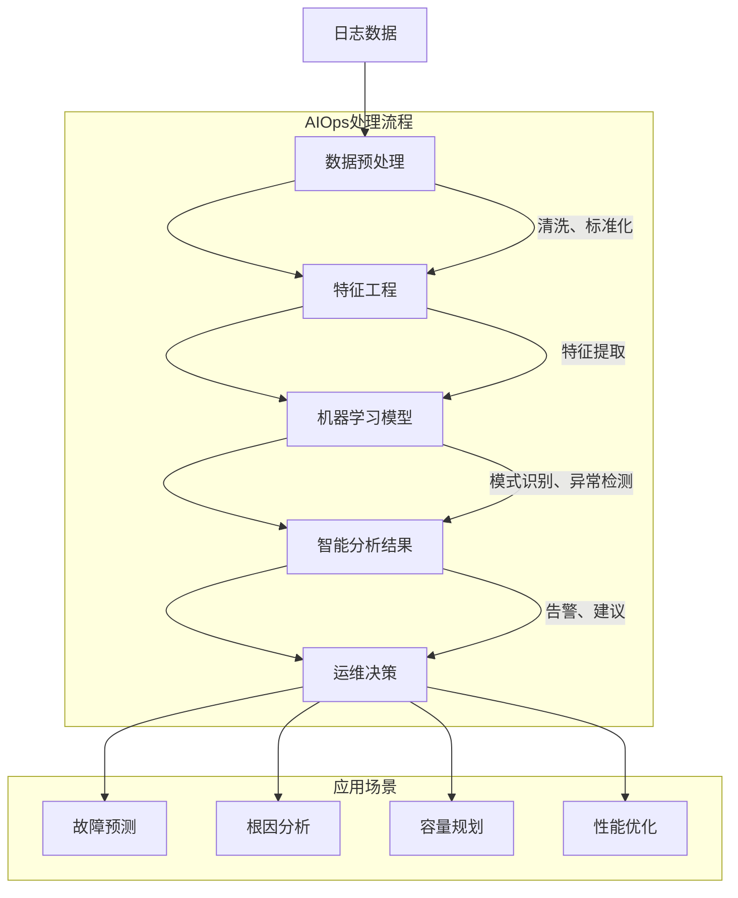

智能日志分析是现代运维体系向智能化转型的核心技术之一，它通过运用人工智能和机器学习算法，实现对海量日志数据的深度分析、异常检测和根因定位。随着系统复杂性的不断增加，传统的基于规则的分析方法已难以满足快速定位问题、预测潜在风险的需求。智能日志分析技术的出现，为构建自主运维能力提供了强有力的技术支撑。本文将深入探讨智能日志分析的核心技术、实现方法和最佳实践。

## 智能日志分析的核心概念

智能日志分析是指运用人工智能技术对日志数据进行自动化分析和处理，以发现隐藏在海量数据中的模式、异常和关联关系，从而实现故障预测、根因分析和智能决策。

### AIOps的核心价值

AIOps（Artificial Intelligence for IT Operations）是智能日志分析的重要应用领域，它通过机器学习、大数据分析等技术，实现IT运维的智能化转型。



#### 核心价值

1. **自动化分析**：减少人工分析工作量，提升分析效率
2. **异常检测**：自动识别系统异常和潜在风险
3. **根因定位**：快速定位问题根本原因
4. **预测能力**：预测系统故障和性能瓶颈
5. **智能决策**：提供基于数据的运维决策支持

### 技术挑战

智能日志分析面临的主要技术挑战包括：

- **数据质量**：日志数据的噪声、不完整性和不一致性
- **算法选择**：针对不同场景选择合适的机器学习算法
- **实时性要求**：满足秒级甚至毫秒级的实时分析需求
- **可解释性**：确保算法决策的可解释性和可信度
- **模型维护**：模型的持续训练、更新和优化

## 机器学习在日志分析中的应用

机器学习技术为日志分析带来了强大的自动化能力，能够处理复杂的模式识别和异常检测任务。

### 异常检测算法

```python
# 基于孤立森林的异常检测
from sklearn.ensemble import IsolationForest
import numpy as np
from typing import List, Dict, Any

class IsolationForestAnomalyDetector:
    def __init__(self, contamination: float = 0.1, random_state: int = 42):
        self.model = IsolationForest(
            contamination=contamination,
            random_state=random_state,
            n_estimators=100
        )
        self.is_trained = False
        self.feature_extractor = LogFeatureExtractor()
    
    def train(self, training_logs: List[Dict[str, Any]]) -> None:
        """训练异常检测模型"""
        # 提取特征
        features = self.feature_extractor.extract_features(training_logs)
        
        # 训练模型
        self.model.fit(features)
        self.is_trained = True
    
    def detect_anomalies(self, logs: List[Dict[str, Any]]) -> List[Dict[str, Any]]:
        """检测日志异常"""
        if not self.is_trained:
            raise RuntimeError("Model not trained yet")
        
        # 提取特征
        features = self.feature_extractor.extract_features(logs)
        
        # 预测异常
        predictions = self.model.predict(features)
        anomaly_scores = self.model.decision_function(features)
        
        # 构建结果
        anomalies = []
        for i, log in enumerate(logs):
            if predictions[i] == -1:  # 异常点
                anomalies.append({
                    'log': log,
                    'anomaly_score': float(anomaly_scores[i]),
                    'severity': self._calculate_severity(anomaly_scores[i]),
                    'timestamp': log.get('timestamp')
                })
        
        return anomalies
    
    def _calculate_severity(self, score: float) -> str:
        """根据异常分数计算严重程度"""
        if score < -0.5:
            return 'CRITICAL'
        elif score < -0.3:
            return 'HIGH'
        elif score < -0.1:
            return 'MEDIUM'
        else:
            return 'LOW'

# 基于LSTM的时间序列异常检测
import tensorflow as tf
from tensorflow.keras.models import Sequential
from tensorflow.keras.layers import LSTM, Dense, Dropout

class LSTMAnomalyDetector:
    def __init__(self, sequence_length: int = 50, threshold: float = 0.1):
        self.sequence_length = sequence_length
        self.threshold = threshold
        self.model = None
        self.scaler = None
    
    def build_model(self, input_dim: int) -> None:
        """构建LSTM模型"""
        self.model = Sequential([
            LSTM(50, activation='relu', input_shape=(self.sequence_length, input_dim)),
            Dropout(0.2),
            Dense(25, activation='relu'),
            Dropout(0.2),
            Dense(input_dim, activation='linear')
        ])
        
        self.model.compile(optimizer='adam', loss='mse')
    
    def train(self, training_data: np.ndarray) -> None:
        """训练LSTM模型"""
        # 数据标准化
        from sklearn.preprocessing import MinMaxScaler
        self.scaler = MinMaxScaler()
        scaled_data = self.scaler.fit_transform(training_data)
        
        # 构建序列数据
        X, y = self._create_sequences(scaled_data)
        
        # 训练模型
        self.model.fit(X, y, epochs=50, batch_size=32, validation_split=0.1)
    
    def detect_anomalies(self, data: np.ndarray) -> List[Dict[str, Any]]:
        """检测时间序列异常"""
        if self.model is None or self.scaler is None:
            raise RuntimeError("Model not trained yet")
        
        # 数据标准化
        scaled_data = self.scaler.transform(data)
        
        # 构建序列数据
        X, _ = self._create_sequences(scaled_data)
        
        # 预测
        predictions = self.model.predict(X)
        
        # 计算重构误差
        mse = np.mean(np.power(X - predictions, 2), axis=(1, 2))
        
        # 识别异常
        anomalies = []
        for i, error in enumerate(mse):
            if error > self.threshold:
                anomalies.append({
                    'index': i,
                    'reconstruction_error': float(error),
                    'is_anomaly': True,
                    'severity': 'HIGH' if error > self.threshold * 2 else 'MEDIUM'
                })
        
        return anomalies
    
    def _create_sequences(self, data: np.ndarray) -> tuple:
        """创建时间序列"""
        X, y = [], []
        for i in range(len(data) - self.sequence_length):
            X.append(data[i:(i + self.sequence_length)])
            y.append(data[i + self.sequence_length])
        return np.array(X), np.array(y)
```

### 日志聚类分析

```python
# 基于K-means的日志聚类
from sklearn.cluster import KMeans
from sklearn.feature_extraction.text import TfidfVectorizer
import pandas as pd

class LogClusteringAnalyzer:
    def __init__(self, n_clusters: int = 10):
        self.n_clusters = n_clusters
        self.vectorizer = TfidfVectorizer(max_features=1000, stop_words='english')
        self.cluster_model = KMeans(n_clusters=n_clusters, random_state=42)
        self.is_trained = False
    
    def analyze(self, logs: List[Dict[str, Any]]) -> Dict[str, Any]:
        """分析日志聚类"""
        # 提取日志消息
        messages = [log.get('message', '') for log in logs]
        
        # 文本向量化
        tfidf_matrix = self.vectorizer.fit_transform(messages)
        
        # 聚类分析
        cluster_labels = self.cluster_model.fit_predict(tfidf_matrix)
        
        # 分析聚类结果
        cluster_analysis = self._analyze_clusters(logs, cluster_labels)
        
        return {
            'clusters': cluster_analysis,
            'cluster_labels': cluster_labels.tolist(),
            'silhouette_score': self._calculate_silhouette_score(tfidf_matrix, cluster_labels)
        }
    
    def _analyze_clusters(self, logs: List[Dict[str, Any]], labels: np.ndarray) -> List[Dict[str, Any]]:
        """分析各个聚类"""
        clusters = []
        
        for cluster_id in range(self.n_clusters):
            # 获取该聚类中的日志
            cluster_logs = [logs[i] for i, label in enumerate(labels) if label == cluster_id]
            
            if not cluster_logs:
                continue
            
            # 分析聚类特征
            cluster_info = {
                'cluster_id': cluster_id,
                'size': len(cluster_logs),
                'percentage': len(cluster_logs) / len(logs) * 100,
                'sample_logs': cluster_logs[:5],  # 前5个样本
                'common_patterns': self._extract_common_patterns(cluster_logs),
                'severity_distribution': self._analyze_severity_distribution(cluster_logs)
            }
            
            clusters.append(cluster_info)
        
        # 按大小排序
        clusters.sort(key=lambda x: x['size'], reverse=True)
        
        return clusters
    
    def _extract_common_patterns(self, logs: List[Dict[str, Any]]) -> List[str]:
        """提取共同模式"""
        messages = [log.get('message', '') for log in logs]
        
        # 简单的模式提取（实际应用中可以使用更复杂的算法）
        from collections import Counter
        import re
        
        # 提取常见的单词组合
        word_combinations = []
        for message in messages:
            # 提取3-gram单词组合
            words = re.findall(r'\b\w+\b', message.lower())
            for i in range(len(words) - 2):
                combination = ' '.join(words[i:i+3])
                word_combinations.append(combination)
        
        # 统计最常见的组合
        counter = Counter(word_combinations)
        common_patterns = [pattern for pattern, count in counter.most_common(5)]
        
        return common_patterns
    
    def _analyze_severity_distribution(self, logs: List[Dict[str, Any]]) -> Dict[str, int]:
        """分析严重程度分布"""
        severity_counts = {}
        for log in logs:
            severity = log.get('level', 'INFO')
            severity_counts[severity] = severity_counts.get(severity, 0) + 1
        
        return severity_counts
    
    def _calculate_silhouette_score(self, tfidf_matrix: np.ndarray, labels: np.ndarray) -> float:
        """计算轮廓系数"""
        from sklearn.metrics import silhouette_score
        try:
            return silhouette_score(tfidf_matrix, labels)
        except:
            return 0.0
```

## 根因分析技术

根因分析（Root Cause Analysis, RCA）是智能日志分析的重要应用，它通过分析日志数据中的关联关系和因果关系，快速定位问题的根本原因。

### 基于关联规则的根因分析

```java
// 基于关联规则的根因分析器
public class AssociationRuleRCA {
    private final List<LogEvent> logEvents;
    private final Map<String, Set<LogEvent>> serviceLogs;
    private final Map<String, ServiceDependency> serviceDependencies;
    
    public RootCauseAnalysisResult analyze(LogEvent triggerEvent) {
        RootCauseAnalysisResult result = new RootCauseAnalysisResult();
        
        // 1. 时间关联分析
        List<LogEvent> temporalRelatedLogs = findTemporalRelatedLogs(triggerEvent);
        result.setTemporalRelatedLogs(temporalRelatedLogs);
        
        // 2. 服务依赖分析
        List<ServiceNode> affectedServices = analyzeServiceDependencies(triggerEvent);
        result.setAffectedServices(affectedServices);
        
        // 3. 关联规则挖掘
        List<AssociationRule> associationRules = mineAssociationRules(temporalRelatedLogs);
        result.setAssociationRules(associationRules);
        
        // 4. 根因推断
        String rootCause = inferRootCause(associationRules, affectedServices);
        result.setRootCause(rootCause);
        
        // 5. 修复建议生成
        List<RemediationSuggestion> suggestions = generateRemediationSuggestions(rootCause);
        result.setRemediationSuggestions(suggestions);
        
        return result;
    }
    
    private List<LogEvent> findTemporalRelatedLogs(LogEvent triggerEvent) {
        // 在触发事件前后30分钟内查找相关日志
        LocalDateTime startTime = triggerEvent.getTimestamp().minusMinutes(30);
        LocalDateTime endTime = triggerEvent.getTimestamp().plusMinutes(30);
        
        return logEvents.stream()
            .filter(log -> !log.getId().equals(triggerEvent.getId()))
            .filter(log -> log.getTimestamp().isAfter(startTime) && 
                          log.getTimestamp().isBefore(endTime))
            .filter(log -> isRelatedToTrigger(triggerEvent, log))
            .collect(Collectors.toList());
    }
    
    private boolean isRelatedToTrigger(LogEvent trigger, LogEvent candidate) {
        // 检查服务相关性
        if (trigger.getService().equals(candidate.getService())) {
            return true;
        }
        
        // 检查依赖关系
        ServiceDependency dependency = serviceDependencies.get(
            trigger.getService() + "->" + candidate.getService());
        if (dependency != null) {
            return true;
        }
        
        // 检查Trace ID相关性
        if (trigger.getTraceId() != null && 
            trigger.getTraceId().equals(candidate.getTraceId())) {
            return true;
        }
        
        return false;
    }
    
    private List<ServiceNode> analyzeServiceDependencies(LogEvent triggerEvent) {
        Set<ServiceNode> affectedServices = new HashSet<>();
        
        // 添加触发服务
        ServiceNode triggerService = new ServiceNode(triggerEvent.getService());
        affectedServices.add(triggerService);
        
        // 分析上游服务
        Set<ServiceNode> upstreamServices = findUpstreamServices(triggerEvent.getService());
        affectedServices.addAll(upstreamServices);
        
        // 分析下游服务
        Set<ServiceNode> downstreamServices = findDownstreamServices(triggerEvent.getService());
        affectedServices.addAll(downstreamServices);
        
        return new ArrayList<>(affectedServices);
    }
    
    private List<AssociationRule> mineAssociationRules(List<LogEvent> relatedLogs) {
        // 使用Apriori算法挖掘关联规则
        AprioriAlgorithm apriori = new AprioriAlgorithm(minSupport: 0.1, minConfidence: 0.7);
        
        // 准备事务数据
        List<Set<String>> transactions = prepareTransactions(relatedLogs);
        
        // 挖掘频繁项集
        List<FrequentItemset> frequentItemsets = apriori.findFrequentItemsets(transactions);
        
        // 生成关联规则
        List<AssociationRule> rules = apriori.generateAssociationRules(frequentItemsets);
        
        return rules;
    }
    
    private List<Set<String>> prepareTransactions(List<LogEvent> logs) {
        List<Set<String>> transactions = new ArrayList<>();
        
        // 按时间窗口分组日志
        Map<LocalDateTime, List<LogEvent>> timeGroupedLogs = logs.stream()
            .collect(Collectors.groupingBy(
                log -> log.getTimestamp().withSecond(0).withNano(0))); // 按分钟分组
        
        for (List<LogEvent> group : timeGroupedLogs.values()) {
            Set<String> transaction = new HashSet<>();
            
            for (LogEvent log : group) {
                // 添加特征项
                transaction.add("service:" + log.getService());
                transaction.add("level:" + log.getLevel());
                if (log.getErrorCode() != null) {
                    transaction.add("error:" + log.getErrorCode());
                }
                if (log.getComponent() != null) {
                    transaction.add("component:" + log.getComponent());
                }
            }
            
            transactions.add(transaction);
        }
        
        return transactions;
    }
}
```

### 基于图分析的根因定位

```python
# 基于图分析的根因定位
import networkx as nx
from typing import List, Dict, Set

class GraphBasedRCA:
    def __init__(self):
        self.dependency_graph = nx.DiGraph()
        self.failure_propagation_model = FailurePropagationModel()
    
    def build_dependency_graph(self, services: List[Dict[str, Any]], 
                             dependencies: List[Dict[str, Any]]) -> None:
        """构建服务依赖图"""
        # 添加服务节点
        for service in services:
            self.dependency_graph.add_node(
                service['name'],
                type=service.get('type', 'service'),
                criticality=service.get('criticality', 'medium')
            )
        
        # 添加依赖边
        for dep in dependencies:
            self.dependency_graph.add_edge(
                dep['source'],
                dep['target'],
                weight=dep.get('weight', 1.0),
                type=dep.get('type', 'dependency')
            )
    
    def analyze_root_cause(self, failure_events: List[Dict[str, Any]]) -> Dict[str, Any]:
        """分析根因"""
        # 1. 构建故障传播图
        failure_graph = self._build_failure_propagation_graph(failure_events)
        
        # 2. 计算节点重要性
        node_importance = self._calculate_node_importance(failure_graph)
        
        # 3. 识别关键故障路径
        critical_paths = self._identify_critical_paths(failure_graph)
        
        # 4. 定位根因节点
        root_causes = self._locate_root_causes(node_importance, critical_paths)
        
        # 5. 生成分析报告
        analysis_report = self._generate_analysis_report(
            failure_graph, node_importance, root_causes, critical_paths
        )
        
        return analysis_report
    
    def _build_failure_propagation_graph(self, failure_events: List[Dict[str, Any]]) -> nx.DiGraph:
        """构建故障传播图"""
        failure_graph = nx.DiGraph()
        
        # 添加故障节点
        for event in failure_events:
            service = event['service']
            failure_graph.add_node(
                service,
                failure_time=event['timestamp'],
                failure_type=event.get('type', 'unknown'),
                severity=event.get('severity', 'medium')
            )
        
        # 添加传播边（基于依赖关系和时间顺序）
        sorted_events = sorted(failure_events, key=lambda x: x['timestamp'])
        
        for i in range(len(sorted_events)):
            current_event = sorted_events[i]
            current_service = current_event['service']
            
            # 查找可能的上游故障
            for j in range(i):
                previous_event = sorted_events[j]
                previous_service = previous_event['service']
                
                # 检查是否存在依赖关系
                if self.dependency_graph.has_edge(previous_service, current_service):
                    # 检查时间顺序是否合理
                    time_diff = (current_event['timestamp'] - 
                               previous_event['timestamp']).total_seconds()
                    
                    # 如果时间差在合理范围内，添加传播边
                    if 0 < time_diff < 300:  # 5分钟内
                        failure_graph.add_edge(
                            previous_service,
                            current_service,
                            propagation_time=time_diff,
                            confidence=self._calculate_propagation_confidence(
                                previous_event, current_event
                            )
                        )
        
        return failure_graph
    
    def _calculate_node_importance(self, failure_graph: nx.DiGraph) -> Dict[str, float]:
        """计算节点重要性"""
        # 使用多种中心性指标
        betweenness_centrality = nx.betweenness_centrality(failure_graph)
        closeness_centrality = nx.closeness_centrality(failure_graph)
        degree_centrality = nx.degree_centrality(failure_graph)
        
        # 综合计算重要性得分
        node_importance = {}
        for node in failure_graph.nodes():
            importance_score = (
                0.4 * betweenness_centrality.get(node, 0) +
                0.3 * closeness_centrality.get(node, 0) +
                0.3 * degree_centrality.get(node, 0)
            )
            node_importance[node] = importance_score
        
        return node_importance
    
    def _identify_critical_paths(self, failure_graph: nx.DiGraph) -> List[List[str]]:
        """识别关键故障路径"""
        # 查找所有简单路径
        all_paths = []
        
        # 从入度为0的节点到出度为0的节点
        source_nodes = [n for n, d in failure_graph.in_degree() if d == 0]
        target_nodes = [n for n, d in failure_graph.out_degree() if d == 0]
        
        for source in source_nodes:
            for target in target_nodes:
                if nx.has_path(failure_graph, source, target):
                    paths = list(nx.all_simple_paths(failure_graph, source, target))
                    all_paths.extend(paths)
        
        # 根据路径长度和节点重要性排序
        path_scores = []
        for path in all_paths:
            score = sum(self._get_node_score(node) for node in path)
            path_scores.append((path, score))
        
        # 返回得分最高的路径
        path_scores.sort(key=lambda x: x[1], reverse=True)
        return [path for path, score in path_scores[:5]]  # 返回前5条关键路径
    
    def _locate_root_causes(self, node_importance: Dict[str, float], 
                          critical_paths: List[List[str]]) -> List[Dict[str, Any]]:
        """定位根因"""
        root_causes = []
        
        # 在关键路径的起点寻找根因
        for path in critical_paths:
            if path:
                root_node = path[0]
                root_causes.append({
                    'service': root_node,
                    'importance_score': node_importance.get(root_node, 0),
                    'path_length': len(path),
                    'confidence': self._calculate_root_cause_confidence(root_node, path)
                })
        
        # 按重要性排序
        root_causes.sort(key=lambda x: x['importance_score'], reverse=True)
        
        return root_causes
    
    def _calculate_root_cause_confidence(self, root_node: str, path: List[str]) -> float:
        """计算根因置信度"""
        # 基于节点重要性、路径长度和历史数据计算置信度
        base_confidence = 0.8  # 基础置信度
        
        # 考虑路径长度（路径越长，置信度越低）
        path_length_factor = max(0.5, 1.0 - (len(path) - 1) * 0.1)
        
        # 考虑服务关键性
        service_criticality = self.dependency_graph.nodes[root_node].get('criticality', 'medium')
        criticality_factor = {'high': 1.0, 'medium': 0.8, 'low': 0.6}.get(service_criticality, 0.8)
        
        return base_confidence * path_length_factor * criticality_factor
```

## 实时智能分析架构

智能日志分析需要高效的实时处理架构来支撑大规模数据的处理需求。

### 流式处理架构

```java
// 基于Flink的实时智能分析架构
public class RealtimeIntelligentAnalyzer {
    public static void main(String[] args) throws Exception {
        StreamExecutionEnvironment env = StreamExecutionEnvironment.getExecutionEnvironment();
        
        // 1. 配置环境
        env.enableCheckpointing(60000); // 1分钟检查点
        env.setStateBackend(new RocksDBStateBackend("hdfs://checkpoint-dir"));
        
        // 2. 定义日志数据源
        DataStream<LogEvent> logStream = env
            .addSource(new KafkaSource<>("raw-logs-topic"))
            .map(new LogEventDeserializer())
            .filter(Objects::nonNull);
        
        // 3. 实时特征提取
        DataStream<FeatureVector> featureStream = logStream
            .map(new RealtimeFeatureExtractor())
            .name("feature-extraction")
            .uid("feature-extraction");
        
        // 4. 异常检测
        DataStream<AnomalyResult> anomalyStream = featureStream
            .keyBy(feature -> feature.getService())
            .process(new AnomalyDetectionProcessFunction())
            .name("anomaly-detection")
            .uid("anomaly-detection");
        
        // 5. 根因分析
        DataStream<RootCauseResult> rcaStream = anomalyStream
            .filter(result -> result.isAnomaly())
            .keyBy(result -> result.getService())
            .window(SlidingEventTimeWindows.of(Time.minutes(5), Time.minutes(1)))
            .process(new RootCauseAnalysisProcessFunction())
            .name("root-cause-analysis")
            .uid("root-cause-analysis");
        
        // 6. 结果输出
        // 异常结果输出到告警系统
        anomalyStream
            .filter(result -> result.isAnomaly())
            .addSink(new AlertSystemSink<>())
            .name("alert-sink")
            .uid("alert-sink");
        
        // 根因分析结果输出到可视化系统
        rcaStream
            .addSink(new VisualizationSink<>())
            .name("visualization-sink")
            .uid("visualization-sink");
        
        // 原始日志输出到存储系统
        logStream
            .addSink(new StorageSink<>("processed-logs"))
            .name("storage-sink")
            .uid("storage-sink");
        
        env.execute("Realtime Intelligent Log Analysis Pipeline");
    }
}

// 实时特征提取器
class RealtimeFeatureExtractor implements MapFunction<LogEvent, FeatureVector> {
    private final FeatureEngineeringService featureEngineeringService;
    
    @Override
    public FeatureVector map(LogEvent logEvent) throws Exception {
        // 提取实时特征
        FeatureVector features = new FeatureVector();
        
        // 基础特征
        features.setTimestamp(logEvent.getTimestamp());
        features.setService(logEvent.getService());
        features.setLevel(logEvent.getLevel());
        
        // 统计特征
        features.setErrorRate(calculateErrorRate(logEvent));
        features.setResponseTime(calculateResponseTime(logEvent));
        features.setThroughput(calculateThroughput(logEvent));
        
        // 上下文特征
        features.setTraceId(logEvent.getTraceId());
        features.setSpanId(logEvent.getSpanId());
        features.setUserId(logEvent.getUserId());
        
        // 语义特征
        features.setMessageEmbedding(extractMessageEmbedding(logEvent.getMessage()));
        
        return features;
    }
    
    private double calculateErrorRate(LogEvent logEvent) {
        // 基于滑动窗口计算错误率
        return 0.0; // 实际实现需要维护状态
    }
    
    private double calculateResponseTime(LogEvent logEvent) {
        // 从日志中提取响应时间
        return logEvent.getResponseTime() != null ? 
            logEvent.getResponseTime() : 0.0;
    }
    
    private double calculateThroughput(LogEvent logEvent) {
        // 计算吞吐量
        return 1.0; // 实际实现需要维护状态
    }
    
    private double[] extractMessageEmbedding(String message) {
        // 使用预训练模型提取消息嵌入向量
        return new double[128]; // 假设128维向量
    }
}
```

## 模型管理与优化

智能日志分析系统需要完善的模型管理机制来确保模型的持续优化和稳定运行。

### 模型版本管理

```python
# 模型版本管理器
class ModelVersionManager:
    def __init__(self, model_registry_url: str):
        self.model_registry = ModelRegistry(model_registry_url)
        self.current_models = {}
        self.model_performance_tracker = ModelPerformanceTracker()
    
    def deploy_model(self, model_name: str, model_version: str, 
                    model_path: str) -> bool:
        """部署模型"""
        try:
            # 1. 验证模型
            if not self._validate_model(model_path):
                logger.error(f"Model validation failed: {model_name}")
                return False
            
            # 2. 注册模型
            self.model_registry.register_model(
                model_name, model_version, model_path
            )
            
            # 3. 部署模型
            self._deploy_model_to_serving(model_name, model_version, model_path)
            
            # 4. 更新当前模型
            self.current_models[model_name] = model_version
            
            logger.info(f"Model deployed successfully: {model_name}:{model_version}")
            return True
            
        except Exception as e:
            logger.error(f"Failed to deploy model {model_name}: {str(e)}")
            return False
    
    def rollback_model(self, model_name: str, target_version: str) -> bool:
        """回滚模型"""
        try:
            # 1. 验证目标版本是否存在
            if not self.model_registry.model_exists(model_name, target_version):
                logger.error(f"Target model version not found: {model_name}:{target_version}")
                return False
            
            # 2. 获取模型路径
            model_path = self.model_registry.get_model_path(model_name, target_version)
            
            # 3. 部署目标版本
            self._deploy_model_to_serving(model_name, target_version, model_path)
            
            # 4. 更新当前模型
            self.current_models[model_name] = target_version
            
            logger.info(f"Model rolled back successfully: {model_name}:{target_version}")
            return True
            
        except Exception as e:
            logger.error(f"Failed to rollback model {model_name}: {str(e)}")
            return False
    
    def auto_update_model(self, model_name: str) -> bool:
        """自动更新模型"""
        try:
            # 1. 检查模型性能
            current_performance = self.model_performance_tracker.get_performance(model_name)
            
            # 2. 如果性能下降，触发重新训练
            if current_performance.accuracy < 0.8 or current_performance.f1_score < 0.75:
                logger.info(f"Model performance degraded, triggering retraining: {model_name}")
                
                # 3. 触发重新训练流程
                new_version = self._trigger_model_retraining(model_name)
                
                if new_version:
                    # 4. 部署新模型
                    return self.deploy_model(model_name, new_version, 
                                           f"/models/{model_name}/{new_version}")
            
            return True
            
        except Exception as e:
            logger.error(f"Failed to auto-update model {model_name}: {str(e)}")
            return False
    
    def _validate_model(self, model_path: str) -> bool:
        """验证模型"""
        try:
            # 加载模型
            model = tf.keras.models.load_model(model_path)
            
            # 验证模型结构
            if not model.built:
                return False
            
            # 验证模型输入输出
            input_shape = model.input_shape
            output_shape = model.output_shape
            
            # 简单验证（实际应用中需要更详细的验证）
            if len(input_shape) != 3 or len(output_shape) != 2:
                return False
            
            return True
            
        except Exception as e:
            logger.error(f"Model validation failed: {str(e)}")
            return False
    
    def _deploy_model_to_serving(self, model_name: str, model_version: str, 
                               model_path: str) -> None:
        """部署模型到服务"""
        # 实现模型部署逻辑
        # 例如：部署到TensorFlow Serving、TorchServe等
        pass
    
    def _trigger_model_retraining(self, model_name: str) -> str:
        """触发模型重新训练"""
        # 实现模型重新训练逻辑
        # 返回新版本号
        return "v2.0.0"
```

## 监控与评估

完善的监控和评估体系是保障智能日志分析系统稳定运行的基础。

### 分析效果监控

```java
// 智能分析效果监控器
public class IntelligentAnalysisMonitor {
    private final MeterRegistry meterRegistry;
    private final List<PerformanceMetric> performanceMetrics;
    
    // 分析相关指标
    private final Counter totalAnalyses;
    private final Counter successfulAnalyses;
    private final Counter failedAnalyses;
    private final Timer analysisLatency;
    private final Gauge modelAccuracy;
    
    // 异常检测指标
    private final Counter totalAnomaliesDetected;
    private final Counter truePositives;
    private final Counter falsePositives;
    private final Counter falseNegatives;
    
    public IntelligentAnalysisMonitor(MeterRegistry meterRegistry) {
        this.meterRegistry = meterRegistry;
        this.performanceMetrics = new ArrayList<>();
        
        // 初始化指标
        this.totalAnalyses = Counter.builder("intelligent_analysis.total")
            .description("Total number of intelligent analyses performed")
            .register(meterRegistry);
        
        this.successfulAnalyses = Counter.builder("intelligent_analysis.success")
            .description("Number of successful analyses")
            .register(meterRegistry);
        
        this.failedAnalyses = Counter.builder("intelligent_analysis.failed")
            .description("Number of failed analyses")
            .register(meterRegistry);
        
        this.analysisLatency = Timer.builder("intelligent_analysis.latency")
            .description("Analysis processing latency")
            .register(meterRegistry);
        
        this.modelAccuracy = Gauge.builder("intelligent_analysis.model_accuracy")
            .description("Model accuracy for anomaly detection")
            .register(meterRegistry, this, IntelligentAnalysisMonitor::getModelAccuracy);
        
        // 异常检测指标
        this.totalAnomaliesDetected = Counter.builder("anomalies.detected")
            .description("Total number of anomalies detected")
            .register(meterRegistry);
        
        this.truePositives = Counter.builder("anomalies.true_positives")
            .description("Number of true positive detections")
            .register(meterRegistry);
        
        this.falsePositives = Counter.builder("anomalies.false_positives")
            .description("Number of false positive detections")
            .register(meterRegistry);
        
        this.falseNegatives = Counter.builder("anomalies.false_negatives")
            .description("Number of false negative detections")
            .register(meterRegistry);
    }
    
    public void recordAnalysis(AnalysisResult result, long processingTimeMs) {
        totalAnalyses.increment();
        analysisLatency.record(processingTimeMs, TimeUnit.MILLISECONDS);
        
        if (result.isSuccessful()) {
            successfulAnalyses.increment();
        } else {
            failedAnalyses.increment();
        }
        
        // 记录异常检测结果
        if (result.getAnomalies() != null) {
            totalAnomaliesDetected.increment(result.getAnomalies().size());
        }
    }
    
    public void recordDetectionResult(DetectionResult result, boolean isActualAnomaly) {
        if (result.isAnomaly()) {
            if (isActualAnomaly) {
                truePositives.increment();
            } else {
                falsePositives.increment();
            }
        } else {
            if (isActualAnomaly) {
                falseNegatives.increment();
            } else {
                // True negative - no counter needed
            }
        }
        
        // 更新性能指标
        updatePerformanceMetrics();
    }
    
    private void updatePerformanceMetrics() {
        double accuracy = calculateAccuracy();
        double precision = calculatePrecision();
        double recall = calculateRecall();
        double f1Score = calculateF1Score(precision, recall);
        
        performanceMetrics.add(new PerformanceMetric(
            System.currentTimeMillis(),
            accuracy,
            precision,
            recall,
            f1Score
        ));
    }
    
    private double calculateAccuracy() {
        long tp = (long) truePositives.count();
        long tn = getTrueNegatives();
        long fp = (long) falsePositives.count();
        long fn = (long) falseNegatives.count();
        
        if (tp + tn + fp + fn == 0) {
            return 0.0;
        }
        
        return (double) (tp + tn) / (tp + tn + fp + fn);
    }
    
    private double calculatePrecision() {
        long tp = (long) truePositives.count();
        long fp = (long) falsePositives.count();
        
        if (tp + fp == 0) {
            return 0.0;
        }
        
        return (double) tp / (tp + fp);
    }
    
    private double calculateRecall() {
        long tp = (long) truePositives.count();
        long fn = (long) falseNegatives.count();
        
        if (tp + fn == 0) {
            return 0.0;
        }
        
        return (double) tp / (tp + fn);
    }
    
    private double calculateF1Score(double precision, double recall) {
        if (precision + recall == 0) {
            return 0.0;
        }
        
        return 2 * (precision * recall) / (precision + recall);
    }
    
    private long getTrueNegatives() {
        // 在实际应用中，需要维护真负例的计数
        // 这里简化处理
        return 0L;
    }
    
    private double getModelAccuracy() {
        if (performanceMetrics.isEmpty()) {
            return 0.0;
        }
        
        return performanceMetrics.get(performanceMetrics.size() - 1).getAccuracy();
    }
}
```

## 最佳实践总结

### 1. 模型开发最佳实践

```yaml
# 模型开发最佳实践
model_development_best_practices:
  - start_with_baselines: "从简单基线模型开始，逐步提升复杂度"
  - ensure_data_quality: "确保训练数据的质量和代表性"
  - implement_cross_validation: "使用交叉验证评估模型性能"
  - monitor_data_drift: "监控数据漂移并及时调整模型"
  - maintain_model_documentation: "完善模型文档和版本管理"
```

### 2. 系统部署最佳实践

```yaml
# 系统部署最佳实践
deployment_best_practices:
  - implement_rollback_mechanism: "实现快速回滚机制"
  - use_canary_deployment: "采用金丝雀部署降低风险"
  - monitor_model_performance: "持续监控模型性能指标"
  - implement_auto_scaling: "根据负载自动扩缩容"
  - ensure_high_availability: "保障系统的高可用性"
```

### 3. 效果评估最佳实践

```yaml
# 效果评估最佳实践
evaluation_best_practices:
  - define_clear_metrics: "定义清晰的评估指标"
  - establish_baselines: "建立性能基线用于对比"
  - conduct_ab_testing: "通过A/B测试验证改进效果"
  - collect_user_feedback: "收集用户反馈优化系统"
  - perform_regular_audits: "定期进行系统审计和优化"
```

## 总结

智能日志分析作为AIOps的核心技术，通过运用机器学习和人工智能算法，实现了日志数据的深度分析和价值挖掘。从异常检测到根因分析，从实时处理到模型管理，智能日志分析技术正在推动运维体系向智能化、自动化方向发展。

关键要点包括：

1. **算法应用**：孤立森林、LSTM等机器学习算法在日志分析中的应用
2. **根因分析**：基于关联规则和图分析的根因定位技术
3. **实时架构**：支持大规模数据实时处理的流式架构
4. **模型管理**：完善的模型版本管理和自动更新机制
5. **效果监控**：全面的性能监控和效果评估体系

在实际应用中，需要根据具体的业务场景和技术架构，选择合适的算法和实现方式，并持续优化分析效果，确保智能日志分析系统能够为企业的运维智能化转型提供有力支撑。随着技术的不断发展，智能日志分析将在故障预测、自主运维等更多领域发挥重要作用。