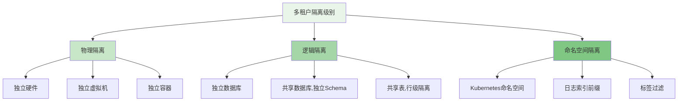

在企业级日志平台中，多租户架构和权限管理是确保数据安全、隔离和合规性的核心机制。随着组织规模的扩大和业务复杂性的增加，如何在统一的平台中为不同团队、部门或客户提供安全、独立的日志管理环境，成为日志平台设计的关键挑战。本文将深入探讨多租户架构的设计原则、权限管理的实现机制以及相关的安全最佳实践。

## 多租户架构设计原理

多租户架构是指在单一应用实例中为多个租户（客户、团队或部门）提供服务的软件架构模式。在日志平台中，多租户架构需要解决数据隔离、资源共享、性能保障和安全管理等关键问题。

### 多租户隔离级别

根据隔离程度的不同，多租户架构可以分为以下几种级别：



### 隔离级别选择策略

不同隔离级别适用于不同的业务场景和安全要求：

```yaml
# 隔离级别选择指南
isolation_level_selection:
  physical_isolation:
   适用场景:
      - 金融、医疗等高安全要求行业
      - 法规要求独立部署的客户
      - 对性能有极致要求的大型企业
    优势:
      - 最高等级的数据隔离
      - 独立的资源分配
      - 最小的性能干扰
    劣势:
      - 最高的运维成本
      - 资源利用率较低
      - 管理复杂度高
  
  logical_isolation:
    适用场景:
      - 中大型企业内部不同部门
      - 对数据隔离有一定要求但可接受共享基础设施
      - 需要平衡成本和安全性的场景
    优势:
      - 较好的成本效益
      - 中等级别的数据隔离
      - 相对简单的管理
    劣势:
      - 存在潜在的数据泄露风险
      - 资源争用可能影响性能
  
  namespace_isolation:
    适用场景:
      - 小型企业或团队
      - 开发测试环境
      - 对成本敏感的初创公司
    优势:
      - 最低的成本
      - 简单的部署和管理
      - 快速的资源扩展
    劣势:
      - 最低的隔离级别
      - 安全风险相对较高
      - 性能干扰可能性大
```

## 基于角色的访问控制(RBAC)实现

RBAC（Role-Based Access Control）是一种广泛采用的权限管理模型，通过将权限分配给角色，再将角色分配给用户，实现灵活的权限管理。

### RBAC模型设计

```java
// RBAC核心模型实现
public class RBACModel {
    // 用户实体
    public class User {
        private String userId;
        private String username;
        private String email;
        private List<String> tenantIds;
        private Map<String, List<String>> tenantRoles; // tenantId -> roleIds
        
        // getters and setters
    }
    
    // 租户实体
    public class Tenant {
        private String tenantId;
        private String tenantName;
        private String description;
        private TenantConfig config;
        
        // getters and setters
    }
    
    // 角色实体
    public class Role {
        private String roleId;
        private String roleName;
        private String description;
        private List<String> permissionIds;
        
        // getters and setters
    }
    
    // 权限实体
    public class Permission {
        private String permissionId;
        private String permissionName;
        private String resource;
        private String action;
        private String description;
        
        // getters and setters
    }
    
    // 资源实体
    public class Resource {
        private String resourceId;
        private String resourceName;
        private ResourceType type;
        private String tenantId;
        private Map<String, Object> attributes;
        
        // getters and setters
    }
}
```

### 权限管理系统实现

```java
// 权限管理服务
public class PermissionManagementService {
    private final UserRepository userRepository;
    private final TenantRepository tenantRepository;
    private final RoleRepository roleRepository;
    private final PermissionRepository permissionRepository;
    private final ResourceRepository resourceRepository;
    private final AuditService auditService;
    
    /**
     * 检查用户对资源的操作权限
     */
    public boolean checkPermission(String userId, String tenantId, 
                                 String resource, String action) {
        try {
            // 1. 验证用户存在性
            User user = userRepository.findById(userId);
            if (user == null) {
                auditService.logAccessDenied(userId, tenantId, resource, action, 
                                           "User not found");
                return false;
            }
            
            // 2. 验证租户访问权限
            if (!user.getTenantIds().contains(tenantId)) {
                auditService.logAccessDenied(userId, tenantId, resource, action, 
                                           "Tenant access denied");
                return false;
            }
            
            // 3. 获取用户在该租户下的角色
            List<String> roleIds = user.getTenantRoles().get(tenantId);
            if (roleIds == null || roleIds.isEmpty()) {
                auditService.logAccessDenied(userId, tenantId, resource, action, 
                                           "No roles assigned");
                return false;
            }
            
            // 4. 检查角色权限
            for (String roleId : roleIds) {
                Role role = roleRepository.findById(roleId);
                if (role != null) {
                    for (String permissionId : role.getPermissionIds()) {
                        Permission permission = permissionRepository.findById(permissionId);
                        if (permission != null && 
                            permission.getResource().equals(resource) && 
                            permission.getAction().equals(action)) {
                            auditService.logAccessGranted(userId, tenantId, resource, action);
                            return true;
                        }
                    }
                }
            }
            
            // 5. 记录未授权访问
            auditService.logAccessDenied(userId, tenantId, resource, action, 
                                       "Insufficient permissions");
            return false;
            
        } catch (Exception e) {
            auditService.logAccessError(userId, tenantId, resource, action, e);
            return false;
        }
    }
    
    /**
     * 查询用户有权限访问的日志
     */
    public List<LogEntry> queryLogs(String userId, String tenantId, LogQuery query) {
        // 1. 权限检查
        if (!checkPermission(userId, tenantId, "logs", "read")) {
            throw new AccessDeniedException("Insufficient permissions to read logs");
        }
        
        // 2. 添加租户过滤条件
        LogQuery tenantFilteredQuery = query.toBuilder()
            .tenantId(tenantId)
            .build();
        
        // 3. 查询原始日志
        List<LogEntry> rawLogs = logService.queryLogs(tenantFilteredQuery);
        
        // 4. 数据脱敏处理
        List<LogEntry> sanitizedLogs = sanitizeLogs(rawLogs, userId, tenantId);
        
        // 5. 记录查询审计
        auditService.logLogQuery(userId, tenantId, query);
        
        return sanitizedLogs;
    }
    
    /**
     * 数据脱敏处理
     */
    private List<LogEntry> sanitizeLogs(List<LogEntry> logs, String userId, String tenantId) {
        List<LogEntry> sanitizedLogs = new ArrayList<>();
        
        for (LogEntry log : logs) {
            // 根据用户权限和数据敏感度进行脱敏处理
            LogEntry sanitizedLog = dataSanitizer.sanitize(log, userId, tenantId);
            sanitizedLogs.add(sanitizedLog);
        }
        
        return sanitizedLogs;
    }
}
```

### 数据脱敏实现

```java
// 数据脱敏服务
public class DataSanitizationService {
    private final SensitiveDataDetector sensitiveDataDetector;
    private final DataMasker dataMasker;
    private final UserPermissionService userPermissionService;
    
    /**
     * 对日志条目进行脱敏处理
     */
    public LogEntry sanitize(LogEntry logEntry, String userId, String tenantId) {
        // 1. 检测敏感数据
        List<SensitiveData> sensitiveDataList = sensitiveDataDetector.detect(logEntry);
        
        // 2. 获取用户权限级别
        PermissionLevel userPermissionLevel = userPermissionService.getPermissionLevel(
            userId, tenantId);
        
        // 3. 根据权限级别进行脱敏处理
        LogEntry sanitizedLog = logEntry.copy();
        
        for (SensitiveData sensitiveData : sensitiveDataList) {
            // 根据敏感数据类型和用户权限决定脱敏策略
            if (!userPermissionLevel.canAccess(sensitiveData.getType())) {
                // 执行脱敏
                String maskedValue = dataMasker.mask(sensitiveData.getValue(), 
                                                   sensitiveData.getType());
                sanitizedLog.replace(sensitiveData.getFieldPath(), maskedValue);
            }
        }
        
        return sanitizedLog;
    }
}

// 敏感数据类型枚举
public enum SensitiveDataType {
    PII_EMAIL("个人邮箱", 3),
    PII_PHONE("个人电话", 3),
    PII_ID_CARD("身份证号", 4),
    BUSINESS_DATA("业务敏感数据", 2),
    SYSTEM_DATA("系统敏感数据", 1);
    
    private final String description;
    private final int sensitivityLevel;
    
    SensitiveDataType(String description, int sensitivityLevel) {
        this.description = description;
        this.sensitivityLevel = sensitivityLevel;
    }
    
    public int getSensitivityLevel() {
        return sensitivityLevel;
    }
}

// 权限级别枚举
public enum PermissionLevel {
    ADMIN(4, "管理员", Arrays.asList(
        SensitiveDataType.PII_EMAIL,
        SensitiveDataType.PII_PHONE,
        SensitiveDataType.PII_ID_CARD,
        SensitiveDataType.BUSINESS_DATA,
        SensitiveDataType.SYSTEM_DATA)),
    
    OPERATOR(3, "操作员", Arrays.asList(
        SensitiveDataType.PII_EMAIL,
        SensitiveDataType.PII_PHONE,
        SensitiveDataType.BUSINESS_DATA)),
    
    ANALYST(2, "分析师", Arrays.asList(
        SensitiveDataType.BUSINESS_DATA)),
    
    VIEWER(1, "查看员", Arrays.asList());
    
    private final int level;
    private final String description;
    private final List<SensitiveDataType> accessibleDataTypes;
    
    PermissionLevel(int level, String description, List<SensitiveDataType> accessibleDataTypes) {
        this.level = level;
        this.description = description;
        this.accessibleDataTypes = accessibleDataTypes;
    }
    
    public boolean canAccess(SensitiveDataType dataType) {
        return accessibleDataTypes.contains(dataType);
    }
}
```

## 租户资源配额管理

为了确保多租户环境下的资源公平分配和系统稳定性，需要实现租户资源配额管理机制。

### 资源配额模型

```yaml
# 租户资源配额配置
tenant_resource_quotas:
  storage_quota:
    description: "存储配额限制"
    unit: "GB"
    default: "100"
    max: "10000"
  
  log_volume_quota:
    description: "日志量配额限制"
    unit: "EPS" # Events Per Second
    default: "1000"
    max: "100000"
  
  cpu_quota:
    description: "CPU资源配额"
    unit: "cores"
    default: "1"
    max: "32"
  
  memory_quota:
    description: "内存资源配额"
    unit: "GB"
    default: "2"
    max: "128"
  
  concurrent_queries:
    description: "并发查询限制"
    unit: "count"
    default: "10"
    max: "100"
```

### 配额管理实现

```java
// 资源配额管理器
public class ResourceQuotaManager {
    private final TenantQuotaRepository quotaRepository;
    private final ResourceUsageTracker usageTracker;
    private final AlertingService alertingService;
    
    /**
     * 检查租户资源使用是否超出配额
     */
    public QuotaCheckResult checkQuota(String tenantId, ResourceType resourceType, 
                                     double requestedAmount) {
        try {
            // 1. 获取租户配额
            TenantQuota quota = quotaRepository.findByTenantIdAndResourceType(
                tenantId, resourceType);
            
            if (quota == null) {
                // 使用默认配额
                quota = getDefaultQuota(resourceType);
            }
            
            // 2. 获取当前使用量
            double currentUsage = usageTracker.getCurrentUsage(tenantId, resourceType);
            
            // 3. 计算使用后总量
            double totalUsage = currentUsage + requestedAmount;
            
            // 4. 检查配额
            if (totalUsage > quota.getLimit()) {
                // 超出配额
                return QuotaCheckResult.builder()
                    .allowed(false)
                    .reason("Quota exceeded")
                    .currentUsage(currentUsage)
                    .requestedAmount(requestedAmount)
                    .quotaLimit(quota.getLimit())
                    .build();
            }
            
            // 5. 检查是否接近配额限制
            double usagePercentage = (totalUsage / quota.getLimit()) * 100;
            if (usagePercentage > 80) {
                // 发送配额使用警告
                alertingService.sendQuotaWarning(tenantId, resourceType, 
                                               usagePercentage);
            }
            
            return QuotaCheckResult.builder()
                .allowed(true)
                .currentUsage(currentUsage)
                .requestedAmount(requestedAmount)
                .quotaLimit(quota.getLimit())
                .build();
                
        } catch (Exception e) {
            // 记录错误并允许操作（避免因配额系统故障影响业务）
            log.error("Error checking quota for tenant: " + tenantId, e);
            return QuotaCheckResult.builder()
                .allowed(true)
                .error(e.getMessage())
                .build();
        }
    }
    
    /**
     * 更新资源使用量
     */
    public void updateUsage(String tenantId, ResourceType resourceType, 
                          double amount) {
        usageTracker.updateUsage(tenantId, resourceType, amount);
    }
    
    /**
     * 获取默认配额
     */
    private TenantQuota getDefaultQuota(ResourceType resourceType) {
        // 根据资源类型返回默认配额
        switch (resourceType) {
            case STORAGE:
                return TenantQuota.builder()
                    .resourceType(ResourceType.STORAGE)
                    .limit(100.0) // 100GB
                    .unit("GB")
                    .build();
            case LOG_VOLUME:
                return TenantQuota.builder()
                    .resourceType(ResourceType.LOG_VOLUME)
                    .limit(1000.0) // 1000 EPS
                    .unit("EPS")
                    .build();
            // ... 其他资源类型
            default:
                throw new IllegalArgumentException("Unsupported resource type: " + resourceType);
        }
    }
}
```

## 审计日志与合规性

审计日志是多租户权限管理的重要组成部分，它记录了所有关键操作，为安全分析和合规性检查提供依据。

### 审计日志模型

```java
// 审计日志实体
public class AuditLog {
    private String id;
    private String tenantId;
    private String userId;
    private String userName;
    private String action;
    private String resource;
    private String resourceId;
    private Map<String, Object> details;
    private AuditResult result;
    private String reason;
    private Instant timestamp;
    private String clientIp;
    private String userAgent;
    
    // builders, getters and setters
}

// 审计结果枚举
public enum AuditResult {
    SUCCESS("成功"),
    FAILURE("失败"),
    DENIED("拒绝");
    
    private final String description;
    
    AuditResult(String description) {
        this.description = description;
    }
}
```

### 审计服务实现

```java
// 审计服务
public class AuditService {
    private final AuditLogRepository auditLogRepository;
    private final AsyncLogWriter asyncLogWriter;
    
    /**
     * 记录访问授权
     */
    public void logAccessGranted(String userId, String tenantId, 
                               String resource, String action) {
        AuditLog auditLog = AuditLog.builder()
            .tenantId(tenantId)
            .userId(userId)
            .action(action)
            .resource(resource)
            .result(AuditResult.SUCCESS)
            .timestamp(Instant.now())
            .build();
        
        asyncLogWriter.write(auditLog);
    }
    
    /**
     * 记录访问拒绝
     */
    public void logAccessDenied(String userId, String tenantId, 
                              String resource, String action, String reason) {
        AuditLog auditLog = AuditLog.builder()
            .tenantId(tenantId)
            .userId(userId)
            .action(action)
            .resource(resource)
            .result(AuditResult.DENIED)
            .reason(reason)
            .timestamp(Instant.now())
            .build();
        
        asyncLogWriter.write(auditLog);
    }
    
    /**
     * 记录访问错误
     */
    public void logAccessError(String userId, String tenantId, 
                             String resource, String action, Exception error) {
        AuditLog auditLog = AuditLog.builder()
            .tenantId(tenantId)
            .userId(userId)
            .action(action)
            .resource(resource)
            .result(AuditResult.FAILURE)
            .reason(error.getMessage())
            .timestamp(Instant.now())
            .build();
        
        asyncLogWriter.write(auditLog);
    }
    
    /**
     * 记录日志查询操作
     */
    public void logLogQuery(String userId, String tenantId, LogQuery query) {
        Map<String, Object> details = new HashMap<>();
        details.put("query", query.toString());
        details.put("timestamp_range", query.getStartTime() + " to " + query.getEndTime());
        
        AuditLog auditLog = AuditLog.builder()
            .tenantId(tenantId)
            .userId(userId)
            .action("QUERY_LOGS")
            .resource("logs")
            .details(details)
            .result(AuditResult.SUCCESS)
            .timestamp(Instant.now())
            .build();
        
        asyncLogWriter.write(auditLog);
    }
}
```

## 安全最佳实践

### 1. 身份认证与授权

```yaml
# 身份认证与授权最佳实践
authentication_authorization_best_practices:
  - implement_strong_authentication: "实施强身份认证（MFA）"
  - use_jwt_tokens: "使用JWT令牌进行会话管理"
  - implement_session_timeout: "实现会话超时机制"
  - regular_password_rotation: "定期密码轮换"
  - least_privilege_principle: "遵循最小权限原则"
```

### 2. 数据保护

```yaml
# 数据保护最佳实践
data_protection_best_practices:
  - encrypt_data_at_rest: "静态数据加密"
  - encrypt_data_in_transit: "传输数据加密"
  - implement_data_masking: "实施数据掩码"
  - regular_security_audits: "定期安全审计"
  - vulnerability_assessments: "漏洞评估"
```

### 3. 监控与告警

```yaml
# 监控与告警最佳实践
monitoring_alerting_best_practices:
  - real_time_audit_monitoring: "实时审计监控"
  - anomaly_detection: "异常检测"
  - security_information_events: "安全信息事件管理(SIEM)"
  - incident_response_plan: "事件响应计划"
  - regular_compliance_reporting: "定期合规报告"
```

## 技术架构实现

### 1. 微服务架构

```yaml
# 多租户权限管理微服务架构
microservices_architecture:
  auth_service:
    description: "认证服务"
    responsibilities:
      - user_authentication: "用户认证"
      - token_management: "令牌管理"
      - session_management: "会话管理"
  
  rbac_service:
    description: "RBAC权限服务"
    responsibilities:
      - role_management: "角色管理"
      - permission_management: "权限管理"
      - access_control: "访问控制"
  
  tenant_service:
    description: "租户管理服务"
    responsibilities:
      - tenant_lifecycle: "租户生命周期管理"
      - quota_management: "配额管理"
      - resource_isolation: "资源隔离"
  
  audit_service:
    description: "审计服务"
    responsibilities:
      - audit_logging: "审计日志记录"
      - compliance_reporting: "合规报告"
      - security_monitoring: "安全监控"
```

### 2. 数据库设计

```sql
-- 租户表
CREATE TABLE tenants (
    id VARCHAR(36) PRIMARY KEY,
    name VARCHAR(255) NOT NULL,
    description TEXT,
    status VARCHAR(20) NOT NULL,
    created_at TIMESTAMP NOT NULL,
    updated_at TIMESTAMP NOT NULL
);

-- 用户表
CREATE TABLE users (
    id VARCHAR(36) PRIMARY KEY,
    username VARCHAR(100) NOT NULL UNIQUE,
    email VARCHAR(255) NOT NULL UNIQUE,
    password_hash VARCHAR(255) NOT NULL,
    status VARCHAR(20) NOT NULL,
    created_at TIMESTAMP NOT NULL,
    updated_at TIMESTAMP NOT NULL
);

-- 用户租户关联表
CREATE TABLE user_tenants (
    user_id VARCHAR(36) NOT NULL,
    tenant_id VARCHAR(36) NOT NULL,
    roles JSON NOT NULL, -- 该用户在该租户下的角色列表
    created_at TIMESTAMP NOT NULL,
    PRIMARY KEY (user_id, tenant_id),
    FOREIGN KEY (user_id) REFERENCES users(id),
    FOREIGN KEY (tenant_id) REFERENCES tenants(id)
);

-- 角色表
CREATE TABLE roles (
    id VARCHAR(36) PRIMARY KEY,
    name VARCHAR(100) NOT NULL,
    description TEXT,
    tenant_id VARCHAR(36), -- 全局角色为NULL
    created_at TIMESTAMP NOT NULL,
    updated_at TIMESTAMP NOT NULL,
    FOREIGN KEY (tenant_id) REFERENCES tenants(id)
);

-- 权限表
CREATE TABLE permissions (
    id VARCHAR(36) PRIMARY KEY,
    name VARCHAR(100) NOT NULL,
    description TEXT,
    resource VARCHAR(100) NOT NULL,
    action VARCHAR(50) NOT NULL,
    tenant_id VARCHAR(36), -- 全局权限为NULL
    created_at TIMESTAMP NOT NULL,
    updated_at TIMESTAMP NOT NULL,
    FOREIGN KEY (tenant_id) REFERENCES tenants(id)
);

-- 角色权限关联表
CREATE TABLE role_permissions (
    role_id VARCHAR(36) NOT NULL,
    permission_id VARCHAR(36) NOT NULL,
    created_at TIMESTAMP NOT NULL,
    PRIMARY KEY (role_id, permission_id),
    FOREIGN KEY (role_id) REFERENCES roles(id),
    FOREIGN KEY (permission_id) REFERENCES permissions(id)
);
```

## 总结

多租户与权限管理是构建安全可靠的日志平台访问控制体系的核心要素。通过合理的架构设计、完善的RBAC模型、精细的资源配额管理和全面的审计机制，可以为不同租户提供安全、独立的日志管理环境。

关键要点包括：

1. **多租户架构**：根据业务需求选择合适的隔离级别，平衡安全性和成本效益
2. **RBAC模型**：实现灵活的权限管理，支持细粒度的访问控制
3. **数据脱敏**：保护敏感信息，满足合规要求
4. **资源配额**：确保资源公平分配，防止租户间相互影响
5. **审计日志**：记录关键操作，支持安全分析和合规检查

通过遵循这些最佳实践和技术实现方案，可以构建一个安全、可靠、高效的多租户日志平台，为企业提供优质的日志管理服务。