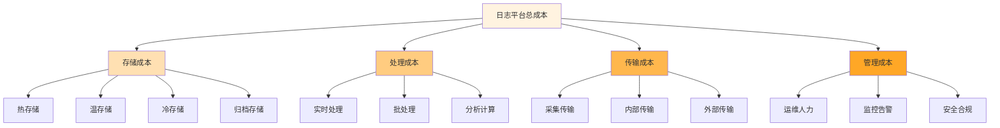

在企业级日志平台的运营中，成本管理是一个至关重要的环节。随着业务规模的扩大和系统复杂性的增加，日志数据量呈指数级增长，给存储、处理和传输带来了巨大的成本压力。如何在保证日志价值最大化的前提下，有效控制和优化日志平台的总体拥有成本(TCO)，成为企业IT管理者面临的重要挑战。本文将深入探讨日志成本管理的核心策略、技术实现和最佳实践。

## 日志成本构成分析

理解日志成本的构成是有效管理成本的前提。日志平台的成本主要来源于存储、处理、传输和管理四个方面。

### 成本构成模型



### 存储成本分析

存储成本是日志平台最大的成本组成部分，通常占总成本的60-80%。不同存储介质的成本差异巨大：

```yaml
# 存储成本对比
storage_cost_comparison:
  ssd_storage:
    cost_per_gb_month: "$0.10"
    access_speed: "high"
    use_case: "热数据，频繁访问"
  
  hdd_storage:
    cost_per_gb_month: "$0.05"
    access_speed: "medium"
    use_case: "温数据，偶尔访问"
  
  object_storage:
    cost_per_gb_month: "$0.01"
    access_speed: "low"
    use_case: "冷数据，很少访问"
  
  archival_storage:
    cost_per_gb_month: "$0.005"
    access_speed: "very_low"
    use_case: "归档数据，极少访问"
```

### 处理成本分析

处理成本主要包括CPU、内存等计算资源的消耗：

```yaml
# 处理成本因素
processing_cost_factors:
  real_time_processing:
    description: "实时流处理"
    resource_intensity: "high"
    cost_factor: "3.0"
  
  batch_processing:
    description: "批量处理"
    resource_intensity: "medium"
    cost_factor: "1.5"
  
  analytical_queries:
    description: "分析查询"
    resource_intensity: "high"
    cost_factor: "2.5"
```

## 存储成本优化策略

存储成本优化是日志成本管理的核心，通过合理的策略可以显著降低存储开销。

### 分层存储策略

分层存储是根据数据访问频率将日志存储在不同成本和性能的存储介质中：

```java
// 分层存储管理器
public class TieredStorageManager {
    private final Map<StorageTier, StorageBackend> storageBackends;
    private final DataLifecyclePolicy policy;
    private final CostCalculator costCalculator;
    
    /**
     * 根据日志特征确定存储层级
     */
    public StorageTier determineStorageTier(LogEntry logEntry) {
        // 1. 分析日志重要性
        LogImportance importance = analyzeImportance(logEntry);
        
        // 2. 分析访问模式
        AccessPattern accessPattern = analyzeAccessPattern(logEntry);
        
        // 3. 考虑保留策略
        RetentionPolicy retentionPolicy = getRetentionPolicy(logEntry);
        
        // 4. 确定存储层级
        if (importance == LogImportance.CRITICAL && 
            accessPattern == AccessPattern.FREQUENT) {
            return StorageTier.HOT;
        } else if (accessPattern == AccessPattern.OCCASIONAL) {
            return StorageTier.WARM;
        } else if (retentionPolicy.getRetentionPeriod().toDays() > 30) {
            return StorageTier.COLD;
        } else {
            return StorageTier.ARCHIVE;
        }
    }
    
    /**
     * 执行数据迁移
     */
    public void migrateData(String logId, StorageTier fromTier, StorageTier toTier) {
        try {
            // 1. 从源层级读取数据
            LogEntry logEntry = storageBackends.get(fromTier).read(logId);
            
            // 2. 数据转换（如有必要）
            LogEntry transformedLog = transformForTier(logEntry, toTier);
            
            // 3. 写入目标层级
            storageBackends.get(toTier).write(logId, transformedLog);
            
            // 4. 更新元数据
            metadataService.updateStorageTier(logId, toTier);
            
            // 5. 删除源层级数据
            storageBackends.get(fromTier).delete(logId);
            
            // 6. 记录迁移日志
            auditService.logDataMigration(logId, fromTier, toTier);
            
        } catch (Exception e) {
            log.error("Failed to migrate data: " + logId, e);
            throw new StorageMigrationException("Migration failed", e);
        }
    }
    
    /**
     * 分析日志重要性
     */
    private LogImportance analyzeImportance(LogEntry logEntry) {
        // 基于日志级别、服务重要性、错误类型等维度分析
        if (logEntry.getLevel() == LogLevel.ERROR || 
            logEntry.getLevel() == LogLevel.FATAL) {
            return LogImportance.CRITICAL;
        }
        
        if (logEntry.getService() != null && 
            criticalServices.contains(logEntry.getService())) {
            return LogImportance.HIGH;
        }
        
        return LogImportance.NORMAL;
    }
    
    /**
     * 分析访问模式
     */
    private AccessPattern analyzeAccessPattern(LogEntry logEntry) {
        // 基于历史访问统计数据
        String logType = logEntry.getType();
        AccessStats stats = accessStatsService.getAccessStats(logType);
        
        if (stats.getDailyAccessCount() > 100) {
            return AccessPattern.FREQUENT;
        } else if (stats.getWeeklyAccessCount() > 10) {
            return AccessPattern.OCCASIONAL;
        } else {
            return AccessPattern.RARE;
        }
    }
}

// 存储层级枚举
public enum StorageTier {
    HOT("热存储", "SSD", 0.10),
    WARM("温存储", "HDD", 0.05),
    COLD("冷存储", "对象存储", 0.01),
    ARCHIVE("归档存储", "磁带存储", 0.005);
    
    private final String description;
    private final String storageType;
    private final double costPerGBPerMonth;
    
    StorageTier(String description, String storageType, double costPerGBPerMonth) {
        this.description = description;
        this.storageType = storageType;
        this.costPerGBPerMonth = costPerGBPerMonth;
    }
    
    public double getCostPerGBPerMonth() {
        return costPerGBPerMonth;
    }
}
```

### 数据压缩技术

数据压缩是降低存储成本的有效手段，通过算法减少数据占用的存储空间：

```python
# 日志数据压缩服务
class LogCompressionService:
    def __init__(self):
        self.compressors = {
            'gzip': GzipCompressor(),
            'lz4': LZ4Compressor(),
            'zstd': ZstdCompressor(),
            'snappy': SnappyCompressor()
        }
        self.compression_stats = {}
    
    def compress_log(self, log_data, algorithm='zstd'):
        """压缩日志数据"""
        try:
            # 1. 选择压缩算法
            compressor = self.compressors.get(algorithm)
            if not compressor:
                raise ValueError(f"Unsupported compression algorithm: {algorithm}")
            
            # 2. 执行压缩
            start_time = time.time()
            compressed_data = compressor.compress(log_data)
            compression_time = time.time() - start_time
            
            # 3. 计算压缩比
            original_size = len(log_data)
            compressed_size = len(compressed_data)
            compression_ratio = original_size / compressed_size if compressed_size > 0 else 0
            
            # 4. 更新统计信息
            self._update_stats(algorithm, original_size, compressed_size, compression_time)
            
            return {
                'compressed_data': compressed_data,
                'compression_ratio': compression_ratio,
                'compression_time': compression_time,
                'original_size': original_size,
                'compressed_size': compressed_size
            }
            
        except Exception as e:
            logger.error(f"Failed to compress log data: {str(e)}")
            raise CompressionError(f"Compression failed: {str(e)}")
    
    def decompress_log(self, compressed_data, algorithm='zstd'):
        """解压缩日志数据"""
        try:
            # 1. 选择解压缩算法
            compressor = self.compressors.get(algorithm)
            if not compressor:
                raise ValueError(f"Unsupported compression algorithm: {algorithm}")
            
            # 2. 执行解压缩
            start_time = time.time()
            decompressed_data = compressor.decompress(compressed_data)
            decompression_time = time.time() - start_time
            
            return {
                'decompressed_data': decompressed_data,
                'decompression_time': decompression_time
            }
            
        except Exception as e:
            logger.error(f"Failed to decompress log data: {str(e)}")
            raise CompressionError(f"Decompression failed: {str(e)}")
    
    def _update_stats(self, algorithm, original_size, compressed_size, compression_time):
        """更新压缩统计信息"""
        if algorithm not in self.compression_stats:
            self.compression_stats[algorithm] = {
                'total_original_size': 0,
                'total_compressed_size': 0,
                'total_compression_time': 0,
                'compression_count': 0
            }
        
        stats = self.compression_stats[algorithm]
        stats['total_original_size'] += original_size
        stats['total_compressed_size'] += compressed_size
        stats['total_compression_time'] += compression_time
        stats['compression_count'] += 1
    
    def get_compression_stats(self):
        """获取压缩统计信息"""
        stats_summary = {}
        for algorithm, stats in self.compression_stats.items():
            total_original = stats['total_original_size']
            total_compressed = stats['total_compressed_size']
            avg_ratio = total_original / total_compressed if total_compressed > 0 else 0
            avg_time = stats['total_compression_time'] / stats['compression_count'] if stats['compression_count'] > 0 else 0
            
            stats_summary[algorithm] = {
                'average_compression_ratio': round(avg_ratio, 2),
                'average_compression_time': round(avg_time, 4),
                'total_logs_compressed': stats['compression_count'],
                'total_original_size': total_original,
                'total_compressed_size': total_compressed,
                'space_saved': total_original - total_compressed
            }
        
        return stats_summary

# 不同压缩算法的实现
class ZstdCompressor:
    def compress(self, data):
        return zstd.compress(data)
    
    def decompress(self, compressed_data):
        return zstd.decompress(compressed_data)

class GzipCompressor:
    def compress(self, data):
        return gzip.compress(data)
    
    def decompress(self, compressed_data):
        return gzip.decompress(compressed_data)
```

### 智能保留策略

通过智能分析日志的业务价值和访问模式，制定合理的数据保留策略：

```yaml
# 智能保留策略配置
intelligent_retention_policies:
  critical_logs:
    pattern: "ERROR|FATAL|Exception"
    retention: "365d"
    description: "关键错误日志，长期保留"
  
  business_logs:
    pattern: "business|transaction|order"
    retention: "180d"
    description: "业务相关日志，中等保留期"
  
  operational_logs:
    pattern: "INFO|DEBUG"
    retention: "30d"
    description: "操作日志，短期保留"
  
  verbose_logs:
    pattern: "TRACE|VERBOSE"
    retention: "7d"
    description: "详细调试日志，短期保留"
  
  access_logs:
    pattern: "access|audit"
    retention: "90d"
    description: "访问和审计日志，合规要求保留"
```

## 日志采样与分级采集

日志采样和分级采集是控制日志量、降低处理和存储成本的有效手段。

### 自适应采样策略

```java
// 自适应采样器
public class AdaptiveSampler {
    private final SamplingConfig config;
    private final MetricsCollector metricsCollector;
    private final AtomicDouble currentSamplingRate;
    private final ScheduledExecutorService scheduler;
    
    public AdaptiveSampler(SamplingConfig config) {
        this.config = config;
        this.metricsCollector = new MetricsCollector();
        this.currentSamplingRate = new AtomicDouble(config.getInitialSamplingRate());
        this.scheduler = Executors.newScheduledThreadPool(1);
        
        // 启动采样率调整任务
        scheduler.scheduleAtFixedRate(this::adjustSamplingRate, 
                                    config.getAdjustmentInterval(), 
                                    config.getAdjustmentInterval(), 
                                    TimeUnit.SECONDS);
    }
    
    /**
     * 判断是否应该采样该日志
     */
    public boolean shouldSample(LogEntry logEntry) {
        // 1. 检查是否为关键日志（不采样）
        if (isCriticalLog(logEntry)) {
            return true;
        }
        
        // 2. 根据当前采样率决定是否采样
        double rate = currentSamplingRate.get();
        return ThreadLocalRandom.current().nextDouble() < rate;
    }
    
    /**
     * 调整采样率
     */
    private void adjustSamplingRate() {
        try {
            // 1. 收集当前系统指标
            SystemMetrics metrics = metricsCollector.getCurrentMetrics();
            
            // 2. 计算新的采样率
            double newRate = calculateNewSamplingRate(metrics);
            
            // 3. 应用新的采样率（限制在配置范围内）
            newRate = Math.max(config.getMinSamplingRate(), 
                             Math.min(config.getMaxSamplingRate(), newRate));
            
            // 4. 更新采样率
            double oldRate = currentSamplingRate.getAndSet(newRate);
            
            // 5. 记录调整日志
            if (Math.abs(newRate - oldRate) > 0.01) {
                log.info("Sampling rate adjusted from {} to {}", oldRate, newRate);
                auditService.logSamplingRateChange(oldRate, newRate);
            }
            
        } catch (Exception e) {
            log.error("Failed to adjust sampling rate", e);
        }
    }
    
    /**
     * 根据系统指标计算新的采样率
     */
    private double calculateNewSamplingRate(SystemMetrics metrics) {
        double currentRate = currentSamplingRate.get();
        
        // 1. 检查是否超过吞吐量阈值
        if (metrics.getThroughput() > config.getMaxThroughput()) {
            // 降低采样率
            return currentRate * 0.9;
        }
        
        // 2. 检查资源使用情况
        if (metrics.getCpuUsage() > 80 || metrics.getMemoryUsage() > 80) {
            // 降低采样率
            return currentRate * 0.95;
        }
        
        // 3. 如果资源充足且吞吐量较低，可以适当提高采样率
        if (metrics.getThroughput() < config.getMaxThroughput() * 0.5 && 
            metrics.getCpuUsage() < 50 && metrics.getMemoryUsage() < 50) {
            return Math.min(config.getMaxSamplingRate(), currentRate * 1.05);
        }
        
        // 保持当前采样率
        return currentRate;
    }
    
    /**
     * 判断是否为关键日志
     */
    private boolean isCriticalLog(LogEntry logEntry) {
        // 关键日志不进行采样
        return logEntry.getLevel() == LogLevel.ERROR || 
               logEntry.getLevel() == LogLevel.FATAL ||
               logEntry.getMessage().contains("critical") ||
               criticalServicePatterns.stream().anyMatch(
                   pattern -> pattern.matcher(logEntry.getMessage()).matches());
    }
}

// 采样配置
public class SamplingConfig {
    private double initialSamplingRate = 1.0;  // 初始采样率
    private double minSamplingRate = 0.1;      // 最小采样率
    private double maxSamplingRate = 1.0;      // 最大采样率
    private long maxThroughput = 10000;        // 最大吞吐量（EPS）
    private long adjustmentInterval = 60;      // 调整间隔（秒）
    
    // getters and setters
}
```

### 优先级采样策略

```yaml
# 基于优先级的采样策略
priority_based_sampling:
  critical:
    sampling_rate: 1.0
    retention: "365d"
    description: "关键日志，100%采样"
    patterns:
      - "ERROR"
      - "FATAL"
      - "Exception"
      - "critical"
  
  high:
    sampling_rate: 0.8
    retention: "90d"
    description: "高优先级日志，80%采样"
    patterns:
      - "WARN"
      - "warning"
      - "performance"
      - "latency"
  
  medium:
    sampling_rate: 0.5
    retention: "30d"
    description: "中优先级日志，50%采样"
    patterns:
      - "INFO"
      - "info"
      - "business"
  
  low:
    sampling_rate: 0.1
    retention: "7d"
    description: "低优先级日志，10%采样"
    patterns:
      - "DEBUG"
      - "debug"
      - "trace"
```

## 成本监控与分析

建立完善的成本监控体系，实时跟踪和分析日志平台的成本变化。

### 成本监控指标

```java
// 成本监控服务
public class CostMonitoringService {
    private final CostRepository costRepository;
    private final MetricsService metricsService;
    private final AlertingService alertingService;
    
    /**
     * 计算当前成本
     */
    public CostSummary calculateCurrentCost() {
        CostSummary summary = new CostSummary();
        
        // 1. 计算存储成本
        StorageCost storageCost = calculateStorageCost();
        summary.setStorageCost(storageCost);
        
        // 2. 计算处理成本
        ProcessingCost processingCost = calculateProcessingCost();
        summary.setProcessingCost(processingCost);
        
        // 3. 计算传输成本
        TransferCost transferCost = calculateTransferCost();
        summary.setTransferCost(transferCost);
        
        // 4. 计算管理成本
        ManagementCost managementCost = calculateManagementCost();
        summary.setManagementCost(managementCost);
        
        // 5. 计算总成本
        double totalCost = storageCost.getTotal() + 
                          processingCost.getTotal() + 
                          transferCost.getTotal() + 
                          managementCost.getTotal();
        summary.setTotalCost(totalCost);
        
        return summary;
    }
    
    /**
     * 计算存储成本
     */
    private StorageCost calculateStorageCost() {
        StorageCost cost = new StorageCost();
        
        // 获取各存储层级的使用情况
        Map<StorageTier, Long> usageByTier = storageService.getUsageByTier();
        
        double totalCost = 0;
        Map<StorageTier, Double> costByTier = new HashMap<>();
        
        for (Map.Entry<StorageTier, Long> entry : usageByTier.entrySet()) {
            StorageTier tier = entry.getKey();
            long sizeGB = entry.getValue();
            double tierCost = sizeGB * tier.getCostPerGBPerMonth();
            
            costByTier.put(tier, tierCost);
            totalCost += tierCost;
        }
        
        cost.setCostByTier(costByTier);
        cost.setTotal(totalCost);
        
        return cost;
    }
    
    /**
     * 生成成本报告
     */
    public CostReport generateCostReport(LocalDate startDate, LocalDate endDate) {
        CostReport report = new CostReport();
        report.setStartDate(startDate);
        report.setEndDate(endDate);
        
        // 1. 获取历史成本数据
        List<CostSummary> historicalCosts = costRepository.findByDateRange(
            startDate, endDate);
        
        // 2. 计算趋势分析
        CostTrendAnalysis trendAnalysis = analyzeCostTrend(historicalCosts);
        report.setTrendAnalysis(trendAnalysis);
        
        // 3. 识别成本异常
        List<CostAnomaly> anomalies = detectCostAnomalies(historicalCosts);
        report.setAnomalies(anomalies);
        
        // 4. 提供优化建议
        List<OptimizationRecommendation> recommendations = generateRecommendations(
            historicalCosts);
        report.setRecommendations(recommendations);
        
        return report;
    }
    
    /**
     * 检测成本异常
     */
    private List<CostAnomaly> detectCostAnomalies(List<CostSummary> historicalCosts) {
        List<CostAnomaly> anomalies = new ArrayList<>();
        
        if (historicalCosts.size() < 7) {
            return anomalies; // 数据不足，无法检测异常
        }
        
        // 计算历史平均成本
        double avgCost = historicalCosts.stream()
            .mapToDouble(CostSummary::getTotalCost)
            .average()
            .orElse(0);
        
        // 计算标准差
        double variance = historicalCosts.stream()
            .mapToDouble(cs -> Math.pow(cs.getTotalCost() - avgCost, 2))
            .average()
            .orElse(0);
        double stdDev = Math.sqrt(variance);
        
        // 检测异常点（超过2个标准差）
        for (int i = 0; i < historicalCosts.size(); i++) {
            CostSummary cost = historicalCosts.get(i);
            if (Math.abs(cost.getTotalCost() - avgCost) > 2 * stdDev) {
                CostAnomaly anomaly = new CostAnomaly();
                anomaly.setDate(cost.getDate());
                anomaly.setActualCost(cost.getTotalCost());
                anomaly.setExpectedCost(avgCost);
                anomaly.setDeviation(Math.abs(cost.getTotalCost() - avgCost));
                anomaly.setSeverity(determineAnomalySeverity(
                    cost.getTotalCost(), avgCost, stdDev));
                
                anomalies.add(anomaly);
            }
        }
        
        return anomalies;
    }
    
    /**
     * 确定异常严重程度
     */
    private AnomalySeverity determineAnomalySeverity(double actualCost, 
                                                   double avgCost, double stdDev) {
        double deviation = Math.abs(actualCost - avgCost);
        if (deviation > 3 * stdDev) {
            return AnomalySeverity.CRITICAL;
        } else if (deviation > 2 * stdDev) {
            return AnomalySeverity.HIGH;
        } else {
            return AnomalySeverity.MEDIUM;
        }
    }
}
```

## 成本优化最佳实践

### 1. 存储优化实践

```yaml
# 存储优化最佳实践
storage_optimization_practices:
  - implement_tiered_storage: "实施分层存储策略"
  - enable_data_compression: "启用数据压缩"
  - use_intelligent_retention: "使用智能保留策略"
  - regular_storage_audits: "定期存储审计"
  - monitor_storage_growth: "监控存储增长趋势"
```

### 2. 采样优化实践

```yaml
# 采样优化最佳实践
sampling_optimization_practices:
  - implement_adaptive_sampling: "实施自适应采样"
  - use_priority_based_sampling: "使用优先级采样"
  - preserve_critical_logs: "保留关键日志"
  - regularly_review_sampling_policies: "定期审查采样策略"
  - monitor_sampling_impact: "监控采样对业务的影响"
```

### 3. 处理优化实践

```yaml
# 处理优化最佳实践
processing_optimization_practices:
  - optimize_log_parsing: "优化日志解析"
  - use_batch_processing: "使用批量处理"
  - implement_caching: "实施缓存机制"
  - optimize_query_performance: "优化查询性能"
  - monitor_processing_efficiency: "监控处理效率"
```

## 技术实现架构

### 1. 成本管理微服务架构

```yaml
# 成本管理微服务架构
cost_management_microservices:
  storage_optimizer:
    description: "存储优化服务"
    responsibilities:
      - tiered_storage_management: "分层存储管理"
      - data_compression: "数据压缩"
      - retention_policy_enforcement: "保留策略执行"
  
  sampler:
    description: "采样服务"
    responsibilities:
      - adaptive_sampling: "自适应采样"
      - priority_sampling: "优先级采样"
      - sampling_rate_adjustment: "采样率调整"
  
  cost_analyzer:
    description: "成本分析服务"
    responsibilities:
      - cost_calculation: "成本计算"
      - trend_analysis: "趋势分析"
      - anomaly_detection: "异常检测"
  
  optimizer:
    description: "优化建议服务"
    responsibilities:
      - optimization_recommendations: "优化建议生成"
      - policy_suggestions: "策略建议"
      - cost_projection: "成本预测"
```

### 2. 数据库设计

```sql
-- 成本记录表
CREATE TABLE cost_records (
    id VARCHAR(36) PRIMARY KEY,
    date DATE NOT NULL,
    storage_cost DECIMAL(10,2) NOT NULL,
    processing_cost DECIMAL(10,2) NOT NULL,
    transfer_cost DECIMAL(10,2) NOT NULL,
    management_cost DECIMAL(10,2) NOT NULL,
    total_cost DECIMAL(10,2) NOT NULL,
    created_at TIMESTAMP NOT NULL,
    updated_at TIMESTAMP NOT NULL
);

-- 存储使用情况表
CREATE TABLE storage_usage (
    id VARCHAR(36) PRIMARY KEY,
    date DATE NOT NULL,
    tenant_id VARCHAR(36),
    storage_tier VARCHAR(20) NOT NULL,
    usage_gb BIGINT NOT NULL,
    cost DECIMAL(10,2) NOT NULL,
    created_at TIMESTAMP NOT NULL
);

-- 采样记录表
CREATE TABLE sampling_records (
    id VARCHAR(36) PRIMARY KEY,
    timestamp TIMESTAMP NOT NULL,
    log_type VARCHAR(100) NOT NULL,
    sampling_rate DECIMAL(5,4) NOT NULL,
    original_count BIGINT NOT NULL,
    sampled_count BIGINT NOT NULL,
    created_at TIMESTAMP NOT NULL
);

-- 成本异常表
CREATE TABLE cost_anomalies (
    id VARCHAR(36) PRIMARY KEY,
    date DATE NOT NULL,
    actual_cost DECIMAL(10,2) NOT NULL,
    expected_cost DECIMAL(10,2) NOT NULL,
    deviation DECIMAL(10,2) NOT NULL,
    severity VARCHAR(20) NOT NULL,
    description TEXT,
    resolved BOOLEAN DEFAULT FALSE,
    resolved_at TIMESTAMP,
    created_at TIMESTAMP NOT NULL
);
```

## 总结

日志成本管理是企业级日志平台运营中的关键环节，通过合理的存储优化、采样策略和成本监控，可以显著降低日志平台的总体拥有成本。

关键要点包括：

1. **存储成本优化**：通过分层存储、数据压缩和智能保留策略降低存储开销
2. **采样与分级采集**：通过自适应采样和优先级采样控制日志量
3. **成本监控分析**：建立完善的成本监控体系，实时跟踪成本变化
4. **优化最佳实践**：遵循存储、采样和处理方面的最佳实践

通过实施这些策略和技术方案，企业可以在保证日志价值的前提下，有效控制日志平台的成本，实现成本效益的最大化。