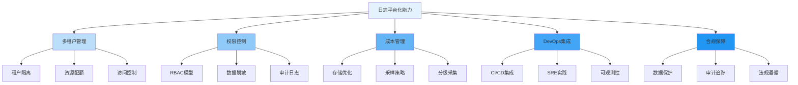

随着企业IT系统的复杂化和规模化，日志平台不再仅仅是日志数据的收集和存储工具，而是演进为支撑企业运维、安全、合规和业务分析的综合性平台。第八章将深入探讨日志平台化的核心能力，包括多租户与权限管理、成本管理以及与DevOps/SRE的集成等关键主题。本文将全面介绍这些平台化能力的重要性和实现方式。

## 日志平台化的重要性

日志平台化是企业级日志管理的必然趋势，它不仅提升了日志系统的可用性和可维护性，更重要的是为不同角色的用户提供了一致、安全、高效的服务体验。

### 核心价值

1. **统一管理**：为全企业范围内的日志数据提供统一的管理和访问入口
2. **安全保障**：通过完善的权限控制和审计机制保障数据安全
3. **成本优化**：通过精细化的成本管理和资源调度降低总体拥有成本
4. **协作提效**：与DevOps和SRE流程深度集成，提升团队协作效率
5. **合规支撑**：满足企业内外部合规要求，降低合规风险

### 平台化能力架构

日志平台化能力可以分为以下几个核心维度：



## 多租户与权限管理

多租户架构是日志平台化的重要基础，它允许多个团队或业务单元在同一个平台上安全地管理和访问各自的日志数据。

### 租户隔离机制

```yaml
# 多租户架构设计
multi_tenant_architecture:
  isolation_levels:
    - physical_isolation: "物理隔离，独立部署"
    - logical_isolation: "逻辑隔离，共享基础设施"
    - namespace_isolation: "命名空间隔离，共享集群"
  
  tenant_identification:
    header_based: "基于HTTP头识别租户"
    path_based: "基于URL路径识别租户"
    token_based: "基于认证令牌识别租户"
  
  resource_quota:
    cpu_limit: "CPU资源限制"
    memory_limit: "内存资源限制"
    storage_quota: "存储配额限制"
    log_volume_quota: "日志量配额限制"
```

### 基于角色的访问控制(RBAC)

```java
// RBAC权限管理系统
public class RBACPermissionManager {
    private final TenantService tenantService;
    private final RoleService roleService;
    private final PermissionService permissionService;
    private final AuditService auditService;
    
    public boolean checkPermission(String userId, String tenantId, 
                                 String resource, String action) {
        // 1. 验证租户访问权限
        if (!tenantService.hasAccess(userId, tenantId)) {
            auditService.logUnauthorizedAccess(userId, tenantId, resource, action);
            return false;
        }
        
        // 2. 获取用户角色
        List<Role> userRoles = roleService.getUserRoles(userId, tenantId);
        
        // 3. 检查权限
        for (Role role : userRoles) {
            if (permissionService.hasPermission(role, resource, action)) {
                auditService.logAuthorizedAccess(userId, tenantId, resource, action);
                return true;
            }
        }
        
        // 4. 记录未授权访问
        auditService.logUnauthorizedAccess(userId, tenantId, resource, action);
        return false;
    }
    
    public List<LogEntry> queryLogs(String userId, String tenantId, 
                                  LogQuery query) {
        // 1. 权限检查
        if (!checkPermission(userId, tenantId, "logs", "read")) {
            throw new AccessDeniedException("Insufficient permissions to read logs");
        }
        
        // 2. 数据脱敏处理
        List<LogEntry> rawLogs = logService.queryLogs(tenantId, query);
        List<LogEntry> sanitizedLogs = sanitizeLogs(rawLogs, userId, tenantId);
        
        // 3. 记录查询审计
        auditService.logLogQuery(userId, tenantId, query);
        
        return sanitizedLogs;
    }
    
    private List<LogEntry> sanitizeLogs(List<LogEntry> logs, 
                                      String userId, String tenantId) {
        List<LogEntry> sanitizedLogs = new ArrayList<>();
        
        for (LogEntry log : logs) {
            // 根据用户权限和数据敏感度进行脱敏处理
            LogEntry sanitizedLog = dataSanitizer.sanitize(log, userId, tenantId);
            sanitizedLogs.add(sanitizedLog);
        }
        
        return sanitizedLogs;
    }
}
```

## 日志成本管理

日志成本管理是日志平台化的重要能力，通过合理的策略和机制控制日志存储、处理和传输的成本。

### 存储成本优化策略

```python
# 日志存储成本优化器
class LogStorageCostOptimizer:
    def __init__(self):
        self.storage_tiers = {
            'hot': {'type': 'SSD', 'cost': 0.10, 'access_speed': 'high'},
            'warm': {'type': 'HDD', 'cost': 0.05, 'access_speed': 'medium'},
            'cold': {'type': 'Object Storage', 'cost': 0.01, 'access_speed': 'low'}
        }
        self.retention_policies = {}
        self.compression_service = LogCompressionService()
    
    def optimize_storage_costs(self, logs):
        """优化存储成本"""
        optimized_logs = []
        
        for log in logs:
            # 1. 数据压缩
            compressed_log = self.compression_service.compress(log)
            
            # 2. 分层存储决策
            storage_tier = self._determine_storage_tier(log)
            
            # 3. 生命周期管理
            retention_policy = self._get_retention_policy(log)
            
            # 4. 成本标记
            cost_optimized_log = self._apply_cost_optimization(
                compressed_log, storage_tier, retention_policy
            )
            
            optimized_logs.append(cost_optimized_log)
        
        return optimized_logs
    
    def _determine_storage_tier(self, log):
        """确定存储层级"""
        # 基于日志重要性、访问频率等维度决定存储层级
        if self._is_critical_log(log):
            return 'hot'
        elif self._is_frequently_accessed(log):
            return 'warm'
        else:
            return 'cold'
    
    def _get_retention_policy(self, log):
        """获取保留策略"""
        log_type = self._classify_log(log)
        return self.retention_policies.get(log_type, '30d')
    
    def _apply_cost_optimization(self, log, storage_tier, retention_policy):
        """应用成本优化"""
        log.metadata['storage_tier'] = storage_tier
        log.metadata['retention_policy'] = retention_policy
        log.metadata['cost_optimized'] = True
        return log
```

### 日志采样与分级采集

```yaml
# 日志采样策略配置
log_sampling_strategies:
  adaptive_sampling:
    description: "自适应采样，根据系统负载动态调整采样率"
    configuration:
      max_throughput: "10000 EPS"
      min_sampling_rate: "0.1"
      max_sampling_rate: "1.0"
      adjustment_interval: "60s"
  
  priority_based_sampling:
    description: "基于优先级的采样，重要日志优先保留"
    priority_levels:
      critical: 
        sampling_rate: "1.0"
        retention: "90d"
      high: 
        sampling_rate: "0.8"
        retention: "60d"
      medium: 
        sampling_rate: "0.5"
        retention: "30d"
      low: 
        sampling_rate: "0.1"
        retention: "7d"
  
  service_level_sampling:
    description: "基于服务级别的采样策略"
    service_levels:
      platinum: 
        sampling_rate: "1.0"
        retention: "180d"
      gold: 
        sampling_rate: "0.9"
        retention: "90d"
      silver: 
        sampling_rate: "0.5"
        retention: "30d"
      bronze: 
        sampling_rate: "0.1"
        retention: "7d"
```

## 日志平台与 DevOps / SRE

日志平台与DevOps和SRE实践的深度集成，能够显著提升系统的可观测性和运维效率。

### CI/CD流水线集成

```yaml
# CI/CD集成配置示例
ci_cd_integration:
  pre_deployment_checks:
    log_pattern_validation: 
      description: "部署前验证日志模式"
      script: "validate-log-patterns.sh"
      failure_policy: "block_deployment"
    
    log_volume_analysis:
      description: "分析预期日志量变化"
      script: "analyze-log-volume.py"
      threshold: "200%"
  
  post_deployment_monitoring:
    log_anomaly_detection:
      description: "部署后监控日志异常"
      duration: "30m"
      alert_threshold: "3"
    
    error_rate_monitoring:
      description: "监控错误日志率"
      duration: "15m"
      threshold: "5%"
```

### SRE实践支持

```java
// SRE可观测性支持
public class SREObservabilitySupport {
    private final LogPlatformClient logClient;
    private final MetricPlatformClient metricClient;
    private final AlertingService alertingService;
    
    public DeploymentVerificationResult verifyDeployment(String service, 
                                                       String version) {
        DeploymentVerificationResult result = new DeploymentVerificationResult();
        
        // 1. 错误日志分析
        LogQuery errorQuery = LogQuery.builder()
            .service(service)
            .version(version)
            .level("ERROR")
            .timeRange(Duration.ofMinutes(30))
            .build();
        
        List<LogEntry> errorLogs = logClient.queryLogs(errorQuery);
        result.setErrorLogCount(errorLogs.size());
        
        // 2. 关键指标对比
        MetricComparisonResult metricComparison = compareMetrics(
            service, version, Duration.ofHours(1)
        );
        result.setMetricComparison(metricComparison);
        
        // 3. 用户体验指标
        UserExperienceMetrics userExperience = analyzeUserExperience(
            service, version
        );
        result.setUserExperience(userExperience);
        
        // 4. 生成验证报告
        result.setOverallStatus(determineOverallStatus(result));
        
        // 5. 发送告警（如有必要）
        if (result.getOverallStatus() == Status.FAILURE) {
            alertingService.sendDeploymentAlert(service, version, result);
        }
        
        return result;
    }
    
    private MetricComparisonResult compareMetrics(String service, String version, 
                                                Duration timeRange) {
        // 实现指标对比逻辑
        // 对比部署前后的关键指标变化
        return new MetricComparisonResult();
    }
    
    private UserExperienceMetrics analyzeUserExperience(String service, 
                                                      String version) {
        // 分析用户体验相关指标
        // 如响应时间、成功率等
        return new UserExperienceMetrics();
    }
    
    private Status determineOverallStatus(DeploymentVerificationResult result) {
        // 根据各项指标确定整体状态
        if (result.getErrorLogCount() > 100) {
            return Status.FAILURE;
        }
        
        if (result.getMetricComparison().hasSignificantDegradation()) {
            return Status.FAILURE;
        }
        
        if (result.getUserExperience().isDegraded()) {
            return Status.WARNING;
        }
        
        return Status.SUCCESS;
    }
}
```

## 技术实现要点

### 1. 多租户架构设计

```yaml
# 多租户架构实现要点
multi_tenant_implementation:
  data_isolation:
    - database_isolation: "每个租户独立数据库"
    - schema_isolation: "共享数据库，独立schema"
    - row_level_isolation: "共享表，行级隔离"
  
  resource_management:
    - quota_enforcement: "资源配额强制执行"
    - fair_scheduling: "公平调度算法"
    - performance_isolation: "性能隔离机制"
  
  security_considerations:
    - cross_tenant_data_leakage_prevention: "跨租户数据泄露防护"
    - tenant_data_encryption: "租户数据加密"
    - audit_logging: "审计日志记录"
```

### 2. 成本优化策略

```yaml
# 成本优化实现要点
cost_optimization_implementation:
  storage_optimization:
    - data_compression: "数据压缩技术"
    - tiered_storage: "分层存储策略"
    - intelligent_retention: "智能保留策略"
  
  processing_optimization:
    - log_sampling: "日志采样机制"
    - selective_processing: "选择性处理"
    - batch_processing: "批量处理优化"
  
  transmission_optimization:
    - data_compression: "传输数据压缩"
    - deduplication: "重复数据删除"
    - efficient_protocols: "高效传输协议"
```

### 3. DevOps集成要点

```yaml
# DevOps集成实现要点
devops_integration_implementation:
  automation_support:
    - api_first_design: "API优先设计"
    - cli_tools: "命令行工具支持"
    - infrastructure_as_code: "基础设施即代码"
  
  monitoring_integration:
    - log_driven_alerting: "日志驱动告警"
    - metric_correlation: "指标关联分析"
    - trace_integration: "链路追踪集成"
  
  collaboration_features:
    - shared_dashboards: "共享仪表板"
    - annotation_support: "注解支持"
    - incident_management: "事件管理集成"
```

## 最佳实践总结

### 1. 多租户管理最佳实践

```yaml
# 多租户管理最佳实践
multi_tenant_best_practices:
  - start_with_simple_isolation: "从简单的逻辑隔离开始"
  - implement_comprehensive_rbac: "实现全面的RBAC权限模型"
  - enable_audit_logging: "启用完整的审计日志记录"
  - provide_self_service_capabilities: "提供自助服务能力"
  - monitor_tenant_resource_usage: "监控租户资源使用情况"
```

### 2. 成本管理最佳实践

```yaml
# 成本管理最佳实践
cost_management_best_practices:
  - implement_storage_tiering: "实施存储分层策略"
  - use_adaptive_sampling: "使用自适应采样机制"
  - monitor_cost_metrics: "监控成本相关指标"
  - set_budget_alerts: "设置预算告警"
  - regularly_review_policies: "定期审查策略有效性"
```

### 3. DevOps集成最佳实践

```yaml
# DevOps集成最佳实践
devops_integration_best_practices:
  - provide_rich_apis: "提供丰富的API接口"
  - integrate_with_ci_cd: "与CI/CD工具链集成"
  - support_observability: "支持可观测性实践"
  - enable_collaboration: "支持团队协作功能"
  - automate_operations: "自动化运维操作"
```

## 总结

日志平台化能力是构建企业级日志管理系统的关键要素。通过完善的多租户与权限管理、精细化的成本管理以及与DevOps/SRE流程的深度集成，日志平台能够为不同角色的用户提供安全、高效、经济的服务。

关键要点包括：

1. **多租户架构**：通过合理的租户隔离和权限控制保障数据安全
2. **成本优化**：通过存储分层、采样策略等机制控制总体拥有成本
3. **DevOps集成**：与CI/CD和SRE实践深度集成，提升运维效率
4. **合规保障**：通过审计日志和数据保护机制满足合规要求

在后续章节中，我们将深入探讨多租户与权限管理、日志成本管理以及日志平台与DevOps/SRE集成的具体实现细节和最佳实践。