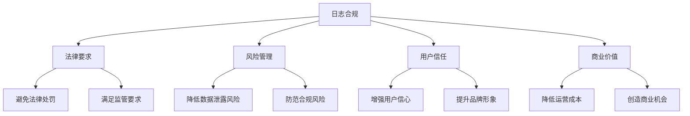

在数字化时代，数据保护和隐私合规已成为企业运营的基本要求。随着GDPR、ISO27001、SOX等法规的实施，日志平台作为数据处理和存储的关键基础设施，承担着越来越重要的合规责任。日志与合规不仅仅是满足监管要求的被动措施，更是企业建立信任、保护用户隐私、防范法律风险的主动策略。本文将深入探讨日志平台在合规性管理中的关键技术、实现方法和最佳实践。

## 日志合规的核心概念

日志合规是指日志平台在收集、存储、处理和使用日志数据的过程中，必须遵循相关法律法规和行业标准的要求，确保数据处理活动的合法性、安全性和透明性。

### 合规的重要性

日志合规不仅是法律要求，更是企业可持续发展的基础：



#### 核心价值

1. **法律合规**：避免因违规而面临的法律处罚和声誉损失
2. **风险控制**：降低数据泄露、滥用等安全风险
3. **用户信任**：增强用户对企业的信任和满意度
4. **竞争优势**：合规能力成为企业的重要竞争优势
5. **运营效率**：规范化的数据管理提升运营效率

### 主要法规要求

不同法规对日志管理提出了具体要求，企业需要全面理解和满足这些要求。

## GDPR合规要求与实现

GDPR（通用数据保护条例）是目前最严格的隐私保护法规之一，对日志平台提出了严格要求。

### 核心要求

```yaml
# GDPR核心要求
gdpr_requirements:
  consent:
    description: "处理个人数据必须获得明确同意"
    implementation: "实现日志数据处理的同意管理机制"
  
  data_minimization:
    description: "仅收集处理目的所必需的最少数据"
    implementation: "实施日志数据最小化收集策略"
  
  purpose_limitation:
    description: "数据只能用于明确声明的目的"
    implementation: "明确定义日志数据处理目的并严格执行"
  
  storage_limitation:
    description: "个人数据存储期限不得超过必要时间"
    implementation: "实施自动化的数据生命周期管理"
  
  integrity_confidentiality:
    description: "确保数据的安全性和保密性"
    implementation: "采用加密、访问控制等安全措施"
  
  accountability:
    description: "能够证明合规性的责任"
    implementation: "建立完整的合规审计轨迹"
  
  rights_of_data_subjects:
    description: "数据主体享有访问、更正、删除等权利"
    implementation: "提供数据主体权利行使的技术支持"
```

### 技术实现方案

```java
// GDPR合规日志处理器
public class GDPRCompliantLogProcessor {
    private final DataClassificationService classificationService;
    private final ConsentManagementService consentService;
    private final DataLifecycleManager lifecycleManager;
    private final EncryptionService encryptionService;
    private final AccessControlService accessControlService;
    
    public void processLog(LogEvent logEvent) {
        // 1. 数据分类
        DataClassification classification = classificationService.classify(logEvent);
        
        // 2. 同意检查
        if (containsPersonalData(classification)) {
            if (!consentService.hasValidConsent(logEvent.getUserId())) {
                // 无有效同意，拒绝处理或匿名化处理
                handleNoConsent(logEvent, classification);
                return;
            }
        }
        
        // 3. 数据最小化
        LogEvent minimizedLog = applyDataMinimization(logEvent, classification);
        
        // 4. 加密处理
        LogEvent encryptedLog = encryptionService.encrypt(minimizedLog);
        
        // 5. 访问控制
        if (!accessControlService.isAuthorized(encryptedLog)) {
            throw new UnauthorizedAccessException("Access denied for log processing");
        }
        
        // 6. 存储和生命周期管理
        storeLog(encryptedLog, classification);
        lifecycleManager.scheduleDeletion(encryptedLog, classification);
    }
    
    private boolean containsPersonalData(DataClassification classification) {
        return classification.getCategories().contains(DataCategory.PII) ||
               classification.getCategories().contains(DataCategory.SENSITIVE_PERSONAL_DATA);
    }
    
    private void handleNoConsent(LogEvent logEvent, DataClassification classification) {
        switch (classification.getSensitivityLevel()) {
            case HIGH:
                // 高敏感度数据，直接拒绝处理
                auditService.recordRejectedLog(logEvent, "No valid consent for high-sensitivity data");
                break;
            case MEDIUM:
                // 中等敏感度数据，进行匿名化处理
                LogEvent anonymizedLog = anonymizeLog(logEvent);
                storeLog(anonymizedLog, classification);
                break;
            case LOW:
                // 低敏感度数据，正常处理
                storeLog(logEvent, classification);
                break;
        }
    }
    
    private LogEvent applyDataMinimization(LogEvent logEvent, DataClassification classification) {
        LogEvent minimizedLog = new LogEvent(logEvent);
        
        // 根据数据分类移除不必要的字段
        if (classification.getCategories().contains(DataCategory.PII)) {
            minimizedLog.removeField("email");
            minimizedLog.removeField("phone");
            minimizedLog.maskField("userId", "***");
        }
        
        if (classification.getCategories().contains(DataCategory.SENSITIVE_PERSONAL_DATA)) {
            minimizedLog.removeField("health_info");
            minimizedLog.removeField("financial_info");
        }
        
        return minimizedLog;
    }
    
    private LogEvent anonymizeLog(LogEvent logEvent) {
        LogEvent anonymizedLog = new LogEvent(logEvent);
        
        // 匿名化处理
        anonymizedLog.anonymizeField("userId");
        anonymizedLog.anonymizeField("ipAddress");
        anonymizedLog.anonymizeField("email");
        
        return anonymizedLog;
    }
}
```

### 数据主体权利支持

```python
# 数据主体权利管理服务
class DataSubjectRightsService:
    def __init__(self, log_storage_service, user_consent_service):
        self.log_storage_service = log_storage_service
        self.user_consent_service = user_consent_service
        self.rights_processor = RightsProcessor()
    
    def handle_data_access_request(self, user_id: str, request_id: str) -> Dict[str, Any]:
        """处理数据访问请求"""
        try:
            # 1. 验证用户身份
            if not self._verify_user_identity(user_id):
                raise UnauthorizedAccessException("User identity verification failed")
            
            # 2. 查找相关日志
            user_logs = self.log_storage_service.find_logs_by_user_id(user_id)
            
            # 3. 过滤可访问数据
            accessible_logs = self._filter_accessible_logs(user_logs, user_id)
            
            # 4. 生成访问报告
            access_report = self._generate_access_report(accessible_logs, user_id)
            
            # 5. 记录处理过程
            self._audit_rights_request(request_id, user_id, "ACCESS", "SUCCESS")
            
            return {
                'request_id': request_id,
                'user_id': user_id,
                'logs': accessible_logs,
                'report': access_report,
                'timestamp': datetime.now()
            }
            
        except Exception as e:
            self._audit_rights_request(request_id, user_id, "ACCESS", "FAILED", str(e))
            raise
    
    def handle_data_deletion_request(self, user_id: str, request_id: str) -> Dict[str, Any]:
        """处理数据删除请求"""
        try:
            # 1. 验证用户身份
            if not self._verify_user_identity(user_id):
                raise UnauthorizedAccessException("User identity verification failed")
            
            # 2. 查找需要删除的日志
            user_logs = self.log_storage_service.find_logs_by_user_id(user_id)
            
            # 3. 执行删除操作
            deleted_count = self.log_storage_service.delete_logs(user_logs)
            
            # 4. 更新同意记录
            self.user_consent_service.revoke_consent(user_id)
            
            # 5. 记录处理过程
            self._audit_rights_request(request_id, user_id, "DELETION", "SUCCESS")
            
            return {
                'request_id': request_id,
                'user_id': user_id,
                'deleted_count': deleted_count,
                'timestamp': datetime.now()
            }
            
        except Exception as e:
            self._audit_rights_request(request_id, user_id, "DELETION", "FAILED", str(e))
            raise
    
    def handle_data_portability_request(self, user_id: str, request_id: str) -> Dict[str, Any]:
        """处理数据可移植性请求"""
        try:
            # 1. 验证用户身份
            if not self._verify_user_identity(user_id):
                raise UnauthorizedAccessException("User identity verification failed")
            
            # 2. 查找相关日志
            user_logs = self.log_storage_service.find_logs_by_user_id(user_id)
            
            # 3. 格式化数据
            portable_data = self._format_portable_data(user_logs)
            
            # 4. 生成下载链接
            download_url = self._generate_download_link(portable_data, user_id)
            
            # 5. 记录处理过程
            self._audit_rights_request(request_id, user_id, "PORTABILITY", "SUCCESS")
            
            return {
                'request_id': request_id,
                'user_id': user_id,
                'download_url': download_url,
                'data_count': len(user_logs),
                'timestamp': datetime.now()
            }
            
        except Exception as e:
            self._audit_rights_request(request_id, user_id, "PORTABILITY", "FAILED", str(e))
            raise
    
    def _verify_user_identity(self, user_id: str) -> bool:
        """验证用户身份"""
        # 实现用户身份验证逻辑
        # 可以集成OAuth、JWT等认证机制
        return True
    
    def _filter_accessible_logs(self, logs: List[Dict], user_id: str) -> List[Dict]:
        """过滤可访问的日志"""
        accessible_logs = []
        
        for log in logs:
            # 检查日志是否包含用户数据
            if log.get('user_id') == user_id:
                # 检查是否有访问权限
                if self._has_access_permission(log, user_id):
                    accessible_logs.append(log)
        
        return accessible_logs
    
    def _has_access_permission(self, log: Dict, user_id: str) -> bool:
        """检查访问权限"""
        # 实现访问权限检查逻辑
        # 例如：检查日志的敏感级别、时间范围等
        return True
    
    def _generate_access_report(self, logs: List[Dict], user_id: str) -> Dict[str, Any]:
        """生成访问报告"""
        report = {
            'user_id': user_id,
            'total_logs': len(logs),
            'log_types': self._analyze_log_types(logs),
            'time_range': self._analyze_time_range(logs),
            'services_involved': self._analyze_services(logs)
        }
        
        return report
    
    def _audit_rights_request(self, request_id: str, user_id: str, 
                            request_type: str, status: str, error: str = None):
        """记录权利请求审计"""
        audit_log = {
            'request_id': request_id,
            'user_id': user_id,
            'request_type': request_type,
            'status': status,
            'error': error,
            'timestamp': datetime.now(),
            'ip_address': self._get_client_ip(),
            'user_agent': self._get_user_agent()
        }
        
        self.log_storage_service.store_audit_log(audit_log)
```

## ISO27001合规要求与实现

ISO27001是国际公认的信息安全管理体系标准，对日志管理提出了系统性的安全要求。

### 核心要求

```yaml
# ISO27001核心要求
iso27001_requirements:
  access_control:
    description: "实施严格的访问控制措施"
    implementation: "基于角色的访问控制和最小权限原则"
  
  audit_logging:
    description: "记录所有安全相关事件"
    implementation: "全面的安全事件日志记录机制"
  
  log_protection:
    description: "保护日志数据不被篡改或删除"
    implementation: "日志完整性保护和防篡改机制"
  
  log_review:
    description: "定期审查日志以识别安全事件"
    implementation: "自动化日志审查和异常检测"
  
  incident_response:
    description: "建立安全事件响应机制"
    implementation: "安全事件响应流程和工具支持"
```

### 安全实现方案

```java
// ISO27001合规日志安全处理器
public class ISO27001CompliantLogSecurityProcessor {
    private final AccessControlService accessControlService;
    private final LogIntegrityService integrityService;
    private final SecurityEventDetector eventDetector;
    private final IncidentResponseService incidentResponseService;
    private final LogReviewService logReviewService;
    
    public void processSecurityLog(SecurityLogEvent logEvent) {
        // 1. 访问控制检查
        if (!accessControlService.isAuthorized(logEvent)) {
            // 记录未授权访问尝试
            auditService.recordUnauthorizedAccess(logEvent);
            throw new UnauthorizedAccessException("Access denied for security log processing");
        }
        
        // 2. 日志完整性保护
        LogEvent protectedLog = integrityService.protectLog(logEvent);
        
        // 3. 安全事件检测
        SecurityEvent securityEvent = eventDetector.detect(protectedLog);
        if (securityEvent != null) {
            // 触发安全事件响应
            incidentResponseService.handleSecurityEvent(securityEvent);
        }
        
        // 4. 存储保护日志
        storeProtectedLog(protectedLog);
        
        // 5. 定期审查调度
        logReviewService.scheduleReview(protectedLog);
    }
    
    // 基于角色的访问控制实现
    public class RoleBasedAccessControl {
        private final Map<String, Set<Permission>> rolePermissions;
        private final Map<String, Set<String>> userRoles;
        
        public boolean hasPermission(String userId, String resource, String action) {
            Set<String> roles = userRoles.get(userId);
            if (roles == null) {
                return false;
            }
            
            for (String role : roles) {
                Set<Permission> permissions = rolePermissions.get(role);
                if (permissions != null) {
                    for (Permission permission : permissions) {
                        if (permission.matches(resource, action)) {
                            return true;
                        }
                    }
                }
            }
            
            return false;
        }
        
        public void enforcePermission(String userId, String resource, String action) {
            if (!hasPermission(userId, resource, action)) {
                throw new UnauthorizedAccessException(
                    String.format("User %s has no permission to %s %s", 
                                userId, action, resource));
            }
        }
    }
    
    // 日志完整性保护实现
    public class LogIntegrityService {
        private final DigitalSignatureService signatureService;
        private final HashService hashService;
        
        public LogEvent protectLog(LogEvent logEvent) {
            LogEvent protectedLog = new LogEvent(logEvent);
            
            // 计算日志哈希值
            String hash = hashService.calculateHash(logEvent);
            protectedLog.setHash(hash);
            
            // 添加数字签名
            String signature = signatureService.sign(hash);
            protectedLog.setSignature(signature);
            
            // 添加时间戳
            protectedLog.setProtectedTimestamp(System.currentTimeMillis());
            
            return protectedLog;
        }
        
        public boolean verifyLogIntegrity(LogEvent logEvent) {
            try {
                // 验证数字签名
                if (!signatureService.verify(logEvent.getHash(), logEvent.getSignature())) {
                    return false;
                }
                
                // 重新计算哈希值并比较
                String calculatedHash = hashService.calculateHash(
                    logEvent.withoutIntegrityFields());
                return calculatedHash.equals(logEvent.getHash());
                
            } catch (Exception e) {
                logger.error("Log integrity verification failed", e);
                return false;
            }
        }
    }
}
```

## 金融行业合规要求

金融行业面临更严格的合规要求，包括SOX、Basel III、MiFID II等法规。

### 核心要求

```yaml
# 金融行业合规要求
financial_compliance_requirements:
  data_integrity:
    description: "确保日志数据的完整性和不可篡改性"
    implementation: "区块链或数字签名技术保障数据完整性"
  
  audit_trail:
    description: "维护完整的审计轨迹"
    implementation: "不可变审计日志和时间戳机制"
  
  retention_policies:
    description: "实施符合监管要求的数据保留策略"
    implementation: "自动化数据生命周期管理"
  
  access_logging:
    description: "记录所有对敏感数据的访问"
    implementation: "详细的访问日志记录和监控"
  
  segregation_of_duties:
    description: "职责分离原则"
    implementation: "权限分离和操作审批机制"
```

### 技术实现

```python
# 金融行业合规日志管理器
class FinancialComplianceLogManager:
    def __init__(self, config: Dict[str, Any]):
        self.config = config
        self.blockchain_service = BlockchainService()
        self.audit_trail_service = AuditTrailService()
        self.retention_policy_service = RetentionPolicyService()
        self.access_monitor_service = AccessMonitorService()
        
    def process_financial_log(self, log_event: Dict[str, Any]) -> Dict[str, Any]:
        """处理金融合规日志"""
        try:
            # 1. 数据完整性保护
            protected_log = self._protect_log_integrity(log_event)
            
            # 2. 审计轨迹记录
            audit_record = self._record_audit_trail(protected_log)
            
            # 3. 访问控制检查
            self._enforce_access_control(protected_log)
            
            # 4. 职责分离检查
            self._check_segregation_of_duties(protected_log)
            
            # 5. 存储和生命周期管理
            stored_log = self._store_log(protected_log)
            self._schedule_retention_management(stored_log)
            
            return stored_log
            
        except ComplianceViolationException as e:
            # 记录合规违规事件
            self._record_compliance_violation(log_event, str(e))
            raise
        except Exception as e:
            # 记录处理错误
            self._record_processing_error(log_event, str(e))
            raise
    
    def _protect_log_integrity(self, log_event: Dict[str, Any]) -> Dict[str, Any]:
        """保护日志完整性"""
        protected_log = log_event.copy()
        
        # 添加时间戳
        protected_log['timestamp'] = datetime.now().isoformat()
        
        # 计算哈希值
        log_content = json.dumps(protected_log, sort_keys=True)
        hash_value = hashlib.sha256(log_content.encode()).hexdigest()
        protected_log['hash'] = hash_value
        
        # 添加区块链锚定
        blockchain_anchor = self.blockchain_service.anchor_hash(hash_value)
        protected_log['blockchain_anchor'] = blockchain_anchor
        
        return protected_log
    
    def _record_audit_trail(self, log_event: Dict[str, Any]) -> Dict[str, Any]:
        """记录审计轨迹"""
        audit_record = {
            'log_id': log_event.get('id'),
            'event_type': log_event.get('type'),
            'timestamp': datetime.now(),
            'user_id': log_event.get('user_id'),
            'ip_address': self._get_client_ip(),
            'user_agent': self._get_user_agent(),
            'operation': log_event.get('operation'),
            'resource': log_event.get('resource'),
            'result': log_event.get('result', 'SUCCESS')
        }
        
        # 存储到不可变审计日志
        self.audit_trail_service.store_audit_record(audit_record)
        
        return audit_record
    
    def _enforce_access_control(self, log_event: Dict[str, Any]) -> None:
        """执行访问控制"""
        user_id = log_event.get('user_id')
        resource = log_event.get('resource')
        operation = log_event.get('operation')
        
        # 检查访问权限
        if not self.access_monitor_service.has_permission(user_id, resource, operation):
            raise UnauthorizedAccessException(
                f"User {user_id} has no permission to {operation} {resource}")
        
        # 记录访问日志
        access_log = {
            'user_id': user_id,
            'resource': resource,
            'operation': operation,
            'timestamp': datetime.now(),
            'result': 'AUTHORIZED'
        }
        self.access_monitor_service.log_access(access_log)
    
    def _check_segregation_of_duties(self, log_event: Dict[str, Any]) -> None:
        """检查职责分离"""
        user_id = log_event.get('user_id')
        operation = log_event.get('operation')
        
        # 检查是否存在冲突的职责
        if self.access_monitor_service.has_conflicting_duties(user_id, operation):
            raise ComplianceViolationException(
                f"Segregation of duties violation for user {user_id} performing {operation}")
    
    def _schedule_retention_management(self, log_event: Dict[str, Any]) -> None:
        """调度保留管理"""
        retention_period = self.retention_policy_service.get_retention_period(
            log_event.get('type'))
        
        deletion_time = datetime.now() + retention_period
        self.retention_policy_service.schedule_deletion(
            log_event.get('id'), deletion_time)
```

## 合规监控与审计

完善的合规监控和审计体系是确保持续合规的关键。

### 合规监控仪表板

```java
// 合规监控仪表板
public class ComplianceMonitoringDashboard {
    private final ComplianceMetricsService metricsService;
    private final AuditTrailService auditTrailService;
    private final ViolationAlertService alertService;
    
    public ComplianceDashboardView renderDashboard() {
        ComplianceDashboardView view = new ComplianceDashboardView();
        
        // 1. 合规指标展示
        view.setComplianceMetrics(metricsService.getCurrentMetrics());
        
        // 2. 审计轨迹分析
        view.setAuditAnalysis(auditTrailService.analyzeRecentAudits());
        
        // 3. 违规事件监控
        view.setViolationEvents(alertService.getRecentViolations());
        
        // 4. 合规趋势分析
        view.setComplianceTrends(metricsService.getHistoricalTrends());
        
        return view;
    }
    
    // 合规指标服务
    public class ComplianceMetricsService {
        private final MeterRegistry meterRegistry;
        
        // 合规相关指标
        private final Gauge complianceScore;
        private final Counter totalLogsProcessed;
        private final Counter compliantLogs;
        private final Counter nonCompliantLogs;
        private final Counter auditEvents;
        private final Timer complianceCheckLatency;
        
        public ComplianceMetricsService(MeterRegistry meterRegistry) {
            this.meterRegistry = meterRegistry;
            
            this.complianceScore = Gauge.builder("compliance.score")
                .description("Overall compliance score")
                .register(meterRegistry, this, ComplianceMetricsService::calculateComplianceScore);
            
            this.totalLogsProcessed = Counter.builder("compliance.logs.total")
                .description("Total logs processed")
                .register(meterRegistry);
            
            this.compliantLogs = Counter.builder("compliance.logs.compliant")
                .description("Compliant logs count")
                .register(meterRegistry);
            
            this.nonCompliantLogs = Counter.builder("compliance.logs.non_compliant")
                .description("Non-compliant logs count")
                .register(meterRegistry);
            
            this.auditEvents = Counter.builder("compliance.audit.events")
                .description("Audit events count")
                .register(meterRegistry);
            
            this.complianceCheckLatency = Timer.builder("compliance.check.latency")
                .description("Compliance check processing time")
                .register(meterRegistry);
        }
        
        public ComplianceMetrics getCurrentMetrics() {
            return ComplianceMetrics.builder()
                .complianceScore(calculateComplianceScore())
                .totalLogsProcessed((long) totalLogsProcessed.count())
                .compliantLogs((long) compliantLogs.count())
                .nonCompliantLogs((long) nonCompliantLogs.count())
                .complianceRate(calculateComplianceRate())
                .recentViolations(getRecentViolations())
                .build();
        }
        
        private double calculateComplianceScore() {
            long total = (long) totalLogsProcessed.count();
            long compliant = (long) compliantLogs.count();
            
            if (total == 0) {
                return 100.0;
            }
            
            return (double) compliant / total * 100;
        }
        
        private double calculateComplianceRate() {
            long total = (long) totalLogsProcessed.count();
            long compliant = (long) compliantLogs.count();
            
            if (total == 0) {
                return 1.0;
            }
            
            return (double) compliant / total;
        }
    }
}
```

### 自动化合规审计

```python
# 自动化合规审计系统
class AutomatedComplianceAuditSystem:
    def __init__(self, config: Dict[str, Any]):
        self.config = config
        self.audit_rules = self._load_audit_rules()
        self.audit_scheduler = AuditScheduler()
        self.report_generator = ComplianceReportGenerator()
        self.remediation_service = RemediationService()
    
    def schedule_regular_audits(self) -> None:
        """调度定期审计"""
        # 每日合规检查
        self.audit_scheduler.schedule_daily_audit(
            self._perform_daily_compliance_check, 
            time(2, 0)  # 凌晨2点执行
        )
        
        # 每周深度审计
        self.audit_scheduler.schedule_weekly_audit(
            self._perform_weekly_deep_audit,
            weekday=6,  # 周日
            time=time(3, 0)  # 凌晨3点执行
        )
        
        # 每月合规报告
        self.audit_scheduler.schedule_monthly_audit(
            self._generate_monthly_compliance_report,
            day=1,  # 每月1日
            time=time(4, 0)  # 凌晨4点执行
        )
    
    def _perform_daily_compliance_check(self) -> Dict[str, Any]:
        """执行每日合规检查"""
        audit_results = {
            'timestamp': datetime.now(),
            'audit_type': 'DAILY',
            'findings': [],
            'compliance_score': 0.0
        }
        
        # 1. 检查访问控制合规性
        access_findings = self._check_access_control_compliance()
        audit_results['findings'].extend(access_findings)
        
        # 2. 检查数据保护合规性
        protection_findings = self._check_data_protection_compliance()
        audit_results['findings'].extend(protection_findings)
        
        # 3. 检查日志完整性
        integrity_findings = self._check_log_integrity()
        audit_results['findings'].extend(integrity_findings)
        
        # 4. 计算合规分数
        audit_results['compliance_score'] = self._calculate_compliance_score(
            audit_results['findings'])
        
        # 5. 生成报告
        report = self.report_generator.generate_daily_report(audit_results)
        
        # 6. 发送告警（如有严重问题）
        self._send_audit_alerts(audit_results['findings'])
        
        return audit_results
    
    def _perform_weekly_deep_audit(self) -> Dict[str, Any]:
        """执行每周深度审计"""
        audit_results = {
            'timestamp': datetime.now(),
            'audit_type': 'WEEKLY_DEEP',
            'findings': [],
            'compliance_score': 0.0
        }
        
        # 1. 全面访问控制审计
        access_audit = self._perform_comprehensive_access_audit()
        audit_results['findings'].extend(access_audit)
        
        # 2. 数据生命周期审计
        lifecycle_audit = self._perform_data_lifecycle_audit()
        audit_results['findings'].extend(lifecycle_audit)
        
        # 3. 第三方合规性审计
        third_party_audit = self._perform_third_party_compliance_audit()
        audit_results['findings'].extend(third_party_audit)
        
        # 4. 安全配置审计
        security_audit = self._perform_security_configuration_audit()
        audit_results['findings'].extend(security_audit)
        
        # 5. 计算合规分数
        audit_results['compliance_score'] = self._calculate_compliance_score(
            audit_results['findings'])
        
        # 6. 生成详细报告
        report = self.report_generator.generate_weekly_report(audit_results)
        
        return audit_results
    
    def _check_access_control_compliance(self) -> List[Dict[str, Any]]:
        """检查访问控制合规性"""
        findings = []
        
        # 检查未授权访问日志
        unauthorized_access_logs = self._find_unauthorized_access_logs()
        for log in unauthorized_access_logs:
            findings.append({
                'type': 'ACCESS_VIOLATION',
                'severity': 'HIGH',
                'description': f"Unauthorized access attempt detected: {log['user_id']}",
                'evidence': log,
                'recommendation': 'Review user permissions and access controls'
            })
        
        # 检查权限过度分配
        over_privileged_users = self._find_over_privileged_users()
        for user in over_privileged_users:
            findings.append({
                'type': 'OVER_PRIVILEGED',
                'severity': 'MEDIUM',
                'description': f"User has excessive privileges: {user['user_id']}",
                'evidence': user,
                'recommendation': 'Implement principle of least privilege'
            })
        
        return findings
    
    def _check_data_protection_compliance(self) -> List[Dict[str, Any]]:
        """检查数据保护合规性"""
        findings = []
        
        # 检查未加密的敏感数据日志
        unencrypted_sensitive_logs = self._find_unencrypted_sensitive_logs()
        for log in unencrypted_sensitive_logs:
            findings.append({
                'type': 'UNENCRYPTED_DATA',
                'severity': 'HIGH',
                'description': f"Unencrypted sensitive data found in log: {log['id']}",
                'evidence': log,
                'recommendation': 'Implement encryption for sensitive data'
            })
        
        # 检查数据保留策略合规性
        retention_violations = self._find_retention_policy_violations()
        for violation in retention_violations:
            findings.append({
                'type': 'RETENTION_VIOLATION',
                'severity': 'MEDIUM',
                'description': f"Data retention policy violation: {violation['description']}",
                'evidence': violation,
                'recommendation': 'Review and enforce data retention policies'
            })
        
        return findings
    
    def _calculate_compliance_score(self, findings: List[Dict[str, Any]]) -> float:
        """计算合规分数"""
        if not findings:
            return 100.0
        
        # 根据发现的问题严重程度计算分数
        high_severity_count = sum(1 for f in findings if f['severity'] == 'HIGH')
        medium_severity_count = sum(1 for f in findings if f['severity'] == 'MEDIUM')
        low_severity_count = sum(1 for f in findings if f['severity'] == 'LOW')
        
        # 扣分规则：高严重性问题扣10分，中等扣5分，低等扣1分
        deduction = high_severity_count * 10 + medium_severity_count * 5 + low_severity_count * 1
        score = max(0, 100 - deduction)
        
        return score
    
    def _send_audit_alerts(self, findings: List[Dict[str, Any]]) -> None:
        """发送审计告警"""
        high_severity_findings = [f for f in findings if f['severity'] == 'HIGH']
        
        if high_severity_findings:
            alert_message = f"High severity compliance issues detected: {len(high_severity_findings)} issues"
            self.alert_service.send_critical_alert(alert_message, high_severity_findings)
```

## 最佳实践总结

### 1. 合规架构设计最佳实践

```yaml
# 合规架构设计最佳实践
compliance_architecture_best_practices:
  - implement_privacy_by_design: "在系统设计中内置隐私保护机制"
  - use_zero_trust_security: "采用零信任安全模型"
  - ensure_data_minimization: "实施数据最小化原则"
  - maintain_audit_trails: "维护完整的审计轨迹"
  - implement_access_controls: "实施严格的访问控制措施"
```

### 2. 合规运营最佳实践

```yaml
# 合规运营最佳实践
compliance_operations_best_practices:
  - conduct_regular_audits: "定期进行合规性审计"
  - monitor_compliance_metrics: "持续监控合规指标"
  - implement_incident_response: "建立合规事件响应机制"
  - provide_staff_training: "提供合规培训和意识教育"
  - maintain_documentation: "完善合规文档和记录"
```

### 3. 技术实现最佳实践

```yaml
# 技术实现最佳实践
technical_implementation_best_practices:
  - use_standard_protocols: "采用行业标准的安全协议"
  - implement_encryption: "全面实施数据加密"
  - apply_security_patches: "及时应用安全补丁"
  - conduct_security_testing: "定期进行安全测试"
  - monitor_third_party_risks: "监控第三方供应商风险"
```

## 总结

日志与合规是现代企业数据管理的重要组成部分，它不仅关系到企业的法律风险控制，更直接影响企业的声誉和可持续发展。通过深入理解和有效实施GDPR、ISO27001等法规要求，企业可以构建起完善的日志合规体系。

关键要点包括：

1. **法规理解**：深入理解GDPR、ISO27001等主要法规的核心要求
2. **技术实现**：通过访问控制、数据保护、完整性保障等技术手段实现合规
3. **权利支持**：为数据主体提供完整的权利行使支持
4. **监控审计**：建立完善的合规监控和自动化审计体系
5. **持续改进**：通过定期评估和优化确保持续合规

在实际应用中，企业需要根据自身业务特点和所处行业，制定针对性的合规策略，并通过技术手段和管理措施的有效结合，构建起全面的日志合规管理体系。随着法规环境的不断演进，企业还需要保持对新法规的关注和适应能力，确保日志平台始终符合最新的合规要求。