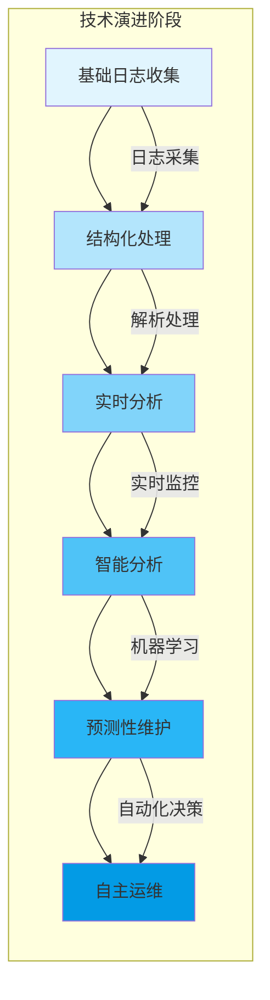

随着数字化转型的深入推进和云原生技术的快速发展，日志平台作为企业IT基础设施的重要组成部分，正经历着从传统自动化向智能化、从被动响应向主动预测的深刻变革。第九章将深入探讨日志平台的进阶技术与未来发展趋势，包括智能日志分析、合规性管理以及前沿技术演进等关键主题。本文将全面介绍这些领域的核心概念、技术挑战和发展方向。

## 日志平台进阶的重要性

日志平台的进阶发展不仅是技术演进的必然结果，更是企业应对复杂IT环境、提升运维效率和保障业务连续性的关键需求。

### 核心价值

1. **智能化运维**：通过AI技术实现故障预测和自动修复
2. **合规性保障**：满足日益严格的法规要求和审计标准
3. **业务价值挖掘**：从日志数据中发现业务洞察和优化机会
4. **成本优化**：通过智能化管理降低日志存储和处理成本
5. **安全防护**：构建主动的安全威胁检测和响应能力

### 技术演进路径

日志平台的技术演进可以分为以下几个阶段：



## 智能日志分析

智能日志分析是日志平台进阶的核心方向，它通过运用人工智能和机器学习技术，实现对海量日志数据的深度分析和价值挖掘。

### AIOps与根因分析

AIOps（人工智能运维）是智能日志分析的重要应用领域，它通过机器学习算法自动识别系统异常、定位问题根因并提供修复建议。

```python
# 基于机器学习的异常检测
class LogAnomalyDetector:
    def __init__(self):
        self.model = IsolationForest(contamination=0.1, random_state=42)
        self.is_trained = False
        self.feature_extractor = LogFeatureExtractor()
    
    def train(self, training_logs):
        """训练异常检测模型"""
        features = self.feature_extractor.extract_features(training_logs)
        self.model.fit(features)
        self.is_trained = True
    
    def detect_anomalies(self, logs):
        """检测日志异常"""
        if not self.is_trained:
            return []
        
        features = self.feature_extractor.extract_features(logs)
        predictions = self.model.predict(features)
        anomaly_scores = self.model.decision_function(features)
        
        anomalies = []
        for i, log in enumerate(logs):
            if predictions[i] == -1:  # 异常点
                anomalies.append({
                    'log': log,
                    'anomaly_score': anomaly_scores[i],
                    'severity': self._calculate_severity(anomaly_scores[i])
                })
        
        return anomalies
    
    def _calculate_severity(self, score):
        """根据异常分数计算严重程度"""
        if score < -0.5:
            return 'CRITICAL'
        elif score < -0.3:
            return 'HIGH'
        elif score < -0.1:
            return 'MEDIUM'
        else:
            return 'LOW'

# 根因分析引擎
class RootCauseAnalyzer:
    def __init__(self):
        self.correlation_analyzer = LogCorrelationAnalyzer()
        self.topology_service = ServiceTopologyService()
        self.knowledge_base = KnowledgeBase()
    
    def analyze(self, incident):
        """分析事件根因"""
        # 1. 时间关联分析
        related_logs = self.correlation_analyzer.find_related_logs(
            incident.trigger_log, 
            time_window=timedelta(minutes=30)
        )
        
        # 2. 拓扑关联分析
        affected_services = self.topology_service.get_affected_services(
            incident.service
        )
        
        # 3. 模式识别
        patterns = self._identify_patterns(related_logs)
        
        # 4. 知识库匹配
        known_issues = self.knowledge_base.find_similar_issues(patterns)
        
        # 5. 根因推断
        root_cause = self._infer_root_cause(
            patterns, 
            affected_services, 
            known_issues
        )
        
        return RootCauseAnalysisResult(
            related_logs=related_logs,
            affected_services=affected_services,
            patterns=patterns,
            known_issues=known_issues,
            root_cause=root_cause
        )
```

### 异常检测与机器学习

机器学习技术在日志异常检测中发挥着重要作用，能够自动识别复杂的异常模式并适应系统行为的变化。

```java
// 多维度异常检测器
public class MultiDimensionalAnomalyDetector {
    private final List<AnomalyDetectionModel> models;
    private final FeatureEngineeringService featureEngineeringService;
    private final ModelEnsembleService ensembleService;
    
    public AnomalyDetectionResult detect(LogEvent logEvent) {
        // 1. 特征工程
        FeatureVector features = featureEngineeringService.extractFeatures(logEvent);
        
        // 2. 多模型检测
        List<ModelPrediction> predictions = new ArrayList<>();
        for (AnomalyDetectionModel model : models) {
            ModelPrediction prediction = model.predict(features);
            predictions.add(prediction);
        }
        
        // 3. 集成决策
        AnomalyDetectionResult result = ensembleService.ensembleDecision(predictions);
        
        // 4. 可解释性分析
        Explanation explanation = generateExplanation(result, predictions);
        result.setExplanation(explanation);
        
        return result;
    }
    
    private Explanation generateExplanation(AnomalyDetectionResult result, 
                                          List<ModelPrediction> predictions) {
        Explanation explanation = new Explanation();
        
        // 分析各模型的贡献度
        for (ModelPrediction prediction : predictions) {
            explanation.addModelContribution(
                prediction.getModelName(), 
                prediction.getConfidence()
            );
        }
        
        // 生成可解释的规则
        explanation.setRules(generateInterpretableRules(predictions));
        
        return explanation;
    }
    
    private List<InterpretableRule> generateInterpretableRules(
            List<ModelPrediction> predictions) {
        // 实现规则生成逻辑
        return new ArrayList<>();
    }
}
```

## 日志与合规

随着数据保护法规的日益严格，日志平台在合规性管理方面承担着越来越重要的责任。

### GDPR、ISO27001等法规要求

不同法规对日志管理提出了具体要求，日志平台需要满足这些合规性标准。

```yaml
# 主要法规的合规要求
compliance_requirements:
  gdpr:
    data_retention: "个人数据存储期限不得超过必要时间"
    data_minimization: "仅收集处理目的所需的最少数据"
    right_to_erasure: "提供数据删除功能"
    data_breach_notification: "72小时内报告数据泄露事件"
    privacy_by_design: "在系统设计中内置隐私保护机制"
  
  iso27001:
    access_control: "实施严格的访问控制措施"
    audit_logging: "记录所有安全相关事件"
    log_protection: "保护日志数据不被篡改或删除"
    log_review: "定期审查日志以识别安全事件"
    incident_response: "建立安全事件响应机制"
  
  financial_regulations:
    data_integrity: "确保日志数据的完整性和不可篡改性"
    audit_trail: "维护完整的审计轨迹"
    retention_policies: "实施符合监管要求的数据保留策略"
    access_logging: "记录所有对敏感数据的访问"
```

### 合规性技术实现

```java
// 合规性管理器
public class ComplianceManager {
    private final Map<String, CompliancePolicy> policies;
    private final LogProcessingService logProcessingService;
    private final AuditService auditService;
    
    public void enforceCompliance(LogEvent logEvent) {
        // 1. 数据分类
        DataClassification classification = classifyData(logEvent);
        
        // 2. 策略匹配
        List<CompliancePolicy> applicablePolicies = findApplicablePolicies(classification);
        
        // 3. 合规性检查
        for (CompliancePolicy policy : applicablePolicies) {
            ComplianceCheckResult result = policy.check(logEvent);
            if (!result.isCompliant()) {
                handleNonCompliance(logEvent, policy, result);
            }
        }
        
        // 4. 审计记录
        auditService.recordComplianceCheck(logEvent, applicablePolicies);
    }
    
    private DataClassification classifyData(LogEvent logEvent) {
        DataClassification classification = new DataClassification();
        
        // 检查是否包含个人身份信息(PII)
        if (containsPII(logEvent)) {
            classification.addCategory(DataCategory.PII);
        }
        
        // 检查是否包含敏感业务数据
        if (containsSensitiveBusinessData(logEvent)) {
            classification.addCategory(DataCategory.SENSITIVE_BUSINESS);
        }
        
        // 检查数据来源
        classification.setDataSource(determineDataSource(logEvent));
        
        return classification;
    }
    
    private List<CompliancePolicy> findApplicablePolicies(DataClassification classification) {
        List<CompliancePolicy> applicablePolicies = new ArrayList<>();
        
        for (CompliancePolicy policy : policies.values()) {
            if (policy.appliesTo(classification)) {
                applicablePolicies.add(policy);
            }
        }
        
        return applicablePolicies;
    }
    
    private void handleNonCompliance(LogEvent logEvent, CompliancePolicy policy, 
                                   ComplianceCheckResult result) {
        // 记录违规事件
        NonComplianceEvent event = new NonComplianceEvent(logEvent, policy, result);
        auditService.recordNonCompliance(event);
        
        // 触发告警
        alertService.sendComplianceAlert(event);
        
        // 执行补救措施
        executeRemediationMeasures(logEvent, policy);
    }
}
```

## 日志平台的未来趋势

日志平台的未来发展将围绕技术创新、架构演进和应用场景扩展等多个维度展开。

### Serverless日志平台

Serverless架构为日志平台带来了新的可能性，能够实现更高效的资源利用和更灵活的扩展能力。

```python
# Serverless日志处理函数
class ServerlessLogProcessor:
    def __init__(self):
        self.storage_client = CloudStorageClient()
        self.ml_service = MachineLearningService()
        self.notification_service = NotificationService()
    
    def process_log_event(self, event, context):
        """处理单个日志事件"""
        try:
            # 1. 解析日志
            log_data = self._parse_log_event(event)
            
            # 2. 指标提取
            metrics = self._extract_metrics(log_data)
            self._store_metrics(metrics)
            
            # 3. 异常检测
            if self._is_anomalous(log_data):
                self._handle_anomaly(log_data)
            
            # 4. 合规检查
            self._check_compliance(log_data)
            
            return {
                'statusCode': 200,
                'body': 'Log processed successfully'
            }
            
        except Exception as e:
            logger.error(f"Error processing log event: {str(e)}")
            return {
                'statusCode': 500,
                'body': 'Error processing log event'
            }
    
    def _parse_log_event(self, event):
        """解析日志事件"""
        # 实现日志解析逻辑
        pass
    
    def _extract_metrics(self, log_data):
        """提取指标"""
        # 实现指标提取逻辑
        pass
    
    def _store_metrics(self, metrics):
        """存储指标"""
        # 实现指标存储逻辑
        pass
    
    def _is_anomalous(self, log_data):
        """检查是否异常"""
        # 实现异常检测逻辑
        pass
    
    def _handle_anomaly(self, log_data):
        """处理异常"""
        # 实现异常处理逻辑
        pass
    
    def _check_compliance(self, log_data):
        """合规检查"""
        # 实现合规检查逻辑
        pass
```

### 边缘计算与分布式日志采集

随着边缘计算的兴起，日志平台需要支持在边缘节点进行日志采集和初步处理。

```java
// 边缘日志采集器
public class EdgeLogCollector {
    private final LocalStorageService localStorageService;
    private final EdgeProcessingService edgeProcessingService;
    private final CloudSyncService cloudSyncService;
    private final ConfigurationService configService;
    
    public void collectLogs(LogSource source) {
        // 1. 本地采集
        List<LogEvent> logs = source.collectLogs();
        
        // 2. 边缘处理
        List<ProcessedLog> processedLogs = edgeProcessingService.processLogs(logs);
        
        // 3. 本地存储
        localStorageService.storeLogs(processedLogs);
        
        // 4. 条件同步到云端
        if (shouldSyncToCloud()) {
            syncToCloud(processedLogs);
        }
    }
    
    private boolean shouldSyncToCloud() {
        // 根据网络状况、存储空间、处理结果等条件决定是否同步
        NetworkStatus networkStatus = getNetworkStatus();
        StorageStatus storageStatus = localStorageService.getStorageStatus();
        
        // 网络良好且本地存储压力大时同步
        return networkStatus.isGood() && storageStatus.isHighPressure();
    }
    
    private void syncToCloud(List<ProcessedLog> logs) {
        try {
            // 批量同步到云端
            cloudSyncService.syncLogs(logs);
            
            // 同步成功后清理本地存储
            localStorageService.cleanupSyncedLogs(logs);
            
        } catch (SyncException e) {
            // 同步失败，记录错误并重试
            logger.error("Failed to sync logs to cloud", e);
            scheduleRetrySync(logs);
        }
    }
}
```

### 与安全运营中心(SOC)的融合

日志平台与SOC的深度融合将成为安全运维的重要趋势。

```python
# SOC集成服务
class SOCMIntegrationService:
    def __init__(self):
        self.siem_client = SIEMClient()
        self.threat_intel_service = ThreatIntelligenceService()
        self.incident_response_service = IncidentResponseService()
        self.case_management_service = CaseManagementService()
    
    def integrate_with_soc(self, log_events):
        """与SOC集成处理日志事件"""
        # 1. 威胁情报 enrich
        enriched_logs = self._enrich_with_threat_intel(log_events)
        
        # 2. 安全事件检测
        security_events = self._detect_security_events(enriched_logs)
        
        # 3. 事件关联分析
        correlated_events = self._correlate_events(security_events)
        
        # 4. 案例创建和管理
        cases = self._create_security_cases(correlated_events)
        
        # 5. 响应动作执行
        self._execute_response_actions(cases)
        
        return cases
    
    def _enrich_with_threat_intel(self, log_events):
        """使用威胁情报丰富日志"""
        enriched_events = []
        
        for log_event in log_events:
            # 获取相关的威胁情报
            threat_intel = self.threat_intel_service.query_intel(
                log_event.get_indicators()
            )
            
            # 丰富日志事件
            enriched_event = log_event.enrich_with_intel(threat_intel)
            enriched_events.append(enriched_event)
        
        return enriched_events
    
    def _detect_security_events(self, enriched_logs):
        """检测安全事件"""
        security_events = []
        
        for log in enriched_logs:
            # 应用安全规则
            if self._matches_security_rule(log):
                security_event = SecurityEvent.from_log(log)
                security_events.append(security_event)
        
        return security_events
    
    def _correlate_events(self, security_events):
        """关联分析安全事件"""
        # 实现事件关联逻辑
        # 例如：检测横向移动、APT攻击链等
        pass
    
    def _create_security_cases(self, correlated_events):
        """创建安全案例"""
        cases = []
        
        for event in correlated_events:
            case = self.case_management_service.create_case(
                title=f"Security Incident: {event.type}",
                description=event.description,
                severity=event.severity,
                related_events=[event]
            )
            cases.append(case)
        
        return cases
    
    def _execute_response_actions(self, cases):
        """执行响应动作"""
        for case in cases:
            # 根据案例严重程度执行相应响应
            if case.severity == 'CRITICAL':
                self.incident_response_service.initiate_incident_response(case)
            elif case.severity == 'HIGH':
                self.incident_response_service.send_alert(case)
```

## 技术架构演进

日志平台的技术架构正在向更加智能化、分布式的方向演进。

### 微服务架构

```yaml
# 微服务化日志平台架构
log_platform_microservices:
  log_collector:
    description: "日志采集服务"
    technologies: ["Fluentd", "Filebeat", "Vector"]
    scaling: "per-node"
  
  log_processor:
    description: "日志处理服务"
    technologies: ["Flink", "Spark Streaming", "Kafka Streams"]
    scaling: "cluster"
  
  anomaly_detector:
    description: "异常检测服务"
    technologies: ["TensorFlow Serving", "PyTorch Serve", "Scikit-learn"]
    scaling: "cluster"
  
  compliance_manager:
    description: "合规管理服务"
    technologies: ["Open Policy Agent", "Custom Rules Engine"]
    scaling: "cluster"
  
  visualization_service:
    description: "可视化服务"
    technologies: ["Grafana", "Kibana", "Custom Dashboards"]
    scaling: "cluster"
  
  api_gateway:
    description: "API网关"
    technologies: ["Kong", "Envoy", "Nginx"]
    scaling: "cluster"
```

### 云原生架构

```yaml
# 云原生日志平台架构
cloud_native_architecture:
  containerization:
    runtime: "Docker"
    orchestration: "Kubernetes"
    service_mesh: "Istio"
  
  storage:
    hot_data: "Elasticsearch/OpenSearch"
    warm_data: "S3/HDFS"
    cold_data: "Glacier/Tape"
  
  processing:
    stream_processing: "Kafka + Flink/Spark"
    batch_processing: "Spark/Hive"
    ml_processing: "Kubeflow/TensorFlow"
  
  monitoring:
    metrics: "Prometheus"
    tracing: "Jaeger/Zipkin"
    logging: "ELK Stack"
```

## 最佳实践总结

### 1. 智能化发展最佳实践

```yaml
# 智能化发展最佳实践
aiops_best_practices:
  - start_with_simple_rules: "从简单规则开始，逐步引入机器学习"
  - ensure_data_quality: "确保训练数据的质量和代表性"
  - implement_model_monitoring: "监控模型性能并及时更新"
  - provide_explainability: "提供模型决策的可解释性"
  - maintain_human_oversight: "保持人工监督和干预能力"
```

### 2. 合规性管理最佳实践

```yaml
# 合规性管理最佳实践
compliance_best_practices:
  - implement_data_classification: "实施数据分类和标记"
  - define_clear_policies: "定义清晰的合规策略"
  - automate_compliance_checking: "自动化合规性检查"
  - maintain_audit_trails: "维护完整的审计轨迹"
  - conduct_regular_audits: "定期进行合规性审计"
```

### 3. 架构演进最佳实践

```yaml
# 架构演进最佳实践
architecture_evolution_best_practices:
  - adopt_microservices: "采用微服务架构提升灵活性"
  - embrace_cloud_native: "拥抱云原生技术"
  - implement_observability: "构建完善的可观测性体系"
  - ensure_security_by_design: "在设计中内置安全机制"
  - plan_for_scalability: "为大规模扩展做好规划"
```

## 总结

日志平台的进阶与未来趋势代表了可观测性领域的重要发展方向。通过智能化技术的应用、合规性要求的满足以及前沿架构的采用，日志平台正在从传统的数据收集工具演进为智能化的运维决策支持系统。

关键要点包括：

1. **智能化演进**：AIOps和机器学习技术在日志分析中的深度应用
2. **合规性保障**：满足GDPR、ISO27001等法规要求的合规性管理
3. **架构创新**：Serverless、边缘计算等新技术在日志平台中的应用
4. **安全融合**：与SOC的深度融合构建主动安全防护能力
5. **云原生化**：基于微服务和容器化技术的现代化架构

在后续章节中，我们将深入探讨日志平台的具体实现细节和运维管理实践，帮助您构建完整的企业级日志平台解决方案。