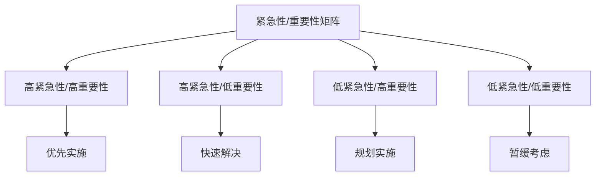

在构建统一度量平台时，明确平台目标是确保项目成功的关键步骤。一个清晰的目标不仅能够指导平台的设计和开发，还能帮助组织统一认识，确保所有相关方对平台的期望一致。本节将深入探讨度量平台的四大核心目标：监控、洞察、问责和改进，并提供如何根据企业实际情况明确平台目标的实用建议。

## 度量平台的核心目标

### 1.1 监控（Monitoring）

#### 1.1.1 定义与价值

监控是度量平台的基础功能，旨在实时跟踪和观察关键指标的状态变化。其核心价值在于：

1. **实时感知**：及时发现系统异常和业务变化
2. **预警机制**：在问题发生前发出预警
3. **状态透明**：为各层级管理者提供透明的运营状态
4. **快速响应**：为快速响应和决策提供数据支持

#### 1.1.2 监控功能体系

```yaml
监控功能体系:
  实时监控:
    - 系统指标监控: CPU、内存、磁盘、网络等
    - 业务指标监控: 收入、用户数、订单量等
    - 应用性能监控: 响应时间、错误率、吞吐量等
  历史趋势监控:
    - 指标趋势分析: 日、周、月趋势变化
    - 同比环比分析: 与历史数据对比
    - 季节性分析: 识别季节性变化规律
  预警通知:
    - 阈值预警: 超过预设阈值时告警
    - 趋势预警: 异常趋势变化时告警
    - 多渠道通知: 邮件、短信、即时通讯等通知方式
```

#### 1.1.3 监控实施要点

1. **指标选择**：选择对业务和系统稳定至关重要的指标
2. **频率设置**：根据指标重要性设置合适的采集频率
3. **可视化设计**：提供直观易懂的监控视图
4. **告警策略**：制定合理的告警策略，避免告警疲劳

### 1.2 洞察（Insight）

#### 1.2.1 定义与价值

洞察是度量平台的高级功能，旨在通过深度数据分析发现隐藏的模式、趋势和关联关系。其核心价值在于：

1. **模式发现**：识别数据中的潜在模式和规律
2. **根因分析**：深入分析问题的根本原因
3. **趋势预测**：基于历史数据预测未来趋势
4. **决策支持**：为战略决策提供深度数据支持

#### 1.2.2 洞察功能体系

```yaml
洞察功能体系:
  描述性分析:
    - 数据概览: 整体数据情况描述
    - 分布分析: 数据分布特征分析
    - 对比分析: 不同维度数据对比
  诊断性分析:
    - 相关性分析: 指标间关联关系分析
    - 异常检测: 识别数据中的异常点
    - 根因分析: 问题根本原因追溯
  预测性分析:
    - 趋势预测: 基于时间序列的预测
    - 分类预测: 基于特征的分类预测
    - 风险评估: 潜在风险识别和评估
```

#### 1.2.3 洞察实施要点

1. **算法选择**：根据业务需求选择合适的分析算法
2. **数据质量**：确保用于分析的数据质量可靠
3. **交互设计**：提供灵活的分析工具和界面
4. **结果解释**：确保分析结果易于理解和应用

### 1.3 问责（Accountability）

#### 1.3.1 定义与价值

问责是度量平台的管理功能，旨在通过数据明确责任归属和绩效表现。其核心价值在于：

1. **责任明确**：通过数据明确各团队和个人的责任
2. **绩效评估**：为绩效考核提供客观数据依据
3. **透明管理**：提高管理过程的透明度
4. **激励机制**：基于数据建立有效的激励机制

#### 1.3.2 问责功能体系

```yaml
问责功能体系:
  绩效管理:
    - KPI跟踪: 关键绩效指标跟踪
    - 目标对比: 实际表现与目标对比
    - 排名分析: 团队和个人排名分析
  责任追溯:
    - 问题归属: 问题责任归属分析
    - 影响评估: 问题影响范围评估
    - 改进跟踪: 问题改进措施跟踪
  报告生成:
    - 定期报告: 日、周、月定期报告
    - 异常报告: 异常情况专项报告
    - 审计报告: 合规性审计报告
```

#### 1.3.3 问责实施要点

1. **指标公平性**：确保考核指标的公平性和合理性
2. **数据准确性**：确保用于问责的数据准确可靠
3. **过程透明**：确保问责过程公开透明
4. **文化引导**：引导健康的问责文化，避免过度问责

### 1.4 改进（Improvement）

#### 1.4.1 定义与价值

改进是度量平台的终极目标，旨在通过数据分析驱动持续优化和提升。其核心价值在于：

1. **持续优化**：推动业务和系统的持续改进
2. **创新驱动**：通过数据发现创新机会
3. **效率提升**：提高组织运营效率
4. **价值创造**：为企业创造更多价值

#### 1.4.2 改进功能体系

```yaml
改进功能体系:
  优化建议:
    - 自动建议: 基于数据分析的自动优化建议
    - 专家建议: 领域专家提供的改进建议
    - 最佳实践: 行业最佳实践推荐
  实验管理:
    - A/B测试: 对比实验设计和管理
    - 多变量测试: 复杂变量组合测试
    - 实验分析: 实验结果分析和评估
  改进跟踪:
    - 改进计划: 改进措施计划制定
    - 进度跟踪: 改进措施执行进度跟踪
    - 效果评估: 改进效果评估和反馈
```

#### 1.4.3 改进实施要点

1. **闭环管理**：建立从发现问题到解决问题的闭环
2. **实验文化**：培养基于实验的改进文化
3. **知识沉淀**：将改进经验沉淀为组织知识
4. **持续迭代**：建立持续改进的机制和流程

## 平台目标的优先级确定

### 2.1 影响因素分析

确定平台目标优先级需要考虑以下因素：

1. **企业成熟度**：企业数据化程度和文化接受度
2. **业务需求**：当前业务面临的主要挑战和需求
3. **资源投入**：可投入的人力、财力和时间资源
4. **技术基础**：现有技术架构和能力水平

### 2.2 优先级确定方法

#### 2.2.1 矩阵分析法

通过紧急性和重要性矩阵确定优先级：



#### 2.2.2 权重评分法

为不同目标设定权重并评分：

```yaml
目标优先级评估:
  监控:
    紧急性: 9
    重要性: 9
    技术难度: 6
    资源需求: 7
    综合得分: 8.5
  洞察:
    紧急性: 7
    重要性: 8
    技术难度: 8
    资源需求: 8
    综合得分: 7.5
  问责:
    紧急性: 6
    重要性: 7
    技术难度: 5
    资源需求: 6
    综合得分: 6.5
  改进:
    紧急性: 5
    重要性: 8
    技术难度: 9
    资源需求: 9
    综合得分: 6.5
```

### 2.3 分阶段实施策略

根据优先级制定分阶段实施策略：

1. **第一阶段**：重点建设监控功能，确保基础数据收集和展示
2. **第二阶段**：完善洞察功能，提供深度数据分析能力
3. **第三阶段**：建立问责机制，支持绩效管理和责任追溯
4. **第四阶段**：强化改进功能，推动持续优化和创新

## 不同类型企业的目标侧重

### 3.1 初创企业

初创企业通常更关注监控和洞察功能：

```yaml
初创企业平台目标:
  核心目标:
    - 监控: 确保系统稳定运行
    - 洞察: 快速了解用户行为和市场反馈
  次要目标:
    - 问责: 基础绩效跟踪
    - 改进: 快速迭代优化
  实施建议:
    - 优先建设实时监控和告警系统
    - 重点关注用户行为分析
    - 建立简单的KPI跟踪机制
```

### 3.2 成熟企业

成熟企业需要全面的平台功能：

```yaml
成熟企业平台目标:
  核心目标:
    - 监控: 全方位系统和业务监控
    - 洞察: 深度数据分析和预测
    - 问责: 完善的绩效管理体系
    - 改进: 持续优化和创新驱动
  实施建议:
    - 建立企业级统一监控平台
    - 建设高级分析和AI能力
    - 完善绩效管理和责任追溯
    - 推动数据驱动的组织变革
```

### 3.3 传统企业数字化转型

传统企业重点关注监控和改进功能：

```yaml
传统企业平台目标:
  核心目标:
    - 监控: 建立数字化监控能力
    - 改进: 推动业务流程优化
  次要目标:
    - 洞察: 逐步建立数据分析能力
    - 问责: 建立数据化的管理机制
  实施建议:
    - 从关键业务系统开始监控
    - 通过试点项目推动改进
    - 逐步培养数据分析能力
    - 建立渐进式的问责机制
```

## 平台目标的量化定义

### 4.1 SMART原则应用

使用SMART原则定义平台目标：

```yaml
监控目标示例:
  Specific: 实时监控核心业务指标
  Measurable: 99%的指标更新延迟小于1分钟
  Achievable: 基于现有技术架构可实现
  Relevant: 直接支持业务稳定运行
  Time-bound: 6个月内完成基础监控建设

洞察目标示例:
  Specific: 提供业务趋势分析和异常检测
  Measurable: 能够提前24小时预警80%的业务异常
  Achievable: 基于机器学习技术可实现
  Relevant: 支持业务决策和风险控制
  Time-bound: 12个月内建立基础分析能力
```

### 4.2 KPI设定

为平台目标设定关键绩效指标：

```yaml
平台目标KPI:
  监控KPI:
    - 指标覆盖率: 核心指标监控覆盖率达到95%
    - 告警准确率: 告警准确率达到90%以上
    - 平均修复时间: MTTR控制在30分钟以内
  洞察KPI:
    - 分析报告及时性: 90%的分析报告在24小时内完成
    - 预测准确率: 关键业务预测准确率达到85%以上
    - 用户满意度: 平台用户满意度达到4.0/5.0以上
  问责KPI:
    - 绩效数据准确性: 绩效相关数据准确率达到99%以上
    - 报告及时性: 月度报告按时完成率达到100%
    - 争议率: 绩效争议率控制在5%以下
  改进KPI:
    - 改进建议采纳率: 改进建议采纳率达到70%以上
    - 改进效果达成率: 改进措施效果达成率达到80%以上
    - 创新项目数量: 年度数据驱动创新项目不少于10个
```

## 实施案例

### 5.1 案例1：某电商平台的平台目标设定

该平台根据业务特点设定了以下目标：

1. **监控优先**：确保大促期间系统稳定
   - 建立了全链路监控体系
   - 实现了毫秒级指标采集
   - 设置了多层级告警机制

2. **洞察深化**：提升用户转化率
   - 建设了用户行为分析平台
   - 实现了个性化推荐优化
   - 建立了A/B测试体系

3. **问责明确**：优化团队绩效
   - 建立了团队KPI体系
   - 实现了绩效数据自动化
   - 建立了绩效反馈机制

4. **改进驱动**：持续业务优化
   - 建立了数据驱动的优化流程
   - 实现了快速迭代机制
   - 建立了创新激励机制

### 5.2 案例2：某金融机构的平台目标设定

该机构重点关注风险控制和合规管理：

1. **监控全面**：确保业务合规和风险可控
   - 建立了监管指标监控体系
   - 实现了实时风险预警
   - 建立了合规性监控机制

2. **洞察深入**：提升风险识别能力
   - 建设了反欺诈分析平台
   - 实现了信用风险评估
   - 建立了市场风险分析能力

3. **问责严格**：强化责任管理
   - 建立了风险责任追溯机制
   - 实现了绩效与风险挂钩
   - 建立了合规问责体系

4. **改进持续**：优化风控模型
   - 建立了模型持续优化机制
   - 实现了机器学习模型更新
   - 建立了风控效果评估体系

## 实施建议

### 6.1 目标设定原则

1. **业务导向**：目标设定要紧密结合业务需求
2. **分层分级**：根据企业成熟度分层设定目标
3. **循序渐进**：按照优先级逐步实现各项目标
4. **动态调整**：根据实施效果动态调整目标

### 6.2 实施路径

1. **顶层设计**：从企业战略高度设计平台目标
2. **需求调研**：深入了解各层级用户需求
3. **方案制定**：制定详细的实施方案
4. **试点验证**：通过试点验证方案可行性
5. **全面推广**：在试点成功基础上全面推广

### 6.3 成功要素

1. **高层支持**：获得高层管理者的支持和推动
2. **跨部门协作**：建立跨部门协作机制
3. **资源保障**：确保足够的人力和资金投入
4. **文化建设**：培育数据驱动的组织文化

## 总结

明确度量平台目标是平台建设成功的关键。监控、洞察、问责、改进四大核心目标各有侧重，企业需要根据自身情况确定优先级和实施路径。通过科学的目标设定和分阶段实施，企业能够逐步建立起完善的度量平台，实现数据驱动的业务优化和管理提升。

在下一节中，我们将探讨技术选型策略，比较自研与基于开源生态构建的优劣。