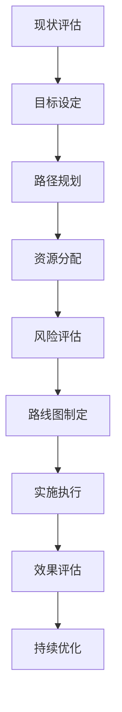

构建企业级统一度量平台是一个复杂的系统工程，需要循序渐进、分阶段实施。制定清晰的演进路线图不仅能够帮助组织合理分配资源，还能确保平台建设的连续性和可持续性。本节将详细介绍如何制定从统一数据采集到智能分析洞察的演进路线图，并提供实用的实施建议。

## 演进路线图设计原则

### 1.1 核心设计原则

#### 1.1.1 价值驱动原则

每个阶段的实施都应能为业务带来明确的价值：

```yaml
价值驱动实施:
  阶段目标:
    - 每个阶段都有明确的业务价值产出
    - 优先实施高价值、低复杂度的功能
    - 通过快速见效增强团队信心
  价值衡量:
    - 业务指标改善程度
    - 效率提升幅度
    - 成本节约效果
    - 用户满意度提升
```

#### 1.1.2 渐进式演进原则

采用小步快跑的方式，逐步完善平台能力：

```yaml
渐进式演进:
  实施策略:
    - MVP优先: 先实现最小可行产品
    - 迭代优化: 基于反馈持续改进
    - 能力扩展: 逐步增加平台功能
  风险控制:
    - 分阶段验证技术方案
    - 及时调整实施策略
    - 保持架构的可扩展性
```

#### 1.1.3 架构先行原则

在实施具体功能前，先设计好整体架构：

```yaml
架构先行:
  设计阶段:
    - 制定整体架构蓝图
    - 确定关键技术选型
    - 设计数据流和接口
  实施阶段:
    - 按照架构分步实施
    - 保持架构的一致性
    - 预留扩展接口
```

### 1.2 路线图制定方法

#### 1.2.1 现状评估

制定路线图前，需要全面评估当前状况：

1. **技术现状**：现有系统、工具、技术栈
2. **数据现状**：数据源、数据质量、数据孤岛情况
3. **组织现状**：团队技能、资源投入、文化接受度
4. **业务需求**：当前和未来的业务需求

#### 1.2.2 目标设定

明确各阶段的目标和里程碑：

```yaml
目标设定框架:
  短期目标(3-6个月):
    - 建立基础数据采集能力
    - 实现核心指标监控
    - 搭建基础展示平台
  中期目标(6-12个月):
    - 完善数据治理体系
    - 增强数据分析能力
    - 建立预警机制
  长期目标(12-24个月):
    - 实现智能分析洞察
    - 建立完整的度量生态
    - 推动数据驱动文化
```

#### 1.2.3 路径规划

基于现状和目标，规划实施路径：



## 分阶段演进路线图

### 2.1 第一阶段：基础能力建设（0-6个月）

#### 2.1.1 阶段目标

建立统一的数据采集和基础监控能力：

```yaml
第一阶段目标:
  核心目标:
    - 实现多源数据统一采集
    - 建立基础监控体系
    - 搭建可视化展示平台
  具体成果:
    - 数据采集平台上线
    - 核心指标监控面板
    - 基础告警机制
    - 用户访问权限控制
```

#### 2.1.2 关键任务

```yaml
关键任务清单:
  数据采集:
    - 部署数据采集代理
    - 配置数据源连接
    - 建立数据采集规范
    - 实现数据质量校验
  存储设计:
    - 选择合适的存储方案
    - 设计数据模型
    - 建立数据分区策略
    - 实现数据备份机制
  监控展示:
    - 部署监控展示工具
    - 设计核心指标面板
    - 配置基础告警规则
    - 建立用户权限体系
```

#### 2.1.3 实施建议

1. **优先级排序**：优先处理对业务影响最大的数据源
2. **快速验证**：通过小范围试点快速验证方案可行性
3. **文档建设**：同步建设技术文档和操作手册
4. **培训准备**：为后续团队培训做好准备

### 2.2 第二阶段：能力完善（6-12个月）

#### 2.2.1 阶段目标

完善数据治理体系，增强数据分析和预警能力：

```yaml
第二阶段目标:
  核心目标:
    - 建立完善的数据治理体系
    - 增强数据分析能力
    - 完善预警和通知机制
  具体成果:
    - 数据质量管理体系
    - 多维度分析能力
    - 智能预警系统
    - 自助分析平台
```

#### 2.2.2 关键任务

```yaml
关键任务清单:
  数据治理:
    - 建立数据质量监控
    - 实施数据血缘追踪
    - 建立元数据管理
    - 制定数据标准规范
  分析能力:
    - 扩展分析工具集成
    - 建立分析模型库
    - 实现自助分析功能
    - 提供分析API服务
  预警机制:
    - 增强预警算法
    - 实现多渠道通知
    - 建立预警分级管理
    - 实现预警处理流程
```

#### 2.2.3 实施建议

1. **体系化建设**：注重体系化建设，避免功能碎片化
2. **用户体验**：重视用户体验，持续优化交互设计
3. **性能优化**：关注系统性能，及时进行优化调整
4. **安全加固**：加强安全防护，确保数据安全

### 2.3 第三阶段：智能升级（12-18个月）

#### 2.3.1 阶段目标

实现智能分析和预测能力，提升平台智能化水平：

```yaml
第三阶段目标:
  核心目标:
    - 实现智能分析能力
    - 建立预测分析模型
    - 提供个性化洞察
  具体成果:
    - 智能异常检测
    - 趋势预测能力
    - 根因分析功能
    - 个性化推荐系统
```

#### 2.3.2 关键任务

```yaml
关键任务清单:
  智能分析:
    - 集成机器学习算法
    - 实现异常智能检测
    - 建立根因分析引擎
    - 提供智能诊断建议
  预测分析:
    - 建立时间序列预测模型
    - 实现业务趋势预测
    - 建立风险评估模型
    - 提供预测结果可视化
  个性化服务:
    - 实现用户行为分析
    - 提供个性化仪表板
    - 建立智能推荐机制
    - 支持自定义分析模板
```

#### 2.3.3 实施建议

1. **算法选型**：选择适合业务场景的算法和模型
2. **数据准备**：确保训练数据的质量和完整性
3. **模型管理**：建立模型版本管理和更新机制
4. **效果评估**：建立模型效果评估和优化机制

### 2.4 第四阶段：生态构建（18-24个月）

#### 2.4.1 阶段目标

构建完整的度量生态系统，推动数据驱动文化：

```yaml
第四阶段目标:
  核心目标:
    - 构建完整的度量生态
    - 推动数据驱动文化
    - 实现平台开放能力
  具体成果:
    - 开放API平台
    - 插件扩展机制
    - 数据驱动文化建设
    - 平台运营体系
```

#### 2.4.2 关键任务

```yaml
关键任务清单:
  生态建设:
    - 提供开放API服务
    - 建立插件扩展机制
    - 实现第三方集成
    - 建立开发者社区
  文化推动:
    - 开展数据素养培训
    - 建立数据驱动流程
    - 推广最佳实践案例
    - 建立激励机制
  运营优化:
    - 建立平台运营体系
    - 实现用户行为分析
    - 建立反馈改进机制
    - 持续优化平台功能
```

#### 2.4.3 实施建议

1. **开放性设计**：注重平台的开放性和扩展性
2. **社区建设**：积极建设用户和开发者社区
3. **文化建设**：持续推动数据驱动文化建设
4. **持续改进**：建立持续改进和优化机制

## 关键成功因素

### 3.1 高层支持

```yaml
高层支持要素:
  战略认同:
    - 将度量平台纳入企业战略
    - 提供必要的资源保障
    - 参与关键决策制定
  组织保障:
    - 建立专门的项目组织
    - 明确责任分工
    - 建立考核机制
```

### 3.2 跨部门协作

```yaml
协作机制:
  沟通机制:
    - 建立定期沟通会议
    - 设立跨部门工作组
    - 建立信息共享平台
  协作流程:
    - 明确协作流程
    - 建立问题解决机制
    - 设立协调角色
```

### 3.3 技术能力建设

```yaml
能力建设:
  团队建设:
    - 引进关键技术人才
    - 加强内部培训
    - 建立知识分享机制
  技术储备:
    - 跟踪前沿技术
    - 建立技术评估机制
    - 积累技术经验
```

### 3.4 文化培育

```yaml
文化建设:
  意识培养:
    - 开展数据素养教育
    - 分享成功案例
    - 建立学习氛围
  激励机制:
    - 建立激励制度
    - 推广最佳实践
    - 营造创新环境
```

## 风险识别与应对

### 4.1 技术风险

```yaml
技术风险应对:
  风险识别:
    - 技术选型错误
    - 性能瓶颈
    - 安全漏洞
  应对措施:
    - 建立技术评估机制
    - 进行性能压力测试
    - 实施安全防护措施
```

### 4.2 管理风险

```yaml
管理风险应对:
  风险识别:
    - 资源投入不足
    - 进度延期
    - 质量不达标
  应对措施:
    - 制定详细项目计划
    - 建立进度监控机制
    - 实施质量管理措施
```

### 4.3 业务风险

```yaml
业务风险应对:
  风险识别:
    - 需求变更频繁
    - 用户接受度低
    - 业务价值不明显
  应对措施:
    - 建立需求管理机制
    - 加强用户参与
    - 持续价值验证
```

## 实施案例

### 5.1 案例1：某电商平台的演进路线图

该平台按照以下路线图成功建设了度量平台：

1. **第一阶段（0-6个月）**：
   - 实现了核心业务指标的统一采集
   - 建立了实时监控和告警系统
   - 搭建了基础的可视化展示平台

2. **第二阶段（6-12个月）**：
   - 完善了数据治理体系
   - 增强了多维度分析能力
   - 实现了智能预警功能

3. **第三阶段（12-18个月）**：
   - 实现了用户行为智能分析
   - 建立了业务趋势预测模型
   - 提供了个性化洞察服务

4. **第四阶段（18-24个月）**：
   - 构建了开放的API平台
   - 建立了插件扩展机制
   - 推动了数据驱动文化建设

### 5.2 案例2：某金融机构的演进路线图

该机构根据金融行业特点制定了演进路线图：

1. **第一阶段**：重点建设合规性监控和风险预警能力
2. **第二阶段**：完善数据治理和质量管理体系
3. **第三阶段**：实现智能风控和预测分析能力
4. **第四阶段**：构建开放生态和推动文化建设

## 实施建议

### 6.1 路线图制定建议

1. **实事求是**：基于企业实际情况制定路线图
2. **灵活调整**：根据实施效果及时调整路线图
3. **重点关注**：重点关注关键路径和里程碑节点
4. **风险预案**：制定风险应对预案

### 6.2 实施过程建议

1. **小步快跑**：采用敏捷开发方式，快速迭代
2. **用户参与**：让最终用户参与设计和测试
3. **持续改进**：建立持续改进机制
4. **知识沉淀**：及时总结经验教训

### 6.3 效果评估建议

1. **量化指标**：建立量化的评估指标体系
2. **定期评估**：定期评估实施效果
3. **反馈机制**：建立用户反馈机制
4. **持续优化**：基于评估结果持续优化

## 总结

制定清晰的演进路线图是度量平台建设成功的关键。通过分阶段实施，企业可以有效控制风险，合理分配资源，并逐步实现从统一数据采集到智能分析洞察的目标。在实施过程中，需要重点关注价值驱动、渐进式演进和架构先行等原则，同时要做好风险识别和应对。

通过科学的路线图规划和有效的实施管理，企业能够成功构建起满足业务需求的统一度量平台，为数字化转型和数据驱动决策提供强有力的支撑。