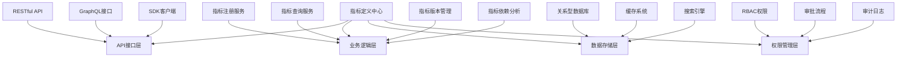
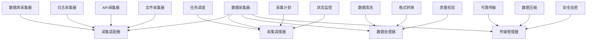
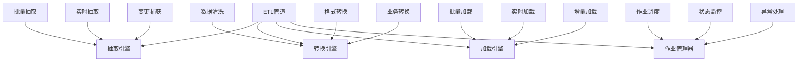
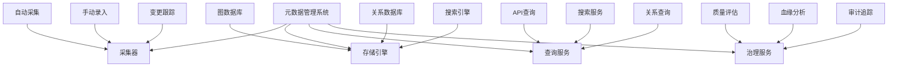
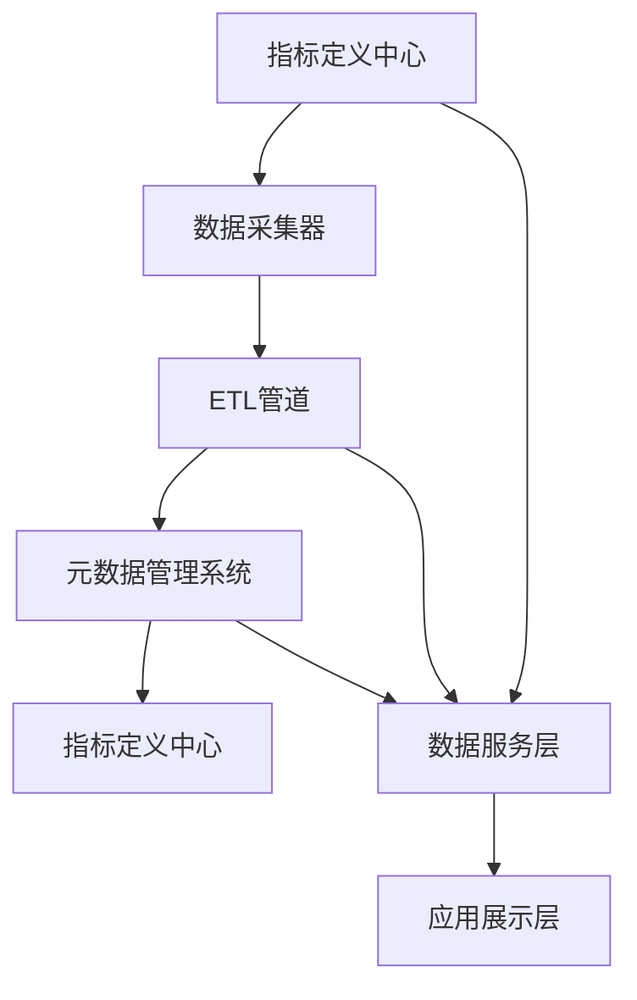

在企业级统一度量平台中，核心组件的设计直接影响平台的功能完整性、性能表现和可维护性。本节将深入探讨四个关键核心组件的设计：指标定义中心、数据采集器、ETL管道和元数据管理系统。这些组件构成了平台的核心功能基础，需要精心设计以确保平台的稳定运行和高效服务。

## 指标定义中心

### 1.1 组件职责

指标定义中心是整个度量平台的核心管理组件，负责指标的全生命周期管理：

```yaml
指标定义中心职责:
  指标注册:
    - 提供指标注册接口
    - 验证指标定义的合法性
    - 分配唯一指标标识符
  指标管理:
    - 维护指标元数据信息
    - 管理指标版本变更
    - 实现指标分类和标签
  指标查询:
    - 提供指标信息查询接口
    - 支持指标搜索和过滤
    - 实现指标依赖关系查询
  权限控制:
    - 管理指标访问权限
    - 实现指标负责人分配
    - 支持指标审批流程
```

### 1.2 设计架构



### 1.3 核心数据模型

#### 1.3.1 指标定义模型

```json
{
  "metricId": "metric_001",
  "name": "系统CPU使用率",
  "description": "系统CPU使用率百分比",
  "category": "系统监控",
  "tags": ["system", "performance", "cpu"],
  "dataType": "percentage",
  "unit": "%",
  "calculationLogic": "100 - (avg by (instance) (irate(node_cpu_seconds_total{mode=\"idle\"}[5m])) * 100)",
  "dataSource": "prometheus",
  "owner": "ops-team",
  "version": "1.0",
  "status": "active",
  "createTime": "2025-01-01T00:00:00Z",
  "updateTime": "2025-01-01T00:00:00Z"
}
```

#### 1.3.2 指标版本模型

```json
{
  "versionId": "version_001",
  "metricId": "metric_001",
  "version": "1.0",
  "changes": "初始版本",
  "changeReason": "业务需求",
  "approver": "admin",
  "approveTime": "2025-01-01T00:00:00Z",
  "status": "approved"
}
```

### 1.4 关键功能实现

#### 1.4.1 指标注册流程

```python
class MetricRegistryService:
    def register_metric(self, metric_definition):
        # 1. 验证指标定义
        if not self.validate_metric(metric_definition):
            raise ValidationError("指标定义验证失败")
        
        # 2. 检查重复性
        if self.check_duplicate(metric_definition):
            raise DuplicateError("指标已存在")
        
        # 3. 分配唯一标识符
        metric_id = self.generate_metric_id()
        metric_definition.metricId = metric_id
        
        # 4. 保存指标定义
        self.metric_repository.save(metric_definition)
        
        # 5. 记录审计日志
        self.audit_service.log(
            action="REGISTER",
            resource_type="METRIC",
            resource_id=metric_id,
            operator=self.get_current_user()
        )
        
        return metric_id
```

#### 1.4.2 指标依赖分析

```python
class MetricDependencyAnalyzer:
    def analyze_dependencies(self, metric_id):
        metric = self.metric_repository.get(metric_id)
        dependencies = []
        
        # 解析计算逻辑中的依赖指标
        calculation_logic = metric.calculationLogic
        dependent_metrics = self.parse_dependencies(calculation_logic)
        
        for dep_metric_id in dependent_metrics:
            dep_metric = self.metric_repository.get(dep_metric_id)
            dependencies.append({
                "metricId": dep_metric_id,
                "name": dep_metric.name,
                "type": "direct" if dep_metric_id in dependent_metrics else "indirect"
            })
        
        return dependencies
```

### 1.5 设计考虑

1. **标准化**：建立统一的指标定义标准和规范
2. **可扩展性**：支持指标定义的灵活扩展
3. **版本管理**：实现指标版本的完整管理
4. **权限控制**：确保指标定义的安全性和合规性

## 数据采集器

### 2.1 组件职责

数据采集器负责从各种数据源收集原始数据并传输到平台：

```yaml
数据采集器职责:
  数据源接入:
    - 支持多种数据源类型
    - 实现数据源适配器
    - 管理数据源连接配置
  数据采集:
    - 执行数据采集任务
    - 处理采集异常情况
    - 实现采集进度跟踪
  数据预处理:
    - 数据格式标准化
    - 数据质量初步校验
    - 数据过滤和转换
  数据传输:
    - 保证数据传输可靠性
    - 实现数据压缩和加密
    - 支持批量和实时传输
```

### 2.2 设计架构



### 2.3 核心功能实现

#### 2.3.1 采集适配器框架

```java
public abstract class DataCollectorAdapter {
    protected DataSourceConfig config;
    
    public abstract void initialize(DataSourceConfig config);
    
    public abstract List<DataRecord> collectData(CollectParams params);
    
    public abstract void validateConnection();
    
    public abstract DataSourceMetadata getMetadata();
    
    protected void logCollectionInfo(String message) {
        Logger.info("数据采集[{}]: {}", config.getSourceId(), message);
    }
}

public class DatabaseCollector extends DataCollectorAdapter {
    private DataSource dataSource;
    
    @Override
    public void initialize(DataSourceConfig config) {
        this.config = config;
        this.dataSource = DataSourceFactory.createDataSource(config);
    }
    
    @Override
    public List<DataRecord> collectData(CollectParams params) {
        List<DataRecord> records = new ArrayList<>();
        
        try {
            Connection conn = dataSource.getConnection();
            PreparedStatement stmt = conn.prepareStatement(config.getQuery());
            
            ResultSet rs = stmt.executeQuery();
            while (rs.next()) {
                DataRecord record = mapResultSetToRecord(rs);
                records.add(record);
            }
            
            rs.close();
            stmt.close();
            conn.close();
        } catch (SQLException e) {
            Logger.error("数据库采集失败", e);
            throw new DataCollectionException("数据库采集失败", e);
        }
        
        return records;
    }
}
```

#### 2.3.2 采集调度管理

```yaml
采集调度配置:
  采集任务:
    - 任务ID: task_001
      数据源ID: source_001
      采集频率: 60s
      采集时间窗口: 5m
      重试策略: 最大重试3次，间隔30s
      超时设置: 300s
      并发控制: 最大并发数5
  调度策略:
    - 时间驱动: 按照预设时间执行
    - 事件驱动: 基于事件触发执行
    - 手动触发: 支持手动执行
```

### 2.4 设计考虑

1. **插件化设计**：支持采集器的插件化扩展
2. **可靠性保障**：实现数据采集的可靠性和完整性
3. **性能优化**：优化采集性能，减少对源系统的干扰
4. **监控告警**：建立采集过程的监控和告警机制

## ETL管道

### 3.1 组件职责

ETL管道负责数据的抽取、转换和加载处理：

```yaml
ETL管道职责:
  数据抽取:
    - 从多种数据源抽取数据
    - 支持全量和增量抽取
    - 实现数据变更捕获
  数据转换:
    - 执行数据清洗和验证
    - 实现数据格式转换
    - 执行业务逻辑转换
  数据加载:
    - 将处理后的数据加载到目标系统
    - 支持多种目标存储
    - 实现数据一致性保证
  流程管理:
    - 管理ETL作业流程
    - 监控作业执行状态
    - 处理作业异常情况
```

### 3.2 设计架构



### 3.3 核心功能实现

#### 3.3.1 ETL作业定义

```json
{
  "jobId": "etl_job_001",
  "name": "用户行为数据ETL",
  "description": "处理用户行为日志数据",
  "source": {
    "type": "kafka",
    "config": {
      "bootstrapServers": "kafka-server:9092",
      "topic": "user_behavior",
      "groupId": "etl_consumer"
    }
  },
  "transform": {
    "steps": [
      {
        "type": "filter",
        "condition": "event_type in ['click', 'view', 'purchase']"
      },
      {
        "type": "enrich",
        "lookup": {
          "table": "user_profile",
          "joinKey": "user_id"
        }
      },
      {
        "type": "aggregate",
        "groupBy": ["user_id", "date"],
        "aggregations": [
          {"field": "event_count", "function": "count"},
          {"field": "total_amount", "function": "sum"}
        ]
      }
    ]
  },
  "target": {
    "type": "clickhouse",
    "config": {
      "host": "clickhouse-server",
      "port": 9000,
      "database": "analytics",
      "table": "user_behavior_summary"
    }
  },
  "schedule": {
    "type": "streaming",
    "parallelism": 4
  }
}
```

#### 3.3.2 转换引擎实现

```python
class TransformEngine:
    def __init__(self):
        self.transformers = {
            'filter': FilterTransformer(),
            'enrich': EnrichTransformer(),
            'aggregate': AggregateTransformer(),
            'format': FormatTransformer()
        }
    
    def execute_transform(self, data, transform_config):
        result = data
        
        for step in transform_config['steps']:
            transformer = self.transformers.get(step['type'])
            if transformer:
                result = transformer.transform(result, step)
            else:
                raise TransformException(f"未知的转换类型: {step['type']}")
        
        return result

class FilterTransformer:
    def transform(self, data, config):
        condition = config['condition']
        filtered_data = []
        
        for record in data:
            if self.evaluate_condition(record, condition):
                filtered_data.append(record)
        
        return filtered_data
    
    def evaluate_condition(self, record, condition):
        # 简化的条件评估实现
        # 实际实现可能需要更复杂的表达式解析
        try:
            # 这里应该使用安全的表达式解析器
            return eval(condition, {}, record)
        except:
            return False
```

### 3.4 设计考虑

1. **灵活性**：支持灵活的转换逻辑配置
2. **性能优化**：优化ETL处理性能
3. **容错处理**：实现完善的异常处理机制
4. **监控追踪**：建立ETL作业的监控和追踪机制

## 元数据管理系统

### 4.1 组件职责

元数据管理系统负责管理平台中所有数据的元数据信息：

```yaml
元数据管理系统职责:
  元数据采集:
    - 自动采集系统元数据
    - 支持手动元数据录入
    - 实现元数据变更跟踪
  元数据存储:
    - 提供元数据存储服务
    - 实现元数据版本管理
    - 支持元数据备份恢复
  元数据查询:
    - 提供元数据查询接口
    - 支持元数据搜索功能
    - 实现元数据关系查询
  元数据治理:
    - 实现元数据质量管理
    - 支持元数据血缘分析
    - 提供元数据审计功能
```

### 4.2 设计架构



### 4.3 核心数据模型

#### 4.3.1 元数据实体模型

```json
{
  "entityId": "entity_001",
  "entityType": "table",
  "name": "user_behavior_log",
  "description": "用户行为日志表",
  "system": "data_warehouse",
  "database": "analytics",
  "schema": "public",
  "owner": "data_team",
  "tags": ["user", "behavior", "log"],
  "properties": {
    "rowCount": 1000000,
    "size": "2.5GB",
    "lastUpdated": "2025-01-01T10:00:00Z"
  },
  "fields": [
    {
      "name": "user_id",
      "type": "string",
      "description": "用户ID",
      "isPrimaryKey": true
    },
    {
      "name": "event_type",
      "type": "string",
      "description": "事件类型"
    },
    {
      "name": "timestamp",
      "type": "timestamp",
      "description": "事件时间戳"
    }
  ]
}
```

#### 4.3.2 血缘关系模型

```json
{
  "lineageId": "lineage_001",
  "sourceEntityId": "entity_001",
  "targetEntityId": "entity_002",
  "relationshipType": "derived_from",
  "transformation": "daily_aggregation",
  "lastUpdated": "2025-01-01T12:00:00Z",
  "properties": {
    "jobId": "etl_job_001",
    "executionTime": "2025-01-01T11:30:00Z"
  }
}
```

### 4.4 核心功能实现

#### 4.4.1 血缘分析服务

```java
public class LineageAnalyzer {
    private MetadataRepository metadataRepository;
    private LineageRepository lineageRepository;
    
    public LineageGraph analyzeLineage(String entityId, int depth) {
        LineageGraph graph = new LineageGraph();
        Set<String> visited = new HashSet<>();
        
        Queue<LineageNode> queue = new LinkedList<>();
        queue.offer(new LineageNode(entityId, 0));
        
        while (!queue.isEmpty() && depth > 0) {
            LineageNode node = queue.poll();
            
            if (visited.contains(node.getEntityId()) || node.getDepth() > depth) {
                continue;
            }
            
            visited.add(node.getEntityId());
            
            // 获取实体信息
            MetadataEntity entity = metadataRepository.get(node.getEntityId());
            graph.addNode(entity);
            
            // 获取上游血缘关系
            List<LineageRelation> upstream = lineageRepository.getUpstream(node.getEntityId());
            for (LineageRelation relation : upstream) {
                graph.addEdge(relation);
                queue.offer(new LineageNode(relation.getSourceEntityId(), node.getDepth() + 1));
            }
            
            // 获取下游血缘关系
            List<LineageRelation> downstream = lineageRepository.getDownstream(node.getEntityId());
            for (LineageRelation relation : downstream) {
                graph.addEdge(relation);
                queue.offer(new LineageNode(relation.getTargetEntityId(), node.getDepth() + 1));
            }
        }
        
        return graph;
    }
}
```

#### 4.4.2 质量评估服务

```python
class QualityAssessmentService:
    def __init__(self):
        self.assessment_rules = {
            'completeness': self.assess_completeness,
            'accuracy': self.assess_accuracy,
            'consistency': self.assess_consistency,
            'timeliness': self.assess_timeliness
        }
    
    def assess_entity_quality(self, entity_id):
        entity = self.metadata_repository.get(entity_id)
        assessment_results = {}
        
        for rule_name, rule_func in self.assessment_rules.items():
            try:
                score = rule_func(entity)
                assessment_results[rule_name] = {
                    'score': score,
                    'timestamp': datetime.now(),
                    'details': self.get_assessment_details(entity, rule_name)
                }
            except Exception as e:
                assessment_results[rule_name] = {
                    'score': 0,
                    'error': str(e),
                    'timestamp': datetime.now()
                }
        
        # 保存评估结果
        self.quality_repository.save_assessment(entity_id, assessment_results)
        
        return assessment_results
    
    def assess_completeness(self, entity):
        # 评估数据完整性
        required_fields = self.get_required_fields(entity)
        actual_fields = entity.get_fields()
        
        if not required_fields:
            return 1.0
        
        complete_fields = set(required_fields) & set(actual_fields)
        return len(complete_fields) / len(required_fields)
```

### 4.5 设计考虑

1. **标准化**：建立统一的元数据标准和规范
2. **自动化**：实现元数据的自动采集和更新
3. **可视化**：提供直观的元数据展示和分析界面
4. **治理能力**：建立完善的元数据治理机制

## 组件间协作设计

### 5.1 数据流协作



### 5.2 接口协作

```yaml
组件间接口:
  指标定义中心接口:
    - getMetricDefinition(metricId): 获取指标定义
    - registerMetric(metric): 注册新指标
    - updateMetric(metric): 更新指标定义
  
  数据采集器接口:
    - collectData(sourceConfig): 采集数据
    - validateSource(sourceConfig): 验证数据源
  
  ETL管道接口:
    - executeJob(jobConfig): 执行ETL作业
    - getJobStatus(jobId): 获取作业状态
  
  元数据管理接口:
    - getEntityMetadata(entityId): 获取实体元数据
    - updateLineage(sourceId, targetId): 更新血缘关系
```

## 实施案例

### 6.1 案例1：某电商平台的核心组件设计

该平台的核心组件设计特点：

1. **指标定义中心**：
   - 支持业务指标和系统指标的统一管理
   - 实现了指标的版本控制和审批流程
   - 提供了丰富的API接口供其他系统调用

2. **数据采集器**：
   - 支持从数据库、日志、API等多种数据源采集
   - 实现了采集任务的可视化配置和管理
   - 建立了完善的采集监控和告警机制

3. **ETL管道**：
   - 基于Apache Spark实现批处理ETL
   - 基于Apache Flink实现实时ETL
   - 提供了可视化的ETL作业设计工具

4. **元数据管理系统**：
   - 基于Neo4j实现元数据血缘关系存储
   - 提供了元数据搜索和浏览功能
   - 实现了数据质量评估和监控

### 6.2 案例2：某金融机构的核心组件设计

该机构的核心组件设计特点：

1. **指标定义中心**：
   - 严格遵循金融行业监管要求
   - 实现了指标定义的合规性检查
   - 建立了完善的审计和追溯机制

2. **数据采集器**：
   - 支持金融专用数据源的采集
   - 实现了数据传输的加密和安全保护
   - 满足了金融行业的高可用性要求

3. **ETL管道**：
   - 实现了金融数据的复杂转换逻辑
   - 支持监管报表的自动生成
   - 满足了数据一致性和完整性要求

4. **元数据管理系统**：
   - 实现了金融数据的血缘追踪
   - 提供了数据质量的实时监控
   - 支持了数据治理的合规性要求

## 实施建议

### 7.1 设计原则

1. **模块化设计**：采用模块化设计，降低组件间耦合度
2. **接口标准化**：定义清晰的组件间接口规范
3. **可扩展性**：预留扩展接口，支持功能扩展
4. **高可用性**：确保核心组件的高可用性和容错能力

### 7.2 实施步骤

1. **需求分析**：深入分析业务需求和技术要求
2. **架构设计**：设计详细的组件架构和接口
3. **原型开发**：开发核心组件的原型进行验证
4. **逐步实施**：按照优先级逐步实施各组件
5. **集成测试**：进行组件间集成测试和优化

### 7.3 最佳实践

1. **文档完善**：建立完善的组件设计和使用文档
2. **监控告警**：建立组件运行状态的监控告警机制
3. **版本管理**：实施组件版本管理和升级策略
4. **性能优化**：持续优化组件性能和资源使用

## 总结

核心组件设计是企业级统一度量平台建设的关键环节。指标定义中心、数据采集器、ETL管道和元数据管理系统四个核心组件各有其独特的职责和设计要点，需要根据业务需求和技术特点进行精心设计。通过合理的架构设计和实现，这些核心组件能够协同工作，为平台提供强大的功能支撑和稳定的服务保障。

在下一节中，我们将探讨如何实现平台的高性能与可扩展性，以应对海量时序数据的挑战。