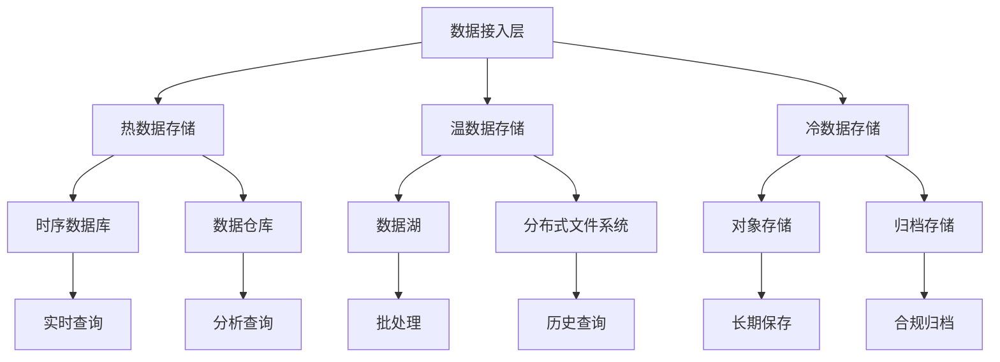

在企业级统一度量平台中，数据存储是支撑整个系统运行的基础。随着数据量的爆炸式增长和业务需求的多样化，选择合适的存储方案成为平台建设的关键决策。本节将深入探讨时序数据库、数据湖和数据仓库的特点、优势、适用场景以及选型策略，帮助架构师和工程师做出明智的技术选择。

## 时序数据库选型

### 1.1 时序数据库概述

时序数据库是专门为处理时间序列数据而设计的数据库系统，具有高效写入、高压缩比、快速查询等特点，非常适合存储监控指标、IoT数据、业务指标等时序数据。

```yaml
时序数据库特征:
  数据特征:
    - 时间戳作为主键或重要索引
    - 数据按时间顺序写入
    - 查询多基于时间范围
  性能特征:
    - 高写入吞吐量
    - 高压缩比存储
    - 快速时间范围查询
  应用场景:
    - 系统监控和告警
    - IoT传感器数据存储
    - 业务指标存储和分析
```

### 1.2 主流时序数据库对比

#### 1.2.1 TDengine

```yaml
TDengine特点:
  优势:
    - 高性能: 专为IoT和时序数据优化
    - 高压缩比: 数据压缩率可达10-100倍
    - 内置缓存: 支持流式计算和实时分析
    - 多协议支持: 支持MQTT、HTTP、WebSocket等协议
  劣势:
    - 生态相对较小
    - 社区支持有限
    - 企业版需付费
  适用场景:
    - IoT设备数据存储
    - 工业监控系统
    - 边缘计算场景
```

#### 1.2.2 InfluxDB

```yaml
InfluxDB特点:
  优势:
    - 成熟稳定: 时序数据库领域的先驱
    - TSI索引: 提供高效的时间序列索引
    - Flux语言: 强大的查询和分析语言
    - 生态完善: 丰富的工具和插件
  劣势:
    - 单机性能瓶颈
    - 集群版本需付费
    - 内存消耗较大
  适用场景:
    - DevOps监控
    - 应用性能监控
    - 中小型时序数据存储
```

#### 1.2.3 Prometheus

```yaml
Prometheus特点:
  优势:
    - 强大的查询语言: PromQL功能强大
    - 优秀的监控集成: 与Grafana等工具集成良好
    - 活跃社区: 开源社区活跃，文档完善
    - Pull模式: 简单的拉取模型
  劣势:
    - 主要面向监控场景
    - 长期存储能力有限
    - 不支持水平扩展
  适用场景:
    - 系统监控和告警
    - Kubernetes监控
    - 云原生环境监控
```

### 1.3 时序数据库选型指南

#### 1.3.1 选型考虑因素

```yaml
选型考虑因素:
  数据规模:
    - 小规模(<100GB): InfluxDB单机版
    - 中等规模(100GB-1TB): TimescaleDB
    - 大规模(>1TB): TDengine或集群版InfluxDB
  查询复杂度:
    - 简单监控: Prometheus
    - 复杂分析: TimescaleDB
    - 实时处理: TDengine
  团队技能:
    - SQL熟悉: TimescaleDB
    - 监控背景: Prometheus
    - IoT经验: TDengine
  成本预算:
    - 开源优先: InfluxDB OSS, Prometheus
    - 企业支持: InfluxDB Enterprise, TDengine企业版
```

#### 1.3.2 性能对比测试

```python
class TimeSeriesDBBenchmark:
    def __init__(self):
        self.databases = {
            'tdengine': TDEngineClient(),
            'influxdb': InfluxDBClient(),
            'prometheus': PrometheusClient()
        }
    
    def benchmark_write_performance(self, data_size=1000000):
        """写入性能测试"""
        results = {}
        
        for db_name, client in self.databases.items():
            start_time = time.time()
            
            # 批量写入测试数据
            batch_size = 10000
            for i in range(0, data_size, batch_size):
                batch_data = self.generate_test_data(batch_size)
                client.write_batch(batch_data)
            
            end_time = time.time()
            results[db_name] = {
                'total_time': end_time - start_time,
                'throughput': data_size / (end_time - start_time)
            }
        
        return results
    
    def benchmark_query_performance(self):
        """查询性能测试"""
        query_results = {}
        
        for db_name, client in self.databases.items():
            # 时间范围查询测试
            start_time = time.time()
            result = client.query_time_range(
                metric='cpu_usage',
                start='2025-01-01T00:00:00Z',
                end='2025-01-02T00:00:00Z'
            )
            query_time = time.time() - start_time
            
            # 聚合查询测试
            start_time = time.time()
            agg_result = client.query_aggregation(
                metric='memory_usage',
                agg_func='avg',
                time_window='1h'
            )
            agg_time = time.time() - start_time
            
            query_results[db_name] = {
                'range_query_time': query_time,
                'aggregation_query_time': agg_time
            }
        
        return query_results
```

## 数据湖选型

### 2.1 数据湖概述

数据湖是一种存储企业各种原始数据的系统或存储库，支持多种数据格式（结构化、半结构化、非结构化），并提供强大的数据处理和分析能力。

```yaml
数据湖特征:
  数据特征:
    - 支持多种数据格式
    - 存储原始数据
    - 支持大规模数据存储
  架构特征:
    - 低成本存储
    - 高可扩展性
    - 支持多种计算引擎
  应用场景:
    - 大数据分析
    - 机器学习
    - 数据探索和发现
```

### 2.2 主流数据湖框架对比

#### 2.2.1 Apache Iceberg

```yaml
Iceberg特点:
  优势:
    - 表格式: 提供ACID事务支持
    - 时间旅行: 支持数据版本管理和回溯
    - 模式演进: 支持无停机的模式变更
    - 多引擎支持: 支持Spark、Flink、Trino等引擎
  劣势:
    - 相对较新，生态在发展中
    - 学习曲线较陡峭
    - 需要专门的元数据管理
  适用场景:
    - 企业级数据湖
    - 需要ACID事务的场景
    - 复杂的数据管道
```

#### 2.2.2 Apache Hudi

```yaml
Hudi特点:
  优势:
    - 增量处理: 优秀的增量数据处理能力
    - 实时摄取: 支持实时数据摄取
    - 更新删除: 支持记录级别的更新和删除
    - 查询优化: 提供多种查询视图
  劣势:
    - 配置复杂
    - 资源消耗较大
    - 社区相对较小
  适用场景:
    - 实时数据湖
    - 需要频繁更新的场景
    - 增量数据处理
```

### 2.3 数据湖选型指南

#### 2.3.1 选型考虑因素

```yaml
数据湖选型考虑:
  数据更新频率:
    - 批量更新: Iceberg
    - 实时更新: Hudi
    - 只读场景: Delta Lake
  查询模式:
    - 批处理查询: Iceberg
    - 实时查询: Hudi
    - 交互式查询: Delta Lake
  生态集成:
    - Spark生态: Delta Lake, Iceberg
    - Flink生态: Hudi, Iceberg
    - 多引擎支持: Iceberg
```

#### 2.3.2 架构设计示例

```python
class DataLakeArchitecture:
    def __init__(self, lake_format='iceberg'):
        self.lake_format = lake_format
        self.storage_layer = S3Storage()
        self.compute_engines = {
            'batch': SparkEngine(),
            'streaming': FlinkEngine(),
            'interactive': TrinoEngine()
        }
    
    def write_data(self, table_name, data, write_mode='append'):
        """写入数据到数据湖"""
        if self.lake_format == 'iceberg':
            return self._write_iceberg(table_name, data, write_mode)
        elif self.lake_format == 'hudi':
            return self._write_hudi(table_name, data, write_mode)
    
    def _write_iceberg(self, table_name, data, write_mode):
        """Iceberg写入实现"""
        # 创建或加载Iceberg表
        table = self._get_or_create_iceberg_table(table_name)
        
        # 写入数据
        with table.new_transaction() as tx:
            tx.write_data(data, mode=write_mode)
            tx.commit()
        
        return table.current_snapshot().snapshot_id
    
    def _write_hudi(self, table_name, data, write_mode):
        """Hudi写入实现"""
        hudi_options = {
            'hoodie.table.name': table_name,
            'hoodie.datasource.write.recordkey.field': 'id',
            'hoodie.datasource.write.partitionpath.field': 'date',
            'hoodie.datasource.write.table.type': 'COPY_ON_WRITE',
            'hoodie.datasource.write.operation': write_mode
        }
        
        # 使用Spark写入Hudi表
        data.write.format('hudi').options(**hudi_options).mode(write_mode).save(f"s3://data-lake/{table_name}")
```

## 数据仓库选型

### 3.1 数据仓库概述

数据仓库是面向主题的、集成的、相对稳定的、反映历史变化的数据集合，用于支持管理决策。现代数据仓库具有高性能查询、列式存储、MPP架构等特点。

```yaml
数据仓库特征:
  数据特征:
    - 面向分析查询
    - 列式存储
    - 支持复杂分析
  性能特征:
    - 高并发查询
    - 快速聚合计算
    - 向量化执行
  应用场景:
    - 商业智能分析
    - 报表生成
    - 数据挖掘
```

### 3.2 主流数据仓库对比

#### 3.2.1 ClickHouse

```yaml
ClickHouse特点:
  优势:
    - 高性能: 列式存储和向量化执行
    - 实时分析: 支持实时数据插入和查询
    - 开源免费: 完全开源，无 licensing 成本
    - 灵活部署: 支持多种部署方式
  劣势:
    - 事务支持有限
    - 更新删除操作复杂
    - 学习曲线陡峭
  适用场景:
    - 实时分析
    - OLAP查询
    - 日志分析
```

#### 3.2.2 Google BigQuery

```yaml
BigQuery特点:
  优势:
    - 无服务器: 无需管理基础设施
    - 高可扩展: 自动扩展计算资源
    - 标准SQL: 支持标准SQL查询
    - 集成良好: 与Google Cloud生态集成
  劣势:
    - 成本较高: 按查询和存储付费
    - 网络依赖: 需要稳定的网络连接
    - 定制化有限: 配置选项相对有限
  适用场景:
    - 云端数据分析
    - 快速原型开发
    - 跨地域数据查询
```

### 3.3 数据仓库选型指南

#### 3.3.1 选型考虑因素

```yaml
数据仓库选型考虑:
  部署环境:
    - 本地部署: ClickHouse, Greenplum
    - 云环境: BigQuery, Redshift, Snowflake
  查询模式:
    - 高并发查询: ClickHouse, Redshift
    - 复杂分析: BigQuery, Snowflake
    - 实时查询: ClickHouse
  成本考量:
    - 开源优先: ClickHouse
    - 托管服务: BigQuery, Redshift
    - 混合部署: Greenplum
```

#### 3.3.2 性能优化示例

```sql
-- ClickHouse性能优化示例
-- 1. 合理的表引擎选择
CREATE TABLE metrics_summary (
    date Date,
    metric_name String,
    value Float64,
    tags Nested(
        key String,
        value String
    )
) ENGINE = MergeTree()
PARTITION BY toYYYYMM(date)
ORDER BY (date, metric_name)
SETTINGS index_granularity = 8192;

-- 2. 物化视图优化查询
CREATE MATERIALIZED VIEW metrics_daily_agg
ENGINE = AggregatingMergeTree()
PARTITION BY toYYYYMM(date)
ORDER BY (date, metric_name)
AS SELECT
    toDate(timestamp) as date,
    metric_name,
    avg(value) as avg_value,
    min(value) as min_value,
    max(value) as max_value,
    count() as count_value
FROM metrics_raw
GROUP BY date, metric_name;

-- 3. 查询优化
SELECT 
    metric_name,
    avg_value,
    min_value,
    max_value
FROM metrics_daily_agg
WHERE date >= '2025-01-01' AND date <= '2025-01-31'
    AND metric_name IN ('cpu_usage', 'memory_usage')
ORDER BY date DESC
LIMIT 1000;
```

## 混合存储架构设计

### 4.1 分层存储策略



### 4.2 数据生命周期管理

```python
class DataLifecycleManager:
    def __init__(self):
        self.storage_tiers = {
            'hot': {
                'storage': 'timeseries_db',
                'ttl': '7d',
                'access_pattern': 'frequent'
            },
            'warm': {
                'storage': 'data_lake',
                'ttl': '90d',
                'access_pattern': 'occasional'
            },
            'cold': {
                'storage': 'object_storage',
                'ttl': '365d',
                'access_pattern': 'rare'
            }
        }
    
    def manage_data_lifecycle(self, data, data_type):
        """管理数据生命周期"""
        current_tier = self.determine_current_tier(data)
        target_tier = self.determine_target_tier(data_type, data.age)
        
        if current_tier != target_tier:
            self.migrate_data(data, current_tier, target_tier)
    
    def determine_target_tier(self, data_type, age):
        """确定目标存储层级"""
        if data_type == 'realtime_metrics':
            if age < 7:
                return 'hot'
            elif age < 90:
                return 'warm'
            else:
                return 'cold'
        elif data_type == 'business_analytics':
            if age < 30:
                return 'hot'
            elif age < 180:
                return 'warm'
            else:
                return 'cold'
        # ... 其他数据类型处理
```

## 实施案例

### 5.1 案例1：某互联网公司的混合存储架构

该公司采用了以下混合存储架构：

1. **热数据层**：
   - 使用Prometheus存储实时监控指标
   - 使用ClickHouse存储业务分析数据
   - 支持毫秒级查询响应

2. **温数据层**：
   - 使用Iceberg构建数据湖
   - 存储7-90天的历史数据
   - 支持批量分析和机器学习

3. **冷数据层**：
   - 使用S3存储长期归档数据
   - 实施数据生命周期策略
   - 降低存储成本

### 5.2 案例2：某金融机构的数据存储实践

该机构根据金融行业的特殊要求，采用了以下存储策略：

1. **合规性存储**：
   - 使用符合监管要求的存储方案
   - 实施数据加密和访问控制
   - 建立数据备份和灾备机制

2. **高性能分析**：
   - 使用Greenplum进行复杂分析
   - 实施列式存储优化
   - 支持高并发查询

3. **成本优化**：
   - 实施分层存储策略
   - 使用压缩和编码技术
   - 优化数据保留策略

## 实施建议

### 6.1 选型原则

1. **业务驱动**：根据业务需求选择合适的存储方案
2. **技术匹配**：考虑团队技术栈和能力
3. **成本效益**：平衡功能需求和成本投入
4. **可扩展性**：考虑未来的扩展需求

### 6.2 架构设计

1. **分层设计**：采用分层存储架构
2. **混合部署**：结合多种存储技术
3. **统一接口**：提供统一的数据访问接口
4. **监控告警**：建立完善的监控体系

### 6.3 最佳实践

1. **性能测试**：在选型前进行充分的性能测试
2. **容量规划**：合理规划存储容量和扩展策略
3. **备份恢复**：建立完善的数据备份和恢复机制
4. **安全管理**：实施严格的数据安全和访问控制

## 总结

数据存储选型是构建企业级统一度量平台的关键决策。时序数据库适合处理时间序列数据，数据湖适合存储多样化的大数据，数据仓库适合高性能的分析查询。在实际应用中，往往需要结合多种存储技术，构建混合存储架构，以满足不同场景的需求。

通过合理的存储选型和架构设计，可以显著提高数据处理性能，降低存储成本，确保数据安全和合规性。在实施过程中，需要根据具体的业务需求、技术环境和资源约束，制定合适的存储策略和技术方案。

在下一节中，我们将探讨计算引擎的选择，包括批处理与流处理引擎的对比分析。
