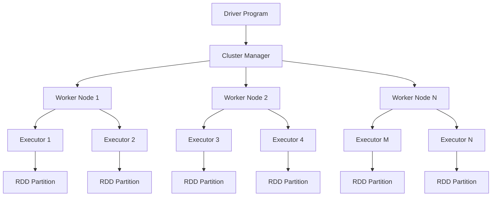
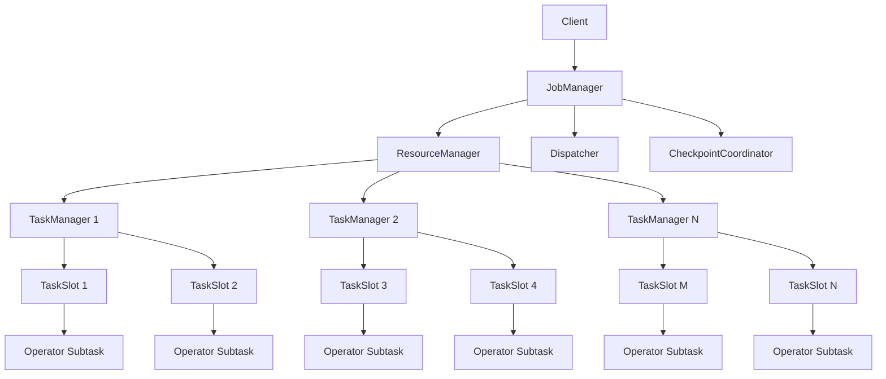
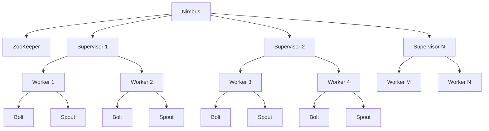
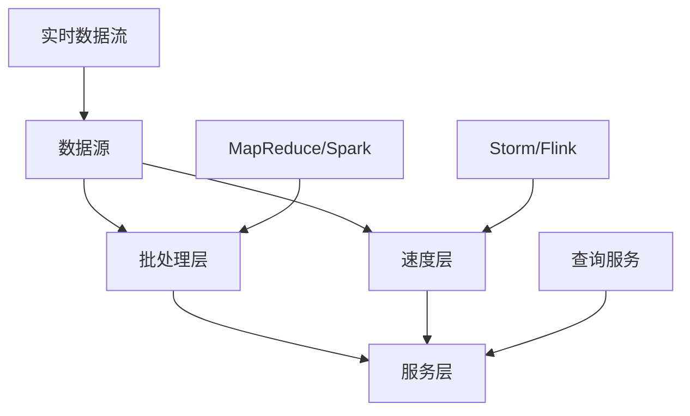
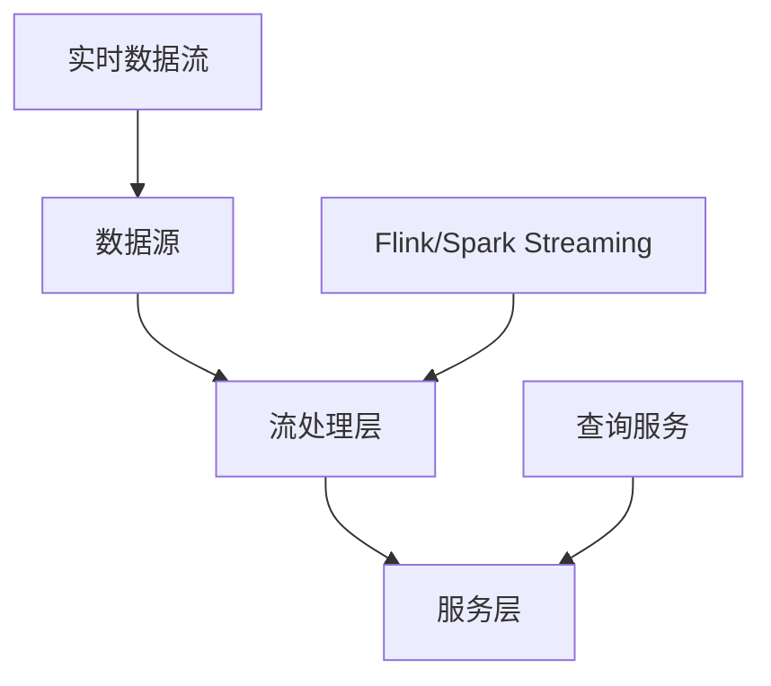

在企业级统一度量平台中，计算引擎是处理和分析海量数据的核心组件。随着业务需求的多样化，既需要处理历史数据的批处理计算，也需要实时处理数据流的流处理计算。本节将深入探讨主流计算引擎的特点、优势、适用场景以及选型策略，帮助架构师和工程师构建高效的数据处理体系。

## 计算引擎概述

### 1.1 计算引擎分类

计算引擎主要分为批处理和流处理两大类，每类都有其独特的特点和适用场景。

```yaml
计算引擎分类:
  批处理引擎:
    特点:
      - 处理静态数据集
      - 高吞吐量
      - 容错性强
      - 适合复杂计算
    适用场景:
      - 历史数据分析
      - 报表生成
      - 机器学习训练
  流处理引擎:
    特点:
      - 处理实时数据流
      - 低延迟
      - 事件驱动
      - 持续处理
    适用场景:
      - 实时监控告警
      - 实时推荐
      - 异常检测
```

### 1.2 计算模式对比

#### 1.2.1 批处理 vs 流处理

```yaml
批处理与流处理对比:
  数据处理方式:
    批处理:
      - 处理已存在的数据集
      - 一次性处理大量数据
      - 处理完成后输出结果
    流处理:
      - 处理连续不断的数据流
      - 实时处理每个数据记录
      - 持续输出处理结果
  
  延迟特性:
    批处理:
      - 高延迟（分钟到小时级）
      - 等待数据集完整
      - 适合离线分析
    流处理:
      - 低延迟（毫秒到秒级）
      - 实时处理数据
      - 适合实时应用
  
  吞吐量:
    批处理:
      - 高吞吐量
      - 优化磁盘I/O
      - 适合大数据处理
    流处理:
      - 中等吞吐量
      - 优化网络I/O
      - 适合持续数据处理
  
  容错机制:
    批处理:
      - 通过重试机制容错
      - 检查点和恢复机制
      - 数据一致性保证
    流处理:
      - 状态管理和检查点
      - 精确一次语义
      - 快速故障恢复
```

## 批处理引擎详解

### 2.1 Apache Spark

#### 2.1.1 Spark核心特性

```yaml
Spark特性:
  内存计算:
    - 数据缓存在内存中
    - 减少磁盘I/O操作
    - 提高计算速度
  统一平台:
    - 支持批处理、流处理、机器学习、图计算
    - 统一的API接口
    - 丰富的库支持
  容错机制:
    - RDD弹性分布式数据集
    - 血缘关系追踪
    - 自动恢复机制
  易用性:
    - 多语言API支持
    - 丰富的操作符
    - 交互式Shell支持
```

#### 2.1.2 Spark架构设计



#### 2.1.3 Spark应用场景

```python
# Spark批处理示例
from pyspark.sql import SparkSession
from pyspark.sql.functions import *

class BatchProcessingExample:
    def __init__(self):
        self.spark = SparkSession.builder \
            .appName("MetricsBatchProcessing") \
            .config("spark.sql.adaptive.enabled", "true") \
            .getOrCreate()
    
    def process_metrics_data(self, input_path, output_path):
        """处理指标数据"""
        # 读取原始数据
        raw_data = self.spark.read \
            .option("multiline", "true") \
            .json(input_path)
        
        # 数据清洗和转换
        cleaned_data = raw_data.filter(
            (col("timestamp").isNotNull()) &
            (col("metric_value").isNotNull()) &
            (col("metric_value") >= 0)
        )
        
        # 聚合计算
        aggregated_data = cleaned_data.groupBy(
            date_format(col("timestamp"), "yyyy-MM-dd").alias("date"),
            col("metric_name"),
            col("service_name")
        ).agg(
            avg("metric_value").alias("avg_value"),
            min("metric_value").alias("min_value"),
            max("metric_value").alias("max_value"),
            count("*").alias("count"),
            stddev("metric_value").alias("stddev_value")
        )
        
        # 添加计算时间戳
        result_data = aggregated_data.withColumn(
            "processed_at",
            current_timestamp()
        )
        
        # 保存结果
        result_data.write \
            .mode("overwrite") \
            .partitionBy("date") \
            .parquet(output_path)
        
        return result_data
    
    def generate_business_reports(self, metrics_path, report_path):
        """生成业务报表"""
        # 读取聚合数据
        metrics_data = self.spark.read.parquet(metrics_path)
        
        # 生成日报表
        daily_report = metrics_data.groupBy("date").agg(
            sum(when(col("metric_name") == "revenue", col("avg_value"))).alias("total_revenue"),
            sum(when(col("metric_name") == "orders", col("count"))).alias("total_orders"),
            avg(when(col("metric_name") == "conversion_rate", col("avg_value"))).alias("avg_conversion_rate")
        ).withColumn(
            "report_type",
            lit("daily")
        )
        
        # 保存报表
        daily_report.write \
            .mode("append") \
            .option("mergeSchema", "true") \
            .parquet(report_path)
```

### 2.2 其他批处理引擎

#### 2.2.1 Apache Hadoop MapReduce

```yaml
MapReduce特点:
  优势:
    - 成熟稳定
    - 生态完善
    - 适合超大数据集
  劣势:
    - 编程复杂
    - 延迟较高
    - 资源利用率低
  适用场景:
    - ETL处理
    - 日志分析
    - 数据预处理
```

#### 2.2.2 Apache Tez

```yaml
Tez特点:
  优势:
    - 性能优于MapReduce
    - DAG执行模型
    - 与Hadoop生态集成
  劣势:
    - 学习曲线陡峭
    - 社区相对较小
  适用场景:
    - 复杂数据处理
    - Hive优化
    - 数据管道
```

## 流处理引擎详解

### 3.1 Apache Flink

#### 3.1.1 Flink核心特性

```yaml
Flink特性:
  真正流处理:
    - 事件驱动处理
    - 低延迟处理
    - 支持事件时间处理
  精确一次语义:
    - 端到端精确一次保证
    - 状态一致性保证
    - 容错机制完善
  高吞吐低延迟:
    - 流批一体化处理
    - 内存管理和优化
    - 异步处理机制
  丰富API:
    - DataStream API
    - Table API
    - SQL支持
```

#### 3.1.2 Flink架构设计



#### 3.1.3 Flink应用场景

```java
// Flink流处理示例
public class RealTimeMetricsProcessing {
    public static void main(String[] args) throws Exception {
        StreamExecutionEnvironment env = StreamExecutionEnvironment.getExecutionEnvironment();
        
        // 配置检查点
        env.enableCheckpointing(5000);
        env.getCheckpointConfig().setCheckpointingMode(CheckpointingMode.EXACTLY_ONCE);
        env.getCheckpointConfig().setMinPauseBetweenCheckpoints(500);
        
        // 从Kafka读取数据
        Properties kafkaProps = new Properties();
        kafkaProps.setProperty("bootstrap.servers", "localhost:9092");
        kafkaProps.setProperty("group.id", "metrics-processor");
        
        FlinkKafkaConsumer<MetricEvent> kafkaConsumer = 
            new FlinkKafkaConsumer<>("metrics-topic", 
                                   new MetricEventSchema(), 
                                   kafkaProps);
        
        DataStream<MetricEvent> metricsStream = env
            .addSource(kafkaConsumer)
            .assignTimestampsAndWatermarks(
                WatermarkStrategy.<MetricEvent>forBoundedOutOfOrderness(
                    Duration.ofSeconds(5))
                .withTimestampAssigner((event, timestamp) -> event.getTimestamp())
            );
        
        // 实时聚合计算
        DataStream<MetricAggregate> aggregatedStream = metricsStream
            .keyBy(MetricEvent::getMetricName)
            .window(TumblingEventTimeWindows.of(Time.minutes(1)))
            .aggregate(new MetricAggregator(), new MetricWindowFunction());
        
        // 异常检测
        DataStream<AlertEvent> alertStream = metricsStream
            .keyBy(MetricEvent::getMetricName)
            .process(new AnomalyDetectionProcessFunction());
        
        // 实时推荐
        DataStream<Recommendation> recommendationStream = metricsStream
            .keyBy(event -> event.getUserId())
            .process(new RecommendationProcessFunction());
        
        // 输出结果
        aggregatedStream.addSink(new MetricsAggregationSink());
        alertStream.addSink(new AlertSink());
        recommendationStream.addSink(new RecommendationSink());
        
        env.execute("Real-time Metrics Processing");
    }
}

// 聚合函数实现
public class MetricAggregator implements AggregateFunction<MetricEvent, MetricAccumulator, MetricAggregate> {
    @Override
    public MetricAccumulator createAccumulator() {
        return new MetricAccumulator();
    }
    
    @Override
    public MetricAccumulator add(MetricEvent event, MetricAccumulator accumulator) {
        accumulator.count += 1;
        accumulator.sum += event.getValue();
        accumulator.min = Math.min(accumulator.min, event.getValue());
        accumulator.max = Math.max(accumulator.max, event.getValue());
        return accumulator;
    }
    
    @Override
    public MetricAggregate getResult(MetricAccumulator accumulator) {
        return new MetricAggregate(
            accumulator.count,
            accumulator.sum / accumulator.count,
            accumulator.min,
            accumulator.max
        );
    }
    
    @Override
    public MetricAccumulator merge(MetricAccumulator a, MetricAccumulator b) {
        MetricAccumulator merged = new MetricAccumulator();
        merged.count = a.count + b.count;
        merged.sum = a.sum + b.sum;
        merged.min = Math.min(a.min, b.min);
        merged.max = Math.max(a.max, b.max);
        return merged;
    }
}
```

### 3.2 Apache Storm

#### 3.2.1 Storm核心特性

```yaml
Storm特性:
  低延迟:
    - 毫秒级处理延迟
    - 实时数据处理
    - 事件驱动架构
  高可靠性:
    - 消息确认机制
    - 容错处理
    - 自动故障恢复
  可扩展性:
    - 水平扩展
    - 负载均衡
    - 资源动态分配
  灵活性:
    - 多语言支持
    - 自定义组件
    - 插件化架构
```

#### 3.2.2 Storm架构设计



#### 3.2.3 Storm应用场景

```java
// Storm拓扑示例
public class MetricsTopology {
    public static void main(String[] args) {
        TopologyBuilder builder = new TopologyBuilder();
        
        // 数据源Spout
        builder.setSpout("metrics-spout", new KafkaMetricsSpout(), 4);
        
        // 数据清洗Bolt
        builder.setBolt("clean-bolt", new DataCleanBolt(), 6)
               .shuffleGrouping("metrics-spout");
        
        // 聚合计算Bolt
        builder.setBolt("aggregate-bolt", new AggregationBolt(), 4)
               .fieldsGrouping("clean-bolt", new Fields("metric_name"));
        
        // 异常检测Bolt
        builder.setBolt("anomaly-bolt", new AnomalyDetectionBolt(), 3)
               .shuffleGrouping("aggregate-bolt");
        
        // 告警Bolt
        builder.setBolt("alert-bolt", new AlertBolt(), 2)
               .shuffleGrouping("anomaly-bolt");
        
        // 配置
        Config config = new Config();
        config.setDebug(false);
        config.setMaxTaskParallelism(20);
        
        // 提交拓扑
        StormSubmitter.submitTopology("metrics-topology", config, builder.createTopology());
    }
}
```

## 流批一体化处理

### 4.1 统一计算引擎

#### 4.1.1 Flink流批一体化

```java
public class UnifiedProcessingExample {
    public static void main(String[] args) throws Exception {
        StreamExecutionEnvironment env = StreamExecutionEnvironment.getExecutionEnvironment();
        
        // 流处理模式
        if (args.length > 0 && "streaming".equals(args[0])) {
            // 实时数据处理
            DataStream<MetricEvent> stream = env
                .addSource(new KafkaSource<MetricEvent>())
                .filter(event -> event.getValue() > 0);
            
            processStream(stream);
        } else {
            // 批处理模式
            DataStream<MetricEvent> batch = env
                .readTextFile("hdfs://input/metrics/")
                .map(line -> parseMetricEvent(line));
            
            processStream(batch);
        }
        
        env.execute("Unified Processing Job");
    }
    
    private static void processStream(DataStream<MetricEvent> stream) {
        // 统一的处理逻辑
        stream.keyBy(MetricEvent::getMetricName)
              .window(TumblingProcessingTimeWindows.of(Time.hours(1)))
              .aggregate(new UnifiedAggregator())
              .addSink(new UnifiedSink());
    }
}
```

#### 4.1.2 Spark Structured Streaming

```python
# Spark Structured Streaming示例
from pyspark.sql import SparkSession
from pyspark.sql.functions import *
from pyspark.sql.types import *

class StructuredStreamingExample:
    def __init__(self):
        self.spark = SparkSession.builder \
            .appName("StructuredStreamingExample") \
            .getOrCreate()
    
    def process_streaming_data(self):
        """处理流数据"""
        # 定义数据模式
        schema = StructType([
            StructField("timestamp", TimestampType(), True),
            StructField("metric_name", StringType(), True),
            StructField("value", DoubleType(), True),
            StructField("tags", MapType(StringType(), StringType()), True)
        ])
        
        # 读取流数据
        streaming_df = self.spark \
            .readStream \
            .format("kafka") \
            .option("kafka.bootstrap.servers", "localhost:9092") \
            .option("subscribe", "metrics-topic") \
            .load() \
            .select(
                from_json(col("value").cast("string"), schema).alias("data")
            ) \
            .select("data.*")
        
        # 流式聚合
        aggregated_df = streaming_df \
            .groupBy(
                window(col("timestamp"), "1 hour"),
                col("metric_name")
            ) \
            .agg(
                avg("value").alias("avg_value"),
                min("value").alias("min_value"),
                max("value").alias("max_value"),
                count("*").alias("count")
            )
        
        # 输出到控制台
        query = aggregated_df \
            .writeStream \
            .outputMode("update") \
            .format("console") \
            .trigger(processingTime='10 seconds') \
            .start()
        
        query.awaitTermination()
```

## 计算引擎选型指南

### 5.1 选型考虑因素

#### 5.1.1 业务需求分析

```yaml
业务需求分析:
  实时性要求:
    - 毫秒级: Flink, Storm
    - 秒级: Flink, Spark Streaming
    - 分钟级: Spark批处理
    - 小时级: MapReduce
  数据量规模:
    - 小规模(<10GB): 任何引擎
    - 中等规模(10GB-1TB): Spark, Flink
    - 大规模(>1TB): Spark, MapReduce
    - 超大规模(>10TB): MapReduce, Tez
  复杂度要求:
    - 简单聚合: Flink, Storm
    - 复杂分析: Spark
    - 机器学习: Spark MLlib
    - 图计算: Spark GraphX
```

#### 5.1.2 技术能力评估

```yaml
技术能力评估:
  团队技能:
    - Java/Scala熟练: Flink, Spark
    - Python熟练: Spark
    - 多语言支持: Storm
  生态集成:
    - Hadoop生态: Spark, MapReduce, Tez
    - 云原生: Flink, Spark
    - Kafka集成: Flink, Spark Streaming
  运维能力:
    - 复杂运维: Flink, Storm
    - 简单运维: Spark批处理
    - 托管服务: 云服务商Flink/Spark
```

### 5.2 性能对比测试

#### 5.2.1 基准测试框架

```python
class ComputeEngineBenchmark:
    def __init__(self):
        self.engines = {
            'spark': SparkEngine(),
            'flink': FlinkEngine(),
            'storm': StormEngine()
        }
    
    def benchmark_throughput(self, data_size=1000000):
        """吞吐量测试"""
        results = {}
        
        for engine_name, engine in self.engines.items():
            start_time = time.time()
            
            # 处理测试数据
            processed_count = engine.process_data(data_size)
            
            end_time = time.time()
            duration = end_time - start_time
            
            results[engine_name] = {
                'throughput': processed_count / duration,
                'latency': duration / processed_count * 1000,  # 毫秒
                'resource_usage': engine.get_resource_usage()
            }
        
        return results
    
    def benchmark_fault_tolerance(self):
        """容错能力测试"""
        fault_results = {}
        
        for engine_name, engine in self.engines.items():
            # 模拟故障
            fault_injection_time = time.time()
            engine.inject_fault()
            
            # 测量恢复时间
            recovery_time = engine.measure_recovery_time()
            
            fault_results[engine_name] = {
                'recovery_time': recovery_time,
                'data_loss': engine.measure_data_loss(),
                'consistency': engine.check_consistency()
            }
        
        return fault_results
```

## 混合计算架构设计

### 6.1 架构模式

#### 6.1.1 Lambda架构



#### 6.1.2 Kappa架构



### 6.2 实现示例

```python
class HybridComputeArchitecture:
    def __init__(self):
        self.batch_engine = SparkEngine()
        self.stream_engine = FlinkEngine()
        self.storage = HybridStorage()
    
    def process_data(self, data_type, data):
        """根据数据类型选择处理引擎"""
        if data_type == 'batch':
            return self._process_batch(data)
        elif data_type == 'stream':
            return self._process_stream(data)
        elif data_type == 'hybrid':
            return self._process_hybrid(data)
    
    def _process_batch(self, data):
        """批处理"""
        # 数据预处理
        preprocessed_data = self.batch_engine.preprocess(data)
        
        # 批处理计算
        result = self.batch_engine.compute(preprocessed_data)
        
        # 结果存储
        self.storage.save_batch_result(result)
        
        return result
    
    def _process_stream(self, data_stream):
        """流处理"""
        # 实时处理
        stream_result = self.stream_engine.process_stream(data_stream)
        
        # 实时存储
        self.storage.save_stream_result(stream_result)
        
        return stream_result
    
    def _process_hybrid(self, data):
        """混合处理"""
        # 实时处理新数据
        real_time_result = self._process_stream(data['stream'])
        
        # 定期批处理历史数据
        if self._should_run_batch():
            batch_result = self._process_batch(data['batch'])
            # 合并结果
            merged_result = self._merge_results(real_time_result, batch_result)
            return merged_result
        
        return real_time_result
```

## 实施案例

### 7.1 案例1：某电商平台的计算引擎实践

该平台采用了以下计算引擎策略：

1. **实时处理**：
   - 使用Flink处理用户行为数据流
   - 实现实时推荐和个性化展示
   - 支持实时监控和告警

2. **批处理分析**：
   - 使用Spark处理历史订单数据
   - 生成业务报表和分析报告
   - 支持机器学习模型训练

3. **混合架构**：
   - 采用Lambda架构设计
   - 批处理层处理历史数据
   - 速度层处理实时数据
   - 服务层提供统一查询接口

### 7.2 案例2：某金融机构的计算引擎应用

该机构根据金融行业的特殊要求，采用了以下计算策略：

1. **高可靠性处理**：
   - 使用Flink确保精确一次语义
   - 实施完善的状态管理和容错机制
   - 满足金融行业的合规要求

2. **复杂分析**：
   - 使用Spark进行风险建模
   - 实施机器学习算法
   - 支持复杂的金融计算

3. **实时风控**：
   - 使用Storm处理交易数据流
   - 实现实时欺诈检测
   - 支持毫秒级风险响应

## 实施建议

### 8.1 选型原则

1. **业务驱动**：根据业务需求选择合适的计算引擎
2. **技术匹配**：考虑团队技术栈和能力
3. **成本效益**：平衡功能需求和成本投入
4. **可扩展性**：考虑未来的扩展需求

### 8.2 架构设计

1. **分层设计**：采用分层计算架构
2. **混合部署**：结合多种计算引擎
3. **统一接口**：提供统一的数据处理接口
4. **监控告警**：建立完善的监控体系

### 8.3 最佳实践

1. **性能测试**：在选型前进行充分的性能测试
2. **容错设计**：实施完善的容错和恢复机制
3. **资源优化**：合理配置计算资源
4. **版本管理**：对计算逻辑进行版本管理

## 总结

计算引擎是企业级统一度量平台的核心组件。批处理引擎如Spark适合处理大规模历史数据，流处理引擎如Flink适合实时数据处理。在实际应用中，往往需要结合多种计算引擎，构建混合计算架构，以满足不同场景的需求。

通过合理的计算引擎选型和架构设计，可以显著提高数据处理性能，降低计算成本，确保处理的可靠性和准确性。在实施过程中，需要根据具体的业务需求、技术环境和资源约束，制定合适的计算策略和技术方案。

在下一节中，我们将探讨数据质量管理与治理的重要性，以及如何实施有效的数据质量控制措施。