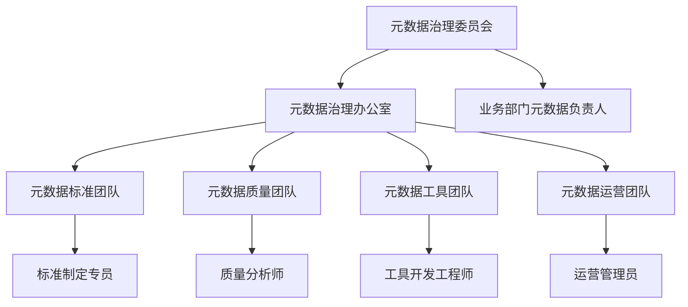
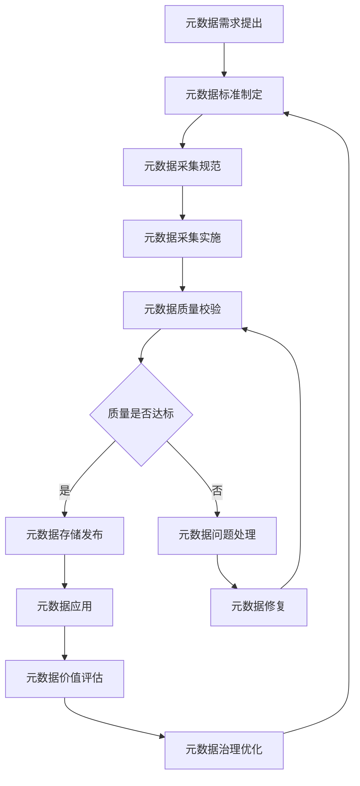

在企业级统一度量平台中，元数据管理是确保数据可理解性、可追溯性和可管理性的核心基础设施。元数据作为"关于数据的数据"，提供了数据的上下文信息，帮助用户理解数据的含义、来源、用途和变化过程。本节将深入探讨元数据管理的三个关键方面：数据血缘、指标口径管理和生命周期管理，为构建高质量的数据管理体系提供指导。

## 元数据管理概述

### 1.1 元数据的定义与分类

元数据是描述数据的数据，它提供了数据的背景信息、结构信息、质量信息和使用信息等。在企业级数据管理中，元数据发挥着至关重要的作用。

```yaml
元数据分类:
  技术元数据:
    - 数据结构: 表结构、字段定义、数据类型
    - 存储信息: 存储位置、文件格式、压缩方式
    - 处理信息: ETL脚本、计算逻辑、调度信息
  业务元数据:
    - 业务含义: 指标定义、业务规则、计算公式
    - 业务关系: 数据间的关系、业务流程
    - 业务价值: 数据用途、重要性评级
  操作元数据:
    - 数据血缘: 数据来源、处理过程、流向
    - 数据质量: 质量评分、校验结果、异常记录
    - 访问日志: 访问时间、访问用户、访问方式
  管理元数据:
    - 数据所有者: 责任人、联系信息
    - 数据标准: 命名规范、质量标准
    - 生命周期: 创建时间、更新时间、过期时间
```

### 1.2 元数据管理的价值

#### 1.2.1 业务价值

```yaml
业务价值:
  数据理解:
    - 帮助用户理解数据含义
    - 提供数据使用指导
    - 减少数据误解和误用
  决策支持:
    - 提供数据可信度信息
    - 支持数据驱动决策
    - 增强决策信心
  合规保障:
    - 支持数据审计和追溯
    - 满足监管合规要求
    - 降低合规风险
```

#### 1.2.2 技术价值

```yaml
技术价值:
  系统维护:
    - 简化系统维护工作
    - 提高问题排查效率
    - 降低维护成本
  数据治理:
    - 支持数据质量管理
    - 实现数据血缘追踪
    - 促进数据标准化
```

## 数据血缘管理

### 2.1 数据血缘的定义

数据血缘（Data Lineage）是指数据从产生到消费的完整生命周期过程中，数据的来源、转换、流向和使用关系。它帮助用户理解数据是如何产生的，经过了哪些处理步骤，最终被如何使用。

```yaml
数据血缘要素:
  血缘节点:
    - 数据源: 原始数据的来源
    - 处理节点: 数据处理和转换过程
    - 数据目标: 最终的数据存储和使用
  血缘关系:
    - 派生关系: 数据从源派生到目标
    - 转换关系: 数据经过的转换过程
    - 依赖关系: 数据间的依赖关系
  血缘属性:
    - 时间戳: 血缘关系的创建和更新时间
    - 责任人: 血缘关系的维护责任人
    - 质量信息: 相关数据的质量状况
```

### 2.2 数据血缘实现

#### 2.2.1 血缘信息采集

```java
@Component
public class DataLineageCollector {
    
    @Autowired
    private LineageRepository lineageRepository;
    
    @Autowired
    private MetadataService metadataService;
    
    public void collectLineage(DataProcessingEvent event) {
        // 创建血缘关系
        LineageRelation relation = new LineageRelation();
        relation.setSourceEntityId(event.getSourceEntityId());
        relation.setTargetEntityId(event.getTargetEntityId());
        relation.setTransformationType(event.getTransformationType());
        relation.setTransformationLogic(event.getTransformationLogic());
        relation.setJobId(event.getJobId());
        relation.setExecutionTime(event.getExecutionTime());
        
        // 丰富血缘信息
        enrichLineageInfo(relation, event);
        
        // 保存血缘关系
        lineageRepository.save(relation);
        
        // 更新实体的血缘信息
        updateEntityLineage(event.getTargetEntityId(), relation);
    }
    
    private void enrichLineageInfo(LineageRelation relation, DataProcessingEvent event) {
        // 获取源实体信息
        MetadataEntity sourceEntity = metadataService.getEntity(relation.getSourceEntityId());
        if (sourceEntity != null) {
            relation.setSourceEntityName(sourceEntity.getName());
            relation.setSourceEntityType(sourceEntity.getEntityType());
        }
        
        // 获取目标实体信息
        MetadataEntity targetEntity = metadataService.getEntity(relation.getTargetEntityId());
        if (targetEntity != null) {
            relation.setTargetEntityName(targetEntity.getName());
            relation.setTargetEntityType(targetEntity.getEntityType());
        }
        
        // 添加执行环境信息
        relation.setExecutionEnvironment(event.getExecutionEnvironment());
        relation.setExecutionUser(event.getExecutionUser());
        
        // 计算血缘深度
        relation.setLineageDepth(calculateLineageDepth(relation.getSourceEntityId()));
    }
    
    private int calculateLineageDepth(String entityId) {
        // 递归计算血缘深度
        List<LineageRelation> upstreamRelations = lineageRepository.getUpstreamRelations(entityId);
        if (upstreamRelations.isEmpty()) {
            return 1;
        }
        
        int maxDepth = 0;
        for (LineageRelation relation : upstreamRelations) {
            int depth = calculateLineageDepth(relation.getSourceEntityId());
            maxDepth = Math.max(maxDepth, depth);
        }
        
        return maxDepth + 1;
    }
}
```

#### 2.2.2 血缘关系存储

```sql
-- 数据血缘关系表设计
CREATE TABLE data_lineage (
    id VARCHAR(64) PRIMARY KEY,
    source_entity_id VARCHAR(64) NOT NULL,
    source_entity_name VARCHAR(255),
    source_entity_type VARCHAR(50),
    target_entity_id VARCHAR(64) NOT NULL,
    target_entity_name VARCHAR(255),
    target_entity_type VARCHAR(50),
    transformation_type VARCHAR(50),
    transformation_logic TEXT,
    job_id VARCHAR(64),
    execution_time TIMESTAMP,
    execution_environment VARCHAR(100),
    execution_user VARCHAR(100),
    lineage_depth INTEGER,
    created_time TIMESTAMP DEFAULT CURRENT_TIMESTAMP,
    updated_time TIMESTAMP DEFAULT CURRENT_TIMESTAMP ON UPDATE CURRENT_TIMESTAMP,
    
    INDEX idx_source_entity (source_entity_id),
    INDEX idx_target_entity (target_entity_id),
    INDEX idx_job_id (job_id),
    INDEX idx_execution_time (execution_time)
);

-- 血缘关系查询示例
-- 查询某个实体的上游血缘
WITH RECURSIVE upstream_lineage AS (
    SELECT 
        id,
        source_entity_id,
        source_entity_name,
        target_entity_id,
        target_entity_name,
        transformation_type,
        lineage_depth,
        0 as level
    FROM data_lineage 
    WHERE target_entity_id = 'target_entity_001'
    
    UNION ALL
    
    SELECT 
        dl.id,
        dl.source_entity_id,
        dl.source_entity_name,
        dl.target_entity_id,
        dl.target_entity_name,
        dl.transformation_type,
        dl.lineage_depth,
        ul.level + 1
    FROM data_lineage dl
    INNER JOIN upstream_lineage ul ON dl.target_entity_id = ul.source_entity_id
    WHERE ul.level < 10  -- 限制递归深度
)
SELECT * FROM upstream_lineage ORDER BY level, lineage_depth;
```

#### 2.2.3 血缘可视化

```python
class LineageVisualizer:
    def __init__(self, lineage_service):
        self.lineage_service = lineage_service
    
    def visualize_lineage(self, entity_id, depth=3):
        """可视化数据血缘"""
        # 获取血缘数据
        lineage_graph = self.lineage_service.get_lineage_graph(entity_id, depth)
        
        # 构建可视化数据
        nodes = []
        edges = []
        
        for node in lineage_graph.nodes:
            nodes.append({
                'id': node.entity_id,
                'label': node.entity_name,
                'type': node.entity_type,
                'properties': {
                    'created_time': node.created_time,
                    'owner': node.owner,
                    'size': node.data_size
                }
            })
        
        for edge in lineage_graph.edges:
            edges.append({
                'from': edge.source_entity_id,
                'to': edge.target_entity_id,
                'label': edge.transformation_type,
                'properties': {
                    'job_id': edge.job_id,
                    'execution_time': edge.execution_time,
                    'logic': edge.transformation_logic
                }
            })
        
        # 生成可视化配置
        visualization_config = {
            'nodes': nodes,
            'edges': edges,
            'layout': 'hierarchical',
            'physics': {
                'enabled': True,
                'repulsion': {
                    'nodeDistance': 200
                }
            }
        }
        
        return visualization_config
    
    def generate_lineage_report(self, entity_id, depth=3):
        """生成血缘报告"""
        lineage_graph = self.lineage_service.get_lineage_graph(entity_id, depth)
        
        report = {
            'entity_id': entity_id,
            'report_time': datetime.now().isoformat(),
            'upstream_count': len([n for n in lineage_graph.nodes if n.lineage_depth < 0]),
            'downstream_count': len([n for n in lineage_graph.nodes if n.lineage_depth > 0]),
            'total_entities': len(lineage_graph.nodes),
            'critical_path': self._find_critical_path(lineage_graph),
            'data_quality_summary': self._summarize_data_quality(lineage_graph)
        }
        
        return report
    
    def _find_critical_path(self, lineage_graph):
        """查找关键路径"""
        # 实现关键路径算法
        pass
    
    def _summarize_data_quality(self, lineage_graph):
        """汇总数据质量"""
        # 实现数据质量汇总
        pass
```

## 指标口径管理

### 3.1 指标口径的定义

指标口径是指对业务指标的明确定义、计算方法、统计范围和使用规范。统一的指标口径管理能够确保不同部门、不同系统对同一指标的理解和使用保持一致。

```yaml
指标口径要素:
  基本信息:
    - 指标名称: 唯一标识指标的名称
    - 指标描述: 对指标含义的详细说明
    - 指标类型: 指标的分类（如计数、比率、金额等）
    - 计量单位: 指标的计量单位（如次、%、元等）
  计算逻辑:
    - 计算公式: 指标的计算方法和公式
    - 数据来源: 指标数据的来源系统
    - 计算频率: 指标的计算和更新频率
    - 聚合方式: 数据聚合的方法（如求和、平均等）
  统计范围:
    - 时间范围: 指标统计的时间范围
    - 业务范围: 指标统计的业务范围
    - 过滤条件: 指标统计的过滤条件
  使用规范:
    - 适用场景: 指标的主要使用场景
    - 限制条件: 指标使用的限制条件
    - 注意事项: 使用指标时的注意事项
```

### 3.2 指标口径管理实现

#### 3.2.1 指标定义管理

```go
type MetricDefinition struct {
    ID          string            `json:"id"`
    Name        string            `json:"name"`
    Description string            `json:"description"`
    Category    string            `json:"category"`
    Type        string            `json:"type"`
    Unit        string            `json:"unit"`
    DataSource  DataSourceConfig  `json:"data_source"`
    Calculation CalculationConfig `json:"calculation"`
    Scope       ScopeConfig       `json:"scope"`
    Usage       UsageConfig       `json:"usage"`
    Owner       string            `json:"owner"`
    Version     string            `json:"version"`
    Status      string            `json:"status"`
    CreatedAt   time.Time         `json:"created_at"`
    UpdatedAt   time.Time         `json:"updated_at"`
}

type CalculationConfig struct {
    Expression   string            `json:"expression"`
    Aggregation  string            `json:"aggregation"`
    TimeWindow   string            `json:"time_window"`
    Dependencies []string          `json:"dependencies"`
    Parameters   map[string]string `json:"parameters"`
}

type MetricDefinitionService struct {
    repository MetricDefinitionRepository
    validator  MetricDefinitionValidator
}

func (s *MetricDefinitionService) CreateMetricDefinition(definition *MetricDefinition) error {
    // 验证指标定义
    if err := s.validator.Validate(definition); err != nil {
        return err
    }
    
    // 设置默认值
    definition.ID = generateMetricID()
    definition.Version = "1.0"
    definition.Status = "DRAFT"
    definition.CreatedAt = time.Now()
    definition.UpdatedAt = time.Now()
    
    // 保存指标定义
    return s.repository.Save(definition)
}

func (s *MetricDefinitionService) UpdateMetricDefinition(id string, definition *MetricDefinition) error {
    // 获取现有定义
    existing, err := s.repository.GetByID(id)
    if err != nil {
        return err
    }
    
    // 验证变更
    if err := s.validator.ValidateChange(existing, definition); err != nil {
        return err
    }
    
    // 更新版本
    definition.Version = s.generateNextVersion(existing.Version)
    definition.Status = "DRAFT"
    definition.UpdatedAt = time.Now()
    
    // 保存更新
    return s.repository.Update(id, definition)
}

func (s *MetricDefinitionService) PublishMetricDefinition(id string) error {
    definition, err := s.repository.GetByID(id)
    if err != nil {
        return err
    }
    
    // 检查发布条件
    if err := s.validator.ValidateForPublish(definition); err != nil {
        return err
    }
    
    // 更新状态
    definition.Status = "PUBLISHED"
    definition.UpdatedAt = time.Now()
    
    return s.repository.Update(id, definition)
}
```

#### 3.2.2 指标血缘管理

```python
class MetricLineageManager:
    def __init__(self, metric_service, lineage_service):
        self.metric_service = metric_service
        self.lineage_service = lineage_service
    
    def build_metric_lineage(self, metric_id):
        """构建指标血缘"""
        # 获取指标定义
        metric = self.metric_service.get_metric(metric_id)
        
        # 解析依赖关系
        dependencies = self._parse_dependencies(metric.calculation.expression)
        
        # 建立血缘关系
        for dependency_id in dependencies:
            self.lineage_service.create_relation(
                source_entity_id=dependency_id,
                target_entity_id=metric_id,
                transformation_type="METRIC_DERIVATION",
                transformation_logic=metric.calculation.expression
            )
        
        # 更新指标的血缘信息
        self.metric_service.update_lineage_info(metric_id, {
            'dependencies': dependencies,
            'lineage_depth': self._calculate_lineage_depth(dependencies)
        })
    
    def _parse_dependencies(self, expression):
        """解析表达式中的依赖指标"""
        # 实现表达式解析逻辑
        # 例如：解析 "metric_a + metric_b * 0.8" 中的 metric_a 和 metric_b
        dependencies = []
        
        # 简化的解析示例
        import re
        pattern = r'metric_[a-zA-Z0-9_]+'
        matches = re.findall(pattern, expression)
        dependencies = list(set(matches))  # 去重
        
        return dependencies
    
    def _calculate_lineage_depth(self, dependencies):
        """计算血缘深度"""
        if not dependencies:
            return 1
        
        max_depth = 0
        for dep_id in dependencies:
            dep_metric = self.metric_service.get_metric(dep_id)
            if dep_metric and hasattr(dep_metric, 'lineage_depth'):
                max_depth = max(max_depth, dep_metric.lineage_depth)
        
        return max_depth + 1
    
    def get_metric_impact_analysis(self, metric_id):
        """获取指标影响分析"""
        # 获取下游依赖指标
        downstream_metrics = self.lineage_service.get_downstream_entities(metric_id)
        
        # 分析影响范围
        impact_analysis = {
            'direct_impact': [],
            'indirect_impact': [],
            'impact_count': len(downstream_metrics)
        }
        
        for metric in downstream_metrics:
            if metric.transformation_type == "METRIC_DERIVATION":
                impact_analysis['direct_impact'].append({
                    'metric_id': metric.target_entity_id,
                    'metric_name': metric.target_entity_name,
                    'impact_type': 'DIRECT'
                })
            else:
                impact_analysis['indirect_impact'].append({
                    'metric_id': metric.target_entity_id,
                    'metric_name': metric.target_entity_name,
                    'impact_type': 'INDIRECT'
                })
        
        return impact_analysis
```

## 生命周期管理

### 4.1 数据生命周期定义

数据生命周期是指数据从创建、使用、维护到最终销毁的完整过程。有效的生命周期管理能够确保数据在适当的时机得到适当的处理，既保证数据的可用性，又控制存储成本。

```yaml
数据生命周期阶段:
  创建阶段:
    - 数据产生: 数据的初始创建
    - 元数据登记: 数据的元数据登记
    - 质量校验: 数据质量初步校验
  活跃阶段:
    - 日常使用: 数据的常规使用
    - 定期维护: 数据的定期维护和更新
    - 质量监控: 数据质量持续监控
  归档阶段:
    - 使用频率降低: 数据使用频率显著下降
    - 存储迁移: 数据迁移到低成本存储
    - 访问限制: 对数据访问进行限制
  销毁阶段:
    - 过期判断: 判断数据是否达到销毁条件
    - 安全销毁: 安全地销毁数据
    - 记录审计: 记录销毁过程和原因
```

### 4.2 生命周期管理实现

#### 4.2.1 生命周期策略定义

```java
@Entity
@Table(name = "lifecycle_policies")
public class LifecyclePolicy {
    @Id
    private String id;
    
    private String policyName;
    private String description;
    private String entityType;  // 数据实体类型
    
    @Embedded
    private ActivePhaseConfig activePhase;
    
    @Embedded
    private ArchivePhaseConfig archivePhase;
    
    @Embedded
    private DestroyPhaseConfig destroyPhase;
    
    private boolean enabled;
    private String createdBy;
    private LocalDateTime createdAt;
    private LocalDateTime updatedAt;
    
    // getter和setter方法
}

@Embeddable
public class ActivePhaseConfig {
    private Integer retentionDays;  // 活跃期保留天数
    private String qualityCheckSchedule;  // 质量检查调度
    private List<String> allowedOperations;  // 允许的操作
}

@Embeddable
public class ArchivePhaseConfig {
    private Integer archiveAfterDays;  // 多少天后归档
    private String archiveStorageClass;  // 归档存储类型
    private String accessControl;  // 访问控制策略
}

@Embeddable
public class DestroyPhaseConfig {
    private Integer destroyAfterDays;  // 多少天后销毁
    private String destroyMethod;  // 销毁方法
    private boolean auditRequired;  // 是否需要审计
}
```

#### 4.2.2 生命周期执行引擎

```python
class LifecycleManager:
    def __init__(self, policy_service, storage_service, audit_service):
        self.policy_service = policy_service
        self.storage_service = storage_service
        self.audit_service = audit_service
        self.scheduler = BackgroundScheduler()
    
    def start_lifecycle_management(self):
        """启动生命周期管理"""
        # 注册定时任务
        self.scheduler.add_job(
            self._check_active_phase,
            'interval',
            hours=1,
            id='active_phase_check'
        )
        
        self.scheduler.add_job(
            self._check_archive_phase,
            'interval',
            hours=6,
            id='archive_phase_check'
        )
        
        self.scheduler.add_job(
            self._check_destroy_phase,
            'interval',
            days=1,
            id='destroy_phase_check'
        )
        
        self.scheduler.start()
    
    def _check_active_phase(self):
        """检查活跃期数据"""
        # 获取所有活跃期策略
        policies = self.policy_service.get_active_policies('ACTIVE')
        
        for policy in policies:
            # 获取符合策略的数据实体
            entities = self._get_entities_by_policy(policy, 'ACTIVE')
            
            for entity in entities:
                # 执行活跃期检查
                self._execute_active_checks(entity, policy)
    
    def _check_archive_phase(self):
        """检查归档期数据"""
        policies = self.policy_service.get_active_policies('ARCHIVE')
        
        for policy in policies:
            entities = self._get_entities_by_policy(policy, 'ARCHIVE')
            
            for entity in entities:
                # 检查是否需要归档
                if self._should_archive(entity, policy):
                    self._archive_entity(entity, policy)
    
    def _check_destroy_phase(self):
        """检查销毁期数据"""
        policies = self.policy_service.get_active_policies('DESTROY')
        
        for policy in policies:
            entities = self._get_entities_by_policy(policy, 'DESTROY')
            
            for entity in entities:
                # 检查是否需要销毁
                if self._should_destroy(entity, policy):
                    self._destroy_entity(entity, policy)
    
    def _should_archive(self, entity, policy):
        """判断是否应该归档"""
        # 检查最后访问时间
        last_access_time = entity.get_last_access_time()
        if not last_access_time:
            return False
        
        # 计算闲置时间
        idle_time = datetime.now() - last_access_time
        archive_threshold = timedelta(days=policy.archive_phase.archive_after_days)
        
        return idle_time > archive_threshold
    
    def _archive_entity(self, entity, policy):
        """归档数据实体"""
        try:
            # 记录归档开始
            self.audit_service.log_event(
                event_type='LIFECYCLE_ARCHIVE_START',
                entity_id=entity.id,
                details={
                    'policy_id': policy.id,
                    'storage_class': policy.archive_phase.archive_storage_class
                }
            )
            
            # 执行归档操作
            self.storage_service.archive_entity(
                entity.id,
                policy.archive_phase.archive_storage_class
            )
            
            # 更新实体状态
            entity.update_lifecycle_phase('ARCHIVED')
            entity.save()
            
            # 记录归档完成
            self.audit_service.log_event(
                event_type='LIFECYCLE_ARCHIVE_COMPLETE',
                entity_id=entity.id,
                details={
                    'policy_id': policy.id,
                    'storage_class': policy.archive_phase.archive_storage_class
                }
            )
            
        except Exception as e:
            # 记录归档失败
            self.audit_service.log_event(
                event_type='LIFECYCLE_ARCHIVE_FAILED',
                entity_id=entity.id,
                details={
                    'policy_id': policy.id,
                    'error': str(e)
                }
            )
            raise
    
    def _should_destroy(self, entity, policy):
        """判断是否应该销毁"""
        # 检查创建时间
        create_time = entity.created_at
        if not create_time:
            return False
        
        # 计算数据年龄
        data_age = datetime.now() - create_time
        destroy_threshold = timedelta(days=policy.destroy_phase.destroy_after_days)
        
        # 检查是否满足销毁条件
        return data_age > destroy_threshold and self._check_destroy_conditions(entity, policy)
    
    def _destroy_entity(self, entity, policy):
        """销毁数据实体"""
        try:
            # 记录销毁开始
            self.audit_service.log_event(
                event_type='LIFECYCLE_DESTROY_START',
                entity_id=entity.id,
                details={
                    'policy_id': policy.id,
                    'destroy_method': policy.destroy_phase.destroy_method
                }
            )
            
            # 执行销毁操作
            if policy.destroy_phase.destroy_method == 'SECURE_DELETE':
                self.storage_service.secure_delete_entity(entity.id)
            else:
                self.storage_service.delete_entity(entity.id)
            
            # 更新实体状态
            entity.update_lifecycle_phase('DESTROYED')
            entity.save()
            
            # 记录销毁完成
            self.audit_service.log_event(
                event_type='LIFECYCLE_DESTROY_COMPLETE',
                entity_id=entity.id,
                details={
                    'policy_id': policy.id,
                    'destroy_method': policy.destroy_phase.destroy_method
                }
            )
            
        except Exception as e:
            # 记录销毁失败
            self.audit_service.log_event(
                event_type='LIFECYCLE_DESTROY_FAILED',
                entity_id=entity.id,
                details={
                    'policy_id': policy.id,
                    'error': str(e)
                }
            )
            raise
```

#### 4.2.3 生命周期监控和告警

```go
type LifecycleMonitor struct {
    policyService     PolicyService
    entityService     EntityService
    alertService      AlertService
    metricsCollector  MetricsCollector
}

func (m *LifecycleMonitor) StartMonitoring() {
    // 启动定期监控
    ticker := time.NewTicker(1 * time.Hour)
    go func() {
        for range ticker.C {
            m.performLifecycleCheck()
        }
    }()
}

func (m *LifecycleMonitor) performLifecycleCheck() {
    // 检查各阶段的数据状态
    m.checkActivePhaseEntities()
    m.checkArchivePhaseEntities()
    m.checkDestroyPhaseEntities()
    
    // 收集生命周期指标
    m.collectLifecycleMetrics()
}

func (m *LifecycleMonitor) checkActivePhaseEntities() {
    // 获取活跃期实体
    entities, err := m.entityService.GetEntitiesByPhase("ACTIVE")
    if err != nil {
        log.Error("获取活跃期实体失败: %v", err)
        return
    }
    
    for _, entity := range entities {
        // 检查数据质量
        qualityScore := m.metricsCollector.GetDataQualityScore(entity.ID)
        if qualityScore < 80 {
            m.alertService.SendAlert(&Alert{
                Type:     "LOW_DATA_QUALITY",
                Severity: "MEDIUM",
                Message:  fmt.Sprintf("实体 %s 数据质量低于阈值: %.2f", entity.Name, qualityScore),
                Details: map[string]interface{}{
                    "entity_id": entity.ID,
                    "quality_score": qualityScore,
                },
            })
        }
        
        // 检查更新频率
        if m.isUpdateOverdue(entity) {
            m.alertService.SendAlert(&Alert{
                Type:     "DATA_UPDATE_OVERDUE",
                Severity: "HIGH",
                Message:  fmt.Sprintf("实体 %s 数据更新超期", entity.Name),
                Details: map[string]interface{}{
                    "entity_id": entity.ID,
                    "last_update": entity.LastUpdateTime,
                },
            })
        }
    }
}

func (m *LifecycleMonitor) collectLifecycleMetrics() {
    // 收集各阶段实体数量
    activeCount, _ := m.entityService.CountEntitiesByPhase("ACTIVE")
    archiveCount, _ := m.entityService.CountEntitiesByPhase("ARCHIVED")
    destroyCount, _ := m.entityService.CountEntitiesByPhase("DESTROYED")
    
    // 记录指标
    m.metricsCollector.RecordGauge("lifecycle.active_entities", float64(activeCount))
    m.metricsCollector.RecordGauge("lifecycle.archived_entities", float64(archiveCount))
    m.metricsCollector.RecordGauge("lifecycle.destroyed_entities", float64(destroyCount))
    
    // 记录生命周期转换事件
    recentTransitions, _ := m.entityService.GetRecentLifecycleTransitions(24 * time.Hour)
    m.metricsCollector.RecordCounter("lifecycle.transitions", float64(len(recentTransitions)))
}
```

## 元数据治理框架

### 5.1 治理组织架构



### 5.2 治理流程



## 实施案例

### 6.1 案例1：某互联网公司的元数据管理实践

该公司通过以下方式实现了元数据管理：

1. **建立元数据治理体系**：
   - 成立元数据治理委员会
   - 制定元数据管理标准
   - 建立元数据质量评估体系

2. **实施自动化管理**：
   - 开发元数据管理平台
   - 实现数据血缘自动追踪
   - 建立指标口径统一管理

3. **持续优化改进**：
   - 定期评估元数据质量
   - 分析元数据使用情况
   - 持续优化管理流程

### 6.2 案例2：某金融机构的元数据治理经验

该机构根据金融行业的特殊要求，采用了以下治理策略：

1. **严格的合规要求**：
   - 制定符合监管要求的元数据标准
   - 建立元数据审计机制
   - 实施元数据追溯体系

2. **完善的风险控制**：
   - 建立元数据风险评估模型
   - 实施元数据风险监控
   - 建立应急处理机制

3. **先进的技术工具**：
   - 部署企业级元数据管理平台
   - 实现智能化的血缘分析
   - 建立元数据可视化展示

## 实施建议

### 7.1 实施策略

1. **分步实施**：从核心业务数据开始，逐步扩展到其他数据
2. **试点先行**：选择典型场景进行试点，验证方案可行性
3. **持续改进**：根据实施效果持续优化标准和流程
4. **全员参与**：确保各相关部门和人员参与治理工作

### 7.2 技术选型

1. **成熟稳定**：选择经过验证的成熟技术和工具
2. **开放标准**：优先选择支持开放标准的解决方案
3. **可扩展性**：考虑未来的扩展需求和技术演进
4. **成本效益**：平衡功能需求和实施成本

### 7.3 最佳实践

1. **文档完善**：建立完整的标准文档和实施指南
2. **培训宣贯**：加强相关人员的培训和宣贯
3. **监控评估**：建立标准执行的监控和评估机制
4. **激励机制**：建立标准执行的激励和约束机制

## 总结

元数据管理是企业级统一度量平台成功的关键因素。通过建立完善的数据血缘管理、指标口径管理和生命周期管理体系，可以显著提升数据的可理解性、可追溯性和可管理性，为业务决策提供可靠的数据支持。

在实施过程中，需要结合业务特点和技术环境，选择合适的管理方法和技术工具。同时，要注重自动化和智能化技术的应用，提高元数据管理的效率和效果。通过持续的改进和优化，构建起高质量的元数据资产，为企业的数字化转型提供坚实的基础。

通过本章的学习，我们深入了解了元数据管理的核心概念、实现方法和最佳实践。这些知识和经验将为构建企业级统一度量平台提供重要指导，帮助组织更好地管理和利用数据资产。