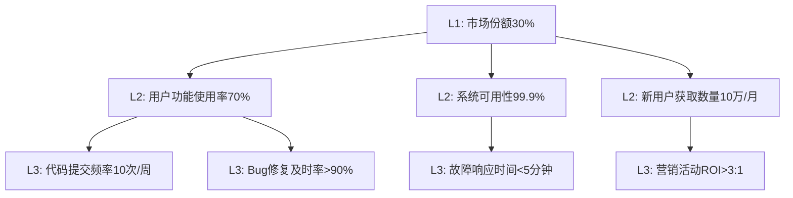

指标分级管理是构建有效度量体系的关键环节。通过将指标按照重要性和影响范围分为L1战略指标、L2团队/产品指标和L3个人/执行指标三个层级，企业能够更好地聚焦关键目标，明确责任分工，并实现从战略到执行的有效贯通。本节将深入探讨各级指标的管理方法和实施策略。

## L1战略指标管理

### 1.1 定义与特征

L1战略指标是与企业最高层战略目标直接相关的指标，具有以下特征：

- **战略性**：直接支撑企业长期战略目标
- **全局性**：影响整个企业或主要业务线
- **稳定性**：相对稳定，不会频繁调整
- **高层关注**：主要由企业高层管理者关注和决策

### 1.2 常见L1战略指标

#### 1.2.1 财务类指标

1. **收入增长率**
   - 定义：一定时期内收入的增长幅度
   - 计算公式：(本期收入 - 上期收入) / 上期收入 × 100%
   - 管理要点：关注收入结构优化和可持续增长

2. **利润率**
   - 定义：净利润占收入的比例
   - 计算公式：净利润 / 收入 × 100%
   - 管理要点：平衡收入增长与成本控制

3. **客户生命周期价值（LTV）**
   - 定义：单个客户在整个生命周期内为企业带来的总收入
   - 计算公式：平均订单价值 × 购买频率 × 客户生命周期
   - 管理要点：提升客户价值和长期关系

#### 1.2.2 市场类指标

1. **市场份额**
   - 定义：企业在特定市场中的占比
   - 计算公式：企业销售额 / 市场总销售额 × 100%
   - 管理要点：关注竞争态势和市场地位

2. **品牌认知度**
   - 定义：目标客户群体对企业品牌的认知程度
   - 管理要点：通过调研和监测持续提升品牌影响力

#### 1.2.3 运营类指标

1. **客户满意度（CSAT）**
   - 定义：客户对企业产品或服务的满意程度
   - 管理要点：建立客户反馈机制，持续改进产品和服务

2. **员工满意度**
   - 定义：员工对企业工作环境和管理的满意程度
   - 管理要点：关注员工体验，提升组织效能

### 1.3 L1指标管理策略

#### 1.3.1 指标设定

```yaml
# L1战略指标设定示例
战略目标: 成为行业领先的云服务提供商
L1指标:
  - 市场份额: 目标值30%，当前值25%，趋势↑
  - 收入增长率: 目标值40%，当前值35%，趋势↑
  - 客户满意度: 目标值4.5/5，当前值4.2/5，趋势↑
  - 员工满意度: 目标值4.0/5，当前值3.8/5，趋势↑
```

#### 1.3.2 监控机制

1. **定期报告**：每月/季度向高层管理者报告指标状态
2. **预警机制**：设置阈值，异常时及时预警
3. **趋势分析**：分析指标变化趋势，识别潜在问题

#### 1.3.3 决策支持

1. **数据驱动决策**：基于L1指标数据制定战略决策
2. **资源配置**：根据指标表现调整资源分配
3. **绩效评估**：将L1指标作为高管绩效考核的重要依据

## L2团队/产品指标管理

### 2.1 定义与特征

L2团队/产品指标是与部门或产品线目标相关的指标，具有以下特征：

- **部门相关性**：与特定部门或产品线的职责相关
- **中等影响范围**：影响部门或产品线的整体表现
- **中等稳定性**：根据业务变化可能需要调整
- **中层管理关注**：主要由部门负责人关注和管理

### 2.2 常见L2团队/产品指标

#### 2.2.1 产品团队指标

1. **功能发布频率**
   - 定义：单位时间内发布的新功能数量
   - 管理要点：平衡发布速度与质量

2. **用户功能使用率**
   - 定义：特定功能的用户使用比例
   - 管理要点：通过数据分析优化功能设计

3. **产品缺陷率**
   - 定义：产品中发现的缺陷数量与功能点的比例
   - 管理要点：加强测试和质量控制

#### 2.2.2 技术团队指标

1. **系统可用性**
   - 定义：系统正常运行时间占总时间的比例
   - 管理要点：建立高可用架构和监控体系

2. **部署频率**
   - 定义：单位时间内成功部署到生产环境的次数
   - 管理要点：推进持续集成和持续部署

3. **变更失败率**
   - 定义：部署后需要修复或回滚的变更比例
   - 管理要点：加强测试和变更管理

#### 2.2.3 市场团队指标

1. **新用户获取数量**
   - 定义：一定时期内获取的新用户数量
   - 管理要点：优化获客渠道和转化策略

2. **营销活动ROI**
   - 定义：营销投入与收益的比例
   - 管理要点：精细化管理营销预算

3. **品牌曝光量**
   - 定义：品牌在各类媒体上的曝光次数
   - 管理要点：多元化品牌传播渠道

### 2.3 L2指标管理策略

#### 2.3.1 指标分解

```yaml
# L1到L2指标分解示例
L1指标: 市场份额30%
L2指标分解:
  产品团队:
    - 用户功能使用率: 目标值70%
    - 产品缺陷率: 目标值<1%
  技术团队:
    - 系统可用性: 目标值99.9%
    - 部署频率: 目标值每日10次
  市场团队:
    - 新用户获取数量: 目标值每月10万
    - 营销活动ROI: 目标值>3:1
```

#### 2.3.2 责任明确

1. **指标负责人**：为每个L2指标指定明确的责任人
2. **团队协作**：建立跨团队协作机制
3. **绩效挂钩**：将L2指标与团队绩效考核挂钩

#### 2.3.3 过程管理

1. **周/月度回顾**：定期回顾指标进展
2. **问题诊断**：及时识别和解决指标异常
3. **改进措施**：制定并执行针对性改进措施

## L3个人/执行指标管理

### 3.1 定义与特征

L3个人/执行指标是与个人工作职责相关的指标，具有以下特征：

- **个人相关性**：与个人具体工作职责直接相关
- **小范围影响**：主要影响个人或小团队的工作表现
- **高变化频率**：根据工作任务变化可能频繁调整
- **基层员工关注**：主要由基层员工关注和执行

### 3.2 常见L3个人/执行指标

#### 3.2.1 开发人员指标

1. **代码提交频率**
   - 定义：单位时间内提交的代码次数
   - 管理要点：关注代码质量和提交规范

2. **代码审查参与度**
   - 定义：参与代码审查的频率和质量
   - 管理要点：提升代码质量和团队协作

3. **Bug修复及时率**
   - 定义：在规定时间内修复Bug的比例
   - 管理要点：建立Bug优先级管理机制

#### 3.2.2 测试人员指标

1. **测试用例执行率**
   - 定义：计划执行的测试用例实际执行比例
   - 管理要点：确保测试覆盖全面

2. **缺陷发现率**
   - 定义：单位时间内发现的缺陷数量
   - 管理要点：提升测试技能和效率

3. **自动化测试覆盖率**
   - 定义：自动化测试覆盖的功能比例
   - 管理要点：持续推进测试自动化

#### 3.2.3 运维人员指标

1. **故障响应时间**
   - 定义：从故障发生到开始处理的时间
   - 管理要点：建立快速响应机制

2. **系统巡检完成率**
   - 定义：计划巡检任务的实际完成比例
   - 管理要点：确保系统稳定运行

3. **文档更新及时性**
   - 定义：技术文档更新的及时程度
   - 管理要点：保持文档与实际一致

### 3.3 L3指标管理策略

#### 3.3.1 个人目标设定

```yaml
# 个人指标设定示例
员工: 张三（高级开发工程师）
L3指标:
  - 代码提交频率: 目标值每周10次
  - 代码审查参与度: 目标值每周5次
  - Bug修复及时率: 目标值>90%
  - 技术分享次数: 目标值每季度2次
```

#### 3.3.2 日常跟踪

1. **每日站会**：在每日站会中简要汇报指标进展
2. **工作日志**：记录日常工作与指标相关的内容
3. **周度总结**：每周总结指标完成情况

#### 3.3.3 反馈与改进

1. **一对一沟通**：定期与直属上级进行一对一沟通
2. **技能提升**：根据指标表现制定个人发展计划
3. **激励机制**：建立与指标表现挂钩的激励机制

## 指标层级间的关联与协同

### 4.1 指标映射关系

建立清晰的指标层级映射关系，确保各级指标协同一致：



### 4.2 数据一致性保障

1. **统一数据源**：确保各级指标使用一致的数据源
2. **计算逻辑透明**：明确各级指标的计算逻辑和依赖关系
3. **定期校验**：定期校验各级指标数据的一致性

### 4.3 责任传导机制

1. **目标分解**：将L1目标逐级分解到L2和L3
2. **责任明确**：明确各级指标的责任主体
3. **绩效联动**：建立各级指标与绩效考核的联动机制

## 实施案例

### 5.1 案例1：某互联网公司的指标分级管理

该公司建立了完整的三级指标管理体系：

1. **L1战略指标**：
   - 年度收入目标：100亿元
   - 用户规模目标：1亿活跃用户
   - 市场份额目标：行业前三

2. **L2团队指标**：
   - 产品团队：月活用户增长率10%
   - 技术团队：系统可用性99.99%
   - 市场团队：新用户获取成本控制在100元以内

3. **L3个人指标**：
   - 开发人员：每周代码提交15次以上
   - 测试人员：测试用例执行率100%
   - 运维人员：故障响应时间小于3分钟

### 5.2 案例2：某制造企业的指标分级管理

该企业根据制造业特点建立了指标体系：

1. **L1战略指标**：
   - 年度产值目标：50亿元
   - 产品质量目标：产品合格率99.5%以上
   - 成本控制目标：单位产品成本降低10%

2. **L2团队指标**：
   - 生产部门：月度生产计划完成率95%以上
   - 质量部门：月度质量事故小于3起
   - 研发部门：新产品开发周期缩短20%

3. **L3个人指标**：
   - 生产工人：产品合格率99%以上
   - 质检员：质检准确率99.9%以上
   - 研发工程师：技术文档完整率100%

## 实施建议

### 6.1 设计原则

1. **层次清晰**：确保各级指标边界清晰，避免重叠
2. **逻辑一致**：确保各级指标之间逻辑关系合理
3. **可操作性强**：确保各级指标都能够通过具体行动影响
4. **平衡性**：避免过度关注某一层级指标而忽视其他层级

### 6.2 实施步骤

1. **顶层设计**：从L1指标开始设计整个指标体系
2. **逐层分解**：将L1指标逐层分解到L2和L3
3. **责任明确**：为各级指标明确责任主体
4. **工具支撑**：建设度量平台支撑指标管理
5. **持续优化**：定期评估和优化指标体系

### 6.3 管理机制

1. **定期评估**：建立定期评估机制，确保指标有效性
2. **动态调整**：根据业务变化及时调整指标体系
3. **培训教育**：加强各级管理者和员工的指标管理培训
4. **文化建设**：培育数据驱动的组织文化

## 总结

指标分级管理通过将指标分为L1战略指标、L2团队/产品指标和L3个人/执行指标三个层级，实现了从战略到执行的有效贯通。各级指标各有特点和管理重点，通过建立清晰的映射关系和责任传导机制，能够确保整个组织朝着共同目标努力。

在下一节中，我们将探讨数据素养文化建设的重要性，包括如何培养全员的数据意识和分析能力。