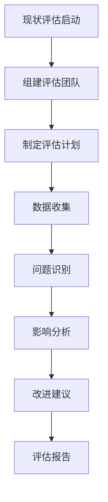

在构建统一度量平台之前，进行全面的现状评估是至关重要的第一步。只有准确识别企业当前在数据管理方面存在的问题，才能制定出有针对性的解决方案。本节将深入探讨如何评估数据孤岛、数据质量问题以及工具链碎片化问题，并提供实用的评估方法和改进建议。

## 数据孤岛问题识别

### 1.1 数据孤岛的定义与特征

数据孤岛是指在组织内部，由于技术、组织或业务原因，数据被隔离在不同的系统、部门或团队中，无法有效共享和整合的现象。其主要特征包括：

1. **物理隔离**：数据存储在不同的系统或数据库中
2. **逻辑隔离**：数据格式、结构不统一，难以整合
3. **访问隔离**：不同部门或团队无法访问彼此的数据
4. **语义隔离**：相同业务概念在不同系统中有不同的定义

### 1.2 数据孤岛的识别方法

#### 1.2.1 系统盘点法

通过全面盘点企业现有的IT系统来识别数据孤岛：

```yaml
# 企业系统盘点示例
业务系统:
  - CRM系统: 存储客户信息、销售数据
  - ERP系统: 存储财务、采购、库存数据
  - HR系统: 存储员工信息、薪酬数据
  - 项目管理系统: 存储项目进度、资源分配数据
  - 客服系统: 存储客户服务记录、问题处理数据

技术系统:
  - 监控系统: 存储系统性能、可用性数据
  - 日志系统: 存储应用日志、错误日志
  - 数据库系统: 存储业务数据、配置数据
  - 文件系统: 存储文档、报表等非结构化数据

开发系统:
  - 代码仓库: 存储代码、文档
  - CI/CD系统: 存储构建、部署数据
  - 测试系统: 存储测试结果、缺陷数据
```

#### 1.2.2 数据流分析法

通过分析数据在企业内部的流动情况来识别孤岛：

1. **数据源识别**：识别所有数据的产生源头
2. **数据流向追踪**：追踪数据在组织内的流动路径
3. **数据使用分析**：分析数据被哪些部门或系统使用
4. **数据壁垒识别**：识别阻碍数据流动的壁垒

#### 1.2.3 业务场景分析法

通过分析关键业务场景的数据需求来识别孤岛：

```markdown
业务场景: 用户体验优化
涉及数据:
  - 用户行为数据 (来自前端埋点)
  - 系统性能数据 (来自监控系统)
  - 客服反馈数据 (来自客服系统)
  - 产品使用数据 (来自业务系统)

问题识别:
  - 用户行为数据与系统性能数据无法关联分析
  - 客服反馈数据与产品使用数据存在时间差
  - 缺乏统一的用户画像数据
```

### 1.3 数据孤岛的影响

#### 1.3.1 业务影响

1. **决策质量下降**：缺乏全面数据支持，决策依据不充分
2. **重复工作增加**：不同部门重复收集相同数据
3. **响应速度慢**：跨部门数据获取困难，影响业务响应速度
4. **客户体验受损**：无法形成统一的客户视图

#### 1.3.2 技术影响

1. **系统复杂性增加**：多个系统间的数据同步和一致性维护困难
2. **维护成本上升**：需要维护多套数据处理逻辑
3. **数据一致性问题**：相同数据在不同系统中可能存在差异
4. **扩展性受限**：新业务需求难以快速满足

## 数据质量问题识别

### 2.1 数据质量问题的类型

#### 2.1.1 准确性问题

数据与实际情况不符：

- **错误数据**：录入错误、计算错误等
- **过时数据**：未及时更新的数据
- **不一致数据**：相同信息在不同系统中不一致

#### 2.1.2 完整性问题

数据缺失或不完整：

- **字段缺失**：必填字段为空
- **记录缺失**：部分数据记录丢失
- **时间断层**：数据在时间维度上不连续

#### 2.1.3 一致性问题

相同数据在不同系统或时间点存在差异：

- **定义不一致**：相同业务概念在不同系统中有不同定义
- **格式不一致**：相同数据采用不同格式存储
- **更新不同步**：数据变更未在所有系统中同步

#### 2.1.4 及时性问题

数据未能及时更新或提供：

- **延迟更新**：数据更新存在时间延迟
- **实时性不足**：无法满足实时分析需求
- **批处理滞后**：批处理作业执行时间过长

### 2.2 数据质量问题的识别方法

#### 2.2.1 数据质量评估框架

建立数据质量评估框架，从多个维度评估数据质量：

```yaml
数据质量评估维度:
  准确性:
    - 数据与实际情况的一致性
    - 错误数据比例
    - 数据校验通过率
  完整性:
    - 必填字段填充率
    - 记录完整性比例
    - 时间连续性
  一致性:
    - 跨系统数据一致性
    - 历史数据一致性
    - 业务规则一致性
  及时性:
    - 数据更新延迟
    - 实时数据可用性
    - 批处理执行时效
  可理解性:
    - 数据定义清晰度
    - 元数据完整性
    - 数据字典完备性
  可信度:
    - 数据来源可靠性
    - 数据处理透明度
    - 数据审计能力
```

#### 2.2.2 数据质量检测工具

使用自动化工具检测数据质量问题：

1. **规则引擎**：基于预定义规则检测数据异常
2. **统计分析**：通过统计方法识别数据分布异常
3. **机器学习**：使用机器学习算法识别数据模式异常

#### 2.2.3 数据质量监控

建立持续的数据质量监控机制：

```python
# 数据质量监控示例代码
class DataQualityMonitor:
    def __init__(self):
        self.rules = {
            'completeness': self.check_completeness,
            'accuracy': self.check_accuracy,
            'consistency': self.check_consistency,
            'timeliness': self.check_timeliness
        }
    
    def check_completeness(self, data):
        """检查数据完整性"""
        missing_fields = []
        for field in self.required_fields:
            if data.get(field) is None:
                missing_fields.append(field)
        return len(missing_fields) == 0, missing_fields
    
    def check_accuracy(self, data):
        """检查数据准确性"""
        # 实现准确性检查逻辑
        pass
    
    def check_consistency(self, data):
        """检查数据一致性"""
        # 实现一致性检查逻辑
        pass
    
    def check_timeliness(self, data):
        """检查数据及时性"""
        # 实现及时性检查逻辑
        pass
```

### 2.3 数据质量问题的影响

#### 2.3.1 业务影响

1. **决策失误**：基于错误数据做出错误决策
2. **客户流失**：数据错误导致客户体验下降
3. **合规风险**：不准确的数据可能违反监管要求
4. **声誉损害**：数据质量问题影响企业声誉

#### 2.3.2 技术影响

1. **系统性能下降**：处理错误数据消耗额外资源
2. **分析结果偏差**：数据质量问题导致分析结果不准确
3. **维护成本增加**：需要额外处理数据质量问题
4. **集成困难**：数据质量问题增加系统集成复杂度

## 工具链碎片化问题识别

### 3.1 工具链碎片化的表现

#### 3.1.1 技术栈多样化

企业使用多种不同的技术栈：

- **编程语言**：Java、Python、Go、Node.js等并存
- **数据库**：MySQL、PostgreSQL、MongoDB、Redis等混合使用
- **消息队列**：Kafka、RabbitMQ、RocketMQ等同时存在
- **容器编排**：Kubernetes、Docker Swarm等不同方案

#### 3.1.2 工具功能重叠

多个工具提供相似功能：

```markdown
监控工具:
  - Prometheus: 用于系统指标监控
  - Zabbix: 用于基础设施监控
  - ELK: 用于日志分析
  - AppDynamics: 用于应用性能监控

问题: 功能重叠，数据分散，维护成本高
```

#### 3.1.3 数据格式不统一

不同工具使用不同的数据格式：

- **日志格式**：JSON、文本、自定义格式等
- **指标格式**：Prometheus格式、OpenTelemetry格式等
- **配置格式**：YAML、JSON、XML、Properties等

### 3.2 工具链碎片化的识别方法

#### 3.2.1 工具清单梳理

全面梳理企业使用的各类工具：

```yaml
# 企业工具链清单示例
数据采集工具:
  - Filebeat: 日志文件采集
  - Telegraf: 系统指标采集
  - Kafka Connect: 数据集成
  - 自定义脚本: 特殊数据采集

数据存储工具:
  - MySQL: 关系型数据存储
  - Elasticsearch: 日志数据存储
  - InfluxDB: 时序数据存储
  - HDFS: 大数据存储

数据处理工具:
  - Spark: 批处理
  - Flink: 流处理
  - Kafka Streams: 流处理
  - 自定义程序: 特殊处理逻辑

数据展示工具:
  - Grafana: 指标可视化
  - Kibana: 日志分析展示
  - Superset: BI报表
  - 自定义Dashboard: 业务报表
```

#### 3.2.2 集成复杂度分析

分析工具间集成的复杂度：

1. **接口兼容性**：工具间接口是否兼容
2. **数据格式转换**：是否需要大量数据格式转换
3. **维护成本**：集成方案的维护成本
4. **扩展性**：新增工具的集成难度

#### 3.2.3 技能要求分析

分析维护工具链所需的技能：

- **技能种类**：需要掌握的技能种类数量
- **技能深度**：每种技能需要掌握的深度
- **人员配置**：维护工具链所需的人员数量
- **培训成本**：人员培训的成本和时间

### 3.3 工具链碎片化的影响

#### 3.3.1 维护成本增加

1. **人力成本**：需要更多专业人员维护
2. **学习成本**：团队需要学习多种技术栈
3. **故障排查**：问题排查涉及多个工具，复杂度高
4. **升级风险**：工具升级可能影响整个链路

#### 3.3.2 数据一致性问题

1. **数据重复**：相同数据在多个工具中存储
2. **数据不一致**：不同工具处理相同数据可能产生差异
3. **同步延迟**：工具间数据同步存在延迟
4. **质量参差**：不同工具的数据质量标准不一

#### 3.3.3 创新效率降低

1. **集成复杂**：新工具集成到现有链路复杂度高
2. **实验成本**：尝试新技术的成本较高
3. **知识分散**：团队知识分散在多个工具上
4. **协作困难**：不同团队使用不同工具，协作困难

## 现状评估的实施建议

### 4.1 评估流程设计



### 4.2 评估团队组建

1. **业务代表**：了解业务需求和痛点
2. **技术专家**：评估技术现状和可行性
3. **数据工程师**：分析数据质量和工具链问题
4. **项目经理**：协调评估过程和资源

### 4.3 评估方法选择

1. **文档审查**：审查现有系统文档和架构图
2. **访谈调研**：与关键人员进行深度访谈
3. **数据分析**：分析现有数据和系统日志
4. **工具检测**：使用专业工具进行自动化检测

### 4.4 评估结果应用

1. **问题清单**：整理识别出的所有问题
2. **优先级排序**：根据影响程度和紧急程度排序
3. **改进建议**：针对每个问题提出改进建议
4. **实施路线图**：制定问题解决的实施路线图

## 实施案例

### 5.1 案例1：某互联网公司的现状评估

该公司通过以下步骤完成了现状评估：

1. **系统盘点**：梳理了100多个业务和技术系统
2. **数据流分析**：绘制了核心业务的数据流向图
3. **质量检测**：使用自动化工具检测了关键数据质量
4. **工具链分析**：梳理了20多个数据相关工具

评估结果发现：
- 存在15个主要数据孤岛
- 30%的关键数据存在质量问题
- 工具链碎片化严重，维护成本高昂

### 5.2 案例2：某金融机构的现状评估

该机构重点关注数据质量和合规性：

1. **合规性检查**：评估数据是否满足监管要求
2. **质量评估**：全面评估客户数据、交易数据质量
3. **安全审计**：检查数据访问和使用安全性
4. **集成分析**：分析各系统间数据集成情况

评估发现：
- 客户数据一致性问题严重
- 部分数据未满足监管报告要求
- 系统间数据同步存在延迟

## 总结

现状评估是构建统一度量平台的重要前提。通过系统性地识别数据孤岛、数据质量问题和工具链碎片化问题，企业能够准确了解当前状况，为后续的平台规划和建设提供有力支撑。

在下一节中，我们将探讨如何明确度量平台的目标，包括监控、洞察、问责、改进等核心功能。