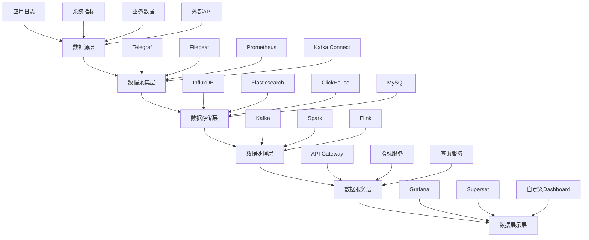
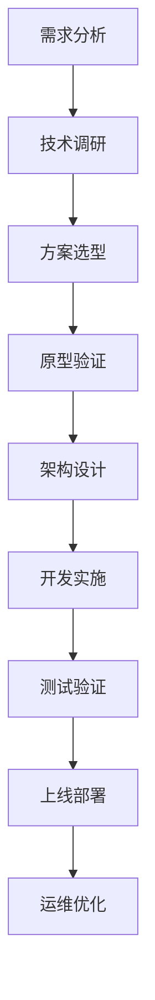

在构建统一度量平台时，技术选型是一个至关重要的决策环节。企业需要在自研和基于开源生态构建之间做出选择，每种方案都有其独特的优势和挑战。本节将深入分析这两种技术路线的特点，并重点探讨如何基于开源生态（如Apache Superset、Grafana、Prometheus等）构建度量平台。

## 自研 vs. 开源生态构建的对比分析

### 1.1 自研方案

#### 1.1.1 优势

1. **完全定制化**：可以根据企业特定需求进行完全定制开发
2. **知识产权控制**：拥有完整的知识产权和控制权
3. **技术栈统一**：可以与企业现有技术栈完美集成
4. **功能专一性**：专注于企业特定场景，避免功能冗余
5. **安全性控制**：可以完全控制安全策略和实现

#### 1.1.2 挑战

1. **开发成本高**：需要投入大量人力和时间进行开发
2. **维护负担重**：需要长期维护和持续优化
3. **技术风险大**：可能面临技术选型错误的风险
4. **人才要求高**：需要高水平的技术团队支撑
5. **生态缺失**：缺乏成熟的社区支持和插件生态

#### 1.1.3 适用场景

```yaml
适合自研的场景:
  企业特点:
    - 技术实力强，拥有充足的研发资源
    - 对数据安全和隐私有极高要求
    - 业务场景特殊，现有解决方案无法满足
    - 有长期战略规划，能够持续投入
  业务需求:
    - 需要高度定制化的功能
    - 对性能有极致要求
    - 需要与现有系统深度集成
    - 有独特的业务逻辑和计算需求
```

### 1.2 开源生态构建方案

#### 1.2.1 优势

1. **成本效益高**：大幅降低初始开发成本
2. **社区支持强**：拥有活跃的社区和丰富的资源
3. **成熟度高**：经过多年发展，功能相对完善
4. **生态丰富**：有大量插件和集成方案可选
5. **人才储备多**：市场上熟悉开源工具的人才较多

#### 1.2.2 挑战

1. **定制化限制**：可能无法完全满足特定需求
2. **集成复杂度**：多个工具集成可能比较复杂
3. **版本管理**：需要管理多个开源组件的版本升级
4. **安全责任**：需要自行负责安全漏洞的跟踪和修复
5. **技术支持**：商业支持可能需要额外付费

#### 1.2.3 适用场景

```yaml
适合开源生态的场景:
  企业特点:
    - 资源有限，希望快速见效
    - 技术团队规模中等
    - 对成本控制有较高要求
    - 希望利用成熟解决方案
  业务需求:
    - 需求相对标准化
    - 可以接受一定程度的定制化限制
    - 注重快速部署和上线
    - 希望利用社区最佳实践
```

## 主流开源工具分析

### 2.1 数据采集层工具

#### 2.1.1 Prometheus

**特点**：
- 专为云原生环境设计的监控和告警工具
- 多维数据模型，强大的查询语言PromQL
- 服务发现机制，自动发现监控目标
- 高可用性和可扩展性

**适用场景**：
- 系统和应用性能监控
- 微服务架构监控
- 容器化环境监控

**集成方案**：
```yaml
Prometheus集成方案:
  数据源:
    - Kubernetes: 通过ServiceMonitor自动发现
    - 应用程序: 通过Exporter暴露指标
    - 数据库: 使用专用Exporter
  存储:
    - 本地存储: 默认TSDB存储
    - 远程存储: 支持多种远程存储方案
  告警:
    - Alertmanager: 告警管理和通知
    - 告警规则: 自定义告警规则
```

#### 2.1.2 Telegraf

**特点**：
- 高性能的数据采集代理
- 支持数百种输入插件
- 灵活的输出插件支持
- 轻量级且易于部署

**适用场景**：
- 系统指标采集
- 日志数据收集
- 物联网数据采集

### 2.2 数据存储层工具

#### 2.2.1 InfluxDB

**特点**：
- 专为时序数据设计的数据库
- 高性能写入和查询能力
- 丰富的数据分析函数
- 内置可视化工具

**适用场景**：
- IoT数据存储和分析
- 应用性能监控数据存储
- 业务指标数据存储

#### 2.2.2 Elasticsearch

**特点**：
- 分布式搜索引擎
- 强大的全文检索能力
- 实时数据分析功能
- 水平扩展能力强

**适用场景**：
- 日志数据分析
- 全文搜索应用
- 实时数据分析

### 2.3 数据展示层工具

#### 2.3.1 Grafana

**特点**：
- 强大的数据可视化能力
- 支持多种数据源
- 丰富的图表类型
- 灵活的仪表板配置

**适用场景**：
- 系统监控可视化
- 业务指标展示
- 实时数据监控

**集成示例**：
```json
{
  "dashboard": {
    "title": "系统监控概览",
    "panels": [
      {
        "type": "graph",
        "title": "CPU使用率",
        "datasource": "Prometheus",
        "targets": [
          {
            "expr": "100 - (avg by (instance) (irate(node_cpu_seconds_total{mode=\"idle\"}[5m])) * 100)",
            "legendFormat": "{{instance}}"
          }
        ]
      },
      {
        "type": "stat",
        "title": "内存使用率",
        "datasource": "Prometheus",
        "targets": [
          {
            "expr": "(node_memory_MemTotal_bytes - node_memory_MemAvailable_bytes) / node_memory_MemTotal_bytes * 100",
            "legendFormat": "Memory Usage"
          }
        ]
      }
    ]
  }
}
```

#### 2.3.2 Apache Superset

**特点**：
- 企业级数据可视化和探索平台
- 支持SQL编辑和可视化拖拽
- 丰富的图表类型和自定义能力
- 强大的数据权限管理

**适用场景**：
- 商业智能分析
- 数据探索和发现
- 复杂报表生成

## 基于开源生态的平台架构设计

### 3.1 分层架构设计



### 3.2 核心组件选型

#### 3.2.1 数据采集组件

```yaml
数据采集方案:
  日志采集:
    - 工具: Filebeat + Logstash
    - 特点: 轻量级，支持多种日志格式
    - 配置示例:
      filebeat.inputs:
        - type: log
          enabled: true
          paths:
            - /var/log/*.log
          fields:
            service: webapp
  指标采集:
    - 工具: Prometheus + Exporters
    - 特点: 多维数据模型，强大的查询能力
    - 配置示例:
      scrape_configs:
        - job_name: 'node'
          static_configs:
            - targets: ['localhost:9100']
  业务数据采集:
    - 工具: Kafka Connect
    - 特点: 支持多种数据源，实时同步
    - 配置示例:
      connector.class: io.debezium.connector.mysql.MySqlConnector
      database.hostname: mysql-host
      database.port: 3306
```

#### 3.2.2 数据存储组件

```yaml
数据存储方案:
  时序数据:
    - 工具: InfluxDB
    - 特点: 专为时序数据优化，高性能读写
    - 应用场景: 系统监控指标、IoT数据
  日志数据:
    - 工具: Elasticsearch
    - 特点: 全文检索，实时分析
    - 应用场景: 应用日志、错误日志
  业务数据:
    - 工具: ClickHouse
    - 特点: 列式存储，OLAP分析
    - 应用场景: 大数据分析、报表生成
```

#### 3.2.3 数据展示组件

```yaml
数据展示方案:
  实时监控:
    - 工具: Grafana
    - 特点: 实时可视化，告警集成
    - 应用场景: 系统监控、业务指标实时展示
  商业智能:
    - 工具: Apache Superset
    - 特点: 拖拽式分析，SQL编辑
    - 应用场景: 数据探索、复杂报表
  自定义展示:
    - 工具: 自研Dashboard
    - 特点: 完全定制化，与业务深度集成
    - 应用场景: 特定业务场景的可视化展示
```

## 开源生态集成方案

### 4.1 统一认证和授权

```yaml
统一认证方案:
  认证中心:
    - 工具: Keycloak
    - 功能: 用户管理、单点登录
  权限管理:
    - 工具: 自研权限服务
    - 功能: 角色管理、数据权限控制
  集成方式:
    - OAuth2: 各组件通过OAuth2集成
    - JWT: 使用JWT传递用户信息
    - RBAC: 基于角色的访问控制
```

### 4.2 统一配置管理

```yaml
配置管理方案:
  配置中心:
    - 工具: Consul + Vault
    - 功能: 配置存储、密钥管理
  配置同步:
    - 工具: Consul Template
    - 功能: 配置变更自动同步
  配置监控:
    - 工具: 自研配置监控服务
    - 功能: 配置变更审计、异常告警
```

### 4.3 统一监控和告警

```yaml
监控告警方案:
  基础监控:
    - 工具: Prometheus + Node Exporter
    - 功能: 系统指标监控
  应用监控:
    - 工具: Prometheus + 应用Exporter
    - 功能: 应用性能监控
  告警管理:
    - 工具: Alertmanager
    - 功能: 告警路由、通知管理
  日志监控:
    - 工具: ELK Stack
    - 功能: 日志收集、分析、告警
```

## 实施案例

### 5.1 案例1：某互联网公司的开源生态构建

该公司基于以下方案构建了度量平台：

1. **技术选型**：
   - 数据采集：Prometheus + Telegraf + Filebeat
   - 数据存储：InfluxDB + Elasticsearch
   - 数据展示：Grafana + Superset
   - 消息队列：Kafka
   - 处理引擎：Flink

2. **实施效果**：
   - 平台建设周期：3个月
   - 成本节约：相比自研节约60%成本
   - 功能覆盖：满足90%以上业务需求
   - 团队接受度：技术团队快速上手

### 5.2 案例2：某金融机构的混合方案

该机构采用自研+开源的混合方案：

1. **核心模块自研**：
   - 数据安全模块
   - 合规审计模块
   - 核心业务指标计算

2. **通用功能开源**：
   - 数据采集：Telegraf
   - 数据存储：Elasticsearch
   - 数据展示：Grafana

3. **实施效果**：
   - 满足合规要求
   - 控制开发成本
   - 保证系统稳定
   - 快速响应业务需求

## 实施建议

### 6.1 选型原则

1. **业务匹配度**：选择最匹配业务需求的方案
2. **技术成熟度**：优先选择成熟稳定的开源项目
3. **社区活跃度**：关注项目的社区活跃度和更新频率
4. **团队技能**：考虑团队的技术栈和学习能力
5. **成本效益**：综合考虑TCO（总拥有成本）

### 6.2 实施步骤



### 6.3 风险控制

1. **技术风险**：
   - 建立技术评估机制
   - 制定备选方案
   - 定期技术评审

2. **安全风险**：
   - 建立安全审计机制
   - 及时跟踪安全漏洞
   - 实施安全加固措施

3. **运维风险**：
   - 建立监控告警体系
   - 制定应急预案
   - 培养运维团队

## 总结

技术选型是度量平台建设的关键决策。自研方案提供完全的定制化能力，但成本高、风险大；开源生态构建方案成本低、成熟度高，但可能存在定制化限制。企业应根据自身情况选择合适的方案，或采用混合方案以平衡各方面需求。

在下一节中，我们将探讨如何制定从统一数据采集到智能分析洞察的演进路线图。