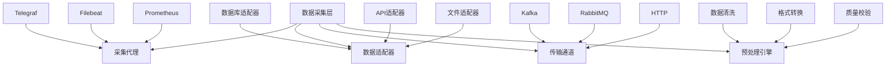
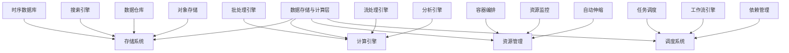
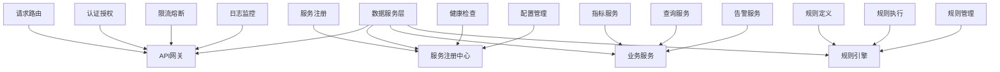
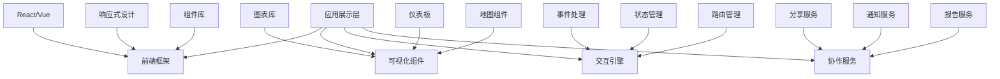
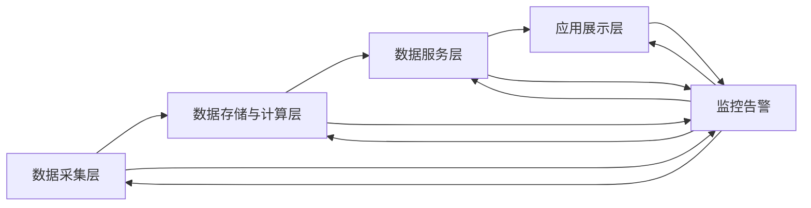
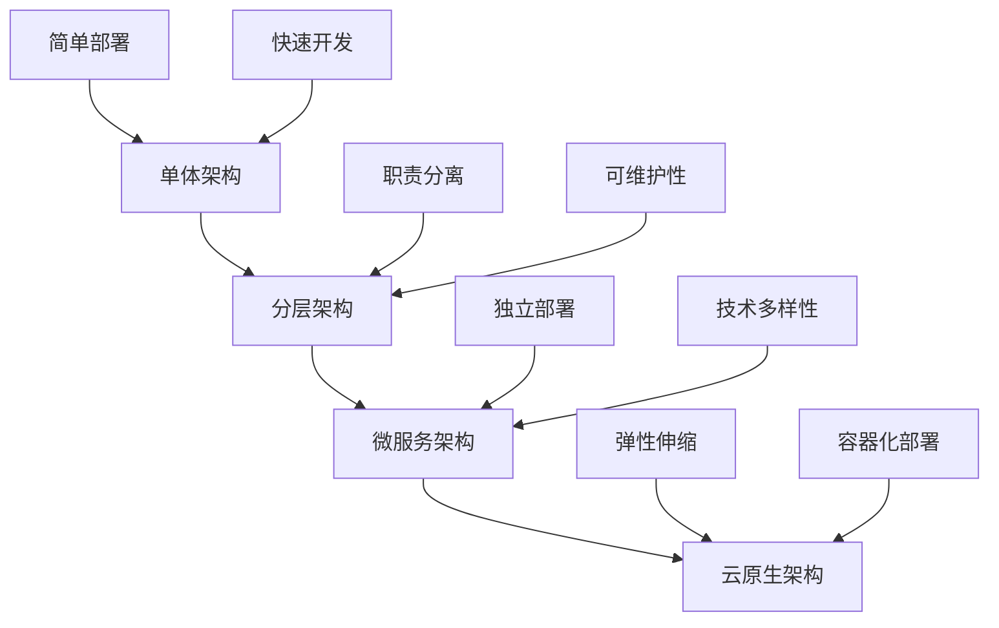

在构建企业级统一度量平台时，采用分层架构设计是确保系统清晰、可维护和可扩展的关键。分层架构通过将系统功能划分为不同的层次，每一层都有明确的职责和接口，从而降低了系统的复杂性，提高了开发效率和维护性。本节将深入探讨度量平台的四层架构设计：数据采集层、数据存储与计算层、数据服务层和应用展示层。

## 分层架构设计原则

### 1.1 设计原则

#### 1.1.1 职责分离原则

每一层都有明确的职责，避免功能交叉和重复：

```yaml
职责分离:
  单一职责:
    - 每一层只负责特定的功能
    - 层内组件职责清晰
    - 避免功能重复实现
  接口明确:
    - 层间通过明确定义的接口交互
    - 接口稳定性和兼容性保障
    - 降低层间耦合度
```

#### 1.1.2 松耦合原则

层间通过标准接口交互，降低依赖关系：

```yaml
松耦合设计:
  接口标准化:
    - 定义统一的接口规范
    - 使用标准协议和格式
    - 支持多种实现方式
  依赖倒置:
    - 上层不直接依赖下层实现
    - 通过抽象接口进行交互
    - 支持插件化扩展
```

#### 1.1.3 可扩展性原则

架构设计应支持横向和纵向扩展：

```yaml
可扩展性设计:
  横向扩展:
    - 支持水平集群部署
    - 无状态服务设计
    - 负载均衡支持
  纵向扩展:
    - 支持功能模块扩展
    - 插件化架构设计
    - 配置驱动的功能开关
```

## 四层架构详解

### 2.1 数据采集层

#### 2.1.1 层级职责

数据采集层负责从各种数据源收集原始数据，是整个平台的数据入口：

```yaml
数据采集层职责:
  数据源接入:
    - 支持多种数据源类型
    - 提供统一的接入接口
    - 实现数据源适配器
  数据预处理:
    - 数据格式标准化
    - 数据质量初步校验
    - 数据过滤和转换
  数据传输:
    - 保证数据传输可靠性
    - 支持批量和实时传输
    - 实现数据压缩和加密
```

#### 2.1.2 核心组件



#### 2.1.3 设计考虑

1. **多样性支持**：支持结构化、半结构化和非结构化数据
2. **可靠性保障**：实现数据传输的可靠性和完整性
3. **性能优化**：优化采集性能，减少对源系统的干扰
4. **扩展性设计**：支持新增数据源类型的快速接入

### 2.2 数据存储与计算层

#### 2.2.1 层级职责

数据存储与计算层负责数据的持久化存储和计算处理：

```yaml
数据存储与计算层职责:
  数据存储:
    - 提供高效的数据存储方案
    - 支持多种数据模型
    - 实现数据备份和恢复
  数据计算:
    - 执行数据处理和计算任务
    - 支持批处理和流处理
    - 实现复杂分析算法
  资源管理:
    - 管理计算和存储资源
    - 实现资源调度和优化
    - 支持弹性伸缩
```

#### 2.2.2 核心组件



#### 2.2.3 设计考虑

1. **存储选型**：根据数据特点选择合适的存储方案
2. **计算优化**：优化计算性能，提高处理效率
3. **一致性保障**：确保数据的一致性和完整性
4. **成本控制**：平衡性能和成本，实现最优性价比

### 2.3 数据服务层

#### 2.3.1 层级职责

数据服务层提供统一的数据访问接口和服务：

```yaml
数据服务层职责:
  数据接口:
    - 提供标准化的数据访问接口
    - 实现API网关和路由
    - 支持多种协议和格式
  服务治理:
    - 实现服务注册和发现
    - 提供负载均衡和容错
    - 实现服务监控和告警
  业务逻辑:
    - 实现核心业务逻辑
    - 提供数据处理和转换
    - 实现业务规则引擎
```

#### 2.3.2 核心组件



#### 2.3.3 设计考虑

1. **接口标准化**：提供统一、标准的API接口
2. **服务治理**：实现完善的服务治理机制
3. **性能优化**：优化服务响应时间和吞吐量
4. **安全防护**：实现完善的安全防护机制

### 2.4 应用展示层

#### 2.4.1 层级职责

应用展示层负责数据的可视化展示和用户交互：

```yaml
应用展示层职责:
  数据可视化:
    - 提供丰富的图表展示
    - 支持自定义仪表板
    - 实现交互式分析
  用户界面:
    - 提供友好的用户界面
    - 支持多端适配
    - 实现个性化配置
  协作功能:
    - 支持数据分享和协作
    - 实现通知和告警
    - 提供报告生成功能
```

#### 2.4.2 核心组件



#### 2.4.3 设计考虑

1. **用户体验**：注重用户体验设计，提供直观易用的界面
2. **可视化效果**：提供丰富、美观的可视化效果
3. **响应性能**：优化前端性能，提高响应速度
4. **兼容性**：支持多种设备和浏览器

## 层间交互设计

### 3.1 数据流设计



### 3.2 接口设计

```yaml
层间接口设计:
  采集到存储:
    - 协议: Kafka/HTTP
    - 格式: JSON/Protobuf
    - 保证: 可靠传输、顺序保证
  存储到服务:
    - 协议: JDBC/gRPC
    - 格式: 结构化数据
    - 保证: 一致性、事务支持
  服务到展示:
    - 协议: RESTful API/WebSocket
    - 格式: JSON
    - 保证: 实时性、安全性
```

### 3.3 异步处理

```yaml
异步处理设计:
  消息队列:
    - 用于解耦层间依赖
    - 实现流量削峰填谷
    - 支持异步处理模式
  事件驱动:
    - 基于事件的架构设计
    - 实现松耦合组件交互
    - 支持复杂业务流程
```

## 架构演进策略

### 4.1 演进路径



### 4.2 演进考虑

1. **业务驱动**：根据业务发展需要进行架构演进
2. **技术成熟度**：选择成熟稳定的技术方案
3. **团队能力**：考虑团队的技术能力和接受度
4. **成本效益**：平衡演进成本和业务价值

## 实施案例

### 5.1 案例1：某互联网公司的分层架构

该公司采用以下分层架构：

1. **数据采集层**：
   - 使用Telegraf采集系统指标
   - 使用Filebeat采集日志数据
   - 使用Kafka作为传输通道

2. **数据存储与计算层**：
   - 使用InfluxDB存储时序数据
   - 使用Elasticsearch存储日志数据
   - 使用Spark进行批处理计算

3. **数据服务层**：
   - 使用Spring Cloud构建微服务
   - 实现统一API网关
   - 提供GraphQL查询接口

4. **应用展示层**：
   - 使用React构建前端应用
   - 集成Grafana进行可视化展示
   - 实现自定义仪表板功能

### 5.2 案例2：某金融机构的分层架构

该机构根据金融行业特点设计了分层架构：

1. **数据采集层**：
   - 实现合规性数据采集
   - 支持多种金融数据源
   - 实现数据加密传输

2. **数据存储与计算层**：
   - 使用Oracle存储核心业务数据
   - 使用Greenplum进行大数据分析
   - 实现数据备份和灾备

3. **数据服务层**：
   - 实现严格的安全控制
   - 提供合规性数据服务
   - 支持审计和追溯

4. **应用展示层**：
   - 实现监管报告生成功能
   - 提供风险监控可视化
   - 支持移动端访问

## 实施建议

### 6.1 架构设计建议

1. **从简单开始**：初期采用相对简单的架构，随着业务发展逐步演进
2. **关注核心需求**：聚焦核心业务需求，避免过度设计
3. **预留扩展空间**：在架构设计中预留扩展接口和能力
4. **重视监控告警**：建立完善的监控告警体系

### 6.2 技术选型建议

1. **成熟优先**：优先选择成熟稳定的技术方案
2. **生态完善**：选择有完善生态支持的技术
3. **团队熟悉**：考虑团队的技术栈熟悉程度
4. **成本可控**：平衡功能需求和成本投入

### 6.3 实施过程建议

1. **分步实施**：按照架构层次分步实施
2. **持续集成**：建立持续集成和部署机制
3. **文档完善**：完善架构设计文档和实施文档
4. **经验总结**：及时总结实施经验，持续优化

## 总结

分层架构设计是构建企业级统一度量平台的基础。通过将系统划分为数据采集层、数据存储与计算层、数据服务层和应用展示层，可以实现职责分离、松耦合和可扩展性。在实施过程中，需要根据业务需求和技术特点选择合适的架构演进路径，并关注架构设计的核心原则和最佳实践。

在下一节中，我们将深入探讨平台核心组件的设计，包括指标定义中心、数据采集器、ETL管道和元数据管理系统。