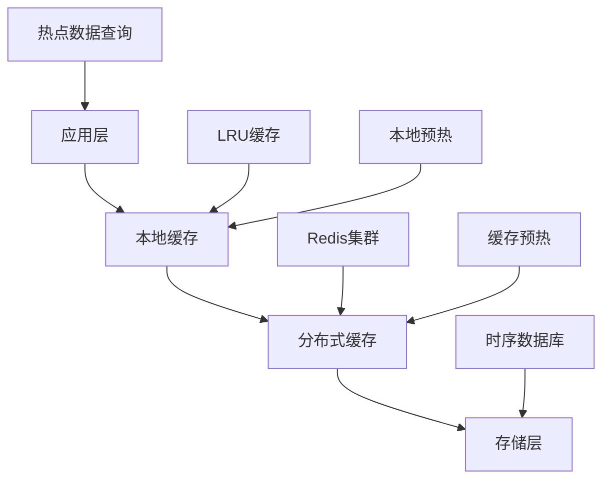
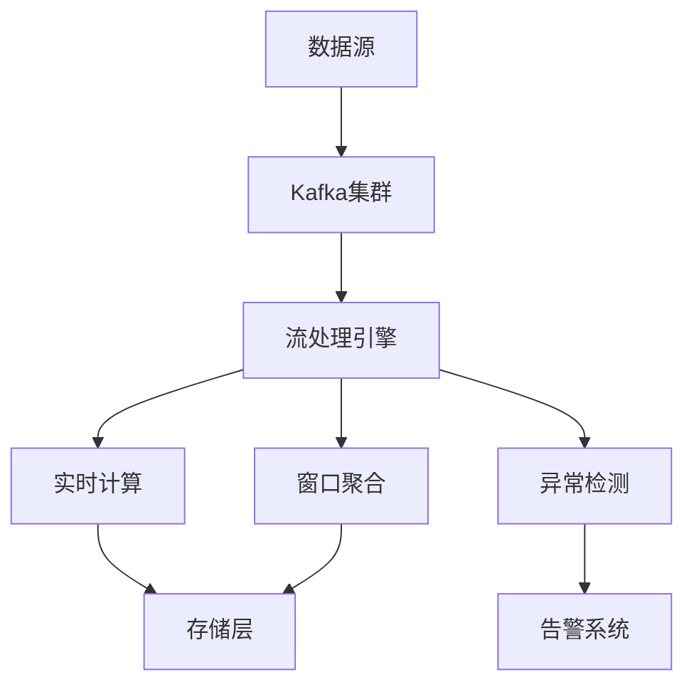
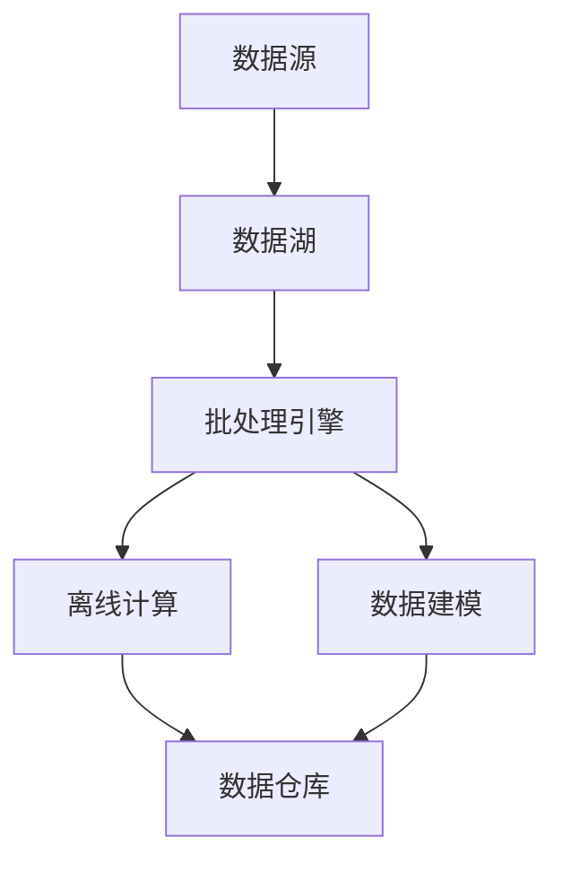
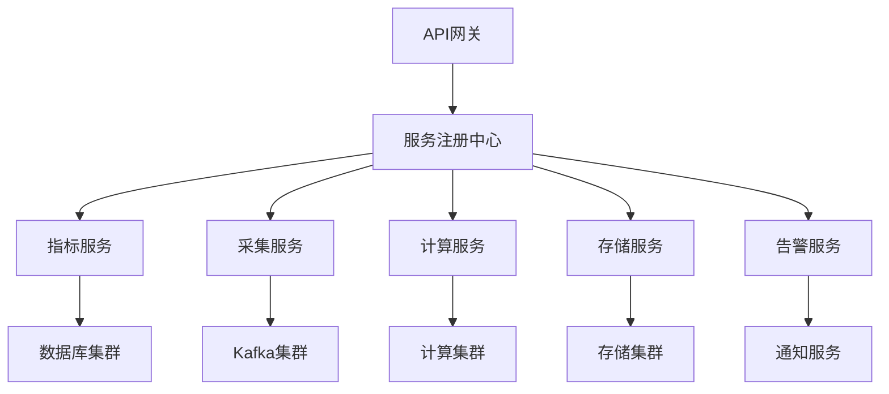

在企业级统一度量平台中，处理海量时序数据是面临的主要技术挑战之一。随着业务规模的不断扩大和监控需求的日益精细化，平台需要处理的数据量呈指数级增长。本节将深入探讨如何设计高性能、可扩展的系统架构，以有效应对海量时序数据的存储、处理和查询需求。

## 海量时序数据的特征与挑战

### 1.1 时序数据特征分析

#### 1.1.1 数据特征

时序数据具有以下典型特征：

```yaml
时序数据特征:
  高写入频率:
    - 数据持续不断地产生
    - 写入操作远多于读取操作
    - 需要支持高并发写入
  时间序列性:
    - 数据按时间顺序排列
    - 查询通常基于时间范围
    - 数据具有时间相关性
  结构化程度高:
    - 数据格式相对固定
    - 字段类型明确
    - 便于索引和查询优化
  数据量大:
    - 数据量随时间持续增长
    - 需要长期存储历史数据
    - 存储成本成为重要考虑因素
```

#### 1.1.2 业务场景

时序数据在以下业务场景中广泛应用：

```yaml
业务场景:
  系统监控:
    - 服务器性能指标
    - 应用程序运行状态
    - 网络流量统计
  业务指标:
    - 用户行为数据
    - 交易流水记录
    - 营销活动效果
  IoT数据:
    - 传感器采集数据
    - 设备运行状态
    - 环境监测数据
```

### 1.2 技术挑战

#### 1.2.1 存储挑战

```yaml
存储挑战:
  容量需求:
    - 数据量持续增长，存储需求巨大
    - 需要考虑数据生命周期管理
    - 成本控制成为关键因素
  写入性能:
    - 高频写入对存储系统压力大
    - 需要优化写入路径和策略
    - 保证写入的可靠性和一致性
  查询效率:
    - 时间范围查询是主要查询模式
    - 需要高效的索引机制
    - 支持复杂的聚合查询
```

#### 1.2.2 处理挑战

```yaml
处理挑战:
  实时性要求:
    - 需要实时或近实时处理数据
    - 延迟要求严格
    - 支持流式处理模式
  计算复杂度:
    - 需要支持复杂的聚合计算
    - 实现多维度分析
    - 支持机器学习算法
  资源消耗:
    - 计算资源消耗大
    - 需要合理的资源调度
    - 优化计算效率
```

## 高性能存储方案设计

### 2.1 时序数据库选型

#### 2.1.1 主流时序数据库对比

```yaml
时序数据库对比:
  InfluxDB:
    优势:
      - 专为时序数据设计
      - TSI索引提供高效查询
      - 支持连续查询和保留策略
    劣势:
      - 单机性能存在瓶颈
      - 集群版本需付费
    适用场景: 中小型时序数据存储

  Prometheus:
    优势:
      - 强大的查询语言PromQL
      - 优秀的监控集成能力
      - 活跃的开源社区
    劣势:
      - 主要面向监控场景
      - 长期存储能力有限
    适用场景: 系统监控和告警

  TimescaleDB:
    优势:
      - 基于PostgreSQL，SQL兼容性好
      - 支持水平扩展
      - 强大的分析功能
    劣势:
      - 相对较新，生态不够成熟
      - 资源消耗较大
    适用场景: 需要复杂分析的时序数据

  TDengine:
    优势:
      - 高性能，专为IoT设计
      - 内置缓存和流式计算
      - 支持多种协议
    劣势:
      - 生态相对较小
      - 社区支持有限
    适用场景: IoT和工业监控场景
```

#### 2.1.2 选型建议

```yaml
选型考虑因素:
  数据规模:
    - 小规模(<100GB): InfluxDB单机版
    - 中等规模(100GB-1TB): TimescaleDB
    - 大规模(>1TB): TDengine或集群版InfluxDB
  查询复杂度:
    - 简单监控: Prometheus
    - 复杂分析: TimescaleDB
    - 实时处理: TDengine
  团队技能:
    - SQL熟悉: TimescaleDB
    - 监控背景: Prometheus
    - IoT经验: TDengine
```

### 2.2 存储架构优化

#### 2.2.1 分片策略

```python
class ShardingStrategy:
    def __init__(self, shard_count=16):
        self.shard_count = shard_count
    
    def get_shard_key(self, metric_name, timestamp):
        """基于指标名称和时间戳计算分片键"""
        hash_value = hash(f"{metric_name}_{timestamp}")
        return hash_value % self.shard_count
    
    def get_time_based_shard(self, timestamp):
        """基于时间的分片策略"""
        # 按天分片
        day = timestamp.strftime("%Y%m%d")
        return hash(day) % self.shard_count

# 使用示例
sharding = ShardingStrategy(shard_count=32)
shard_key = sharding.get_shard_key("cpu_usage", datetime.now())
```

#### 2.2.2 数据分区

```sql
-- 时间分区示例 (TimescaleDB)
CREATE TABLE metrics (
    time TIMESTAMPTZ NOT NULL,
    metric_name TEXT NOT NULL,
    tags JSONB,
    value DOUBLE PRECISION
);

SELECT create_hypertable('metrics', 'time', 
                        chunk_time_interval => INTERVAL '1 day');
```

#### 2.2.3 索引优化

```yaml
索引策略:
  主键索引:
    - 时间戳作为主键前缀
    - 指标名称作为主键后缀
  辅助索引:
    - 标签字段索引
    - 指标类型索引
  复合索引:
    - 时间+指标名称复合索引
    - 时间+标签复合索引
```

### 2.3 缓存策略

#### 2.3.1 多级缓存架构



#### 2.3.2 缓存实现

```java
public class MetricsCacheService {
    private final Cache<String, MetricData> localCache;
    private final RedisTemplate<String, MetricData> redisTemplate;
    
    public MetricsCacheService() {
        // 本地缓存配置
        this.localCache = Caffeine.newBuilder()
            .maximumSize(10_000)
            .expireAfterWrite(5, TimeUnit.MINUTES)
            .build();
        
        // Redis配置
        // ... RedisTemplate初始化
    }
    
    public MetricData getMetricData(String metricKey, TimeRange range) {
        // 1. 检查本地缓存
        String cacheKey = generateCacheKey(metricKey, range);
        MetricData data = localCache.getIfPresent(cacheKey);
        
        if (data != null) {
            return data;
        }
        
        // 2. 检查分布式缓存
        data = redisTemplate.opsForValue().get(cacheKey);
        if (data != null) {
            // 回填本地缓存
            localCache.put(cacheKey, data);
            return data;
        }
        
        // 3. 查询存储层
        data = queryFromStorage(metricKey, range);
        
        // 4. 缓存结果
        if (data != null) {
            localCache.put(cacheKey, data);
            redisTemplate.opsForValue().set(cacheKey, data, Duration.ofMinutes(10));
        }
        
        return data;
    }
}
```

## 高性能计算方案设计

### 3.1 流式处理架构

#### 3.1.1 流处理引擎选型

```yaml
流处理引擎对比:
  Apache Flink:
    优势:
      - 真正的流处理引擎
      - 精确一次语义保证
      - 强大的状态管理
    适用场景: 复杂事件处理、实时分析

  Apache Storm:
    优势:
      - 成熟稳定
      - 低延迟
      - 容错能力强
    适用场景: 简单实时处理、日志处理

  Apache Kafka Streams:
    优势:
      - 与Kafka无缝集成
      - 轻量级
      - 易于部署
    适用场景: 基于Kafka的流处理
```

#### 3.1.2 流处理架构设计



#### 3.1.3 实时计算实现

```java
public class RealTimeMetricsProcessor {
    public void processStream() {
        StreamExecutionEnvironment env = StreamExecutionEnvironment.getExecutionEnvironment();
        
        // 配置检查点
        env.enableCheckpointing(5000);
        env.getCheckpointConfig().setCheckpointingMode(CheckpointingMode.EXACTLY_ONCE);
        
        // 从Kafka读取数据
        DataStream<MetricEvent> metricsStream = env
            .addSource(new FlinkKafkaConsumer<>("metrics-topic", 
                                              new MetricEventSchema(), 
                                              kafkaProps));
        
        // 实时聚合计算
        DataStream<MetricAggregate> aggregatedStream = metricsStream
            .keyBy(MetricEvent::getMetricName)
            .window(TumblingProcessingTimeWindows.of(Time.minutes(1)))
            .aggregate(new MetricAggregator());
        
        // 异常检测
        DataStream<AlertEvent> alertStream = metricsStream
            .keyBy(MetricEvent::getMetricName)
            .process(new AnomalyDetectionProcessFunction());
        
        // 输出结果
        aggregatedStream.addSink(new MetricsSinkFunction());
        alertStream.addSink(new AlertSinkFunction());
        
        try {
            env.execute("Real-time Metrics Processing");
        } catch (Exception e) {
            Logger.error("流处理执行失败", e);
        }
    }
}
```

### 3.2 批处理优化

#### 3.2.1 批处理架构



#### 3.2.2 计算优化策略

```yaml
计算优化策略:
  并行计算:
    - 数据分片并行处理
    - 任务并行执行
    - 资源动态分配
  内存优化:
    - 合理设置JVM参数
    - 使用堆外内存
    - 优化数据结构
  算法优化:
    - 选择高效算法
    - 减少不必要的计算
    - 利用索引加速
```

## 可扩展性设计

### 4.1 水平扩展策略

#### 4.1.1 微服务架构



#### 4.1.2 容器化部署

```yaml
Docker部署配置:
  服务配置:
    metrics-service:
      image: metrics-platform/metrics-service:latest
      ports:
        - "8080:8080"
      environment:
        - DB_HOST=database-cluster
        - REDIS_HOST=redis-cluster
      deploy:
        replicas: 3
        resources:
          limits:
            memory: 2G
            cpus: '1.0'
        restart_policy:
          condition: on-failure
```

#### 4.1.3 自动扩缩容

```yaml
Kubernetes HPA配置:
  apiVersion: autoscaling/v2
  kind: HorizontalPodAutoscaler
  metadata:
    name: metrics-service-hpa
  spec:
    scaleTargetRef:
      apiVersion: apps/v1
      kind: Deployment
      name: metrics-service
    minReplicas: 2
    maxReplicas: 10
    metrics:
    - type: Resource
      resource:
        name: cpu
        target:
          type: Utilization
          averageUtilization: 70
    - type: Resource
      resource:
        name: memory
        target:
          type: Utilization
          averageUtilization: 80
```

### 4.2 负载均衡设计

#### 4.2.1 负载均衡策略

```yaml
负载均衡策略:
  轮询策略:
    - 简单公平的请求分配
    - 适用于同质化服务
  加权轮询:
    - 根据服务能力分配权重
    - 适用于异构服务集群
  最少连接:
    - 将请求分配给连接数最少的服务
    - 适用于长连接场景
  一致性哈希:
    - 基于请求特征进行哈希分配
    - 适用于需要会话保持的场景
```

#### 4.2.2 服务发现

```java
@Service
public class ServiceDiscovery {
    private final DiscoveryClient discoveryClient;
    
    public List<ServiceInstance> getAvailableInstances(String serviceName) {
        return discoveryClient.getInstances(serviceName)
            .stream()
            .filter(instance -> instance.getMetadata().get("status").equals("UP"))
            .collect(Collectors.toList());
    }
    
    public ServiceInstance selectInstance(String serviceName, LoadBalanceStrategy strategy) {
        List<ServiceInstance> instances = getAvailableInstances(serviceName);
        
        switch (strategy) {
            case ROUND_ROBIN:
                return roundRobinSelect(instances);
            case WEIGHTED_ROUND_ROBIN:
                return weightedRoundRobinSelect(instances);
            case LEAST_CONNECTIONS:
                return leastConnectionsSelect(instances);
            default:
                return instances.get(0);
        }
    }
}
```

## 性能监控与优化

### 5.1 性能指标体系

#### 5.1.1 关键性能指标

```yaml
性能指标体系:
  存储层指标:
    - 写入延迟: 平均写入响应时间
    - 查询延迟: 平均查询响应时间
    - 吞吐量: 每秒处理请求数
    - 存储使用率: 磁盘空间使用情况
  计算层指标:
    - 处理延迟: 数据处理完成时间
    - 吞吐量: 每秒处理数据量
    - CPU使用率: 计算资源使用情况
    - 内存使用率: 内存资源使用情况
  应用层指标:
    - API响应时间: 接口平均响应时间
    - 错误率: 请求失败比例
    - 并发数: 同时处理请求数
    - 缓存命中率: 缓存使用效率
```

#### 5.1.2 监控实现

```python
class PerformanceMonitor:
    def __init__(self):
        self.metrics_collector = MetricsCollector()
        self.alert_manager = AlertManager()
    
    def monitor_storage_performance(self):
        """监控存储层性能"""
        # 写入延迟监控
        write_latency = self.metrics_collector.get_write_latency()
        if write_latency > 100:  # 100ms
            self.alert_manager.send_alert(
                "HIGH_WRITE_LATENCY",
                f"写入延迟过高: {write_latency}ms"
            )
        
        # 查询延迟监控
        query_latency = self.metrics_collector.get_query_latency()
        if query_latency > 500:  # 500ms
            self.alert_manager.send_alert(
                "HIGH_QUERY_LATENCY",
                f"查询延迟过高: {query_latency}ms"
            )
    
    def monitor_computing_performance(self):
        """监控计算层性能"""
        # CPU使用率监控
        cpu_usage = self.metrics_collector.get_cpu_usage()
        if cpu_usage > 80:  # 80%
            self.alert_manager.send_alert(
                "HIGH_CPU_USAGE",
                f"CPU使用率过高: {cpu_usage}%"
            )
```

### 5.2 性能优化策略

#### 5.2.1 数据库优化

```sql
-- 查询优化示例
-- 创建复合索引
CREATE INDEX idx_metrics_time_name ON metrics (time, metric_name);

-- 优化查询语句
EXPLAIN ANALYZE 
SELECT metric_name, AVG(value) as avg_value
FROM metrics 
WHERE time >= '2025-01-01' AND time < '2025-01-02'
  AND metric_name IN ('cpu_usage', 'memory_usage')
GROUP BY metric_name;

-- 分区表优化
SELECT create_hypertable('metrics', 'time', 
                        chunk_time_interval => INTERVAL '1 hour');
```

#### 5.2.2 应用层优化

```java
@RestController
public class MetricsController {
    private final MetricsService metricsService;
    
    // 使用缓存减少数据库查询
    @Cacheable(value = "metrics", key = "#metricName + '_' + #startTime + '_' + #endTime")
    @GetMapping("/metrics/{metricName}")
    public ResponseEntity<List<MetricData>> getMetrics(
            @PathVariable String metricName,
            @RequestParam long startTime,
            @RequestParam long endTime) {
        
        List<MetricData> metrics = metricsService.queryMetrics(
            metricName, new TimeRange(startTime, endTime));
        
        return ResponseEntity.ok(metrics);
    }
    
    // 异步处理耗时操作
    @Async
    @PostMapping("/metrics/batch")
    public CompletableFuture<ResponseEntity<String>> batchProcessMetrics(
            @RequestBody List<MetricEvent> events) {
        
        metricsService.batchProcess(events);
        return CompletableFuture.completedFuture(
            ResponseEntity.ok("处理完成"));
    }
}
```

## 实施案例

### 6.1 案例1：某互联网公司的高性能架构

该公司通过以下方案实现了高性能处理：

1. **存储层优化**：
   - 使用TimescaleDB进行时间序列数据存储
   - 实施数据分片和分区策略
   - 配置多级缓存机制

2. **计算层优化**：
   - 基于Apache Flink实现实时流处理
   - 使用Apache Spark进行批处理计算
   - 实施计算任务的并行化处理

3. **扩展性设计**：
   - 采用微服务架构进行服务拆分
   - 使用Kubernetes进行容器化部署
   - 实施自动扩缩容机制

### 6.2 案例2：某金融机构的可扩展架构

该机构通过以下方案实现了可扩展性：

1. **混合存储方案**：
   - 热数据使用InfluxDB存储
   - 冷数据使用HBase存储
   - 实施数据生命周期管理策略

2. **弹性计算架构**：
   - 基于YARN进行资源调度
   - 实施计算任务的动态资源分配
   - 使用预估算法优化资源使用

3. **高可用设计**：
   - 实施多活部署架构
   - 配置数据备份和灾备机制
   - 建立完善的监控告警体系

## 实施建议

### 7.1 架构设计建议

1. **渐进式演进**：从简单架构开始，逐步演进到复杂架构
2. **性能优先**：在架构设计阶段就考虑性能优化
3. **扩展预留**：为未来的扩展需求预留接口和能力
4. **监控先行**：建立完善的监控体系，及时发现性能瓶颈

### 7.2 技术选型建议

1. **成熟优先**：优先选择成熟稳定的技术方案
2. **生态完善**：选择有完善生态支持的技术
3. **团队熟悉**：考虑团队的技术栈熟悉程度
4. **成本可控**：平衡功能需求和成本投入

### 7.3 优化策略建议

1. **持续优化**：建立持续性能优化机制
2. **数据驱动**：基于监控数据进行优化决策
3. **预防为主**：通过架构设计预防性能问题
4. **经验总结**：及时总结优化经验，形成最佳实践

## 总结

高性能与可扩展性设计是企业级统一度量平台应对海量时序数据挑战的关键。通过合理的存储方案选型、计算架构设计、扩展性策略实施以及持续的性能优化，平台能够有效处理不断增长的数据量和复杂的计算需求。在实际实施过程中，需要根据业务特点和技术环境选择合适的方案，并建立完善的监控和优化机制，确保平台的长期稳定运行。

在下一节中，我们将探讨权限与数据安全的设计，包括基于RBAC的多租户数据隔离与访问控制。