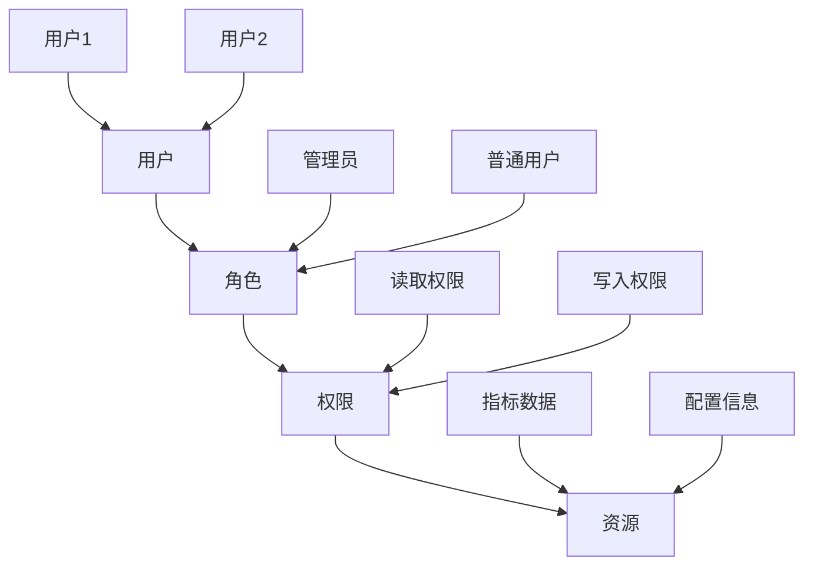
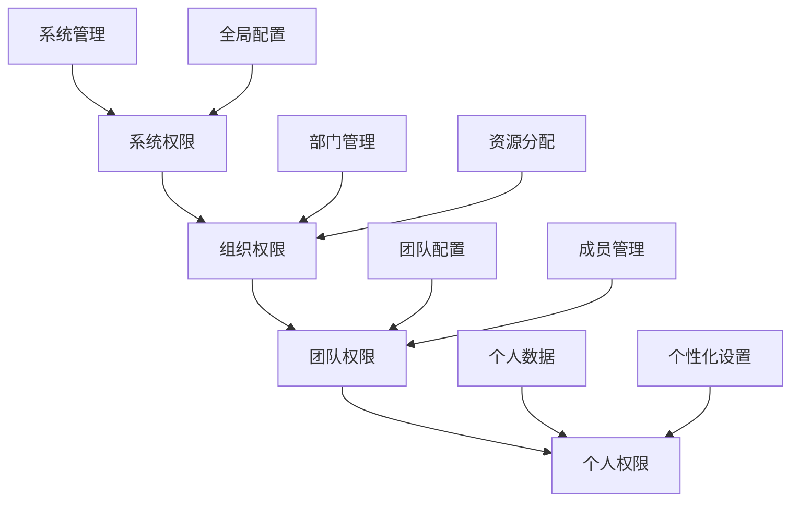
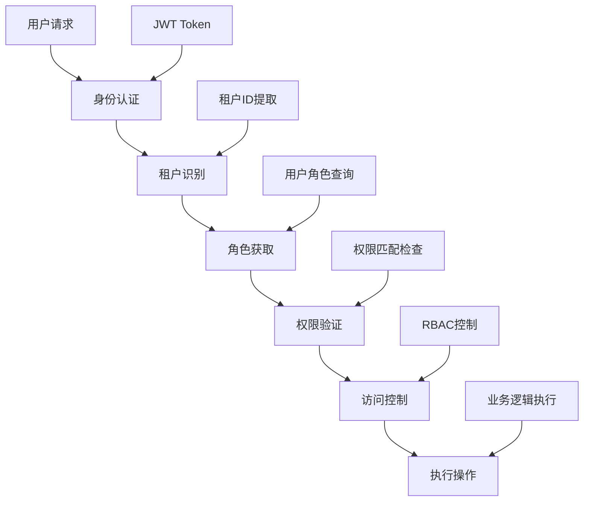
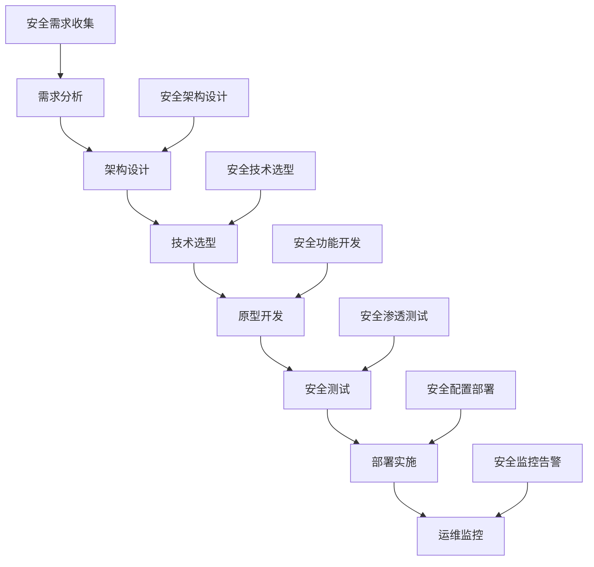

在企业级统一度量平台中，权限与数据安全是至关重要的组成部分。随着平台承载的数据量不断增加，涉及的用户和团队也日益增多，如何确保数据的安全性、实现细粒度的访问控制、支持多租户隔离成为平台设计的关键挑战。本节将深入探讨基于RBAC（基于角色的访问控制）的权限管理体系，以及多租户环境下的数据隔离与访问控制策略。

## 权限管理基础理论

### 1.1 访问控制模型

#### 1.1.1 DAC（自主访问控制）

```yaml
DAC特点:
  控制方式:
    - 资源所有者决定访问权限
    - 用户可以自主授权给其他用户
    - 权限传递性较强
  优势:
    - 灵活性高
    - 易于理解和使用
  劣势:
    - 安全性相对较弱
    - 权限管理复杂
    - 难以实现统一管控
```

#### 1.1.2 MAC（强制访问控制）

```yaml
MAC特点:
  控制方式:
    - 系统强制实施访问控制
    - 用户无法改变访问策略
    - 基于安全标签进行控制
  优势:
    - 安全性高
    - 控制严格
  劣势:
    - 灵活性差
    - 管理复杂
    - 适用于高安全要求场景
```

#### 1.1.3 RBAC（基于角色的访问控制）

```yaml
RBAC特点:
  控制方式:
    - 基于用户角色分配权限
    - 角色与权限关联
    - 用户与角色关联
  优势:
    - 管理简单
    - 易于维护
    - 支持权限继承
  劣势:
    - 灵活性相对较低
    - 角色设计需要精心规划
```

### 1.2 RBAC模型详解

#### 1.2.1 基本RBAC模型



#### 1.2.2 RBAC核心概念

```yaml
RBAC核心概念:
  用户(User):
    - 系统中的个体使用者
    - 可以被分配一个或多个角色
  角色(Role):
    - 一组权限的集合
    - 可以分配给一个或多个用户
  权限(Permission):
    - 对资源的操作许可
    - 包括操作类型和资源标识
  资源(Resource):
    - 系统中被保护的对象
    - 如数据、功能、服务等
```

## 多租户架构设计

### 2.1 多租户概念

#### 2.1.1 多租户定义

多租户是指一个软件实例为多个租户（客户或组织）提供服务的架构模式，每个租户的数据和配置相互隔离。

```yaml
多租户特征:
  数据隔离:
    - 每个租户的数据相互独立
    - 防止数据泄露和交叉访问
  配置独立:
    - 每个租户可独立配置
    - 支持个性化需求
  资源共享:
    - 共享基础设施和应用逻辑
    - 降低运营成本
  安全保障:
    - 确保租户间安全隔离
    - 防止恶意攻击和数据窃取
```

#### 2.1.2 多租户隔离级别

```yaml
隔离级别:
  物理隔离:
    - 为每个租户提供独立的硬件资源
    - 完全隔离，安全性最高
    - 成本最高，资源利用率低
  虚拟隔离:
    - 通过虚拟化技术实现隔离
    - 资源共享，成本适中
    - 安全性较高
  逻辑隔离:
    - 通过软件逻辑实现隔离
    - 资源共享程度最高
    - 成本最低，安全性相对较低
```

### 2.2 多租户实现方案

#### 2.2.1 独立数据库方案

```yaml
独立数据库方案:
  架构特点:
    - 每个租户拥有独立的数据库实例
    - 数据完全物理隔离
    - 支持不同的数据库配置
  优势:
    - 数据隔离性最好
    - 支持个性化数据库配置
    - 故障影响范围最小
  劣势:
    - 运维复杂度高
    - 资源利用率低
    - 成本较高
```

#### 2.2.2 共享数据库独立模式方案

```yaml
共享数据库独立模式:
  架构特点:
    - 所有租户共享同一个数据库
    - 每个租户拥有独立的模式(Schema)
    - 通过模式实现数据隔离
  优势:
    - 运维相对简单
    - 资源利用率较高
    - 成本适中
  劣势:
    - 隔离性不如独立数据库
    - 数据库层面的故障影响所有租户
```

#### 2.2.3 共享数据库共享模式方案

```yaml
共享数据库共享模式:
  架构特点:
    - 所有租户共享数据库和模式
    - 通过租户ID字段实现数据隔离
    - 所有查询必须包含租户ID条件
  优势:
    - 资源利用率最高
    - 运维最简单
    - 成本最低
  劣势:
    - 隔离性最差
    - 对应用层要求高
    - 容易出现数据泄露风险
```

## RBAC权限体系设计

### 3.1 权限模型设计

#### 3.1.1 权限层次结构



#### 3.1.2 权限粒度设计

```yaml
权限粒度:
  系统级权限:
    - 平台管理权限
    - 系统配置权限
    - 用户管理权限
  组织级权限:
    - 部门数据访问权限
    - 团队资源配置权限
    - 组织报表查看权限
  团队级权限:
    - 团队数据访问权限
    - 指标管理权限
    - 仪表板配置权限
  个人级权限:
    - 个人数据访问权限
    - 个性化设置权限
    - 个人报表查看权限
```

### 3.2 角色体系设计

#### 3.2.1 角色层次结构

```yaml
角色层次:
  超级管理员:
    - 拥有系统所有权限
    - 可以管理所有租户
    - 可以创建和修改角色
  租户管理员:
    - 管理单个租户的所有资源
    - 可以创建租户内角色
    - 管理租户内用户
  部门管理员:
    - 管理部门内资源
    - 管理部门内用户
    - 配置部门级指标
  团队负责人:
    - 管理团队内资源
    - 管理团队内用户
    - 配置团队级指标
  普通用户:
    - 访问授权的指标数据
    - 创建个人仪表板
    - 查看授权的报表
```

#### 3.2.2 角色继承关系

```java
public class Role {
    private String roleId;
    private String roleName;
    private String description;
    private Set<String> permissions;
    private Set<String> inheritedRoles;
    
    // 角色继承检查
    public boolean inheritsFrom(String parentRoleId) {
        if (inheritedRoles.contains(parentRoleId)) {
            return true;
        }
        
        for (String inheritedRoleId : inheritedRoles) {
            Role inheritedRole = RoleManager.getRole(inheritedRoleId);
            if (inheritedRole.inheritsFrom(parentRoleId)) {
                return true;
            }
        }
        
        return false;
    }
    
    // 权限合并
    public Set<String> getAllPermissions() {
        Set<String> allPermissions = new HashSet<>(permissions);
        
        for (String inheritedRoleId : inheritedRoles) {
            Role inheritedRole = RoleManager.getRole(inheritedRoleId);
            allPermissions.addAll(inheritedRole.getAllPermissions());
        }
        
        return allPermissions;
    }
}
```

### 3.3 权限验证机制

#### 3.3.1 权限检查流程



#### 3.3.2 权限验证实现

```java
@Component
public class PermissionChecker {
    
    public boolean checkPermission(String userId, String tenantId, String permission) {
        // 1. 获取用户角色
        Set<String> userRoles = getUserRoles(userId, tenantId);
        
        // 2. 检查权限
        for (String roleId : userRoles) {
            if (hasPermission(roleId, permission)) {
                return true;
            }
        }
        
        return false;
    }
    
    public void enforcePermission(String userId, String tenantId, String permission) {
        if (!checkPermission(userId, tenantId, permission)) {
            throw new AccessDeniedException(
                String.format("用户 %s 在租户 %s 中缺少权限 %s", 
                            userId, tenantId, permission));
        }
    }
    
    @PreAuthorize("@permissionChecker.checkPermission(authentication.name, #tenantId, 'METRIC_READ')")
    public MetricData getMetricData(String tenantId, String metricId) {
        // 业务逻辑实现
        return metricService.getMetric(tenantId, metricId);
    }
}
```

## 数据安全策略

### 4.1 数据加密

#### 4.1.1 传输加密

```yaml
传输加密:
  HTTPS协议:
    - 使用TLS 1.3协议
    - 配置强加密套件
    - 定期更新证书
  消息队列加密:
    - Kafka SSL配置
    - RabbitMQ TLS配置
  数据库连接加密:
    - JDBC SSL连接
    - 数据库SSL配置
```

#### 4.1.2 存储加密

```java
@Configuration
public class EncryptionConfig {
    
    @Bean
    public Encryptor dataEncryptor() {
        // AES-256加密
        return new AESEncryptor("your-secret-key");
    }
    
    // 敏感数据加密存储
    public class SensitiveDataEncryptor {
        private final Encryptor encryptor;
        
        public String encrypt(String plaintext) {
            return encryptor.encrypt(plaintext);
        }
        
        public String decrypt(String ciphertext) {
            return encryptor.decrypt(ciphertext);
        }
    }
}
```

### 4.2 数据脱敏

#### 4.2.1 脱敏策略

```yaml
脱敏策略:
  静态脱敏:
    - 数据存储时进行脱敏处理
    - 适用于非敏感环境数据
    - 脱敏规则固定
  动态脱敏:
    - 查询时根据权限动态脱敏
    - 适用于多权限环境
    - 脱敏规则灵活
```

#### 4.2.2 脱敏实现

```java
@Component
public class DataMasker {
    
    public String maskEmail(String email) {
        if (email == null || email.isEmpty()) {
            return email;
        }
        
        String[] parts = email.split("@");
        if (parts.length != 2) {
            return email;
        }
        
        String username = parts[0];
        String domain = parts[1];
        
        if (username.length() <= 2) {
            return "***@" + domain;
        }
        
        return username.substring(0, 2) + "***@" + domain;
    }
    
    public String maskPhoneNumber(String phone) {
        if (phone == null || phone.length() < 7) {
            return phone;
        }
        
        return phone.substring(0, 3) + "****" + phone.substring(7);
    }
    
    // 基于用户权限的数据脱敏
    public Object maskData(Object data, String userId, String permission) {
        if (permissionChecker.checkPermission(userId, "DATA_MASK_EXEMPT")) {
            return data; // 免脱敏权限
        }
        
        // 执行脱敏处理
        return applyMaskingRules(data);
    }
}
```

### 4.3 审计日志

#### 4.3.1 审计日志设计

```yaml
审计日志要素:
  操作信息:
    - 操作类型: 创建、读取、更新、删除
    - 操作时间: 精确到毫秒
    - 操作结果: 成功、失败
  用户信息:
    - 用户ID: 唯一标识符
    - 用户名: 登录用户名
    - 租户ID: 所属租户
  资源信息:
    - 资源类型: 指标、仪表板、配置等
    - 资源ID: 资源唯一标识
    - 资源名称: 资源名称
  环境信息:
    - IP地址: 操作来源IP
    - 用户代理: 客户端信息
    - 会话ID: 操作会话标识
```

#### 4.3.2 审计日志实现

```java
@Aspect
@Component
public class AuditLogger {
    
    @Around("@annotation(Auditable)")
    public Object auditOperation(ProceedingJoinPoint joinPoint) throws Throwable {
        AuditLog auditLog = new AuditLog();
        auditLog.setStartTime(System.currentTimeMillis());
        
        try {
            // 获取操作信息
            MethodSignature signature = (MethodSignature) joinPoint.getSignature();
            Auditable auditable = signature.getMethod().getAnnotation(Auditable.class);
            
            auditLog.setOperationType(auditable.operationType());
            auditLog.setResourceType(auditable.resourceType());
            
            // 获取用户信息
            Authentication auth = SecurityContextHolder.getContext().getAuthentication();
            auditLog.setUserId(auth.getName());
            auditLog.setTenantId(getCurrentTenantId());
            
            // 执行业务操作
            Object result = joinPoint.proceed();
            
            auditLog.setSuccess(true);
            auditLog.setEndTime(System.currentTimeMillis());
            
            // 记录审计日志
            auditLogRepository.save(auditLog);
            
            return result;
        } catch (Exception e) {
            auditLog.setSuccess(false);
            auditLog.setErrorMessage(e.getMessage());
            auditLog.setEndTime(System.currentTimeMillis());
            
            auditLogRepository.save(auditLog);
            
            throw e;
        }
    }
}
```

## 多租户数据隔离实现

### 5.1 租户识别机制

#### 5.1.1 租户识别方式

```yaml
租户识别方式:
  URL路径:
    - 通过URL路径识别租户
    - 如: https://tenant1.platform.com/
  子域名:
    - 通过子域名识别租户
    - 如: https://tenant1.platform.example.com/
  请求头:
    - 通过HTTP头识别租户
    - 如: X-Tenant-ID: tenant1
  JWT令牌:
    - 通过JWT claims识别租户
    - 如: tenant_id claim
```

#### 5.1.2 租户上下文管理

```java
@Component
public class TenantContext {
    private static final ThreadLocal<String> tenantId = new ThreadLocal<>();
    
    public static void setTenantId(String tenantId) {
        TenantContext.tenantId.set(tenantId);
    }
    
    public static String getTenantId() {
        return tenantId.get();
    }
    
    public static void clear() {
        tenantId.remove();
    }
}

@Component
public class TenantInterceptor implements HandlerInterceptor {
    
    @Override
    public boolean preHandle(HttpServletRequest request, 
                           HttpServletResponse response, 
                           Object handler) throws Exception {
        
        // 从请求中提取租户ID
        String tenantId = extractTenantId(request);
        
        if (tenantId == null) {
            response.sendError(HttpServletResponse.SC_BAD_REQUEST, "缺少租户标识");
            return false;
        }
        
        // 验证租户是否存在
        if (!tenantService.isTenantExists(tenantId)) {
            response.sendError(HttpServletResponse.SC_NOT_FOUND, "租户不存在");
            return false;
        }
        
        // 设置租户上下文
        TenantContext.setTenantId(tenantId);
        
        return true;
    }
    
    @Override
    public void afterCompletion(HttpServletRequest request, 
                              HttpServletResponse response, 
                              Object handler, Exception ex) throws Exception {
        // 清理租户上下文
        TenantContext.clear();
    }
}
```

### 5.2 数据访问层隔离

#### 5.2.1 数据库层面隔离

```java
@Configuration
public class MultiTenantConfiguration {
    
    @Bean
    @Primary
    public DataSource multiTenantDataSource() {
        MultiTenantDataSource dataSource = new MultiTenantDataSource();
        dataSource.setTargetDataSources(getTenantDataSources());
        dataSource.setDefaultTargetDataSource(getDefaultDataSource());
        dataSource.afterPropertiesSet();
        return dataSource;
    }
    
    private Map<Object, Object> getTenantDataSources() {
        Map<Object, Object> dataSources = new HashMap<>();
        
        // 为每个租户配置数据源
        List<Tenant> tenants = tenantService.getAllTenants();
        for (Tenant tenant : tenants) {
            DataSource tenantDataSource = createDataSourceForTenant(tenant);
            dataSources.put(tenant.getId(), tenantDataSource);
        }
        
        return dataSources;
    }
}

public class MultiTenantDataSource extends AbstractRoutingDataSource {
    @Override
    protected Object determineCurrentLookupKey() {
        return TenantContext.getTenantId();
    }
}
```

#### 5.2.2 应用层面隔离

```java
@Repository
public class MetricRepository {
    
    @Autowired
    private JdbcTemplate jdbcTemplate;
    
    public List<Metric> findByTenantId(String tenantId) {
        String sql = "SELECT * FROM metrics WHERE tenant_id = ?";
        return jdbcTemplate.query(sql, new Object[]{tenantId}, 
                                new MetricRowMapper());
    }
    
    public Metric findByIdAndTenantId(String id, String tenantId) {
        String sql = "SELECT * FROM metrics WHERE id = ? AND tenant_id = ?";
        try {
            return jdbcTemplate.queryForObject(sql, 
                                             new Object[]{id, tenantId}, 
                                             new MetricRowMapper());
        } catch (EmptyResultDataAccessException e) {
            return null;
        }
    }
    
    public void save(Metric metric) {
        // 自动注入租户ID
        metric.setTenantId(TenantContext.getTenantId());
        
        String sql = "INSERT INTO metrics (id, tenant_id, name, value, timestamp) VALUES (?, ?, ?, ?, ?)";
        jdbcTemplate.update(sql, 
                          metric.getId(), 
                          metric.getTenantId(), 
                          metric.getName(), 
                          metric.getValue(), 
                          metric.getTimestamp());
    }
}
```

## 安全最佳实践

### 6.1 身份认证

#### 6.1.1 多因素认证

```yaml
多因素认证:
  第一因素: 知识因素
    - 用户名和密码
    - 安全问题
  第二因素: 拥有因素
    - 手机短信验证码
    - 硬件令牌
    - 软件令牌
  第三因素: 生物因素
    - 指纹识别
    - 面部识别
    - 声纹识别
```

#### 6.1.2 单点登录

```java
@Configuration
@EnableWebSecurity
public class SecurityConfig extends WebSecurityConfigurerAdapter {
    
    @Override
    protected void configure(HttpSecurity http) throws Exception {
        http
            .authorizeRequests()
                .antMatchers("/api/public/**").permitAll()
                .anyRequest().authenticated()
                .and()
            .oauth2Login()
                .and()
            .oauth2ResourceServer()
                .jwt();
    }
    
    @Bean
    public JwtDecoder jwtDecoder() {
        // 配置JWT解码器
        return NimbusJwtDecoder.withJwkSetUri(jwkSetUri).build();
    }
}
```

### 6.2 访问控制

#### 6.2.1 API安全

```java
@RestController
@RequestMapping("/api/metrics")
public class MetricsController {
    
    @GetMapping("/{id}")
    @PreAuthorize("hasPermission('METRIC', 'READ')")
    public ResponseEntity<Metric> getMetric(@PathVariable String id) {
        String tenantId = TenantContext.getTenantId();
        Metric metric = metricService.findByIdAndTenantId(id, tenantId);
        
        if (metric == null) {
            return ResponseEntity.notFound().build();
        }
        
        return ResponseEntity.ok(metric);
    }
    
    @PostMapping
    @PreAuthorize("hasPermission('METRIC', 'WRITE')")
    public ResponseEntity<Metric> createMetric(@RequestBody Metric metric) {
        // 自动设置租户ID
        metric.setTenantId(TenantContext.getTenantId());
        
        Metric savedMetric = metricService.save(metric);
        return ResponseEntity.ok(savedMetric);
    }
}
```

#### 6.2.2 数据权限控制

```java
@Service
public class DataService {
    
    public List<DataRecord> getUserData(String userId) {
        String tenantId = TenantContext.getTenantId();
        
        // 获取用户可访问的数据范围
        Set<String> accessibleDataIds = getAccessibleDataIds(userId, tenantId);
        
        if (accessibleDataIds.isEmpty()) {
            return Collections.emptyList();
        }
        
        // 查询用户可访问的数据
        return dataRepository.findByIdsAndTenantId(accessibleDataIds, tenantId);
    }
    
    private Set<String> getAccessibleDataIds(String userId, String tenantId) {
        Set<String> dataIds = new HashSet<>();
        
        // 获取用户角色
        Set<String> roles = userRoleService.getUserRoles(userId, tenantId);
        
        for (String role : roles) {
            // 根据角色获取可访问的数据ID
            Set<String> roleDataIds = roleDataService.getRoleDataIds(role, tenantId);
            dataIds.addAll(roleDataIds);
        }
        
        return dataIds;
    }
}
```

## 实施案例

### 7.1 案例1：某云计算公司的多租户安全架构

该公司通过以下方案实现了安全的多租户架构：

1. **租户隔离**：
   - 采用共享数据库独立模式
   - 每个租户拥有独立的数据库模式
   - 所有查询强制包含租户ID

2. **权限管理**：
   - 基于RBAC实现细粒度权限控制
   - 支持角色继承和权限组合
   - 实现动态权限验证

3. **数据安全**：
   - 敏感数据传输和存储均加密
   - 实施动态数据脱敏
   - 建立完整的审计日志体系

### 7.2 案例2：某金融机构的安全管控体系

该机构通过以下方案实现了严格的安全管控：

1. **身份认证**：
   - 实施多因素认证
   - 集成企业LDAP系统
   - 支持生物特征识别

2. **访问控制**：
   - 基于零信任架构
   - 实施最小权限原则
   - 建立权限审批流程

3. **数据保护**：
   - 敏感数据全程加密
   - 实施数据分类分级
   - 建立数据泄露防护机制

## 实施建议

### 8.1 设计原则

1. **安全优先**：在架构设计阶段就考虑安全因素
2. **最小权限**：遵循最小权限原则，按需授权
3. **纵深防御**：实施多层次安全防护措施
4. **可审计性**：建立完整的审计和追溯机制

### 8.2 实施步骤



### 8.3 最佳实践

1. **定期安全评估**：定期进行安全评估和渗透测试
2. **安全培训**：加强团队安全意识和技能培训
3. **应急响应**：建立完善的安全应急响应机制
4. **合规遵循**：确保符合相关法律法规和行业标准

## 总结

权限与数据安全是企业级统一度量平台不可或缺的重要组成部分。通过基于RBAC的权限管理体系、多租户数据隔离机制、完善的数据安全策略以及严格的安全管控措施，平台能够有效保障数据安全，实现细粒度的访问控制，支持多租户环境下的安全运营。在实际实施过程中，需要根据业务特点和安全要求选择合适的方案，并建立持续的安全管理和优化机制，确保平台的长期安全稳定运行。

通过本章的学习，我们深入了解了权限管理的基础理论、多租户架构设计、RBAC权限体系、数据安全策略以及多租户数据隔离的实现方法。这些知识和实践经验将为构建安全可靠的企业级统一度量平台提供重要指导。