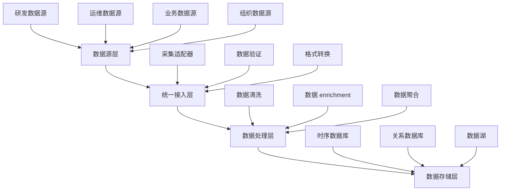

在构建企业级统一度量平台时，数据采集的首要挑战是如何有效地接入来自不同领域的多源数据。这些数据涵盖了研发、运维、业务和组织等多个维度，每种数据类型都有其独特的特征和采集需求。本节将深入探讨如何系统性地接入这些多源数据，确保平台能够全面反映企业的运营状况。

## 研发数据接入

### 1.1 研发数据特征

研发数据主要来源于软件开发和交付过程，具有以下特征：

```yaml
研发数据特征:
  实时性强:
    - 代码提交、构建、部署等事件实时发生
    - 需要近实时采集以保持数据新鲜度
  结构化程度高:
    - 大部分数据具有明确的结构和格式
    - 便于存储和分析处理
  关联性强:
    - 不同事件之间存在强关联关系
    - 如代码提交与构建任务的关联
  多样性:
    - 涵盖代码、构建、测试、部署等多个环节
    - 数据格式和来源多样化
```

### 1.2 主要数据源

#### 1.2.1 CI/CD系统（如Jenkins）

```yaml
Jenkins数据采集:
  采集内容:
    - 构建任务信息: 任务名称、触发方式、执行时间
    - 构建结果: 成功、失败、不稳定等状态
    - 构建耗时: 总耗时、各阶段耗时
    - 构建参数: 传递给构建任务的参数
    - 构建日志: 构建过程的详细日志信息
  采集方式:
    - Jenkins API: 通过REST API获取构建信息
    - Webhook: 通过Webhook实时接收构建事件
    - 插件扩展: 开发自定义插件采集特定数据
  实施要点:
    - 配置API访问权限
    - 处理API调用频率限制
    - 确保数据采集的完整性和一致性
```

#### 1.2.2 代码库（如Git）

```yaml
Git数据采集:
  采集内容:
    - 提交记录: 提交者、提交时间、提交信息
    - 代码变更: 新增、修改、删除的行数
    - 分支信息: 分支创建、合并、删除事件
    - 标签信息: 版本标签的创建和管理
    - 代码评审: Pull Request/Merge Request信息
  采集方式:
    - Git Hooks: 通过Git钩子实时捕获事件
    - API接口: 通过代码托管平台API获取数据
    - 日志分析: 分析Git操作日志
  实施要点:
    - 处理大规模代码库的性能问题
    - 确保代码评审数据的完整性
    - 建立代码贡献者的身份映射
```

#### 1.2.3 项目管理工具（如Jira）

```yaml
Jira数据采集:
  采集内容:
    - 任务信息: 任务类型、优先级、状态
    - 时间跟踪: 预估时间、实际耗时、剩余时间
    - 任务关系: 父子任务、依赖关系
    - 团队信息: 负责人、参与人、团队归属
    - 冲刺信息: 冲刺计划、完成情况、燃尽图
  采集方式:
    - REST API: 通过Jira REST API获取数据
    - Webhook: 通过Webhook实时接收变更事件
    - 数据导出: 定期导出数据进行批量处理
  实施要点:
    - 处理自定义字段的映射
    - 确保数据同步的及时性
    - 建立任务与代码提交的关联
```

#### 1.2.4 代码质量工具（如SonarQube）

```yaml
SonarQube数据采集:
  采集内容:
    - 代码质量指标: 代码覆盖率、复杂度、重复率
    - 代码异味: 潜在问题、坏味道
    - 安全漏洞: 安全相关的问题和风险
    - 技术债: 代码维护成本估算
    - 项目健康度: 综合质量评分
  采集方式:
    - API接口: 通过SonarQube API获取分析结果
    - Webhook: 通过Webhook接收分析完成通知
    - 数据库直连: 直接查询SonarQube数据库
  实施要点:
    - 处理多项目数据的组织
    - 确保质量指标的可比性
    - 建立质量趋势的跟踪机制
```

## 运维数据接入

### 2.1 运维数据特征

运维数据主要来源于系统运行和维护过程，具有以下特征：

```yaml
运维数据特征:
  时序性强:
    - 大部分数据按时间顺序产生
    - 适合时序数据库存储
  指标化:
    - 大部分数据以指标形式存在
    - 便于聚合和分析
  实时性要求高:
    - 系统监控需要实时或近实时数据
    - 告警依赖于及时的数据
  海量性:
    - 监控指标数据量巨大
    - 需要考虑存储和处理性能
```

### 2.2 主要数据源

#### 2.2.1 监控系统（如Prometheus/Zabbix）

```yaml
Prometheus数据采集:
  采集内容:
    - 系统指标: CPU、内存、磁盘、网络使用率
    - 应用指标: 响应时间、错误率、吞吐量
    - 业务指标: 订单量、用户数、收入等
    - 自定义指标: 业务特定的监控指标
  采集方式:
    - Exporter: 通过各种Exporter采集指标
    - Pushgateway: 支持短生命周期任务的指标推送
    - Service Discovery: 自动发现监控目标
  实施要点:
    - 合理设计指标命名规范
    - 控制指标数量和采样频率
    - 优化存储和查询性能
```

#### 2.2.2 日志系统（如ELK）

```yaml
ELK数据采集:
  采集内容:
    - 应用日志: 业务逻辑执行日志
    - 系统日志: 操作系统和中间件日志
    - 安全日志: 安全相关事件日志
    - 访问日志: 用户访问和API调用日志
  采集方式:
    - Filebeat: 文件日志采集
    - Logstash: 日志处理和转发
    - Kafka: 日志消息队列传输
  实施要点:
    - 设计统一的日志格式标准
    - 实现日志的结构化处理
    - 建立日志级别的分类管理
```

#### 2.2.3 链路追踪（如Jaeger、Zipkin）

```yaml
链路追踪数据采集:
  采集内容:
    - 调用链路: 服务间调用关系和耗时
    - 跨度信息: 每个操作的开始时间、结束时间
    - 标签信息: 业务相关的标签和注解
    - 错误信息: 调用过程中的错误详情
  采集方式:
    - SDK埋点: 在应用中集成追踪SDK
    - Sidecar代理: 通过Sidecar自动注入追踪
    - 服务网格: 在服务网格层面实现追踪
  实施要点:
    - 控制采样率以平衡性能和数据量
    - 建立Trace ID与业务ID的关联
    - 优化追踪数据的存储和查询
```

## 业务数据接入

### 3.1 业务数据特征

业务数据主要来源于企业的核心业务活动，具有以下特征：

```yaml
业务数据特征:
  价值密度高:
    - 直接反映业务价值和用户行为
    - 对决策支持具有重要意义
  多样性:
    - 涵盖用户行为、交易、营销等多个方面
    - 数据格式和结构多样化
  敏感性:
    - 包含用户隐私和商业机密
    - 需要严格的安全和隐私保护
  变化性:
    - 业务需求变化导致数据结构变化
    - 需要灵活的数据接入机制
```

### 3.2 主要数据源

#### 3.2.1 数据库

```yaml
数据库数据采集:
  采集内容:
    - 业务数据: 用户信息、订单信息、产品信息
    - 交易数据: 支付记录、退款记录、账务信息
    - 配置数据: 系统配置、业务规则、参数设置
  采集方式:
    - CDC: 基于变更数据捕获实时同步
    - 定时查询: 定期执行SQL查询获取数据
    - 数据导出: 通过数据导出工具获取数据
  实施要点:
    - 最小化对生产数据库的影响
    - 确保数据同步的完整性和一致性
    - 处理数据格式和结构的变化
```

#### 3.2.2 数据仓库

```yaml
数据仓库数据采集:
  采集内容:
    - 汇总数据: 按维度汇总的业务指标
    - 历史数据: 长期积累的历史业务数据
    - 分析数据: 经过加工处理的分析数据
  采集方式:
    - ETL工具: 使用ETL工具进行数据抽取
    - SQL查询: 直接执行SQL查询获取数据
    - API接口: 通过数据服务API获取数据
  实施要点:
    - 优化查询性能，减少资源消耗
    - 处理大数据量的分页和批量处理
    - 确保数据的安全访问控制
```

#### 3.2.3 产品分析工具（如埋点）

```yaml
产品分析数据采集:
  采集内容:
    - 用户行为: 页面浏览、按钮点击、功能使用
    - 转化漏斗: 用户在关键流程中的转化情况
    - 用户画像: 用户特征和偏好信息
    - 事件分析: 特定业务事件的发生情况
  采集方式:
    - SDK埋点: 在前端或移动端集成SDK
    - 后端埋点: 在服务端记录业务事件
    - 自动采集: 自动收集用户环境信息
  实施要点:
    - 设计统一的事件模型和参数规范
    - 控制埋点数据的质量和准确性
    - 平衡数据采集的全面性和性能影响
```

## 组织数据接入

### 4.1 组织数据特征

组织数据主要来源于企业内部的组织管理活动，具有以下特征：

```yaml
组织数据特征:
  稳定性:
    - 组织结构相对稳定，变化频率较低
    - 数据更新频率相对较低
  关系性:
    - 强调人员、团队、部门间的关系
    - 需要建立完整的关系网络
  敏感性:
    - 包含员工个人信息和组织架构
    - 需要严格的数据安全和隐私保护
  参考性:
    - 主要用于关联分析和维度补充
    - 通常作为其他数据的维度信息
```

### 4.2 主要数据源

#### 4.2.1 HR系统

```yaml
HR系统数据采集:
  采集内容:
    - 员工信息: 基本信息、职位、部门、入职时间
    - 组织架构: 部门结构、汇报关系、团队信息
    - 薪酬信息: 薪资水平、奖金、福利待遇
    - 绩效信息: 绩效考核结果、能力评估
  采集方式:
    - API接口: 通过HR系统API获取数据
    - 数据导出: 定期导出数据文件
    - 数据库直连: 直接连接HR系统数据库
  实施要点:
    - 确保数据采集的合规性和安全性
    - 处理员工信息的隐私保护
    - 建立数据更新和同步机制
```

#### 4.2.2 日历系统

```yaml
日历系统数据采集:
  采集内容:
    - 会议信息: 会议时间、参与人员、会议主题
    - 请假信息: 请假类型、时间、审批状态
    - 工作安排: 项目计划、任务分配、截止时间
  采集方式:
    - API接口: 通过日历系统API获取数据
    - iCal协议: 通过iCal协议同步日历数据
    - 邮件集成: 通过邮件系统集成日历信息
  实施要点:
    - 处理不同日历系统的格式差异
    - 确保敏感日程信息的安全保护
    - 建立日程与业务活动的关联
```

#### 4.2.3 IM工具

```yaml
IM工具数据采集:
  采集内容:
    - 沟通数据: 消息数量、响应时间、沟通频率
    - 群组信息: 群组成员、活跃度、话题分布
    - 协作数据: 文件共享、任务分配、决策过程
  采集方式:
    - API接口: 通过IM工具API获取数据
    - 机器人集成: 通过聊天机器人收集信息
    - 数据导出: 定期导出聊天记录和统计信息
  实施要点:
    - 尊重用户隐私，避免收集敏感内容
    - 聚焦于协作效率和团队沟通指标
    - 建立数据使用的透明度和合规性
```

## 数据接入架构设计

### 5.1 统一接入层



### 5.2 采集适配器设计

```java
public abstract class DataCollectorAdapter {
    protected DataSourceConfig config;
    protected DataValidator validator;
    protected DataTransformer transformer;
    
    public abstract void initialize(DataSourceConfig config);
    
    public abstract List<DataRecord> collectData(CollectParams params);
    
    public abstract DataSourceMetadata getMetadata();
    
    // 统一的数据处理流程
    protected List<DataRecord> processData(List<DataRecord> rawData) {
        // 1. 数据验证
        List<DataRecord> validatedData = validator.validate(rawData);
        
        // 2. 格式转换
        List<DataRecord> transformedData = transformer.transform(validatedData);
        
        // 3. 数据 enrichment
        List<DataRecord> enrichedData = enrichData(transformedData);
        
        return enrichedData;
    }
    
    protected List<DataRecord> enrichData(List<DataRecord> data) {
        // 添加通用的 enrich 逻辑
        for (DataRecord record : data) {
            // 添加采集时间戳
            record.setCollectedAt(System.currentTimeMillis());
            
            // 添加数据源信息
            record.setDataSource(config.getSourceId());
            
            // 添加租户信息
            record.setTenantId(TenantContext.getTenantId());
        }
        
        return data;
    }
}
```

## 实施案例

### 6.1 案例1：某互联网公司的多源数据接入

该公司通过以下方式实现了多源数据接入：

1. **研发数据接入**：
   - 集成Jenkins、GitLab、Jira、SonarQube等工具
   - 建立统一的DevOps数据模型
   - 实现代码提交与任务的自动关联

2. **运维数据接入**：
   - 部署Prometheus监控体系
   - 建立ELK日志分析平台
   - 集成Jaeger分布式追踪

3. **业务数据接入**：
   - 通过CDC实时同步核心业务数据库
   - 集成埋点SDK收集用户行为数据
   - 定期同步数据仓库汇总数据

4. **组织数据接入**：
   - 与HR系统集成获取组织架构
   - 集成企业微信获取沟通数据
   - 定期同步组织变更信息

### 6.2 案例2：某金融机构的数据接入实践

该机构通过以下方式实现了数据接入：

1. **严格的安全控制**：
   - 所有数据接入都经过安全审批
   - 敏感数据实施脱敏处理
   - 建立完善的数据访问日志

2. **合规性保障**：
   - 确保数据采集符合监管要求
   - 建立数据使用审批流程
   - 定期进行数据安全审计

3. **高质量数据**：
   - 实施数据质量检查机制
   - 建立数据异常告警体系
   - 定期进行数据质量评估

## 实施建议

### 7.1 接入策略

1. **分优先级接入**：根据业务价值和紧急程度确定接入优先级
2. **渐进式实施**：从核心数据源开始，逐步扩展到其他数据源
3. **标准化先行**：在接入数据前先建立数据标准和规范
4. **监控保障**：建立数据接入的监控和告警机制

### 7.2 技术选型

1. **成熟稳定**：选择成熟稳定的采集工具和框架
2. **生态完善**：优先选择生态完善的开源解决方案
3. **扩展性强**：考虑未来的扩展需求和技术演进
4. **成本可控**：平衡功能需求和实施成本

### 7.3 最佳实践

1. **文档完善**：建立完整的数据源接入文档
2. **测试充分**：在正式接入前进行充分的测试验证
3. **版本管理**：对采集配置和脚本进行版本管理
4. **持续优化**：根据使用情况持续优化采集策略

## 总结

多源数据接入是构建企业级统一度量平台的基础工作。通过系统性地接入研发、运维、业务和组织数据，平台能够全面反映企业的运营状况，为数据驱动决策提供坚实的基础。在实施过程中，需要根据数据特征选择合适的采集方式，建立统一的接入架构，并注重数据质量和安全合规。

在下一节中，我们将深入探讨各种数据采集方式，包括Agent、API拉取、消息队列订阅和SDK埋点等方法的详细实现和最佳实践。