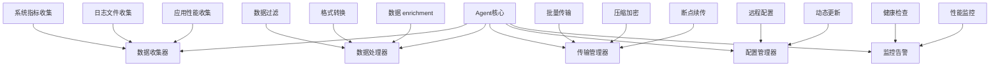
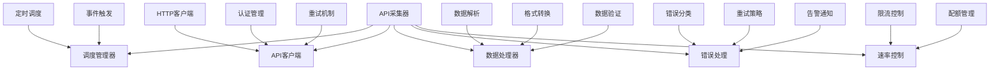
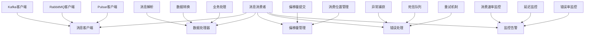
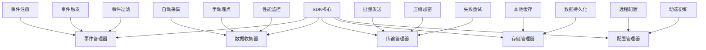

在企业级统一度量平台中，数据采集是连接数据源与平台核心的关键环节。不同的数据源和业务场景需要采用不同的采集方式，以确保数据能够高效、可靠地传输到平台中。本节将深入探讨四种主要的数据采集方式：Agent采集、API拉取、消息队列订阅和SDK埋点，分析它们的特点、适用场景以及实现方法。

## Agent采集方式

### 1.1 Agent采集概述

Agent采集是一种在数据源所在主机或环境中部署轻量级代理程序的采集方式。Agent负责收集本地数据并通过网络传输到中心平台。

```yaml
Agent采集特点:
  部署方式:
    - 在数据源主机上部署采集代理
    - 以守护进程或服务形式运行
    - 与数据源紧密耦合
  数据收集:
    - 实时收集本地系统指标
    - 收集日志文件内容
    - 监控应用性能数据
  传输方式:
    - 主动推送数据到中心平台
    - 支持批量传输和压缩
    - 实现断点续传和重试机制
```

### 1.2 Agent架构设计

#### 1.2.1 核心组件



#### 1.2.2 实现示例

```go
type Agent struct {
    config      *Config
    collectors  []Collector
    processor   *DataProcessor
    transmitter *DataTransmitter
    monitor     *HealthMonitor
}

func (a *Agent) Start() error {
    // 1. 初始化各组件
    if err := a.initialize(); err != nil {
        return err
    }
    
    // 2. 启动数据收集
    go a.startCollection()
    
    // 3. 启动数据传输
    go a.startTransmission()
    
    // 4. 启动健康监控
    go a.startMonitoring()
    
    return nil
}

func (a *Agent) startCollection() {
    ticker := time.NewTicker(a.config.CollectionInterval)
    
    for {
        select {
        case <-ticker.C:
            // 收集数据
            rawData := a.collectData()
            
            // 处理数据
            processedData := a.processor.Process(rawData)
            
            // 发送到传输队列
            a.transmitter.Enqueue(processedData)
            
        case <-a.ctx.Done():
            return
        }
    }
}

func (a *Agent) collectData() []DataRecord {
    var records []DataRecord
    
    // 并行收集各数据源数据
    var wg sync.WaitGroup
    resultChan := make(chan []DataRecord, len(a.collectors))
    
    for _, collector := range a.collectors {
        wg.Add(1)
        go func(c Collector) {
            defer wg.Done()
            data := c.Collect()
            resultChan <- data
        }(collector)
    }
    
    wg.Wait()
    close(resultChan)
    
    // 合并所有数据
    for data := range resultChan {
        records = append(records, data...)
    }
    
    return records
}
```

### 1.3 适用场景

```yaml
Agent采集适用场景:
  系统监控:
    - 服务器性能指标采集
    - 网络流量监控
    - 磁盘和内存使用情况
  日志收集:
    - 应用日志文件收集
    - 系统日志收集
    - 安全日志收集
  应用性能监控:
    - JVM指标收集
    - 数据库性能指标
    - 中间件运行状态
```

### 1.4 优势与挑战

```yaml
Agent采集优势:
  实时性强:
    - 能够实时收集数据
    - 响应速度快
  资源消耗低:
    - Agent轻量级设计
    - 对主机性能影响小
  部署灵活:
    - 支持多种操作系统
    - 可以灵活部署在不同环境中

Agent采集挑战:
  部署复杂度:
    - 需要在每台主机部署Agent
    - 版本管理和升级复杂
  安全风险:
    - Agent具有较高权限
    - 可能成为安全攻击目标
  维护成本:
    - 需要维护大量Agent实例
    - 故障排查和恢复复杂
```

## API拉取方式

### 2.1 API拉取概述

API拉取是一种通过调用数据源提供的API接口主动获取数据的采集方式。采集系统定期向数据源发送请求，获取最新的数据。

```yaml
API拉取特点:
  调用方式:
    - 主动调用数据源API
    - 支持RESTful、GraphQL等协议
    - 可以携带认证和授权信息
  数据获取:
    - 支持增量和全量数据获取
    - 可以指定数据过滤条件
    - 支持分页和批量处理
  传输安全:
    - 支持HTTPS加密传输
    - 可以实现请求签名和验证
    - 支持OAuth等认证机制
```

### 2.2 API拉取架构

#### 2.2.1 核心组件



#### 2.2.2 实现示例

```python
class APICollector:
    def __init__(self, config):
        self.config = config
        self.client = self._create_http_client()
        self.rate_limiter = RateLimiter(config.rate_limit)
        self.retry_manager = RetryManager(config.retry_config)
    
    def _create_http_client(self):
        session = requests.Session()
        # 配置认证信息
        if self.config.auth_type == 'bearer':
            session.headers.update({
                'Authorization': f'Bearer {self.config.token}'
            })
        elif self.config.auth_type == 'basic':
            session.auth = (self.config.username, self.config.password)
        
        return session
    
    def collect_data(self, endpoint, params=None):
        """采集API数据"""
        # 速率控制
        self.rate_limiter.wait()
        
        url = f"{self.config.base_url}/{endpoint}"
        attempt = 0
        
        while attempt < self.config.max_retries:
            try:
                response = self.client.get(url, params=params, timeout=30)
                response.raise_for_status()
                
                # 解析响应数据
                data = response.json()
                return self._process_data(data)
                
            except requests.exceptions.RequestException as e:
                attempt += 1
                if attempt >= self.config.max_retries:
                    raise APICollectException(f"API调用失败: {str(e)}")
                
                # 等待重试
                time.sleep(self.retry_manager.get_delay(attempt))
    
    def _process_data(self, raw_data):
        """处理原始数据"""
        processed_data = []
        
        # 数据验证
        if not self._validate_data(raw_data):
            raise DataValidationException("数据验证失败")
        
        # 格式转换
        for item in raw_data.get('items', []):
            record = DataRecord(
                id=item.get('id'),
                timestamp=item.get('created_at'),
                data=item,
                source=self.config.source_id
            )
            processed_data.append(record)
        
        return processed_data

class RateLimiter:
    def __init__(self, requests_per_second):
        self.rate = requests_per_second
        self.last_request_time = 0
    
    def wait(self):
        """等待以满足速率限制"""
        current_time = time.time()
        time_since_last_request = current_time - self.last_request_time
        
        # 计算需要等待的时间
        min_interval = 1.0 / self.rate
        if time_since_last_request < min_interval:
            sleep_time = min_interval - time_since_last_request
            time.sleep(sleep_time)
        
        self.last_request_time = time.time()
```

### 2.3 适用场景

```yaml
API拉取适用场景:
  SaaS服务数据:
    - 云服务提供商API数据
    - 第三方服务数据集成
    - 外部系统数据同步
  业务系统数据:
    - ERP系统数据
    - CRM系统数据
    - HR系统数据
  配置管理数据:
    - 系统配置信息
    - 业务规则定义
    - 权限配置信息
```

### 2.4 优势与挑战

```yaml
API拉取优势:
  标准化程度高:
    - 基于标准HTTP协议
    - 接口规范统一
    - 易于集成和维护
  安全性好:
    - 支持标准认证机制
    - 传输加密保障
    - 权限控制精细
  灵活性强:
    - 支持复杂查询条件
    - 可以获取特定字段
    - 支持数据分页处理

API拉取挑战:
  性能限制:
    - 受API调用频率限制
    - 网络延迟影响性能
    - 大量数据获取效率低
  依赖性强:
    - 依赖数据源API稳定性
    - API变更影响采集系统
    - 需要处理API版本兼容性
```

## 消息队列订阅方式

### 3.1 消息队列概述

消息队列订阅是一种通过订阅消息队列中的主题或队列来获取数据的采集方式。数据生产者将数据发送到消息队列，采集系统作为消费者订阅相关主题获取数据。

```yaml
消息队列特点:
  异步通信:
    - 生产者和消费者解耦
    - 支持异步数据传输
    - 提高系统可靠性
  可靠传输:
    - 支持消息持久化
    - 实现消息确认机制
    - 保证消息不丢失
  扩展性强:
    - 支持多消费者负载均衡
    - 可以水平扩展消费者
    - 支持消息分区和分片
```

### 3.2 消息队列架构

#### 3.2.1 核心组件



#### 3.2.2 实现示例

```java
@Component
public class KafkaDataConsumer {
    
    @Autowired
    private KafkaTemplate<String, String> kafkaTemplate;
    
    @Autowired
    private DataProcessor dataProcessor;
    
    @KafkaListener(topics = "${kafka.topics.metrics}", 
                   groupId = "${kafka.consumer.group}")
    public void consumeMetrics(ConsumerRecord<String, String> record) {
        try {
            // 解析消息
            MetricEvent event = parseMetricEvent(record.value());
            
            // 处理数据
            ProcessedData processedData = dataProcessor.process(event);
            
            // 存储数据
            dataStorage.save(processedData);
            
            // 提交偏移量
            acknowledge(record);
            
        } catch (DataProcessException e) {
            // 处理数据处理异常
            handleProcessError(record, e);
        } catch (Exception e) {
            // 处理其他异常
            handleGeneralError(record, e);
        }
    }
    
    private MetricEvent parseMetricEvent(String message) throws JsonProcessingException {
        ObjectMapper mapper = new ObjectMapper();
        return mapper.readValue(message, MetricEvent.class);
    }
    
    private void acknowledge(ConsumerRecord<String, String> record) {
        // 在自动提交模式下，Kafka会自动提交偏移量
        // 如果需要手动提交，可以在这里实现
        log.debug("消息处理完成，偏移量: {}", record.offset());
    }
    
    private void handleProcessError(ConsumerRecord<String, String> record, Exception e) {
        log.error("数据处理失败，消息内容: {}, 错误: {}", record.value(), e.getMessage());
        
        // 发送到死信队列
        sendToDeadLetterQueue(record, e);
        
        // 发送告警
        alertService.sendAlert("DATA_PROCESS_ERROR", 
                              String.format("消息处理失败: %s", e.getMessage()));
    }
}
```

### 3.3 适用场景

```yaml
消息队列适用场景:
  实时数据流:
    - 用户行为实时数据
    - 系统监控实时指标
    - 业务事件实时通知
  日志数据传输:
    - 应用日志实时传输
    - 系统日志集中收集
    - 安全日志实时监控
  事件驱动架构:
    - 微服务间事件传递
    - 业务流程事件通知
    - 状态变更实时同步
```

### 3.4 优势与挑战

```yaml
消息队列优势:
  高可靠性:
    - 消息持久化存储
    - 支持消息重试机制
    - 保证消息不丢失
  解耦合:
    - 生产者和消费者解耦
    - 支持异步处理
    - 提高系统灵活性
  可扩展性:
    - 支持水平扩展
    - 负载均衡处理
    - 支持分区并行处理

消息队列挑战:
  系统复杂度:
    - 需要维护消息队列集群
    - 配置和调优复杂
    - 故障排查困难
  性能开销:
    - 消息序列化反序列化开销
    - 网络传输延迟
    - 存储资源消耗
```

## SDK埋点方式

### 4.1 SDK埋点概述

SDK埋点是一种在应用程序中集成专门的软件开发工具包来收集数据的采集方式。通过在代码中调用SDK提供的API，应用程序可以将特定的业务事件和用户行为数据发送到数据平台。

```yaml
SDK埋点特点:
  侵入性:
    - 需要在应用代码中集成SDK
    - 需要修改应用代码
    - 对应用性能有一定影响
  精确性:
    - 可以精确控制采集时机
    - 可以采集详细的业务信息
    - 支持自定义事件和属性
  实时性:
    - 数据产生时立即采集
    - 支持实时传输
    - 延迟极低
```

### 4.2 SDK架构设计

#### 4.2.1 核心组件



#### 4.2.2 实现示例

```javascript
class AnalyticsSDK {
    constructor(config) {
        this.config = config;
        this.eventQueue = [];
        this.isInitialized = false;
        
        // 初始化SDK
        this.initialize();
    }
    
    initialize() {
        // 验证配置
        if (!this.config.apiKey) {
            throw new Error('API Key is required');
        }
        
        // 设置用户标识
        this.userId = this.config.userId || this.generateUserId();
        
        // 初始化存储
        this.storage = new LocalStorageManager();
        
        // 启动数据发送
        this.startDataTransmission();
        
        // 注册页面事件
        this.registerPageEvents();
        
        this.isInitialized = true;
    }
    
    // 手动埋点API
    track(event, properties = {}) {
        if (!this.isInitialized) {
            console.warn('SDK未初始化，事件将被缓存');
            this.eventQueue.push({ event, properties });
            return;
        }
        
        const eventData = {
            event: event,
            properties: {
                ...properties,
                timestamp: Date.now(),
                userId: this.userId,
                sessionId: this.getSessionId(),
                url: window.location.href,
                userAgent: navigator.userAgent
            }
        };
        
        // 添加到发送队列
        this.enqueueEvent(eventData);
    }
    
    // 自动采集页面浏览
    trackPageView(pageName, properties = {}) {
        this.track('page_view', {
            page_name: pageName,
            ...properties
        });
    }
    
    // 自动采集点击事件
    trackClick(element, properties = {}) {
        this.track('element_click', {
            element_id: element.id,
            element_class: element.className,
            element_text: element.textContent,
            ...properties
        });
    }
    
    enqueueEvent(eventData) {
        // 添加到本地存储（防止丢失）
        this.storage.saveEvent(eventData);
        
        // 发送到服务器
        this.sendEvent(eventData);
    }
    
    async sendEvent(eventData) {
        try {
            const response = await fetch(this.config.endpoint, {
                method: 'POST',
                headers: {
                    'Content-Type': 'application/json',
                    'X-API-Key': this.config.apiKey
                },
                body: JSON.stringify(eventData)
            });
            
            if (response.ok) {
                // 删除已发送的事件
                this.storage.removeEvent(eventData);
            } else {
                // 发送失败，保留事件用于重试
                console.warn('事件发送失败:', await response.text());
            }
        } catch (error) {
            // 网络错误，保留事件用于重试
            console.error('网络错误:', error);
        }
    }
    
    startDataTransmission() {
        // 定期发送缓存的事件
        setInterval(() => {
            const cachedEvents = this.storage.getEvents();
            if (cachedEvents.length > 0) {
                this.sendBatchEvents(cachedEvents);
            }
        }, this.config.batchInterval || 30000);
    }
    
    registerPageEvents() {
        // 页面加载完成事件
        window.addEventListener('load', () => {
            this.trackPageView(document.title);
        });
        
        // 页面卸载事件
        window.addEventListener('beforeunload', () => {
            this.track('page_unload');
        });
        
        // 点击事件代理
        document.addEventListener('click', (event) => {
            // 只采集特定元素的点击
            if (event.target.matches(this.config.clickSelectors || 'button, a')) {
                this.trackClick(event.target);
            }
        });
    }
}

// 使用示例
const analytics = new AnalyticsSDK({
    apiKey: 'your-api-key',
    endpoint: 'https://api.analytics.com/events',
    userId: 'user-123'
});

// 手动埋点
analytics.track('button_click', {
    button_name: 'submit',
    form_id: 'registration_form'
});

// 自动采集已集成
```

### 4.3 适用场景

```yaml
SDK埋点适用场景:
  用户行为分析:
    - 页面浏览行为
    - 按钮点击事件
    - 表单提交行为
  业务事件追踪:
    - 订单创建和支付
    - 用户注册和登录
    - 内容分享和传播
  应用性能监控:
    - 页面加载时间
    - API调用性能
    - 错误和异常捕获
```

### 4.4 优势与挑战

```yaml
SDK埋点优势:
  数据精确性:
    - 可以采集详细的业务信息
    - 支持自定义事件和属性
    - 数据质量高
  实时性强:
    - 数据产生时立即采集
    - 延迟极低
    - 支持实时分析
  灵活性高:
    - 可以根据业务需求定制
    - 支持复杂的事件逻辑
    - 易于扩展和维护

SDK埋点挑战:
  开发成本:
    - 需要修改应用代码
    - 集成和维护成本高
    - 需要开发人员参与
  性能影响:
    - 对应用性能有一定影响
    - 可能增加应用包大小
    - 网络请求影响用户体验
  数据一致性:
    - 不同版本SDK可能存在差异
    - 需要统一的埋点规范
    - 版本升级需要协调
```

## 采集方式选择指南

### 5.1 选择原则

```yaml
采集方式选择原则:
  数据特征匹配:
    - 根据数据特征选择合适的采集方式
    - 考虑数据产生频率和量级
    - 评估数据实时性要求
  技术可行性:
    - 评估技术实现的复杂度
    - 考虑现有技术栈的兼容性
    - 分析资源投入和维护成本
  业务需求:
    - 满足业务对数据质量和时效的要求
    - 考虑数据安全和合规性要求
    - 平衡功能需求和实施成本
```

### 5.2 场景匹配表

```yaml
采集方式场景匹配:
  Agent采集:
    适用场景: 系统监控、日志收集、应用性能监控
    优势: 实时性强、资源消耗低、部署灵活
    挑战: 部署复杂、安全风险、维护成本高
  
  API拉取:
    适用场景: SaaS服务数据、业务系统数据、配置管理
    优势: 标准化程度高、安全性好、灵活性强
    挑战: 性能限制、依赖性强、API变更影响
  
  消息队列:
    适用场景: 实时数据流、日志传输、事件驱动架构
    优势: 高可靠性、解耦合、可扩展性强
    挑战: 系统复杂度高、性能开销、维护成本
  
  SDK埋点:
    适用场景: 用户行为分析、业务事件追踪、应用性能监控
    优势: 数据精确性高、实时性强、灵活性高
    挑战: 开发成本高、性能影响、数据一致性
```

## 实施案例

### 6.1 案例1：某电商平台的数据采集架构

该平台采用多种采集方式构建了完整的数据采集体系：

1. **Agent采集**：
   - 部署Telegraf收集服务器性能指标
   - 使用Filebeat收集应用日志
   - 集成应用性能监控Agent

2. **API拉取**：
   - 定期拉取第三方支付平台数据
   - 同步物流服务商配送信息
   - 获取市场推广平台投放数据

3. **消息队列**：
   - 使用Kafka传输用户行为数据
   - 实时处理订单状态变更事件
   - 异步处理数据同步任务

4. **SDK埋点**：
   - 在Web和移动端集成埋点SDK
   - 采集用户浏览和交互行为
   - 追踪关键业务流程转化

### 6.2 案例2：某金融机构的数据采集实践

该机构根据金融行业的特殊要求，采用了以下采集策略：

1. **安全优先的Agent采集**：
   - 使用经过安全加固的Agent
   - 实施严格的访问控制和加密
   - 建立完善的审计和监控机制

2. **合规的API拉取**：
   - 通过安全认证的API接口获取数据
   - 实施数据脱敏和隐私保护
   - 建立数据使用审批流程

3. **可靠的队列订阅**：
   - 使用企业级消息队列服务
   - 实现消息的持久化和备份
   - 建立完善的错误处理机制

4. **精准的SDK埋点**：
   - 在合规框架内实施用户行为采集
   - 实施数据最小化原则
   - 建立用户同意和撤回机制

## 实施建议

### 7.1 技术选型建议

1. **成熟稳定**：选择经过验证的成熟技术方案
2. **生态完善**：优先选择生态完善的开源解决方案
3. **团队熟悉**：考虑团队的技术栈熟悉程度
4. **成本可控**：平衡功能需求和实施成本

### 7.2 架构设计建议

1. **统一接入层**：建立统一的数据采集接入层
2. **监控告警**：建立完善的采集监控和告警机制
3. **容错处理**：实现完善的错误处理和重试机制
4. **性能优化**：优化采集性能，减少对源系统的影响

### 7.3 运维管理建议

1. **版本管理**：对采集组件进行版本管理
2. **配置管理**：建立统一的配置管理中心
3. **日志审计**：建立完整的采集日志和审计机制
4. **持续优化**：根据使用情况持续优化采集策略

## 总结

不同的数据采集方式各有其特点和适用场景。Agent采集适合系统级数据收集，API拉取适合标准化数据获取，消息队列订阅适合实时数据流处理，SDK埋点适合精确的业务事件采集。在实际应用中，往往需要结合多种采集方式，构建完整的数据采集体系。

通过合理选择和组合这些采集方式，企业可以构建高效、可靠、安全的数据采集系统，为统一度量平台提供高质量的数据支撑。在实施过程中，需要根据具体的业务需求、技术环境和资源约束，制定合适的采集策略和技术方案。

在下一节中，我们将探讨数据标准化与规范化的重要性，以及如何定义统一的指标模型。