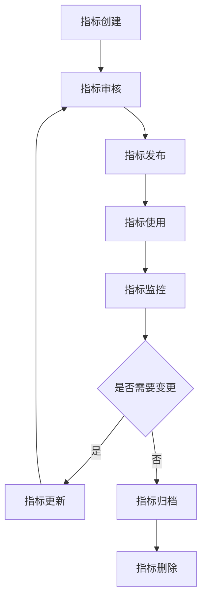
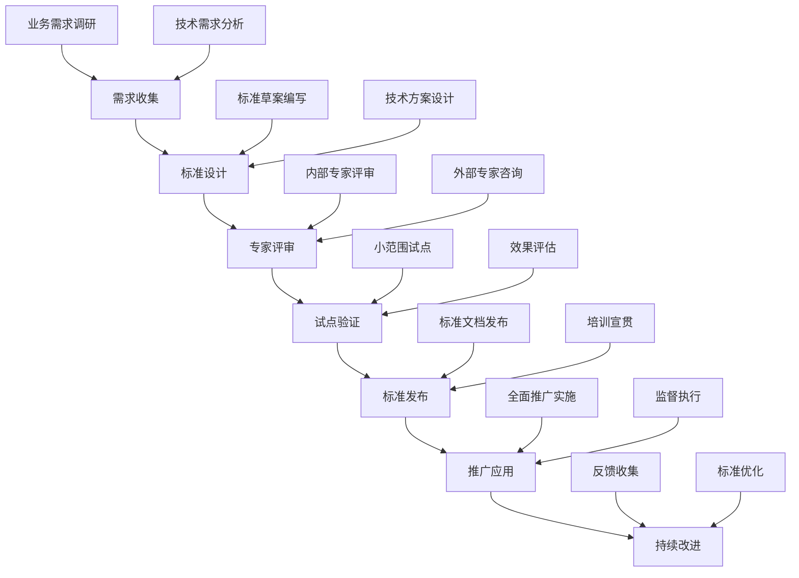

在企业级统一度量平台中，数据标准化与规范化是确保数据质量、提高数据可用性和实现数据整合的关键环节。随着数据源的多样化和数据量的爆炸式增长，如果没有统一的标准和规范，数据将变得难以管理、分析和应用。本节将深入探讨数据标准化与规范化的重要性，以及如何定义统一的指标模型，为构建高质量的度量平台奠定基础。

## 数据标准化的重要性

### 1.1 数据标准化的定义

数据标准化是指建立统一的数据格式、结构、命名规则和质量标准，确保来自不同来源的数据具有一致性和可比性。它是数据治理的核心组成部分，对于构建可靠的数据驱动决策体系至关重要。

```yaml
数据标准化要素:
  格式标准化:
    - 统一数据格式和编码
    - 规范数据结构和模式
    - 标准化时间格式和单位
  命名标准化:
    - 统一指标命名规则
    - 规范字段命名约定
    - 建立业务术语字典
  质量标准化:
    - 定义数据质量标准
    - 建立数据验证规则
    - 实施数据质量监控
  语义标准化:
    - 统一业务概念定义
    - 建立指标计算逻辑
    - 规范数据含义解释
```

### 1.2 数据标准化的价值

#### 1.2.1 提高数据质量

```yaml
数据质量提升:
  准确性:
    - 通过标准化减少数据错误
    - 建立数据验证机制
    - 实施数据清洗规则
  完整性:
    - 规范必填字段要求
    - 建立数据补全机制
    - 实施数据完整性检查
  一致性:
    - 统一数据定义和计算
    - 消除数据歧义
    - 确保跨系统数据一致
```

#### 1.2.2 降低集成成本

```yaml
集成成本降低:
  开发效率:
    - 减少数据处理代码重复
    - 提高开发效率
    - 降低维护成本
  系统兼容:
    - 提高系统间兼容性
    - 简化数据交换过程
    - 减少接口适配工作
  扩展性:
    - 支持新数据源快速接入
    - 降低系统改造成本
    - 提高平台可扩展性
```

#### 1.2.3 增强分析能力

```yaml
分析能力增强:
  跨域分析:
    - 支持跨业务域数据分析
    - 实现多维度关联分析
    - 提高分析结果准确性
  复用性:
    - 提高分析模型复用率
    - 减少重复开发工作
    - 加速分析应用上线
  可解释性:
    - 提高分析结果可解释性
    - 增强业务理解度
    - 支持决策过程透明化
```

## 指标模型设计原则

### 2.1 指标模型核心概念

#### 2.1.1 指标定义

指标是用于衡量、评估和监控业务活动、系统性能或组织效能的量化标准。一个完整的指标定义应包含以下要素：

```yaml
指标定义要素:
  基本信息:
    - 指标名称: 唯一标识指标的名称
    - 指标描述: 对指标含义的详细说明
    - 指标类型: 指标的分类（如计数、比率、金额等）
    - 计量单位: 指标的计量单位（如次、%、元等）
  计算逻辑:
    - 计算公式: 指标的计算方法和公式
    - 数据来源: 指标数据的来源系统
    - 计算频率: 指标的计算和更新频率
    - 聚合方式: 数据聚合的方法（如求和、平均等）
  业务属性:
    - 业务域: 指标所属的业务领域
    - 责任人: 指标的负责人或团队
    - 关联指标: 与该指标相关的其他指标
    - 使用场景: 指标的主要使用场景
```

#### 2.1.2 指标分类体系

```yaml
指标分类体系:
  按业务域分类:
    - 研发效能类: 交付周期、代码质量、部署频率等
    - 运维稳定性类: 系统可用性、故障率、响应时间等
    - 业务价值类: 收入、用户增长、转化率等
    - 组织效能类: 员工满意度、团队协作效率等
  按数据特性分类:
    - 计数型指标: 表示数量或次数的指标
    - 比率型指标: 表示比例或百分比的指标
    - 金额型指标: 表示货币价值的指标
    - 时间型指标: 表示时间或持续时间的指标
  按时效性分类:
    - 实时指标: 需要实时计算和展示的指标
    - 准实时指标: 有一定延迟但接近实时的指标
    - 批处理指标: 定期批量计算的指标
```

### 2.2 指标模型设计原则

#### 2.2.1 MECE原则

```yaml
MECE原则应用:
  相互独立:
    - 指标间避免重复和重叠
    - 每个指标有明确的边界
    - 消除指标间的冗余
  完全穷尽:
    - 覆盖所有关键业务领域
    - 不遗漏重要指标维度
    - 形成完整的指标体系
```

#### 2.2.2 SMART原则

```yaml
SMART原则应用:
  Specific(具体):
    - 指标定义明确具体
    - 避免模糊和歧义
    - 具有明确的业务含义
  Measurable(可度量):
    - 指标可以量化测量
    - 有明确的计算方法
    - 支持数据采集和存储
  Achievable(可实现):
    - 指标数据可以获取
    - 计算逻辑可实现
    - 技术上可行
  Relevant(相关):
    - 指标与业务目标相关
    - 能够指导业务决策
    - 具有实际应用价值
  Time-bound(有时限):
    - 明确指标计算周期
    - 定义数据更新频率
    - 支持趋势分析
```

#### 2.2.3 可扩展性原则

```yaml
可扩展性设计:
  模块化设计:
    - 指标模型支持模块化扩展
    - 可以动态添加新指标
    - 支持指标版本管理
  标准化接口:
    - 提供标准化的指标注册接口
    - 支持指标配置管理
    - 实现指标生命周期管理
  兼容性设计:
    - 支持向后兼容
    - 提供指标迁移机制
    - 降低升级成本
```

## 统一指标模型设计

### 3.1 指标模型架构

#### 3.1.1 核心模型结构

```json
{
  "metricModel": {
    "id": "metric_model_v1",
    "version": "1.0",
    "name": "统一指标模型",
    "description": "企业级统一度量平台指标模型定义",
    "metadata": {
      "createdBy": "system",
      "createdAt": "2025-01-01T00:00:00Z",
      "updatedBy": "system",
      "updatedAt": "2025-01-01T00:00:00Z"
    },
    "schema": {
      "metric": {
        "id": {
          "type": "string",
          "required": true,
          "description": "指标唯一标识符"
        },
        "name": {
          "type": "string",
          "required": true,
          "description": "指标名称"
        },
        "description": {
          "type": "string",
          "required": true,
          "description": "指标描述"
        },
        "category": {
          "type": "string",
          "required": true,
          "description": "指标分类"
        },
        "type": {
          "type": "string",
          "enum": ["counter", "gauge", "histogram", "summary"],
          "required": true,
          "description": "指标类型"
        },
        "unit": {
          "type": "string",
          "description": "计量单位"
        },
        "dataSource": {
          "type": "object",
          "properties": {
            "type": {
              "type": "string",
              "enum": ["database", "api", "log", "event"],
              "description": "数据源类型"
            },
            "connection": {
              "type": "string",
              "description": "数据源连接信息"
            },
            "query": {
              "type": "string",
              "description": "数据查询语句"
            }
          },
          "required": ["type"]
        },
        "calculation": {
          "type": "object",
          "properties": {
            "expression": {
              "type": "string",
              "description": "计算表达式"
            },
            "aggregation": {
              "type": "string",
              "enum": ["sum", "avg", "max", "min", "count"],
              "description": "聚合方式"
            },
            "timeWindow": {
              "type": "string",
              "description": "时间窗口"
            }
          }
        },
        "tags": {
          "type": "array",
          "items": {
            "type": "string"
          },
          "description": "指标标签"
        },
        "owner": {
          "type": "string",
          "description": "指标负责人"
        },
        "sla": {
          "type": "object",
          "properties": {
            "freshness": {
              "type": "string",
              "description": "数据新鲜度要求"
            },
            "availability": {
              "type": "number",
              "minimum": 0,
              "maximum": 100,
              "description": "数据可用性要求(%)"
            }
          }
        }
      }
    }
  }
}
```

#### 3.1.2 指标注册示例

```yaml
指标注册示例:
  系统CPU使用率:
    id: "system.cpu.usage"
    name: "系统CPU使用率"
    description: "系统CPU使用率百分比"
    category: "系统监控"
    type: "gauge"
    unit: "%"
    dataSource:
      type: "api"
      connection: "prometheus://monitoring-system:9090"
      query: "100 - (avg by (instance) (irate(node_cpu_seconds_total{mode=\"idle\"}[5m])) * 100)"
    calculation:
      aggregation: "avg"
      timeWindow: "5m"
    tags: ["system", "performance", "cpu"]
    owner: "ops-team"
    sla:
      freshness: "1m"
      availability: 99.9

  用户注册数:
    id: "business.user.registration.count"
    name: "用户注册数"
    description: "每日新用户注册数量"
    category: "业务指标"
    type: "counter"
    unit: "个"
    dataSource:
      type: "database"
      connection: "mysql://user-db:3306/analytics"
      query: "SELECT COUNT(*) FROM users WHERE DATE(created_at) = CURDATE()"
    calculation:
      aggregation: "sum"
      timeWindow: "1d"
    tags: ["business", "user", "registration"]
    owner: "growth-team"
    sla:
      freshness: "1h"
      availability: 99.5
```

### 3.2 指标模型管理

#### 3.2.1 指标生命周期管理



#### 3.2.2 指标版本控制

```java
@Entity
@Table(name = "metric_definitions")
public class MetricDefinition {
    @Id
    private String id;
    
    private String name;
    private String description;
    private String category;
    private String type;
    private String unit;
    
    @Embedded
    private DataSourceConfig dataSource;
    
    @Embedded
    private CalculationConfig calculation;
    
    @ElementCollection
    private List<String> tags;
    
    private String owner;
    
    @Embedded
    private SLAConfig sla;
    
    private String version;
    private String status; // DRAFT, REVIEW, PUBLISHED, ARCHIVED
    
    @CreationTimestamp
    private LocalDateTime createdAt;
    
    @UpdateTimestamp
    private LocalDateTime updatedAt;
    
    @Version
    private Long versionNumber;
    
    // getter和setter方法
}

@Service
public class MetricDefinitionService {
    
    public MetricDefinition createMetric(MetricDefinition definition) {
        definition.setVersion("1.0");
        definition.setStatus("DRAFT");
        return metricRepository.save(definition);
    }
    
    public MetricDefinition publishMetric(String id) {
        MetricDefinition definition = metricRepository.findById(id);
        definition.setStatus("PUBLISHED");
        definition.setVersion(generateVersion(definition.getVersion()));
        return metricRepository.save(definition);
    }
    
    public MetricDefinition updateMetric(String id, MetricDefinition updatedDefinition) {
        MetricDefinition existing = metricRepository.findById(id);
        if (!"DRAFT".equals(existing.getStatus()) && !"REVIEW".equals(existing.getStatus())) {
            throw new IllegalStateException("只有草稿或审核中的指标可以更新");
        }
        
        // 更新字段
        existing.setName(updatedDefinition.getName());
        existing.setDescription(updatedDefinition.getDescription());
        // ... 其他字段更新
        
        existing.setVersion(generateVersion(existing.getVersion()));
        existing.setStatus("DRAFT");
        
        return metricRepository.save(existing);
    }
}
```

## 数据标准化实施

### 4.1 标准化流程

#### 4.1.1 标准制定流程



#### 4.1.2 标准化检查清单

```yaml
数据标准化检查清单:
  命名规范检查:
    - 指标命名是否符合规范
    - 字段命名是否统一
    - 业务术语是否标准化
  格式规范检查:
    - 时间格式是否统一
    - 数值格式是否规范
    - 文本编码是否一致
  质量规范检查:
    - 数据完整性是否满足要求
    - 数据准确性是否达标
    - 数据一致性是否保证
  语义规范检查:
    - 业务含义是否明确
    - 计算逻辑是否清晰
    - 指标定义是否准确
```

### 4.2 标准化工具

#### 4.2.1 数据质量监控工具

```python
class DataQualityMonitor:
    def __init__(self, config):
        self.config = config
        self.rules = self.load_quality_rules()
    
    def check_data_quality(self, data, metric_id):
        """检查数据质量"""
        metric_config = self.get_metric_config(metric_id)
        quality_report = DataQualityReport()
        
        # 完整性检查
        completeness_score = self.check_completeness(data, metric_config)
        quality_report.add_score('completeness', completeness_score)
        
        # 准确性检查
        accuracy_score = self.check_accuracy(data, metric_config)
        quality_report.add_score('accuracy', accuracy_score)
        
        # 一致性检查
        consistency_score = self.check_consistency(data, metric_config)
        quality_report.add_score('consistency', consistency_score)
        
        # 及时性检查
        timeliness_score = self.check_timeliness(data, metric_config)
        quality_report.add_score('timeliness', timeliness_score)
        
        return quality_report
    
    def check_completeness(self, data, config):
        """检查数据完整性"""
        required_fields = config.get('required_fields', [])
        total_records = len(data)
        complete_records = 0
        
        for record in data:
            is_complete = True
            for field in required_fields:
                if field not in record or record[field] is None:
                    is_complete = False
                    break
            if is_complete:
                complete_records += 1
        
        return (complete_records / total_records) * 100 if total_records > 0 else 0
    
    def check_accuracy(self, data, config):
        """检查数据准确性"""
        validation_rules = config.get('validation_rules', [])
        total_records = len(data)
        accurate_records = 0
        
        for record in data:
            is_accurate = True
            for rule in validation_rules:
                if not self.validate_record(record, rule):
                    is_accurate = False
                    break
            if is_accurate:
                accurate_records += 1
        
        return (accurate_records / total_records) * 100 if total_records > 0 else 0
    
    def validate_record(self, record, rule):
        """验证单条记录"""
        field = rule['field']
        operator = rule['operator']
        value = rule['value']
        
        record_value = record.get(field)
        if record_value is None:
            return False
        
        if operator == 'equals':
            return record_value == value
        elif operator == 'greater_than':
            return record_value > value
        elif operator == 'less_than':
            return record_value < value
        # ... 其他操作符实现
        
        return True
```

#### 4.2.2 数据转换工具

```java
@Component
public class DataTransformer {
    
    public TransformedData transform(DataRecord rawRecord, TransformConfig config) {
        TransformedData transformedData = new TransformedData();
        
        // 字段映射
        Map<String, String> fieldMapping = config.getFieldMapping();
        for (Map.Entry<String, String> entry : fieldMapping.entrySet()) {
            String sourceField = entry.getKey();
            String targetField = entry.getValue();
            
            Object value = rawRecord.get(sourceField);
            if (value != null) {
                // 数据类型转换
                Object convertedValue = convertDataType(value, config.getDataType(targetField));
                transformedData.set(targetField, convertedValue);
            }
        }
        
        // 数据 enrichment
        enrichData(transformedData, config.getEnrichmentRules());
        
        // 数据验证
        if (!validateData(transformedData, config.getValidationRules())) {
            throw new DataValidationException("数据验证失败");
        }
        
        return transformedData;
    }
    
    private Object convertDataType(Object value, DataType targetType) {
        switch (targetType) {
            case STRING:
                return value.toString();
            case INTEGER:
                return Integer.valueOf(value.toString());
            case DOUBLE:
                return Double.valueOf(value.toString());
            case BOOLEAN:
                return Boolean.valueOf(value.toString());
            case TIMESTAMP:
                return parseTimestamp(value.toString());
            default:
                return value;
        }
    }
    
    private void enrichData(TransformedData data, List<EnrichmentRule> rules) {
        for (EnrichmentRule rule : rules) {
            Object enrichedValue = rule.apply(data);
            data.set(rule.getTargetField(), enrichedValue);
        }
    }
    
    private boolean validateData(TransformedData data, List<ValidationRule> rules) {
        for (ValidationRule rule : rules) {
            if (!rule.validate(data)) {
                return false;
            }
        }
        return true;
    }
}
```

## 实施案例

### 5.1 案例1：某互联网公司的指标标准化实践

该公司通过以下方式实现了指标标准化：

1. **建立指标管理体系**：
   - 制定了统一的指标命名规范
   - 建立了指标分类体系
   - 实现了指标的全生命周期管理

2. **实施数据标准化**：
   - 统一了时间格式和单位标准
   - 建立了业务术语字典
   - 实施了数据质量监控机制

3. **构建指标模型**：
   - 设计了统一的指标模型结构
   - 实现了指标的版本控制
   - 建立了指标注册和发现机制

### 5.2 案例2：某金融机构的数据标准化经验

该机构通过以下方式实现了数据标准化：

1. **严格的合规要求**：
   - 制定了符合监管要求的数据标准
   - 建立了数据质量评估体系
   - 实施了数据血缘追踪机制

2. **完善的治理流程**：
   - 建立了数据标准制定流程
   - 实施了标准执行监督机制
   - 建立了持续改进机制

3. **先进的技术工具**：
   - 部署了数据质量监控平台
   - 实现了自动化数据转换工具
   - 建立了数据标准化检查工具

## 实施建议

### 6.1 实施策略

1. **分步实施**：从核心业务领域开始，逐步扩展到其他领域
2. **试点先行**：选择典型场景进行试点，验证标准的可行性
3. **持续改进**：根据实施效果持续优化标准和流程
4. **全员参与**：确保各相关部门和人员参与标准制定和实施

### 6.2 技术选型

1. **成熟稳定**：选择经过验证的成熟技术和工具
2. **开放标准**：优先选择支持开放标准的解决方案
3. **可扩展性**：考虑未来的扩展需求和技术演进
4. **成本效益**：平衡功能需求和实施成本

### 6.3 最佳实践

1. **文档完善**：建立完整的标准文档和实施指南
2. **培训宣贯**：加强相关人员的培训和宣贯
3. **监控评估**：建立标准执行的监控和评估机制
4. **激励机制**：建立标准执行的激励和约束机制

## 总结

数据标准化与规范化是构建企业级统一度量平台的基础工作。通过建立统一的指标模型、实施严格的数据标准和规范，可以显著提高数据质量、降低集成成本、增强分析能力。在实施过程中，需要遵循科学的设计原则，采用合适的实施策略，并建立完善的管理机制。

统一指标模型的设计不仅要考虑当前的业务需求，还要具备良好的可扩展性和兼容性，以适应未来业务的发展变化。通过持续的标准化工作，企业可以构建起高质量的数据资产，为数据驱动决策提供坚实的基础。

在下一节中，我们将探讨数据存储与计算的相关内容，包括存储选型、计算引擎、数据质量管理和元数据管理等方面的内容。