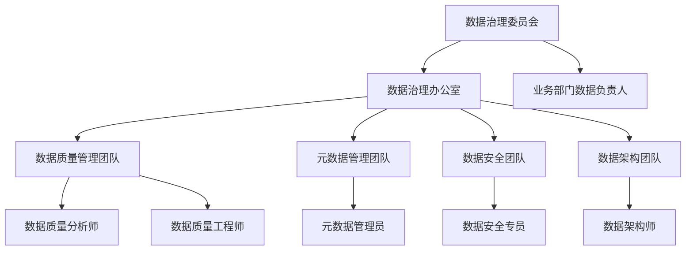
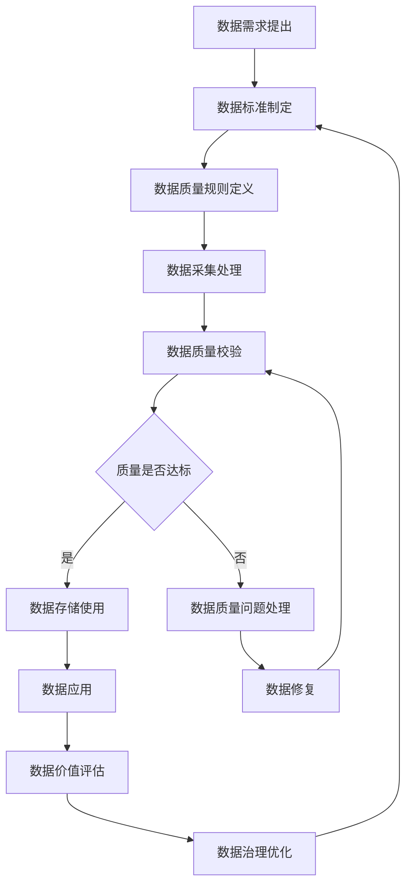

在企业级统一度量平台中，数据质量是决定平台价值和可信度的关键因素。低质量的数据不仅会影响业务决策的准确性，还可能导致严重的业务风险。数据质量管理与治理是确保数据质量、提升数据价值的重要手段。本节将深入探讨数据质量管理的核心要素，包括完整性、准确性、及时性校验，以及如何建立完善的数据治理体系。

## 数据质量管理概述

### 1.1 数据质量的定义

数据质量是指数据满足特定业务需求和使用目的的程度。高质量的数据应该具备准确性、完整性、一致性、及时性等特征，能够为业务决策提供可靠的支持。

```yaml
数据质量维度:
  完整性:
    - 数据记录是否完整
    - 必填字段是否填充
    - 数据是否缺失
  准确性:
    - 数据是否真实反映实际情况
    - 数据计算是否正确
    - 数据格式是否规范
  一致性:
    - 相同数据在不同系统中是否一致
    - 数据定义是否统一
    - 数据关系是否正确
  及时性:
    - 数据是否按时更新
    - 数据是否反映最新状态
    - 数据处理是否及时
  可理解性:
    - 数据含义是否清晰
    - 数据结构是否明确
    - 元数据是否完整
  可信度:
    - 数据来源是否可靠
    - 数据处理过程是否透明
    - 数据是否经过验证
```

### 1.2 数据质量管理的重要性

#### 1.2.1 业务价值

```yaml
业务价值:
  决策支持:
    - 提高决策准确性
    - 降低决策风险
    - 增强决策信心
  运营效率:
    - 减少数据错误导致的返工
    - 提高业务流程效率
    - 降低运营成本
  客户体验:
    - 提供准确的客户信息
    - 改善客户服务体验
    - 增强客户信任
```

#### 1.2.2 技术价值

```yaml
技术价值:
  系统稳定性:
    - 减少因数据错误导致的系统异常
    - 提高系统处理效率
    - 降低维护成本
  分析效果:
    - 提高分析结果的准确性
    - 增强模型训练效果
    - 支持更复杂的分析场景
```

## 数据完整性校验

### 2.1 完整性校验原则

数据完整性是指数据记录的完整程度，包括记录完整性、字段完整性和关联完整性。

```yaml
完整性校验原则:
  记录完整性:
    - 确保所有预期的记录都存在
    - 检查是否有记录丢失
    - 验证数据采集的完整性
  字段完整性:
    - 确保必填字段都有值
    - 检查字段值是否符合预期格式
    - 验证字段间的逻辑关系
  关联完整性:
    - 确保关联数据的一致性
    - 检查外键约束
    - 验证数据间的引用关系
```

### 2.2 完整性校验实现

#### 2.2.1 基于规则的校验

```python
class DataIntegrityValidator:
    def __init__(self, rules_config):
        self.rules = self._load_rules(rules_config)
    
    def validate_completeness(self, data, table_name):
        """完整性校验"""
        validation_result = {
            'table': table_name,
            'total_records': len(data),
            'validation_time': datetime.now(),
            'issues': []
        }
        
        # 获取表的完整性规则
        table_rules = self.rules.get(table_name, {})
        completeness_rules = table_rules.get('completeness', [])
        
        for rule in completeness_rules:
            field_name = rule['field']
            rule_type = rule['type']
            
            if rule_type == 'required':
                missing_count = self._check_required_field(data, field_name)
                if missing_count > 0:
                    validation_result['issues'].append({
                        'type': 'MISSING_REQUIRED_FIELD',
                        'field': field_name,
                        'count': missing_count,
                        'severity': rule.get('severity', 'MEDIUM')
                    })
            
            elif rule_type == 'range':
                out_of_range_count = self._check_field_range(
                    data, field_name, rule['min'], rule['max']
                )
                if out_of_range_count > 0:
                    validation_result['issues'].append({
                        'type': 'FIELD_OUT_OF_RANGE',
                        'field': field_name,
                        'count': out_of_range_count,
                        'severity': rule.get('severity', 'LOW')
                    })
        
        # 计算完整性得分
        validation_result['completeness_score'] = self._calculate_completeness_score(
            validation_result['total_records'], 
            validation_result['issues']
        )
        
        return validation_result
    
    def _check_required_field(self, data, field_name):
        """检查必填字段"""
        missing_count = 0
        for record in data:
            if field_name not in record or record[field_name] is None or record[field_name] == '':
                missing_count += 1
        return missing_count
    
    def _check_field_range(self, data, field_name, min_val, max_val):
        """检查字段范围"""
        out_of_range_count = 0
        for record in data:
            if field_name in record and record[field_name] is not None:
                try:
                    value = float(record[field_name])
                    if value < min_val or value > max_val:
                        out_of_range_count += 1
                except (ValueError, TypeError):
                    out_of_range_count += 1
        return out_of_range_count
    
    def _calculate_completeness_score(self, total_records, issues):
        """计算完整性得分"""
        if total_records == 0:
            return 100.0
        
        issue_weight = 0
        for issue in issues:
            severity = issue['severity']
            count = issue['count']
            if severity == 'HIGH':
                issue_weight += count * 10
            elif severity == 'MEDIUM':
                issue_weight += count * 5
            elif severity == 'LOW':
                issue_weight += count * 1
        
        # 计算得分 (满分100分)
        score = max(0, 100 - (issue_weight / total_records * 100))
        return round(score, 2)
```

#### 2.2.2 基于统计的校验

```sql
-- 数据完整性统计查询示例
-- 检查用户表的完整性
WITH user_completeness AS (
    SELECT 
        COUNT(*) as total_users,
        COUNT(user_id) as users_with_id,
        COUNT(email) as users_with_email,
        COUNT(phone) as users_with_phone,
        COUNT(registration_date) as users_with_reg_date
    FROM users
)
SELECT 
    total_users,
    users_with_id,
    ROUND(users_with_id * 100.0 / total_users, 2) as id_completeness_pct,
    users_with_email,
    ROUND(users_with_email * 100.0 / total_users, 2) as email_completeness_pct,
    users_with_phone,
    ROUND(users_with_phone * 100.0 / total_users, 2) as phone_completeness_pct,
    users_with_reg_date,
    ROUND(users_with_reg_date * 100.0 / total_users, 2) as reg_date_completeness_pct
FROM user_completeness;
```

## 数据准确性校验

### 3.1 准确性校验原则

数据准确性是指数据真实反映实际情况的程度，包括数值准确性、格式准确性和逻辑准确性。

```yaml
准确性校验原则:
  数值准确性:
    - 检查数值计算是否正确
    - 验证数据是否在合理范围内
    - 确认数据单位是否正确
  格式准确性:
    - 检查数据格式是否符合规范
    - 验证日期、时间格式
    - 确认编码标准一致性
  逻辑准确性:
    - 检查数据间的逻辑关系
    - 验证业务规则
    - 确认数据一致性
```

### 3.2 准确性校验实现

#### 3.2.1 基于业务规则的校验

```java
@Component
public class DataAccuracyValidator {
    
    @Autowired
    private BusinessRuleRepository ruleRepository;
    
    @Autowired
    private DataQualityMetricsService metricsService;
    
    public ValidationResult validateAccuracy(DataRecord record, String dataType) {
        ValidationResult result = new ValidationResult();
        result.setRecordId(record.getId());
        result.setDataType(dataType);
        result.setValidationTime(LocalDateTime.now());
        
        // 获取数据类型的业务规则
        List<BusinessRule> rules = ruleRepository.findByDataType(dataType);
        
        for (BusinessRule rule : rules) {
            try {
                boolean isValid = applyBusinessRule(record, rule);
                if (!isValid) {
                    ValidationError error = new ValidationError();
                    error.setRuleId(rule.getId());
                    error.setRuleName(rule.getName());
                    error.setSeverity(rule.getSeverity());
                    error.setErrorMessage(rule.getErrorMessage());
                    error.setFieldValue(getFieldValue(record, rule.getFieldName()));
                    
                    result.addError(error);
                }
            } catch (Exception e) {
                // 记录校验异常
                log.error("业务规则校验异常: {}", rule.getName(), e);
                result.addException(e);
            }
        }
        
        // 计算准确性得分
        result.setAccuracyScore(calculateAccuracyScore(result.getErrors()));
        
        // 记录质量指标
        metricsService.recordAccuracyMetrics(dataType, result);
        
        return result;
    }
    
    private boolean applyBusinessRule(DataRecord record, BusinessRule rule) {
        String fieldName = rule.getFieldName();
        Object fieldValue = getFieldValue(record, fieldName);
        
        switch (rule.getRuleType()) {
            case "RANGE_CHECK":
                return validateRange(fieldValue, rule.getParameters());
            case "FORMAT_CHECK":
                return validateFormat(fieldValue, rule.getParameters());
            case "LOGIC_CHECK":
                return validateLogic(record, rule.getParameters());
            case "REFERENCE_CHECK":
                return validateReference(fieldValue, rule.getParameters());
            default:
                throw new IllegalArgumentException("未知的规则类型: " + rule.getRuleType());
        }
    }
    
    private boolean validateRange(Object value, Map<String, Object> parameters) {
        if (value == null) {
            return true; // 空值由完整性校验处理
        }
        
        try {
            double numericValue = Double.parseDouble(value.toString());
            double min = Double.parseDouble(parameters.get("min").toString());
            double max = Double.parseDouble(parameters.get("max").toString());
            
            return numericValue >= min && numericValue <= max;
        } catch (NumberFormatException e) {
            return false;
        }
    }
    
    private boolean validateFormat(Object value, Map<String, Object> parameters) {
        if (value == null) {
            return true;
        }
        
        String format = parameters.get("format").toString();
        String stringValue = value.toString();
        
        switch (format) {
            case "EMAIL":
                return EmailValidator.isValid(stringValue);
            case "PHONE":
                return PhoneValidator.isValid(stringValue);
            case "DATE":
                return DateValidator.isValid(stringValue);
            default:
                return Pattern.matches(format, stringValue);
        }
    }
    
    private boolean validateLogic(DataRecord record, Map<String, Object> parameters) {
        // 实现复杂的逻辑校验
        // 例如：结束时间必须晚于开始时间
        String condition = parameters.get("condition").toString();
        return ExpressionEvaluator.evaluate(condition, record);
    }
    
    private double calculateAccuracyScore(List<ValidationError> errors) {
        if (errors.isEmpty()) {
            return 100.0;
        }
        
        double totalWeight = 0;
        double errorWeight = 0;
        
        for (ValidationError error : errors) {
            double weight = getErrorWeight(error.getSeverity());
            errorWeight += weight;
            totalWeight += weight;
        }
        
        return Math.max(0, 100 - (errorWeight / totalWeight * 100));
    }
    
    private double getErrorWeight(String severity) {
        switch (severity.toUpperCase()) {
            case "HIGH": return 10.0;
            case "MEDIUM": return 5.0;
            case "LOW": return 1.0;
            default: return 1.0;
        }
    }
}
```

#### 3.2.2 基于机器学习的异常检测

```python
class MLBasedAccuracyValidator:
    def __init__(self):
        self.models = {}
        self.feature_extractors = {}
    
    def train_anomaly_detection_model(self, data, data_type):
        """训练异常检测模型"""
        # 特征提取
        features = self._extract_features(data, data_type)
        
        # 数据预处理
        processed_features = self._preprocess_features(features)
        
        # 训练孤立森林模型
        model = IsolationForest(
            contamination=0.1,  # 预期异常比例
            random_state=42
        )
        
        model.fit(processed_features)
        
        # 保存模型
        self.models[data_type] = model
        self.feature_extractors[data_type] = self._create_feature_extractor(data_type)
        
        return model
    
    def validate_accuracy_with_ml(self, new_data, data_type):
        """使用机器学习进行准确性校验"""
        if data_type not in self.models:
            raise ValueError(f"未找到数据类型 {data_type} 的模型")
        
        # 特征提取
        features = self._extract_features(new_data, data_type)
        processed_features = self._preprocess_features(features)
        
        # 预测异常
        model = self.models[data_type]
        anomaly_scores = model.decision_function(processed_features)
        predictions = model.predict(processed_features)
        
        # 生成校验结果
        results = []
        for i, (score, prediction) in enumerate(zip(anomaly_scores, predictions)):
            result = {
                'record_id': new_data[i].get('id'),
                'is_anomaly': prediction == -1,
                'anomaly_score': score,
                'confidence': abs(score)
            }
            
            if prediction == -1:
                result['issues'] = self._analyze_anomaly(new_data[i], features[i])
            
            results.append(result)
        
        return results
    
    def _extract_features(self, data, data_type):
        """特征提取"""
        if data_type == 'metrics':
            return self._extract_metric_features(data)
        elif data_type == 'user_behavior':
            return self._extract_behavior_features(data)
        elif data_type == 'financial_data':
            return self._extract_financial_features(data)
        else:
            return self._extract_generic_features(data)
    
    def _extract_metric_features(self, data):
        """提取指标数据特征"""
        features = []
        for record in data:
            feature_vector = [
                record.get('value', 0),
                record.get('timestamp', 0),
                len(record.get('tags', {})),
                record.get('quality_score', 0)
            ]
            features.append(feature_vector)
        return np.array(features)
    
    def _analyze_anomaly(self, record, features):
        """分析异常原因"""
        issues = []
        
        # 基于特征值分析可能的问题
        if abs(features[0]) > 1000:  # 值异常大
            issues.append("数值异常大")
        if features[3] < 0.5:  # 质量评分低
            issues.append("质量评分低")
        
        return issues
```

## 数据及时性校验

### 4.1 及时性校验原则

数据及时性是指数据能够按时更新和提供，反映最新的业务状态。

```yaml
及时性校验原则:
  更新时效:
    - 数据是否按时更新
    - 更新频率是否符合要求
    - 延迟是否在可接受范围内
  处理时效:
    - 数据处理是否及时
    - 计算是否按时完成
    - 结果是否按时提供
  响应时效:
    - 查询响应是否及时
    - 报表生成是否按时
    - 告警是否及时触发
```

### 4.2 及时性校验实现

#### 4.2.1 基于时间窗口的校验

```go
type TimelinessValidator struct {
    config      *TimelinessConfig
    metricsRepo MetricsRepository
    alertRepo   AlertRepository
}

func (v *TimelinessValidator) ValidateTimeliness(dataType string) *TimelinessResult {
    result := &TimelinessResult{
        DataType:      dataType,
        CheckTime:     time.Now(),
        ExpectedTime:  v.getExpectedUpdateTime(dataType),
        ActualTime:    v.getActualUpdateTime(dataType),
        SLA:           v.config.GetSLA(dataType),
    }
    
    // 计算延迟
    if result.ActualTime.After(result.ExpectedTime) {
        result.Delay = result.ActualTime.Sub(result.ExpectedTime)
        result.IsDelayed = true
    }
    
    // 检查SLA合规性
    result.IsSLACompliant = v.checkSLACompliance(result)
    
    // 记录指标
    v.recordTimelinessMetrics(result)
    
    // 触发告警
    if result.IsDelayed && !result.IsSLACompliant {
        v.triggerDelayAlert(result)
    }
    
    return result
}

func (v *TimelinessValidator) getExpectedUpdateTime(dataType string) time.Time {
    sla := v.config.GetSLA(dataType)
    schedule := sla.UpdateSchedule
    
    // 根据调度计划计算预期更新时间
    switch schedule.Type {
    case "HOURLY":
        return time.Now().Truncate(time.Hour).Add(schedule.Offset)
    case "DAILY":
        return time.Now().Truncate(24 * time.Hour).Add(schedule.Offset)
    case "WEEKLY":
        return time.Now().Truncate(7 * 24 * time.Hour).Add(schedule.Offset)
    default:
        return time.Now()
    }
}

func (v *TimelinessValidator) checkSLACompliance(result *TimelinessResult) bool {
    sla := result.SLA
    
    // 检查延迟是否在SLA范围内
    if result.Delay > sla.MaxDelay {
        return false
    }
    
    // 检查可用性是否达标
    availability := v.calculateAvailability(result.DataType)
    if availability < sla.MinAvailability {
        return false
    }
    
    return true
}

func (v *TimelinessValidator) triggerDelayAlert(result *TimelinessResult) {
    alert := &Alert{
        Type:        "DATA_DELAY",
        Severity:    v.calculateDelaySeverity(result.Delay),
        Message:     fmt.Sprintf("数据类型 %s 延迟 %v", result.DataType, result.Delay),
        TriggerTime: time.Now(),
        Details:     result,
    }
    
    v.alertRepo.Save(alert)
    
    // 发送通知
    v.sendAlertNotification(alert)
}
```

#### 4.2.2 实时监控和告警

```python
class RealTimeTimelinessMonitor:
    def __init__(self, config):
        self.config = config
        self.metrics_collector = MetricsCollector()
        self.alert_manager = AlertManager()
        self.sla_checker = SLAChecker()
    
    def start_monitoring(self):
        """启动实时监控"""
        # 启动数据更新监控
        self._start_update_monitor()
        
        # 启动处理延迟监控
        self._start_processing_monitor()
        
        # 启动查询性能监控
        self._start_query_monitor()
    
    def _start_update_monitor(self):
        """启动数据更新监控"""
        def monitor_updates():
            while True:
                try:
                    # 检查各数据源的更新状态
                    for data_source in self.config.data_sources:
                        self._check_data_source_update(data_source)
                    
                    time.sleep(60)  # 每分钟检查一次
                except Exception as e:
                    log.error(f"更新监控异常: {e}")
        
        thread = threading.Thread(target=monitor_updates)
        thread.daemon = True
        thread.start()
    
    def _check_data_source_update(self, data_source):
        """检查数据源更新状态"""
        last_update_time = self.metrics_collector.get_last_update_time(data_source.id)
        expected_update_time = self._calculate_expected_update_time(data_source)
        
        # 计算延迟
        delay = datetime.now() - expected_update_time
        
        # 检查SLA
        if delay > data_source.sla.max_delay:
            # 触发延迟告警
            self.alert_manager.send_alert(
                alert_type='DATA_UPDATE_DELAY',
                severity=self._calculate_delay_severity(delay),
                message=f'数据源 {data_source.name} 更新延迟 {delay}',
                details={
                    'data_source': data_source.id,
                    'last_update': last_update_time.isoformat(),
                    'expected_update': expected_update_time.isoformat(),
                    'delay': str(delay)
                }
            )
    
    def _calculate_expected_update_time(self, data_source):
        """计算预期更新时间"""
        now = datetime.now()
        schedule = data_source.update_schedule
        
        if schedule.frequency == 'HOURLY':
            return now.replace(minute=0, second=0, microsecond=0)
        elif schedule.frequency == 'DAILY':
            return now.replace(hour=0, minute=0, second=0, microsecond=0)
        elif schedule.frequency == 'WEEKLY':
            # 返回本周一凌晨
            days_since_monday = now.weekday()
            return (now - timedelta(days=days_since_monday)).replace(
                hour=0, minute=0, second=0, microsecond=0
            )
        else:
            return now
    
    def _calculate_delay_severity(self, delay):
        """计算延迟严重程度"""
        if delay < timedelta(minutes=5):
            return 'LOW'
        elif delay < timedelta(minutes=30):
            return 'MEDIUM'
        elif delay < timedelta(hours=1):
            return 'HIGH'
        else:
            return 'CRITICAL'
```

## 数据治理框架

### 5.1 数据治理架构

#### 5.1.1 治理组织架构



#### 5.1.2 治理流程



### 5.2 数据治理实施

#### 5.2.1 数据质量管理体系

```yaml
数据质量管理体系:
  组织保障:
    - 建立数据治理组织
    - 明确角色职责
    - 制定治理制度
  标准规范:
    - 制定数据标准
    - 建立质量规范
    - 定义校验规则
  技术支撑:
    - 建设质量监控平台
    - 实施自动化校验
    - 建立告警机制
  运营管理:
    - 建立质量评估体系
    - 实施持续改进
    - 建立激励机制
```

#### 5.2.2 质量监控平台

```java
@RestController
@RequestMapping("/api/data-quality")
public class DataQualityController {
    
    @Autowired
    private DataQualityService qualityService;
    
    @Autowired
    private QualityMetricsService metricsService;
    
    @GetMapping("/overview")
    public ResponseEntity<DataQualityOverview> getQualityOverview() {
        DataQualityOverview overview = qualityService.getQualityOverview();
        return ResponseEntity.ok(overview);
    }
    
    @GetMapping("/metrics/{dataType}")
    public ResponseEntity<QualityMetrics> getQualityMetrics(
            @PathVariable String dataType,
            @RequestParam(required = false) String timeRange) {
        
        QualityMetrics metrics = metricsService.getMetrics(dataType, timeRange);
        return ResponseEntity.ok(metrics);
    }
    
    @PostMapping("/validate")
    public ResponseEntity<ValidationResult> validateData(
            @RequestBody ValidationRequest request) {
        
        ValidationResult result = qualityService.validateData(
            request.getData(), 
            request.getDataType()
        );
        
        return ResponseEntity.ok(result);
    }
    
    @GetMapping("/issues")
    public ResponseEntity<List<QualityIssue>> getQualityIssues(
            @RequestParam String severity,
            @RequestParam(required = false) String dataType) {
        
        List<QualityIssue> issues = qualityService.getQualityIssues(severity, dataType);
        return ResponseEntity.ok(issues);
    }
}

@Service
public class DataQualityService {
    
    @Autowired
    private DataIntegrityValidator integrityValidator;
    
    @Autowired
    private DataAccuracyValidator accuracyValidator;
    
    @Autowired
    private TimelinessValidator timelinessValidator;
    
    @Autowired
    private QualityMetricsRepository metricsRepository;
    
    public DataQualityOverview getQualityOverview() {
        DataQualityOverview overview = new DataQualityOverview();
        
        // 获取各类数据的质量指标
        List<String> dataTypes = getDataTypes();
        for (String dataType : dataTypes) {
            QualityMetrics metrics = getQualityMetrics(dataType);
            overview.addDataQualityMetrics(dataType, metrics);
        }
        
        // 计算整体质量得分
        overview.setOverallScore(calculateOverallScore(overview.getMetrics()));
        
        return overview;
    }
    
    public ValidationResult validateData(List<DataRecord> data, String dataType) {
        ValidationResult result = new ValidationResult();
        
        // 完整性校验
        ValidationResult integrityResult = integrityValidator.validate(data, dataType);
        result.setIntegrityResult(integrityResult);
        
        // 准确性校验
        ValidationResult accuracyResult = accuracyValidator.validate(data, dataType);
        result.setAccuracyResult(accuracyResult);
        
        // 及时性校验
        ValidationResult timelinessResult = timelinessValidator.validate(data, dataType);
        result.setTimelinessResult(timelinessResult);
        
        // 综合评分
        result.setOverallScore(calculateOverallScore(
            integrityResult.getScore(),
            accuracyResult.getScore(),
            timelinessResult.getScore()
        ));
        
        // 保存校验结果
        saveValidationResult(result);
        
        return result;
    }
    
    private double calculateOverallScore(double... scores) {
        if (scores.length == 0) {
            return 0.0;
        }
        
        double sum = 0;
        for (double score : scores) {
            sum += score;
        }
        
        return sum / scores.length;
    }
}
```

## 实施案例

### 6.1 案例1：某互联网公司的数据质量管理实践

该公司通过以下方式实现了数据质量管理：

1. **建立质量管理体系**：
   - 成立数据治理委员会
   - 制定数据质量标准
   - 建立质量评估体系

2. **实施自动化校验**：
   - 开发数据质量校验平台
   - 实现完整性、准确性、及时性自动校验
   - 建立实时监控和告警机制

3. **持续改进优化**：
   - 定期评估数据质量
   - 分析质量问题根因
   - 持续优化校验规则

### 6.2 案例2：某金融机构的数据治理经验

该机构根据金融行业的特殊要求，采用了以下治理策略：

1. **严格的合规要求**：
   - 制定符合监管要求的数据质量标准
   - 建立数据质量审计机制
   - 实施数据质量追溯体系

2. **完善的风险控制**：
   - 建立数据质量风险评估模型
   - 实施数据质量风险监控
   - 建立应急处理机制

3. **先进的技术工具**：
   - 部署企业级数据质量管理平台
   - 实现机器学习辅助的质量校验
   - 建立数据质量可视化展示

## 实施建议

### 7.1 实施策略

1. **分步实施**：从核心业务数据开始，逐步扩展到其他数据
2. **试点先行**：选择典型场景进行试点，验证方案可行性
3. **持续改进**：根据实施效果持续优化标准和流程
4. **全员参与**：确保各相关部门和人员参与治理工作

### 7.2 技术选型

1. **成熟稳定**：选择经过验证的成熟技术和工具
2. **开放标准**：优先选择支持开放标准的解决方案
3. **可扩展性**：考虑未来的扩展需求和技术演进
4. **成本效益**：平衡功能需求和实施成本

### 7.3 最佳实践

1. **文档完善**：建立完整的标准文档和实施指南
2. **培训宣贯**：加强相关人员的培训和宣贯
3. **监控评估**：建立标准执行的监控和评估机制
4. **激励机制**：建立标准执行的激励和约束机制

## 总结

数据质量管理与治理是企业级统一度量平台成功的关键因素。通过建立完善的完整性、准确性、及时性校验机制，以及构建全面的数据治理体系，可以显著提升数据质量，为业务决策提供可靠的数据支持。

在实施过程中，需要结合业务特点和技术环境，选择合适的校验方法和治理策略。同时，要注重自动化和智能化技术的应用，提高数据质量管理的效率和效果。通过持续的改进和优化，构建起高质量的数据资产，为企业的数字化转型提供坚实的基础。

在下一节中，我们将探讨元数据管理，包括数据血缘、指标口径管理和生命周期管理等关键内容。