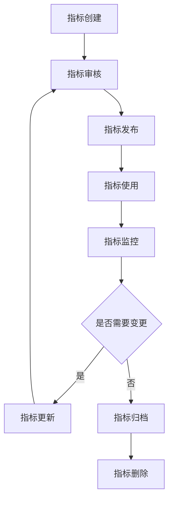
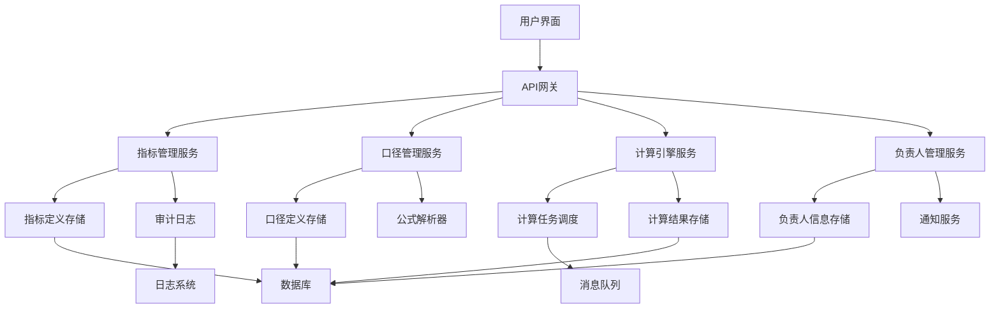

在企业级统一度量平台中，指标注册与管理是确保数据一致性和可管理性的基础。通过建立完善的指标注册与管理机制，企业能够实现指标的标准化定义、规范化管理和可追溯性追踪。本节将深入探讨指标注册与管理的核心要素，包括指标名称定义、口径标准化、计算逻辑管理以及负责人制度，为构建高质量的指标管理体系提供指导。

## 指标注册与管理概述

### 1.1 指标注册的重要性

指标注册是指标管理的第一步，也是确保指标质量和一致性的关键环节。通过规范化的注册流程，可以避免指标重复定义、口径不一致等问题，为后续的指标使用和管理奠定基础。

```yaml
指标注册价值:
  标准化:
    - 统一指标命名规范
    - 规范指标定义标准
    - 确保计算逻辑一致
  可管理性:
    - 明确指标责任人
    - 建立指标生命周期
    - 支持指标版本管理
  可追溯性:
    - 记录指标变更历史
    - 追踪指标使用情况
    - 支持影响分析
  可复用性:
    - 避免重复定义
    - 促进指标共享
    - 提高开发效率
```

### 1.2 指标管理生命周期



## 指标名称定义

### 2.1 命名规范设计

指标名称是指标的唯一标识，需要遵循统一的命名规范，确保名称的清晰性、一致性和可理解性。

```yaml
指标命名规范:
  基本结构:
    - 格式: [业务域].[子域].[指标类型].[指标名称]
    - 示例: business.user.registration.daily.count
  命名元素:
    - 业务域: 指标所属的主要业务领域
    - 子域: 业务域下的具体子领域
    - 指标类型: 指标的分类（如count, rate, amount等）
    - 指标名称: 具体的指标描述
  命名规则:
    - 使用小写字母
    - 单词间用点号分隔
    - 避免使用特殊字符
    - 保持名称简洁明确
```

### 2.2 命名规范实现

#### 2.2.1 命名验证器

```python
class MetricNameValidator:
    def __init__(self):
        self.pattern = re.compile(r'^[a-z][a-z0-9]*([.][a-z][a-z0-9]*)*$')
        self.reserved_words = {'metric', 'indicator', 'measure', 'kpi'}
    
    def validate(self, name):
        """验证指标名称"""
        if not name:
            raise ValueError("指标名称不能为空")
        
        # 检查格式
        if not self.pattern.match(name):
            raise ValueError("指标名称格式不正确，应符合[a-z][a-z0-9]*([.][a-z][a-z0-9]*)*格式")
        
        # 检查长度
        if len(name) > 100:
            raise ValueError("指标名称长度不能超过100个字符")
        
        # 检查保留字
        parts = name.split('.')
        for part in parts:
            if part in self.reserved_words:
                raise ValueError(f"指标名称不能包含保留字: {part}")
        
        # 检查业务域
        if not self._validate_business_domain(parts[0]):
            raise ValueError(f"无效的业务域: {parts[0]}")
        
        return True
    
    def _validate_business_domain(self, domain):
        """验证业务域"""
        valid_domains = {'business', 'system', 'user', 'product', 'finance', 'marketing'}
        return domain in valid_domains
    
    def suggest_name(self, business_domain, sub_domain, metric_type, description):
        """建议指标名称"""
        # 将描述转换为规范格式
        normalized_desc = self._normalize_description(description)
        suggested_name = f"{business_domain}.{sub_domain}.{metric_type}.{normalized_desc}"
        
        # 验证建议名称
        try:
            self.validate(suggested_name)
            return suggested_name
        except ValueError:
            # 如果建议名称无效，添加唯一标识
            unique_suffix = self._generate_unique_suffix()
            return f"{suggested_name}.{unique_suffix}"
    
    def _normalize_description(self, description):
        """规范化描述"""
        # 转换为小写
        desc = description.lower()
        # 移除特殊字符
        desc = re.sub(r'[^a-z0-9\s]', '', desc)
        # 替换空格为下划线
        desc = re.sub(r'\s+', '_', desc)
        # 移除多余下划线
        desc = re.sub(r'_+', '_', desc).strip('_')
        return desc
    
    def _generate_unique_suffix(self):
        """生成唯一后缀"""
        return ''.join(random.choices(string.ascii_lowercase + string.digits, k=6))
```

#### 2.2.2 命名管理服务

```java
@Service
public class MetricNameService {
    
    @Autowired
    private MetricDefinitionRepository repository;
    
    @Autowired
    private MetricNameValidator validator;
    
    public String registerMetricName(MetricNameRegistration registration) {
        // 验证名称
        if (!validator.validate(registration.getName())) {
            throw new IllegalArgumentException("指标名称验证失败");
        }
        
        // 检查重复
        if (repository.existsByName(registration.getName())) {
            throw new DuplicateMetricNameException("指标名称已存在: " + registration.getName());
        }
        
        // 创建指标定义
        MetricDefinition definition = new MetricDefinition();
        definition.setName(registration.getName());
        definition.setDisplayName(registration.getDisplayName());
        definition.setDescription(registration.getDescription());
        definition.setBusinessDomain(registration.getBusinessDomain());
        definition.setStatus(MetricStatus.DRAFT);
        definition.setCreatedAt(LocalDateTime.now());
        definition.setCreatedBy(registration.getCreatedBy());
        
        // 保存定义
        MetricDefinition saved = repository.save(definition);
        
        // 记录审计日志
        auditService.logMetricNameRegistration(saved.getId(), registration.getCreatedBy());
        
        return saved.getName();
    }
    
    public List<String> searchMetricNames(String keyword, int limit) {
        // 搜索匹配的指标名称
        return repository.findByNameContaining(keyword, limit);
    }
    
    public MetricNameInfo getMetricNameInfo(String name) {
        MetricDefinition definition = repository.findByName(name);
        if (definition == null) {
            throw new MetricNameNotFoundException("未找到指标名称: " + name);
        }
        
        return MetricNameInfo.builder()
            .name(definition.getName())
            .displayName(definition.getDisplayName())
            .description(definition.getDescription())
            .businessDomain(definition.getBusinessDomain())
            .status(definition.getStatus())
            .createdAt(definition.getCreatedAt())
            .createdBy(definition.getCreatedBy())
            .build();
    }
}
```

## 指标口径标准化

### 3.1 口径定义要素

指标口径是指标定义的核心，包括计算逻辑、统计范围、时间窗口等关键要素，需要进行标准化管理。

```yaml
指标口径要素:
  基本信息:
    - 指标描述: 指标的业务含义和用途
    - 计量单位: 指标的计量单位
    - 数据类型: 指标的数据类型（整数、小数、百分比等）
  计算逻辑:
    - 计算公式: 指标的计算方法
    - 数据来源: 指标数据的来源系统
    - 聚合方式: 数据聚合方法（求和、平均、最大值等）
  统计范围:
    - 时间范围: 指标统计的时间范围
    - 业务范围: 指标统计的业务范围
    - 过滤条件: 指标统计的过滤条件
  质量要求:
    - 更新频率: 指标的更新频率
    - 可用性要求: 指标的可用性要求
    - 准确性要求: 指标的准确性要求
```

### 3.2 口径管理实现

#### 3.2.1 口径定义模型

```go
type MetricCalibration struct {
    ID             string                 `json:"id"`
    MetricName     string                 `json:"metric_name"`
    Description    string                 `json:"description"`
    Unit           string                 `json:"unit"`
    DataType       string                 `json:"data_type"`
    Calculation    CalculationDefinition  `json:"calculation"`
    Scope          ScopeDefinition        `json:"scope"`
    Quality        QualityRequirements    `json:"quality"`
    Owner          string                 `json:"owner"`
    Version        string                 `json:"version"`
    Status         string                 `json:"status"`
    CreatedAt      time.Time              `json:"created_at"`
    UpdatedAt      time.Time              `json:"updated_at"`
    ApprovedAt     *time.Time             `json:"approved_at,omitempty"`
    ApprovedBy     *string                `json:"approved_by,omitempty"`
}

type CalculationDefinition struct {
    Formula        string                 `json:"formula"`
    DataSource     DataSourceReference    `json:"data_source"`
    Aggregation    string                 `json:"aggregation"`
    TimeWindow     string                 `json:"time_window"`
    Dependencies   []string               `json:"dependencies"`
    Parameters     map[string]interface{} `json:"parameters"`
}

type ScopeDefinition struct {
    TimeRange      TimeRange              `json:"time_range"`
    BusinessScope  BusinessScope          `json:"business_scope"`
    Filters        []FilterCondition      `json:"filters"`
}

type QualityRequirements struct {
    UpdateFrequency string                 `json:"update_frequency"`
    Availability    float64                `json:"availability"`
    Accuracy        float64                `json:"accuracy"`
    Freshness      string                 `json:"freshness"`
}
```

#### 3.2.2 口径验证服务

```python
class MetricCalibrationValidator:
    def __init__(self):
        self.formula_validator = FormulaValidator()
        self.scope_validator = ScopeValidator()
        self.quality_validator = QualityValidator()
    
    def validate(self, calibration):
        """验证指标口径"""
        errors = []
        
        # 验证基本信息
        if not calibration.description:
            errors.append("指标描述不能为空")
        
        if not calibration.unit:
            errors.append("计量单位不能为空")
        
        # 验证计算逻辑
        calculation_errors = self.formula_validator.validate(calibration.calculation)
        errors.extend(calculation_errors)
        
        # 验证统计范围
        scope_errors = self.scope_validator.validate(calibration.scope)
        errors.extend(scope_errors)
        
        # 验证质量要求
        quality_errors = self.quality_validator.validate(calibration.quality)
        errors.extend(quality_errors)
        
        if errors:
            raise ValidationError("指标口径验证失败", errors)
        
        return True
    
    def validate_for_publish(self, calibration):
        """发布前验证"""
        # 执行基本验证
        self.validate(calibration)
        
        # 额外的发布验证
        publish_errors = []
        
        # 验证依赖指标
        for dependency in calibration.calculation.dependencies:
            if not self._is_valid_dependency(dependency):
                publish_errors.append(f"无效的依赖指标: {dependency}")
        
        # 验证数据源可达性
        if not self._is_data_source_accessible(calibration.calculation.data_source):
            publish_errors.append("数据源不可访问")
        
        if publish_errors:
            raise ValidationError("发布验证失败", publish_errors)
        
        return True

class FormulaValidator:
    def validate(self, calculation):
        """验证计算公式"""
        errors = []
        
        if not calculation.formula:
            errors.append("计算公式不能为空")
        
        # 验证公式语法
        try:
            self._parse_formula(calculation.formula)
        except FormulaParseError as e:
            errors.append(f"公式语法错误: {str(e)}")
        
        # 验证聚合方式
        valid_aggregations = {'sum', 'avg', 'max', 'min', 'count', 'distinct_count'}
        if calculation.aggregation not in valid_aggregations:
            errors.append(f"无效的聚合方式: {calculation.aggregation}")
        
        # 验证时间窗口
        if calculation.time_window:
            try:
                self._validate_time_window(calculation.time_window)
            except ValueError as e:
                errors.append(f"时间窗口格式错误: {str(e)}")
        
        return errors
    
    def _parse_formula(self, formula):
        """解析公式"""
        # 实现公式解析逻辑
        # 这里可以使用表达式解析库如 SymPy
        pass
    
    def _validate_time_window(self, time_window):
        """验证时间窗口"""
        # 验证时间窗口格式，如 "1d", "1h", "30m" 等
        pattern = r'^\d+[dhms]$'
        if not re.match(pattern, time_window):
            raise ValueError("时间窗口格式应为数字加时间单位(d/h/m/s)")
```

## 计算逻辑管理

### 4.1 计算逻辑设计

计算逻辑是指标口径的核心，需要支持多种计算方式和复杂的数据处理需求。

```yaml
计算逻辑类型:
  基础计算:
    - 简单聚合: sum, avg, max, min, count
    - 数学运算: +, -, *, /, %
    - 逻辑运算: and, or, not
  复杂计算:
    - 窗口函数: 滑动窗口、累计窗口
    - 条件计算: case when, if else
    - 自定义函数: 用户定义的计算函数
  派生计算:
    - 指标组合: 多个指标的组合计算
    - 比率计算: 两个指标的比率
    - 趋势计算: 同比、环比计算
```

### 4.2 计算引擎实现

#### 4.2.1 计算表达式解析

```java
@Component
public class CalculationEngine {
    
    private final Map<String, CalculationFunction> functions = new HashMap<>();
    
    public CalculationEngine() {
        // 注册内置函数
        registerFunction("sum", new SumFunction());
        registerFunction("avg", new AvgFunction());
        registerFunction("max", new MaxFunction());
        registerFunction("min", new MinFunction());
        registerFunction("count", new CountFunction());
    }
    
    public void registerFunction(String name, CalculationFunction function) {
        functions.put(name.toLowerCase(), function);
    }
    
    public CalculationResult execute(String expression, Map<String, Object> context) {
        // 解析表达式
        ExpressionNode node = parseExpression(expression);
        
        // 执行计算
        return evaluate(node, context);
    }
    
    private ExpressionNode parseExpression(String expression) {
        // 使用表达式解析器解析表达式
        // 这里可以使用 ANTLR 或其他解析器生成器
        return new ExpressionParser().parse(expression);
    }
    
    private CalculationResult evaluate(ExpressionNode node, Map<String, Object> context) {
        switch (node.getType()) {
            case LITERAL:
                return new CalculationResult(node.getValue());
            case VARIABLE:
                Object value = context.get(node.getName());
                return new CalculationResult(value);
            case FUNCTION_CALL:
                return evaluateFunctionCall(node, context);
            case BINARY_OPERATION:
                return evaluateBinaryOperation(node, context);
            default:
                throw new CalculationException("未知的表达式节点类型: " + node.getType());
        }
    }
    
    private CalculationResult evaluateFunctionCall(ExpressionNode node, Map<String, Object> context) {
        String functionName = node.getName().toLowerCase();
        CalculationFunction function = functions.get(functionName);
        
        if (function == null) {
            throw new CalculationException("未知的函数: " + functionName);
        }
        
        // 计算参数
        List<CalculationResult> arguments = new ArrayList<>();
        for (ExpressionNode argNode : node.getArguments()) {
            arguments.add(evaluate(argNode, context));
        }
        
        // 执行函数
        return function.execute(arguments);
    }
    
    private CalculationResult evaluateBinaryOperation(ExpressionNode node, Map<String, Object> context) {
        CalculationResult left = evaluate(node.getLeft(), context);
        CalculationResult right = evaluate(node.getRight(), context);
        
        switch (node.getOperator()) {
            case ADD:
                return add(left, right);
            case SUBTRACT:
                return subtract(left, right);
            case MULTIPLY:
                return multiply(left, right);
            case DIVIDE:
                return divide(left, right);
            case MODULO:
                return modulo(left, right);
            default:
                throw new CalculationException("未知的操作符: " + node.getOperator());
        }
    }
    
    // 数学运算实现
    private CalculationResult add(CalculationResult left, CalculationResult right) {
        if (left.isNumeric() && right.isNumeric()) {
            return new CalculationResult(left.asNumber() + right.asNumber());
        }
        throw new CalculationException("加法运算需要数值类型参数");
    }
    
    private CalculationResult subtract(CalculationResult left, CalculationResult right) {
        if (left.isNumeric() && right.isNumeric()) {
            return new CalculationResult(left.asNumber() - right.asNumber());
        }
        throw new CalculationException("减法运算需要数值类型参数");
    }
    
    // ... 其他运算实现
}

// 函数接口
public interface CalculationFunction {
    CalculationResult execute(List<CalculationResult> arguments);
}

// 聚合函数实现示例
public class SumFunction implements CalculationFunction {
    @Override
    public CalculationResult execute(List<CalculationResult> arguments) {
        if (arguments.isEmpty()) {
            return new CalculationResult(0.0);
        }
        
        double sum = 0.0;
        for (CalculationResult arg : arguments) {
            if (arg.isNumeric()) {
                sum += arg.asNumber();
            } else {
                throw new CalculationException("SUM函数参数必须为数值类型");
            }
        }
        
        return new CalculationResult(sum);
    }
}
```

#### 4.2.2 计算任务调度

```go
type CalculationScheduler struct {
    taskQueue     chan *CalculationTask
    workerPool    []*CalculationWorker
    taskRegistry  TaskRegistry
    metrics       MetricsCollector
}

type CalculationTask struct {
    ID           string
    MetricName   string
    Expression   string
    Schedule     string
    Parameters   map[string]interface{}
    LastRunTime  *time.Time
    NextRunTime  time.Time
    Status       TaskStatus
}

func NewCalculationScheduler(workerCount int) *CalculationScheduler {
    scheduler := &CalculationScheduler{
        taskQueue:   make(chan *CalculationTask, 1000),
        workerPool:  make([]*CalculationWorker, workerCount),
        taskRegistry: NewTaskRegistry(),
    }
    
    // 初始化工作线程
    for i := 0; i < workerCount; i++ {
        worker := NewCalculationWorker(scheduler.taskQueue, scheduler.metrics)
        scheduler.workerPool[i] = worker
        go worker.Start()
    }
    
    return scheduler
}

func (s *CalculationScheduler) ScheduleTask(task *CalculationTask) error {
    // 验证任务
    if err := s.validateTask(task); err != nil {
        return err
    }
    
    // 注册任务
    if err := s.taskRegistry.Register(task); err != nil {
        return err
    }
    
    // 加入任务队列
    select {
    case s.taskQueue <- task:
        s.metrics.IncrementCounter("scheduler.tasks_scheduled", 1)
        return nil
    default:
        return errors.New("任务队列已满")
    }
}

func (s *CalculationScheduler) Start() {
    // 启动调度器
    go s.runScheduler()
    
    // 启动监控
    go s.runMonitor()
}

func (s *CalculationScheduler) runScheduler() {
    ticker := time.NewTicker(1 * time.Minute)
    defer ticker.Stop()
    
    for {
        select {
        case <-ticker.C:
            s.schedulePendingTasks()
        }
    }
}

func (s *CalculationScheduler) schedulePendingTasks() {
    pendingTasks := s.taskRegistry.GetPendingTasks()
    
    for _, task := range pendingTasks {
        if task.NextRunTime.Before(time.Now()) {
            // 更新任务状态
            task.Status = TaskStatusPending
            s.taskRegistry.Update(task)
            
            // 加入执行队列
            select {
            case s.taskQueue <- task:
                s.metrics.IncrementCounter("scheduler.tasks_queued", 1)
            default:
                log.Warn("任务队列已满，跳过任务: %s", task.MetricName)
            }
        }
    }
}
```

## 负责人制度

### 5.1 负责人职责定义

指标负责人制度是确保指标质量和持续维护的重要机制，需要明确定义负责人的职责和权限。

```yaml
指标负责人职责:
  定义管理:
    - 指标定义审核: 审核指标定义的准确性和完整性
    - 口径标准制定: 制定和维护指标口径标准
    - 变更审批: 审批指标定义的变更请求
  质量保障:
    - 质量监控: 监控指标数据质量
    - 问题处理: 处理指标相关的质量问题
    - 持续改进: 持续优化指标定义和计算逻辑
  沟通协调:
    - 跨部门协调: 协调不同部门的指标需求
    - 用户支持: 为指标用户提供技术支持
    - 培训指导: 对用户进行指标使用培训
```

### 5.2 负责人管理实现

#### 5.2.1 责任人管理服务

```python
class MetricOwnerService:
    def __init__(self, user_service, notification_service):
        self.user_service = user_service
        self.notification_service = notification_service
        self.owners = {}  # metric_name -> owner_info
    
    def assign_owner(self, metric_name, owner_info):
        """分配指标负责人"""
        # 验证用户存在
        if not self.user_service.user_exists(owner_info.user_id):
            raise ValueError(f"用户不存在: {owner_info.user_id}")
        
        # 验证权限
        if not self.user_service.has_role(owner_info.user_id, 'METRIC_OWNER'):
            raise ValueError(f"用户没有指标负责人权限: {owner_info.user_id}")
        
        # 保存负责人信息
        self.owners[metric_name] = owner_info
        
        # 记录审计日志
        self._log_owner_assignment(metric_name, owner_info)
        
        # 发送通知
        self._notify_owner_assignment(metric_name, owner_info)
        
        return True
    
    def get_owner(self, metric_name):
        """获取指标负责人"""
        return self.owners.get(metric_name)
    
    def transfer_ownership(self, metric_name, new_owner_info, reason):
        """转移指标所有权"""
        current_owner = self.get_owner(metric_name)
        if not current_owner:
            raise ValueError(f"指标 {metric_name} 没有负责人")
        
        # 分配新负责人
        self.assign_owner(metric_name, new_owner_info)
        
        # 通知原负责人
        self._notify_ownership_transfer(
            metric_name, 
            current_owner, 
            new_owner_info, 
            reason
        )
        
        # 记录转移历史
        self._log_ownership_transfer(
            metric_name, 
            current_owner, 
            new_owner_info, 
            reason
        )
        
        return True
    
    def _log_owner_assignment(self, metric_name, owner_info):
        """记录负责人分配日志"""
        log_entry = {
            'event_type': 'OWNER_ASSIGNMENT',
            'metric_name': metric_name,
            'owner_id': owner_info.user_id,
            'assigned_by': owner_info.assigned_by,
            'assigned_at': datetime.now().isoformat(),
            'reason': owner_info.assignment_reason
        }
        self._save_audit_log(log_entry)
    
    def _notify_owner_assignment(self, metric_name, owner_info):
        """通知负责人分配"""
        message = f"您已被分配为指标 '{metric_name}' 的负责人"
        self.notification_service.send_notification(
            owner_info.user_id,
            'METRIC_OWNER_ASSIGNMENT',
            message,
            {
                'metric_name': metric_name,
                'assignment_reason': owner_info.assignment_reason
            }
        )
```

#### 5.2.2 责任追踪机制

```java
@Entity
@Table(name = "metric_ownership")
public class MetricOwnership {
    @Id
    private String id;
    
    @Column(name = "metric_name")
    private String metricName;
    
    @Column(name = "owner_id")
    private String ownerId;
    
    @Column(name = "owner_name")
    private String ownerName;
    
    @Column(name = "assigned_by")
    private String assignedBy;
    
    @Column(name = "assigned_at")
    private LocalDateTime assignedAt;
    
    @Column(name = "assignment_reason")
    private String assignmentReason;
    
    @Column(name = "status")
    private OwnershipStatus status;  // ACTIVE, INACTIVE, TRANSFERRED
    
    @Column(name = "transferred_to")
    private String transferredTo;
    
    @Column(name = "transferred_at")
    private LocalDateTime transferredAt;
    
    @Column(name = "created_at")
    private LocalDateTime createdAt;
    
    @Column(name = "updated_at")
    private LocalDateTime updatedAt;
    
    // getter和setter方法
}

@Service
public class OwnershipTrackingService {
    
    @Autowired
    private MetricOwnershipRepository repository;
    
    @Autowired
    private NotificationService notificationService;
    
    public void trackOwnershipChange(MetricOwnership ownership) {
        // 保存所有权变更记录
        repository.save(ownership);
        
        // 发送通知
        sendOwnershipNotification(ownership);
        
        // 更新指标定义中的负责人信息
        updateMetricDefinitionOwner(ownership.getMetricName(), ownership.getOwnerId());
    }
    
    public List<MetricOwnership> getOwnershipHistory(String metricName) {
        return repository.findByMetricNameOrderByAssignedAtDesc(metricName);
    }
    
    public MetricOwnership getCurrentOwner(String metricName) {
        return repository.findFirstByMetricNameAndStatusOrderByAssignedAtDesc(
            metricName, OwnershipStatus.ACTIVE);
    }
    
    private void sendOwnershipNotification(MetricOwnership ownership) {
        // 发送给新负责人
        notificationService.sendNotification(
            ownership.getOwnerId(),
            "METRIC_OWNERSHIP_ASSIGNED",
            String.format("您已被分配为指标 %s 的负责人", ownership.getMetricName()),
            ownership
        );
        
        // 如果是转移，发送给原负责人
        if (ownership.getTransferredTo() != null) {
            notificationService.sendNotification(
                ownership.getAssignedBy(),
                "METRIC_OWNERSHIP_TRANSFERRED",
                String.format("指标 %s 的负责人已转移给 %s", 
                            ownership.getMetricName(), 
                            ownership.getTransferredTo()),
                ownership
            );
        }
    }
}
```

## 指标注册与管理平台

### 6.1 平台架构设计



### 6.2 平台功能实现

#### 6.2.1 指标注册API

```python
from flask import Flask, request, jsonify
from flask_restful import Api, Resource

app = Flask(__name__)
api = Api(app)

class MetricRegistrationAPI(Resource):
    def __init__(self):
        self.metric_service = MetricService()
        self.validator = MetricValidator()
    
    def post(self):
        """注册新指标"""
        try:
            # 获取请求数据
            data = request.get_json()
            
            # 验证数据
            validation_result = self.validator.validate_registration_data(data)
            if not validation_result.is_valid:
                return {
                    'success': False,
                    'errors': validation_result.errors
                }, 400
            
            # 创建指标定义
            metric_definition = MetricDefinition(
                name=data['name'],
                display_name=data['display_name'],
                description=data['description'],
                business_domain=data['business_domain'],
                calibration=data['calibration'],
                owner=data['owner']
            )
            
            # 注册指标
            registered_metric = self.metric_service.register_metric(metric_definition)
            
            return {
                'success': True,
                'data': {
                    'metric_id': registered_metric.id,
                    'metric_name': registered_metric.name,
                    'status': registered_metric.status
                }
            }, 201
            
        except DuplicateMetricException as e:
            return {
                'success': False,
                'error': '指标已存在',
                'details': str(e)
            }, 409
        except Exception as e:
            return {
                'success': False,
                'error': '注册失败',
                'details': str(e)
            }, 500
    
    def get(self, metric_name=None):
        """查询指标信息"""
        if metric_name:
            # 查询单个指标
            try:
                metric = self.metric_service.get_metric(metric_name)
                return {
                    'success': True,
                    'data': metric.to_dict()
                }, 200
            except MetricNotFoundException:
                return {
                    'success': False,
                    'error': '指标不存在'
                }, 404
        else:
            # 查询指标列表
            query_params = request.args.to_dict()
            metrics = self.metric_service.search_metrics(query_params)
            return {
                'success': True,
                'data': [m.to_dict() for m in metrics]
            }, 200

class MetricApprovalAPI(Resource):
    def __init__(self):
        self.approval_service = MetricApprovalService()
    
    def post(self, metric_name):
        """审批指标"""
        data = request.get_json()
        approver = data.get('approver')
        approval_result = data.get('result')
        comments = data.get('comments')
        
        try:
            if approval_result == 'APPROVED':
                self.approval_service.approve_metric(metric_name, approver, comments)
            elif approval_result == 'REJECTED':
                self.approval_service.reject_metric(metric_name, approver, comments)
            else:
                return {
                    'success': False,
                    'error': '无效的审批结果'
                }, 400
            
            return {
                'success': True,
                'message': f'指标 {metric_name} 审批完成'
            }, 200
            
        except Exception as e:
            return {
                'success': False,
                'error': '审批失败',
                'details': str(e)
            }, 500

# 注册API路由
api.add_resource(MetricRegistrationAPI, '/api/metrics', '/api/metrics/<string:metric_name>')
api.add_resource(MetricApprovalAPI, '/api/metrics/<string:metric_name>/approval')
```

#### 6.2.2 前端管理界面

```jsx
// 指标注册表单组件
import React, { useState } from 'react';
import { Form, Input, Select, Button, Card, message } from 'antd';

const MetricRegistrationForm = () => {
  const [form] = Form.useForm();
  const [loading, setLoading] = useState(false);
  
  const onFinish = async (values) => {
    setLoading(true);
    try {
      const response = await fetch('/api/metrics', {
        method: 'POST',
        headers: {
          'Content-Type': 'application/json',
        },
        body: JSON.stringify(values),
      });
      
      const result = await response.json();
      
      if (result.success) {
        message.success('指标注册成功');
        form.resetFields();
      } else {
        message.error(`注册失败: ${result.error}`);
      }
    } catch (error) {
      message.error('网络错误，请稍后重试');
    } finally {
      setLoading(false);
    }
  };
  
  return (
    <Card title="指标注册" style={{ margin: 20 }}>
      <Form
        form={form}
        layout="vertical"
        onFinish={onFinish}
      >
        <Form.Item
          name="name"
          label="指标名称"
          rules={[{ required: true, message: '请输入指标名称' }]}
        >
          <Input placeholder="例如: business.user.registration.daily.count" />
        </Form.Item>
        
        <Form.Item
          name="display_name"
          label="显示名称"
          rules={[{ required: true, message: '请输入显示名称' }]}
        >
          <Input placeholder="例如: 日用户注册数" />
        </Form.Item>
        
        <Form.Item
          name="description"
          label="指标描述"
          rules={[{ required: true, message: '请输入指标描述' }]}
        >
          <Input.TextArea rows={4} placeholder="详细描述指标的业务含义和用途" />
        </Form.Item>
        
        <Form.Item
          name="business_domain"
          label="业务域"
          rules={[{ required: true, message: '请选择业务域' }]}
        >
          <Select placeholder="选择业务域">
            <Select.Option value="business">业务指标</Select.Option>
            <Select.Option value="system">系统指标</Select.Option>
            <Select.Option value="user">用户指标</Select.Option>
            <Select.Option value="product">产品指标</Select.Option>
          </Select>
        </Form.Item>
        
        <Form.Item
          name="owner"
          label="负责人"
          rules={[{ required: true, message: '请输入负责人' }]}
        >
          <Input placeholder="负责人用户ID或邮箱" />
        </Form.Item>
        
        <Form.Item>
          <Button type="primary" htmlType="submit" loading={loading}>
            注册指标
          </Button>
        </Form.Item>
      </Form>
    </Card>
  );
};

export default MetricRegistrationForm;
```

## 实施案例

### 7.1 案例1：某互联网公司的指标管理体系

该公司通过以下方式实现了指标注册与管理：

1. **建立标准化流程**：
   - 制定指标命名规范和口径标准
   - 建立指标注册和审批流程
   - 实施指标负责人制度

2. **开发管理平台**：
   - 构建指标注册和管理平台
   - 实现指标全生命周期管理
   - 提供可视化监控界面

3. **持续优化改进**：
   - 定期评估指标质量
   - 收集用户反馈
   - 持续优化管理流程

### 7.2 案例2：某金融机构的指标治理实践

该机构根据金融行业的特殊要求，采用了以下治理策略：

1. **严格的合规要求**：
   - 制定符合监管要求的指标标准
   - 建立指标审计机制
   - 实施指标追溯体系

2. **完善的风险控制**：
   - 建立指标风险评估模型
   - 实施指标风险监控
   - 建立应急处理机制

3. **先进的技术工具**：
   - 部署企业级指标管理平台
   - 实现智能化的指标分析
   - 建立指标可视化展示

## 实施建议

### 8.1 实施策略

1. **分步实施**：从核心业务指标开始，逐步扩展到其他指标
2. **试点先行**：选择典型场景进行试点，验证方案可行性
3. **持续改进**：根据实施效果持续优化标准和流程
4. **全员参与**：确保各相关部门和人员参与治理工作

### 8.2 技术选型

1. **成熟稳定**：选择经过验证的成熟技术和工具
2. **开放标准**：优先选择支持开放标准的解决方案
3. **可扩展性**：考虑未来的扩展需求和技术演进
4. **成本效益**：平衡功能需求和实施成本

### 8.3 最佳实践

1. **文档完善**：建立完整的标准文档和实施指南
2. **培训宣贯**：加强相关人员的培训和宣贯
3. **监控评估**：建立标准执行的监控和评估机制
4. **激励机制**：建立标准执行的激励和约束机制

## 总结

指标注册与管理是企业级统一度量平台成功的关键基础。通过建立完善的指标命名规范、口径标准化、计算逻辑管理和负责人制度，可以确保指标的一致性、准确性和可管理性。

在实施过程中，需要结合业务特点和技术环境，选择合适的管理方法和技术工具。同时，要注重自动化和智能化技术的应用，提高指标管理的效率和效果。通过持续的改进和优化，构建起高质量的指标管理体系，为企业的数据驱动决策提供坚实的基础。

在下一节中，我们将探讨如何建立企业级指标字典，确保指标定义的标准化和一致性。