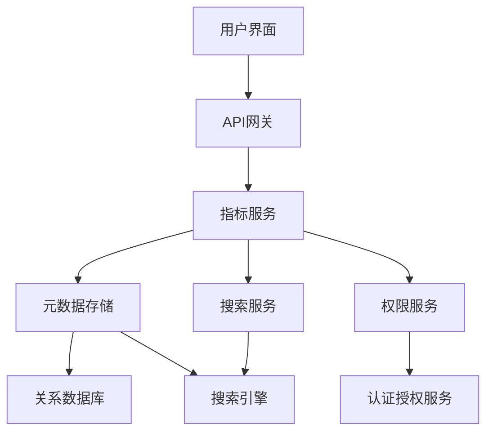
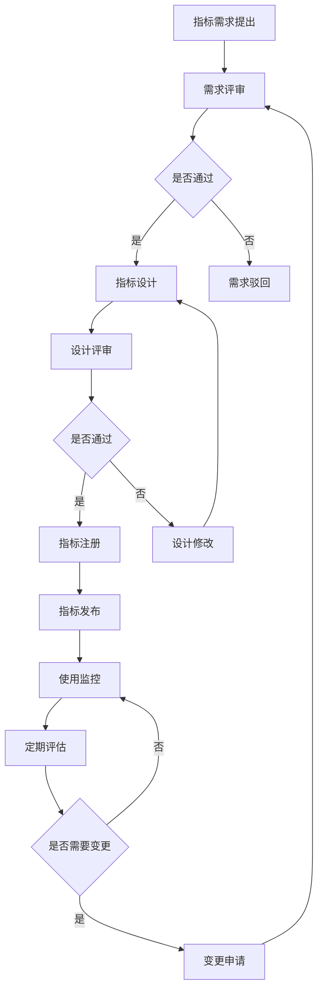

在企业级统一度量平台建设中，指标歧义是一个常见但严重的问题。当不同团队对同一指标有不同的理解和计算方式时，会导致数据不一致、决策失误和信任危机。本节将深入探讨如何通过建立企业级指标字典来避免指标歧义，确保指标定义的统一性和准确性。

## 指标歧义的根源与危害

### 1.1 指标歧义的产生原因

指标歧义的产生往往源于以下几个方面：

#### 1.1.1 术语理解差异

不同业务部门对同一术语可能有不同的理解。例如，"活跃用户"在市场部门可能指过去30天内访问过产品的用户，而在产品部门可能指过去7天内有过核心操作的用户。

```yaml
术语理解差异示例:
  活跃用户:
    市场部定义: 过去30天内访问过产品的用户
    产品部定义: 过去7天内有过核心操作的用户
    技术部定义: 过去24小时内与服务器有过交互的用户
  收入:
    财务部定义: 确认收入（已扣除退款和折扣）
    业务部定义: 订单总额（未扣除退款和折扣）
    市场部定义: GMV（商品交易总额）
```

#### 1.1.2 计算逻辑不一致

即使对术语有相同的理解，不同的团队在计算逻辑上也可能存在差异。例如，计算"用户留存率"时，分母的选择就可能不同。

```sql
-- 不同的用户留存率计算方式
-- 方式1：基于注册用户计算
SELECT 
  COUNT(DISTINCT CASE WHEN registration_date = '2025-01-01' THEN user_id END) as cohort_size,
  COUNT(DISTINCT CASE WHEN registration_date = '2025-01-01' AND last_active_date >= '2025-02-01' THEN user_id END) as retained_users,
  (retained_users / cohort_size) * 100 as retention_rate
FROM users;

-- 方式2：基于活跃用户计算
SELECT 
  COUNT(DISTINCT CASE WHEN active_date = '2025-01-01' THEN user_id END) as cohort_size,
  COUNT(DISTINCT CASE WHEN active_date = '2025-01-01' AND active_date >= '2025-02-01' THEN user_id END) as retained_users,
  (retained_users / cohort_size) * 100 as retention_rate
FROM user_activities;
```

#### 1.1.3 数据源差异

不同团队可能使用不同的数据源来计算同一指标，导致结果不一致。例如，销售数据可能同时存在于CRM系统和财务系统中，但两个系统的数据可能存在差异。

### 1.2 指标歧义的危害

指标歧义会带来一系列严重后果：

```yaml
指标歧义的危害:
  决策失误:
    - 基于不一致的数据做出错误决策
    - 无法准确评估业务表现
    - 影响战略规划和资源配置
  效率低下:
    - 团队间需要花费大量时间对齐数据
    - 重复计算和验证工作
    - 降低协作效率
  信任危机:
    - 对数据平台失去信任
    - 质疑数据的准确性和权威性
    - 影响数据驱动文化的建立
```

## 企业级指标字典的设计原则

### 2.1 统一性原则

指标字典必须确保所有指标定义的统一性，包括：

1. **术语统一**：使用统一的业务术语
2. **定义统一**：明确指标的计算逻辑和口径
3. **数据源统一**：指定权威数据源
4. **更新机制统一**：建立统一的指标变更流程

### 2.2 完整性原则

指标字典应覆盖企业所有关键业务领域：

```yaml
指标字典覆盖范围:
  业务指标:
    - 核心业务指标（收入、用户数、订单量等）
    - 产品指标（活跃度、留存率、转化率等）
    - 市场指标（获客成本、生命周期价值等）
  技术指标:
    - 系统性能指标（响应时间、吞吐量等）
    - 可靠性指标（可用性、故障率等）
    - 运维指标（资源利用率、部署频率等）
  组织效能指标:
    - 研发效能（交付周期、变更失败率等）
    - 团队协作（响应时间、协作效率等）
    - 人才发展（技能成长、满意度等）
```

### 2.3 可追溯性原则

每个指标都应具备完整的血缘关系和变更历史：

1. **血缘追踪**：记录指标的数据来源和计算过程
2. **版本管理**：维护指标定义的版本历史
3. **变更记录**：记录每次变更的原因和影响

### 2.4 可访问性原则

指标字典应便于所有相关方访问和使用：

1. **可视化界面**：提供友好的查询界面
2. **搜索功能**：支持按关键词、分类等条件搜索
3. **导出功能**：支持导出指标定义和说明

## 指标字典的核心要素

### 3.1 指标基本信息

每个指标应包含以下基本信息：

```yaml
指标基本信息:
  指标名称:
    - 中文名称
    - 英文名称
    - 缩写/别名
  指标ID:
    - 全局唯一标识符
    - 命名规范（如：biz_user_active_daily）
  所属领域:
    - 业务领域（如：用户、收入、产品等）
    - 技术领域（如：性能、可靠性等）
  指标类型:
    - 原子指标
    - 派生指标
    - 复合指标
```

### 3.2 指标定义与计算逻辑

详细的指标定义和计算逻辑是指标字典的核心：

```yaml
指标定义与计算逻辑:
  业务定义:
    - 业务含义的详细描述
    - 使用场景说明
    - 业务价值阐述
  技术定义:
    - 计算公式
    - 数据来源
    - 计算逻辑详细说明
  统计维度:
    - 时间维度（日、周、月等）
    - 业务维度（地区、产品、渠道等）
  统计周期:
    - 计算频率（实时、每日、每周等）
    - 数据延迟要求
```

### 3.3 质量标准与监控

为每个指标定义质量标准和监控机制：

```yaml
质量标准与监控:
  数据质量要求:
    - 完整性标准（如：数据完整率>99%）
    - 准确性标准（如：误差范围<1%）
    - 及时性标准（如：T+1小时内可用）
  监控规则:
    - 异常检测阈值
    - 趋势变化预警
    - 数据一致性检查
  告警机制:
    - 告警接收人
    - 告警级别
    - 处理流程
```

### 3.4 责任人与权限

明确每个指标的责任人和使用权限：

```yaml
责任人与权限:
  指标负责人:
    - 定义和维护责任人
    - 业务解释责任人
    - 质量保障责任人
  使用权限:
    - 查看权限
    - 编辑权限
    - 管理权限
  协作机制:
    - 跨团队协作流程
    - 变更审批流程
    - 争议解决机制
```

## 指标字典的技术实现

### 4.1 架构设计

指标字典的技术架构应支持高可用、高性能和易扩展：



### 4.2 数据模型设计

设计合理的数据模型来存储指标信息：

```sql
-- 指标基本信息表
CREATE TABLE metric_definitions (
    id VARCHAR(64) PRIMARY KEY,
    name_cn VARCHAR(255) NOT NULL,
    name_en VARCHAR(255) NOT NULL,
    domain VARCHAR(100),
    type VARCHAR(50),
    description TEXT,
    business_definition TEXT,
    technical_definition TEXT,
    calculation_logic TEXT,
    data_source VARCHAR(255),
    created_by VARCHAR(100),
    created_at TIMESTAMP,
    updated_by VARCHAR(100),
    updated_at TIMESTAMP
);

-- 指标维度表
CREATE TABLE metric_dimensions (
    id SERIAL PRIMARY KEY,
    metric_id VARCHAR(64),
    dimension_name VARCHAR(100),
    dimension_type VARCHAR(50),
    FOREIGN KEY (metric_id) REFERENCES metric_definitions(id)
);

-- 指标版本历史表
CREATE TABLE metric_versions (
    id SERIAL PRIMARY KEY,
    metric_id VARCHAR(64),
    version VARCHAR(20),
    definition JSONB,
    change_log TEXT,
    changed_by VARCHAR(100),
    changed_at TIMESTAMP,
    FOREIGN KEY (metric_id) REFERENCES metric_definitions(id)
);
```

### 4.3 核心功能实现

#### 4.3.1 指标注册功能

```java
@Service
public class MetricRegistryService {
    
    @Autowired
    private MetricDefinitionRepository metricRepository;
    
    @Autowired
    private MetricVersionRepository versionRepository;
    
    public MetricDefinition registerMetric(MetricDefinitionDTO metricDTO) {
        // 验证指标ID唯一性
        if (metricRepository.existsById(metricDTO.getId())) {
            throw new DuplicateMetricException("指标ID已存在: " + metricDTO.getId());
        }
        
        // 创建指标定义
        MetricDefinition metric = new MetricDefinition();
        metric.setId(metricDTO.getId());
        metric.setNameCn(metricDTO.getNameCn());
        metric.setNameEn(metricDTO.getNameEn());
        metric.setDomain(metricDTO.getDomain());
        metric.setType(metricDTO.getType());
        metric.setDescription(metricDTO.getDescription());
        metric.setBusinessDefinition(metricDTO.getBusinessDefinition());
        metric.setTechnicalDefinition(metricDTO.getTechnicalDefinition());
        metric.setCalculationLogic(metricDTO.getCalculationLogic());
        metric.setDataSource(metricDTO.getDataSource());
        metric.setCreatedBy(metricDTO.getCreatedBy());
        metric.setCreatedAt(new Timestamp(System.currentTimeMillis()));
        
        // 保存指标定义
        MetricDefinition savedMetric = metricRepository.save(metric);
        
        // 创建初始版本
        MetricVersion initialVersion = new MetricVersion();
        initialVersion.setMetricId(savedMetric.getId());
        initialVersion.setVersion("1.0");
        initialVersion.setDefinition(convertToJSON(savedMetric));
        initialVersion.setChangeLog("初始版本");
        initialVersion.setChangedBy(metricDTO.getCreatedBy());
        initialVersion.setChangedAt(new Timestamp(System.currentTimeMillis()));
        
        versionRepository.save(initialVersion);
        
        return savedMetric;
    }
}
```

#### 4.3.2 指标搜索功能

```python
class MetricSearchService:
    def __init__(self, elasticsearch_client):
        self.es_client = elasticsearch_client
    
    def search_metrics(self, query, filters=None, page=1, size=20):
        """
        搜索指标
        :param query: 搜索关键词
        :param filters: 过滤条件
        :param page: 页码
        :param size: 每页大小
        :return: 搜索结果
        """
        search_body = {
            "query": {
                "bool": {
                    "must": [
                        {
                            "multi_match": {
                                "query": query,
                                "fields": ["name_cn", "name_en", "description", "business_definition"]
                            }
                        }
                    ]
                }
            },
            "from": (page - 1) * size,
            "size": size
        }
        
        # 添加过滤条件
        if filters:
            filter_conditions = []
            for key, value in filters.items():
                if value:
                    filter_conditions.append({
                        "term": {f"{key}.keyword": value}
                    })
            
            if filter_conditions:
                search_body["query"]["bool"]["filter"] = filter_conditions
        
        # 执行搜索
        response = self.es_client.search(
            index="metric_definitions",
            body=search_body
        )
        
        return {
            "total": response["hits"]["total"]["value"],
            "metrics": [hit["_source"] for hit in response["hits"]["hits"]]
        }
```

#### 4.3.3 指标血缘追踪

```javascript
class MetricLineageService {
    constructor(metricRepository, dataLineageService) {
        this.metricRepository = metricRepository;
        this.dataLineageService = dataLineageService;
    }
    
    async getMetricLineage(metricId) {
        // 获取指标定义
        const metric = await this.metricRepository.findById(metricId);
        if (!metric) {
            throw new Error(`指标不存在: ${metricId}`);
        }
        
        // 构建血缘关系
        const lineage = {
            metric: metric,
            sources: [],
            derivedMetrics: []
        };
        
        // 获取数据源血缘
        if (metric.dataSource) {
            const sourceLineage = await this.dataLineageService.getLineage(metric.dataSource);
            lineage.sources = sourceLineage;
        }
        
        // 获取派生指标
        const derivedMetrics = await this.metricRepository.findDerivedMetrics(metricId);
        lineage.derivedMetrics = derivedMetrics;
        
        return lineage;
    }
}
```

## 指标字典的治理机制

### 5.1 组织治理结构

建立专门的指标治理组织：

```yaml
指标治理组织:
  指标治理委员会:
    - 负责制定指标治理策略
    - 审批重要指标定义
    - 仲裁指标争议
    - 监督指标质量
  指标管理团队:
    - 负责指标字典的日常维护
    - 执行指标注册和变更流程
    - 监控指标质量
    - 提供指标使用支持
  领域专家:
    - 各业务领域的指标专家
    - 参与指标定义评审
    - 提供专业建议
```

### 5.2 流程治理机制

建立标准化的指标管理流程：



### 5.3 质量保障机制

建立完善的指标质量保障机制：

```yaml
质量保障机制:
  准入控制:
    - 指标定义模板标准化
    - 必填字段校验
    - 重复性检查
  过程监控:
    - 指标变更审批流程
    - 影响评估机制
    - 回滚机制
  结果验证:
    - 数据一致性校验
    - 业务逻辑验证
    - 异常检测告警
```

## 实施案例与最佳实践

### 6.1 案例1：某互联网公司的指标字典建设

该公司通过以下步骤成功建设了企业级指标字典：

1. **顶层设计**：
   - 成立指标治理委员会
   - 制定指标管理规范
   - 确定技术架构方案

2. **分步实施**：
   - 第一阶段：核心业务指标字典建设
   - 第二阶段：技术指标字典建设
   - 第三阶段：组织效能指标字典建设

3. **持续优化**：
   - 建立指标质量监控体系
   - 定期评估和优化指标定义
   - 持续完善工具链

### 6.2 案例2：某金融机构的指标治理实践

该机构在指标治理方面有以下特点：

1. **合规导向**：
   - 指标定义符合监管要求
   - 建立审计追踪机制
   - 确保数据可追溯性

2. **风险控制**：
   - 建立指标风险评估机制
   - 设置多重校验环节
   - 实施权限分级管理

3. **文化培育**：
   - 开展指标治理培训
   - 建立激励机制
   - 推广数据驱动文化

### 6.3 最佳实践总结

基于多个实施案例，总结出以下最佳实践：

```yaml
最佳实践:
  顶层设计:
    - 获得高层支持和授权
    - 建立专职治理组织
    - 制定清晰的治理策略
  分步实施:
    - 从核心指标开始建设
    - 逐步扩展到全量指标
    - 边实施边优化流程
  工具支撑:
    - 建设统一的指标管理平台
    - 集成数据血缘追踪能力
    - 提供便捷的查询和使用接口
  文化建设:
    - 培养指标治理意识
    - 建立数据质量文化
    - 持续推广最佳实践
```

## 实施建议与注意事项

### 7.1 实施建议

1. **获得组织支持**：
   - 争取高层领导的支持
   - 建立跨部门协作机制
   - 明确各方职责和角色

2. **循序渐进推进**：
   - 从关键业务指标开始
   - 逐步扩展到全量指标
   - 边做边优化流程和工具

3. **注重用户体验**：
   - 提供友好的查询界面
   - 支持多种搜索方式
   - 提供详细的指标说明

### 7.2 注意事项

1. **避免过度设计**：
   - 不要一开始就追求完美
   - 根据实际需求逐步完善
   - 保持系统的简洁性

2. **重视数据质量**：
   - 建立数据质量监控机制
   - 及时发现和处理数据异常
   - 确保指标计算的准确性

3. **持续维护更新**：
   - 建立指标变更管理流程
   - 定期评估指标的有效性
   - 及时更新指标定义

## 总结

建立企业级指标字典是解决指标歧义问题的关键举措。通过统一的指标定义、清晰的计算逻辑、明确的责任分工和完善的治理机制，可以有效避免因指标理解不一致而导致的决策失误和效率低下。

在实施过程中，需要重点关注以下几个方面：

1. **顶层设计**：获得组织支持，建立治理结构
2. **标准规范**：制定统一的指标定义标准和管理流程
3. **技术实现**：建设易用、可靠的指标管理平台
4. **持续运营**：建立质量保障机制和持续优化流程

只有通过系统性的方法，才能真正建立起企业级的指标字典，为数据驱动决策提供坚实的基础。在下一节中，我们将探讨派生指标与复合指标的设计与管理，进一步丰富指标体系的内涵。